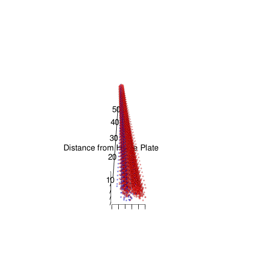

Interactive 3D Graphics of PITCHf/x Data
=======================================

<!--- view local page:
browseURL(paste0('http://127.0.0.1:', tools:::httpdPort, '/library/pitchRx/doc/index.html'))
-->

Good thing I follow everything my current T.A. [Yihui Xie](http://yihui.name) does when he isn't grading my bayes homework. Otherwise, I wouldn't have known about the wonderful [rgl](http://cran.r-project.org/web/packages/rgl/index.html) package - and it's [seamless html integration via knitr](https://twitter.com/xieyihui/status/302513617906044930).

I am absolutely giddy over the features rgl will add to my recently released R package [pitchRx](http://cran.r-project.org/web/packages/pitchRx/). Note that this example depends on developmental version of [pitchRx on github](https://github.com/cpsievert/), so if you're on windows, install [RTools](http://cran.rstudio.com/bin/windows/Rtools/) before installing [devtools](http://cran.r-project.org/web/packages/devtools/index.html).


```r
library(devtools)  #must be installed first
library(knitr)  #I'm using version 1.1
setwd("~/Desktop/github/local/pitchRx")
install(".")
require(pitchRx)
```


After pitchRx is loaded, I can bring in the sample dataset, then restrict to pitches thrown by Mariano Rivera's.  Next, a simple call to `rglFX` automatically generates an interactive 3D scatterplot (hold and drag your mouse on the scatterplot below - you can also zoom in and out). **rgl** currently has no support for including legends, so `rglFX` also prints the appropriate hex color codes in your R console.


```r
data(pitches)
Rivera <- subset(pitches, pitcher_name == "Mariano Rivera")
rglFX(Rivera, spheres = FALSE, alpha = 0.5)
```

```
## [1] "Here is the coloring scheme for your plot. Use http://www.colorhexa.com/ to translate color codes."
##            pitch_types  colors
## 1    Fastball (cutter) #FF0000
## 2 Fastball (four-seam) #0000FF
```

```r
rglFX(Rivera, interval = 0.05)  #interval between 'snapshots' is measured in seconds
```

```
## [1] "Here is the coloring scheme for your plot. Use http://www.colorhexa.com/ to translate color codes."
##            pitch_types  colors
## 1    Fastball (cutter) #FF0000
## 2 Fastball (four-seam) #0000FF
```

```r
rglFX(Rivera, interval = 0.05, color = "type")
```

```
## [1] "Here is the coloring scheme for your plot. Use http://www.colorhexa.com/ to translate color codes."
##   type  colors
## 1    S #FF0000
## 2    X #00FF00
## 3    B #0000FF
```

<script src="CanvasMatrix.js" type="text/javascript"></script>
<canvas id="textureCanvas" style="display: none;" width="256" height="256">
<br>
	Your browser does not support the HTML5 canvas element.</canvas>
<!-- ****** spheres object 29 ****** -->
<script id="vshader29" type="x-shader/x-vertex">
	attribute vec3 aPos;
	attribute vec4 aCol;
	uniform mat4 mvMatrix;
	uniform mat4 prMatrix;
	varying vec4 vDiffuse;
	attribute vec3 aNorm;
	uniform mat4 normMatrix;
	varying vec3 vNormal;
	const vec3 diffuse = vec3(1., 1., 1.); // light only
	void main(void) {
	  gl_Position = prMatrix * mvMatrix * vec4(aPos, 1.);
	  vDiffuse = vec4(aCol.rgb * diffuse, aCol.a);
	  vNormal = normalize((normMatrix * vec4(aNorm, 1.)).xyz);
	}
</script>
<script id="fshader29" type="x-shader/x-fragment"> 
	#ifdef GL_ES
	precision highp float;
	#endif
	varying vec4 vDiffuse; // carries alpha
	const vec3 ambient_plus_emission = vec3(0., 0., 0.);
	const vec3 specular = vec3(1., 1., 1.);// light*material
	const float shininess = 50.;
	const vec3 lightDir = vec3(0., 0., 1.);
	const vec3 halfVec = vec3(0., 0., 1.);
	const vec3 eye = vec3(0., 0., 1.);
	varying vec3 vNormal;
	void main(void) {
	  vec4 diffuse;
	  vec3 n = normalize(vNormal);
	  vec3 col = ambient_plus_emission;
	  n = -faceforward(n, n, eye);
	  float nDotL = dot(n, lightDir);
	  col = col + max(nDotL, 0.) * vDiffuse.rgb;
	  col = col + pow(max(dot(halfVec, n), 0.), shininess) * specular;
	  diffuse = vec4(col, vDiffuse.a);
	  gl_FragColor = diffuse;
	}
</script> 
<!-- ****** lines object 30 ****** -->
<script id="vshader30" type="x-shader/x-vertex">
	attribute vec3 aPos;
	attribute vec4 aCol;
	uniform mat4 mvMatrix;
	uniform mat4 prMatrix;
	varying vec4 vDiffuse;
	void main(void) {
	  gl_Position = prMatrix * mvMatrix * vec4(aPos, 1.);
	  vDiffuse = aCol;
	}
</script>
<script id="fshader30" type="x-shader/x-fragment"> 
	#ifdef GL_ES
	precision highp float;
	#endif
	varying vec4 vDiffuse; // carries alpha
	void main(void) {
	  vec4 diffuse;
	  diffuse = vDiffuse;
	  gl_FragColor = diffuse;
	}
</script> 
<!-- ****** text object 31 ****** -->
<script id="vshader31" type="x-shader/x-vertex">
	attribute vec3 aPos;
	attribute vec4 aCol;
	uniform mat4 mvMatrix;
	uniform mat4 prMatrix;
	varying vec4 vDiffuse;
	attribute vec2 aTexcoord;
	varying vec2 vTexcoord;
	attribute vec2 aOfs;
	void main(void) {
	  vDiffuse = aCol;
	  vTexcoord = aTexcoord;
	  vec4 pos = prMatrix * mvMatrix * vec4(aPos, 1.);
	  pos = pos/pos.w;
	  gl_Position = pos + vec4(aOfs, 0.,0.);
	}
</script>
<script id="fshader31" type="x-shader/x-fragment"> 
	#ifdef GL_ES
	precision highp float;
	#endif
	varying vec4 vDiffuse; // carries alpha
	varying vec2 vTexcoord;
	uniform sampler2D uSampler;
	void main(void) {
	  vec4 diffuse;
	  diffuse = vDiffuse;
	  vec4 textureColor = diffuse*texture2D(uSampler, vTexcoord);
	  if (textureColor.a < 0.1)
	    discard;
	  else
	    gl_FragColor = textureColor;
	}
</script> 
<!-- ****** lines object 32 ****** -->
<script id="vshader32" type="x-shader/x-vertex">
	attribute vec3 aPos;
	attribute vec4 aCol;
	uniform mat4 mvMatrix;
	uniform mat4 prMatrix;
	varying vec4 vDiffuse;
	void main(void) {
	  gl_Position = prMatrix * mvMatrix * vec4(aPos, 1.);
	  vDiffuse = aCol;
	}
</script>
<script id="fshader32" type="x-shader/x-fragment"> 
	#ifdef GL_ES
	precision highp float;
	#endif
	varying vec4 vDiffuse; // carries alpha
	void main(void) {
	  vec4 diffuse;
	  diffuse = vDiffuse;
	  gl_FragColor = diffuse;
	}
</script> 
<!-- ****** text object 33 ****** -->
<script id="vshader33" type="x-shader/x-vertex">
	attribute vec3 aPos;
	attribute vec4 aCol;
	uniform mat4 mvMatrix;
	uniform mat4 prMatrix;
	varying vec4 vDiffuse;
	attribute vec2 aTexcoord;
	varying vec2 vTexcoord;
	attribute vec2 aOfs;
	void main(void) {
	  vDiffuse = aCol;
	  vTexcoord = aTexcoord;
	  vec4 pos = prMatrix * mvMatrix * vec4(aPos, 1.);
	  pos = pos/pos.w;
	  gl_Position = pos + vec4(aOfs, 0.,0.);
	}
</script>
<script id="fshader33" type="x-shader/x-fragment"> 
	#ifdef GL_ES
	precision highp float;
	#endif
	varying vec4 vDiffuse; // carries alpha
	varying vec2 vTexcoord;
	uniform sampler2D uSampler;
	void main(void) {
	  vec4 diffuse;
	  diffuse = vDiffuse;
	  vec4 textureColor = diffuse*texture2D(uSampler, vTexcoord);
	  if (textureColor.a < 0.1)
	    discard;
	  else
	    gl_FragColor = textureColor;
	}
</script> 
<!-- ****** lines object 34 ****** -->
<script id="vshader34" type="x-shader/x-vertex">
	attribute vec3 aPos;
	attribute vec4 aCol;
	uniform mat4 mvMatrix;
	uniform mat4 prMatrix;
	varying vec4 vDiffuse;
	void main(void) {
	  gl_Position = prMatrix * mvMatrix * vec4(aPos, 1.);
	  vDiffuse = aCol;
	}
</script>
<script id="fshader34" type="x-shader/x-fragment"> 
	#ifdef GL_ES
	precision highp float;
	#endif
	varying vec4 vDiffuse; // carries alpha
	void main(void) {
	  vec4 diffuse;
	  diffuse = vDiffuse;
	  gl_FragColor = diffuse;
	}
</script> 
<!-- ****** text object 35 ****** -->
<script id="vshader35" type="x-shader/x-vertex">
	attribute vec3 aPos;
	attribute vec4 aCol;
	uniform mat4 mvMatrix;
	uniform mat4 prMatrix;
	varying vec4 vDiffuse;
	attribute vec2 aTexcoord;
	varying vec2 vTexcoord;
	attribute vec2 aOfs;
	void main(void) {
	  vDiffuse = aCol;
	  vTexcoord = aTexcoord;
	  vec4 pos = prMatrix * mvMatrix * vec4(aPos, 1.);
	  pos = pos/pos.w;
	  gl_Position = pos + vec4(aOfs, 0.,0.);
	}
</script>
<script id="fshader35" type="x-shader/x-fragment"> 
	#ifdef GL_ES
	precision highp float;
	#endif
	varying vec4 vDiffuse; // carries alpha
	varying vec2 vTexcoord;
	uniform sampler2D uSampler;
	void main(void) {
	  vec4 diffuse;
	  diffuse = vDiffuse;
	  vec4 textureColor = diffuse*texture2D(uSampler, vTexcoord);
	  if (textureColor.a < 0.1)
	    discard;
	  else
	    gl_FragColor = textureColor;
	}
</script> 
<!-- ****** text object 36 ****** -->
<script id="vshader36" type="x-shader/x-vertex">
	attribute vec3 aPos;
	attribute vec4 aCol;
	uniform mat4 mvMatrix;
	uniform mat4 prMatrix;
	varying vec4 vDiffuse;
	attribute vec2 aTexcoord;
	varying vec2 vTexcoord;
	attribute vec2 aOfs;
	void main(void) {
	  vDiffuse = aCol;
	  vTexcoord = aTexcoord;
	  vec4 pos = prMatrix * mvMatrix * vec4(aPos, 1.);
	  pos = pos/pos.w;
	  gl_Position = pos + vec4(aOfs, 0.,0.);
	}
</script>
<script id="fshader36" type="x-shader/x-fragment"> 
	#ifdef GL_ES
	precision highp float;
	#endif
	varying vec4 vDiffuse; // carries alpha
	varying vec2 vTexcoord;
	uniform sampler2D uSampler;
	void main(void) {
	  vec4 diffuse;
	  diffuse = vDiffuse;
	  vec4 textureColor = diffuse*texture2D(uSampler, vTexcoord);
	  if (textureColor.a < 0.1)
	    discard;
	  else
	    gl_FragColor = textureColor;
	}
</script> 
<!-- ****** text object 37 ****** -->
<script id="vshader37" type="x-shader/x-vertex">
	attribute vec3 aPos;
	attribute vec4 aCol;
	uniform mat4 mvMatrix;
	uniform mat4 prMatrix;
	varying vec4 vDiffuse;
	attribute vec2 aTexcoord;
	varying vec2 vTexcoord;
	attribute vec2 aOfs;
	void main(void) {
	  vDiffuse = aCol;
	  vTexcoord = aTexcoord;
	  vec4 pos = prMatrix * mvMatrix * vec4(aPos, 1.);
	  pos = pos/pos.w;
	  gl_Position = pos + vec4(aOfs, 0.,0.);
	}
</script>
<script id="fshader37" type="x-shader/x-fragment"> 
	#ifdef GL_ES
	precision highp float;
	#endif
	varying vec4 vDiffuse; // carries alpha
	varying vec2 vTexcoord;
	uniform sampler2D uSampler;
	void main(void) {
	  vec4 diffuse;
	  diffuse = vDiffuse;
	  vec4 textureColor = diffuse*texture2D(uSampler, vTexcoord);
	  if (textureColor.a < 0.1)
	    discard;
	  else
	    gl_FragColor = textureColor;
	}
</script> 
<!-- ****** text object 38 ****** -->
<script id="vshader38" type="x-shader/x-vertex">
	attribute vec3 aPos;
	attribute vec4 aCol;
	uniform mat4 mvMatrix;
	uniform mat4 prMatrix;
	varying vec4 vDiffuse;
	attribute vec2 aTexcoord;
	varying vec2 vTexcoord;
	attribute vec2 aOfs;
	void main(void) {
	  vDiffuse = aCol;
	  vTexcoord = aTexcoord;
	  vec4 pos = prMatrix * mvMatrix * vec4(aPos, 1.);
	  pos = pos/pos.w;
	  gl_Position = pos + vec4(aOfs, 0.,0.);
	}
</script>
<script id="fshader38" type="x-shader/x-fragment"> 
	#ifdef GL_ES
	precision highp float;
	#endif
	varying vec4 vDiffuse; // carries alpha
	varying vec2 vTexcoord;
	uniform sampler2D uSampler;
	void main(void) {
	  vec4 diffuse;
	  diffuse = vDiffuse;
	  vec4 textureColor = diffuse*texture2D(uSampler, vTexcoord);
	  if (textureColor.a < 0.1)
	    discard;
	  else
	    gl_FragColor = textureColor;
	}
</script> 
<script type="text/javascript"> 
	function getShader ( gl, id ){
	   var shaderScript = document.getElementById ( id );
	   var str = "";
	   var k = shaderScript.firstChild;
	   while ( k ){
	     if ( k.nodeType == 3 ) str += k.textContent;
	     k = k.nextSibling;
	   }
	   var shader;
	   if ( shaderScript.type == "x-shader/x-fragment" )
             shader = gl.createShader ( gl.FRAGMENT_SHADER );
	   else if ( shaderScript.type == "x-shader/x-vertex" )
             shader = gl.createShader(gl.VERTEX_SHADER);
	   else return null;
	   gl.shaderSource(shader, str);
	   gl.compileShader(shader);
	   if (gl.getShaderParameter(shader, gl.COMPILE_STATUS) == 0)
	     alert(gl.getShaderInfoLog(shader));
	   return shader;
	}
	var min = Math.min;
	var max = Math.max;
	var sqrt = Math.sqrt;
	var sin = Math.sin;
	var acos = Math.acos;
	var tan = Math.tan;
	var SQRT2 = Math.SQRT2;
	var PI = Math.PI;
	var log = Math.log;
	var exp = Math.exp;
	function webGLStart() {
	   var debug = function(msg) {
	     document.getElementById("debug").innerHTML = msg;
	   }
	   debug("");
	   var canvas = document.getElementById("canvas");
	   if (!window.WebGLRenderingContext){
	     debug("<br> Your browser does not support WebGL. See <a href=\"http://get.webgl.org\">http://get.webgl.org</a>");
	     return;
	   }
	   var gl;
	   try {
	     // Try to grab the standard context. If it fails, fallback to experimental.
	     gl = canvas.getContext("webgl") 
	       || canvas.getContext("experimental-webgl");
	   }
	   catch(e) {}
	   if ( !gl ) {
	     debug("<br> Your browser appears to support WebGL, but did not create a WebGL context.  See <a href=\"http://get.webgl.org\">http://get.webgl.org</a>");
	     return;
	   }
	   var width = 505;  var height = 505;
	   canvas.width = width;   canvas.height = height;
	   gl.viewport(0, 0, width, height);
	   var prMatrix = new CanvasMatrix4();
	   var mvMatrix = new CanvasMatrix4();
	   var normMatrix = new CanvasMatrix4();
	   var saveMat = new CanvasMatrix4();
	   saveMat.makeIdentity();
	   var distance;
	   var zoom = 1;
	   var fov = 30;
	   var userMatrix = new CanvasMatrix4();
	   userMatrix.load([
	    1, 0, 0, 0,
	    0, 0.3420201, -0.9396926, 0,
	    0, 0.9396926, 0.3420201, 0,
	    0, 0, 0, 1
		]);
	   function getPowerOfTwo(value) {
	     var pow = 1;
	     while(pow<value) {
	       pow *= 2;
	     }
	     return pow;
	   }
	   function handleLoadedTexture(texture, textureCanvas) {
	     gl.pixelStorei(gl.UNPACK_FLIP_Y_WEBGL, true);
	     gl.bindTexture(gl.TEXTURE_2D, texture);
	     gl.texImage2D(gl.TEXTURE_2D, 0, gl.RGBA, gl.RGBA, gl.UNSIGNED_BYTE, textureCanvas);
	     gl.texParameteri(gl.TEXTURE_2D, gl.TEXTURE_MAG_FILTER, gl.LINEAR);
	     gl.texParameteri(gl.TEXTURE_2D, gl.TEXTURE_MIN_FILTER, gl.LINEAR_MIPMAP_NEAREST);
	     gl.generateMipmap(gl.TEXTURE_2D);
	     gl.bindTexture(gl.TEXTURE_2D, null);
	   }
	   function loadImageToTexture(filename, texture) {   
	     var canvas = document.getElementById("textureCanvas");
	     var ctx = canvas.getContext("2d");
	     var image = new Image();
	     image.onload = function() {
	       var w = image.width;
	       var h = image.height;
	       var canvasX = getPowerOfTwo(w);
	       var canvasY = getPowerOfTwo(h);
	       canvas.width = canvasX;
	       canvas.height = canvasY;
	       ctx.imageSmoothingEnabled = true;
	       ctx.drawImage(image, 0, 0, canvasX, canvasY);
	       handleLoadedTexture(texture, canvas);
   	       drawScene();
	     }
	     image.src = filename;
	   }  	   
	   function drawTextToCanvas(text, cex) {
	     var canvasX, canvasY;
	     var textX, textY;
	     var textHeight = 20 * cex;
	     var textColour = "white";
	     var fontFamily = "Arial";
	     var backgroundColour = "rgba(0,0,0,0)";
	     var canvas = document.getElementById("textureCanvas");
	     var ctx = canvas.getContext("2d");
	     ctx.font = textHeight+"px "+fontFamily;
             canvasX = 1;
             var widths = [];
	     for (var i = 0; i < text.length; i++)  {
	       widths[i] = ctx.measureText(text[i]).width;
	       canvasX = (widths[i] > canvasX) ? widths[i] : canvasX;
	     }	  
	     canvasX = getPowerOfTwo(canvasX);
	     var offset = 2*textHeight; // offset to first baseline
	     var skip = 2*textHeight;   // skip between baselines	  
	     canvasY = getPowerOfTwo(offset + text.length*skip);
	     canvas.width = canvasX;
	     canvas.height = canvasY;
	     ctx.fillStyle = backgroundColour;
	     ctx.fillRect(0, 0, ctx.canvas.width, ctx.canvas.height);
	     ctx.fillStyle = textColour;
	     ctx.textAlign = "left";
	     ctx.textBaseline = "alphabetic";
	     ctx.font = textHeight+"px "+fontFamily;
	     for(var i = 0; i < text.length; i++) {
	       textY = i*skip + offset;
	       ctx.fillText(text[i], 0,  textY);
	     }
	     return {canvasX:canvasX, canvasY:canvasY,
	             widths:widths, textHeight:textHeight,
	             offset:offset, skip:skip};
	   }
	   // ****** sphere object ******
	   var v=new Float32Array([
	    -1, 0, 0,
	    1, 0, 0,
	    0, -1, 0,
	    0, 1, 0,
	    0, 0, -1,
	    0, 0, 1,
	    -0.7071068, 0, -0.7071068,
	    -0.7071068, -0.7071068, 0,
	    0, -0.7071068, -0.7071068,
	    -0.7071068, 0, 0.7071068,
	    0, -0.7071068, 0.7071068,
	    -0.7071068, 0.7071068, 0,
	    0, 0.7071068, -0.7071068,
	    0, 0.7071068, 0.7071068,
	    0.7071068, -0.7071068, 0,
	    0.7071068, 0, -0.7071068,
	    0.7071068, 0, 0.7071068,
	    0.7071068, 0.7071068, 0,
	    -0.9349975, 0, -0.3546542,
	    -0.9349975, -0.3546542, 0,
	    -0.77044, -0.4507894, -0.4507894,
	    0, -0.3546542, -0.9349975,
	    -0.3546542, 0, -0.9349975,
	    -0.4507894, -0.4507894, -0.77044,
	    -0.3546542, -0.9349975, 0,
	    0, -0.9349975, -0.3546542,
	    -0.4507894, -0.77044, -0.4507894,
	    -0.9349975, 0, 0.3546542,
	    -0.77044, -0.4507894, 0.4507894,
	    0, -0.9349975, 0.3546542,
	    -0.4507894, -0.77044, 0.4507894,
	    -0.3546542, 0, 0.9349975,
	    0, -0.3546542, 0.9349975,
	    -0.4507894, -0.4507894, 0.77044,
	    -0.9349975, 0.3546542, 0,
	    -0.77044, 0.4507894, -0.4507894,
	    0, 0.9349975, -0.3546542,
	    -0.3546542, 0.9349975, 0,
	    -0.4507894, 0.77044, -0.4507894,
	    0, 0.3546542, -0.9349975,
	    -0.4507894, 0.4507894, -0.77044,
	    -0.77044, 0.4507894, 0.4507894,
	    0, 0.3546542, 0.9349975,
	    -0.4507894, 0.4507894, 0.77044,
	    0, 0.9349975, 0.3546542,
	    -0.4507894, 0.77044, 0.4507894,
	    0.9349975, -0.3546542, 0,
	    0.9349975, 0, -0.3546542,
	    0.77044, -0.4507894, -0.4507894,
	    0.3546542, -0.9349975, 0,
	    0.4507894, -0.77044, -0.4507894,
	    0.3546542, 0, -0.9349975,
	    0.4507894, -0.4507894, -0.77044,
	    0.9349975, 0, 0.3546542,
	    0.77044, -0.4507894, 0.4507894,
	    0.3546542, 0, 0.9349975,
	    0.4507894, -0.4507894, 0.77044,
	    0.4507894, -0.77044, 0.4507894,
	    0.9349975, 0.3546542, 0,
	    0.77044, 0.4507894, -0.4507894,
	    0.4507894, 0.4507894, -0.77044,
	    0.3546542, 0.9349975, 0,
	    0.4507894, 0.77044, -0.4507894,
	    0.77044, 0.4507894, 0.4507894,
	    0.4507894, 0.77044, 0.4507894,
	    0.4507894, 0.4507894, 0.77044
	   ]);
	   var f=new Uint16Array([
	    0, 18, 19,
	    6, 20, 18,
	    7, 19, 20,
	    19, 18, 20,
	    4, 21, 22,
	    8, 23, 21,
	    6, 22, 23,
	    22, 21, 23,
	    2, 24, 25,
	    7, 26, 24,
	    8, 25, 26,
	    25, 24, 26,
	    7, 20, 26,
	    6, 23, 20,
	    8, 26, 23,
	    26, 20, 23,
	    0, 19, 27,
	    7, 28, 19,
	    9, 27, 28,
	    27, 19, 28,
	    2, 29, 24,
	    10, 30, 29,
	    7, 24, 30,
	    24, 29, 30,
	    5, 31, 32,
	    9, 33, 31,
	    10, 32, 33,
	    32, 31, 33,
	    9, 28, 33,
	    7, 30, 28,
	    10, 33, 30,
	    33, 28, 30,
	    0, 34, 18,
	    11, 35, 34,
	    6, 18, 35,
	    18, 34, 35,
	    3, 36, 37,
	    12, 38, 36,
	    11, 37, 38,
	    37, 36, 38,
	    4, 22, 39,
	    6, 40, 22,
	    12, 39, 40,
	    39, 22, 40,
	    6, 35, 40,
	    11, 38, 35,
	    12, 40, 38,
	    40, 35, 38,
	    0, 27, 34,
	    9, 41, 27,
	    11, 34, 41,
	    34, 27, 41,
	    5, 42, 31,
	    13, 43, 42,
	    9, 31, 43,
	    31, 42, 43,
	    3, 37, 44,
	    11, 45, 37,
	    13, 44, 45,
	    44, 37, 45,
	    11, 41, 45,
	    9, 43, 41,
	    13, 45, 43,
	    45, 41, 43,
	    1, 46, 47,
	    14, 48, 46,
	    15, 47, 48,
	    47, 46, 48,
	    2, 25, 49,
	    8, 50, 25,
	    14, 49, 50,
	    49, 25, 50,
	    4, 51, 21,
	    15, 52, 51,
	    8, 21, 52,
	    21, 51, 52,
	    15, 48, 52,
	    14, 50, 48,
	    8, 52, 50,
	    52, 48, 50,
	    1, 53, 46,
	    16, 54, 53,
	    14, 46, 54,
	    46, 53, 54,
	    5, 32, 55,
	    10, 56, 32,
	    16, 55, 56,
	    55, 32, 56,
	    2, 49, 29,
	    14, 57, 49,
	    10, 29, 57,
	    29, 49, 57,
	    14, 54, 57,
	    16, 56, 54,
	    10, 57, 56,
	    57, 54, 56,
	    1, 47, 58,
	    15, 59, 47,
	    17, 58, 59,
	    58, 47, 59,
	    4, 39, 51,
	    12, 60, 39,
	    15, 51, 60,
	    51, 39, 60,
	    3, 61, 36,
	    17, 62, 61,
	    12, 36, 62,
	    36, 61, 62,
	    17, 59, 62,
	    15, 60, 59,
	    12, 62, 60,
	    62, 59, 60,
	    1, 58, 53,
	    17, 63, 58,
	    16, 53, 63,
	    53, 58, 63,
	    3, 44, 61,
	    13, 64, 44,
	    17, 61, 64,
	    61, 44, 64,
	    5, 55, 42,
	    16, 65, 55,
	    13, 42, 65,
	    42, 55, 65,
	    16, 63, 65,
	    17, 64, 63,
	    13, 65, 64,
	    65, 63, 64
	   ]);
	   var sphereBuf = gl.createBuffer();
	   gl.bindBuffer(gl.ARRAY_BUFFER, sphereBuf);
	   gl.bufferData(gl.ARRAY_BUFFER, v, gl.STATIC_DRAW);
	   var sphereIbuf = gl.createBuffer();
	   gl.bindBuffer(gl.ELEMENT_ARRAY_BUFFER, sphereIbuf);
	   gl.bufferData(gl.ELEMENT_ARRAY_BUFFER, f, gl.STATIC_DRAW);
	   // ****** spheres object 29 ******
	   var prog29  = gl.createProgram();
	   gl.attachShader(prog29, getShader( gl, "vshader29" ));
	   gl.attachShader(prog29, getShader( gl, "fshader29" ));
	   gl.linkProgram(prog29);
	   var v=new Float32Array([
	    -2.141, 50, 5.927, 0, 1, 0, 1, 0.12,
	    -2.064, 50, 5.93, 0, 0, 1, 1, 0.12,
	    -2.089, 50, 5.783, 0, 1, 0, 1, 0.12,
	    -2.089, 50, 5.783, 0, 1, 0, 1, 0.12,
	    -1.936, 50, 5.886, 0, 1, 0, 1, 0.12,
	    -1.936, 50, 5.886, 0, 1, 0, 1, 0.12,
	    -2.5, 50, 5.943, 1, 0, 0, 1, 0.12,
	    -2.5, 50, 5.943, 1, 0, 0, 1, 0.12,
	    -1.909, 50, 5.947, 0, 1, 0, 1, 0.12,
	    -1.909, 50, 5.947, 0, 1, 0, 1, 0.12,
	    -2.426, 50, 5.73, 1, 0, 0, 1, 0.12,
	    -2.426, 50, 5.73, 1, 0, 0, 1, 0.12,
	    -2.368, 50, 5.85, 0, 0, 1, 1, 0.12,
	    -2.368, 50, 5.85, 0, 0, 1, 1, 0.12,
	    -2.257, 50, 5.855, 1, 0, 0, 1, 0.12,
	    -2.197, 50, 6.044, 0, 1, 0, 1, 0.12,
	    -2.25, 50, 5.855, 0, 1, 0, 1, 0.12,
	    -2.042, 50, 5.753, 0, 1, 0, 1, 0.12,
	    -2.513, 50, 5.684, 1, 0, 0, 1, 0.12,
	    -2.357, 50, 5.972, 0, 1, 0, 1, 0.12,
	    -2.048, 50, 5.715, 1, 0, 0, 1, 0.12,
	    -2.532, 50, 5.862, 0, 1, 0, 1, 0.12,
	    -2.123, 50, 5.765, 0, 0, 1, 1, 0.12,
	    -2.348, 50, 5.695, 0, 1, 0, 1, 0.12,
	    -2.244, 50, 5.696, 0, 1, 0, 1, 0.12,
	    -2.187, 50, 5.673, 0, 1, 0, 1, 0.12,
	    -2.478, 50, 5.679, 1, 0, 0, 1, 0.12,
	    -2.464, 50, 5.745, 0, 1, 0, 1, 0.12,
	    -2.236, 50, 5.696, 0, 0, 1, 1, 0.12,
	    -2.314, 50, 5.834, 0, 1, 0, 1, 0.12,
	    -2.253, 50, 5.711, 0, 1, 0, 1, 0.12,
	    -2.136, 50, 5.837, 0, 1, 0, 1, 0.12,
	    -2.182, 50, 5.815, 0, 1, 0, 1, 0.12,
	    -2.478, 50, 5.795, 0, 1, 0, 1, 0.12,
	    -2.553, 50, 5.712, 0, 0, 1, 1, 0.12,
	    -2.165, 50, 6.05, 0, 1, 0, 1, 0.12,
	    -2.479, 50, 5.794, 1, 0, 0, 1, 0.12,
	    -2.476, 50, 5.772, 0, 1, 0, 1, 0.12,
	    -2.557, 50, 5.805, 0, 1, 0, 1, 0.12,
	    -2.213, 50, 5.812, 1, 0, 0, 1, 0.12,
	    -2.152, 50, 5.947, 1, 0, 0, 1, 0.12,
	    -2.21, 50, 5.717, 0, 1, 0, 1, 0.12,
	    -2.442, 50, 5.916, 0, 1, 0, 1, 0.12,
	    -2.452, 50, 5.76, 0, 1, 0, 1, 0.12,
	    -2.78, 50, 5.792, 1, 0, 0, 1, 0.12,
	    -2.449, 50, 6.001, 0, 1, 0, 1, 0.12,
	    -2.69, 50, 5.934, 1, 0, 0, 1, 0.12,
	    -2.315, 50, 5.882, 0, 1, 0, 1, 0.12,
	    -2.31, 50, 5.936, 1, 0, 0, 1, 0.12,
	    -2.605, 50, 5.977, 0, 1, 0, 1, 0.12,
	    -2.3, 50, 5.949, 0, 1, 0, 1, 0.12,
	    -2.694, 50, 5.944, 0, 1, 0, 1, 0.12,
	    -2.541, 50, 6.094, 1, 0, 0, 1, 0.12,
	    -2.472, 50, 6.038, 1, 0, 0, 1, 0.12,
	    -2.399, 50, 5.969, 1, 0, 0, 1, 0.12,
	    -2.489, 50, 5.843, 0, 1, 0, 1, 0.12,
	    -2.369, 50, 5.799, 0, 0, 1, 1, 0.12,
	    -2.029, 50, 5.928, 0, 1, 0, 1, 0.12,
	    -2.103, 50, 5.937, 0, 1, 0, 1, 0.12,
	    -2.037, 50, 6.001, 0, 1, 0, 1, 0.12,
	    -2.58, 50, 5.973, 1, 0, 0, 1, 0.12,
	    -2.094, 50, 5.796, 1, 0, 0, 1, 0.12,
	    -2.369, 50, 5.862, 0, 1, 0, 1, 0.12,
	    -2.196, 50, 5.712, 1, 0, 0, 1, 0.12,
	    -2.163, 50, 5.707, 1, 0, 0, 1, 0.12,
	    -2.411, 50, 5.759, 0, 1, 0, 1, 0.12,
	    -2.418, 50, 5.782, 0, 1, 0, 1, 0.12,
	    -2.152, 50, 5.862, 0, 1, 0, 1, 0.12,
	    -2.469, 50, 5.685, 1, 0, 0, 1, 0.12,
	    -2.47, 50, 5.822, 0, 1, 0, 1, 0.12,
	    -2.268, 50, 5.967, 0, 1, 0, 1, 0.12,
	    -2.071, 50, 5.82, 0, 1, 0, 1, 0.12,
	    -2.123, 50, 5.81, 0, 0, 1, 1, 0.12,
	    -2.089, 50, 6.055, 1, 0, 0, 1, 0.12,
	    -2, 50, 5.881, 0, 1, 0, 1, 0.12,
	    -2.048, 50, 5.987, 0, 0, 1, 1, 0.12,
	    -2.052, 50, 5.948, 1, 0, 0, 1, 0.12,
	    -2.047, 50, 5.782, 1, 0, 0, 1, 0.12,
	    -1.973, 50, 5.907, 0, 1, 0, 1, 0.12,
	    -2.054, 50, 5.741, 0, 1, 0, 1, 0.12,
	    -2.17, 50, 5.841, 0, 0, 1, 1, 0.12,
	    -2.08, 50, 5.909, 0, 1, 0, 1, 0.12,
	    -1.847, 50, 5.89, 0, 0, 1, 1, 0.12,
	    -1.892, 50, 5.862, 0, 1, 0, 1, 0.12,
	    -2.015, 50, 5.944, 0, 0, 1, 1, 0.12,
	    -2.099, 50, 6.018, 0, 1, 0, 1, 0.12,
	    -2.109, 50, 6.036, 0, 0, 1, 1, 0.12,
	    -2.058, 50, 5.97, 1, 0, 0, 1, 0.12,
	    -2.251, 50, 6.01, 0, 1, 0, 1, 0.12,
	    -2.13, 50, 5.988, 0, 1, 0, 1, 0.12,
	    -2.032, 50, 6.131, 0, 1, 0, 1, 0.12,
	    -2.245, 50, 5.896, 0, 1, 0, 1, 0.12,
	    -2.294, 50, 5.991, 0, 1, 0, 1, 0.12,
	    -2.477, 50, 5.883, 1, 0, 0, 1, 0.12,
	    -2.36, 50, 5.895, 0, 1, 0, 1, 0.12,
	    -2.115, 50, 5.752, 1, 0, 0, 1, 0.12,
	    -2.07, 50, 5.985, 0, 1, 0, 1, 0.12,
	    -2.471, 50, 5.898, 1, 0, 0, 1, 0.12,
	    -2.129, 50, 6.1, 1, 0, 0, 1, 0.12,
	    -2.088, 50, 5.969, 0, 0, 1, 1, 0.12,
	    -2.155, 50, 5.966, 0, 0, 1, 1, 0.12,
	    -2.171, 50, 5.836, 0, 1, 0, 1, 0.12,
	    -2.262, 50, 5.897, 0, 0, 1, 1, 0.12,
	    -2.247, 50, 6.009, 1, 0, 0, 1, 0.12,
	    -2.111, 50, 5.77, 0, 1, 0, 1, 0.12,
	    -2.054, 50, 5.887, 0, 0, 1, 1, 0.12,
	    -2.375, 50, 5.485, 1, 0, 0, 1, 0.12,
	    -2.318, 50, 5.44, 1, 0, 0, 1, 0.12,
	    -2.562, 50, 5.537, 0, 1, 0, 1, 0.12,
	    -2.326, 50, 5.661, 0, 0, 1, 1, 0.12,
	    -2.126, 50, 6.027, 0, 1, 0, 1, 0.12,
	    -2.044, 50, 5.973, 0, 1, 0, 1, 0.12,
	    -1.956, 50, 6.159, 1, 0, 0, 1, 0.12,
	    -2.205, 50, 6.123, 0, 1, 0, 1, 0.12,
	    -2.053, 50, 5.935, 0, 0, 1, 1, 0.12,
	    -1.722, 50, 5.8, 1, 0, 0, 1, 0.12,
	    -1.917, 50, 5.894, 0, 0, 1, 1, 0.12,
	    -2.254, 50, 6.146, 1, 0, 0, 1, 0.12,
	    -2.252, 50, 6.143, 0, 1, 0, 1, 0.12,
	    -2.289, 50, 6.073, 0, 0, 1, 1, 0.12,
	    -2.158, 50, 5.919, 0, 1, 0, 1, 0.12,
	    -2.132, 50, 6.05, 0, 1, 0, 1, 0.12,
	    -2.528, 50, 6.056, 0, 0, 1, 1, 0.12,
	    -2.192, 50, 5.756, 0, 1, 0, 1, 0.12,
	    -2.353, 50, 5.759, 0, 1, 0, 1, 0.12,
	    -2.321, 50, 5.605, 0, 1, 0, 1, 0.12,
	    -2.352, 50, 5.588, 0, 0, 1, 1, 0.12,
	    -2.24, 50, 5.705, 0, 1, 0, 1, 0.12,
	    -2.309, 50, 5.577, 0, 0, 1, 1, 0.12,
	    -2.281, 50, 5.798, 0, 1, 0, 1, 0.12,
	    -2.32, 50, 5.955, 1, 0, 0, 1, 0.12,
	    -2.367, 50, 5.681, 0, 1, 0, 1, 0.12,
	    -2.273, 50, 5.679, 1, 0, 0, 1, 0.12,
	    -2.307, 50, 5.682, 0, 1, 0, 1, 0.12,
	    -2.772, 50, 5.696, 0, 1, 0, 1, 0.12,
	    -2.288, 50, 5.768, 1, 0, 0, 1, 0.12,
	    -2.328, 50, 5.784, 0, 1, 0, 1, 0.12,
	    -2.367, 50, 5.65, 1, 0, 0, 1, 0.12,
	    -2.339, 50, 5.673, 1, 0, 0, 1, 0.12,
	    -2.482, 50, 5.814, 0, 1, 0, 1, 0.12,
	    -2.279, 50, 5.688, 1, 0, 0, 1, 0.12,
	    -2.386, 50, 5.807, 0, 1, 0, 1, 0.12,
	    -2.4, 50, 5.812, 0, 1, 0, 1, 0.12,
	    -2.79, 50, 5.661, 1, 0, 0, 1, 0.12,
	    -2.334, 50, 5.704, 0, 0, 1, 1, 0.12,
	    -2.045, 50, 5.992, 0, 1, 0, 1, 0.12,
	    -1.923, 50, 5.863, 1, 0, 0, 1, 0.12,
	    -1.986, 50, 5.855, 1, 0, 0, 1, 0.12,
	    -2.177, 50, 5.9, 0, 0, 1, 1, 0.12,
	    -2.488, 50, 5.952, 0, 0, 1, 1, 0.12,
	    -2.445, 50, 5.697, 1, 0, 0, 1, 0.12,
	    -2.41, 50, 5.749, 0, 1, 0, 1, 0.12,
	    -2.253, 50, 5.753, 0, 0, 1, 1, 0.12,
	    -2.506, 50, 5.92, 0, 1, 0, 1, 0.12,
	    -2.539, 50, 5.779, 0, 1, 0, 1, 0.12,
	    -2.374, 50, 5.894, 0, 1, 0, 1, 0.12,
	    -2.738, 50, 5.684, 0, 1, 0, 1, 0.12,
	    -2.82, 50, 5.68, 0, 1, 0, 1, 0.12,
	    -2.663, 50, 5.805, 0, 1, 0, 1, 0.12,
	    -2.773, 50, 5.695, 0, 1, 0, 1, 0.12,
	    -2.941, 50, 5.781, 0, 1, 0, 1, 0.12,
	    -2.186, 50, 5.862, 0, 1, 0, 1, 0.12,
	    -2.155, 50, 5.991, 0, 0, 1, 1, 0.12,
	    -2.346, 50, 6.046, 1, 0, 0, 1, 0.12,
	    -2.3, 50, 5.996, 0, 1, 0, 1, 0.12,
	    -2.242, 50, 5.941, 0, 0, 1, 1, 0.12,
	    -2.079, 50, 5.856, 1, 0, 0, 1, 0.12,
	    -2.093, 50, 5.904, 0, 0, 1, 1, 0.12,
	    -2.235, 50, 6.063, 1, 0, 0, 1, 0.12,
	    -2.234, 50, 6.003, 0, 1, 0, 1, 0.12,
	    -2.469, 50, 6.005, 1, 0, 0, 1, 0.12,
	    -2.25, 50, 5.901, 0, 0, 1, 1, 0.12,
	    -2.202, 50, 5.936, 0, 1, 0, 1, 0.12,
	    -2.188, 50, 6.028, 1, 0, 0, 1, 0.12,
	    -2.082, 50, 5.857, 0, 0, 1, 1, 0.12,
	    -2.267, 50, 5.88, 1, 0, 0, 1, 0.12,
	    -2.133, 50, 5.904, 1, 0, 0, 1, 0.12,
	    -2.239, 50, 5.975, 0, 1, 0, 1, 0.12,
	    -2.289, 50, 5.963, 0, 1, 0, 1, 0.12,
	    -2.166, 50, 6.037, 0, 0, 1, 1, 0.12,
	    -1.975, 50, 6.024, 1, 0, 0, 1, 0.12,
	    -1.975, 50, 6.024, 1, 0, 0, 1, 0.12,
	    -2.156, 50, 5.886, 0, 1, 0, 1, 0.12,
	    -2.156, 50, 5.886, 0, 1, 0, 1, 0.12,
	    -2.051, 50, 5.937, 0, 1, 0, 1, 0.12,
	    -2.051, 50, 5.937, 0, 1, 0, 1, 0.12,
	    -1.984, 50, 5.958, 0, 1, 0, 1, 0.12,
	    -1.984, 50, 5.958, 0, 1, 0, 1, 0.12,
	    -2.312, 50, 6.005, 0, 0, 1, 1, 0.12,
	    -2.312, 50, 6.005, 0, 0, 1, 1, 0.12,
	    -2.215, 50, 6.062, 0, 1, 0, 1, 0.12,
	    -2.316, 50, 6.074, 0, 0, 1, 1, 0.12,
	    -1.969, 50, 5.963, 0, 0, 1, 1, 0.12,
	    -2.564, 50, 5.919, 1, 0, 0, 1, 0.12,
	    -2.475, 50, 6.005, 0, 1, 0, 1, 0.12,
	    -2.375, 50, 5.802, 1, 0, 0, 1, 0.12,
	    -2.385, 50, 5.86, 0, 1, 0, 1, 0.12,
	    -2.368, 50, 5.816, 0, 0, 1, 1, 0.12,
	    -2.523, 50, 5.985, 0, 1, 0, 1, 0.12,
	    -2.264, 50, 5.942, 1, 0, 0, 1, 0.12,
	    -2.279, 50, 6.01, 0, 0, 1, 1, 0.12,
	    -2.341, 50, 5.917, 0, 1, 0, 1, 0.12,
	    -2.41, 50, 5.875, 0, 1, 0, 1, 0.12,
	    -2.254, 50, 6.121, 0, 1, 0, 1, 0.12,
	    -2.354, 50, 5.918, 1, 0, 0, 1, 0.12,
	    -2.504, 50, 5.78, 0, 1, 0, 1, 0.12,
	    -2.355, 50, 5.933, 1, 0, 0, 1, 0.12,
	    -2.533, 50, 5.882, 0, 1, 0, 1, 0.12,
	    -2.571, 50, 5.754, 0, 0, 1, 1, 0.12,
	    -2.295, 50, 5.909, 1, 0, 0, 1, 0.12,
	    -2.151, 50, 5.911, 1, 0, 0, 1, 0.12,
	    -2.609, 50, 5.862, 0, 1, 0, 1, 0.12,
	    -2.282, 50, 5.905, 0, 1, 0, 1, 0.12,
	    -2.479, 50, 5.903, 0, 1, 0, 1, 0.12,
	    -2.26, 50, 6.076, 0, 1, 0, 1, 0.12,
	    -2.025, 50, 6.046, 1, 0, 0, 1, 0.12,
	    -2.198, 50, 6.062, 0, 0, 1, 1, 0.12,
	    -1.886, 50, 6.089, 0, 1, 0, 1, 0.12,
	    -1.988, 50, 6.094, 1, 0, 0, 1, 0.12,
	    -2.52, 50, 6.203, 1, 0, 0, 1, 0.12,
	    -2.01, 50, 6.1, 1, 0, 0, 1, 0.12,
	    -2.016, 50, 6.011, 0, 1, 0, 1, 0.12,
	    -2.119, 50, 6.174, 0, 1, 0, 1, 0.12,
	    -2.35, 50, 5.724, 0, 1, 0, 1, 0.12,
	    -2.163, 50, 5.798, 1, 0, 0, 1, 0.12,
	    -2.294, 50, 5.674, 0, 0, 1, 1, 0.12,
	    -2.509, 50, 5.73, 0, 1, 0, 1, 0.12,
	    -2.362, 50, 5.646, 1, 0, 0, 1, 0.12,
	    -2.431, 50, 5.695, 0, 1, 0, 1, 0.12,
	    -1.962, 50, 6.03, 1, 0, 0, 1, 0.12,
	    -2.33, 50, 5.426, 0, 1, 0, 1, 0.12,
	    -2.191, 50, 5.787, 0, 0, 1, 1, 0.12,
	    -2.461, 50, 5.61, 1, 0, 0, 1, 0.12,
	    -2.601, 50, 5.555, 0, 1, 0, 1, 0.12,
	    -2.46, 50, 5.591, 0, 0, 1, 1, 0.12,
	    -2.296, 50, 6.014, 1, 0, 0, 1, 0.12,
	    -2.301, 50, 5.709, 0, 1, 0, 1, 0.12,
	    -2.108, 50, 5.793, 0, 1, 0, 1, 0.12,
	    -2.691, 50, 5.7, 1, 0, 0, 1, 0.12,
	    -2.466, 50, 5.832, 1, 0, 0, 1, 0.12,
	    -2.39, 50, 5.796, 0, 1, 0, 1, 0.12,
	    -2.262, 50, 6.002, 1, 0, 0, 1, 0.12,
	    -2.323, 50, 5.851, 0, 1, 0, 1, 0.12,
	    -2.225, 50, 5.752, 1, 0, 0, 1, 0.12,
	    -2.274, 50, 5.703, 1, 0, 0, 1, 0.12,
	    -2.19, 50, 5.741, 0, 1, 0, 1, 0.12,
	    -2.028, 50, 5.852, 0, 1, 0, 1, 0.12,
	    -2.44, 50, 5.776, 0, 1, 0, 1, 0.12,
	    -2.2, 50, 5.746, 0, 1, 0, 1, 0.12,
	    -2.114, 50, 5.767, 0, 0, 1, 1, 0.12,
	    -2.468, 50, 5.867, 1, 0, 0, 1, 0.12,
	    -2.391, 50, 5.848, 0, 1, 0, 1, 0.12,
	    -2.173, 50, 5.801, 0, 0, 1, 1, 0.12,
	    -2.03, 50, 6.074, 0, 1, 0, 1, 0.12,
	    -2.225, 50, 5.815, 1, 0, 0, 1, 0.12,
	    -2.029, 50, 6.093, 0, 0, 1, 1, 0.12,
	    -2.141, 50, 5.867, 1, 0, 0, 1, 0.12,
	    -2.434, 50, 6.165, 1, 0, 0, 1, 0.12,
	    -2.143, 50, 6.096, 0, 1, 0, 1, 0.12,
	    -2.104, 50, 6.018, 0, 1, 0, 1, 0.12,
	    -2.361, 50, 5.984, 0, 1, 0, 1, 0.12,
	    -1.991, 50, 5.92, 1, 0, 0, 1, 0.12,
	    -2.043, 50, 5.951, 0, 0, 1, 1, 0.12,
	    -2.326, 50, 5.837, 0, 1, 0, 1, 0.12,
	    -1.834, 50, 5.872, 1, 0, 0, 1, 0.12,
	    -2.085, 50, 5.819, 0, 1, 0, 1, 0.12,
	    -1.927, 50, 5.802, 1, 0, 0, 1, 0.12,
	    -1.954, 50, 5.972, 0, 1, 0, 1, 0.12,
	    -2.115, 50, 5.987, 0, 1, 0, 1, 0.12,
	    -1.954, 50, 5.861, 0, 1, 0, 1, 0.12,
	    -2.045, 50, 6.128, 1, 0, 0, 1, 0.12,
	    -2.255, 50, 5.718, 1, 0, 0, 1, 0.12,
	    -2.101, 50, 5.771, 0, 0, 1, 1, 0.12,
	    -2.157, 50, 5.915, 0, 1, 0, 1, 0.12,
	    -2.205, 50, 5.95, 1, 0, 0, 1, 0.12,
	    -1.888, 50, 5.874, 0, 1, 0, 1, 0.12,
	    -1.968, 50, 5.965, 1, 0, 0, 1, 0.12,
	    -1.891, 50, 5.812, 0, 1, 0, 1, 0.12,
	    -2.377, 50, 5.818, 0, 1, 0, 1, 0.12,
	    -2.25, 50, 5.831, 0, 1, 0, 1, 0.12,
	    -2.124, 50, 5.959, 1, 0, 0, 1, 0.12,
	    -2.617, 50, 5.846, 1, 0, 0, 1, 0.12,
	    -2.19, 50, 5.901, 0, 1, 0, 1, 0.12,
	    -2.556, 50, 5.916, 0, 1, 0, 1, 0.12,
	    -2.266, 50, 5.807, 1, 0, 0, 1, 0.12,
	    -2.231, 50, 5.665, 1, 0, 0, 1, 0.12,
	    -2.348, 50, 5.659, 0, 1, 0, 1, 0.12,
	    -2.375, 50, 5.783, 0, 0, 1, 1, 0.12,
	    -2.319, 50, 6.304, 1, 0, 0, 1, 0.12,
	    -2.077, 50, 5.87, 1, 0, 0, 1, 0.12,
	    -2.475, 50, 6.046, 0, 1, 0, 1, 0.12,
	    -2.342, 50, 6.064, 0, 1, 0, 1, 0.12,
	    -2.243, 50, 6, 0, 0, 1, 1, 0.12,
	    -2.498, 50, 6.042, 0, 1, 0, 1, 0.12,
	    -2.189, 50, 6.003, 0, 1, 0, 1, 0.12,
	    -2.557, 50, 5.878, 0, 1, 0, 1, 0.12,
	    -2.335, 50, 5.973, 0, 1, 0, 1, 0.12,
	    -2.244, 50, 5.953, 0, 1, 0, 1, 0.12,
	    -1.952, 50, 6.043, 0, 1, 0, 1, 0.12,
	    -1.869, 50, 5.997, 1, 0, 0, 1, 0.12,
	    -2.333, 50, 5.792, 1, 0, 0, 1, 0.12,
	    -2.521, 50, 5.877, 0, 1, 0, 1, 0.12,
	    -2.37, 50, 6.05, 0, 1, 0, 1, 0.12,
	    -2.485, 50, 5.938, 1, 0, 0, 1, 0.12,
	    -2.369, 50, 6.054, 0, 1, 0, 1, 0.12,
	    -2.729, 50, 5.849, 0, 1, 0, 1, 0.12,
	    -2.495, 50, 5.94, 0, 1, 0, 1, 0.12,
	    -2.565, 50, 5.746, 0, 1, 0, 1, 0.12,
	    -2.328, 50, 5.775, 0, 1, 0, 1, 0.12,
	    -2.68, 50, 5.984, 1, 0, 0, 1, 0.12,
	    -2.616, 50, 5.817, 0, 1, 0, 1, 0.12,
	    -2.479, 50, 6, 0, 1, 0, 1, 0.12,
	    -2.511, 50, 5.951, 1, 0, 0, 1, 0.12,
	    -2.724, 50, 5.827, 0, 1, 0, 1, 0.12,
	    -2.317, 50, 5.989, 0, 0, 1, 1, 0.12,
	    -1.81051, 43.3445, 5.643761, 0, 1, 0, 1, 0.12,
	    -1.664556, 43.3423, 5.692957, 0, 0, 1, 1, 0.12,
	    -1.756259, 43.32429, 5.369506, 0, 1, 0, 1, 0.12,
	    -1.756259, 43.32429, 5.369506, 0, 1, 0, 1, 0.12,
	    -1.600745, 43.31496, 5.434093, 0, 1, 0, 1, 0.12,
	    -1.600745, 43.31496, 5.434093, 0, 1, 0, 1, 0.12,
	    -2.42123, 43.47089, 5.739237, 1, 0, 0, 1, 0.12,
	    -2.42123, 43.47089, 5.739237, 1, 0, 0, 1, 0.12,
	    -1.575798, 43.378, 5.706946, 0, 1, 0, 1, 0.12,
	    -1.575798, 43.378, 5.706946, 0, 1, 0, 1, 0.12,
	    -2.310366, 43.40341, 5.384782, 1, 0, 0, 1, 0.12,
	    -2.310366, 43.40341, 5.384782, 1, 0, 0, 1, 0.12,
	    -2.17735, 43.38029, 5.569005, 0, 0, 1, 1, 0.12,
	    -2.17735, 43.38029, 5.569005, 0, 0, 1, 1, 0.12,
	    -1.861119, 43.42039, 5.49251, 1, 0, 0, 1, 0.12,
	    -1.907804, 43.39552, 5.835388, 0, 1, 0, 1, 0.12,
	    -1.985226, 43.42112, 5.561476, 0, 1, 0, 1, 0.12,
	    -1.612845, 43.35027, 5.347115, 0, 1, 0, 1, 0.12,
	    -2.24897, 43.41042, 5.197764, 1, 0, 0, 1, 0.12,
	    -2.110519, 43.33097, 5.727307, 0, 1, 0, 1, 0.12,
	    -1.595696, 43.39119, 5.217744, 1, 0, 0, 1, 0.12,
	    -2.345065, 43.41792, 5.535861, 0, 1, 0, 1, 0.12,
	    -1.741943, 43.45636, 5.587656, 0, 0, 1, 1, 0.12,
	    -1.943719, 43.42634, 5.409904, 0, 1, 0, 1, 0.12,
	    -1.824852, 43.48948, 5.371405, 0, 1, 0, 1, 0.12,
	    -1.703727, 43.39116, 5.448405, 0, 1, 0, 1, 0.12,
	    -2.287215, 43.39294, 5.344109, 1, 0, 0, 1, 0.12,
	    -2.194108, 43.41884, 5.55309, 0, 1, 0, 1, 0.12,
	    -1.872218, 43.37605, 5.485988, 0, 0, 1, 1, 0.12,
	    -2.040951, 43.37122, 5.697724, 0, 1, 0, 1, 0.12,
	    -1.988353, 43.30372, 5.438419, 0, 1, 0, 1, 0.12,
	    -1.861031, 43.32323, 5.690825, 0, 1, 0, 1, 0.12,
	    -1.802905, 43.35532, 5.639486, 0, 1, 0, 1, 0.12,
	    -2.291365, 43.32768, 5.577489, 0, 1, 0, 1, 0.12,
	    -2.377176, 43.4431, 5.55201, 0, 0, 1, 1, 0.12,
	    -1.820859, 43.3499, 5.702765, 0, 1, 0, 1, 0.12,
	    -2.172781, 43.36076, 5.363511, 1, 0, 0, 1, 0.12,
	    -2.152619, 43.37402, 5.314097, 0, 1, 0, 1, 0.12,
	    -2.28275, 43.2979, 5.382704, 0, 1, 0, 1, 0.12,
	    -1.743936, 43.27944, 5.38167, 1, 0, 0, 1, 0.12,
	    -1.719537, 43.30735, 5.723926, 1, 0, 0, 1, 0.12,
	    -1.846819, 43.28309, 5.33742, 0, 1, 0, 1, 0.12,
	    -2.086528, 43.33889, 5.600576, 0, 1, 0, 1, 0.12,
	    -2.158564, 43.21492, 5.391671, 0, 1, 0, 1, 0.12,
	    -2.644519, 43.43636, 5.478813, 1, 0, 0, 1, 0.12,
	    -2.227912, 43.44856, 5.90858, 0, 1, 0, 1, 0.12,
	    -2.537082, 43.54384, 5.551624, 1, 0, 0, 1, 0.12,
	    -1.932902, 43.50227, 5.619744, 0, 1, 0, 1, 0.12,
	    -1.881685, 43.39816, 5.673739, 1, 0, 0, 1, 0.12,
	    -2.298681, 43.39441, 5.773674, 0, 1, 0, 1, 0.12,
	    -1.937749, 43.45326, 5.70055, 0, 1, 0, 1, 0.12,
	    -2.516325, 43.4674, 5.75585, 0, 1, 0, 1, 0.12,
	    -2.268699, 43.43005, 6.020638, 1, 0, 0, 1, 0.12,
	    -2.116659, 43.4473, 5.949554, 1, 0, 0, 1, 0.12,
	    -2.022978, 43.47861, 5.807386, 1, 0, 0, 1, 0.12,
	    -2.150775, 43.40057, 5.630321, 0, 1, 0, 1, 0.12,
	    -2.081775, 43.35825, 5.607664, 0, 0, 1, 1, 0.12,
	    -1.694289, 43.38521, 5.579211, 0, 1, 0, 1, 0.12,
	    -1.69775, 43.42917, 5.651155, 0, 1, 0, 1, 0.12,
	    -1.689823, 43.39055, 5.739977, 0, 1, 0, 1, 0.12,
	    -2.481178, 43.44188, 5.735902, 1, 0, 0, 1, 0.12,
	    -1.706848, 43.44614, 5.457835, 1, 0, 0, 1, 0.12,
	    -2.238659, 43.38717, 5.578486, 0, 1, 0, 1, 0.12,
	    -1.795534, 43.36631, 5.26195, 1, 0, 0, 1, 0.12,
	    -1.735888, 43.37823, 5.285401, 1, 0, 0, 1, 0.12,
	    -2.209724, 43.45218, 5.478559, 0, 1, 0, 1, 0.12,
	    -2.210601, 43.3773, 5.476452, 0, 1, 0, 1, 0.12,
	    -1.755796, 43.33232, 5.530774, 0, 1, 0, 1, 0.12,
	    -2.36314, 43.35821, 5.271486, 1, 0, 0, 1, 0.12,
	    -2.240325, 43.43311, 5.552395, 0, 1, 0, 1, 0.12,
	    -1.964809, 43.43374, 5.778804, 0, 1, 0, 1, 0.12,
	    -1.688789, 43.41826, 5.525675, 0, 1, 0, 1, 0.12,
	    -1.827762, 43.42355, 5.515207, 0, 0, 1, 1, 0.12,
	    -1.819099, 43.40378, 5.846363, 1, 0, 0, 1, 0.12,
	    -1.687096, 43.39384, 5.477499, 0, 1, 0, 1, 0.12,
	    -1.726941, 43.40576, 5.746551, 0, 0, 1, 1, 0.12,
	    -1.803706, 43.3611, 5.76717, 1, 0, 0, 1, 0.12,
	    -1.615315, 43.36369, 5.365542, 1, 0, 0, 1, 0.12,
	    -1.733812, 43.39627, 5.687216, 0, 1, 0, 1, 0.12,
	    -1.757791, 43.32045, 5.296137, 0, 1, 0, 1, 0.12,
	    -1.95084, 43.3078, 5.545382, 0, 0, 1, 1, 0.12,
	    -1.871961, 43.40865, 5.644956, 0, 1, 0, 1, 0.12,
	    -1.631065, 43.39254, 5.595909, 0, 0, 1, 1, 0.12,
	    -1.619881, 43.26888, 5.5976, 0, 1, 0, 1, 0.12,
	    -1.827755, 43.36953, 5.715794, 0, 0, 1, 1, 0.12,
	    -1.768502, 43.40927, 5.613653, 0, 1, 0, 1, 0.12,
	    -1.716874, 43.35408, 5.750678, 0, 0, 1, 1, 0.12,
	    -1.656875, 43.31427, 5.570274, 1, 0, 0, 1, 0.12,
	    -2.002418, 43.38656, 5.704338, 0, 1, 0, 1, 0.12,
	    -1.801346, 43.36057, 5.708419, 0, 1, 0, 1, 0.12,
	    -1.779531, 43.2634, 5.954819, 0, 1, 0, 1, 0.12,
	    -2.095011, 43.50542, 5.579961, 0, 1, 0, 1, 0.12,
	    -2.158981, 43.4135, 5.668854, 0, 1, 0, 1, 0.12,
	    -2.339455, 43.45712, 5.578877, 1, 0, 0, 1, 0.12,
	    -2.199921, 43.45506, 5.581346, 0, 1, 0, 1, 0.12,
	    -1.743487, 43.3827, 5.328599, 1, 0, 0, 1, 0.12,
	    -1.780558, 43.42836, 5.856675, 0, 1, 0, 1, 0.12,
	    -2.373614, 43.46837, 5.681482, 1, 0, 0, 1, 0.12,
	    -1.88166, 43.5035, 6.073721, 1, 0, 0, 1, 0.12,
	    -1.806651, 43.51773, 5.895411, 0, 0, 1, 1, 0.12,
	    -1.8754, 43.39504, 5.802294, 0, 0, 1, 1, 0.12,
	    -1.837879, 43.34138, 5.46294, 0, 1, 0, 1, 0.12,
	    -1.971498, 43.33947, 5.664084, 0, 0, 1, 1, 0.12,
	    -2.081441, 43.39327, 5.79881, 1, 0, 0, 1, 0.12,
	    -1.867901, 43.28057, 5.383814, 0, 1, 0, 1, 0.12,
	    -1.697868, 43.29924, 5.551576, 0, 0, 1, 1, 0.12,
	    -1.969796, 43.26955, 5.22066, 1, 0, 0, 1, 0.12,
	    -1.827108, 43.2369, 5.234862, 1, 0, 0, 1, 0.12,
	    -2.29408, 43.25001, 5.261797, 0, 1, 0, 1, 0.12,
	    -2.00603, 43.28578, 5.497433, 0, 0, 1, 1, 0.12,
	    -1.855986, 43.36337, 5.733371, 0, 1, 0, 1, 0.12,
	    -1.642105, 43.34775, 5.752796, 0, 1, 0, 1, 0.12,
	    -1.611389, 43.32804, 6.137091, 1, 0, 0, 1, 0.12,
	    -1.876079, 43.39491, 6.06777, 0, 1, 0, 1, 0.12,
	    -1.74688, 43.3301, 5.716338, 0, 0, 1, 1, 0.12,
	    -1.385411, 43.32935, 5.352265, 1, 0, 0, 1, 0.12,
	    -1.519349, 43.32859, 5.582983, 0, 0, 1, 1, 0.12,
	    -1.86009, 43.43909, 5.907671, 1, 0, 0, 1, 0.12,
	    -1.867326, 43.41285, 5.920631, 0, 1, 0, 1, 0.12,
	    -1.979886, 43.44604, 5.799426, 0, 0, 1, 1, 0.12,
	    -1.872664, 43.26468, 5.504582, 0, 1, 0, 1, 0.12,
	    -1.847546, 43.27448, 5.677234, 0, 1, 0, 1, 0.12,
	    -2.373105, 43.33436, 5.708644, 0, 0, 1, 1, 0.12,
	    -1.907256, 43.36085, 5.46314, 0, 1, 0, 1, 0.12,
	    -2.003305, 43.32686, 5.4992, 0, 1, 0, 1, 0.12,
	    -2.009105, 43.24298, 5.221489, 0, 1, 0, 1, 0.12,
	    -2.012536, 43.2124, 5.205227, 0, 0, 1, 1, 0.12,
	    -1.890144, 43.26876, 5.422811, 0, 1, 0, 1, 0.12,
	    -1.935943, 43.24439, 5.186273, 0, 0, 1, 1, 0.12,
	    -1.922866, 43.31658, 5.456809, 0, 1, 0, 1, 0.12,
	    -1.889859, 43.34609, 5.759927, 1, 0, 0, 1, 0.12,
	    -1.985714, 43.28696, 5.271134, 0, 1, 0, 1, 0.12,
	    -1.818529, 43.30261, 5.286326, 1, 0, 0, 1, 0.12,
	    -1.942959, 43.25402, 5.291625, 0, 1, 0, 1, 0.12,
	    -2.593689, 43.34746, 5.372156, 0, 1, 0, 1, 0.12,
	    -1.832008, 43.33207, 5.533445, 1, 0, 0, 1, 0.12,
	    -1.985297, 43.31953, 5.474995, 0, 1, 0, 1, 0.12,
	    -1.997676, 43.32259, 5.254695, 1, 0, 0, 1, 0.12,
	    -1.897761, 43.32838, 5.293279, 1, 0, 0, 1, 0.12,
	    -2.133636, 43.31821, 5.635309, 0, 1, 0, 1, 0.12,
	    -1.839638, 43.24764, 5.25105, 1, 0, 0, 1, 0.12,
	    -2.113469, 43.24881, 5.556104, 0, 1, 0, 1, 0.12,
	    -2.04233, 43.24255, 5.574283, 0, 1, 0, 1, 0.12,
	    -2.551754, 43.32487, 5.295008, 1, 0, 0, 1, 0.12,
	    -1.953865, 43.24943, 5.379954, 0, 0, 1, 1, 0.12,
	    -1.673951, 43.25044, 5.618177, 0, 1, 0, 1, 0.12,
	    -1.502316, 43.26259, 5.32963, 1, 0, 0, 1, 0.12,
	    -1.53582, 43.21618, 5.436764, 1, 0, 0, 1, 0.12,
	    -1.829769, 43.18013, 5.551141, 0, 0, 1, 1, 0.12,
	    -2.1664, 43.39697, 5.793431, 0, 0, 1, 1, 0.12,
	    -2.088182, 43.30199, 5.335938, 1, 0, 0, 1, 0.12,
	    -2.131199, 43.32784, 5.402959, 0, 1, 0, 1, 0.12,
	    -1.892282, 43.30696, 5.432596, 0, 0, 1, 1, 0.12,
	    -2.151819, 43.3742, 5.630375, 0, 1, 0, 1, 0.12,
	    -2.131789, 43.34678, 5.418119, 0, 1, 0, 1, 0.12,
	    -1.987429, 43.28667, 5.691933, 0, 1, 0, 1, 0.12,
	    -2.431638, 43.34962, 5.276625, 0, 1, 0, 1, 0.12,
	    -2.640347, 43.29058, 5.283279, 0, 1, 0, 1, 0.12,
	    -2.403171, 43.31998, 5.50867, 0, 1, 0, 1, 0.12,
	    -2.614305, 43.30856, 5.348094, 0, 1, 0, 1, 0.12,
	    -2.7587, 43.33392, 5.580867, 0, 1, 0, 1, 0.12,
	    -1.870008, 43.47586, 5.51539, 0, 1, 0, 1, 0.12,
	    -1.889631, 43.48096, 5.727855, 0, 0, 1, 1, 0.12,
	    -2.063648, 43.45079, 5.955611, 1, 0, 0, 1, 0.12,
	    -2.062961, 43.4691, 5.749998, 0, 1, 0, 1, 0.12,
	    -1.953461, 43.43658, 5.683899, 0, 0, 1, 1, 0.12,
	    -1.681405, 43.32149, 5.471109, 1, 0, 0, 1, 0.12,
	    -1.777694, 43.34979, 5.728344, 0, 0, 1, 1, 0.12,
	    -1.945848, 43.31808, 5.995428, 1, 0, 0, 1, 0.12,
	    -1.96353, 43.36788, 5.870305, 0, 1, 0, 1, 0.12,
	    -2.339985, 43.42175, 5.873895, 1, 0, 0, 1, 0.12,
	    -1.923544, 43.34472, 5.688124, 0, 0, 1, 1, 0.12,
	    -1.948714, 43.29617, 5.613459, 0, 1, 0, 1, 0.12,
	    -1.902404, 43.30044, 5.815714, 1, 0, 0, 1, 0.12,
	    -1.702708, 43.30121, 5.554479, 0, 0, 1, 1, 0.12,
	    -1.874116, 43.30923, 5.523141, 1, 0, 0, 1, 0.12,
	    -1.728017, 43.30822, 5.477355, 1, 0, 0, 1, 0.12,
	    -1.874735, 43.35212, 5.664711, 0, 1, 0, 1, 0.12,
	    -1.946099, 43.2979, 5.723163, 0, 1, 0, 1, 0.12,
	    -1.829684, 43.29139, 5.834231, 0, 0, 1, 1, 0.12,
	    -1.596149, 43.31192, 5.736741, 1, 0, 0, 1, 0.12,
	    -1.596149, 43.31192, 5.736741, 1, 0, 0, 1, 0.12,
	    -1.772918, 43.30573, 5.545562, 0, 1, 0, 1, 0.12,
	    -1.772918, 43.30573, 5.545562, 0, 1, 0, 1, 0.12,
	    -1.625682, 43.31956, 5.581621, 0, 1, 0, 1, 0.12,
	    -1.625682, 43.31956, 5.581621, 0, 1, 0, 1, 0.12,
	    -1.557944, 43.25092, 5.609594, 0, 1, 0, 1, 0.12,
	    -1.557944, 43.25092, 5.609594, 0, 1, 0, 1, 0.12,
	    -2.17326, 43.28304, 5.727311, 0, 0, 1, 1, 0.12,
	    -2.17326, 43.28304, 5.727311, 0, 0, 1, 1, 0.12,
	    -2.02654, 43.24294, 5.859831, 0, 1, 0, 1, 0.12,
	    -2.148391, 43.25904, 5.819455, 0, 0, 1, 1, 0.12,
	    -1.651995, 43.37685, 5.600454, 0, 0, 1, 1, 0.12,
	    -2.460584, 43.2782, 5.592815, 1, 0, 0, 1, 0.12,
	    -2.31839, 43.35391, 5.794989, 0, 1, 0, 1, 0.12,
	    -2.216319, 43.38187, 5.406918, 1, 0, 0, 1, 0.12,
	    -2.149427, 43.38436, 5.62487, 0, 1, 0, 1, 0.12,
	    -2.191191, 43.36543, 5.483395, 0, 0, 1, 1, 0.12,
	    -2.186452, 43.2462, 5.577334, 0, 1, 0, 1, 0.12,
	    -1.863639, 43.21215, 5.470654, 1, 0, 0, 1, 0.12,
	    -1.896781, 43.23011, 5.585642, 0, 0, 1, 1, 0.12,
	    -2.074355, 43.25023, 5.558662, 0, 1, 0, 1, 0.12,
	    -2.179446, 43.18482, 5.497888, 0, 1, 0, 1, 0.12,
	    -1.932678, 43.21468, 5.864213, 0, 1, 0, 1, 0.12,
	    -1.864389, 43.22999, 5.517104, 1, 0, 0, 1, 0.12,
	    -2.297631, 43.25917, 5.366844, 0, 1, 0, 1, 0.12,
	    -1.91065, 43.24326, 5.527149, 1, 0, 0, 1, 0.12,
	    -2.253702, 43.28518, 5.540652, 0, 1, 0, 1, 0.12,
	    -2.375964, 43.21309, 5.382358, 0, 0, 1, 1, 0.12,
	    -1.920301, 43.26527, 5.667227, 1, 0, 0, 1, 0.12,
	    -1.703783, 43.25394, 5.633011, 1, 0, 0, 1, 0.12,
	    -2.406442, 43.33212, 5.517131, 0, 1, 0, 1, 0.12,
	    -1.906822, 43.30869, 5.685165, 0, 1, 0, 1, 0.12,
	    -2.420382, 43.21301, 5.645314, 0, 1, 0, 1, 0.12,
	    -2.067472, 43.27819, 5.706152, 0, 1, 0, 1, 0.12,
	    -1.614247, 43.25739, 5.575474, 1, 0, 0, 1, 0.12,
	    -1.959926, 43.26175, 5.681898, 0, 0, 1, 1, 0.12,
	    -1.520811, 43.23005, 5.664374, 0, 1, 0, 1, 0.12,
	    -1.539095, 43.25594, 5.631025, 1, 0, 0, 1, 0.12,
	    -2.389129, 43.2879, 5.971188, 1, 0, 0, 1, 0.12,
	    -1.576495, 43.24702, 5.684465, 1, 0, 0, 1, 0.12,
	    -1.679271, 43.23798, 5.603447, 0, 1, 0, 1, 0.12,
	    -1.860379, 43.20192, 5.837852, 0, 1, 0, 1, 0.12,
	    -2.133734, 43.22738, 5.404922, 0, 1, 0, 1, 0.12,
	    -1.711715, 43.2883, 5.597375, 1, 0, 0, 1, 0.12,
	    -1.865584, 43.27106, 5.417639, 0, 0, 1, 1, 0.12,
	    -2.265107, 43.19665, 5.387145, 0, 1, 0, 1, 0.12,
	    -2.275666, 43.26684, 5.259486, 1, 0, 0, 1, 0.12,
	    -2.258447, 43.20223, 5.399644, 0, 1, 0, 1, 0.12,
	    -1.665949, 43.25306, 6.032675, 1, 0, 0, 1, 0.12,
	    -1.946756, 43.15778, 4.944256, 0, 1, 0, 1, 0.12,
	    -1.814818, 43.27481, 5.66045, 0, 0, 1, 1, 0.12,
	    -2.184634, 43.20176, 5.189113, 1, 0, 0, 1, 0.12,
	    -2.320739, 43.25007, 5.275641, 0, 1, 0, 1, 0.12,
	    -2.244467, 43.25564, 5.279406, 0, 0, 1, 1, 0.12,
	    -2.128615, 43.2779, 5.773608, 1, 0, 0, 1, 0.12,
	    -1.94189, 43.26305, 5.29019, 0, 1, 0, 1, 0.12,
	    -1.674139, 43.27608, 5.497569, 0, 1, 0, 1, 0.12,
	    -2.542879, 43.2364, 5.32583, 1, 0, 0, 1, 0.12,
	    -2.30732, 43.2641, 5.689789, 1, 0, 0, 1, 0.12,
	    -2.180884, 43.24929, 5.586674, 0, 1, 0, 1, 0.12,
	    -1.992096, 43.30436, 5.99006, 1, 0, 0, 1, 0.12,
	    -2.028773, 43.32442, 5.607096, 0, 1, 0, 1, 0.12,
	    -1.778981, 43.25836, 5.430526, 1, 0, 0, 1, 0.12,
	    -2.133515, 43.26351, 5.23445, 1, 0, 0, 1, 0.12,
	    -1.970235, 43.25478, 5.462526, 0, 1, 0, 1, 0.12,
	    -1.654206, 43.21441, 5.610312, 0, 1, 0, 1, 0.12,
	    -2.165115, 43.18491, 5.507163, 0, 1, 0, 1, 0.12,
	    -1.821501, 43.30077, 5.351428, 0, 1, 0, 1, 0.12,
	    -1.731161, 43.23661, 5.444346, 0, 0, 1, 1, 0.12,
	    -2.41162, 43.2681, 5.603825, 1, 0, 0, 1, 0.12,
	    -2.240693, 43.33731, 5.52611, 0, 1, 0, 1, 0.12,
	    -1.797979, 43.30483, 5.5323, 0, 0, 1, 1, 0.12,
	    -1.711717, 43.35559, 5.828781, 0, 1, 0, 1, 0.12,
	    -1.999744, 43.27747, 5.286584, 1, 0, 0, 1, 0.12,
	    -1.753028, 43.29943, 5.812196, 0, 0, 1, 1, 0.12,
	    -1.777409, 43.26163, 5.366514, 1, 0, 0, 1, 0.12,
	    -2.356477, 43.32653, 5.970741, 1, 0, 0, 1, 0.12,
	    -1.900753, 43.34117, 5.911201, 0, 1, 0, 1, 0.12,
	    -1.859449, 43.32898, 5.801463, 0, 1, 0, 1, 0.12,
	    -2.225703, 43.34681, 5.751609, 0, 1, 0, 1, 0.12,
	    -1.580211, 43.20313, 5.48401, 1, 0, 0, 1, 0.12,
	    -1.715554, 43.21392, 5.670345, 0, 0, 1, 1, 0.12,
	    -2.087277, 43.18203, 5.54314, 0, 1, 0, 1, 0.12,
	    -1.381231, 43.24487, 5.424238, 1, 0, 0, 1, 0.12,
	    -1.750257, 43.24773, 5.398944, 0, 1, 0, 1, 0.12,
	    -1.420583, 43.23388, 5.309575, 1, 0, 0, 1, 0.12,
	    -1.561237, 43.25726, 5.669884, 0, 1, 0, 1, 0.12,
	    -1.834185, 43.41011, 5.785224, 0, 1, 0, 1, 0.12,
	    -1.593364, 43.38878, 5.605841, 0, 1, 0, 1, 0.12,
	    -1.73817, 43.29811, 6.077125, 1, 0, 0, 1, 0.12,
	    -2.044455, 43.29718, 5.280456, 1, 0, 0, 1, 0.12,
	    -1.748725, 43.38542, 5.50773, 0, 0, 1, 1, 0.12,
	    -1.831272, 43.31582, 5.637015, 0, 1, 0, 1, 0.12,
	    -2.08049, 43.31434, 5.641488, 1, 0, 0, 1, 0.12,
	    -1.526854, 43.25176, 5.535112, 0, 1, 0, 1, 0.12,
	    -1.623064, 43.27566, 5.780339, 1, 0, 0, 1, 0.12,
	    -1.598516, 43.26842, 5.440916, 0, 1, 0, 1, 0.12,
	    -2.200965, 43.3457, 5.366922, 0, 1, 0, 1, 0.12,
	    -1.845209, 43.39558, 5.573945, 0, 1, 0, 1, 0.12,
	    -1.716139, 43.32033, 5.786694, 1, 0, 0, 1, 0.12,
	    -2.518119, 43.27404, 5.609898, 1, 0, 0, 1, 0.12,
	    -1.855189, 43.29259, 5.631974, 0, 1, 0, 1, 0.12,
	    -2.394974, 43.40509, 5.680229, 0, 1, 0, 1, 0.12,
	    -1.849276, 43.29821, 5.481335, 1, 0, 0, 1, 0.12,
	    -1.752465, 43.22274, 5.313536, 1, 0, 0, 1, 0.12,
	    -2.009551, 43.31318, 5.366411, 0, 1, 0, 1, 0.12,
	    -2.010993, 43.36723, 5.49375, 0, 0, 1, 1, 0.12,
	    -2.139047, 43.31125, 6.201355, 1, 0, 0, 1, 0.12,
	    -1.665112, 43.30265, 5.353912, 1, 0, 0, 1, 0.12,
	    -2.249877, 43.40397, 5.798696, 0, 1, 0, 1, 0.12,
	    -2.076658, 43.34189, 5.828371, 0, 1, 0, 1, 0.12,
	    -1.888322, 43.32601, 5.694356, 0, 0, 1, 1, 0.12,
	    -2.285073, 43.29369, 5.791725, 0, 1, 0, 1, 0.12,
	    -1.841532, 43.39508, 5.743725, 0, 1, 0, 1, 0.12,
	    -2.383271, 43.22696, 5.5109, 0, 1, 0, 1, 0.12,
	    -2.184118, 43.35042, 5.683535, 0, 1, 0, 1, 0.12,
	    -2.050566, 43.23857, 5.674661, 0, 1, 0, 1, 0.12,
	    -1.626664, 43.34289, 5.77448, 0, 1, 0, 1, 0.12,
	    -1.385013, 43.36876, 5.72784, 1, 0, 0, 1, 0.12,
	    -2.198646, 43.20692, 5.355356, 1, 0, 0, 1, 0.12,
	    -2.340191, 43.36332, 5.578336, 0, 1, 0, 1, 0.12,
	    -2.259197, 43.30469, 5.867314, 0, 1, 0, 1, 0.12,
	    -2.313239, 43.26332, 5.709044, 1, 0, 0, 1, 0.12,
	    -2.064285, 43.24221, 5.875184, 0, 1, 0, 1, 0.12,
	    -2.5879, 43.27774, 5.592125, 0, 1, 0, 1, 0.12,
	    -2.310391, 43.24807, 5.765064, 0, 1, 0, 1, 0.12,
	    -2.367023, 43.19738, 5.464564, 0, 1, 0, 1, 0.12,
	    -1.989082, 43.24553, 5.415615, 0, 1, 0, 1, 0.12,
	    -2.52418, 43.25187, 5.820466, 1, 0, 0, 1, 0.12,
	    -2.377177, 43.3115, 5.551901, 0, 1, 0, 1, 0.12,
	    -2.212363, 43.19622, 5.816019, 0, 1, 0, 1, 0.12,
	    -2.358577, 43.16857, 5.821124, 1, 0, 0, 1, 0.12,
	    -2.591859, 43.24691, 5.558211, 0, 1, 0, 1, 0.12,
	    -2.051522, 43.22387, 5.733416, 0, 0, 1, 1, 0.12,
	    -1.48344, 36.74611, 5.330345, 0, 1, 0, 1, 0.12,
	    -1.281225, 36.75448, 5.42703, 0, 0, 1, 1, 0.12,
	    -1.421235, 36.71917, 4.926425, 0, 1, 0, 1, 0.12,
	    -1.421235, 36.71917, 4.926425, 0, 1, 0, 1, 0.12,
	    -1.26898, 36.70002, 4.96977, 0, 1, 0, 1, 0.12,
	    -1.26898, 36.70002, 4.96977, 0, 1, 0, 1, 0.12,
	    -2.34132, 37.00165, 5.50085, 1, 0, 0, 1, 0.12,
	    -2.34132, 37.00165, 5.50085, 1, 0, 0, 1, 0.12,
	    -1.24579, 36.82872, 5.432385, 0, 1, 0, 1, 0.12,
	    -1.24579, 36.82872, 5.432385, 0, 1, 0, 1, 0.12,
	    -2.176165, 36.87296, 4.98963, 1, 0, 0, 1, 0.12,
	    -2.176165, 36.87296, 4.98963, 1, 0, 0, 1, 0.12,
	    -1.9813, 36.82436, 5.24672, 0, 0, 1, 1, 0.12,
	    -1.9813, 36.82436, 5.24672, 0, 0, 1, 1, 0.12,
	    -1.457975, 36.90685, 5.08924, 1, 0, 0, 1, 0.12,
	    -1.599915, 36.86016, 5.58905, 0, 1, 0, 1, 0.12,
	    -1.707105, 36.91627, 5.218405, 0, 1, 0, 1, 0.12,
	    -1.17298, 36.76748, 4.90216, 0, 1, 0, 1, 0.12,
	    -1.97468, 36.88477, 4.663455, 1, 0, 0, 1, 0.12,
	    -1.857075, 36.73751, 5.44543, 0, 1, 0, 1, 0.12,
	    -1.130085, 36.84668, 4.672975, 1, 0, 0, 1, 0.12,
	    -2.13256, 36.90398, 5.167745, 0, 1, 0, 1, 0.12,
	    -1.35197, 36.97526, 5.357025, 0, 0, 1, 1, 0.12,
	    -1.545475, 36.91737, 5.061615, 0, 1, 0, 1, 0.12,
	    -1.39581, 37.03512, 4.98142, 0, 1, 0, 1, 0.12,
	    -1.22341, 36.83763, 5.14602, 0, 1, 0, 1, 0.12,
	    -2.08816, 36.85876, 4.947835, 1, 0, 0, 1, 0.12,
	    -1.91613, 36.90688, 5.29656, 0, 1, 0, 1, 0.12,
	    -1.49607, 36.81812, 5.21005, 0, 0, 1, 1, 0.12,
	    -1.788005, 36.81189, 5.489495, 0, 1, 0, 1, 0.12,
	    -1.74251, 36.67207, 5.095675, 0, 1, 0, 1, 0.12,
	    -1.582725, 36.71144, 5.4872, 0, 1, 0, 1, 0.12,
	    -1.42322, 36.77689, 5.407445, 0, 1, 0, 1, 0.12,
	    -2.11606, 36.72731, 5.299155, 0, 1, 0, 1, 0.12,
	    -2.187505, 36.94788, 5.32064, 0, 0, 1, 1, 0.12,
	    -1.473435, 36.76118, 5.31636, 0, 1, 0, 1, 0.12,
	    -1.877825, 36.78965, 4.866645, 1, 0, 0, 1, 0.12,
	    -1.861675, 36.80988, 4.79269, 0, 1, 0, 1, 0.12,
	    -2.0319, 36.6622, 4.902915, 0, 1, 0, 1, 0.12,
	    -1.260645, 36.62366, 4.90168, 1, 0, 0, 1, 0.12,
	    -1.26685, 36.68129, 5.449705, 1, 0, 0, 1, 0.12,
	    -1.456275, 36.64436, 4.91238, 0, 1, 0, 1, 0.12,
	    -1.72261, 36.73586, 5.250105, 0, 1, 0, 1, 0.12,
	    -1.845955, 36.50299, 4.982585, 0, 1, 0, 1, 0.12,
	    -2.491175, 36.93782, 5.10695, 1, 0, 0, 1, 0.12,
	    -1.97675, 36.97075, 5.75822, 0, 1, 0, 1, 0.12,
	    -2.37013, 37.14687, 5.123495, 1, 0, 0, 1, 0.12,
	    -1.53481, 37.07008, 5.303575, 0, 1, 0, 1, 0.12,
	    -1.44724, 36.86406, 5.371055, 1, 0, 0, 1, 0.12,
	    -1.979925, 36.85215, 5.515195, 0, 1, 0, 1, 0.12,
	    -1.556795, 36.97253, 5.4007, 0, 1, 0, 1, 0.12,
	    -2.3263, 37.00169, 5.5179, 0, 1, 0, 1, 0.12,
	    -1.979595, 36.92012, 5.89115, 1, 0, 0, 1, 0.12,
	    -1.751635, 36.95521, 5.805715, 1, 0, 0, 1, 0.12,
	    -1.63721, 37.00573, 5.585145, 1, 0, 0, 1, 0.12,
	    -1.7987, 36.86886, 5.357785, 0, 1, 0, 1, 0.12,
	    -1.7752, 36.79279, 5.355555, 0, 0, 1, 1, 0.12,
	    -1.348155, 36.85083, 5.202045, 0, 1, 0, 1, 0.12,
	    -1.2774, 36.92898, 5.33602, 0, 1, 0, 1, 0.12,
	    -1.31979, 36.85611, 5.45241, 0, 1, 0, 1, 0.12,
	    -2.36191, 36.93829, 5.45081, 1, 0, 0, 1, 0.12,
	    -1.30819, 36.96236, 5.07504, 1, 0, 0, 1, 0.12,
	    -2.100435, 36.83788, 5.246445, 0, 1, 0, 1, 0.12,
	    -1.389035, 36.79734, 4.7754, 1, 0, 0, 1, 0.12,
	    -1.30105, 36.82241, 4.830505, 1, 0, 0, 1, 0.12,
	    -1.997395, 36.97293, 5.154135, 0, 1, 0, 1, 0.12,
	    -1.992005, 36.8282, 5.12291, 0, 1, 0, 1, 0.12,
	    -1.351785, 36.74097, 5.163295, 0, 1, 0, 1, 0.12,
	    -2.23816, 36.78775, 4.807245, 1, 0, 0, 1, 0.12,
	    -1.9939, 36.93453, 5.23198, 0, 1, 0, 1, 0.12,
	    -1.650335, 36.93397, 5.555415, 0, 1, 0, 1, 0.12,
	    -1.290755, 36.90824, 5.1912, 0, 1, 0, 1, 0.12,
	    -1.51245, 36.92141, 5.17413, 0, 0, 1, 1, 0.12,
	    -1.537795, 36.87503, 5.59235, 1, 0, 0, 1, 0.12,
	    -1.372185, 36.85645, 5.032895, 0, 1, 0, 1, 0.12,
	    -1.402365, 36.87474, 5.466105, 0, 0, 1, 1, 0.12,
	    -1.535025, 36.79008, 5.53768, 1, 0, 0, 1, 0.12,
	    -1.17896, 36.78505, 4.89967, 1, 0, 0, 1, 0.12,
	    -1.47635, 36.85518, 5.417465, 0, 1, 0, 1, 0.12,
	    -1.451665, 36.70929, 4.81265, 0, 1, 0, 1, 0.12,
	    -1.71916, 36.68161, 5.20663, 0, 0, 1, 1, 0.12,
	    -1.655145, 36.87952, 5.335825, 0, 1, 0, 1, 0.12,
	    -1.39286, 36.84627, 5.259335, 0, 0, 1, 1, 0.12,
	    -1.336925, 36.60469, 5.2841, 0, 1, 0, 1, 0.12,
	    -1.65152, 36.80473, 5.421175, 0, 0, 1, 1, 0.12,
	    -1.43331, 36.88577, 5.17311, 0, 1, 0, 1, 0.12,
	    -1.315495, 36.78062, 5.41831, 0, 0, 1, 1, 0.12,
	    -1.2553, 36.7055, 5.139495, 1, 0, 0, 1, 0.12,
	    -1.74727, 36.84126, 5.35775, 0, 1, 0, 1, 0.12,
	    -1.461785, 36.78207, 5.385875, 0, 1, 0, 1, 0.12,
	    -1.522425, 36.59399, 5.737075, 0, 1, 0, 1, 0.12,
	    -1.929145, 37.06998, 5.208745, 0, 1, 0, 1, 0.12,
	    -2.004925, 36.8896, 5.300915, 0, 1, 0, 1, 0.12,
	    -2.18542, 36.97176, 5.22571, 1, 0, 0, 1, 0.12,
	    -2.019485, 36.97104, 5.229485, 0, 1, 0, 1, 0.12,
	    -1.35195, 36.82961, 4.850195, 1, 0, 0, 1, 0.12,
	    -1.46873, 36.92493, 5.6693, 0, 1, 0, 1, 0.12,
	    -2.251755, 36.9978, 5.40533, 1, 0, 0, 1, 0.12,
	    -1.61054, 37.0677, 5.975585, 1, 0, 0, 1, 0.12,
	    -1.500205, 37.09732, 5.753345, 0, 0, 1, 1, 0.12,
	    -1.5693, 36.85648, 5.578475, 0, 0, 1, 1, 0.12,
	    -1.482215, 36.74881, 5.03846, 0, 1, 0, 1, 0.12,
	    -1.66379, 36.74288, 5.379835, 0, 0, 1, 1, 0.12,
	    -1.926965, 36.85257, 5.53784, 1, 0, 0, 1, 0.12,
	    -1.617005, 36.6248, 4.958055, 0, 1, 0, 1, 0.12,
	    -1.33657, 36.66167, 5.181305, 0, 0, 1, 1, 0.12,
	    -1.553985, 36.60772, 4.89094, 1, 0, 0, 1, 0.12,
	    -1.32733, 36.54871, 4.95585, 1, 0, 0, 1, 0.12,
	    -2.02352, 36.58324, 4.92809, 0, 1, 0, 1, 0.12,
	    -1.67152, 36.65211, 5.27203, 0, 0, 1, 1, 0.12,
	    -1.574145, 36.79749, 5.401985, 0, 1, 0, 1, 0.12,
	    -1.22352, 36.75601, 5.475485, 0, 1, 0, 1, 0.12,
	    -1.256455, 36.72538, 6.066265, 1, 0, 0, 1, 0.12,
	    -1.531915, 36.85374, 5.95638, 0, 1, 0, 1, 0.12,
	    -1.43172, 36.72221, 5.44545, 0, 0, 1, 1, 0.12,
	    -1.033545, 36.72141, 4.86686, 1, 0, 0, 1, 0.12,
	    -1.114695, 36.72236, 5.22683, 0, 0, 1, 1, 0.12,
	    -1.45476, 36.94588, 5.617585, 1, 0, 0, 1, 0.12,
	    -1.476705, 36.89371, 5.643925, 0, 1, 0, 1, 0.12,
	    -1.657345, 36.94949, 5.477605, 0, 0, 1, 1, 0.12,
	    -1.570555, 36.59491, 5.04923, 0, 1, 0, 1, 0.12,
	    -1.554885, 36.6166, 5.263035, 0, 1, 0, 1, 0.12,
	    -2.19732, 36.72533, 5.311575, 0, 0, 1, 1, 0.12,
	    -1.611125, 36.7901, 5.11126, 0, 1, 0, 1, 0.12,
	    -1.64462, 36.72036, 5.1916, 0, 1, 0, 1, 0.12,
	    -1.71802, 36.55712, 4.778455, 0, 1, 0, 1, 0.12,
	    -1.687945, 36.4934, 4.76171, 0, 0, 1, 1, 0.12,
	    -1.535575, 36.61256, 5.097845, 0, 1, 0, 1, 0.12,
	    -1.55557, 36.56425, 4.75349, 0, 0, 1, 1, 0.12,
	    -1.551365, 36.70061, 5.066035, 0, 1, 0, 1, 0.12,
	    -1.448935, 36.76105, 5.50281, 1, 0, 0, 1, 0.12,
	    -1.594355, 36.63746, 4.814935, 0, 1, 0, 1, 0.12,
	    -1.348915, 36.67075, 4.842505, 1, 0, 0, 1, 0.12,
	    -1.566335, 36.57369, 4.8566, 0, 1, 0, 1, 0.12,
	    -2.403555, 36.76073, 4.998825, 0, 1, 0, 1, 0.12,
	    -1.36383, 36.72718, 5.23918, 1, 0, 0, 1, 0.12,
	    -1.63559, 36.70203, 5.11888, 0, 1, 0, 1, 0.12,
	    -1.616505, 36.71858, 4.80508, 1, 0, 0, 1, 0.12,
	    -1.445445, 36.72451, 4.863415, 1, 0, 0, 1, 0.12,
	    -1.772445, 36.70713, 5.393935, 0, 1, 0, 1, 0.12,
	    -1.38835, 36.55796, 4.7712, 1, 0, 0, 1, 0.12,
	    -1.821775, 36.56644, 5.252915, 0, 1, 0, 1, 0.12,
	    -1.66572, 36.55402, 5.28043, 0, 1, 0, 1, 0.12,
	    -2.298815, 36.71476, 4.86763, 1, 0, 0, 1, 0.12,
	    -1.55666, 36.5616, 5.004615, 0, 0, 1, 1, 0.12,
	    -1.299905, 36.56367, 5.20371, 0, 1, 0, 1, 0.12,
	    -1.083565, 36.59227, 4.76142, 1, 0, 0, 1, 0.12,
	    -1.08688, 36.49372, 4.976855, 1, 0, 0, 1, 0.12,
	    -1.485475, 36.42123, 5.157765, 0, 0, 1, 1, 0.12,
	    -1.8265, 36.86197, 5.582525, 0, 0, 1, 1, 0.12,
	    -1.70373, 36.67886, 4.92935, 1, 0, 0, 1, 0.12,
	    -1.819395, 36.72597, 5.020335, 0, 1, 0, 1, 0.12,
	    -1.50333, 36.68576, 5.072085, 0, 0, 1, 1, 0.12,
	    -1.782375, 36.81889, 5.3045, 0, 1, 0, 1, 0.12,
	    -1.705355, 36.76431, 5.017375, 0, 1, 0, 1, 0.12,
	    -1.591915, 36.64737, 5.45063, 0, 1, 0, 1, 0.12,
	    -2.09785, 36.76898, 4.8322, 0, 1, 0, 1, 0.12,
	    -2.43899, 36.65451, 4.838915, 0, 1, 0, 1, 0.12,
	    -2.124985, 36.71164, 5.18238, 0, 1, 0, 1, 0.12,
	    -2.42892, 36.68763, 4.964675, 0, 1, 0, 1, 0.12,
	    -2.5502, 36.73958, 5.34207, 0, 1, 0, 1, 0.12,
	    -1.55103, 37.01994, 5.12306, 0, 1, 0, 1, 0.12,
	    -1.614225, 37.02705, 5.41832, 0, 0, 1, 1, 0.12,
	    -1.76739, 36.96467, 5.803645, 1, 0, 0, 1, 0.12,
	    -1.811245, 36.99929, 5.46259, 0, 1, 0, 1, 0.12,
	    -1.651745, 36.93195, 5.377695, 0, 0, 1, 1, 0.12,
	    -1.27662, 36.70995, 5.036635, 1, 0, 0, 1, 0.12,
	    -1.440775, 36.76218, 5.491675, 0, 0, 1, 1, 0.12,
	    -1.63939, 36.70044, 5.87631, 1, 0, 0, 1, 0.12,
	    -1.67472, 36.79813, 5.69132, 0, 1, 0, 1, 0.12,
	    -2.19824, 36.9054, 5.69278, 1, 0, 0, 1, 0.12,
	    -1.584275, 36.76056, 5.432395, 0, 0, 1, 1, 0.12,
	    -1.676055, 36.65689, 5.255135, 0, 1, 0, 1, 0.12,
	    -1.600115, 36.66256, 5.569155, 1, 0, 0, 1, 0.12,
	    -1.31163, 36.67044, 5.210715, 0, 0, 1, 1, 0.12,
	    -1.473065, 36.68432, 5.117065, 1, 0, 0, 1, 0.12,
	    -1.31057, 36.67939, 5.00752, 1, 0, 0, 1, 0.12,
	    -1.49924, 36.76699, 5.311945, 0, 1, 0, 1, 0.12,
	    -1.604695, 36.66108, 5.42675, 0, 1, 0, 1, 0.12,
	    -1.472335, 36.65144, 5.582025, 0, 0, 1, 1, 0.12,
	    -1.207195, 36.69096, 5.403665, 1, 0, 0, 1, 0.12,
	    -1.207195, 36.69096, 5.403665, 1, 0, 0, 1, 0.12,
	    -1.37767, 36.67992, 5.15305, 0, 1, 0, 1, 0.12,
	    -1.37767, 36.67992, 5.15305, 0, 1, 0, 1, 0.12,
	    -1.18553, 36.70396, 5.176485, 0, 1, 0, 1, 0.12,
	    -1.18553, 36.70396, 5.176485, 0, 1, 0, 1, 0.12,
	    -1.118275, 36.56906, 5.219975, 0, 1, 0, 1, 0.12,
	    -1.118275, 36.56906, 5.219975, 0, 1, 0, 1, 0.12,
	    -2.02294, 36.62444, 5.405745, 0, 0, 1, 1, 0.12,
	    -2.02294, 36.62444, 5.405745, 0, 0, 1, 1, 0.12,
	    -1.85686, 36.55005, 5.603725, 0, 1, 0, 1, 0.12,
	    -1.996865, 36.58548, 5.50952, 0, 0, 1, 1, 0.12,
	    -1.32458, 36.8181, 5.204615, 0, 0, 1, 1, 0.12,
	    -2.343435, 36.62431, 5.22266, 1, 0, 0, 1, 0.12,
	    -2.14606, 36.76704, 5.534355, 0, 1, 0, 1, 0.12,
	    -2.036675, 36.82837, 4.96427, 1, 0, 0, 1, 0.12,
	    -1.90631, 36.82554, 5.34148, 0, 1, 0, 1, 0.12,
	    -1.994365, 36.7976, 5.10828, 0, 0, 1, 1, 0.12,
	    -1.85001, 36.56849, 5.141835, 0, 1, 0, 1, 0.12,
	    -1.458955, 36.50129, 4.972315, 1, 0, 0, 1, 0.12,
	    -1.504425, 36.53643, 5.13927, 0, 0, 1, 1, 0.12,
	    -1.79092, 36.57322, 5.15595, 0, 1, 0, 1, 0.12,
	    -1.969685, 36.43768, 5.06975, 0, 1, 0, 1, 0.12,
	    -1.59251, 36.51111, 5.56805, 0, 1, 0, 1, 0.12,
	    -1.360755, 36.53906, 5.099915, 1, 0, 0, 1, 0.12,
	    -2.074525, 36.5975, 4.928775, 0, 1, 0, 1, 0.12,
	    -1.4534, 36.56924, 5.114895, 1, 0, 0, 1, 0.12,
	    -1.96771, 36.65453, 5.17211, 0, 1, 0, 1, 0.12,
	    -2.164255, 36.50497, 4.97843, 0, 0, 1, 1, 0.12,
	    -1.530905, 36.58948, 5.37291, 1, 0, 0, 1, 0.12,
	    -1.23633, 36.56888, 5.307845, 1, 0, 0, 1, 0.12,
	    -2.18717, 36.71918, 5.118325, 0, 1, 0, 1, 0.12,
	    -1.51479, 36.67844, 5.41426, 0, 1, 0, 1, 0.12,
	    -2.34273, 36.48825, 5.343355, 0, 1, 0, 1, 0.12,
	    -1.87619, 36.62658, 5.28261, 0, 1, 0, 1, 0.12,
	    -1.19409, 36.58687, 5.067095, 1, 0, 0, 1, 0.12,
	    -1.734005, 36.59528, 5.25369, 0, 0, 1, 1, 0.12,
	    -1.143445, 36.53638, 5.207795, 0, 1, 0, 1, 0.12,
	    -1.08118, 36.58426, 5.1389, 1, 0, 0, 1, 0.12,
	    -2.287215, 36.649, 5.68515, 1, 0, 0, 1, 0.12,
	    -1.13208, 36.55996, 5.23896, 1, 0, 0, 1, 0.12,
	    -1.331685, 36.53872, 5.15659, 0, 1, 0, 1, 0.12,
	    -1.582015, 36.47508, 5.47371, 0, 1, 0, 1, 0.12,
	    -1.917635, 36.52739, 5.04829, 0, 1, 0, 1, 0.12,
	    -1.25746, 36.65631, 5.3533, 1, 0, 0, 1, 0.12,
	    -1.435735, 36.62265, 5.111055, 0, 0, 1, 1, 0.12,
	    -2.01563, 36.47601, 5.01148, 0, 1, 0, 1, 0.12,
	    -2.172665, 36.60946, 4.837145, 1, 0, 0, 1, 0.12,
	    -2.08099, 36.48093, 5.063775, 0, 1, 0, 1, 0.12,
	    -1.363695, 36.59201, 5.9976, 1, 0, 0, 1, 0.12,
	    -1.597925, 36.4024, 4.416225, 0, 1, 0, 1, 0.12,
	    -1.42277, 36.62743, 5.4794, 0, 0, 1, 1, 0.12,
	    -1.898235, 36.48455, 4.71565, 1, 0, 0, 1, 0.12,
	    -2.039155, 36.58509, 4.948565, 0, 1, 0, 1, 0.12,
	    -2.01207, 36.59135, 4.906825, 0, 0, 1, 1, 0.12,
	    -1.96446, 36.64059, 5.50013, 1, 0, 0, 1, 0.12,
	    -1.59316, 36.6133, 4.84296, 0, 1, 0, 1, 0.12,
	    -1.233855, 36.63594, 5.160675, 0, 1, 0, 1, 0.12,
	    -2.386715, 36.54918, 4.90932, 1, 0, 0, 1, 0.12,
	    -2.13328, 36.6097, 5.488755, 1, 0, 0, 1, 0.12,
	    -1.960335, 36.58595, 5.322195, 0, 1, 0, 1, 0.12,
	    -1.713485, 36.68594, 5.92734, 1, 0, 0, 1, 0.12,
	    -1.72619, 36.72567, 5.317985, 0, 1, 0, 1, 0.12,
	    -1.330525, 36.60064, 5.072405, 1, 0, 0, 1, 0.12,
	    -1.97696, 36.60494, 4.7316, 1, 0, 0, 1, 0.12,
	    -1.73804, 36.5912, 5.140305, 0, 1, 0, 1, 0.12,
	    -1.271525, 36.51095, 5.32725, 0, 1, 0, 1, 0.12,
	    -1.89546, 36.44973, 5.18435, 0, 1, 0, 1, 0.12,
	    -1.441305, 36.68509, 4.91631, 0, 1, 0, 1, 0.12,
	    -1.335345, 36.55703, 5.077785, 0, 0, 1, 1, 0.12,
	    -2.34088, 36.59983, 5.2865, 1, 0, 0, 1, 0.12,
	    -2.08137, 36.73503, 5.15954, 0, 1, 0, 1, 0.12,
	    -1.408115, 36.67153, 5.2146, 0, 0, 1, 1, 0.12,
	    -1.38237, 36.76807, 5.538925, 0, 1, 0, 1, 0.12,
	    -1.801375, 36.61789, 4.714535, 1, 0, 0, 1, 0.12,
	    -1.46591, 36.6552, 5.486385, 0, 0, 1, 1, 0.12,
	    -1.438535, 36.58731, 4.819355, 1, 0, 0, 1, 0.12,
	    -2.26291, 36.70794, 5.729465, 1, 0, 0, 1, 0.12,
	    -1.64341, 36.74368, 5.675805, 0, 1, 0, 1, 0.12,
	    -1.595995, 36.71672, 5.53475, 0, 1, 0, 1, 0.12,
	    -2.07081, 36.74863, 5.463935, 0, 1, 0, 1, 0.12,
	    -1.164445, 36.46891, 5.01084, 1, 0, 0, 1, 0.12,
	    -1.376715, 36.4953, 5.34918, 0, 0, 1, 1, 0.12,
	    -1.86081, 36.42463, 5.18406, 0, 1, 0, 1, 0.12,
	    -0.917025, 36.55439, 4.94045, 1, 0, 0, 1, 0.12,
	    -1.40283, 36.55871, 4.936875, 0, 1, 0, 1, 0.12,
	    -0.90393, 36.53109, 4.7803, 1, 0, 0, 1, 0.12,
	    -1.15635, 36.58073, 5.322435, 0, 1, 0, 1, 0.12,
	    -1.55274, 36.88272, 5.546295, 0, 1, 0, 1, 0.12,
	    -1.226355, 36.84282, 5.306565, 0, 1, 0, 1, 0.12,
	    -1.42678, 36.66093, 5.9873, 1, 0, 0, 1, 0.12,
	    -1.83382, 36.66383, 4.806925, 1, 0, 0, 1, 0.12,
	    -1.3846, 36.83449, 5.19932, 0, 0, 1, 1, 0.12,
	    -1.49319, 36.70039, 5.31406, 0, 1, 0, 1, 0.12,
	    -1.96586, 36.70336, 5.26995, 1, 0, 0, 1, 0.12,
	    -1.161415, 36.56794, 5.15395, 0, 1, 0, 1, 0.12,
	    -1.273855, 36.61403, 5.556555, 1, 0, 0, 1, 0.12,
	    -1.301165, 36.61019, 5.031965, 0, 1, 0, 1, 0.12,
	    -1.99956, 36.761, 4.88409, 0, 1, 0, 1, 0.12,
	    -1.434735, 36.8578, 5.26978, 0, 1, 0, 1, 0.12,
	    -1.298355, 36.71492, 5.561075, 1, 0, 0, 1, 0.12,
	    -2.403575, 36.61834, 5.32489, 1, 0, 0, 1, 0.12,
	    -1.500455, 36.65385, 5.322395, 0, 1, 0, 1, 0.12,
	    -2.231495, 36.86258, 5.405115, 0, 1, 0, 1, 0.12,
	    -1.412005, 36.67195, 5.11024, 1, 0, 0, 1, 0.12,
	    -1.26066, 36.53366, 4.915945, 1, 0, 0, 1, 0.12,
	    -1.665605, 36.70102, 5.022745, 0, 1, 0, 1, 0.12,
	    -1.64257, 36.80591, 5.1572, 0, 0, 1, 1, 0.12,
	    -1.94419, 36.68309, 6.05312, 1, 0, 0, 1, 0.12,
	    -1.24205, 36.66739, 4.79865, 1, 0, 0, 1, 0.12,
	    -2.01331, 36.85997, 5.506185, 0, 1, 0, 1, 0.12,
	    -1.80103, 36.73755, 5.543685, 0, 1, 0, 1, 0.12,
	    -1.52309, 36.71214, 5.342125, 0, 0, 1, 1, 0.12,
	    -2.05669, 36.65374, 5.4919, 0, 1, 0, 1, 0.12,
	    -1.47543, 36.85324, 5.4277, 0, 1, 0, 1, 0.12,
	    -2.186385, 36.51532, 5.0896, 0, 1, 0, 1, 0.12,
	    -2.01117, 36.76307, 5.34214, 0, 1, 0, 1, 0.12,
	    -1.862965, 36.54118, 5.346745, 0, 1, 0, 1, 0.12,
	    -1.287455, 36.74406, 5.44682, 0, 1, 0, 1, 0.12,
	    -0.88865, 36.79544, 5.41386, 1, 0, 0, 1, 0.12,
	    -2.077685, 36.47947, 4.865025, 1, 0, 0, 1, 0.12,
	    -2.150265, 36.78756, 5.235745, 0, 1, 0, 1, 0.12,
	    -2.13119, 36.67035, 5.633355, 0, 1, 0, 1, 0.12,
	    -2.158155, 36.59806, 5.426675, 1, 0, 0, 1, 0.12,
	    -1.73364, 36.56425, 5.658335, 0, 1, 0, 1, 0.12,
	    -2.4226, 36.62935, 5.2941, 0, 1, 0, 1, 0.12,
	    -2.126065, 36.57109, 5.531655, 0, 1, 0, 1, 0.12,
	    -2.16939, 36.4722, 5.127155, 0, 1, 0, 1, 0.12,
	    -1.62623, 36.5661, 5.02166, 0, 1, 0, 1, 0.12,
	    -2.34712, 36.57428, 5.609165, 1, 0, 0, 1, 0.12,
	    -2.11431, 36.69102, 5.234405, 0, 1, 0, 1, 0.12,
	    -1.92335, 36.4631, 5.597675, 0, 1, 0, 1, 0.12,
	    -2.21561, 36.41217, 5.636895, 1, 0, 0, 1, 0.12,
	    -2.434935, 36.56125, 5.245445, 0, 1, 0, 1, 0.12,
	    -1.80139, 36.5164, 5.425365, 0, 0, 1, 1, 0.12,
	    -1.15979, 30.20481, 4.986751, 0, 1, 0, 1, 0.12,
	    -0.9140062, 30.23656, 5.132217, 0, 0, 1, 1, 0.12,
	    -1.083929, 30.18463, 4.453756, 0, 1, 0, 1, 0.12,
	    -1.083929, 30.18463, 4.453756, 0, 1, 0, 1, 0.12,
	    -0.940705, 30.15521, 4.493032, 0, 1, 0, 1, 0.12,
	    -0.940705, 30.15521, 4.493032, 0, 1, 0, 1, 0.12,
	    -2.26027, 30.59229, 5.227838, 1, 0, 0, 1, 0.12,
	    -2.26027, 30.59229, 5.227838, 1, 0, 0, 1, 0.12,
	    -0.9189775, 30.35213, 5.123316, 0, 1, 0, 1, 0.12,
	    -0.9189775, 30.35213, 5.123316, 0, 1, 0, 1, 0.12,
	    -2.023396, 30.40862, 4.544542, 1, 0, 0, 1, 0.12,
	    -2.023396, 30.40862, 4.544542, 1, 0, 0, 1, 0.12,
	    -1.77985, 30.3322, 4.883145, 0, 0, 1, 1, 0.12,
	    -1.77985, 30.3322, 4.883145, 0, 0, 1, 1, 0.12,
	    -1.047569, 30.45939, 4.64519, 1, 0, 0, 1, 0.12,
	    -1.273334, 30.39395, 5.304987, 0, 1, 0, 1, 0.12,
	    -1.415636, 30.48546, 4.825786, 0, 1, 0, 1, 0.12,
	    -0.722405, 30.25162, 4.418135, 0, 1, 0, 1, 0.12,
	    -1.69013, 30.42307, 4.081074, 1, 0, 0, 1, 0.12,
	    -1.596669, 30.21959, 5.126368, 0, 1, 0, 1, 0.12,
	    -0.6511663, 30.36644, 4.080694, 1, 0, 0, 1, 0.12,
	    -1.894485, 30.45817, 4.757651, 0, 1, 0, 1, 0.12,
	    -0.9530825, 30.55668, 5.073106, 0, 0, 1, 1, 0.12,
	    -1.153269, 30.47309, 4.650134, 0, 1, 0, 1, 0.12,
	    -0.9568725, 30.63692, 4.526045, 0, 1, 0, 1, 0.12,
	    -0.7460475, 30.33942, 4.765845, 0, 1, 0, 1, 0.12,
	    -1.880835, 30.39747, 4.490179, 1, 0, 0, 1, 0.12,
	    -1.630067, 30.46409, 4.97541, 0, 1, 0, 1, 0.12,
	    -1.107558, 30.32618, 4.868187, 0, 0, 1, 1, 0.12,
	    -1.555161, 30.32199, 5.209314, 0, 1, 0, 1, 0.12,
	    -1.515473, 30.10506, 4.682769, 0, 1, 0, 1, 0.12,
	    -1.301081, 30.16463, 5.226125, 0, 1, 0, 1, 0.12,
	    -1.042945, 30.26471, 5.118876, 0, 1, 0, 1, 0.12,
	    -1.952085, 30.1989, 4.959999, 0, 1, 0, 1, 0.12,
	    -1.983986, 30.51437, 5.01789, 0, 0, 1, 1, 0.12,
	    -1.122729, 30.23387, 4.890785, 0, 1, 0, 1, 0.12,
	    -1.594131, 30.28665, 4.303401, 1, 0, 0, 1, 0.12,
	    -1.603169, 30.30759, 4.207778, 0, 1, 0, 1, 0.12,
	    -1.80445, 30.09291, 4.365634, 0, 1, 0, 1, 0.12,
	    -0.7631263, 30.03267, 4.37203, 1, 0, 0, 1, 0.12,
	    -0.7939375, 30.12182, 5.124336, 1, 0, 0, 1, 0.12,
	    -1.038369, 30.0838, 4.44188, 0, 1, 0, 1, 0.12,
	    -1.350248, 30.19091, 4.864586, 0, 1, 0, 1, 0.12,
	    -1.514174, 29.8642, 4.532741, 0, 1, 0, 1, 0.12,
	    -2.319969, 30.50441, 4.676413, 1, 0, 0, 1, 0.12,
	    -1.695513, 30.56656, 5.54992, 0, 1, 0, 1, 0.12,
	    -2.189142, 30.80907, 4.649614, 1, 0, 0, 1, 0.12,
	    -1.120723, 30.70343, 4.933494, 0, 1, 0, 1, 0.12,
	    -1.006665, 30.39767, 5.027949, 1, 0, 0, 1, 0.12,
	    -1.648731, 30.3732, 5.201564, 0, 1, 0, 1, 0.12,
	    -1.157139, 30.55782, 5.04945, 0, 1, 0, 1, 0.12,
	    -2.123925, 30.60288, 5.23015, 0, 1, 0, 1, 0.12,
	    -1.673689, 30.47018, 5.705537, 1, 0, 0, 1, 0.12,
	    -1.376929, 30.52372, 5.606484, 1, 0, 0, 1, 0.12,
	    -1.241698, 30.58136, 5.302276, 1, 0, 0, 1, 0.12,
	    -1.432775, 30.40488, 5.025391, 0, 1, 0, 1, 0.12,
	    -1.449275, 30.30363, 5.042674, 0, 0, 1, 1, 0.12,
	    -0.9905987, 30.39686, 4.796501, 0, 1, 0, 1, 0.12,
	    -0.84195, 30.49943, 4.991595, 0, 1, 0, 1, 0.12,
	    -0.9269025, 30.39668, 5.138298, 0, 1, 0, 1, 0.12,
	    -2.222198, 30.48926, 5.117723, 1, 0, 0, 1, 0.12,
	    -0.8980275, 30.54865, 4.647615, 1, 0, 0, 1, 0.12,
	    -1.954329, 30.35213, 4.865876, 0, 1, 0, 1, 0.12,
	    -0.9765037, 30.2931, 4.25235, 1, 0, 0, 1, 0.12,
	    -0.8584875, 30.33256, 4.342311, 1, 0, 0, 1, 0.12,
	    -1.774014, 30.56224, 4.785729, 0, 1, 0, 1, 0.12,
	    -1.762211, 30.3527, 4.721373, 0, 1, 0, 1, 0.12,
	    -0.9399663, 30.22595, 4.759564, 0, 1, 0, 1, 0.12,
	    -2.09406, 30.2886, 4.292276, 1, 0, 0, 1, 0.12,
	    -1.730725, 30.50427, 4.860755, 0, 1, 0, 1, 0.12,
	    -1.324579, 30.50068, 5.296834, 0, 1, 0, 1, 0.12,
	    -0.8768988, 30.46994, 4.816575, 0, 1, 0, 1, 0.12,
	    -1.177063, 30.49357, 4.786767, 0, 0, 1, 1, 0.12,
	    -1.245089, 30.41373, 5.292963, 1, 0, 0, 1, 0.12,
	    -1.055266, 30.38784, 4.547189, 0, 1, 0, 1, 0.12,
	    -1.074271, 30.40693, 5.145661, 0, 0, 1, 1, 0.12,
	    -1.245956, 30.28697, 5.25953, 1, 0, 0, 1, 0.12,
	    -0.737935, 30.26409, 4.384383, 1, 0, 0, 1, 0.12,
	    -1.200613, 30.37672, 5.097746, 0, 1, 0, 1, 0.12,
	    -1.135621, 30.16654, 4.290537, 0, 1, 0, 1, 0.12,
	    -1.47496, 30.12143, 4.824742, 0, 0, 1, 1, 0.12,
	    -1.429551, 30.4126, 4.981606, 0, 1, 0, 1, 0.12,
	    -1.132385, 30.36118, 4.880279, 0, 0, 1, 1, 0.12,
	    -1.043131, 30.00746, 4.9215, 0, 1, 0, 1, 0.12,
	    -1.486295, 30.3056, 5.060144, 0, 0, 1, 1, 0.12,
	    -1.093423, 30.4295, 4.696373, 0, 1, 0, 1, 0.12,
	    -0.9048638, 30.27962, 5.038898, 0, 0, 1, 1, 0.12,
	    -0.853275, 30.17368, 4.677664, 1, 0, 0, 1, 0.12,
	    -1.485558, 30.36407, 4.970238, 0, 1, 0, 1, 0.12,
	    -1.111316, 30.26452, 5.020369, 0, 1, 0, 1, 0.12,
	    -1.260681, 29.99177, 5.477769, 0, 1, 0, 1, 0.12,
	    -1.747401, 30.69368, 4.782351, 0, 1, 0, 1, 0.12,
	    -1.831831, 30.4283, 4.887184, 0, 1, 0, 1, 0.12,
	    -2.014895, 30.54394, 4.823497, 1, 0, 0, 1, 0.12,
	    -1.818691, 30.54793, 4.839416, 0, 1, 0, 1, 0.12,
	    -0.9403875, 30.34072, 4.316789, 1, 0, 0, 1, 0.12,
	    -1.134518, 30.48973, 5.422875, 0, 1, 0, 1, 0.12,
	    -2.105424, 30.58826, 5.069542, 1, 0, 0, 1, 0.12,
	    -1.31564, 30.69259, 5.805591, 1, 0, 0, 1, 0.12,
	    -1.168661, 30.73876, 5.542801, 0, 0, 1, 1, 0.12,
	    -1.2367, 30.38429, 5.294544, 0, 0, 1, 1, 0.12,
	    -1.104009, 30.22229, 4.56256, 0, 1, 0, 1, 0.12,
	    -1.338878, 30.21023, 5.044254, 0, 0, 1, 1, 0.12,
	    -1.783571, 30.37792, 5.22609, 1, 0, 0, 1, 0.12,
	    -1.358311, 30.03267, 4.492724, 0, 1, 0, 1, 0.12,
	    -0.9701075, 30.08727, 4.776186, 0, 0, 1, 1, 0.12,
	    -1.127566, 30.0145, 4.49584, 1, 0, 0, 1, 0.12,
	    -0.8186675, 29.93542, 4.602962, 1, 0, 0, 1, 0.12,
	    -1.75032, 29.99968, 4.535878, 0, 1, 0, 1, 0.12,
	    -1.32247, 30.09901, 4.984793, 0, 0, 1, 1, 0.12,
	    -1.280476, 30.30235, 5.032841, 0, 1, 0, 1, 0.12,
	    -0.788245, 30.22477, 5.141066, 0, 1, 0, 1, 0.12,
	    -0.8911988, 30.19199, 5.946521, 1, 0, 0, 1, 0.12,
	    -1.172509, 30.37648, 5.78883, 0, 1, 0, 1, 0.12,
	    -1.10752, 30.17633, 5.122337, 0, 0, 1, 1, 0.12,
	    -0.6664013, 30.17616, 4.343785, 1, 0, 0, 1, 0.12,
	    -0.7030388, 30.18131, 4.825542, 0, 0, 1, 1, 0.12,
	    -1.03801, 30.52037, 5.275741, 1, 0, 0, 1, 0.12,
	    -1.080136, 30.44258, 5.312881, 0, 1, 0, 1, 0.12,
	    -1.321376, 30.51032, 5.107536, 0, 0, 1, 1, 0.12,
	    -1.251674, 29.99069, 4.552942, 0, 1, 0, 1, 0.12,
	    -1.254016, 30.02639, 4.807404, 0, 1, 0, 1, 0.12,
	    -2.000645, 30.17292, 4.864794, 0, 0, 1, 1, 0.12,
	    -1.303606, 30.28774, 4.70036, 0, 1, 0, 1, 0.12,
	    -1.276945, 30.18047, 4.8362, 0, 1, 0, 1, 0.12,
	    -1.447745, 29.94242, 4.275899, 0, 1, 0, 1, 0.12,
	    -1.378226, 29.84299, 4.257448, 0, 0, 1, 1, 0.12,
	    -1.176294, 30.0314, 4.730101, 0, 1, 0, 1, 0.12,
	    -1.167882, 29.9596, 4.278653, 0, 0, 1, 1, 0.12,
	    -1.166496, 30.1521, 4.625679, 0, 1, 0, 1, 0.12,
	    -0.9972287, 30.24489, 5.183648, 1, 0, 0, 1, 0.12,
	    -1.192924, 30.05149, 4.312404, 0, 1, 0, 1, 0.12,
	    -0.8641587, 30.10442, 4.347536, 1, 0, 0, 1, 0.12,
	    -1.177129, 29.959, 4.376925, 0, 1, 0, 1, 0.12,
	    -2.201599, 30.23982, 4.576006, 0, 1, 0, 1, 0.12,
	    -0.8834675, 30.18532, 4.885205, 1, 0, 0, 1, 0.12,
	    -1.278877, 30.1475, 4.715655, 0, 1, 0, 1, 0.12,
	    -1.223486, 30.18796, 4.301155, 1, 0, 0, 1, 0.12,
	    -0.9820513, 30.18839, 4.383409, 1, 0, 0, 1, 0.12,
	    -1.398426, 30.16678, 5.089879, 0, 1, 0, 1, 0.12,
	    -0.9251375, 29.93095, 4.24845, 1, 0, 0, 1, 0.12,
	    -1.510919, 29.95289, 4.897434, 0, 1, 0, 1, 0.12,
	    -1.27017, 29.93439, 4.930442, 0, 1, 0, 1, 0.12,
	    -2.031184, 30.1697, 4.378868, 1, 0, 0, 1, 0.12,
	    -1.142385, 29.93654, 4.577984, 0, 0, 1, 1, 0.12,
	    -0.9228613, 29.93968, 4.748598, 0, 1, 0, 1, 0.12,
	    -0.6667463, 29.98904, 4.15837, 1, 0, 0, 1, 0.12,
	    -0.63918, 29.83263, 4.475274, 1, 0, 0, 1, 0.12,
	    -1.144119, 29.72328, 4.719871, 0, 0, 1, 1, 0.12,
	    -1.4683, 30.39501, 5.319281, 0, 0, 1, 1, 0.12,
	    -1.291643, 30.1306, 4.477238, 1, 0, 0, 1, 0.12,
	    -1.474589, 30.19438, 4.601129, 0, 1, 0, 1, 0.12,
	    -1.086143, 30.13638, 4.671466, 0, 0, 1, 1, 0.12,
	    -1.397669, 30.33407, 4.942375, 0, 1, 0, 1, 0.12,
	    -1.259699, 30.25259, 4.576769, 0, 1, 0, 1, 0.12,
	    -1.187459, 30.0821, 5.170093, 0, 1, 0, 1, 0.12,
	    -1.736637, 30.25808, 4.350725, 0, 1, 0, 1, 0.12,
	    -2.215928, 30.09179, 4.346909, 0, 1, 0, 1, 0.12,
	    -1.828441, 30.17496, 4.82613, 0, 1, 0, 1, 0.12,
	    -2.216845, 30.13721, 4.544744, 0, 1, 0, 1, 0.12,
	    -2.3155, 30.21698, 5.064608, 0, 1, 0, 1, 0.12,
	    -1.229067, 30.63223, 4.68501, 0, 1, 0, 1, 0.12,
	    -1.328781, 30.63826, 5.062395, 0, 0, 1, 1, 0.12,
	    -1.457227, 30.54163, 5.590101, 1, 0, 0, 1, 0.12,
	    -1.544851, 30.59058, 5.133778, 0, 1, 0, 1, 0.12,
	    -1.336851, 30.48608, 5.022389, 0, 0, 1, 1, 0.12,
	    -0.864645, 30.16539, 4.552579, 1, 0, 0, 1, 0.12,
	    -1.082244, 30.23714, 5.193994, 0, 0, 1, 1, 0.12,
	    -1.315627, 30.14706, 5.705647, 1, 0, 0, 1, 0.12,
	    -1.36757, 30.29074, 5.466045, 0, 1, 0, 1, 0.12,
	    -2.043765, 30.45096, 5.461655, 1, 0, 0, 1, 0.12,
	    -1.232194, 30.24752, 5.133814, 0, 0, 1, 1, 0.12,
	    -1.384024, 30.08215, 4.861029, 0, 1, 0, 1, 0.12,
	    -1.281134, 30.08635, 5.288324, 1, 0, 0, 1, 0.12,
	    -0.9087675, 30.10768, 4.825709, 0, 0, 1, 1, 0.12,
	    -1.063846, 30.12527, 4.661771, 1, 0, 0, 1, 0.12,
	    -0.8806575, 30.11351, 4.494495, 1, 0, 0, 1, 0.12,
	    -1.112515, 30.24461, 4.916701, 0, 1, 0, 1, 0.12,
	    -1.264789, 30.08957, 5.073762, 0, 1, 0, 1, 0.12,
	    -1.093954, 30.08017, 5.280381, 0, 0, 1, 1, 0.12,
	    -0.8081387, 30.13715, 5.024771, 1, 0, 0, 1, 0.12,
	    -0.8081387, 30.13715, 5.024771, 1, 0, 0, 1, 0.12,
	    -0.9702575, 30.12256, 4.708463, 0, 1, 0, 1, 0.12,
	    -0.9702575, 30.12256, 4.708463, 0, 1, 0, 1, 0.12,
	    -0.7305425, 30.15317, 4.721591, 0, 1, 0, 1, 0.12,
	    -0.7305425, 30.15317, 4.721591, 0, 1, 0, 1, 0.12,
	    -0.6649938, 29.95444, 4.789144, 0, 1, 0, 1, 0.12,
	    -0.6649938, 29.95444, 4.789144, 0, 1, 0, 1, 0.12,
	    -1.86104, 30.0242, 5.040301, 0, 0, 1, 1, 0.12,
	    -1.86104, 30.0242, 5.040301, 0, 0, 1, 1, 0.12,
	    -1.70596, 29.92133, 5.293681, 0, 1, 0, 1, 0.12,
	    -1.861421, 29.97931, 5.144195, 0, 0, 1, 1, 0.12,
	    -0.986755, 30.32374, 4.775484, 0, 0, 1, 1, 0.12,
	    -2.212554, 30.03831, 4.808535, 1, 0, 0, 1, 0.12,
	    -1.95801, 30.23939, 5.223099, 0, 1, 0, 1, 0.12,
	    -1.836069, 30.3395, 4.474058, 1, 0, 0, 1, 0.12,
	    -1.655648, 30.32354, 5.00983, 0, 1, 0, 1, 0.12,
	    -1.777521, 30.29654, 4.690655, 0, 0, 1, 1, 0.12,
	    -1.513672, 29.96688, 4.678504, 0, 1, 0, 1, 0.12,
	    -1.049949, 29.86742, 4.446984, 1, 0, 0, 1, 0.12,
	    -1.101931, 29.91898, 4.670883, 0, 0, 1, 1, 0.12,
	    -1.490695, 29.96898, 4.708862, 0, 1, 0, 1, 0.12,
	    -1.780716, 29.75858, 4.590588, 0, 1, 0, 1, 0.12,
	    -1.233498, 29.8893, 5.232512, 0, 1, 0, 1, 0.12,
	    -0.8430988, 29.92721, 4.666434, 1, 0, 0, 1, 0.12,
	    -1.834681, 30.01499, 4.465794, 0, 1, 0, 1, 0.12,
	    -0.98325, 29.97794, 4.696239, 1, 0, 0, 1, 0.12,
	    -1.675022, 30.10803, 4.776372, 0, 1, 0, 1, 0.12,
	    -1.935874, 29.87563, 4.542218, 0, 0, 1, 1, 0.12,
	    -1.126811, 29.97263, 5.026048, 1, 0, 0, 1, 0.12,
	    -0.7486425, 29.94481, 4.935501, 1, 0, 0, 1, 0.12,
	    -1.951182, 30.16118, 4.665581, 0, 1, 0, 1, 0.12,
	    -1.105903, 30.10925, 5.092285, 0, 1, 0, 1, 0.12,
	    -2.246042, 29.82571, 4.997124, 0, 1, 0, 1, 0.12,
	    -1.686152, 30.04517, 4.805373, 0, 1, 0, 1, 0.12,
	    -0.7645275, 29.98843, 4.520864, 1, 0, 0, 1, 0.12,
	    -1.520236, 30.00062, 4.777378, 0, 0, 1, 1, 0.12,
	    -0.7539012, 29.91902, 4.719264, 0, 1, 0, 1, 0.12,
	    -0.614255, 29.98495, 4.617625, 1, 0, 0, 1, 0.12,
	    -2.214259, 30.0833, 5.344888, 1, 0, 0, 1, 0.12,
	    -0.676755, 29.93884, 4.763485, 1, 0, 0, 1, 0.12,
	    -0.9732413, 29.90222, 4.670427, 0, 1, 0, 1, 0.12,
	    -1.283909, 29.81948, 5.081573, 0, 1, 0, 1, 0.12,
	    -1.701704, 29.90006, 4.654102, 0, 1, 0, 1, 0.12,
	    -0.800235, 30.10403, 5.065775, 1, 0, 0, 1, 0.12,
	    -1.004454, 30.05475, 4.754249, 0, 0, 1, 1, 0.12,
	    -1.760568, 29.83807, 4.603005, 0, 1, 0, 1, 0.12,
	    -2.052996, 30.02785, 4.378976, 1, 0, 0, 1, 0.12,
	    -1.898628, 29.8361, 4.687394, 0, 1, 0, 1, 0.12,
	    -1.055239, 30.01688, 5.924775, 1, 0, 0, 1, 0.12,
	    -1.283506, 29.73389, 3.841906, 0, 1, 0, 1, 0.12,
	    -1.014858, 30.05788, 5.24385, 0, 0, 1, 1, 0.12,
	    -1.601804, 29.84837, 4.189612, 1, 0, 0, 1, 0.12,
	    -1.756249, 30.00505, 4.573771, 0, 1, 0, 1, 0.12,
	    -1.762807, 30.00714, 4.473256, 0, 0, 1, 1, 0.12,
	    -1.803535, 30.08809, 5.193567, 1, 0, 0, 1, 0.12,
	    -1.25481, 30.05076, 4.36731, 0, 1, 0, 1, 0.12,
	    -0.7871488, 30.07958, 4.782319, 0, 1, 0, 1, 0.12,
	    -2.222509, 29.93835, 4.45047, 1, 0, 0, 1, 0.12,
	    -1.94388, 30.0368, 5.228899, 1, 0, 0, 1, 0.12,
	    -1.728354, 30.00998, 5.002564, 0, 1, 0, 1, 0.12,
	    -1.426166, 30.14473, 5.81384, 1, 0, 0, 1, 0.12,
	    -1.415252, 30.20376, 4.983666, 0, 1, 0, 1, 0.12,
	    -0.8796312, 30.02683, 4.677636, 1, 0, 0, 1, 0.12,
	    -1.804335, 30.02429, 4.19445, 1, 0, 0, 1, 0.12,
	    -1.493415, 30.00928, 4.774336, 0, 1, 0, 1, 0.12,
	    -0.8799562, 29.88961, 5.002812, 0, 1, 0, 1, 0.12,
	    -1.631035, 29.79446, 4.807562, 0, 1, 0, 1, 0.12,
	    -1.059411, 30.15294, 4.440648, 0, 1, 0, 1, 0.12,
	    -0.9265512, 29.96127, 4.667316, 0, 0, 1, 1, 0.12,
	    -2.25578, 29.99516, 4.915025, 1, 0, 0, 1, 0.12,
	    -1.913033, 30.19318, 4.74829, 0, 1, 0, 1, 0.12,
	    -1.003409, 30.10009, 4.8479, 0, 0, 1, 1, 0.12,
	    -1.041957, 30.23742, 5.204431, 0, 1, 0, 1, 0.12,
	    -1.629894, 30.02126, 4.098854, 1, 0, 0, 1, 0.12,
	    -1.167647, 30.06734, 5.115566, 0, 0, 1, 1, 0.12,
	    -1.124379, 29.97705, 4.225524, 1, 0, 0, 1, 0.12,
	    -2.153297, 30.1442, 5.441171, 1, 0, 0, 1, 0.12,
	    -1.370973, 30.20753, 5.389811, 0, 1, 0, 1, 0.12,
	    -1.313639, 30.16321, 5.217863, 0, 1, 0, 1, 0.12,
	    -1.896322, 30.20548, 5.120979, 0, 1, 0, 1, 0.12,
	    -0.7437013, 29.79735, 4.50049, 1, 0, 0, 1, 0.12,
	    -1.026484, 29.84413, 4.987505, 0, 0, 1, 1, 0.12,
	    -1.646598, 29.72778, 4.75976, 0, 1, 0, 1, 0.12,
	    -0.4413812, 29.92856, 4.420638, 1, 0, 0, 1, 0.12,
	    -1.042717, 29.93295, 4.432794, 0, 1, 0, 1, 0.12,
	    -0.3770425, 29.89166, 4.214175, 1, 0, 0, 1, 0.12,
	    -0.7393375, 29.97041, 4.929654, 0, 1, 0, 1, 0.12,
	    -1.270665, 30.41786, 5.270214, 0, 1, 0, 1, 0.12,
	    -0.8529738, 30.36212, 4.963171, 0, 1, 0, 1, 0.12,
	    -1.11083, 30.08848, 5.858525, 1, 0, 0, 1, 0.12,
	    -1.623095, 30.09995, 4.297406, 1, 0, 0, 1, 0.12,
	    -1.008625, 30.3472, 4.84577, 0, 0, 1, 1, 0.12,
	    -1.142753, 30.15369, 4.946135, 0, 1, 0, 1, 0.12,
	    -1.86111, 30.16706, 4.835388, 1, 0, 0, 1, 0.12,
	    -0.7916837, 29.94853, 4.730513, 0, 1, 0, 1, 0.12,
	    -0.9203737, 30.01512, 5.293649, 1, 0, 0, 1, 0.12,
	    -0.9989462, 30.0253, 4.585146, 0, 1, 0, 1, 0.12,
	    -1.772785, 30.2459, 4.369503, 0, 1, 0, 1, 0.12,
	    -1.018579, 30.38667, 4.918505, 0, 1, 0, 1, 0.12,
	    -0.8706487, 30.18378, 5.282144, 1, 0, 0, 1, 0.12,
	    -2.273369, 30.03292, 4.990977, 1, 0, 0, 1, 0.12,
	    -1.125799, 30.0838, 4.972264, 0, 1, 0, 1, 0.12,
	    -2.065564, 30.37244, 5.090659, 0, 1, 0, 1, 0.12,
	    -0.9541863, 30.12121, 4.693715, 1, 0, 0, 1, 0.12,
	    -0.755585, 29.93277, 4.472226, 1, 0, 0, 1, 0.12,
	    -1.316161, 30.16352, 4.628001, 0, 1, 0, 1, 0.12,
	    -1.269732, 30.31605, 4.77335, 0, 0, 1, 1, 0.12,
	    -1.734427, 30.11553, 5.859295, 1, 0, 0, 1, 0.12,
	    -0.8078125, 30.09422, 4.204213, 1, 0, 0, 1, 0.12,
	    -1.765298, 30.36802, 5.168466, 0, 1, 0, 1, 0.12,
	    -1.515118, 30.18699, 5.209941, 0, 1, 0, 1, 0.12,
	    -1.147303, 30.15838, 4.943306, 0, 0, 1, 1, 0.12,
	    -1.812853, 30.08018, 5.142525, 0, 1, 0, 1, 0.12,
	    -1.090693, 30.37448, 5.054925, 0, 1, 0, 1, 0.12,
	    -1.966341, 29.8651, 4.6141, 0, 1, 0, 1, 0.12,
	    -1.816157, 30.23795, 4.948815, 0, 1, 0, 1, 0.12,
	    -1.681196, 29.90782, 4.969251, 0, 1, 0, 1, 0.12,
	    -0.9343737, 30.20351, 5.06002, 0, 1, 0, 1, 0.12,
	    -0.3799125, 30.28005, 5.05506, 1, 0, 0, 1, 0.12,
	    -1.970116, 29.81766, 4.321006, 1, 0, 0, 1, 0.12,
	    -1.951221, 30.27272, 4.849226, 0, 1, 0, 1, 0.12,
	    -1.985978, 30.09698, 5.348124, 0, 1, 0, 1, 0.12,
	    -2.019749, 30.00425, 5.090894, 1, 0, 0, 1, 0.12,
	    -1.377065, 29.96611, 5.403454, 0, 1, 0, 1, 0.12,
	    -2.2331, 30.05484, 4.954925, 0, 1, 0, 1, 0.12,
	    -1.942021, 29.96904, 5.239774, 0, 1, 0, 1, 0.12,
	    -1.972103, 29.82447, 4.733774, 0, 1, 0, 1, 0.12,
	    -1.239442, 29.96174, 4.593135, 0, 1, 0, 1, 0.12,
	    -2.14882, 29.96722, 5.350096, 1, 0, 0, 1, 0.12,
	    -1.827397, 30.13856, 4.864511, 0, 1, 0, 1, 0.12,
	    -1.611963, 29.80062, 5.344969, 0, 1, 0, 1, 0.12,
	    -2.082098, 29.73082, 5.398314, 1, 0, 0, 1, 0.12,
	    -2.253229, 29.94301, 4.888701, 0, 1, 0, 1, 0.12,
	    -1.566602, 29.87757, 5.064846, 0, 0, 1, 1, 0.12,
	    -0.83956, 23.72062, 4.61298, 0, 1, 0, 1, 0.12,
	    -0.5629, 23.78852, 4.80852, 0, 0, 1, 1, 0.12,
	    -0.74434, 23.72068, 3.9515, 0, 1, 0, 1, 0.12,
	    -0.74434, 23.72068, 3.9515, 0, 1, 0, 1, 0.12,
	    -0.61592, 23.6805, 4.00388, 0, 1, 0, 1, 0.12,
	    -0.61592, 23.6805, 4.00388, 0, 1, 0, 1, 0.12,
	    -2.17808, 24.2428, 4.9202, 1, 0, 0, 1, 0.12,
	    -2.17808, 24.2428, 4.9202, 1, 0, 0, 1, 0.12,
	    -0.59536, 23.94826, 4.77974, 0, 1, 0, 1, 0.12,
	    -0.59536, 23.94826, 4.77974, 0, 1, 0, 1, 0.12,
	    -1.85206, 24.01042, 4.04952, 1, 0, 0, 1, 0.12,
	    -1.85206, 24.01042, 4.04952, 1, 0, 0, 1, 0.12,
	    -1.573, 23.90382, 4.47828, 0, 0, 1, 1, 0.12,
	    -1.573, 23.90382, 4.47828, 0, 0, 1, 1, 0.12,
	    -0.6299, 24.078, 4.16036, 1, 0, 0, 1, 0.12,
	    -0.92806, 23.99686, 4.9832, 0, 1, 0, 1, 0.12,
	    -1.11082, 24.12868, 4.38362, 0, 1, 0, 1, 0.12,
	    -0.26112, 23.8027, 3.89504, 0, 1, 0, 1, 0.12,
	    -1.39532, 24.0253, 3.45062, 1, 0, 0, 1, 0.12,
	    -1.3293, 23.77722, 4.77012, 0, 1, 0, 1, 0.12,
	    -0.15894, 23.9505, 3.4409, 1, 0, 0, 1, 0.12,
	    -1.63084, 24.0805, 4.30558, 0, 1, 0, 1, 0.12,
	    -0.54528, 24.20064, 4.7359, 0, 0, 1, 1, 0.12,
	    -0.7671, 24.0935, 4.17546, 0, 1, 0, 1, 0.12,
	    -0.50804, 24.29488, 4.00528, 0, 1, 0, 1, 0.12,
	    -0.27164, 23.89652, 4.30788, 0, 1, 0, 1, 0.12,
	    -1.66524, 24.00906, 3.97114, 1, 0, 0, 1, 0.12,
	    -1.33592, 24.0905, 4.58964, 0, 1, 0, 1, 0.12,
	    -0.70668, 23.90026, 4.4604, 0, 0, 1, 1, 0.12,
	    -1.34242, 23.90154, 4.85718, 0, 1, 0, 1, 0.12,
	    -1.30724, 23.60268, 4.1997, 0, 1, 0, 1, 0.12,
	    -1.0161, 23.68278, 4.9076, 0, 1, 0, 1, 0.12,
	    -0.66208, 23.81878, 4.77378, 0, 1, 0, 1, 0.12,
	    -1.79944, 23.74244, 4.56002, 0, 1, 0, 1, 0.12,
	    -1.76662, 24.14254, 4.64376, 0, 0, 1, 1, 0.12,
	    -0.76874, 23.76794, 4.42604, 0, 1, 0, 1, 0.12,
	    -1.3217, 23.85178, 3.67378, 1, 0, 0, 1, 0.12,
	    -1.3771, 23.86714, 3.55936, 0, 1, 0, 1, 0.12,
	    -1.6004, 23.59002, 3.77086, 0, 1, 0, 1, 0.12,
	    -0.25138, 23.50646, 3.79272, 1, 0, 0, 1, 0.12,
	    -0.3008, 23.62894, 4.74782, 1, 0, 0, 1, 0.12,
	    -0.5931, 23.60142, 3.92592, 0, 1, 0, 1, 0.12,
	    -0.96944, 23.70404, 4.44402, 0, 1, 0, 1, 0.12,
	    -1.16322, 23.29856, 4.04214, 0, 1, 0, 1, 0.12,
	    -2.1309, 24.1361, 4.1872, 1, 0, 0, 1, 0.12,
	    -1.3842, 24.236, 5.28368, 0, 1, 0, 1, 0.12,
	    -1.99412, 24.53046, 4.12998, 1, 0, 0, 1, 0.12,
	    -0.69064, 24.40232, 4.5095, 0, 1, 0, 1, 0.12,
	    -0.55996, 23.99902, 4.64442, 1, 0, 0, 1, 0.12,
	    -1.3051, 23.95758, 4.83278, 0, 1, 0, 1, 0.12,
	    -0.73878, 24.20912, 4.6468, 0, 1, 0, 1, 0.12,
	    -1.9092, 24.27096, 4.8926, 0, 1, 0, 1, 0.12,
	    -1.35098, 24.08026, 5.4638, 1, 0, 0, 1, 0.12,
	    -0.99254, 24.15284, 5.35186, 1, 0, 0, 1, 0.12,
	    -0.83644, 24.2055, 4.95878, 1, 0, 0, 1, 0.12,
	    -1.053, 24.00864, 4.63314, 0, 1, 0, 1, 0.12,
	    -1.104, 23.89076, 4.66902, 0, 0, 1, 1, 0.12,
	    -0.62162, 24.0233, 4.36258, 0, 1, 0, 1, 0.12,
	    -0.3914, 24.14052, 4.61788, 0, 1, 0, 1, 0.12,
	    -0.51116, 24.01226, 4.79764, 0, 1, 0, 1, 0.12,
	    -2.06204, 24.09478, 4.73664, 1, 0, 0, 1, 0.12,
	    -0.47636, 24.20502, 4.17556, 1, 0, 0, 1, 0.12,
	    -1.80034, 23.92992, 4.43678, 0, 1, 0, 1, 0.12,
	    -0.55794, 23.85358, 3.6928, 1, 0, 0, 1, 0.12,
	    -0.4082, 23.90866, 3.82082, 1, 0, 0, 1, 0.12,
	    -1.53958, 24.22012, 4.37334, 0, 1, 0, 1, 0.12,
	    -1.52122, 23.9508, 4.27184, 0, 1, 0, 1, 0.12,
	    -0.52034, 23.78726, 4.31958, 0, 1, 0, 1, 0.12,
	    -1.93084, 23.86078, 3.72658, 1, 0, 0, 1, 0.12,
	    -1.4508, 24.14232, 4.43872, 0, 1, 0, 1, 0.12,
	    -0.98754, 24.13388, 5.00306, 0, 1, 0, 1, 0.12,
	    -0.44722, 24.10336, 4.4018, 0, 1, 0, 1, 0.12,
	    -0.8216, 24.14004, 4.35312, 0, 0, 1, 1, 0.12,
	    -0.94098, 24.0199, 4.9482, 1, 0, 0, 1, 0.12,
	    -0.73634, 23.988, 4.02038, 0, 1, 0, 1, 0.12,
	    -0.74266, 24.00234, 4.78522, 0, 0, 1, 1, 0.12,
	    -0.9365, 23.85174, 4.93272, 1, 0, 0, 1, 0.12,
	    -0.29224, 23.8008, 3.81968, 1, 0, 0, 1, 0.12,
	    -0.9066, 23.9609, 4.72806, 0, 1, 0, 1, 0.12,
	    -0.80966, 23.69218, 3.7298, 0, 1, 0, 1, 0.12,
	    -1.21824, 23.62726, 4.39972, 0, 0, 1, 1, 0.12,
	    -1.19518, 24.00788, 4.5823, 0, 1, 0, 1, 0.12,
	    -0.84964, 23.93728, 4.45874, 0, 0, 1, 1, 0.12,
	    -0.7385, 23.47718, 4.5098, 0, 1, 0, 1, 0.12,
	    -1.33208, 23.87214, 4.6327, 0, 0, 1, 1, 0.12,
	    -0.74884, 24.04046, 4.18344, 0, 1, 0, 1, 0.12,
	    -0.48498, 23.85108, 4.61244, 0, 0, 1, 1, 0.12,
	    -0.4508, 23.7188, 4.18478, 1, 0, 0, 1, 0.12,
	    -1.21728, 23.95502, 4.5418, 0, 1, 0, 1, 0.12,
	    -0.74994, 23.8079, 4.6119, 0, 1, 0, 1, 0.12,
	    -0.9943, 23.45674, 5.1769, 0, 1, 0, 1, 0.12,
	    -1.54978, 24.37652, 4.30078, 0, 1, 0, 1, 0.12,
	    -1.6397, 24.0296, 4.42766, 0, 1, 0, 1, 0.12,
	    -1.82788, 24.17364, 4.37224, 1, 0, 0, 1, 0.12,
	    -1.59754, 24.18574, 4.41114, 0, 1, 0, 1, 0.12,
	    -0.5088, 23.91604, 3.72838, 1, 0, 0, 1, 0.12,
	    -0.77792, 24.12274, 5.1174, 0, 1, 0, 1, 0.12,
	    -1.93462, 24.23978, 4.67412, 1, 0, 0, 1, 0.12,
	    -0.99696, 24.37818, 5.56374, 1, 0, 0, 1, 0.12,
	    -0.81202, 24.44206, 5.26378, 0, 0, 1, 1, 0.12,
	    -0.8776, 23.9785, 4.9505, 0, 0, 1, 1, 0.12,
	    -0.70326, 23.76182, 4.03524, 0, 1, 0, 1, 0.12,
	    -0.99676, 23.74152, 4.65734, 0, 0, 1, 1, 0.12,
	    -1.65126, 23.9693, 4.86356, 1, 0, 0, 1, 0.12,
	    -1.09182, 23.5042, 3.98782, 0, 1, 0, 1, 0.12,
	    -0.59848, 23.57606, 4.33622, 0, 0, 1, 1, 0.12,
	    -0.69054, 23.48988, 4.03536, 1, 0, 0, 1, 0.12,
	    -0.30112, 23.39704, 4.1762, 1, 0, 0, 1, 0.12,
	    -1.47448, 23.49934, 4.08516, 0, 1, 0, 1, 0.12,
	    -0.95888, 23.62646, 4.63572, 0, 0, 1, 1, 0.12,
	    -0.97498, 23.87796, 4.62594, 0, 1, 0, 1, 0.12,
	    -0.33628, 23.75404, 4.74954, 0, 1, 0, 1, 0.12,
	    -0.51562, 23.7279, 5.77786, 1, 0, 0, 1, 0.12,
	    -0.79786, 23.96314, 5.56512, 0, 1, 0, 1, 0.12,
	    -0.77428, 23.69246, 4.747, 0, 0, 1, 1, 0.12,
	    -0.28398, 23.69362, 3.78304, 1, 0, 0, 1, 0.12,
	    -0.28438, 23.70544, 4.37912, 0, 0, 1, 1, 0.12,
	    -0.60984, 24.16254, 4.88214, 1, 0, 0, 1, 0.12,
	    -0.67762, 24.05946, 4.9275, 0, 1, 0, 1, 0.12,
	    -0.97198, 24.12854, 4.68922, 0, 0, 1, 1, 0.12,
	    -0.91602, 23.45202, 4.01572, 0, 1, 0, 1, 0.12,
	    -0.94494, 23.50382, 4.31034, 0, 1, 0, 1, 0.12,
	    -1.78308, 23.67712, 4.3683, 0, 0, 1, 1, 0.12,
	    -0.9847, 23.85378, 4.23044, 0, 1, 0, 1, 0.12,
	    -0.90028, 23.70722, 4.433, 0, 1, 0, 1, 0.12,
	    -1.19828, 23.39888, 3.71382, 0, 1, 0, 1, 0.12,
	    -1.08338, 23.26118, 3.69244, 0, 0, 1, 1, 0.12,
	    -0.8123, 23.52526, 4.31958, 0, 1, 0, 1, 0.12,
	    -0.77288, 23.43042, 3.76176, 0, 0, 1, 1, 0.12,
	    -0.76826, 23.67104, 4.13574, 0, 1, 0, 1, 0.12,
	    -0.53474, 23.7976, 4.80244, 1, 0, 0, 1, 0.12,
	    -0.78142, 23.52904, 3.76354, 0, 1, 0, 1, 0.12,
	    -0.36426, 23.60362, 3.80142, 1, 0, 0, 1, 0.12,
	    -0.77534, 23.40996, 3.8526, 0, 1, 0, 1, 0.12,
	    -1.98782, 23.78472, 4.1037, 0, 1, 0, 1, 0.12,
	    -0.39092, 23.7065, 4.47152, 1, 0, 0, 1, 0.12,
	    -0.91516, 23.65594, 4.26532, 0, 1, 0, 1, 0.12,
	    -0.81862, 23.73072, 3.74292, 1, 0, 0, 1, 0.12,
	    -0.50758, 23.72002, 3.85326, 1, 0, 0, 1, 0.12,
	    -1.01158, 23.69714, 4.72314, 0, 1, 0, 1, 0.12,
	    -0.45, 23.36662, 3.6828, 1, 0, 0, 1, 0.12,
	    -1.1809, 23.40816, 4.48966, 0, 1, 0, 1, 0.12,
	    -0.85568, 23.38368, 4.52432, 0, 1, 0, 1, 0.12,
	    -1.74886, 23.68966, 3.82872, 1, 0, 0, 1, 0.12,
	    -0.71104, 23.37422, 4.10006, 0, 0, 1, 1, 0.12,
	    -0.54282, 23.37848, 4.25284, 0, 1, 0, 1, 0.12,
	    -0.25186, 23.4529, 3.52048, 1, 0, 0, 1, 0.12,
	    -0.19272, 23.2329, 3.93202, 1, 0, 0, 1, 0.12,
	    -0.8057, 23.0863, 4.23746, 0, 0, 1, 1, 0.12,
	    -1.0918, 23.99608, 5.0037, 0, 0, 1, 1, 0.12,
	    -0.85192, 23.65722, 3.9796, 1, 0, 0, 1, 0.12,
	    -1.09678, 23.73308, 4.14534, 0, 1, 0, 1, 0.12,
	    -0.64072, 23.65884, 4.23074, 0, 0, 1, 1, 0.12,
	    -0.9977, 23.91974, 4.544, 0, 1, 0, 1, 0.12,
	    -0.79482, 23.81162, 4.0963, 0, 1, 0, 1, 0.12,
	    -0.77406, 23.59086, 4.85032, 0, 1, 0, 1, 0.12,
	    -1.348, 23.81692, 3.8322, 0, 1, 0, 1, 0.12,
	    -1.97116, 23.60242, 3.80726, 0, 1, 0, 1, 0.12,
	    -1.51354, 23.70996, 4.43992, 0, 1, 0, 1, 0.12,
	    -1.97808, 23.6573, 4.0883, 0, 1, 0, 1, 0.12,
	    -2.0546, 23.76612, 4.74848, 0, 1, 0, 1, 0.12,
	    -0.90412, 24.31274, 4.20124, 0, 1, 0, 1, 0.12,
	    -1.0333, 24.3146, 4.66008, 0, 0, 1, 1, 0.12,
	    -1.13316, 24.18168, 5.31498, 1, 0, 0, 1, 0.12,
	    -1.26378, 24.24296, 4.76356, 0, 1, 0, 1, 0.12,
	    -1.00878, 24.09898, 4.61798, 0, 0, 1, 1, 0.12,
	    -0.44548, 23.6878, 4.01894, 1, 0, 0, 1, 0.12,
	    -0.7021, 23.7747, 4.8353, 0, 0, 1, 1, 0.12,
	    -0.97456, 23.65796, 5.48344, 1, 0, 0, 1, 0.12,
	    -1.04208, 23.84572, 5.19448, 0, 1, 0, 1, 0.12,
	    -1.87656, 24.05842, 5.18052, 1, 0, 0, 1, 0.12,
	    -0.8673, 23.80562, 4.79238, 0, 0, 1, 1, 0.12,
	    -1.07262, 23.57196, 4.43114, 0, 1, 0, 1, 0.12,
	    -0.94546, 23.57182, 4.97322, 1, 0, 0, 1, 0.12,
	    -0.49412, 23.61294, 4.39946, 0, 0, 1, 1, 0.12,
	    -0.64646, 23.63208, 4.15726, 1, 0, 0, 1, 0.12,
	    -0.43828, 23.61058, 3.93828, 1, 0, 0, 1, 0.12,
	    -0.71456, 23.78498, 4.47898, 0, 1, 0, 1, 0.12,
	    -0.92638, 23.58334, 4.6642, 0, 1, 0, 1, 0.12,
	    -0.69454, 23.57756, 4.9293, 0, 0, 1, 1, 0.12,
	    -0.39898, 23.65046, 4.60006, 1, 0, 0, 1, 0.12,
	    -0.39898, 23.65046, 4.60006, 1, 0, 0, 1, 0.12,
	    -0.55068, 23.63366, 4.2118, 0, 1, 0, 1, 0.12,
	    -0.55068, 23.63366, 4.2118, 0, 1, 0, 1, 0.12,
	    -0.26072, 23.66722, 4.21694, 0, 1, 0, 1, 0.12,
	    -0.26072, 23.66722, 4.21694, 0, 1, 0, 1, 0.12,
	    -0.1981, 23.40704, 4.3171, 0, 1, 0, 1, 0.12,
	    -0.1981, 23.40704, 4.3171, 0, 1, 0, 1, 0.12,
	    -1.68756, 23.48234, 4.63098, 0, 0, 1, 1, 0.12,
	    -1.68756, 23.48234, 4.63098, 0, 0, 1, 1, 0.12,
	    -1.57384, 23.35678, 4.9297, 0, 1, 0, 1, 0.12,
	    -1.74206, 23.44052, 4.72348, 0, 0, 1, 1, 0.12,
	    -0.63852, 23.89378, 4.31306, 0, 0, 1, 1, 0.12,
	    -2.06794, 23.52022, 4.35044, 1, 0, 0, 1, 0.12,
	    -1.75424, 23.77096, 4.86122, 0, 1, 0, 1, 0.12,
	    -1.6145, 23.91526, 3.93628, 1, 0, 0, 1, 0.12,
	    -1.39744, 23.87836, 4.62992, 0, 1, 0, 1, 0.12,
	    -1.54066, 23.86222, 4.23052, 0, 0, 1, 1, 0.12,
	    -1.17744, 23.44136, 4.18734, 0, 1, 0, 1, 0.12,
	    -0.63662, 23.31054, 3.89466, 1, 0, 0, 1, 0.12,
	    -0.6893, 23.37774, 4.18048, 0, 0, 1, 1, 0.12,
	    -1.17368, 23.4375, 4.2174, 0, 1, 0, 1, 0.12,
	    -1.61254, 23.14752, 4.0604, 0, 1, 0, 1, 0.12,
	    -0.85564, 23.34924, 4.8576, 0, 1, 0, 1, 0.12,
	    -0.31142, 23.39444, 4.21666, 1, 0, 0, 1, 0.12,
	    -1.5781, 23.51162, 3.9779, 0, 1, 0, 1, 0.12,
	    -0.5002, 23.46936, 4.27118, 1, 0, 0, 1, 0.12,
	    -1.37564, 23.6457, 4.35344, 0, 1, 0, 1, 0.12,
	    -1.69082, 23.32508, 4.07372, 0, 0, 1, 1, 0.12,
	    -0.70802, 23.41472, 4.62664, 1, 0, 0, 1, 0.12,
	    -0.24072, 23.38172, 4.51598, 1, 0, 0, 1, 0.12,
	    -1.69848, 23.65812, 4.1589, 0, 1, 0, 1, 0.12,
	    -0.68016, 23.60114, 4.71924, 0, 1, 0, 1, 0.12,
	    -2.13032, 23.2254, 4.60662, 0, 1, 0, 1, 0.12,
	    -1.49736, 23.53394, 4.27444, 0, 1, 0, 1, 0.12,
	    -0.32556, 23.46208, 3.93678, 1, 0, 0, 1, 0.12,
	    -1.31862, 23.47774, 4.25296, 0, 0, 1, 1, 0.12,
	    -0.35218, 23.37794, 4.19878, 0, 1, 0, 1, 0.12,
	    -0.13832, 23.45802, 4.0672, 1, 0, 0, 1, 0.12,
	    -2.17026, 23.5908, 4.9504, 1, 0, 0, 1, 0.12,
	    -0.21052, 23.38364, 4.25804, 1, 0, 0, 1, 0.12,
	    -0.60394, 23.32848, 4.14496, 0, 1, 0, 1, 0.12,
	    -0.96606, 23.23512, 4.66144, 0, 1, 0, 1, 0.12,
	    -1.48594, 23.34538, 4.22236, 0, 1, 0, 1, 0.12,
	    -0.34004, 23.63146, 4.7348, 1, 0, 0, 1, 0.12,
	    -0.57174, 23.56738, 4.34722, 0, 0, 1, 1, 0.12,
	    -1.49992, 23.28284, 4.16172, 0, 1, 0, 1, 0.12,
	    -1.91666, 23.52202, 3.88498, 1, 0, 0, 1, 0.12,
	    -1.71136, 23.26774, 4.2705, 0, 1, 0, 1, 0.12,
	    -0.74058, 23.52766, 5.8142, 1, 0, 0, 1, 0.12,
	    -1.0035, 23.15222, 3.2213, 0, 1, 0, 1, 0.12,
	    -0.59108, 23.56614, 4.9538, 0, 0, 1, 1, 0.12,
	    -1.29534, 23.29322, 3.611, 1, 0, 0, 1, 0.12,
	    -1.47202, 23.50996, 4.15126, 0, 1, 0, 1, 0.12,
	    -1.49668, 23.503, 3.9787, 0, 0, 1, 1, 0.12,
	    -1.64584, 23.62038, 4.85392, 1, 0, 0, 1, 0.12,
	    -0.92684, 23.57542, 3.86324, 0, 1, 0, 1, 0.12,
	    -0.33402, 23.60698, 4.3625, 0, 1, 0, 1, 0.12,
	    -2.05026, 23.40392, 3.94928, 1, 0, 0, 1, 0.12,
	    -1.73912, 23.5454, 4.91022, 1, 0, 0, 1, 0.12,
	    -1.48494, 23.52138, 4.62778, 0, 1, 0, 1, 0.12,
	    -1.13014, 23.68074, 5.64956, 1, 0, 0, 1, 0.12,
	    -1.09596, 23.75868, 4.60414, 0, 1, 0, 1, 0.12,
	    -0.4263, 23.53694, 4.24622, 1, 0, 0, 1, 0.12,
	    -1.61564, 23.52156, 3.623, 1, 0, 0, 1, 0.12,
	    -1.23636, 23.509, 4.36462, 0, 1, 0, 1, 0.12,
	    -0.4795, 23.3504, 4.637, 0, 1, 0, 1, 0.12,
	    -1.37184, 23.2191, 4.3768, 0, 1, 0, 1, 0.12,
	    -0.67582, 23.70434, 3.92444, 0, 1, 0, 1, 0.12,
	    -0.50478, 23.44932, 4.21294, 0, 0, 1, 1, 0.12,
	    -2.15632, 23.4541, 4.4894, 1, 0, 0, 1, 0.12,
	    -1.73568, 23.71174, 4.29236, 0, 1, 0, 1, 0.12,
	    -0.58386, 23.59052, 4.4322, 0, 0, 1, 1, 0.12,
	    -0.69048, 23.76366, 4.8253, 0, 1, 0, 1, 0.12,
	    -1.4853, 23.48758, 3.43954, 1, 0, 0, 1, 0.12,
	    -0.85824, 23.53582, 4.69974, 0, 0, 1, 1, 0.12,
	    -0.83494, 23.43084, 3.58502, 1, 0, 0, 1, 0.12,
	    -2.02764, 23.63534, 5.10586, 1, 0, 0, 1, 0.12,
	    -1.08344, 23.73272, 5.05322, 0, 1, 0, 1, 0.12,
	    -1.01238, 23.66846, 4.8508, 0, 1, 0, 1, 0.12,
	    -1.70224, 23.71734, 4.72274, 0, 1, 0, 1, 0.12,
	    -0.31798, 23.18844, 3.95296, 1, 0, 0, 1, 0.12,
	    -0.66486, 23.2604, 4.58532, 0, 0, 1, 1, 0.12,
	    -1.44464, 23.0915, 4.27024, 0, 1, 0, 1, 0.12,
	    0.0457, 23.36738, 3.8648, 1, 0, 0, 1, 0.12,
	    -0.66992, 23.37044, 3.8867, 0, 1, 0, 1, 0.12,
	    0.16008, 23.31558, 3.6112, 1, 0, 0, 1, 0.12,
	    -0.3102, 23.4263, 4.49154, 0, 1, 0, 1, 0.12,
	    -0.98796, 24.0155, 4.95698, 0, 1, 0, 1, 0.12,
	    -0.47322, 23.94668, 4.57566, 0, 1, 0, 1, 0.12,
	    -0.79032, 23.58074, 5.6908, 1, 0, 0, 1, 0.12,
	    -1.41228, 23.60554, 3.7519, 1, 0, 0, 1, 0.12,
	    -0.6208, 23.92356, 4.44708, 0, 0, 1, 1, 0.12,
	    -0.77996, 23.67574, 4.53324, 0, 1, 0, 1, 0.12,
	    -1.76624, 23.70544, 4.3378, 1, 0, 0, 1, 0.12,
	    -0.41766, 23.39354, 4.2648, 0, 1, 0, 1, 0.12,
	    -0.56262, 23.47892, 4.99162, 1, 0, 0, 1, 0.12,
	    -0.69186, 23.51376, 4.10046, 0, 1, 0, 1, 0.12,
	    -1.52064, 23.8004, 3.82316, 0, 1, 0, 1, 0.12,
	    -0.59674, 23.9822, 4.52012, 0, 1, 0, 1, 0.12,
	    -0.43302, 23.7269, 4.9499, 1, 0, 0, 1, 0.12,
	    -2.1275, 23.51776, 4.60816, 1, 0, 0, 1, 0.12,
	    -0.73122, 23.58242, 4.58158, 0, 1, 0, 1, 0.12,
	    -1.89718, 23.9347, 4.73686, 0, 1, 0, 1, 0.12,
	    -0.47582, 23.646, 4.23176, 1, 0, 0, 1, 0.12,
	    -0.23724, 23.42006, 3.98238, 1, 0, 0, 1, 0.12,
	    -0.96122, 23.70068, 4.18218, 0, 1, 0, 1, 0.12,
	    -0.89248, 23.89764, 4.3422, 0, 0, 1, 1, 0.12,
	    -1.50976, 23.60856, 5.61988, 1, 0, 0, 1, 0.12,
	    -0.3624, 23.58314, 3.5706, 1, 0, 0, 1, 0.12,
	    -1.50584, 23.9281, 4.78554, 0, 1, 0, 1, 0.12,
	    -1.21892, 23.6902, 4.82714, 0, 1, 0, 1, 0.12,
	    -0.76096, 23.66474, 4.4979, 0, 0, 1, 1, 0.12,
	    -1.55356, 23.57298, 4.7436, 0, 1, 0, 1, 0.12,
	    -0.68732, 23.95878, 4.6254, 0, 1, 0, 1, 0.12,
	    -1.72314, 23.27628, 4.0844, 0, 1, 0, 1, 0.12,
	    -1.59908, 23.77506, 4.50356, 0, 1, 0, 1, 0.12,
	    -1.50526, 23.3385, 4.54218, 0, 1, 0, 1, 0.12,
	    -0.56742, 23.72124, 4.61408, 0, 1, 0, 1, 0.12,
	    0.1412, 23.82258, 4.65144, 1, 0, 0, 1, 0.12,
	    -1.87594, 23.22148, 3.7233, 1, 0, 0, 1, 0.12,
	    -1.74306, 23.81882, 4.41878, 0, 1, 0, 1, 0.12,
	    -1.82356, 23.58458, 5.01162, 0, 1, 0, 1, 0.12,
	    -1.89802, 23.48186, 4.7017, 1, 0, 0, 1, 0.12,
	    -0.99456, 23.4478, 5.11054, 0, 1, 0, 1, 0.12,
	    -2.0194, 23.5542, 4.5746, 0, 1, 0, 1, 0.12,
	    -1.75826, 23.44194, 4.88942, 0, 1, 0, 1, 0.12,
	    -1.77516, 23.2542, 4.28442, 0, 1, 0, 1, 0.12,
	    -0.82872, 23.43242, 4.13004, 0, 1, 0, 1, 0.12,
	    -1.92928, 23.4307, 5.04326, 1, 0, 0, 1, 0.12,
	    -1.51644, 23.6541, 4.44222, 0, 1, 0, 1, 0.12,
	    -1.2782, 23.2088, 5.0579, 0, 1, 0, 1, 0.12,
	    -1.95804, 23.1245, 5.10538, 1, 0, 0, 1, 0.12,
	    -2.04674, 23.3922, 4.48798, 0, 1, 0, 1, 0.12,
	    -1.34716, 23.3074, 4.65186, 0, 0, 1, 1, 0.12,
	    -0.52275, 17.29353, 4.209031, 0, 1, 0, 1, 0.12,
	    -0.2279063, 17.41038, 4.455937, 0, 0, 1, 1, 0.12,
	    -0.4024687, 17.32731, 3.419656, 0, 1, 0, 1, 0.12,
	    -0.4024687, 17.32731, 3.419656, 0, 1, 0, 1, 0.12,
	    -0.294625, 17.27591, 3.502312, 0, 1, 0, 1, 0.12,
	    -0.294625, 17.27591, 3.502312, 0, 1, 0, 1, 0.12,
	    -2.09475, 17.95319, 4.577938, 1, 0, 0, 1, 0.12,
	    -2.09475, 17.95319, 4.577938, 1, 0, 0, 1, 0.12,
	    -0.2749375, 17.61709, 4.401656, 0, 1, 0, 1, 0.12,
	    -0.2749375, 17.61709, 4.401656, 0, 1, 0, 1, 0.12,
	    -1.662156, 17.67834, 3.504563, 1, 0, 0, 1, 0.12,
	    -1.662156, 17.67834, 3.504563, 1, 0, 0, 1, 0.12,
	    -1.36075, 17.53922, 4.032125, 0, 0, 1, 1, 0.12,
	    -1.36075, 17.53922, 4.032125, 0, 0, 1, 1, 0.12,
	    -0.2049688, 17.76269, 3.63475, 1, 0, 0, 1, 0.12,
	    -0.5640938, 17.66891, 4.623687, 0, 1, 0, 1, 0.12,
	    -0.7926562, 17.84594, 3.891906, 0, 1, 0, 1, 0.12,
	    0.210875, 17.42072, 3.332875, 0, 1, 0, 1, 0.12,
	    -1.09025, 17.69147, 2.772094, 1, 0, 0, 1, 0.12,
	    -1.054969, 17.41041, 4.376688, 0, 1, 0, 1, 0.12,
	    0.3465937, 17.59884, 2.753594, 1, 0, 0, 1, 0.12,
	    -1.341625, 17.77097, 3.811531, 0, 1, 0, 1, 0.12,
	    -0.1285625, 17.90713, 4.345406, 0, 0, 1, 1, 0.12,
	    -0.3869688, 17.77859, 3.637594, 0, 1, 0, 1, 0.12,
	    -0.0493125, 18.009, 3.419125, 0, 1, 0, 1, 0.12,
	    0.1998125, 17.50894, 3.772125, 0, 1, 0, 1, 0.12,
	    -1.441375, 17.69353, 3.390719, 1, 0, 0, 1, 0.12,
	    -1.033687, 17.78609, 4.13925, 0, 1, 0, 1, 0.12,
	    -0.2934375, 17.54034, 3.986687, 0, 0, 1, 1, 0.12,
	    -1.149781, 17.55053, 4.433094, 0, 1, 0, 1, 0.12,
	    -1.117813, 17.16494, 3.646469, 0, 1, 0, 1, 0.12,
	    -0.7277812, 17.26591, 4.531625, 0, 1, 0, 1, 0.12,
	    -0.280625, 17.43909, 4.372156, 0, 1, 0, 1, 0.12,
	    -1.658125, 17.35794, 4.099219, 0, 1, 0, 1, 0.12,
	    -1.535406, 17.83241, 4.19825, 0, 0, 1, 1, 0.12,
	    -0.4114687, 17.36341, 3.922125, 0, 1, 0, 1, 0.12,
	    -1.060531, 17.48503, 2.977781, 1, 0, 0, 1, 0.12,
	    -1.183469, 17.48853, 2.847437, 0, 1, 0, 1, 0.12,
	    -1.41975, 17.15353, 3.118594, 0, 1, 0, 1, 0.12,
	    0.2745937, 17.04503, 3.16375, 1, 0, 0, 1, 0.12,
	    0.2125625, 17.20266, 4.320156, 1, 0, 0, 1, 0.12,
	    -0.1204688, 17.19722, 3.3645, 0, 1, 0, 1, 0.12,
	    -0.5801875, 17.27525, 3.988406, 0, 1, 0, 1, 0.12,
	    -0.7930937, 16.80606, 3.510781, 0, 1, 0, 1, 0.12,
	    -1.923969, 17.83291, 3.639313, 1, 0, 0, 1, 0.12,
	    -1.042812, 17.97906, 4.9595, 0, 1, 0, 1, 0.12,
	    -1.785063, 18.31103, 3.564594, 1, 0, 0, 1, 0.12,
	    -0.2445625, 18.16675, 4.031594, 0, 1, 0, 1, 0.12,
	    -0.107125, 17.66809, 4.220469, 1, 0, 0, 1, 0.12,
	    -0.9490312, 17.60528, 4.408844, 0, 1, 0, 1, 0.12,
	    -0.3017187, 17.92644, 4.19275, 0, 1, 0, 1, 0.12,
	    -1.682125, 18.00594, 4.50525, 0, 1, 0, 1, 0.12,
	    -1.011469, 17.75034, 5.165937, 1, 0, 0, 1, 0.12,
	    -0.5984687, 17.84256, 5.041844, 1, 0, 0, 1, 0.12,
	    -0.4214375, 17.87816, 4.554656, 1, 0, 0, 1, 0.12,
	    -0.659375, 17.68012, 4.181031, 0, 1, 0, 1, 0.12,
	    -0.739375, 17.55419, 4.234594, 0, 0, 1, 1, 0.12,
	    -0.2412187, 17.73016, 3.900281, 0, 1, 0, 1, 0.12,
	    0.07425, 17.85225, 4.214875, 0, 1, 0, 1, 0.12,
	    -0.0725625, 17.70284, 4.430438, 0, 1, 0, 1, 0.12,
	    -1.881438, 17.75484, 4.307562, 1, 0, 0, 1, 0.12,
	    -0.0431875, 17.93147, 3.658875, 1, 0, 0, 1, 0.12,
	    -1.638469, 17.57125, 3.959156, 0, 1, 0, 1, 0.12,
	    -0.1333438, 17.47878, 3.09675, 1, 0, 0, 1, 0.12,
	    0.0498125, 17.55072, 3.266031, 1, 0, 0, 1, 0.12,
	    -1.294094, 17.94656, 3.916969, 0, 1, 0, 1, 0.12,
	    -1.269031, 17.6225, 3.774312, 0, 1, 0, 1, 0.12,
	    -0.09290625, 17.42491, 3.843344, 0, 1, 0, 1, 0.12,
	    -1.7485, 17.50428, 3.110156, 1, 0, 0, 1, 0.12,
	    -1.154125, 17.84869, 3.965875, 0, 1, 0, 1, 0.12,
	    -0.6392187, 17.83356, 4.674094, 0, 1, 0, 1, 0.12,
	    -0.00171875, 17.8085, 3.946875, 0, 1, 0, 1, 0.12,
	    -0.4460625, 17.86081, 3.873188, 0, 0, 1, 1, 0.12,
	    -0.6254687, 17.69353, 4.558063, 1, 0, 0, 1, 0.12,
	    -0.4154063, 17.65694, 3.452469, 0, 1, 0, 1, 0.12,
	    -0.4075313, 17.66097, 4.384781, 0, 0, 1, 1, 0.12,
	    -0.6066563, 17.48441, 4.55725, 1, 0, 0, 1, 0.12,
	    0.158125, 17.39519, 3.205563, 1, 0, 0, 1, 0.12,
	    -0.5943125, 17.60772, 4.308406, 0, 1, 0, 1, 0.12,
	    -0.4737813, 17.28622, 3.130438, 0, 1, 0, 1, 0.12,
	    -0.949, 17.19909, 3.931562, 0, 0, 1, 1, 0.12,
	    -0.9520313, 17.66537, 4.137906, 0, 1, 0, 1, 0.12,
	    -0.544625, 17.57456, 3.994719, 0, 0, 1, 1, 0.12,
	    -0.4230312, 17.01384, 4.049, 0, 1, 0, 1, 0.12,
	    -1.188875, 17.50434, 4.138844, 0, 0, 1, 1, 0.12,
	    -0.3995625, 17.71866, 3.634312, 0, 1, 0, 1, 0.12,
	    -0.05584375, 17.495, 4.138937, 0, 0, 1, 1, 0.12,
	    -0.047875, 17.34088, 3.660844, 1, 0, 0, 1, 0.12,
	    -0.9424375, 17.61409, 4.072437, 0, 1, 0, 1, 0.12,
	    -0.3776563, 17.41222, 4.160469, 0, 1, 0, 1, 0.12,
	    -0.7232813, 16.98891, 4.834469, 0, 1, 0, 1, 0.12,
	    -1.336281, 18.1185, 3.764031, 0, 1, 0, 1, 0.12,
	    -1.428531, 17.6935, 3.922344, 0, 1, 0, 1, 0.12,
	    -1.624375, 17.86087, 3.871938, 1, 0, 0, 1, 0.12,
	    -1.356031, 17.88447, 3.944656, 0, 1, 0, 1, 0.12,
	    -0.0571875, 17.55556, 3.084969, 1, 0, 0, 1, 0.12,
	    -0.3989375, 17.82397, 4.752875, 0, 1, 0, 1, 0.12,
	    -1.739344, 17.95234, 4.219062, 1, 0, 0, 1, 0.12,
	    -0.6545, 18.12447, 5.250031, 1, 0, 0, 1, 0.12,
	    -0.4302813, 18.20722, 4.916281, 0, 0, 1, 1, 0.12,
	    -0.492, 17.63909, 4.546344, 0, 0, 1, 1, 0.12,
	    -0.2799687, 17.36741, 3.4565, 0, 1, 0, 1, 0.12,
	    -0.6374375, 17.33675, 4.219094, 0, 0, 1, 1, 0.12,
	    -1.530031, 17.62672, 4.45025, 1, 0, 0, 1, 0.12,
	    -0.8175312, 17.03938, 3.443344, 0, 1, 0, 1, 0.12,
	    -0.2216875, 17.12803, 3.861406, 0, 0, 1, 1, 0.12,
	    -0.2429062, 17.03387, 3.5095, 1, 0, 0, 1, 0.12,
	    0.2253125, 16.93356, 3.675562, 1, 0, 0, 1, 0.12,
	    -1.196, 17.08222, 3.575938, 0, 1, 0, 1, 0.12,
	    -0.58075, 17.23447, 4.224813, 0, 0, 1, 1, 0.12,
	    -0.6576563, 17.52431, 4.181281, 0, 1, 0, 1, 0.12,
	    0.132375, 17.34381, 4.300906, 0, 1, 0, 1, 0.12,
	    -0.1297188, 17.33309, 5.560281, 1, 0, 0, 1, 0.12,
	    -0.4079688, 17.61372, 5.28525, 0, 1, 0, 1, 0.12,
	    -0.432, 17.27059, 4.319438, 0, 0, 1, 1, 0.12,
	    0.1137187, 17.27378, 3.184625, 1, 0, 0, 1, 0.12,
	    0.1412812, 17.29475, 3.887563, 0, 0, 1, 1, 0.12,
	    -0.17025, 17.87241, 4.436781, 1, 0, 0, 1, 0.12,
	    -0.2691562, 17.74434, 4.487781, 0, 1, 0, 1, 0.12,
	    -0.6091563, 17.80416, 4.222656, 0, 0, 1, 1, 0.12,
	    -0.5635937, 16.97891, 3.437562, 0, 1, 0, 1, 0.12,
	    -0.6276562, 17.04891, 3.771844, 0, 1, 0, 1, 0.12,
	    -1.544625, 17.23794, 3.822094, 0, 0, 1, 1, 0.12,
	    -0.6544062, 17.48822, 3.7015, 0, 1, 0, 1, 0.12,
	    -0.514625, 17.30059, 3.982, 0, 1, 0, 1, 0.12,
	    -0.969625, 16.9265, 3.092219, 0, 1, 0, 1, 0.12,
	    -0.8034062, 16.74797, 3.066688, 0, 0, 1, 1, 0.12,
	    -0.4435937, 17.09416, 3.866281, 0, 1, 0, 1, 0.12,
	    -0.3705625, 16.97672, 3.202812, 0, 0, 1, 1, 0.12,
	    -0.3566563, 17.25744, 3.596219, 0, 1, 0, 1, 0.12,
	    -0.06146875, 17.41919, 4.359188, 1, 0, 0, 1, 0.12,
	    -0.3598438, 17.07013, 3.168344, 0, 1, 0, 1, 0.12,
	    0.1507812, 17.16834, 3.204156, 1, 0, 0, 1, 0.12,
	    -0.3609687, 16.92656, 3.283625, 0, 1, 0, 1, 0.12,
	    -1.762219, 17.39544, 3.581906, 0, 1, 0, 1, 0.12,
	    0.1138125, 17.29072, 3.998125, 1, 0, 0, 1, 0.12,
	    -0.5444375, 17.22734, 3.767875, 0, 1, 0, 1, 0.12,
	    -0.4019063, 17.34687, 3.130375, 1, 0, 0, 1, 0.12,
	    -0.02203125, 17.31941, 3.272969, 1, 0, 0, 1, 0.12,
	    -0.6119062, 17.29822, 4.293719, 0, 1, 0, 1, 0.12,
	    0.0370625, 16.86497, 3.07425, 1, 0, 0, 1, 0.12,
	    -0.8317187, 16.93225, 4.029594, 0, 1, 0, 1, 0.12,
	    -0.42225, 16.90187, 4.062062, 0, 1, 0, 1, 0.12,
	    -1.451844, 17.27466, 3.217187, 1, 0, 0, 1, 0.12,
	    -0.262625, 16.87466, 3.570844, 0, 0, 1, 1, 0.12,
	    -0.1597812, 16.88006, 3.716438, 0, 1, 0, 1, 0.12,
	    0.1610938, 16.98384, 2.84775, 1, 0, 0, 1, 0.12,
	    0.2525, 16.69453, 3.347094, 1, 0, 0, 1, 0.12,
	    -0.4702187, 16.51028, 3.710531, 0, 0, 1, 1, 0.12,
	    -0.697, 17.66519, 4.635781, 0, 0, 1, 1, 0.12,
	    -0.3845625, 17.25872, 3.436438, 1, 0, 0, 1, 0.12,
	    -0.6859688, 17.34206, 3.652969, 0, 1, 0, 1, 0.12,
	    -0.1670625, 17.25312, 3.749906, 0, 0, 1, 1, 0.12,
	    -0.5824687, 17.57591, 4.109375, 0, 1, 0, 1, 0.12,
	    -0.3107187, 17.44141, 3.575969, 0, 1, 0, 1, 0.12,
	    -0.3517188, 17.17366, 4.491313, 0, 1, 0, 1, 0.12,
	    -0.9319375, 17.4455, 3.276625, 0, 1, 0, 1, 0.12,
	    -1.704687, 17.18641, 3.219969, 0, 1, 0, 1, 0.12,
	    -1.180281, 17.31663, 4.02375, 0, 1, 0, 1, 0.12,
	    -1.712625, 17.24791, 3.595344, 0, 1, 0, 1, 0.12,
	    -1.7675, 17.387, 4.393688, 0, 1, 0, 1, 0.12,
	    -0.5761875, 18.06147, 3.67175, 0, 1, 0, 1, 0.12,
	    -0.7277812, 18.05606, 4.211375, 0, 0, 1, 1, 0.12,
	    -0.7951875, 17.88481, 4.978281, 1, 0, 0, 1, 0.12,
	    -0.9680312, 17.95644, 4.351937, 0, 1, 0, 1, 0.12,
	    -0.6675313, 17.77066, 4.164469, 0, 0, 1, 1, 0.12,
	    -0.019125, 17.27719, 3.435719, 1, 0, 0, 1, 0.12,
	    -0.3003438, 17.37484, 4.415594, 0, 0, 1, 1, 0.12,
	    -0.6161875, 17.23313, 5.209688, 1, 0, 0, 1, 0.12,
	    -0.69825, 17.46306, 4.876625, 0, 1, 0, 1, 0.12,
	    -1.696625, 17.72778, 4.849375, 1, 0, 0, 1, 0.12,
	    -0.4895937, 17.43484, 4.408094, 0, 0, 1, 1, 0.12,
	    -0.7418438, 17.12631, 3.965469, 0, 1, 0, 1, 0.12,
	    -0.5930938, 17.11897, 4.623844, 1, 0, 0, 1, 0.12,
	    -0.0676875, 17.18622, 3.931969, 0, 0, 1, 1, 0.12,
	    -0.2209062, 17.20475, 3.603531, 1, 0, 0, 1, 0.12,
	    0.0165625, 17.17059, 3.338875, 1, 0, 0, 1, 0.12,
	    -0.305375, 17.38809, 3.998781, 0, 1, 0, 1, 0.12,
	    -0.5894688, 17.14241, 4.198062, 0, 1, 0, 1, 0.12,
	    -0.2740937, 17.14363, 4.528781, 0, 0, 1, 1, 0.12,
	    0.02028125, 17.23091, 4.129531, 1, 0, 0, 1, 0.12,
	    0.02028125, 17.23091, 4.129531, 1, 0, 0, 1, 0.12,
	    -0.1189375, 17.21322, 3.663063, 0, 1, 0, 1, 0.12,
	    -0.1189375, 17.21322, 3.663063, 0, 1, 0, 1, 0.12,
	    0.2239375, 17.24609, 3.662531, 0, 1, 0, 1, 0.12,
	    0.2239375, 17.24609, 3.662531, 0, 1, 0, 1, 0.12,
	    0.2824062, 16.92687, 3.803844, 0, 1, 0, 1, 0.12,
	    0.2824062, 16.92687, 3.803844, 0, 1, 0, 1, 0.12,
	    -1.5025, 16.99884, 4.177781, 0, 0, 1, 1, 0.12,
	    -1.5025, 16.99884, 4.177781, 0, 0, 1, 1, 0.12,
	    -1.4605, 16.85641, 4.511781, 0, 1, 0, 1, 0.12,
	    -1.638781, 16.96913, 4.247375, 0, 0, 1, 1, 0.12,
	    -0.279875, 17.52822, 3.817344, 0, 0, 1, 1, 0.12,
	    -1.909594, 17.07003, 3.848375, 1, 0, 0, 1, 0.12,
	    -1.53475, 17.36175, 4.448719, 0, 1, 0, 1, 0.12,
	    -1.371969, 17.55566, 3.350938, 1, 0, 0, 1, 0.12,
	    -1.131688, 17.49, 4.20175, 0, 1, 0, 1, 0.12,
	    -1.283781, 17.49466, 3.727875, 0, 0, 1, 1, 0.12,
	    -0.8413125, 16.99194, 3.668344, 0, 1, 0, 1, 0.12,
	    -0.2189687, 16.83066, 3.315344, 1, 0, 0, 1, 0.12,
	    -0.2665313, 16.91272, 3.668062, 0, 0, 1, 1, 0.12,
	    -0.839875, 16.97878, 3.681562, 0, 1, 0, 1, 0.12,
	    -1.465156, 16.6045, 3.479187, 0, 1, 0, 1, 0.12,
	    -0.4589375, 16.89094, 4.443313, 0, 1, 0, 1, 0.12,
	    0.2342813, 16.94075, 3.750594, 1, 0, 0, 1, 0.12,
	    -1.304781, 17.08741, 3.465094, 0, 1, 0, 1, 0.12,
	    -0.00425, 17.0435, 3.839719, 1, 0, 0, 1, 0.12,
	    -1.069563, 17.26753, 3.903312, 0, 1, 0, 1, 0.12,
	    -1.429094, 16.85331, 3.572937, 0, 0, 1, 1, 0.12,
	    -0.2745312, 16.91575, 4.174687, 1, 0, 0, 1, 0.12,
	    0.2874375, 16.87963, 4.049281, 1, 0, 0, 1, 0.12,
	    -1.429062, 17.21, 3.598281, 0, 1, 0, 1, 0.12,
	    -0.2375625, 17.15409, 4.295125, 0, 1, 0, 1, 0.12,
	    -1.995563, 16.68731, 4.171844, 0, 1, 0, 1, 0.12,
	    -1.309813, 17.09291, 3.689812, 0, 1, 0, 1, 0.12,
	    0.1228125, 17.00781, 3.314844, 1, 0, 0, 1, 0.12,
	    -1.129156, 17.02666, 3.680438, 0, 0, 1, 1, 0.12,
	    0.06171875, 16.91316, 3.646344, 0, 1, 0, 1, 0.12,
	    0.346625, 17.00347, 3.487625, 1, 0, 0, 1, 0.12,
	    -2.155219, 17.1715, 4.501688, 1, 0, 0, 1, 0.12,
	    0.266625, 16.89437, 3.722625, 1, 0, 0, 1, 0.12,
	    -0.2237812, 16.8175, 3.580188, 0, 1, 0, 1, 0.12,
	    -0.6284688, 16.722, 4.213313, 0, 1, 0, 1, 0.12,
	    -1.270344, 16.86334, 3.753062, 0, 1, 0, 1, 0.12,
	    0.123125, 17.23859, 4.360375, 1, 0, 0, 1, 0.12,
	    -0.1375937, 17.16053, 3.889969, 0, 0, 1, 1, 0.12,
	    -1.233688, 16.81031, 3.687625, 0, 1, 0, 1, 0.12,
	    -1.763656, 17.09197, 3.355156, 1, 0, 0, 1, 0.12,
	    -1.519187, 16.77584, 3.813094, 0, 1, 0, 1, 0.12,
	    -0.4197187, 17.12434, 5.665875, 1, 0, 0, 1, 0.12,
	    -0.7579063, 16.65741, 2.554406, 0, 1, 0, 1, 0.12,
	    -0.1514375, 17.15222, 4.60925, 0, 0, 1, 1, 0.12,
	    -0.9788437, 16.81909, 2.979812, 1, 0, 0, 1, 0.12,
	    -1.186469, 17.09981, 3.681031, 0, 1, 0, 1, 0.12,
	    -1.213688, 17.07894, 3.423156, 0, 0, 1, 1, 0.12,
	    -1.491375, 17.23747, 4.481187, 1, 0, 0, 1, 0.12,
	    -0.60925, 17.18728, 3.33075, 0, 1, 0, 1, 0.12,
	    0.1255313, 17.21816, 3.901219, 0, 1, 0, 1, 0.12,
	    -1.869969, 16.94588, 3.40575, 1, 0, 0, 1, 0.12,
	    -1.519, 17.1355, 4.532719, 1, 0, 0, 1, 0.12,
	    -1.230094, 17.12016, 4.197844, 0, 1, 0, 1, 0.12,
	    -0.8254063, 17.29397, 5.4345, 1, 0, 0, 1, 0.12,
	    -0.7683125, 17.39044, 4.179406, 0, 1, 0, 1, 0.12,
	    0.02946875, 17.13097, 3.778156, 1, 0, 0, 1, 0.12,
	    -1.410875, 17.09675, 3.01725, 1, 0, 0, 1, 0.12,
	    -0.966875, 17.09038, 3.911156, 0, 1, 0, 1, 0.12,
	    -0.07015625, 16.89331, 4.229813, 0, 1, 0, 1, 0.12,
	    -1.117875, 16.72366, 3.892062, 0, 1, 0, 1, 0.12,
	    -0.2905312, 17.33928, 3.367687, 0, 1, 0, 1, 0.12,
	    -0.07003125, 17.02119, 3.714656, 0, 0, 1, 1, 0.12,
	    -2.0425, 16.97666, 4.009625, 1, 0, 0, 1, 0.12,
	    -1.549312, 17.29072, 3.79175, 0, 1, 0, 1, 0.12,
	    -0.1494687, 17.14281, 3.9675, 0, 0, 1, 1, 0.12,
	    -0.3279375, 17.34678, 4.401531, 0, 1, 0, 1, 0.12,
	    -1.367594, 17.01684, 2.736594, 1, 0, 0, 1, 0.12,
	    -0.5376875, 17.06066, 4.238906, 0, 0, 1, 1, 0.12,
	    -0.5702187, 16.94869, 2.897844, 1, 0, 0, 1, 0.12,
	    -1.885937, 17.18134, 4.723531, 1, 0, 0, 1, 0.12,
	    -0.7808125, 17.31925, 4.666031, 0, 1, 0, 1, 0.12,
	    -0.6922187, 17.23247, 4.433562, 0, 1, 0, 1, 0.12,
	    -1.488562, 17.28422, 4.269219, 0, 1, 0, 1, 0.12,
	    0.1127188, 16.64219, 3.36825, 1, 0, 0, 1, 0.12,
	    -0.2918437, 16.74413, 4.142625, 0, 0, 1, 1, 0.12,
	    -1.254938, 16.51578, 3.7155, 0, 1, 0, 1, 0.12,
	    0.5442188, 16.87084, 3.272938, 1, 0, 0, 1, 0.12,
	    -0.2844375, 16.87119, 3.298594, 0, 1, 0, 1, 0.12,
	    0.7074375, 16.80284, 2.971375, 1, 0, 0, 1, 0.12,
	    0.1310625, 16.94841, 4.008094, 0, 1, 0, 1, 0.12,
	    -0.704625, 17.67566, 4.606594, 0, 1, 0, 1, 0.12,
	    -0.08709375, 17.5965, 4.144031, 0, 1, 0, 1, 0.12,
	    -0.46525, 17.13772, 5.484125, 1, 0, 0, 1, 0.12,
	    -1.201375, 17.18059, 3.170406, 1, 0, 0, 1, 0.12,
	    -0.221125, 17.56356, 4.00325, 0, 0, 1, 1, 0.12,
	    -0.4048125, 17.26653, 4.075375, 0, 1, 0, 1, 0.12,
	    -1.68125, 17.3185, 3.777188, 1, 0, 0, 1, 0.12,
	    -0.03934375, 16.90297, 3.756813, 0, 1, 0, 1, 0.12,
	    -0.2005938, 17.00544, 4.650469, 1, 0, 0, 1, 0.12,
	    -0.3799062, 17.07556, 3.577906, 0, 1, 0, 1, 0.12,
	    -1.243125, 17.4245, 3.245063, 0, 1, 0, 1, 0.12,
	    -0.1692187, 17.64437, 4.074625, 0, 1, 0, 1, 0.12,
	    0.01453125, 17.34428, 4.564344, 1, 0, 0, 1, 0.12,
	    -1.965969, 17.07287, 4.176437, 1, 0, 0, 1, 0.12,
	    -0.3167188, 17.14972, 4.150344, 0, 1, 0, 1, 0.12,
	    -1.726344, 17.54934, 4.343719, 0, 1, 0, 1, 0.12,
	    0.02309375, 17.24631, 3.724375, 1, 0, 0, 1, 0.12,
	    0.294375, 16.99553, 3.446406, 1, 0, 0, 1, 0.12,
	    -0.6007813, 17.3125, 3.685281, 0, 1, 0, 1, 0.12,
	    -0.5108125, 17.55069, 3.86375, 0, 0, 1, 1, 0.12,
	    -1.270187, 17.16219, 5.334875, 1, 0, 0, 1, 0.12,
	    0.0941875, 17.13416, 2.897813, 1, 0, 0, 1, 0.12,
	    -1.234938, 17.54022, 4.357406, 0, 1, 0, 1, 0.12,
	    -0.9124375, 17.24719, 4.395281, 0, 1, 0, 1, 0.12,
	    -0.3640625, 17.23122, 4.005906, 0, 0, 1, 1, 0.12,
	    -1.278813, 17.13216, 4.295125, 0, 1, 0, 1, 0.12,
	    -0.2653125, 17.60616, 4.139125, 0, 1, 0, 1, 0.12,
	    -1.456781, 16.74887, 3.5005, 0, 1, 0, 1, 0.12,
	    -1.359938, 17.37441, 4.006375, 0, 1, 0, 1, 0.12,
	    -1.335156, 16.83322, 4.065531, 0, 1, 0, 1, 0.12,
	    -0.1865938, 17.29725, 4.109, 0, 1, 0, 1, 0.12,
	    0.6746875, 17.42303, 4.203, 1, 0, 0, 1, 0.12,
	    -1.795156, 16.69094, 3.071906, 1, 0, 0, 1, 0.12,
	    -1.525781, 17.42584, 3.944406, 0, 1, 0, 1, 0.12,
	    -1.643937, 17.13316, 4.623844, 0, 1, 0, 1, 0.12,
	    -1.792969, 17.03091, 4.259094, 1, 0, 0, 1, 0.12,
	    -0.586125, 17.00931, 4.779594, 0, 1, 0, 1, 0.12,
	    -1.7815, 17.12744, 4.153125, 0, 1, 0, 1, 0.12,
	    -1.574781, 16.98978, 4.480594, 0, 1, 0, 1, 0.12,
	    -1.578562, 16.76138, 3.779094, 0, 1, 0, 1, 0.12,
	    -0.3940625, 16.97816, 3.632375, 0, 1, 0, 1, 0.12,
	    -1.6885, 16.96472, 4.688656, 1, 0, 0, 1, 0.12,
	    -1.181437, 17.23766, 3.967531, 0, 1, 0, 1, 0.12,
	    -0.9220625, 16.68763, 4.736469, 0, 1, 0, 1, 0.12,
	    -1.843438, 16.59322, 4.758094, 1, 0, 0, 1, 0.12,
	    -1.815469, 16.90881, 4.043281, 0, 1, 0, 1, 0.12,
	    -1.143062, 16.80588, 4.186406, 0, 0, 1, 1, 0.12,
	    -0.20936, 10.92354, 3.774905, 0, 1, 0, 1, 0.12,
	    0.090975, 11.10212, 4.07447, 0, 0, 1, 1, 0.12,
	    -0.058315, 11.00453, 2.858225, 0, 1, 0, 1, 0.12,
	    -0.058315, 11.00453, 2.858225, 0, 1, 0, 1, 0.12,
	    0.02318, 10.94143, 2.98833, 0, 1, 0, 1, 0.12,
	    0.02318, 10.94143, 2.98833, 0, 1, 0, 1, 0.12,
	    -2.01028, 11.72345, 4.20105, 1, 0, 0, 1, 0.12,
	    -2.01028, 11.72345, 4.20105, 1, 0, 0, 1, 0.12,
	    0.04229, 11.35863, 3.989065, 0, 1, 0, 1, 0.12,
	    0.04229, 11.35863, 3.989065, 0, 1, 0, 1, 0.12,
	    -1.453685, 11.41239, 2.90967, 1, 0, 0, 1, 0.12,
	    -1.453685, 11.41239, 2.90967, 1, 0, 0, 1, 0.12,
	    -1.1431, 11.23839, 3.54468, 0, 0, 1, 1, 0.12,
	    -1.1431, 11.23839, 3.54468, 0, 0, 1, 1, 0.12,
	    0.227225, 11.51345, 3.06836, 1, 0, 0, 1, 0.12,
	    -0.181435, 11.41008, 4.22645, 0, 1, 0, 1, 0.12,
	    -0.461145, 11.63723, 3.350645, 0, 1, 0, 1, 0.12,
	    0.69358, 11.10567, 2.73164, 0, 1, 0, 1, 0.12,
	    -0.77492, 11.42157, 2.045495, 1, 0, 0, 1, 0.12,
	    -0.773675, 11.11915, 3.94607, 0, 1, 0, 1, 0.12,
	    0.865435, 11.31147, 2.018775, 1, 0, 0, 1, 0.12,
	    -1.02684, 11.52958, 3.275505, 0, 1, 0, 1, 0.12,
	    0.29707, 11.67614, 3.901625, 0, 0, 1, 1, 0.12,
	    -0.012875, 11.52837, 3.036535, 0, 1, 0, 1, 0.12,
	    0.41931, 11.77928, 2.76758, 0, 1, 0, 1, 0.12,
	    0.66831, 11.17667, 3.15858, 0, 1, 0, 1, 0.12,
	    -1.20924, 11.45088, 2.748915, 1, 0, 0, 1, 0.12,
	    -0.72337, 11.55087, 3.62424, 0, 1, 0, 1, 0.12,
	    0.13217, 11.24644, 3.44705, 0, 0, 1, 1, 0.12,
	    -0.977245, 11.26896, 3.937055, 0, 1, 0, 1, 0.12,
	    -0.94719, 10.79183, 3.023075, 0, 1, 0, 1, 0.12,
	    -0.436125, 10.91401, 4.0982, 0, 1, 0, 1, 0.12,
	    0.10142, 11.12566, 3.914005, 0, 1, 0, 1, 0.12,
	    -1.52814, 11.04539, 3.577595, 0, 1, 0, 1, 0.12,
	    -1.290345, 11.58397, 3.68136, 0, 0, 1, 1, 0.12,
	    -0.050915, 11.02026, 3.37904, 0, 1, 0, 1, 0.12,
	    -0.810625, 11.18641, 2.215405, 1, 0, 0, 1, 0.12,
	    -1.022275, 11.17177, 2.07201, 0, 1, 0, 1, 0.12,
	    -1.2625, 10.78345, 2.408835, 0, 1, 0, 1, 0.12,
	    0.814795, 10.64839, 2.48512, 1, 0, 0, 1, 0.12,
	    0.74615, 10.84297, 3.841345, 1, 0, 0, 1, 0.12,
	    0.379525, 10.87119, 2.75762, 0, 1, 0, 1, 0.12,
	    -0.18249, 10.90454, 3.497745, 0, 1, 0, 1, 0.12,
	    -0.403795, 10.38671, 2.938665, 0, 1, 0, 1, 0.12,
	    -1.699175, 11.59482, 3.03275, 1, 0, 0, 1, 0.12,
	    -0.67135, 11.79575, 4.57738, 0, 1, 0, 1, 0.12,
	    -1.56197, 12.15079, 2.953455, 1, 0, 0, 1, 0.12,
	    0.21751, 11.99672, 3.499775, 0, 1, 0, 1, 0.12,
	    0.35184, 11.40489, 3.756095, 1, 0, 0, 1, 0.12,
	    -0.580525, 11.31631, 3.929755, 0, 1, 0, 1, 0.12,
	    0.154045, 11.70977, 3.6873, 0, 1, 0, 1, 0.12,
	    -1.4427, 11.80781, 4.0681, 0, 1, 0, 1, 0.12,
	    -0.655155, 11.48044, 4.81195, 1, 0, 0, 1, 0.12,
	    -0.194715, 11.59289, 4.676435, 1, 0, 0, 1, 0.12,
	    0.00331, 11.59933, 4.089905, 1, 0, 0, 1, 0.12,
	    -0.2519, 11.41934, 3.669065, 0, 1, 0, 1, 0.12,
	    -0.3554, 11.29391, 3.739395, 0, 0, 1, 1, 0.12,
	    0.150605, 11.51742, 3.409605, 0, 1, 0, 1, 0.12,
	    0.555, 11.63462, 3.78258, 0, 1, 0, 1, 0.12,
	    0.38889, 11.46844, 4.03669, 0, 1, 0, 1, 0.12,
	    -1.68039, 11.46945, 3.83049, 1, 0, 0, 1, 0.12,
	    0.40149, 11.72799, 3.09756, 1, 0, 0, 1, 0.12,
	    -1.468715, 11.27612, 3.433005, 0, 1, 0, 1, 0.12,
	    0.297285, 11.1687, 2.4642, 1, 0, 0, 1, 0.12,
	    0.51555, 11.25873, 2.677945, 1, 0, 0, 1, 0.12,
	    -1.037555, 11.74157, 3.416615, 0, 1, 0, 1, 0.12,
	    -1.005645, 11.3678, 3.22879, 0, 1, 0, 1, 0.12,
	    0.342335, 11.13888, 3.330855, 0, 1, 0, 1, 0.12,
	    -1.54704, 11.2191, 2.443005, 1, 0, 0, 1, 0.12,
	    -0.8407, 11.62337, 3.44222, 0, 1, 0, 1, 0.12,
	    -0.279615, 11.59973, 4.309935, 0, 1, 0, 1, 0.12,
	    0.459605, 11.58536, 3.4518, 0, 1, 0, 1, 0.12,
	    -0.05045, 11.65589, 3.34697, 0, 0, 1, 1, 0.12,
	    -0.298555, 11.43462, 4.12255, 1, 0, 0, 1, 0.12,
	    -0.092465, 11.39465, 2.843455, 0, 1, 0, 1, 0.12,
	    -0.068885, 11.38282, 3.944345, 0, 0, 1, 1, 0.12,
	    -0.256425, 11.18497, 4.13312, 1, 0, 0, 1, 0.12,
	    0.61316, 11.04725, 2.54203, 1, 0, 0, 1, 0.12,
	    -0.26375, 11.31717, 3.838785, 0, 1, 0, 1, 0.12,
	    -0.127985, 10.94866, 2.49245, 0, 1, 0, 1, 0.12,
	    -0.66724, 10.83694, 3.42027, 0, 0, 1, 1, 0.12,
	    -0.700105, 11.38508, 3.648425, 0, 1, 0, 1, 0.12,
	    -0.21734, 11.27303, 3.488215, 0, 0, 1, 1, 0.12,
	    -0.096725, 10.61745, 3.5391, 0, 1, 0, 1, 0.12,
	    -1.05668, 11.20222, 3.578575, 0, 0, 1, 1, 0.12,
	    -0.04559, 11.46408, 3.04899, 0, 1, 0, 1, 0.12,
	    0.382545, 11.21138, 3.61839, 0, 0, 1, 1, 0.12,
	    0.3555, 11.0399, 3.105855, 1, 0, 0, 1, 0.12,
	    -0.66103, 11.3413, 3.56215, 0, 1, 0, 1, 0.12,
	    0.005535, 11.07747, 3.666075, 0, 1, 0, 1, 0.12,
	    -0.447625, 10.58827, 4.450475, 0, 1, 0, 1, 0.12,
	    -1.106905, 11.91962, 3.172105, 0, 1, 0, 1, 0.12,
	    -1.198325, 11.42, 3.371235, 0, 1, 0, 1, 0.12,
	    -1.40438, 11.60564, 3.32259, 1, 0, 0, 1, 0.12,
	    -1.094165, 11.64412, 3.439965, 0, 1, 0, 1, 0.12,
	    0.41445, 11.25929, 2.386555, 1, 0, 0, 1, 0.12,
	    0.00243, 11.59342, 4.3293, 0, 1, 0, 1, 0.12,
	    -1.519595, 11.72596, 3.70437, 1, 0, 0, 1, 0.12,
	    -0.28826, 11.93145, 4.864465, 1, 0, 0, 1, 0.12,
	    -0.023445, 12.03424, 4.500305, 0, 0, 1, 1, 0.12,
	    -0.0799, 11.36607, 4.082075, 0, 0, 1, 1, 0.12,
	    0.165865, 11.03905, 2.82634, 0, 1, 0, 1, 0.12,
	    -0.26091, 10.99592, 3.729515, 0, 0, 1, 1, 0.12,
	    -1.419885, 11.35017, 3.98616, 1, 0, 0, 1, 0.12,
	    -0.535445, 10.6382, 2.859295, 0, 1, 0, 1, 0.12,
	    0.16027, 10.74319, 3.351745, 0, 0, 1, 1, 0.12,
	    0.215335, 10.64648, 2.91826, 1, 0, 0, 1, 0.12,
	    0.76063, 10.54499, 3.10105, 1, 0, 0, 1, 0.12,
	    -0.91488, 10.74831, 3.00821, 0, 1, 0, 1, 0.12,
	    -0.18808, 10.92303, 3.75207, 0, 0, 1, 1, 0.12,
	    -0.328505, 11.24141, 3.698865, 0, 1, 0, 1, 0.12,
	    0.61772, 10.99409, 3.795165, 0, 1, 0, 1, 0.12,
	    0.266505, 11.00758, 5.293785, 1, 0, 0, 1, 0.12,
	    -0.002835, 11.32821, 4.94922, 0, 1, 0, 1, 0.12,
	    -0.08068, 10.91074, 3.83965, 0, 0, 1, 1, 0.12,
	    0.526695, 10.91665, 2.54854, 1, 0, 0, 1, 0.12,
	    0.573945, 10.94924, 3.35087, 0, 0, 1, 1, 0.12,
	    0.28076, 11.64997, 3.939665, 1, 0, 0, 1, 0.12,
	    0.145255, 11.49724, 3.993725, 0, 1, 0, 1, 0.12,
	    -0.232905, 11.53716, 3.707845, 0, 0, 1, 1, 0.12,
	    -0.194395, 10.57135, 2.81847, 0, 1, 0, 1, 0.12,
	    -0.302165, 10.66164, 3.191915, 0, 1, 0, 1, 0.12,
	    -1.28528, 10.85537, 3.226175, 0, 0, 1, 1, 0.12,
	    -0.312725, 11.19106, 3.11354, 0, 1, 0, 1, 0.12,
	    -0.11998, 10.9606, 3.4832, 0, 1, 0, 1, 0.12,
	    -0.76178, 10.52528, 2.411095, 0, 1, 0, 1, 0.12,
	    -0.538305, 10.30336, 2.38019, 0, 0, 1, 1, 0.12,
	    -0.070175, 10.73808, 3.370205, 0, 1, 0, 1, 0.12,
	    0.03907, 10.59849, 2.60181, 0, 0, 1, 1, 0.12,
	    0.068315, 10.91129, 3.007115, 0, 1, 0, 1, 0.12,
	    0.422585, 11.10965, 3.85389, 1, 0, 0, 1, 0.12,
	    0.071805, 10.67474, 2.526815, 0, 1, 0, 1, 0.12,
	    0.680965, 10.7986, 2.555745, 1, 0, 0, 1, 0.12,
	    0.065985, 10.50881, 2.67, 0, 1, 0, 1, 0.12,
	    -1.524795, 11.07197, 3.010625, 0, 1, 0, 1, 0.12,
	    0.63073, 10.93797, 3.46502, 1, 0, 0, 1, 0.12,
	    -0.16671, 10.86172, 3.22332, 0, 1, 0, 1, 0.12,
	    0.026655, 11.03642, 2.46352, 1, 0, 0, 1, 0.12,
	    0.474595, 10.98654, 2.642535, 1, 0, 0, 1, 0.12,
	    -0.199405, 10.97001, 3.801615, 0, 1, 0, 1, 0.12,
	    0.53605, 10.42599, 2.4228, 1, 0, 0, 1, 0.12,
	    -0.463375, 10.52516, 3.517235, 0, 1, 0, 1, 0.12,
	    0.03012, 10.48898, 3.54367, 0, 1, 0, 1, 0.12,
	    -1.140135, 10.92468, 2.54427, 1, 0, 0, 1, 0.12,
	    0.20286, 10.43785, 2.990335, 0, 0, 1, 1, 0.12,
	    0.226255, 10.44443, 3.13939, 0, 1, 0, 1, 0.12,
	    0.572115, 10.58187, 2.14018, 1, 0, 0, 1, 0.12,
	    0.69648, 10.21752, 2.720495, 1, 0, 0, 1, 0.12,
	    -0.137675, 9.995225, 3.139085, 0, 0, 1, 1, 0.12,
	    -0.2839, 11.40233, 4.215525, 0, 0, 1, 1, 0.12,
	    0.11043, 10.93509, 2.84775, 1, 0, 0, 1, 0.12,
	    -0.242155, 11.02133, 3.124015, 0, 1, 0, 1, 0.12,
	    0.33483, 10.91924, 3.228965, 0, 0, 1, 1, 0.12,
	    -0.151975, 11.30256, 3.6385, 0, 1, 0, 1, 0.12,
	    0.192605, 11.14194, 3.015775, 0, 1, 0, 1, 0.12,
	    0.079565, 10.83049, 4.09307, 0, 1, 0, 1, 0.12,
	    -0.48845, 11.14382, 2.684, 0, 1, 0, 1, 0.12,
	    -1.41651, 10.84375, 2.585035, 0, 1, 0, 1, 0.12,
	    -0.828665, 10.99496, 3.57762, 0, 1, 0, 1, 0.12,
	    -1.42048, 10.90903, 3.065875, 0, 1, 0, 1, 0.12,
	    -1.4542, 11.07962, 4.00023, 0, 1, 0, 1, 0.12,
	    -0.24527, 11.87842, 3.09654, 0, 1, 0, 1, 0.12,
	    -0.412225, 11.86265, 3.71628, 0, 0, 1, 1, 0.12,
	    -0.44331, 11.65103, 4.580005, 1, 0, 0, 1, 0.12,
	    -0.657605, 11.73101, 3.89891, 0, 1, 0, 1, 0.12,
	    -0.313105, 11.50111, 3.661855, 0, 0, 1, 1, 0.12,
	    0.41442, 10.93355, 2.802915, 1, 0, 0, 1, 0.12,
	    0.123025, 11.03757, 3.934875, 0, 0, 1, 1, 0.12,
	    -0.24051, 10.87256, 4.88439, 1, 0, 0, 1, 0.12,
	    -0.33608, 11.14277, 4.51248, 0, 1, 0, 1, 0.12,
	    -1.50396, 11.45905, 4.46822, 1, 0, 0, 1, 0.12,
	    -0.099075, 11.13519, 3.980955, 0, 0, 1, 1, 0.12,
	    -0.391695, 10.74521, 3.464015, 0, 1, 0, 1, 0.12,
	    -0.224035, 10.72779, 4.240195, 1, 0, 0, 1, 0.12,
	    0.37053, 10.82751, 3.423235, 0, 0, 1, 1, 0.12,
	    0.212815, 10.84328, 3.000585, 1, 0, 0, 1, 0.12,
	    0.48387, 10.79356, 2.69628, 1, 0, 0, 1, 0.12,
	    0.11504, 11.05396, 3.476105, 0, 1, 0, 1, 0.12,
	    -0.254055, 10.76676, 3.67535, 0, 1, 0, 1, 0.12,
	    0.167385, 10.77836, 4.078825, 0, 0, 1, 1, 0.12,
	    0.449645, 10.87848, 3.613185, 1, 0, 0, 1, 0.12,
	    0.449645, 10.87848, 3.613185, 1, 0, 0, 1, 0.12,
	    0.32497, 10.86123, 3.06225, 0, 1, 0, 1, 0.12,
	    0.32497, 10.86123, 3.06225, 0, 1, 0, 1, 0.12,
	    0.72343, 10.8898, 3.058365, 0, 1, 0, 1, 0.12,
	    0.72343, 10.8898, 3.058365, 0, 1, 0, 1, 0.12,
	    0.776525, 10.51394, 3.249375, 0, 1, 0, 1, 0.12,
	    0.776525, 10.51394, 3.249375, 0, 1, 0, 1, 0.12,
	    -1.30586, 10.57372, 3.680705, 0, 0, 1, 1, 0.12,
	    -1.30586, 10.57372, 3.680705, 0, 0, 1, 1, 0.12,
	    -1.36594, 10.42021, 4.039925, 0, 1, 0, 1, 0.12,
	    -1.551585, 10.56512, 3.71588, 0, 0, 1, 1, 0.12,
	    0.08918, 11.22705, 3.288335, 0, 0, 1, 1, 0.12,
	    -1.737515, 10.68775, 3.30234, 1, 0, 0, 1, 0.12,
	    -1.29954, 11.01176, 3.985595, 0, 1, 0, 1, 0.12,
	    -1.108475, 11.26068, 2.71803, 1, 0, 0, 1, 0.12,
	    -0.85839, 11.15846, 3.72532, 0, 1, 0, 1, 0.12,
	    -1.006885, 11.19384, 3.18272, 0, 0, 1, 1, 0.12,
	    -0.50529, 10.61861, 3.121515, 0, 1, 0, 1, 0.12,
	    0.203005, 10.42776, 2.709035, 1, 0, 0, 1, 0.12,
	    0.166375, 10.52392, 3.13363, 0, 0, 1, 1, 0.12,
	    -0.48928, 10.59282, 3.10135, 0, 1, 0, 1, 0.12,
	    -1.338565, 10.12952, 2.84695, 0, 1, 0, 1, 0.12,
	    -0.04339, 10.51439, 3.98965, 0, 1, 0, 1, 0.12,
	    0.794005, 10.56614, 3.268235, 1, 0, 0, 1, 0.12,
	    -1.014725, 10.74234, 2.927375, 0, 1, 0, 1, 0.12,
	    0.5046, 10.70036, 3.401855, 1, 0, 0, 1, 0.12,
	    -0.75679, 10.97353, 3.42599, 0, 1, 0, 1, 0.12,
	    -1.150695, 10.46033, 3.03987, 0, 0, 1, 1, 0.12,
	    0.173655, 10.47572, 3.67019, 1, 0, 0, 1, 0.12,
	    0.83583, 10.43852, 3.535405, 1, 0, 0, 1, 0.12,
	    -1.14293, 10.81682, 2.983725, 0, 1, 0, 1, 0.12,
	    0.22189, 10.76812, 3.81994, 0, 1, 0, 1, 0.12,
	    -1.84177, 10.21145, 3.692795, 0, 1, 0, 1, 0.12,
	    -1.12351, 10.72206, 3.05149, 0, 1, 0, 1, 0.12,
	    0.58059, 10.62563, 2.655055, 1, 0, 0, 1, 0.12,
	    -0.951845, 10.64736, 3.05981, 0, 0, 1, 1, 0.12,
	    0.487795, 10.52466, 3.061955, 0, 1, 0, 1, 0.12,
	    0.84058, 10.62129, 2.8789, 1, 0, 0, 1, 0.12,
	    -2.169135, 10.8254, 3.99875, 1, 0, 0, 1, 0.12,
	    0.75468, 10.47104, 3.15724, 1, 0, 0, 1, 0.12,
	    0.167235, 10.36928, 2.97611, 0, 1, 0, 1, 0.12,
	    -0.271135, 10.28012, 3.73719, 0, 1, 0, 1, 0.12,
	    -1.054915, 10.45395, 3.24621, 0, 1, 0, 1, 0.12,
	    0.58926, 10.92544, 3.9425, 1, 0, 0, 1, 0.12,
	    0.297985, 10.8342, 3.382495, 0, 0, 1, 1, 0.12,
	    -0.96187, 10.42049, 3.18072, 0, 1, 0, 1, 0.12,
	    -1.593985, 10.73769, 2.789505, 1, 0, 0, 1, 0.12,
	    -1.32211, 10.36042, 3.315175, 0, 1, 0, 1, 0.12,
	    -0.092655, 10.80694, 5.4798, 1, 0, 0, 1, 0.12,
	    -0.546725, 10.24944, 1.841225, 0, 1, 0, 1, 0.12,
	    0.30407, 10.81612, 4.2102, 0, 0, 1, 1, 0.12,
	    -0.652315, 10.42599, 2.29605, 1, 0, 0, 1, 0.12,
	    -0.899595, 10.77461, 3.163085, 0, 1, 0, 1, 0.12,
	    -0.91383, 10.73495, 2.806625, 0, 0, 1, 1, 0.12,
	    -1.34014, 10.93935, 4.07537, 1, 0, 0, 1, 0.12,
	    -0.30204, 10.88634, 2.76984, 0, 1, 0, 1, 0.12,
	    0.591505, 10.91311, 3.398475, 0, 1, 0, 1, 0.12,
	    -1.681635, 10.56422, 2.81988, 1, 0, 0, 1, 0.12,
	    -1.28352, 10.8071, 4.096395, 1, 0, 0, 1, 0.12,
	    -0.963815, 10.8063, 3.712755, 0, 1, 0, 1, 0.12,
	    -0.511965, 10.98442, 5.16866, 1, 0, 0, 1, 0.12,
	    -0.43231, 11.09903, 3.709465, 0, 1, 0, 1, 0.12,
	    0.487675, 10.80892, 3.273445, 1, 0, 0, 1, 0.12,
	    -1.19004, 10.74986, 2.3772, 1, 0, 0, 1, 0.12,
	    -0.68496, 10.7534, 3.413945, 0, 1, 0, 1, 0.12,
	    0.348075, 10.51835, 3.78125, 0, 1, 0, 1, 0.12,
	    -0.86914, 10.30812, 3.35335, 0, 1, 0, 1, 0.12,
	    0.096455, 11.05777, 2.77039, 0, 1, 0, 1, 0.12,
	    0.377695, 10.67687, 3.172465, 0, 0, 1, 1, 0.12,
	    -1.91432, 10.56283, 3.4757, 1, 0, 0, 1, 0.12,
	    -1.35393, 10.93011, 3.24646, 0, 1, 0, 1, 0.12,
	    0.299765, 10.75697, 3.4538, 0, 0, 1, 1, 0.12,
	    0.04567, 10.98678, 3.933125, 0, 1, 0, 1, 0.12,
	    -1.276775, 10.60905, 1.990015, 1, 0, 0, 1, 0.12,
	    -0.20599, 10.64184, 3.733065, 0, 0, 1, 1, 0.12,
	    -0.330215, 10.53059, 2.163995, 1, 0, 0, 1, 0.12,
	    -1.72819, 10.78222, 4.294185, 1, 0, 0, 1, 0.12,
	    -0.46309, 10.96712, 4.228245, 0, 1, 0, 1, 0.12,
	    -0.353155, 10.85524, 3.96615, 0, 1, 0, 1, 0.12,
	    -1.25529, 10.90611, 3.760415, 0, 1, 0, 1, 0.12,
	    0.548395, 10.15859, 2.74636, 1, 0, 0, 1, 0.12,
	    0.092565, 10.2953, 3.65942, 0, 0, 1, 1, 0.12,
	    -1.07749, 10.00062, 3.09554, 0, 1, 0, 1, 0.12,
	    1.054175, 10.43896, 2.64505, 1, 0, 0, 1, 0.12,
	    0.11373, 10.43519, 2.668475, 0, 1, 0, 1, 0.12,
	    1.26503, 10.35345, 2.2947, 1, 0, 0, 1, 0.12,
	    0.58445, 10.53673, 3.479315, 0, 1, 0, 1, 0.12,
	    -0.42066, 11.39832, 4.219055, 0, 1, 0, 1, 0.12,
	    0.305405, 11.31158, 3.668285, 0, 1, 0, 1, 0.12,
	    -0.13562, 10.75941, 5.2385, 1, 0, 0, 1, 0.12,
	    -0.99038, 10.82512, 2.552925, 1, 0, 0, 1, 0.12,
	    0.1904, 11.26721, 3.51428, 0, 0, 1, 1, 0.12,
	    -0.01731, 10.92607, 3.57254, 0, 1, 0, 1, 0.12,
	    -1.60614, 11.00624, 3.15355, 1, 0, 0, 1, 0.12,
	    0.343265, 10.47682, 3.20655, 0, 1, 0, 1, 0.12,
	    0.165705, 10.59467, 4.270195, 1, 0, 0, 1, 0.12,
	    -0.063085, 10.71071, 3.017485, 0, 1, 0, 1, 0.12,
	    -0.94024, 11.1182, 2.63521, 0, 1, 0, 1, 0.12,
	    0.263985, 11.3732, 3.58202, 0, 1, 0, 1, 0.12,
	    0.472005, 11.03592, 4.125475, 1, 0, 0, 1, 0.12,
	    -1.788775, 10.69826, 3.69581, 1, 0, 0, 1, 0.12,
	    0.117705, 10.7857, 3.678555, 0, 1, 0, 1, 0.12,
	    -1.553055, 11.21638, 3.911235, 0, 1, 0, 1, 0.12,
	    0.542555, 10.92215, 3.17156, 1, 0, 0, 1, 0.12,
	    0.83926, 10.65919, 2.864305, 1, 0, 0, 1, 0.12,
	    -0.234845, 10.99898, 3.137305, 0, 1, 0, 1, 0.12,
	    -0.12473, 11.27519, 3.338, 0, 0, 1, 1, 0.12,
	    -1.01571, 10.77641, 5.00428, 1, 0, 0, 1, 0.12,
	    0.56195, 10.74726, 2.18585, 1, 0, 0, 1, 0.12,
	    -0.95259, 11.20438, 3.884065, 0, 1, 0, 1, 0.12,
	    -0.59567, 10.85795, 3.914365, 0, 1, 0, 1, 0.12,
	    0.04339, 10.85781, 3.467325, 0, 0, 1, 1, 0.12,
	    -0.98861, 10.7577, 3.7971, 0, 1, 0, 1, 0.12,
	    0.17533, 11.3166, 3.5961, 0, 1, 0, 1, 0.12,
	    -1.167265, 10.28288, 2.8624, 0, 1, 0, 1, 0.12,
	    -1.09873, 11.03598, 3.45726, 0, 1, 0, 1, 0.12,
	    -1.170885, 10.39198, 3.539305, 0, 1, 0, 1, 0.12,
	    0.208105, 10.93154, 3.54478, 0, 1, 0, 1, 0.12,
	    1.22055, 11.0814, 3.70974, 1, 0, 0, 1, 0.12,
	    -1.727765, 10.22603, 2.366825, 1, 0, 0, 1, 0.12,
	    -1.299385, 11.09379, 3.426105, 0, 1, 0, 1, 0.12,
	    -1.44711, 10.74271, 4.184795, 0, 1, 0, 1, 0.12,
	    -1.704595, 10.65139, 3.763075, 1, 0, 0, 1, 0.12,
	    -0.15176, 10.65065, 4.410615, 0, 1, 0, 1, 0.12,
	    -1.5194, 10.77455, 3.6905, 0, 1, 0, 1, 0.12,
	    -1.391585, 10.61257, 4.013295, 0, 1, 0, 1, 0.12,
	    -1.38231, 10.346, 3.217795, 0, 1, 0, 1, 0.12,
	    0.06453, 10.59894, 3.10014, 0, 1, 0, 1, 0.12,
	    -1.42648, 10.56927, 4.286285, 1, 0, 0, 1, 0.12,
	    -0.82239, 10.88923, 3.440445, 0, 1, 0, 1, 0.12,
	    -0.54355, 10.2371, 4.380675, 0, 1, 0, 1, 0.12,
	    -1.73829, 10.13698, 4.356455, 1, 0, 0, 1, 0.12,
	    -1.559415, 10.49285, 3.554605, 0, 1, 0, 1, 0.12,
	    -0.95431, 10.373, 3.668485, 0, 0, 1, 1, 0.12,
	    0.10061, 4.610661, 3.310601, 0, 1, 0, 1, 0.12,
	    0.3937438, 4.863755, 3.664118, 0, 0, 1, 1, 0.12,
	    0.2881213, 4.752333, 2.267206, 0, 1, 0, 1, 0.12,
	    0.2881213, 4.752333, 2.267206, 0, 1, 0, 1, 0.12,
	    0.337495, 4.677056, 2.461932, 0, 1, 0, 1, 0.12,
	    0.337495, 4.677056, 2.461932, 0, 1, 0, 1, 0.12,
	    -1.92467, 5.553587, 3.789537, 1, 0, 0, 1, 0.12,
	    -1.92467, 5.553587, 3.789537, 1, 0, 0, 1, 0.12,
	    0.3563225, 5.172884, 3.541966, 0, 1, 0, 1, 0.12,
	    0.3563225, 5.172884, 3.541966, 0, 1, 0, 1, 0.12,
	    -1.226646, 5.212574, 2.264843, 1, 0, 0, 1, 0.12,
	    -1.226646, 5.212574, 2.264843, 1, 0, 0, 1, 0.12,
	    -0.92005, 5.001349, 3.015945, 0, 0, 1, 1, 0.12,
	    -0.92005, 5.001349, 3.015945, 0, 0, 1, 1, 0.12,
	    0.6666812, 5.330287, 2.46119, 1, 0, 0, 1, 0.12,
	    0.2199163, 5.220396, 3.791487, 0, 1, 0, 1, 0.12,
	    -0.1162862, 5.502557, 2.759836, 0, 1, 0, 1, 0.12,
	    1.186995, 4.857569, 2.091335, 0, 1, 0, 1, 0.12,
	    -0.44933, 5.215619, 1.270824, 1, 0, 0, 1, 0.12,
	    -0.4854187, 4.903436, 3.478267, 0, 1, 0, 1, 0.12,
	    1.397584, 5.088394, 1.236444, 1, 0, 0, 1, 0.12,
	    -0.686485, 5.356319, 2.697501, 0, 1, 0, 1, 0.12,
	    0.7316175, 5.507685, 3.404556, 0, 0, 1, 1, 0.12,
	    0.3551812, 5.342844, 2.372284, 0, 1, 0, 1, 0.12,
	    0.8978275, 5.60572, 2.050645, 0, 1, 0, 1, 0.12,
	    1.133852, 4.899717, 2.467245, 0, 1, 0, 1, 0.12,
	    -0.968835, 5.281121, 2.045729, 1, 0, 0, 1, 0.12,
	    -0.4049675, 5.384844, 3.04461, 0, 1, 0, 1, 0.12,
	    0.5701425, 5.018534, 2.841487, 0, 0, 1, 1, 0.12,
	    -0.8248113, 5.056841, 3.369064, 0, 1, 0, 1, 0.12,
	    -0.7953725, 4.483357, 2.329519, 0, 1, 0, 1, 0.12,
	    -0.1411313, 4.627076, 3.607325, 0, 1, 0, 1, 0.12,
	    0.484055, 4.878464, 3.399326, 0, 1, 0, 1, 0.12,
	    -1.409485, 4.804798, 2.995149, 0, 1, 0, 1, 0.12,
	    -1.031436, 5.397216, 3.09309, 0, 0, 1, 1, 0.12,
	    0.3129213, 4.738516, 2.796785, 0, 1, 0, 1, 0.12,
	    -0.5719813, 4.955901, 1.386651, 1, 0, 0, 1, 0.12,
	    -0.8935187, 4.916841, 1.233078, 0, 1, 0, 1, 0.12,
	    -1.12865, 4.479761, 1.641584, 0, 1, 0, 1, 0.12,
	    1.369224, 4.316521, 1.75683, 1, 0, 0, 1, 0.12,
	    1.299963, 4.549866, 3.311386, 1, 0, 0, 1, 0.12,
	    0.9068813, 4.623349, 2.10528, 0, 1, 0, 1, 0.12,
	    0.2236525, 4.59191, 2.972036, 0, 1, 0, 1, 0.12,
	    0.00467625, 4.040503, 2.325791, 0, 1, 0, 1, 0.12,
	    -1.456519, 5.421856, 2.367512, 1, 0, 0, 1, 0.12,
	    -0.2698125, 5.686062, 4.13732, 0, 1, 0, 1, 0.12,
	    -1.324842, 6.049721, 2.296564, 1, 0, 0, 1, 0.12,
	    0.6955775, 5.89223, 2.914044, 0, 1, 0, 1, 0.12,
	    0.816935, 5.209424, 3.251299, 1, 0, 0, 1, 0.12,
	    -0.1995813, 5.090651, 3.395514, 0, 1, 0, 1, 0.12,
	    0.6285113, 5.559117, 3.13045, 0, 1, 0, 1, 0.12,
	    -1.190925, 5.676578, 3.58115, 0, 1, 0, 1, 0.12,
	    -0.2820387, 5.270534, 4.401837, 1, 0, 0, 1, 0.12,
	    0.2187213, 5.403822, 4.255634, 1, 0, 0, 1, 0.12,
	    0.4378025, 5.369006, 3.564526, 1, 0, 0, 1, 0.12,
	    0.169425, 5.226285, 3.097241, 0, 1, 0, 1, 0.12,
	    0.047925, 5.109928, 3.183424, 0, 0, 1, 1, 0.12,
	    0.5538512, 5.385106, 2.890551, 0, 1, 0, 1, 0.12,
	    1.05085, 5.48763, 3.320995, 0, 1, 0, 1, 0.12,
	    0.8731975, 5.309034, 3.616397, 0, 1, 0, 1, 0.12,
	    -1.458897, 5.238614, 3.305423, 1, 0, 0, 1, 0.12,
	    0.8576725, 5.594599, 2.491615, 1, 0, 0, 1, 0.12,
	    -1.291079, 5.04453, 2.858326, 0, 1, 0, 1, 0.12,
	    0.7339463, 4.923351, 1.79515, 1, 0, 0, 1, 0.12,
	    0.9890125, 5.032709, 2.056561, 1, 0, 0, 1, 0.12,
	    -0.7699637, 5.605143, 2.872279, 0, 1, 0, 1, 0.12,
	    -0.7310613, 5.1867, 2.635273, 0, 1, 0, 1, 0.12,
	    0.7853838, 4.929196, 2.782114, 0, 1, 0, 1, 0.12,
	    -1.32646, 5.005251, 1.725126, 1, 0, 0, 1, 0.12,
	    -0.510525, 5.466368, 2.867755, 0, 1, 0, 1, 0.12,
	    0.09127125, 5.432383, 3.910584, 0, 1, 0, 1, 0.12,
	    0.9367512, 5.43394, 2.916575, 0, 1, 0, 1, 0.12,
	    0.3652375, 5.525272, 2.774467, 0, 0, 1, 1, 0.12,
	    0.03976125, 5.243181, 3.641663, 1, 0, 0, 1, 0.12,
	    0.2324837, 5.201138, 2.193339, 0, 1, 0, 1, 0.12,
	    0.2732787, 5.167879, 3.463911, 0, 0, 1, 1, 0.12,
	    0.1141938, 4.953416, 3.66033, 1, 0, 0, 1, 0.12,
	    1.072865, 4.756988, 1.829082, 1, 0, 0, 1, 0.12,
	    0.0850875, 5.089269, 3.319196, 0, 1, 0, 1, 0.12,
	    0.2277288, 4.679489, 1.815838, 0, 1, 0, 1, 0.12,
	    -0.37296, 4.540784, 2.865843, 0, 0, 1, 1, 0.12,
	    -0.4394012, 5.166995, 3.113856, 0, 1, 0, 1, 0.12,
	    0.132215, 5.032682, 2.939229, 0, 0, 1, 1, 0.12,
	    0.2404187, 4.288014, 2.9801, 0, 1, 0, 1, 0.12,
	    -0.935495, 4.965754, 2.951894, 0, 0, 1, 1, 0.12,
	    0.3130775, 5.276746, 2.427473, 0, 1, 0, 1, 0.12,
	    0.8301862, 5.00022, 3.050797, 0, 0, 1, 1, 0.12,
	    0.759325, 4.815875, 2.519814, 1, 0, 0, 1, 0.12,
	    -0.3730575, 5.136624, 3.010937, 0, 1, 0, 1, 0.12,
	    0.3996337, 4.803669, 3.128719, 0, 1, 0, 1, 0.12,
	    -0.1673312, 4.254816, 4.024919, 0, 1, 0, 1, 0.12,
	    -0.8616512, 5.77988, 2.525001, 0, 1, 0, 1, 0.12,
	    -0.9490812, 5.2091, 2.774334, 0, 1, 0, 1, 0.12,
	    -1.167895, 5.407935, 2.724197, 1, 0, 0, 1, 0.12,
	    -0.8119413, 5.464679, 2.897066, 0, 1, 0, 1, 0.12,
	    0.9061125, 5.027223, 1.633139, 1, 0, 0, 1, 0.12,
	    0.4261825, 5.431079, 3.846675, 0, 1, 0, 1, 0.12,
	    -1.275374, 5.560614, 3.130043, 1, 0, 0, 1, 0.12,
	    0.10176, 5.799139, 4.407041, 1, 0, 0, 1, 0.12,
	    0.4084888, 5.923109, 4.015851, 0, 0, 1, 1, 0.12,
	    0.3587, 5.159444, 3.557694, 0, 0, 1, 1, 0.12,
	    0.6342412, 4.776736, 2.14476, 0, 1, 0, 1, 0.12,
	    0.1328225, 4.71903, 3.188604, 0, 0, 1, 1, 0.12,
	    -1.320821, 5.139669, 3.47129, 1, 0, 0, 1, 0.12,
	    -0.2455613, 4.300675, 2.235674, 0, 1, 0, 1, 0.12,
	    0.5473925, 4.421521, 2.807236, 0, 0, 1, 1, 0.12,
	    0.6841838, 4.327695, 2.26164, 1, 0, 0, 1, 0.12,
	    1.304832, 4.231322, 2.452662, 1, 0, 0, 1, 0.12,
	    -0.63112, 4.497629, 2.381978, 0, 1, 0, 1, 0.12,
	    0.21913, 4.692159, 3.217493, 0, 0, 1, 1, 0.12,
	    0.01247375, 5.029253, 3.178691, 0, 1, 0, 1, 0.12,
	    1.119755, 4.704873, 3.232316, 0, 1, 0, 1, 0.12,
	    0.6730512, 4.751344, 4.978371, 1, 0, 0, 1, 0.12,
	    0.4175412, 5.106629, 4.55703, 0, 1, 0, 1, 0.12,
	    0.27968, 4.612884, 3.307637, 0, 0, 1, 1, 0.12,
	    0.9549487, 4.622211, 1.874785, 1, 0, 0, 1, 0.12,
	    1.013611, 4.66891, 2.769042, 0, 0, 1, 1, 0.12,
	    0.74319, 5.495216, 3.390791, 1, 0, 0, 1, 0.12,
	    0.5656137, 5.318134, 3.445331, 0, 1, 0, 1, 0.12,
	    0.1567737, 5.327566, 3.144786, 0, 0, 1, 1, 0.12,
	    0.1915763, 4.229336, 2.158442, 0, 1, 0, 1, 0.12,
	    0.03153375, 4.342036, 2.570554, 0, 1, 0, 1, 0.12,
	    -1.005045, 4.529418, 2.580544, 0, 0, 1, 1, 0.12,
	    0.04034375, 4.962289, 2.46656, 0, 1, 0, 1, 0.12,
	    0.283655, 4.687224, 2.9366, 0, 1, 0, 1, 0.12,
	    -0.574745, 4.19522, 1.670449, 0, 1, 0, 1, 0.12,
	    -0.2880763, 3.927339, 1.632947, 0, 0, 1, 1, 0.12,
	    0.3079562, 4.457046, 2.831351, 0, 1, 0, 1, 0.12,
	    0.4560175, 4.295749, 1.958753, 0, 0, 1, 1, 0.12,
	    0.5066537, 4.632597, 2.368429, 0, 1, 0, 1, 0.12,
	    0.9174212, 4.868988, 3.286547, 1, 0, 0, 1, 0.12,
	    0.5135263, 4.342885, 1.838954, 0, 1, 0, 1, 0.12,
	    1.226291, 4.494374, 1.856186, 1, 0, 0, 1, 0.12,
	    0.5055212, 4.156703, 2.011725, 0, 1, 0, 1, 0.12,
	    -1.275549, 4.814318, 2.389856, 0, 1, 0, 1, 0.12,
	    1.159832, 4.648269, 2.872205, 1, 0, 0, 1, 0.12,
	    0.2180225, 4.559054, 2.631655, 0, 1, 0, 1, 0.12,
	    0.4670638, 4.799355, 1.742355, 1, 0, 0, 1, 0.12,
	    0.9822987, 4.721436, 1.961959, 1, 0, 0, 1, 0.12,
	    0.2259237, 4.712529, 3.246829, 0, 1, 0, 1, 0.12,
	    1.046962, 4.049699, 1.72845, 1, 0, 0, 1, 0.12,
	    -0.07586875, 4.18689, 2.952584, 0, 1, 0, 1, 0.12,
	    0.50143, 4.144995, 2.969142, 0, 1, 0, 1, 0.12,
	    -0.8137338, 4.639746, 1.809968, 1, 0, 0, 1, 0.12,
	    0.685415, 4.063786, 2.358534, 0, 0, 1, 1, 0.12,
	    0.6152887, 4.071582, 2.521698, 0, 1, 0, 1, 0.12,
	    0.9812037, 4.246994, 1.39777, 1, 0, 0, 1, 0.12,
	    1.13922, 3.801881, 2.052224, 1, 0, 0, 1, 0.12,
	    0.1919312, 3.541131, 2.523121, 0, 0, 1, 1, 0.12,
	    0.1475, 5.207508, 3.742931, 0, 0, 1, 1, 0.12,
	    0.6330575, 4.686349, 2.213537, 1, 0, 0, 1, 0.12,
	    0.2346613, 4.770883, 2.558479, 0, 1, 0, 1, 0.12,
	    0.8649575, 4.657185, 2.667916, 0, 0, 1, 1, 0.12,
	    0.2937813, 5.099716, 3.131375, 0, 1, 0, 1, 0.12,
	    0.7151513, 4.913236, 2.415719, 0, 1, 0, 1, 0.12,
	    0.5197912, 4.561346, 3.655592, 0, 1, 0, 1, 0.12,
	    -0.0175375, 4.91188, 2.054325, 0, 1, 0, 1, 0.12,
	    -1.106627, 4.574436, 1.902459, 0, 1, 0, 1, 0.12,
	    -0.4586912, 4.744965, 3.10153, 0, 1, 0, 1, 0.12,
	    -1.101645, 4.640656, 2.499894, 0, 1, 0, 1, 0.12,
	    -1.1147, 4.84398, 3.568108, 0, 1, 0, 1, 0.12,
	    0.0886325, 5.763579, 2.47561, 0, 1, 0, 1, 0.12,
	    -0.08663125, 5.734363, 3.174795, 0, 0, 1, 1, 0.12,
	    -0.0775275, 5.480332, 4.120151, 1, 0, 0, 1, 0.12,
	    -0.3325013, 5.566678, 3.404478, 0, 1, 0, 1, 0.12,
	    0.05449875, 5.290326, 3.110139, 0, 0, 1, 1, 0.12,
	    0.855155, 4.656888, 2.120529, 1, 0, 0, 1, 0.12,
	    0.5680063, 4.762894, 3.393144, 0, 0, 1, 1, 0.12,
	    0.1524725, 4.576265, 4.507547, 1, 0, 0, 1, 0.12,
	    0.04443, 4.884842, 4.102045, 0, 1, 0, 1, 0.12,
	    -1.298565, 5.252211, 4.037055, 1, 0, 0, 1, 0.12,
	    0.3042563, 4.906674, 3.510964, 0, 0, 1, 1, 0.12,
	    -0.02217375, 4.428652, 2.926779, 0, 1, 0, 1, 0.12,
	    0.1617163, 4.398299, 3.822274, 1, 0, 0, 1, 0.12,
	    0.8205325, 4.536829, 2.873259, 0, 0, 1, 1, 0.12,
	    0.6547037, 4.54767, 2.348421, 1, 0, 0, 1, 0.12,
	    0.9636425, 4.479464, 2.010495, 1, 0, 0, 1, 0.12,
	    0.546685, 4.782564, 2.910951, 0, 1, 0, 1, 0.12,
	    0.07986125, 4.456416, 3.096062, 0, 1, 0, 1, 0.12,
	    0.6298962, 4.481765, 3.579431, 0, 0, 1, 1, 0.12,
	    0.8891112, 4.593196, 3.051021, 1, 0, 0, 1, 0.12,
	    0.8891112, 4.593196, 3.051021, 1, 0, 0, 1, 0.12,
	    0.7810425, 4.577709, 2.409363, 0, 1, 0, 1, 0.12,
	    0.7810425, 4.577709, 2.409363, 0, 1, 0, 1, 0.12,
	    1.237757, 4.598324, 2.404441, 0, 1, 0, 1, 0.12,
	    1.237757, 4.598324, 2.404441, 0, 1, 0, 1, 0.12,
	    1.284256, 4.168235, 2.653694, 0, 1, 0, 1, 0.12,
	    1.284256, 4.168235, 2.653694, 0, 1, 0, 1, 0.12,
	    -1.09764, 4.206954, 3.139751, 0, 0, 1, 1, 0.12,
	    -1.09764, 4.206954, 3.139751, 0, 0, 1, 1, 0.12,
	    -1.29016, 4.048176, 3.514131, 0, 1, 0, 1, 0.12,
	    -1.480471, 4.228505, 3.128995, 0, 0, 1, 1, 0.12,
	    0.468645, 4.990289, 2.726034, 0, 0, 1, 1, 0.12,
	    -1.551704, 4.373361, 2.712335, 1, 0, 0, 1, 0.12,
	    -1.04861, 4.72099, 3.471849, 0, 1, 0, 1, 0.12,
	    -0.8240188, 5.030346, 2.037558, 1, 0, 0, 1, 0.12,
	    -0.5775475, 4.88374, 3.20063, 0, 1, 0, 1, 0.12,
	    -0.7099712, 4.959786, 2.595055, 0, 0, 1, 1, 0.12,
	    -0.1693725, 4.321377, 2.546854, 0, 1, 0, 1, 0.12,
	    0.6293012, 4.101866, 2.075734, 1, 0, 0, 1, 0.12,
	    0.6094187, 4.211329, 2.577183, 0, 0, 1, 1, 0.12,
	    -0.121895, 4.279631, 2.476763, 0, 1, 0, 1, 0.12,
	    -1.232766, 3.72258, 2.163687, 0, 1, 0, 1, 0.12,
	    0.3910025, 4.219597, 3.496613, 0, 1, 0, 1, 0.12,
	    1.367751, 4.27061, 2.769584, 1, 0, 0, 1, 0.12,
	    -0.7079312, 4.476436, 2.364744, 0, 1, 0, 1, 0.12,
	    1.02635, 4.43994, 2.957589, 1, 0, 0, 1, 0.12,
	    -0.4373225, 4.763681, 2.921473, 0, 1, 0, 1, 0.12,
	    -0.8556237, 4.146132, 2.474518, 0, 0, 1, 1, 0.12,
	    0.6365387, 4.09463, 3.113147, 1, 0, 0, 1, 0.12,
	    1.404457, 4.058405, 2.974351, 1, 0, 0, 1, 0.12,
	    -0.8400825, 4.47858, 2.315231, 0, 1, 0, 1, 0.12,
	    0.6981975, 4.443204, 3.293685, 0, 1, 0, 1, 0.12,
	    -1.668942, 3.797812, 3.169474, 0, 1, 0, 1, 0.12,
	    -0.9384525, 4.421416, 2.359473, 0, 1, 0, 1, 0.12,
	    1.047773, 4.315533, 1.957414, 1, 0, 0, 1, 0.12,
	    -0.7866862, 4.339866, 2.391078, 0, 0, 1, 1, 0.12,
	    0.9260488, 4.212466, 2.445614, 0, 1, 0, 1, 0.12,
	    1.343545, 4.311499, 2.241025, 1, 0, 0, 1, 0.12,
	    -2.212009, 4.5525, 3.441587, 1, 0, 0, 1, 0.12,
	    1.253645, 4.113635, 2.561885, 1, 0, 0, 1, 0.12,
	    0.5691087, 3.98382, 2.332727, 0, 1, 0, 1, 0.12,
	    0.1059413, 3.90948, 3.233073, 0, 1, 0, 1, 0.12,
	    -0.8396537, 4.117214, 2.701802, 0, 1, 0, 1, 0.12,
	    1.058365, 4.691984, 3.481175, 1, 0, 0, 1, 0.12,
	    0.7349963, 4.588401, 2.824799, 0, 0, 1, 1, 0.12,
	    -0.6844675, 4.113372, 2.641005, 0, 1, 0, 1, 0.12,
	    -1.407646, 4.459199, 2.188026, 1, 0, 0, 1, 0.12,
	    -1.120128, 4.021454, 2.776744, 0, 1, 0, 1, 0.12,
	    0.2406113, 4.575434, 5.255975, 1, 0, 0, 1, 0.12,
	    -0.3699563, 3.928336, 1.081756, 0, 1, 0, 1, 0.12,
	    0.7754425, 4.557829, 3.75665, 0, 0, 1, 1, 0.12,
	    -0.3157538, 4.113924, 1.559713, 1, 0, 0, 1, 0.12,
	    -0.6113988, 4.534352, 2.597421, 0, 1, 0, 1, 0.12,
	    -0.5971075, 4.471037, 2.129106, 0, 0, 1, 1, 0.12,
	    -1.192135, 4.726039, 3.636467, 1, 0, 0, 1, 0.12,
	    -0.00521, 4.672611, 2.18051, 0, 1, 0, 1, 0.12,
	    1.063901, 4.691826, 2.854269, 0, 1, 0, 1, 0.12,
	    -1.485259, 4.258955, 2.19167, 1, 0, 0, 1, 0.12,
	    -1.03268, 4.5602, 3.601249, 1, 0, 0, 1, 0.12,
	    -0.6861038, 4.579826, 3.172514, 0, 1, 0, 1, 0.12,
	    -0.1898163, 4.752079, 4.85204, 1, 0, 0, 1, 0.12,
	    -0.0879525, 4.884458, 3.194316, 0, 1, 0, 1, 0.12,
	    0.9483188, 4.570779, 2.732086, 1, 0, 0, 1, 0.12,
	    -0.953135, 4.48089, 1.70285, 1, 0, 0, 1, 0.12,
	    -0.390615, 4.498075, 2.872986, 0, 1, 0, 1, 0.12,
	    0.7751938, 4.225513, 3.291312, 0, 1, 0, 1, 0.12,
	    -0.625635, 3.972506, 2.760663, 0, 1, 0, 1, 0.12,
	    0.4851387, 4.859791, 2.132548, 0, 1, 0, 1, 0.12,
	    0.8383988, 4.416368, 2.586366, 0, 0, 1, 1, 0.12,
	    -1.77178, 4.212606, 2.887625, 1, 0, 0, 1, 0.12,
	    -1.149533, 4.629929, 2.65649, 0, 1, 0, 1, 0.12,
	    0.7638413, 4.432992, 2.8911, 0, 0, 1, 1, 0.12,
	    0.4303425, 4.683671, 3.420081, 0, 1, 0, 1, 0.12,
	    -1.212844, 4.264214, 1.199804, 1, 0, 0, 1, 0.12,
	    0.1368525, 4.279386, 3.182216, 0, 0, 1, 1, 0.12,
	    -0.1149288, 4.176548, 1.383474, 1, 0, 0, 1, 0.12,
	    -1.554397, 4.437954, 3.817821, 1, 0, 0, 1, 0.12,
	    -0.1302725, 4.67633, 3.739861, 0, 1, 0, 1, 0.12,
	    0.00481125, 4.536759, 3.448562, 0, 1, 0, 1, 0.12,
	    -1.002422, 4.583029, 3.196329, 0, 1, 0, 1, 0.12,
	    0.9890488, 3.737648, 2.08729, 1, 0, 0, 1, 0.12,
	    0.4883662, 3.913925, 3.135705, 0, 0, 1, 1, 0.12,
	    -0.9122975, 3.546031, 2.41036, 0, 1, 0, 1, 0.12,
	    1.575569, 4.071714, 1.981138, 1, 0, 0, 1, 0.12,
	    0.5245825, 4.062448, 1.996344, 0, 1, 0, 1, 0.12,
	    1.832857, 3.967414, 1.581175, 1, 0, 0, 1, 0.12,
	    1.049963, 4.191256, 2.905204, 0, 1, 0, 1, 0.12,
	    -0.136065, 5.183506, 3.794364, 0, 1, 0, 1, 0.12,
	    0.7042763, 5.09192, 3.148421, 0, 1, 0, 1, 0.12,
	    0.19857, 4.445829, 4.953925, 1, 0, 0, 1, 0.12,
	    -0.779295, 4.539104, 1.899456, 1, 0, 0, 1, 0.12,
	    0.613775, 5.034503, 2.98017, 0, 0, 1, 1, 0.12,
	    0.3825475, 4.654341, 3.024735, 0, 1, 0, 1, 0.12,
	    -1.54091, 4.76866, 2.466887, 1, 0, 0, 1, 0.12,
	    0.7301663, 4.115079, 2.614012, 0, 1, 0, 1, 0.12,
	    0.5362762, 4.246617, 3.850799, 1, 0, 0, 1, 0.12,
	    0.2586038, 4.419202, 2.419196, 0, 1, 0, 1, 0.12,
	    -0.611985, 4.8815, 1.993603, 0, 1, 0, 1, 0.12,
	    0.7028713, 5.168675, 3.042305, 0, 1, 0, 1, 0.12,
	    0.9394013, 4.801831, 3.633294, 1, 0, 0, 1, 0.12,
	    -1.595919, 4.393915, 3.166277, 1, 0, 0, 1, 0.12,
	    0.5720512, 4.490349, 3.166214, 0, 1, 0, 1, 0.12,
	    -1.377314, 4.935794, 3.439409, 0, 1, 0, 1, 0.12,
	    1.082564, 4.673512, 2.573315, 1, 0, 0, 1, 0.12,
	    1.397415, 4.411021, 2.236076, 1, 0, 0, 1, 0.12,
	    0.1365888, 4.76012, 2.538251, 0, 1, 0, 1, 0.12,
	    0.2657675, 5.071147, 2.76495, 0, 0, 1, 1, 0.12,
	    -0.7463275, 4.451228, 4.628095, 1, 0, 0, 1, 0.12,
	    1.040887, 4.422466, 1.434713, 1, 0, 0, 1, 0.12,
	    -0.6587975, 4.920569, 3.365516, 0, 1, 0, 1, 0.12,
	    -0.2686175, 4.522488, 3.384391, 0, 1, 0, 1, 0.12,
	    0.4613975, 4.544529, 2.882156, 0, 0, 1, 1, 0.12,
	    -0.6829525, 4.449626, 3.249525, 0, 1, 0, 1, 0.12,
	    0.6346075, 5.090126, 2.996325, 0, 1, 0, 1, 0.12,
	    -0.8545913, 3.878295, 2.1701, 0, 1, 0, 1, 0.12,
	    -0.8154575, 4.759796, 2.856215, 0, 1, 0, 1, 0.12,
	    -1.012446, 4.014769, 2.963501, 0, 1, 0, 1, 0.12,
	    0.6166763, 4.62411, 2.92142, 0, 1, 0, 1, 0.12,
	    1.778787, 4.797701, 3.17166, 1, 0, 0, 1, 0.12,
	    -1.673766, 3.826757, 1.608056, 1, 0, 0, 1, 0.12,
	    -1.063871, 4.822674, 2.863876, 0, 1, 0, 1, 0.12,
	    -1.233078, 4.413226, 3.694474, 0, 1, 0, 1, 0.12,
	    -1.632899, 4.343296, 3.213644, 1, 0, 0, 1, 0.12,
	    0.308535, 4.371812, 4.003604, 0, 1, 0, 1, 0.12,
	    -1.2331, 4.495537, 3.186725, 0, 1, 0, 1, 0.12,
	    -1.208671, 4.310291, 3.487524, 0, 1, 0, 1, 0.12,
	    -1.186403, 4.008075, 2.600524, 0, 1, 0, 1, 0.12,
	    0.5470575, 4.294786, 2.533335, 0, 1, 0, 1, 0.12,
	    -1.14322, 4.244369, 3.836146, 1, 0, 0, 1, 0.12,
	    -0.4392975, 4.608806, 2.860961, 0, 1, 0, 1, 0.12,
	    -0.1426625, 3.857225, 3.990519, 0, 1, 0, 1, 0.12,
	    -1.642598, 3.755769, 3.900464, 1, 0, 0, 1, 0.12,
	    -1.278579, 4.144312, 3.021951, 0, 1, 0, 1, 0.12,
	    -0.7809025, 4.008775, 3.098096, 0, 0, 1, 1, 0.12,
	    0.2571856, 1.417, 3.062497, 0, 1, 0, 1, 0.12,
	    0.5555054, 1.417, 3.422862, 0, 0, 1, 1, 0.12,
	    0.4754964, 1.417, 1.936911, 0, 1, 0, 1, 0.12,
	    0.4754964, 1.417, 1.936911, 0, 1, 0, 1, 0.12,
	    0.5010796, 1.417, 2.180662, 0, 1, 0, 1, 0.12,
	    0.5010796, 1.417, 2.180662, 0, 1, 0, 1, 0.12,
	    -1.866156, 1.417, 3.491764, 1, 0, 0, 1, 0.12,
	    -1.866156, 1.417, 3.491764, 1, 0, 0, 1, 0.12,
	    0.547243, 1.417, 3.250838, 0, 1, 0, 1, 0.12,
	    0.547243, 1.417, 3.250838, 0, 1, 0, 1, 0.12,
	    -1.077169, 1.417, 1.8417, 1, 0, 0, 1, 0.12,
	    -1.077169, 1.417, 1.8417, 1, 0, 0, 1, 0.12,
	    -0.788352, 1.417, 2.690723, 0, 0, 1, 1, 0.12,
	    -0.788352, 1.417, 2.690723, 0, 0, 1, 1, 0.12,
	    0.9510658, 1.417, 2.052191, 1, 0, 0, 1, 0.12,
	    0.4781765, 1.417, 3.502826, 0, 1, 0, 1, 0.12,
	    0.1232345, 1.417, 2.334478, 0, 1, 0, 1, 0.12,
	    1.465605, 1.417, 1.718913, 0, 1, 0, 1, 0.12,
	    -0.2432438, 1.417, 0.7686766, 1, 0, 0, 1, 0.12,
	    -0.319092, 1.417, 3.196861, 0, 1, 0, 1, 0.12,
	    1.720453, 1.417, 0.7485245, 1, 0, 0, 1, 0.12,
	    -0.4537719, 1.417, 2.303065, 0, 1, 0, 1, 0.12,
	    1.027226, 1.417, 3.042369, 0, 0, 1, 1, 0.12,
	    0.5876309, 1.417, 1.913873, 0, 1, 0, 1, 0.12,
	    1.2307, 1.417, 1.522816, 0, 1, 0, 1, 0.12,
	    1.392655, 1.417, 2.047141, 0, 1, 0, 1, 0.12,
	    -0.8125349, 1.417, 1.569353, 1, 0, 0, 1, 0.12,
	    -0.1938305, 1.417, 2.633518, 0, 1, 0, 1, 0.12,
	    0.8312688, 1.417, 2.4579, 0, 0, 1, 1, 0.12,
	    -0.74415, 1.417, 2.999435, 0, 1, 0, 1, 0.12,
	    -0.7278723, 1.417, 1.96421, 0, 1, 0, 1, 0.12,
	    0.01198003, 1.417, 3.332319, 0, 1, 0, 1, 0.12,
	    0.6980903, 1.417, 3.087162, 0, 1, 0, 1, 0.12,
	    -1.349294, 1.417, 2.65033, 0, 1, 0, 1, 0.12,
	    -0.8560833, 1.417, 2.673323, 0, 0, 1, 1, 0.12,
	    0.5080941, 1.417, 2.470598, 0, 1, 0, 1, 0.12,
	    -0.4403315, 1.417, 0.8819311, 1, 0, 0, 1, 0.12,
	    -0.8352168, 1.417, 0.7320075, 0, 1, 0, 1, 0.12,
	    -1.071638, 1.417, 1.244881, 0, 1, 0, 1, 0.12,
	    1.629819, 1.417, 1.404074, 1, 0, 0, 1, 0.12,
	    1.585494, 1.417, 3.026173, 1, 0, 0, 1, 0.12,
	    1.190873, 1.417, 1.749415, 0, 1, 0, 1, 0.12,
	    0.4325672, 1.417, 2.692418, 0, 1, 0, 1, 0.12,
	    0.180588, 1.417, 2.058311, 0, 1, 0, 1, 0.12,
	    -1.288033, 1.417, 1.900358, 1, 0, 0, 1, 0.12,
	    0.03178187, 1.417, 3.791748, 0, 1, 0, 1, 0.12,
	    -1.133738, 1.417, 1.762518, 1, 0, 0, 1, 0.12,
	    1.059654, 1.417, 2.445883, 0, 1, 0, 1, 0.12,
	    1.107234, 1.417, 2.919351, 1, 0, 0, 1, 0.12,
	    0.03294579, 1.417, 3.051524, 0, 1, 0, 1, 0.12,
	    0.9616171, 1.417, 2.722698, 0, 1, 0, 1, 0.12,
	    -1.007003, 1.417, 3.209975, 0, 1, 0, 1, 0.12,
	    -0.04012872, 1.417, 4.116799, 1, 0, 0, 1, 0.12,
	    0.4923992, 1.417, 3.952692, 1, 0, 0, 1, 0.12,
	    0.7202747, 1.417, 3.197423, 1, 0, 0, 1, 0.12,
	    0.4378594, 1.417, 2.712274, 0, 1, 0, 1, 0.12,
	    0.3005418, 1.417, 2.818714, 0, 0, 1, 1, 0.12,
	    0.8238254, 1.417, 2.535645, 0, 1, 0, 1, 0.12,
	    1.390812, 1.417, 2.996028, 0, 1, 0, 1, 0.12,
	    1.194256, 1.417, 3.334267, 0, 1, 0, 1, 0.12,
	    -1.311864, 1.417, 2.957102, 1, 0, 0, 1, 0.12,
	    1.178091, 1.417, 2.048971, 1, 0, 0, 1, 0.12,
	    -1.183159, 1.417, 2.49847, 0, 1, 0, 1, 0.12,
	    0.9837818, 1.417, 1.400273, 1, 0, 0, 1, 0.12,
	    1.269887, 1.417, 1.677181, 1, 0, 0, 1, 0.12,
	    -0.5791606, 1.417, 2.471636, 0, 1, 0, 1, 0.12,
	    -0.556402, 1.417, 2.245907, 0, 1, 0, 1, 0.12,
	    1.041918, 1.417, 2.452455, 0, 1, 0, 1, 0.12,
	    -1.189099, 1.417, 1.283386, 1, 0, 0, 1, 0.12,
	    -0.282101, 1.417, 2.458359, 0, 1, 0, 1, 0.12,
	    0.3410612, 1.417, 3.629081, 0, 1, 0, 1, 0.12,
	    1.260033, 1.417, 2.541688, 0, 1, 0, 1, 0.12,
	    0.6580556, 1.417, 2.360606, 0, 0, 1, 1, 0.12,
	    0.2564703, 1.417, 3.318867, 1, 0, 0, 1, 0.12,
	    0.4338207, 1.417, 1.772049, 0, 1, 0, 1, 0.12,
	    0.4832084, 1.417, 3.151991, 0, 0, 1, 1, 0.12,
	    0.3355127, 1.417, 3.367804, 1, 0, 0, 1, 0.12,
	    1.320604, 1.417, 1.427564, 1, 0, 0, 1, 0.12,
	    0.3011011, 1.417, 2.986668, 0, 1, 0, 1, 0.12,
	    0.4183634, 1.417, 1.445321, 0, 1, 0, 1, 0.12,
	    -0.2211023, 1.417, 2.572409, 0, 0, 1, 1, 0.12,
	    -0.276611, 1.417, 2.766816, 0, 1, 0, 1, 0.12,
	    0.3466326, 1.417, 2.599008, 0, 0, 1, 1, 0.12,
	    0.398143, 1.417, 2.708218, 0, 1, 0, 1, 0.12,
	    -0.8709317, 1.417, 2.562326, 0, 0, 1, 1, 0.12,
	    0.541225, 1.417, 2.017739, 0, 1, 0, 1, 0.12,
	    1.095098, 1.417, 2.698631, 0, 0, 1, 1, 0.12,
	    0.9821774, 1.417, 2.183403, 1, 0, 0, 1, 0.12,
	    -0.195701, 1.417, 2.657694, 0, 1, 0, 1, 0.12,
	    0.6185592, 1.417, 2.818419, 0, 1, 0, 1, 0.12,
	    -0.03924624, 1.417, 3.81914, 0, 1, 0, 1, 0.12,
	    -0.6761579, 1.417, 2.027406, 0, 1, 0, 1, 0.12,
	    -0.7861886, 1.417, 2.384131, 0, 1, 0, 1, 0.12,
	    -1.005617, 1.417, 2.30966, 1, 0, 0, 1, 0.12,
	    -0.6143905, 1.417, 2.517571, 0, 1, 0, 1, 0.12,
	    1.202538, 1.417, 1.167652, 1, 0, 0, 1, 0.12,
	    0.7169616, 1.417, 3.497216, 0, 1, 0, 1, 0.12,
	    -1.09595, 1.417, 2.706912, 1, 0, 0, 1, 0.12,
	    0.3976071, 1.417, 4.032801, 1, 0, 0, 1, 0.12,
	    0.7460963, 1.417, 3.611033, 0, 0, 1, 1, 0.12,
	    0.6384193, 1.417, 3.209363, 0, 0, 1, 1, 0.12,
	    0.8969787, 1.417, 1.754667, 0, 1, 0, 1, 0.12,
	    0.3485562, 1.417, 2.880993, 0, 0, 1, 1, 0.12,
	    -1.266306, 1.417, 3.135384, 1, 0, 0, 1, 0.12,
	    -0.1100802, 1.417, 1.936596, 0, 1, 0, 1, 0.12,
	    0.7345801, 1.417, 2.534182, 0, 0, 1, 1, 0.12,
	    0.9054919, 1.417, 1.934523, 1, 0, 0, 1, 0.12,
	    1.552411, 1.417, 2.137062, 1, 0, 0, 1, 0.12,
	    -0.4888772, 1.417, 2.048421, 0, 1, 0, 1, 0.12,
	    0.4412212, 1.417, 2.908564, 0, 0, 1, 1, 0.12,
	    0.2180605, 1.417, 2.855884, 0, 1, 0, 1, 0.12,
	    1.390859, 1.417, 2.912936, 0, 1, 0, 1, 0.12,
	    0.895852, 1.417, 4.788609, 1, 0, 0, 1, 0.12,
	    0.676185, 1.417, 4.295692, 0, 1, 0, 1, 0.12,
	    0.46741, 1.417, 3.015465, 0, 0, 1, 1, 0.12,
	    1.180608, 1.417, 1.514472, 1, 0, 0, 1, 0.12,
	    1.245861, 1.417, 2.447453, 0, 0, 1, 1, 0.12,
	    1.058812, 1.417, 2.994852, 1, 0, 0, 1, 0.12,
	    0.8365185, 1.417, 3.067623, 0, 1, 0, 1, 0.12,
	    0.4110098, 1.417, 2.762473, 0, 0, 1, 1, 0.12,
	    0.3694438, 1.417, 1.850321, 0, 1, 0, 1, 0.12,
	    0.1900161, 1.417, 2.266508, 0, 1, 0, 1, 0.12,
	    -0.8585021, 1.417, 2.242338, 0, 0, 1, 1, 0.12,
	    0.2482013, 1.417, 2.068431, 0, 1, 0, 1, 0.12,
	    0.4993868, 1.417, 2.630176, 0, 1, 0, 1, 0.12,
	    -0.4986268, 1.417, 1.323731, 0, 1, 0, 1, 0.12,
	    -0.1929316, 1.417, 1.319691, 0, 0, 1, 1, 0.12,
	    0.4943273, 1.417, 2.552659, 0, 1, 0, 1, 0.12,
	    0.6505985, 1.417, 1.648294, 0, 0, 1, 1, 0.12,
	    0.7382233, 1.417, 2.019232, 0, 1, 0, 1, 0.12,
	    1.198197, 1.417, 2.943038, 1, 0, 0, 1, 0.12,
	    0.7225887, 1.417, 1.502942, 0, 1, 0, 1, 0.12,
	    1.500127, 1.417, 1.493261, 1, 0, 0, 1, 0.12,
	    0.7004332, 1.417, 1.711771, 0, 1, 0, 1, 0.12,
	    -1.134115, 1.417, 2.029115, 0, 1, 0, 1, 0.12,
	    1.438523, 1.417, 2.541863, 1, 0, 0, 1, 0.12,
	    0.4139157, 1.417, 2.316689, 0, 1, 0, 1, 0.12,
	    0.7131074, 1.417, 1.32468, 1, 0, 0, 1, 0.12,
	    1.256828, 1.417, 1.579576, 1, 0, 0, 1, 0.12,
	    0.4570973, 1.417, 2.926603, 0, 1, 0, 1, 0.12,
	    1.2629, 1.417, 1.427125, 1, 0, 0, 1, 0.12,
	    0.1008891, 1.417, 2.687292, 0, 1, 0, 1, 0.12,
	    0.7115723, 1.417, 2.702714, 0, 1, 0, 1, 0.12,
	    -0.6392812, 1.417, 1.406398, 1, 0, 0, 1, 0.12,
	    0.8922629, 1.417, 2.079129, 0, 0, 1, 1, 0.12,
	    0.7793726, 1.417, 2.250488, 0, 1, 0, 1, 0.12,
	    1.16474, 1.417, 1.052172, 1, 0, 0, 1, 0.12,
	    1.304569, 1.417, 1.791451, 1, 0, 0, 1, 0.12,
	    0.300448, 1.417, 2.309303, 0, 0, 1, 1, 0.12,
	    0.4229681, 1.417, 3.425038, 0, 0, 1, 1, 0.12,
	    0.9201718, 1.417, 1.860285, 1, 0, 0, 1, 0.12,
	    0.5065153, 1.417, 2.23711, 0, 1, 0, 1, 0.12,
	    1.152894, 1.417, 2.359124, 0, 0, 1, 1, 0.12,
	    0.5681716, 1.417, 2.81016, 0, 1, 0, 1, 0.12,
	    1.019621, 1.417, 2.058197, 0, 1, 0, 1, 0.12,
	    0.7459798, 1.417, 3.419251, 0, 1, 0, 1, 0.12,
	    0.261032, 1.417, 1.681671, 0, 1, 0, 1, 0.12,
	    -0.9408547, 1.417, 1.537376, 0, 1, 0, 1, 0.12,
	    -0.2523579, 1.417, 2.833399, 0, 1, 0, 1, 0.12,
	    -0.9257513, 1.417, 2.191935, 0, 1, 0, 1, 0.12,
	    -0.9151413, 1.417, 3.311813, 0, 1, 0, 1, 0.12,
	    0.3301148, 1.417, 2.001786, 0, 1, 0, 1, 0.12,
	    0.1509581, 1.417, 2.761605, 0, 0, 1, 1, 0.12,
	    0.1730865, 1.417, 3.780717, 1, 0, 0, 1, 0.12,
	    -0.10345, 1.417, 3.045252, 0, 1, 0, 1, 0.12,
	    0.2922769, 1.417, 2.738264, 0, 0, 1, 1, 0.12,
	    1.087358, 1.417, 1.745799, 1, 0, 0, 1, 0.12,
	    0.8160473, 1.417, 3.076839, 0, 0, 1, 1, 0.12,
	    0.3577721, 1.417, 4.297375, 1, 0, 0, 1, 0.12,
	    0.2649222, 1.417, 3.852676, 0, 1, 0, 1, 0.12,
	    -1.164181, 1.417, 3.743184, 1, 0, 0, 1, 0.12,
	    0.5379389, 1.417, 3.226305, 0, 0, 1, 1, 0.12,
	    0.162241, 1.417, 2.655955, 0, 1, 0, 1, 0.12,
	    0.3505645, 1.417, 3.612015, 1, 0, 0, 1, 0.12,
	    1.049953, 1.417, 2.582805, 0, 0, 1, 1, 0.12,
	    0.8792573, 1.417, 2.003031, 1, 0, 0, 1, 0.12,
	    1.202615, 1.417, 1.65968, 1, 0, 0, 1, 0.12,
	    0.7848073, 1.417, 2.587605, 0, 1, 0, 1, 0.12,
	    0.2413996, 1.417, 2.79449, 0, 1, 0, 1, 0.12,
	    0.864554, 1.417, 3.316285, 0, 0, 1, 1, 0.12,
	    1.116879, 1.417, 2.747014, 1, 0, 0, 1, 0.12,
	    1.116879, 1.417, 2.747014, 1, 0, 0, 1, 0.12,
	    1.017002, 1.417, 2.058328, 0, 1, 0, 1, 0.12,
	    1.017002, 1.417, 2.058328, 0, 1, 0, 1, 0.12,
	    1.505576, 1.417, 2.052048, 0, 1, 0, 1, 0.12,
	    1.505576, 1.417, 2.052048, 0, 1, 0, 1, 0.12,
	    1.510349, 1.417, 2.380515, 0, 1, 0, 1, 0.12,
	    1.510349, 1.417, 2.380515, 0, 1, 0, 1, 0.12,
	    -1.002109, 1.417, 2.887179, 0, 0, 1, 1, 0.12,
	    -1.002109, 1.417, 2.887179, 0, 0, 1, 1, 0.12,
	    -1.264173, 1.417, 3.279577, 0, 1, 0, 1, 0.12,
	    -1.453877, 1.417, 2.848659, 0, 0, 1, 1, 0.12,
	    0.6925842, 1.417, 2.386054, 0, 0, 1, 1, 0.12,
	    -1.459244, 1.417, 2.418622, 1, 0, 0, 1, 0.12,
	    -0.9095053, 1.417, 3.179593, 0, 1, 0, 1, 0.12,
	    -0.6479651, 1.417, 1.6176, 1, 0, 0, 1, 0.12,
	    -0.4180157, 1.417, 2.887788, 0, 1, 0, 1, 0.12,
	    -0.5307795, 1.417, 2.239088, 0, 0, 1, 1, 0.12,
	    -0.01309422, 1.417, 2.269955, 0, 1, 0, 1, 0.12,
	    0.8131396, 1.417, 1.796336, 1, 0, 0, 1, 0.12,
	    0.8105385, 1.417, 2.321585, 0, 0, 1, 1, 0.12,
	    0.05169576, 1.417, 2.176368, 0, 1, 0, 1, 0.12,
	    -1.199551, 1.417, 1.903419, 0, 1, 0, 1, 0.12,
	    0.5923809, 1.417, 3.262188, 0, 1, 0, 1, 0.12,
	    1.634894, 1.417, 2.536038, 1, 0, 0, 1, 0.12,
	    -0.5505496, 1.417, 2.078248, 0, 1, 0, 1, 0.12,
	    1.285465, 1.417, 2.738616, 1, 0, 0, 1, 0.12,
	    -0.260514, 1.417, 2.635257, 0, 1, 0, 1, 0.12,
	    -0.7217132, 1.417, 2.21784, 0, 0, 1, 1, 0.12,
	    0.8364734, 1.417, 2.862071, 1, 0, 0, 1, 0.12,
	    1.647453, 1.417, 2.726557, 1, 0, 0, 1, 0.12,
	    -0.6868103, 1.417, 1.970748, 0, 1, 0, 1, 0.12,
	    0.933751, 1.417, 3.021844, 0, 1, 0, 1, 0.12,
	    -1.599471, 1.417, 2.962544, 0, 1, 0, 1, 0.12,
	    -0.8499185, 1.417, 2.00763, 0, 1, 0, 1, 0.12,
	    1.267368, 1.417, 1.621424, 1, 0, 0, 1, 0.12,
	    -0.7136742, 1.417, 2.062088, 0, 0, 1, 1, 0.12,
	    1.125785, 1.417, 2.159922, 0, 1, 0, 1, 0.12,
	    1.579271, 1.417, 1.936075, 1, 0, 0, 1, 0.12,
	    -2.244612, 1.417, 3.140058, 1, 0, 0, 1, 0.12,
	    1.470198, 1.417, 2.298329, 1, 0, 0, 1, 0.12,
	    0.7348633, 1.417, 2.061129, 0, 1, 0, 1, 0.12,
	    0.2600569, 1.417, 3.026593, 0, 1, 0, 1, 0.12,
	    -0.7472201, 1.417, 2.456369, 0, 1, 0, 1, 0.12,
	    1.308469, 1.417, 3.218762, 1, 0, 0, 1, 0.12,
	    0.959636, 1.417, 2.519353, 0, 0, 1, 1, 0.12,
	    -0.5630255, 1.417, 2.397949, 0, 1, 0, 1, 0.12,
	    -1.310472, 1.417, 1.880901, 1, 0, 0, 1, 0.12,
	    -1.034989, 1.417, 2.541745, 0, 1, 0, 1, 0.12,
	    0.4137084, 1.417, 5.126715, 1, 0, 0, 1, 0.12,
	    -0.3087159, 1.417, 0.7640828, 0, 1, 0, 1, 0.12,
	    1.0203, 1.417, 3.506077, 0, 0, 1, 1, 0.12,
	    -0.1675239, 1.417, 1.225961, 1, 0, 0, 1, 0.12,
	    -0.4654369, 1.417, 2.293797, 0, 1, 0, 1, 0.12,
	    -0.4350047, 1.417, 1.773194, 0, 0, 1, 1, 0.12,
	    -1.113813, 1.417, 3.386545, 1, 0, 0, 1, 0.12,
	    0.1477933, 1.417, 1.856876, 0, 1, 0, 1, 0.12,
	    1.317774, 1.417, 2.547927, 0, 1, 0, 1, 0.12,
	    -1.3933, 1.417, 1.891997, 1, 0, 0, 1, 0.12,
	    -0.899327, 1.417, 3.327094, 1, 0, 0, 1, 0.12,
	    -0.5390809, 1.417, 2.873719, 0, 1, 0, 1, 0.12,
	    -0.01214252, 1.417, 4.659847, 1, 0, 0, 1, 0.12,
	    0.1097385, 1.417, 2.884171, 0, 1, 0, 1, 0.12,
	    1.184535, 1.417, 2.441446, 1, 0, 0, 1, 0.12,
	    -0.8303465, 1.417, 1.357548, 1, 0, 0, 1, 0.12,
	    -0.2395747, 1.417, 2.587614, 0, 1, 0, 1, 0.12,
	    0.970544, 1.417, 3.057041, 0, 1, 0, 1, 0.12,
	    -0.5280339, 1.417, 2.504006, 0, 1, 0, 1, 0.12,
	    0.7040811, 1.417, 1.756708, 0, 1, 0, 1, 0.12,
	    1.065993, 1.417, 2.286989, 0, 0, 1, 1, 0.12,
	    -1.703976, 1.417, 2.609516, 1, 0, 0, 1, 0.12,
	    -1.041028, 1.417, 2.33605, 0, 1, 0, 1, 0.12,
	    0.9920577, 1.417, 2.603359, 0, 0, 1, 1, 0.12,
	    0.6354763, 1.417, 3.134626, 0, 1, 0, 1, 0.12,
	    -1.19277, 1.417, 0.82831, 1, 0, 0, 1, 0.12,
	    0.2957573, 1.417, 2.917988, 0, 0, 1, 1, 0.12,
	    -0.02851973, 1.417, 1.027346, 1, 0, 0, 1, 0.12,
	    -1.465423, 1.417, 3.572865, 1, 0, 0, 1, 0.12,
	    0.04944926, 1.417, 3.464834, 0, 1, 0, 1, 0.12,
	    0.1898326, 1.417, 3.172535, 0, 1, 0, 1, 0.12,
	    -0.8675486, 1.417, 2.891072, 0, 1, 0, 1, 0.12,
	    1.150611, 1.417, 1.83827, 1, 0, 0, 1, 0.12,
	    0.6475167, 1.417, 2.918131, 0, 0, 1, 1, 0.12,
	    -0.8601755, 1.417, 2.168517, 0, 1, 0, 1, 0.12,
	    1.797944, 1.417, 1.691579, 1, 0, 0, 1, 0.12,
	    0.7001041, 1.417, 1.702898, 0, 1, 0, 1, 0.12,
	    2.064106, 1.417, 1.283826, 1, 0, 0, 1, 0.12,
	    1.258874, 1.417, 2.637917, 0, 1, 0, 1, 0.12,
	    0.03813345, 1.417, 3.516591, 0, 1, 0, 1, 0.12,
	    0.944971, 1.417, 2.817688, 0, 1, 0, 1, 0.12,
	    0.3617548, 1.417, 4.802394, 1, 0, 0, 1, 0.12,
	    -0.6735439, 1.417, 1.558656, 1, 0, 0, 1, 0.12,
	    0.8670051, 1.417, 2.646705, 0, 0, 1, 1, 0.12,
	    0.5955697, 1.417, 2.721797, 0, 1, 0, 1, 0.12,
	    -1.509665, 1.417, 2.068123, 1, 0, 0, 1, 0.12,
	    0.896758, 1.417, 2.347995, 0, 1, 0, 1, 0.12,
	    0.7040373, 1.417, 3.649782, 1, 0, 0, 1, 0.12,
	    0.4151806, 1.417, 2.117716, 0, 1, 0, 1, 0.12,
	    -0.4169452, 1.417, 1.620174, 0, 1, 0, 1, 0.12,
	    0.9733564, 1.417, 2.68998, 0, 1, 0, 1, 0.12,
	    1.199747, 1.417, 3.340962, 1, 0, 0, 1, 0.12,
	    -1.498593, 1.417, 2.896973, 1, 0, 0, 1, 0.12,
	    0.8029966, 1.417, 2.899147, 0, 1, 0, 1, 0.12,
	    -1.277124, 1.417, 3.155976, 0, 1, 0, 1, 0.12,
	    1.374858, 1.417, 2.240401, 1, 0, 0, 1, 0.12,
	    1.672474, 1.417, 1.915275, 1, 0, 0, 1, 0.12,
	    0.3397659, 1.417, 2.192976, 0, 1, 0, 1, 0.12,
	    0.4999922, 1.417, 2.401883, 0, 0, 1, 1, 0.12,
	    -0.6108384, 1.417, 4.430012, 1, 0, 0, 1, 0.12,
	    1.274091, 1.417, 1.061308, 1, 0, 0, 1, 0.12,
	    -0.4889127, 1.417, 3.054712, 0, 1, 0, 1, 0.12,
	    -0.1034938, 1.417, 3.104885, 0, 1, 0, 1, 0.12,
	    0.6739091, 1.417, 2.572765, 0, 0, 1, 1, 0.12,
	    -0.5292916, 1.417, 2.966384, 0, 1, 0, 1, 0.12,
	    0.9165877, 1.417, 2.612713, 0, 1, 0, 1, 0.12,
	    -0.7274132, 1.417, 1.887727, 0, 1, 0, 1, 0.12,
	    -0.6543247, 1.417, 2.512217, 0, 1, 0, 1, 0.12,
	    -0.9491329, 1.417, 2.712932, 0, 1, 0, 1, 0.12,
	    0.8312523, 1.417, 2.579339, 0, 1, 0, 1, 0.12,
	    2.086444, 1.417, 2.861372, 1, 0, 0, 1, 0.12,
	    -1.65679, 1.417, 1.306252, 1, 0, 0, 1, 0.12,
	    -0.9311422, 1.417, 2.537639, 0, 1, 0, 1, 0.12,
	    -1.124977, 1.417, 3.442655, 0, 1, 0, 1, 0.12,
	    -1.605086, 1.417, 2.938292, 1, 0, 0, 1, 0.12,
	    0.5362844, 1.417, 3.796927, 0, 1, 0, 1, 0.12,
	    -1.082539, 1.417, 2.922327, 0, 1, 0, 1, 0.12,
	    -1.124057, 1.417, 3.224221, 0, 1, 0, 1, 0.12,
	    -1.105715, 1.417, 2.329674, 0, 1, 0, 1, 0.12,
	    0.777307, 1.417, 2.2607, 0, 1, 0, 1, 0.12,
	    -1.008621, 1.417, 3.617669, 1, 0, 0, 1, 0.12,
	    -0.2336792, 1.417, 2.543724, 0, 1, 0, 1, 0.12,
	    0.01783172, 1.417, 3.83096, 0, 1, 0, 1, 0.12,
	    -1.609633, 1.417, 3.718231, 1, 0, 0, 1, 0.12,
	    -1.149321, 1.417, 2.777731, 0, 1, 0, 1, 0.12,
	    -0.714183, 1.417, 2.848847, 0, 0, 1, 1, 0.12
	   ]);
	   var values29 = v;
	   var posLoc29 = gl.getAttribLocation(prog29, "aPos");
	   var colLoc29 = gl.getAttribLocation(prog29, "aCol");
	   var normLoc29 = gl.getAttribLocation(prog29, "aNorm");
	   var mvMatLoc29 = gl.getUniformLocation(prog29,"mvMatrix");
	   var prMatLoc29 = gl.getUniformLocation(prog29,"prMatrix");
	   var normMatLoc29 = gl.getUniformLocation(prog29,"normMatrix");
	   // ****** lines object 30 ******
	   var prog30  = gl.createProgram();
	   gl.attachShader(prog30, getShader( gl, "vshader30" ));
	   gl.attachShader(prog30, getShader( gl, "fshader30" ));
	   gl.linkProgram(prog30);
	   var v=new Float32Array([
	    -3, 0.5646551, 0.5248276,
	    2, 0.5646551, 0.5248276,
	    -3, 0.5646551, 0.5248276,
	    -3, -0.6925371, 0.3751688,
	    -2, 0.5646551, 0.5248276,
	    -2, -0.6925371, 0.3751688,
	    -1, 0.5646551, 0.5248276,
	    -1, -0.6925371, 0.3751688,
	    0, 0.5646551, 0.5248276,
	    0, -0.6925371, 0.3751688,
	    1, 0.5646551, 0.5248276,
	    1, -0.6925371, 0.3751688,
	    2, 0.5646551, 0.5248276,
	    2, -0.6925371, 0.3751688
	   ]);
	   var posLoc30 = gl.getAttribLocation(prog30, "aPos");
	   var colLoc30 = gl.getAttribLocation(prog30, "aCol");
	   var buf30 = gl.createBuffer();
	   gl.bindBuffer(gl.ARRAY_BUFFER, buf30);
	   gl.bufferData(gl.ARRAY_BUFFER, v, gl.STATIC_DRAW);
	   var mvMatLoc30 = gl.getUniformLocation(prog30,"mvMatrix");
	   var prMatLoc30 = gl.getUniformLocation(prog30,"prMatrix");
	   // ****** text object 31 ******
	   var prog31  = gl.createProgram();
	   gl.attachShader(prog31, getShader( gl, "vshader31" ));
	   gl.attachShader(prog31, getShader( gl, "fshader31" ));
	   gl.linkProgram(prog31);
	   var texts = [
	    "-3",
	    "-2",
	    "-1",
	    " 0",
	    " 1",
	    " 2"
	   ];
	   var texinfo = drawTextToCanvas(texts, 1);	 
	   var canvasX31 = texinfo.canvasX;
	   var canvasY31 = texinfo.canvasY;
	   var ofsLoc31 = gl.getAttribLocation(prog31, "aOfs");
	   var texture31 = gl.createTexture();
	   var texLoc31 = gl.getAttribLocation(prog31, "aTexcoord");
	   var sampler31 = gl.getUniformLocation(prog31,"uSampler");
    	   handleLoadedTexture(texture31, document.getElementById("textureCanvas"));
	   var v=new Float32Array([
	    -3, -3.206922, 0.07585121, 0, -0.5, 0.5, 0.5,
	    -3, -3.206922, 0.07585121, 1, -0.5, 0.5, 0.5,
	    -3, -3.206922, 0.07585121, 1, 1.5, 0.5, 0.5,
	    -3, -3.206922, 0.07585121, 0, 1.5, 0.5, 0.5,
	    -2, -3.206922, 0.07585121, 0, -0.5, 0.5, 0.5,
	    -2, -3.206922, 0.07585121, 1, -0.5, 0.5, 0.5,
	    -2, -3.206922, 0.07585121, 1, 1.5, 0.5, 0.5,
	    -2, -3.206922, 0.07585121, 0, 1.5, 0.5, 0.5,
	    -1, -3.206922, 0.07585121, 0, -0.5, 0.5, 0.5,
	    -1, -3.206922, 0.07585121, 1, -0.5, 0.5, 0.5,
	    -1, -3.206922, 0.07585121, 1, 1.5, 0.5, 0.5,
	    -1, -3.206922, 0.07585121, 0, 1.5, 0.5, 0.5,
	    0, -3.206922, 0.07585121, 0, -0.5, 0.5, 0.5,
	    0, -3.206922, 0.07585121, 1, -0.5, 0.5, 0.5,
	    0, -3.206922, 0.07585121, 1, 1.5, 0.5, 0.5,
	    0, -3.206922, 0.07585121, 0, 1.5, 0.5, 0.5,
	    1, -3.206922, 0.07585121, 0, -0.5, 0.5, 0.5,
	    1, -3.206922, 0.07585121, 1, -0.5, 0.5, 0.5,
	    1, -3.206922, 0.07585121, 1, 1.5, 0.5, 0.5,
	    1, -3.206922, 0.07585121, 0, 1.5, 0.5, 0.5,
	    2, -3.206922, 0.07585121, 0, -0.5, 0.5, 0.5,
	    2, -3.206922, 0.07585121, 1, -0.5, 0.5, 0.5,
	    2, -3.206922, 0.07585121, 1, 1.5, 0.5, 0.5,
	    2, -3.206922, 0.07585121, 0, 1.5, 0.5, 0.5
	   ]);
	   for (var i=0; i<6; i++) 
	     for (var j=0; j<4; j++) {
	         ind = 7*(4*i + j) + 3;
	         v[ind+2] = 2*(v[ind]-v[ind+2])*texinfo.widths[i]/width;
	         v[ind+3] = 2*(v[ind+1]-v[ind+3])*texinfo.textHeight/height;
	         v[ind] *= texinfo.widths[i]/texinfo.canvasX;
	         v[ind+1] = 1.0-(texinfo.offset + i*texinfo.skip 
	           - v[ind+1]*texinfo.textHeight)/texinfo.canvasY;
	     }
	   var posLoc31 = gl.getAttribLocation(prog31, "aPos");
	   var colLoc31 = gl.getAttribLocation(prog31, "aCol");
	   var f=new Uint16Array([
	    0, 1, 2, 0, 2, 3,
	    4, 5, 6, 4, 6, 7,
	    8, 9, 10, 8, 10, 11,
	    12, 13, 14, 12, 14, 15,
	    16, 17, 18, 16, 18, 19,
	    20, 21, 22, 20, 22, 23
	   ]);
	   var buf31 = gl.createBuffer();
	   gl.bindBuffer(gl.ARRAY_BUFFER, buf31);
	   gl.bufferData(gl.ARRAY_BUFFER, v, gl.STATIC_DRAW);
	   var ibuf31 = gl.createBuffer();
	   gl.bindBuffer(gl.ELEMENT_ARRAY_BUFFER, ibuf31);
	   gl.bufferData(gl.ELEMENT_ARRAY_BUFFER, f, gl.STATIC_DRAW);
	   var mvMatLoc31 = gl.getUniformLocation(prog31,"mvMatrix");
	   var prMatLoc31 = gl.getUniformLocation(prog31,"prMatrix");
	   // ****** lines object 32 ******
	   var prog32  = gl.createProgram();
	   gl.attachShader(prog32, getShader( gl, "vshader32" ));
	   gl.attachShader(prog32, getShader( gl, "fshader32" ));
	   gl.linkProgram(prog32);
	   var v=new Float32Array([
	    -3.140012, 10, 0.5248276,
	    -3.140012, 50, 0.5248276,
	    -3.140012, 10, 0.5248276,
	    -3.275648, 10, 0.3751688,
	    -3.140012, 20, 0.5248276,
	    -3.275648, 20, 0.3751688,
	    -3.140012, 30, 0.5248276,
	    -3.275648, 30, 0.3751688,
	    -3.140012, 40, 0.5248276,
	    -3.275648, 40, 0.3751688,
	    -3.140012, 50, 0.5248276,
	    -3.275648, 50, 0.3751688
	   ]);
	   var posLoc32 = gl.getAttribLocation(prog32, "aPos");
	   var colLoc32 = gl.getAttribLocation(prog32, "aCol");
	   var buf32 = gl.createBuffer();
	   gl.bindBuffer(gl.ARRAY_BUFFER, buf32);
	   gl.bufferData(gl.ARRAY_BUFFER, v, gl.STATIC_DRAW);
	   var mvMatLoc32 = gl.getUniformLocation(prog32,"mvMatrix");
	   var prMatLoc32 = gl.getUniformLocation(prog32,"prMatrix");
	   // ****** text object 33 ******
	   var prog33  = gl.createProgram();
	   gl.attachShader(prog33, getShader( gl, "vshader33" ));
	   gl.attachShader(prog33, getShader( gl, "fshader33" ));
	   gl.linkProgram(prog33);
	   var texts = [
	    "10",
	    "20",
	    "30",
	    "40",
	    "50"
	   ];
	   var texinfo = drawTextToCanvas(texts, 1);	 
	   var canvasX33 = texinfo.canvasX;
	   var canvasY33 = texinfo.canvasY;
	   var ofsLoc33 = gl.getAttribLocation(prog33, "aOfs");
	   var texture33 = gl.createTexture();
	   var texLoc33 = gl.getAttribLocation(prog33, "aTexcoord");
	   var sampler33 = gl.getUniformLocation(prog33,"uSampler");
    	   handleLoadedTexture(texture33, document.getElementById("textureCanvas"));
	   var v=new Float32Array([
	    -3.546921, 10, 0.07585121, 0, -0.5, 0.5, 0.5,
	    -3.546921, 10, 0.07585121, 1, -0.5, 0.5, 0.5,
	    -3.546921, 10, 0.07585121, 1, 1.5, 0.5, 0.5,
	    -3.546921, 10, 0.07585121, 0, 1.5, 0.5, 0.5,
	    -3.546921, 20, 0.07585121, 0, -0.5, 0.5, 0.5,
	    -3.546921, 20, 0.07585121, 1, -0.5, 0.5, 0.5,
	    -3.546921, 20, 0.07585121, 1, 1.5, 0.5, 0.5,
	    -3.546921, 20, 0.07585121, 0, 1.5, 0.5, 0.5,
	    -3.546921, 30, 0.07585121, 0, -0.5, 0.5, 0.5,
	    -3.546921, 30, 0.07585121, 1, -0.5, 0.5, 0.5,
	    -3.546921, 30, 0.07585121, 1, 1.5, 0.5, 0.5,
	    -3.546921, 30, 0.07585121, 0, 1.5, 0.5, 0.5,
	    -3.546921, 40, 0.07585121, 0, -0.5, 0.5, 0.5,
	    -3.546921, 40, 0.07585121, 1, -0.5, 0.5, 0.5,
	    -3.546921, 40, 0.07585121, 1, 1.5, 0.5, 0.5,
	    -3.546921, 40, 0.07585121, 0, 1.5, 0.5, 0.5,
	    -3.546921, 50, 0.07585121, 0, -0.5, 0.5, 0.5,
	    -3.546921, 50, 0.07585121, 1, -0.5, 0.5, 0.5,
	    -3.546921, 50, 0.07585121, 1, 1.5, 0.5, 0.5,
	    -3.546921, 50, 0.07585121, 0, 1.5, 0.5, 0.5
	   ]);
	   for (var i=0; i<5; i++) 
	     for (var j=0; j<4; j++) {
	         ind = 7*(4*i + j) + 3;
	         v[ind+2] = 2*(v[ind]-v[ind+2])*texinfo.widths[i]/width;
	         v[ind+3] = 2*(v[ind+1]-v[ind+3])*texinfo.textHeight/height;
	         v[ind] *= texinfo.widths[i]/texinfo.canvasX;
	         v[ind+1] = 1.0-(texinfo.offset + i*texinfo.skip 
	           - v[ind+1]*texinfo.textHeight)/texinfo.canvasY;
	     }
	   var posLoc33 = gl.getAttribLocation(prog33, "aPos");
	   var colLoc33 = gl.getAttribLocation(prog33, "aCol");
	   var f=new Uint16Array([
	    0, 1, 2, 0, 2, 3,
	    4, 5, 6, 4, 6, 7,
	    8, 9, 10, 8, 10, 11,
	    12, 13, 14, 12, 14, 15,
	    16, 17, 18, 16, 18, 19
	   ]);
	   var buf33 = gl.createBuffer();
	   gl.bindBuffer(gl.ARRAY_BUFFER, buf33);
	   gl.bufferData(gl.ARRAY_BUFFER, v, gl.STATIC_DRAW);
	   var ibuf33 = gl.createBuffer();
	   gl.bindBuffer(gl.ELEMENT_ARRAY_BUFFER, ibuf33);
	   gl.bufferData(gl.ELEMENT_ARRAY_BUFFER, f, gl.STATIC_DRAW);
	   var mvMatLoc33 = gl.getUniformLocation(prog33,"mvMatrix");
	   var prMatLoc33 = gl.getUniformLocation(prog33,"prMatrix");
	   // ****** lines object 34 ******
	   var prog34  = gl.createProgram();
	   gl.attachShader(prog34, getShader( gl, "vshader34" ));
	   gl.attachShader(prog34, getShader( gl, "fshader34" ));
	   gl.linkProgram(prog34);
	   var v=new Float32Array([
	    -3.140012, 0.5646551, 1,
	    -3.140012, 0.5646551, 6,
	    -3.140012, 0.5646551, 1,
	    -3.275648, -0.6925371, 1,
	    -3.140012, 0.5646551, 2,
	    -3.275648, -0.6925371, 2,
	    -3.140012, 0.5646551, 3,
	    -3.275648, -0.6925371, 3,
	    -3.140012, 0.5646551, 4,
	    -3.275648, -0.6925371, 4,
	    -3.140012, 0.5646551, 5,
	    -3.275648, -0.6925371, 5,
	    -3.140012, 0.5646551, 6,
	    -3.275648, -0.6925371, 6
	   ]);
	   var posLoc34 = gl.getAttribLocation(prog34, "aPos");
	   var colLoc34 = gl.getAttribLocation(prog34, "aCol");
	   var buf34 = gl.createBuffer();
	   gl.bindBuffer(gl.ARRAY_BUFFER, buf34);
	   gl.bufferData(gl.ARRAY_BUFFER, v, gl.STATIC_DRAW);
	   var mvMatLoc34 = gl.getUniformLocation(prog34,"mvMatrix");
	   var prMatLoc34 = gl.getUniformLocation(prog34,"prMatrix");
	   // ****** text object 35 ******
	   var prog35  = gl.createProgram();
	   gl.attachShader(prog35, getShader( gl, "vshader35" ));
	   gl.attachShader(prog35, getShader( gl, "fshader35" ));
	   gl.linkProgram(prog35);
	   var texts = [
	    "1",
	    "2",
	    "3",
	    "4",
	    "5",
	    "6"
	   ];
	   var texinfo = drawTextToCanvas(texts, 1);	 
	   var canvasX35 = texinfo.canvasX;
	   var canvasY35 = texinfo.canvasY;
	   var ofsLoc35 = gl.getAttribLocation(prog35, "aOfs");
	   var texture35 = gl.createTexture();
	   var texLoc35 = gl.getAttribLocation(prog35, "aTexcoord");
	   var sampler35 = gl.getUniformLocation(prog35,"uSampler");
    	   handleLoadedTexture(texture35, document.getElementById("textureCanvas"));
	   var v=new Float32Array([
	    -3.546921, -3.206922, 1, 0, -0.5, 0.5, 0.5,
	    -3.546921, -3.206922, 1, 1, -0.5, 0.5, 0.5,
	    -3.546921, -3.206922, 1, 1, 1.5, 0.5, 0.5,
	    -3.546921, -3.206922, 1, 0, 1.5, 0.5, 0.5,
	    -3.546921, -3.206922, 2, 0, -0.5, 0.5, 0.5,
	    -3.546921, -3.206922, 2, 1, -0.5, 0.5, 0.5,
	    -3.546921, -3.206922, 2, 1, 1.5, 0.5, 0.5,
	    -3.546921, -3.206922, 2, 0, 1.5, 0.5, 0.5,
	    -3.546921, -3.206922, 3, 0, -0.5, 0.5, 0.5,
	    -3.546921, -3.206922, 3, 1, -0.5, 0.5, 0.5,
	    -3.546921, -3.206922, 3, 1, 1.5, 0.5, 0.5,
	    -3.546921, -3.206922, 3, 0, 1.5, 0.5, 0.5,
	    -3.546921, -3.206922, 4, 0, -0.5, 0.5, 0.5,
	    -3.546921, -3.206922, 4, 1, -0.5, 0.5, 0.5,
	    -3.546921, -3.206922, 4, 1, 1.5, 0.5, 0.5,
	    -3.546921, -3.206922, 4, 0, 1.5, 0.5, 0.5,
	    -3.546921, -3.206922, 5, 0, -0.5, 0.5, 0.5,
	    -3.546921, -3.206922, 5, 1, -0.5, 0.5, 0.5,
	    -3.546921, -3.206922, 5, 1, 1.5, 0.5, 0.5,
	    -3.546921, -3.206922, 5, 0, 1.5, 0.5, 0.5,
	    -3.546921, -3.206922, 6, 0, -0.5, 0.5, 0.5,
	    -3.546921, -3.206922, 6, 1, -0.5, 0.5, 0.5,
	    -3.546921, -3.206922, 6, 1, 1.5, 0.5, 0.5,
	    -3.546921, -3.206922, 6, 0, 1.5, 0.5, 0.5
	   ]);
	   for (var i=0; i<6; i++) 
	     for (var j=0; j<4; j++) {
	         ind = 7*(4*i + j) + 3;
	         v[ind+2] = 2*(v[ind]-v[ind+2])*texinfo.widths[i]/width;
	         v[ind+3] = 2*(v[ind+1]-v[ind+3])*texinfo.textHeight/height;
	         v[ind] *= texinfo.widths[i]/texinfo.canvasX;
	         v[ind+1] = 1.0-(texinfo.offset + i*texinfo.skip 
	           - v[ind+1]*texinfo.textHeight)/texinfo.canvasY;
	     }
	   var posLoc35 = gl.getAttribLocation(prog35, "aPos");
	   var colLoc35 = gl.getAttribLocation(prog35, "aCol");
	   var f=new Uint16Array([
	    0, 1, 2, 0, 2, 3,
	    4, 5, 6, 4, 6, 7,
	    8, 9, 10, 8, 10, 11,
	    12, 13, 14, 12, 14, 15,
	    16, 17, 18, 16, 18, 19,
	    20, 21, 22, 20, 22, 23
	   ]);
	   var buf35 = gl.createBuffer();
	   gl.bindBuffer(gl.ARRAY_BUFFER, buf35);
	   gl.bufferData(gl.ARRAY_BUFFER, v, gl.STATIC_DRAW);
	   var ibuf35 = gl.createBuffer();
	   gl.bindBuffer(gl.ELEMENT_ARRAY_BUFFER, ibuf35);
	   gl.bufferData(gl.ELEMENT_ARRAY_BUFFER, f, gl.STATIC_DRAW);
	   var mvMatLoc35 = gl.getUniformLocation(prog35,"mvMatrix");
	   var prMatLoc35 = gl.getUniformLocation(prog35,"prMatrix");
	   // ****** text object 36 ******
	   var prog36  = gl.createProgram();
	   gl.attachShader(prog36, getShader( gl, "vshader36" ));
	   gl.attachShader(prog36, getShader( gl, "fshader36" ));
	   gl.linkProgram(prog36);
	   var texts = [
	    "Horizontal Axis"
	   ];
	   var texinfo = drawTextToCanvas(texts, 1);	 
	   var canvasX36 = texinfo.canvasX;
	   var canvasY36 = texinfo.canvasY;
	   var ofsLoc36 = gl.getAttribLocation(prog36, "aOfs");
	   var texture36 = gl.createTexture();
	   var texLoc36 = gl.getAttribLocation(prog36, "aTexcoord");
	   var sampler36 = gl.getUniformLocation(prog36,"uSampler");
    	   handleLoadedTexture(texture36, document.getElementById("textureCanvas"));
	   var v=new Float32Array([
	    -0.4272778, -6.978498, -0.3731252, 0, -0.5, 0.5, 0.5,
	    -0.4272778, -6.978498, -0.3731252, 1, -0.5, 0.5, 0.5,
	    -0.4272778, -6.978498, -0.3731252, 1, 1.5, 0.5, 0.5,
	    -0.4272778, -6.978498, -0.3731252, 0, 1.5, 0.5, 0.5
	   ]);
	   for (var i=0; i<1; i++) 
	     for (var j=0; j<4; j++) {
	         ind = 7*(4*i + j) + 3;
	         v[ind+2] = 2*(v[ind]-v[ind+2])*texinfo.widths[i]/width;
	         v[ind+3] = 2*(v[ind+1]-v[ind+3])*texinfo.textHeight/height;
	         v[ind] *= texinfo.widths[i]/texinfo.canvasX;
	         v[ind+1] = 1.0-(texinfo.offset + i*texinfo.skip 
	           - v[ind+1]*texinfo.textHeight)/texinfo.canvasY;
	     }
	   var posLoc36 = gl.getAttribLocation(prog36, "aPos");
	   var colLoc36 = gl.getAttribLocation(prog36, "aCol");
	   var f=new Uint16Array([
	    0, 1, 2, 0, 2, 3
	   ]);
	   var buf36 = gl.createBuffer();
	   gl.bindBuffer(gl.ARRAY_BUFFER, buf36);
	   gl.bufferData(gl.ARRAY_BUFFER, v, gl.STATIC_DRAW);
	   var ibuf36 = gl.createBuffer();
	   gl.bindBuffer(gl.ELEMENT_ARRAY_BUFFER, ibuf36);
	   gl.bufferData(gl.ELEMENT_ARRAY_BUFFER, f, gl.STATIC_DRAW);
	   var mvMatLoc36 = gl.getUniformLocation(prog36,"mvMatrix");
	   var prMatLoc36 = gl.getUniformLocation(prog36,"prMatrix");
	   // ****** text object 37 ******
	   var prog37  = gl.createProgram();
	   gl.attachShader(prog37, getShader( gl, "vshader37" ));
	   gl.attachShader(prog37, getShader( gl, "fshader37" ));
	   gl.linkProgram(prog37);
	   var texts = [
	    "Distance from Home Plate"
	   ];
	   var texinfo = drawTextToCanvas(texts, 1);	 
	   var canvasX37 = texinfo.canvasX;
	   var canvasY37 = texinfo.canvasY;
	   var ofsLoc37 = gl.getAttribLocation(prog37, "aOfs");
	   var texture37 = gl.createTexture();
	   var texLoc37 = gl.getAttribLocation(prog37, "aTexcoord");
	   var sampler37 = gl.getUniformLocation(prog37,"uSampler");
    	   handleLoadedTexture(texture37, document.getElementById("textureCanvas"));
	   var v=new Float32Array([
	    -3.953832, 25.7085, -0.3731252, 0, -0.5, 0.5, 0.5,
	    -3.953832, 25.7085, -0.3731252, 1, -0.5, 0.5, 0.5,
	    -3.953832, 25.7085, -0.3731252, 1, 1.5, 0.5, 0.5,
	    -3.953832, 25.7085, -0.3731252, 0, 1.5, 0.5, 0.5
	   ]);
	   for (var i=0; i<1; i++) 
	     for (var j=0; j<4; j++) {
	         ind = 7*(4*i + j) + 3;
	         v[ind+2] = 2*(v[ind]-v[ind+2])*texinfo.widths[i]/width;
	         v[ind+3] = 2*(v[ind+1]-v[ind+3])*texinfo.textHeight/height;
	         v[ind] *= texinfo.widths[i]/texinfo.canvasX;
	         v[ind+1] = 1.0-(texinfo.offset + i*texinfo.skip 
	           - v[ind+1]*texinfo.textHeight)/texinfo.canvasY;
	     }
	   var posLoc37 = gl.getAttribLocation(prog37, "aPos");
	   var colLoc37 = gl.getAttribLocation(prog37, "aCol");
	   var f=new Uint16Array([
	    0, 1, 2, 0, 2, 3
	   ]);
	   var buf37 = gl.createBuffer();
	   gl.bindBuffer(gl.ARRAY_BUFFER, buf37);
	   gl.bufferData(gl.ARRAY_BUFFER, v, gl.STATIC_DRAW);
	   var ibuf37 = gl.createBuffer();
	   gl.bindBuffer(gl.ELEMENT_ARRAY_BUFFER, ibuf37);
	   gl.bufferData(gl.ELEMENT_ARRAY_BUFFER, f, gl.STATIC_DRAW);
	   var mvMatLoc37 = gl.getUniformLocation(prog37,"mvMatrix");
	   var prMatLoc37 = gl.getUniformLocation(prog37,"prMatrix");
	   // ****** text object 38 ******
	   var prog38  = gl.createProgram();
	   gl.attachShader(prog38, getShader( gl, "vshader38" ));
	   gl.attachShader(prog38, getShader( gl, "fshader38" ));
	   gl.linkProgram(prog38);
	   var texts = [
	    "Height From Ground"
	   ];
	   var texinfo = drawTextToCanvas(texts, 1);	 
	   var canvasX38 = texinfo.canvasX;
	   var canvasY38 = texinfo.canvasY;
	   var ofsLoc38 = gl.getAttribLocation(prog38, "aOfs");
	   var texture38 = gl.createTexture();
	   var texLoc38 = gl.getAttribLocation(prog38, "aTexcoord");
	   var sampler38 = gl.getUniformLocation(prog38,"uSampler");
    	   handleLoadedTexture(texture38, document.getElementById("textureCanvas"));
	   var v=new Float32Array([
	    -3.953832, -6.978498, 3.518004, 0, -0.5, 0.5, 0.5,
	    -3.953832, -6.978498, 3.518004, 1, -0.5, 0.5, 0.5,
	    -3.953832, -6.978498, 3.518004, 1, 1.5, 0.5, 0.5,
	    -3.953832, -6.978498, 3.518004, 0, 1.5, 0.5, 0.5
	   ]);
	   for (var i=0; i<1; i++) 
	     for (var j=0; j<4; j++) {
	         ind = 7*(4*i + j) + 3;
	         v[ind+2] = 2*(v[ind]-v[ind+2])*texinfo.widths[i]/width;
	         v[ind+3] = 2*(v[ind+1]-v[ind+3])*texinfo.textHeight/height;
	         v[ind] *= texinfo.widths[i]/texinfo.canvasX;
	         v[ind+1] = 1.0-(texinfo.offset + i*texinfo.skip 
	           - v[ind+1]*texinfo.textHeight)/texinfo.canvasY;
	     }
	   var posLoc38 = gl.getAttribLocation(prog38, "aPos");
	   var colLoc38 = gl.getAttribLocation(prog38, "aCol");
	   var f=new Uint16Array([
	    0, 1, 2, 0, 2, 3
	   ]);
	   var buf38 = gl.createBuffer();
	   gl.bindBuffer(gl.ARRAY_BUFFER, buf38);
	   gl.bufferData(gl.ARRAY_BUFFER, v, gl.STATIC_DRAW);
	   var ibuf38 = gl.createBuffer();
	   gl.bindBuffer(gl.ELEMENT_ARRAY_BUFFER, ibuf38);
	   gl.bufferData(gl.ELEMENT_ARRAY_BUFFER, f, gl.STATIC_DRAW);
	   var mvMatLoc38 = gl.getUniformLocation(prog38,"mvMatrix");
	   var prMatLoc38 = gl.getUniformLocation(prog38,"prMatrix");
	   gl.enable(gl.DEPTH_TEST);
	   gl.depthFunc(gl.LEQUAL);
	   gl.clearDepth(1.0);
	   gl.clearColor(1, 1, 1, 1);
	   var xOffs = yOffs = 0,  drag  = 0;
	   drawScene();
	   function drawScene(){
	     gl.depthMask(true);
	     gl.disable(gl.BLEND);
	     var radius = 27.19699;
	     var s = sin(fov*PI/360);
	     var t = tan(fov*PI/360);
	     var distance = radius/s;
	     var near = distance - radius;
	     var far = distance + radius;
	     var hlen = t*near;
	     var aspect = width/height;
	     prMatrix.makeIdentity();
	     if (aspect > 1)
	       prMatrix.frustum(-hlen*aspect*zoom, hlen*aspect*zoom, 
	                        -hlen*zoom, hlen*zoom, near, far);
	     else  
	       prMatrix.frustum(-hlen*zoom, hlen*zoom, 
	                        -hlen*zoom/aspect, hlen*zoom/aspect, 
	                        near, far);
	     mvMatrix.makeIdentity();
	     mvMatrix.translate( 0.4272778, -25.7085, -3.518004 );
	     mvMatrix.scale( 1, 1, 1 );   
	     mvMatrix.multRight( userMatrix );  
	     mvMatrix.translate(0, 0, -distance);
	     normMatrix.makeIdentity();
	     normMatrix.scale( 1, 1, 1 );   
	     normMatrix.multRight( userMatrix );
	     gl.clear(gl.COLOR_BUFFER_BIT | gl.DEPTH_BUFFER_BIT);
	     // ****** spheres object 29 *******
	     gl.useProgram(prog29);
	     gl.bindBuffer(gl.ARRAY_BUFFER, sphereBuf);
	     gl.bindBuffer(gl.ELEMENT_ARRAY_BUFFER, sphereIbuf);
	     gl.uniformMatrix4fv( prMatLoc29, false, new Float32Array(prMatrix.getAsArray()) );
	     gl.uniformMatrix4fv( mvMatLoc29, false, new Float32Array(mvMatrix.getAsArray()) );
	     gl.uniformMatrix4fv( normMatLoc29, false, new Float32Array(normMatrix.getAsArray()) );
	     gl.enableVertexAttribArray( posLoc29 );
	     gl.vertexAttribPointer(posLoc29,  3, gl.FLOAT, false, 12,  0);
	     gl.enableVertexAttribArray(normLoc29 );
	     gl.vertexAttribPointer(normLoc29,  3, gl.FLOAT, false, 12,  0);
	     gl.disableVertexAttribArray( colLoc29 );
	     var sphereNorm = new CanvasMatrix4();
	     sphereNorm.scale(1, 1, 1);
	     sphereNorm.multRight(normMatrix);
	     gl.uniformMatrix4fv( normMatLoc29, false, new Float32Array(sphereNorm.getAsArray()) );
	     for (var i = 0; i < 2835; i++) {
	       var sphereMV = new CanvasMatrix4();
	       var baseofs = i*8
	       var ofs = baseofs + 7;	       
	       var scale = values29[ofs];
	       sphereMV.scale(1*scale, 1*scale, 1*scale);
	       sphereMV.translate(values29[baseofs], 
	       			  values29[baseofs+1], 
	       			  values29[baseofs+2]);
	       sphereMV.multRight(mvMatrix);
	       gl.uniformMatrix4fv( mvMatLoc29, false, new Float32Array(sphereMV.getAsArray()) );
	       ofs = baseofs + 3;       
	       gl.vertexAttrib4f( colLoc29, values29[ofs], 
	       				    values29[ofs+1], 
	       				    values29[ofs+2],
	       				    values29[ofs+3] );
	       gl.drawElements(gl.TRIANGLES, 384, gl.UNSIGNED_SHORT, 0);
	     }
	     // ****** lines object 30 *******
	     gl.useProgram(prog30);
	     gl.bindBuffer(gl.ARRAY_BUFFER, buf30);
	     gl.uniformMatrix4fv( prMatLoc30, false, new Float32Array(prMatrix.getAsArray()) );
	     gl.uniformMatrix4fv( mvMatLoc30, false, new Float32Array(mvMatrix.getAsArray()) );
	     gl.enableVertexAttribArray( posLoc30 );
	     gl.disableVertexAttribArray( colLoc30 );
	     gl.vertexAttrib4f( colLoc30, 0, 0, 0, 1 );
	     gl.lineWidth( 1 );
	     gl.vertexAttribPointer(posLoc30,  3, gl.FLOAT, false, 12,  0);
	     gl.drawArrays(gl.LINES, 0, 14);
	     // ****** text object 31 *******
	     gl.useProgram(prog31);
	     gl.bindBuffer(gl.ARRAY_BUFFER, buf31);
	     gl.bindBuffer(gl.ELEMENT_ARRAY_BUFFER, ibuf31);
	     gl.uniformMatrix4fv( prMatLoc31, false, new Float32Array(prMatrix.getAsArray()) );
	     gl.uniformMatrix4fv( mvMatLoc31, false, new Float32Array(mvMatrix.getAsArray()) );
	     gl.enableVertexAttribArray( posLoc31 );
	     gl.disableVertexAttribArray( colLoc31 );
	     gl.vertexAttrib4f( colLoc31, 0, 0, 0, 1 );
	     gl.enableVertexAttribArray( texLoc31 );
	     gl.vertexAttribPointer(texLoc31, 2, gl.FLOAT, false, 28, 12);
	     gl.activeTexture(gl.TEXTURE0);
	     gl.bindTexture(gl.TEXTURE_2D, texture31);
	     gl.uniform1i( sampler31, 0);
	     gl.enableVertexAttribArray( ofsLoc31 );
	     gl.vertexAttribPointer(ofsLoc31, 2, gl.FLOAT, false, 28, 20);
	     gl.vertexAttribPointer(posLoc31,  3, gl.FLOAT, false, 28,  0);
	     gl.drawElements(gl.TRIANGLES, 36, gl.UNSIGNED_SHORT, 0);
	     // ****** lines object 32 *******
	     gl.useProgram(prog32);
	     gl.bindBuffer(gl.ARRAY_BUFFER, buf32);
	     gl.uniformMatrix4fv( prMatLoc32, false, new Float32Array(prMatrix.getAsArray()) );
	     gl.uniformMatrix4fv( mvMatLoc32, false, new Float32Array(mvMatrix.getAsArray()) );
	     gl.enableVertexAttribArray( posLoc32 );
	     gl.disableVertexAttribArray( colLoc32 );
	     gl.vertexAttrib4f( colLoc32, 0, 0, 0, 1 );
	     gl.lineWidth( 1 );
	     gl.vertexAttribPointer(posLoc32,  3, gl.FLOAT, false, 12,  0);
	     gl.drawArrays(gl.LINES, 0, 12);
	     // ****** text object 33 *******
	     gl.useProgram(prog33);
	     gl.bindBuffer(gl.ARRAY_BUFFER, buf33);
	     gl.bindBuffer(gl.ELEMENT_ARRAY_BUFFER, ibuf33);
	     gl.uniformMatrix4fv( prMatLoc33, false, new Float32Array(prMatrix.getAsArray()) );
	     gl.uniformMatrix4fv( mvMatLoc33, false, new Float32Array(mvMatrix.getAsArray()) );
	     gl.enableVertexAttribArray( posLoc33 );
	     gl.disableVertexAttribArray( colLoc33 );
	     gl.vertexAttrib4f( colLoc33, 0, 0, 0, 1 );
	     gl.enableVertexAttribArray( texLoc33 );
	     gl.vertexAttribPointer(texLoc33, 2, gl.FLOAT, false, 28, 12);
	     gl.activeTexture(gl.TEXTURE0);
	     gl.bindTexture(gl.TEXTURE_2D, texture33);
	     gl.uniform1i( sampler33, 0);
	     gl.enableVertexAttribArray( ofsLoc33 );
	     gl.vertexAttribPointer(ofsLoc33, 2, gl.FLOAT, false, 28, 20);
	     gl.vertexAttribPointer(posLoc33,  3, gl.FLOAT, false, 28,  0);
	     gl.drawElements(gl.TRIANGLES, 30, gl.UNSIGNED_SHORT, 0);
	     // ****** lines object 34 *******
	     gl.useProgram(prog34);
	     gl.bindBuffer(gl.ARRAY_BUFFER, buf34);
	     gl.uniformMatrix4fv( prMatLoc34, false, new Float32Array(prMatrix.getAsArray()) );
	     gl.uniformMatrix4fv( mvMatLoc34, false, new Float32Array(mvMatrix.getAsArray()) );
	     gl.enableVertexAttribArray( posLoc34 );
	     gl.disableVertexAttribArray( colLoc34 );
	     gl.vertexAttrib4f( colLoc34, 0, 0, 0, 1 );
	     gl.lineWidth( 1 );
	     gl.vertexAttribPointer(posLoc34,  3, gl.FLOAT, false, 12,  0);
	     gl.drawArrays(gl.LINES, 0, 14);
	     // ****** text object 35 *******
	     gl.useProgram(prog35);
	     gl.bindBuffer(gl.ARRAY_BUFFER, buf35);
	     gl.bindBuffer(gl.ELEMENT_ARRAY_BUFFER, ibuf35);
	     gl.uniformMatrix4fv( prMatLoc35, false, new Float32Array(prMatrix.getAsArray()) );
	     gl.uniformMatrix4fv( mvMatLoc35, false, new Float32Array(mvMatrix.getAsArray()) );
	     gl.enableVertexAttribArray( posLoc35 );
	     gl.disableVertexAttribArray( colLoc35 );
	     gl.vertexAttrib4f( colLoc35, 0, 0, 0, 1 );
	     gl.enableVertexAttribArray( texLoc35 );
	     gl.vertexAttribPointer(texLoc35, 2, gl.FLOAT, false, 28, 12);
	     gl.activeTexture(gl.TEXTURE0);
	     gl.bindTexture(gl.TEXTURE_2D, texture35);
	     gl.uniform1i( sampler35, 0);
	     gl.enableVertexAttribArray( ofsLoc35 );
	     gl.vertexAttribPointer(ofsLoc35, 2, gl.FLOAT, false, 28, 20);
	     gl.vertexAttribPointer(posLoc35,  3, gl.FLOAT, false, 28,  0);
	     gl.drawElements(gl.TRIANGLES, 36, gl.UNSIGNED_SHORT, 0);
	     // ****** text object 36 *******
	     gl.useProgram(prog36);
	     gl.bindBuffer(gl.ARRAY_BUFFER, buf36);
	     gl.bindBuffer(gl.ELEMENT_ARRAY_BUFFER, ibuf36);
	     gl.uniformMatrix4fv( prMatLoc36, false, new Float32Array(prMatrix.getAsArray()) );
	     gl.uniformMatrix4fv( mvMatLoc36, false, new Float32Array(mvMatrix.getAsArray()) );
	     gl.enableVertexAttribArray( posLoc36 );
	     gl.disableVertexAttribArray( colLoc36 );
	     gl.vertexAttrib4f( colLoc36, 0, 0, 0, 1 );
	     gl.enableVertexAttribArray( texLoc36 );
	     gl.vertexAttribPointer(texLoc36, 2, gl.FLOAT, false, 28, 12);
	     gl.activeTexture(gl.TEXTURE0);
	     gl.bindTexture(gl.TEXTURE_2D, texture36);
	     gl.uniform1i( sampler36, 0);
	     gl.enableVertexAttribArray( ofsLoc36 );
	     gl.vertexAttribPointer(ofsLoc36, 2, gl.FLOAT, false, 28, 20);
	     gl.vertexAttribPointer(posLoc36,  3, gl.FLOAT, false, 28,  0);
	     gl.drawElements(gl.TRIANGLES, 6, gl.UNSIGNED_SHORT, 0);
	     // ****** text object 37 *******
	     gl.useProgram(prog37);
	     gl.bindBuffer(gl.ARRAY_BUFFER, buf37);
	     gl.bindBuffer(gl.ELEMENT_ARRAY_BUFFER, ibuf37);
	     gl.uniformMatrix4fv( prMatLoc37, false, new Float32Array(prMatrix.getAsArray()) );
	     gl.uniformMatrix4fv( mvMatLoc37, false, new Float32Array(mvMatrix.getAsArray()) );
	     gl.enableVertexAttribArray( posLoc37 );
	     gl.disableVertexAttribArray( colLoc37 );
	     gl.vertexAttrib4f( colLoc37, 0, 0, 0, 1 );
	     gl.enableVertexAttribArray( texLoc37 );
	     gl.vertexAttribPointer(texLoc37, 2, gl.FLOAT, false, 28, 12);
	     gl.activeTexture(gl.TEXTURE0);
	     gl.bindTexture(gl.TEXTURE_2D, texture37);
	     gl.uniform1i( sampler37, 0);
	     gl.enableVertexAttribArray( ofsLoc37 );
	     gl.vertexAttribPointer(ofsLoc37, 2, gl.FLOAT, false, 28, 20);
	     gl.vertexAttribPointer(posLoc37,  3, gl.FLOAT, false, 28,  0);
	     gl.drawElements(gl.TRIANGLES, 6, gl.UNSIGNED_SHORT, 0);
	     // ****** text object 38 *******
	     gl.useProgram(prog38);
	     gl.bindBuffer(gl.ARRAY_BUFFER, buf38);
	     gl.bindBuffer(gl.ELEMENT_ARRAY_BUFFER, ibuf38);
	     gl.uniformMatrix4fv( prMatLoc38, false, new Float32Array(prMatrix.getAsArray()) );
	     gl.uniformMatrix4fv( mvMatLoc38, false, new Float32Array(mvMatrix.getAsArray()) );
	     gl.enableVertexAttribArray( posLoc38 );
	     gl.disableVertexAttribArray( colLoc38 );
	     gl.vertexAttrib4f( colLoc38, 0, 0, 0, 1 );
	     gl.enableVertexAttribArray( texLoc38 );
	     gl.vertexAttribPointer(texLoc38, 2, gl.FLOAT, false, 28, 12);
	     gl.activeTexture(gl.TEXTURE0);
	     gl.bindTexture(gl.TEXTURE_2D, texture38);
	     gl.uniform1i( sampler38, 0);
	     gl.enableVertexAttribArray( ofsLoc38 );
	     gl.vertexAttribPointer(ofsLoc38, 2, gl.FLOAT, false, 28, 20);
	     gl.vertexAttribPointer(posLoc38,  3, gl.FLOAT, false, 28,  0);
	     gl.drawElements(gl.TRIANGLES, 6, gl.UNSIGNED_SHORT, 0);
	     gl.flush ();
	   }
	   var vlen = function(v) {
	     return sqrt(v[0]*v[0] + v[1]*v[1] + v[2]*v[2])
	   }
	   var xprod = function(a, b) {
	     return [a[1]*b[2] - a[2]*b[1],
	             a[2]*b[0] - a[0]*b[2],
	             a[0]*b[1] - a[1]*b[0]];
	   }
	   var screenToVector = function(x, y) {
	     var radius = max(width, height)/2.0;
	     var cx = width/2.0;
	     var cy = height/2.0;
	     var px = (x-cx)/radius;
	     var py = (y-cy)/radius;
	     var plen = sqrt(px*px+py*py);
	     if (plen > 1.e-6) { 
	       px = px/plen;
	       py = py/plen;
	     }
	     var angle = (SQRT2 - plen)/SQRT2*PI/2;
	     var z = sin(angle);
	     var zlen = sqrt(1.0 - z*z);
	     px = px * zlen;
	     py = py * zlen;
	     return [px, py, z];
	   }
	   var rotBase;
	   var trackballdown = function(x,y) {
	     rotBase = screenToVector(x, y);
	     saveMat.load(userMatrix);
	   }
	   var trackballmove = function(x,y) {
	     var rotCurrent = screenToVector(x,y);
	     var dot = rotBase[0]*rotCurrent[0] + 
	   	       rotBase[1]*rotCurrent[1] + 
	   	       rotBase[2]*rotCurrent[2];
	     var angle = acos( dot/vlen(rotBase)/vlen(rotCurrent) )*180./PI;
	     var axis = xprod(rotBase, rotCurrent);
	     userMatrix.load(saveMat);
	     userMatrix.rotate(angle, axis[0], axis[1], axis[2]);
	     drawScene();
	   }
	   var y0zoom = 0;
	   var zoom0 = 1;
	   var zoomdown = function(x, y) {
	     y0zoom = y;
	     zoom0 = log(zoom);
	   }
	   var zoommove = function(x, y) {
	     zoom = exp(zoom0 + (y-y0zoom)/height);
	     drawScene();
	   }
	   var y0fov = 0;
	   var fov0 = 1;
	   var fovdown = function(x, y) {
	     y0fov = y;
	     fov0 = fov;
	   }
	   var fovmove = function(x, y) {
	     fov = max(1, min(179, fov0 + 180*(y-y0fov)/height));
	     drawScene();
	   }
	   var mousedown = [trackballdown, zoomdown, fovdown];
	   var mousemove = [trackballmove, zoommove, fovmove];
	   function relMouseCoords(event){
	     var totalOffsetX = 0;
	     var totalOffsetY = 0;
	     var currentElement = canvas;
	     do{
	       totalOffsetX += currentElement.offsetLeft;
	       totalOffsetY += currentElement.offsetTop;
	     }
	     while(currentElement = currentElement.offsetParent)
	     var canvasX = event.pageX - totalOffsetX;
	     var canvasY = event.pageY - totalOffsetY;
	     return {x:canvasX, y:canvasY}
	   }
	   canvas.onmousedown = function ( ev ){
	     if (!ev.which) // Use w3c defns in preference to MS
	       switch (ev.button) {
	       case 0: ev.which = 1; break;
	       case 1: 
	       case 4: ev.which = 2; break;
	       case 2: ev.which = 3;
	     }
	     drag = ev.which;
	     var f = mousedown[drag-1];
	     if (f) {
	       var coords = relMouseCoords(ev);
	       f(coords.x, height-coords.y); 
	       ev.preventDefault();
	     }
	   }    
	   canvas.onmouseup = function ( ev ){	
	     drag = 0;
	   }
	   canvas.onmouseout = canvas.onmouseup;
	   canvas.onmousemove = function ( ev ){
	     if ( drag == 0 ) return;
	     var f = mousemove[drag-1];
	     if (f) {
	       var coords = relMouseCoords(ev);
	       f(coords.x, height-coords.y);
	     }
	   }
	   var wheelHandler = function(ev) {
	     var del = 1.1;
	     if (ev.shiftKey) del = 1.01;
	     var ds = ((ev.detail || ev.wheelDelta) > 0) ? del : (1 / del);
	     zoom *= ds;
	     drawScene();
	     ev.preventDefault();
	   };
	   canvas.addEventListener("DOMMouseScroll", wheelHandler, false);
	   canvas.addEventListener("mousewheel", wheelHandler, false);
	}
</script>
<canvas id="canvas" width="1" height="1"></canvas> 
<p id="debug">
<br>
	You must enable Javascript to view this page properly.</p>
<script>webGLStart();</script>


This is a really great way to visualize PITCHf/x. With this tool, we can easily examine any sequence of pitches - from any angle. This particular graphic portrays the deception of Rivera's cut fastball compared to his four-seam.


#### Authored by <a href="http://cpsievert.github.com/home.html">Carson Sievert</a> via <a href="http://www.rstudio.com/ide/docs/authoring/using_markdown">R Markdown, knitr & RStudio</a>. Published by <a href="http://pages.github.com/">GitHub Pages</a>.
