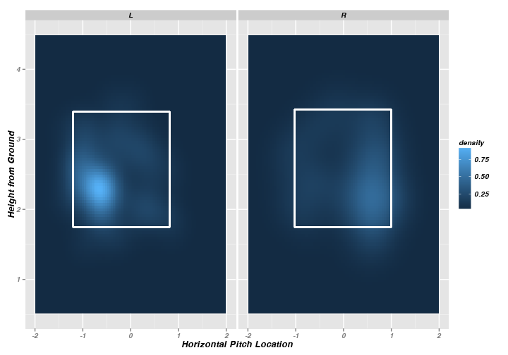
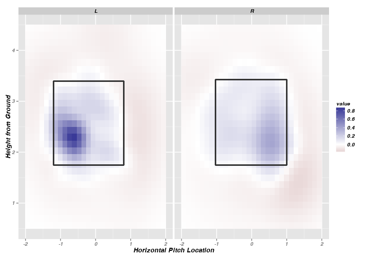
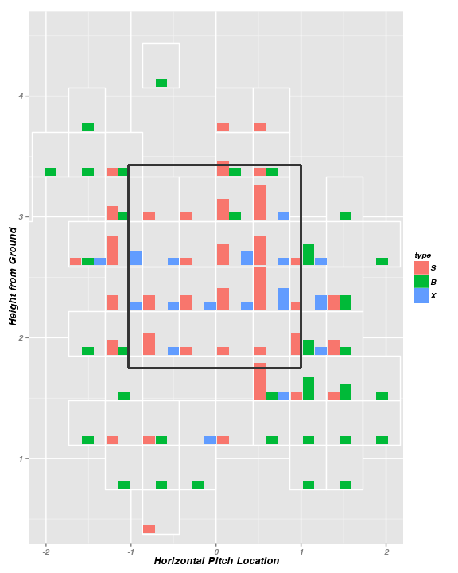

<!--
%\VignetteEngine{knitr}
%\VignetteIndexEntry{A Markdown Vignette with knitr}
-->

Introduction to pitchRx package
====================================

The  [pitchRx package](https://github.com/cpsievert/pitchRx) provides tools for collecting Major League Baseball (MLB) Gameday data and visualizing  [PITCHf/x](http://en.wikipedia.org/wiki/PITCHf/x). This page give a few examples of how to use it. You can view the source file used to generate this web page [here](https://github.com/cpsievert/cpsievert.github.com/blob/master/pitchRx/index.Rmd).

Data Collection
----------------------------

### Collecting data in bulk

**pitchRx** makes it easy to collect Gameday data directly from the source. The main scraping function in **pitchRx**, `scrape`, currently supports four different types of files. Each of the four types have a common file name ending: [miniscoreboard.xml](http://gd2.mlb.com/components/game/mlb/year_2012/month_05/day_01/miniscoreboard.xml), [players.xml](http://gd2.mlb.com/components/game/mlb/year_2012/month_05/day_01/gid_2012_05_01_arimlb_wasmlb_1/players.xml), [inning/inning_all.xml](http://gd2.mlb.com/components/game/mlb/year_2012/month_05/day_01/gid_2012_05_01_arimlb_wasmlb_1/inning/inning_all.xml), and [inning/inning_hit.xml](http://gd2.mlb.com/components/game/mlb/year_2012/month_05/day_01/gid_2012_05_01_arimlb_wasmlb_1/inning/inning_hit.xml). `scrape` extracts information from these files and returns a named list of data frames. 

<pre class="knitr r">library(pitchRx)
files &lt;- c(&quot;miniscoreboard.xml&quot;, &quot;players.xml&quot;
          &quot;inning/inning_all.xml&quot;, &quot;inning/inning_hit.xml&quot;)
dat &lt;- scrape(start=&quot;2011-01-01&quot;, end=&quot;2011-12-31&quot;, suffix = files)
</pre>

In this example, `dat` is a very large object. It is a list of 10 data frames and the data frame `dat$pitch` alone contains more than a million rows and about 45 columns! For this reason, if the user wants to collect data in bulk, it is highly recommended to query on a bi-annual basis and append the results to a database. There are many database options, but here is a simple example of how to append the `dat$pitch` and `dat$atbat` tables to a [MySQL](http://en.wikipedia.org/wiki/MySQL) database using the [RMySQL](http://cran.r-project.org/web/packages/RMySQL/index.html) package.

<pre class="knitr r">library(RMySQL)
drv &lt;- dbDriver(&quot;MySQL&quot;)
MLB &lt;- dbConnect(drv, user=&quot;your_user_name&quot;, password=&quot;your_password&quot;,
                 dbname=&quot;your_database_name&quot;, host=&quot;your_host&quot;)
dbWriteTable(MLB, value = dat$pitch, name = &quot;pitch&quot;, row.names = FALSE, append = TRUE)
dbWriteTable(MLB, value = dat$atbat, name = &quot;atbat&quot;, row.names = FALSE, append = TRUE)
</pre>

No matter how you're storing data, you will probably want to join `data$atbat` with `data$pitch` at some point. For instance, lets combine all information on the 'at-bat and 'pitch' level for every 'four-seam' and 'cutting' fastball thrown by Mariano Rivera and Phil Hughes during the 2011 season:

<pre class="knitr r">names &lt;- c(&quot;Mariano Rivera&quot;, &quot;Phil Hughes&quot;)
atbats &lt;- subset(dat$atbat, pitcher_name == name)
pitchFX &lt;- plyr::join(atbats, dat$pitch, by=c(&quot;num&quot;, &quot;url&quot;), type=&quot;inner&quot;)
pitches &lt;- subset(pitchFX, pitch_type == c(&quot;FF&quot;, &quot;FC&quot;))
</pre>

The `pitches` object is used as an example data and can be accessed by simply entering `data(pitches, package="pitchRx")` in your console. If you're using you're MySQL database, you could also recreate `pitches` using this query (if you have multiple years in your database, you'll want to add criteria for the year of interest):

<pre class="knitr r">pitches &lt;- dbGetQuery(MLB, &quot;SELECT * FROM atbat INNER JOIN pitch 
                      ON (atbat.num = pitch.num AND atbat.url = pitch.url) 
                      WHERE atbat.pitcher_name = 'Mariano Rivera' 
                      OR atbat.pitcher_name = 'Phil Hughes'&quot;)
</pre>

### Collecting data by Gameday IDs

`scrape` also has an option named `game.ids` that allows one to query specific game(s) rather than all games between two dates. For example, suppose I want all PITCHf/x data on every game player by the Minnesota Twins in 2011. I can find the relevant Gameday IDs using information from the built in `gids` object:

<pre class="knitr r">data(gids, package=&quot;pitchRx&quot;)
twins11 &lt;- gids[grepl(&quot;min&quot;, gids) &amp; grepl(&quot;2011&quot;, gids)]
head(twins11)
</pre>

<pre class="knitr r">## [1] "gid_2011_02_27_bosmlb_minmlb_1" "gid_2011_02_28_minmlb_bosmlb_1"
## [3] "gid_2011_03_01_bosmlb_minmlb_1" "gid_2011_03_02_minmlb_pitmlb_1"
## [5] "gid_2011_03_03_minmlb_balmlb_1" "gid_2011_03_04_tbamlb_minmlb_1"
</pre>

<pre class="knitr r">dat &lt;- scrape(game.ids=twins11)
</pre>

### Building your own custom scraper

The rest of this section demonstrates how to build a custom Gameday scraper using [XML2R](https://github.com/cpsievert/XML2R) (`scrape` is built on top of this package). For a more detailed look at **XML2R** [see here](http://cpsievert.github.io/XML2R/). 

#### Obtaining urls

The first (and probably most difficult) step of building a scraper is to obtain the file names of interest. `pitchRx::makeUrls` is convenient for constructing urls that are specific to the [Gameday website](http://gd2.mlb.com/components/game/mlb/). The default functionality of `makeUrls` is to "infer" all the Gameday links that exists between two dates. For example:

<pre class="knitr r">urls &lt;- makeUrls(start=&quot;2012-06-01&quot;, end=&quot;2012-06-01&quot;)
urls
</pre>

<pre class="knitr r">##  [1] "http://gd2.mlb.com/components/game/mlb/year_2012/month_06/day_01/gid_2012_06_01_arimlb_sdnmlb_1"
##  [2] "http://gd2.mlb.com/components/game/mlb/year_2012/month_06/day_01/gid_2012_06_01_atlmlb_wasmlb_1"
##  [3] "http://gd2.mlb.com/components/game/mlb/year_2012/month_06/day_01/gid_2012_06_01_balmlb_tbamlb_1"
##  [4] "http://gd2.mlb.com/components/game/mlb/year_2012/month_06/day_01/gid_2012_06_01_bosmlb_tormlb_1"
##  [5] "http://gd2.mlb.com/components/game/mlb/year_2012/month_06/day_01/gid_2012_06_01_chnmlb_sfnmlb_1"
##  [6] "http://gd2.mlb.com/components/game/mlb/year_2012/month_06/day_01/gid_2012_06_01_cinmlb_houmlb_1"
##  [7] "http://gd2.mlb.com/components/game/mlb/year_2012/month_06/day_01/gid_2012_06_01_lanmlb_colmlb_1"
##  [8] "http://gd2.mlb.com/components/game/mlb/year_2012/month_06/day_01/gid_2012_06_01_miamlb_phimlb_1"
##  [9] "http://gd2.mlb.com/components/game/mlb/year_2012/month_06/day_01/gid_2012_06_01_minmlb_clemlb_1"
## [10] "http://gd2.mlb.com/components/game/mlb/year_2012/month_06/day_01/gid_2012_06_01_nyamlb_detmlb_1"
## [11] "http://gd2.mlb.com/components/game/mlb/year_2012/month_06/day_01/gid_2012_06_01_oakmlb_kcamlb_1"
## [12] "http://gd2.mlb.com/components/game/mlb/year_2012/month_06/day_01/gid_2012_06_01_pitmlb_milmlb_1"
## [13] "http://gd2.mlb.com/components/game/mlb/year_2012/month_06/day_01/gid_2012_06_01_seamlb_chamlb_1"
## [14] "http://gd2.mlb.com/components/game/mlb/year_2012/month_06/day_01/gid_2012_06_01_slnmlb_nynmlb_1"
## [15] "http://gd2.mlb.com/components/game/mlb/year_2012/month_06/day_01/gid_2012_06_01_texmlb_anamlb_1"
</pre>

As a side note, `makeUrls` can also be tricked into constructing the urls specific to each day:

<pre class="knitr r">makeUrls(start=&quot;2012-06-01&quot;, end=&quot;2012-06-05&quot;, gid=&quot;&quot;)
</pre>

<pre class="knitr r">## [1] "http://gd2.mlb.com/components/game/mlb/year_2012/month_06/day_01"
## [2] "http://gd2.mlb.com/components/game/mlb/year_2012/month_06/day_02"
## [3] "http://gd2.mlb.com/components/game/mlb/year_2012/month_06/day_03"
## [4] "http://gd2.mlb.com/components/game/mlb/year_2012/month_06/day_04"
## [5] "http://gd2.mlb.com/components/game/mlb/year_2012/month_06/day_05"
</pre>

#### Using XML2R

The `urls` object can be used to obtain the file names for every [bench.xml](http://gd2.mlb.com/components/game/mlb/year_2011/month_06/day_12/gid_2011_06_12_texmlb_minmlb_1/bench.xml) file available for June 1st, 2012.

<pre class="knitr r">bench.urls &lt;- paste0(urls, &quot;/bench.xml&quot;)
</pre>

Next, load the **XML2R** library and use the `XML2Obs` function:

<pre class="knitr r">library(XML2R)
obs &lt;- XML2Obs(bench.urls, as.equiv=TRUE, quiet=TRUE)
unique(names(obs))
</pre>

<pre class="knitr r">## [1] "bench//away//batters//batter"   "bench//away//pitchers//pitcher"
## [3] "bench//away"                    "bench//home//batters//batter"  
## [5] "bench//home//pitchers//pitcher" "bench//home"
</pre>

In short, the `obs` object is a named list and each element corresponds to an "observation" or "record" of data. The `names` of `obs` keeps track of the "level" of information where each observation was obtained. This is important because we eventually `collapse` observations into separate tables based on these levels. In this example, there are currently six different levels of observations. There would have been many more if the `as.equiv` option was `FALSE` since this adds a prefix to `names(obs)` to help differentiate observations that were obtained from different files. This can be useful if you have to `add_key`s for each file. In this example, we don't need to use `add_key` at all, but it can useful in many other cases (see the [XML2R page](https://github.com/cpsievert/XML2R)).

In this example, we could probably get away with not adding a key to link observations between tables, but we will for demonstration's sake. The `add_key` function will add an additional column to each relevant observation that can be used later for merging/joining purposes.

<pre class="knitr r">tmp &lt;- add_key(obs, parent=&quot;bench//away&quot;, key.name=&quot;away_key&quot;)
obswkey &lt;- add_key(tmp, parent=&quot;bench//home&quot;, key.name=&quot;home_key&quot;)
</pre>

Note that it would be cumbersome to store observations from the `'bench//away//pitchers//pitcher'` level in a separate table from the `'bench//home//pitchers//pitcher'` (and same for the batter case). This is where the `re_name` function becomes useful:

<pre class="knitr r">tmp &lt;- re_name(obs, equiv=c(&quot;bench//away//batters//batter&quot;, &quot;bench//home//batters//batter&quot;),
               diff.name=&quot;location&quot;)
obs2 &lt;- re_name(tmp, equiv=c(&quot;bench//away//pitchers//pitcher&quot;, &quot;bench//home//pitchers//pitcher&quot;),
               diff.name=&quot;location&quot;)
unique(names(obs2))
</pre>

<pre class="knitr r">## [1] "bench//batters//batter"   "bench//pitchers//pitcher"
## [3] "bench//away"              "bench//home"
</pre>

Note how the `re_name` function automatically determines the difference in the names supplied to `equiv` and suppresses that difference in the new name. This information is not lost; however, as this value is appended as an additional column (location) for each observation:

<pre class="knitr r">obs2[c(1, 20)]
</pre>

<pre class="knitr r">## $`bench//batters//batter`
##      id       last      b   pos  avg    g   ab   r   h   hr  rbi sb 
## [1,] "458679" "Bell, J" "S" "3B" ".176" "6" "17" "1" "3" "1" "3" "0"
##      url                                                                                                        
## [1,] "http://gd2.mlb.com/components/game/mlb/year_2012/month_06/day_01/gid_2012_06_01_arimlb_sdnmlb_1/bench.xml"
##      location
## [1,] "away"  
## 
## $`bench//pitchers//pitcher`
##      id       last     t   w   l   era    g   sv  ip    h   bb  so 
## [1,] "461212" "Palmer" "R" "0" "0" "9.00" "3" "0" "2.0" "2" "2" "2"
##      url                                                                                                        
## [1,] "http://gd2.mlb.com/components/game/mlb/year_2012/month_06/day_01/gid_2012_06_01_arimlb_sdnmlb_1/bench.xml"
##      location
## [1,] "home"
</pre>

Simply because of the structure of this XML file, we can use `re_name` again to have a key to merge information on the "bench" level with the "batter/pitcher" level:

<pre class="knitr r">obs3 &lt;- re_name(obs2, equiv=c(&quot;bench//away&quot;, &quot;bench//home&quot;), diff.name=&quot;location&quot;)
</pre>

Finally, we can `collapse` the list of observations into a list of matrices and `merge` them accordingly to obtain a `pitcher` and `batter` data frame:

<pre class="knitr r">dat &lt;- collapse(obs3)
batter &lt;- merge(x=dat[[&quot;bench//batters//batter&quot;]], y=dat[[&quot;bench&quot;]], by=c(&quot;url&quot;, &quot;location&quot;))
head(batter)
</pre>

<pre class="knitr r">##                                                                                                         url
## 1 http://gd2.mlb.com/components/game/mlb/year_2012/month_06/day_01/gid_2012_06_01_arimlb_sdnmlb_1/bench.xml
## 2 http://gd2.mlb.com/components/game/mlb/year_2012/month_06/day_01/gid_2012_06_01_arimlb_sdnmlb_1/bench.xml
## 3 http://gd2.mlb.com/components/game/mlb/year_2012/month_06/day_01/gid_2012_06_01_arimlb_sdnmlb_1/bench.xml
## 4 http://gd2.mlb.com/components/game/mlb/year_2012/month_06/day_01/gid_2012_06_01_arimlb_sdnmlb_1/bench.xml
## 5 http://gd2.mlb.com/components/game/mlb/year_2012/month_06/day_01/gid_2012_06_01_arimlb_sdnmlb_1/bench.xml
## 6 http://gd2.mlb.com/components/game/mlb/year_2012/month_06/day_01/gid_2012_06_01_arimlb_sdnmlb_1/bench.xml
##   location     id         last b pos  avg  g  ab  r  h hr rbi sb tid
## 1     away 458679      Bell, J S  3B .176  6  17  1  3  1   3  0 ari
## 2     away 111072    Blanco, H R   C .205 12  39  2  8  0   2  1 ari
## 3     away 430585        Kubel L  LF .297 46 165 17 49  4  23  1 ari
## 4     away 150348 McDonald, Jo R  SS .308 24  65  8 20  3   9  0 ari
## 5     away 407489      Overbay L  1B .345 27  58  7 20  2   6  0 ari
## 6     home 434633    Baker, Jo L   C .235 17  51  2 12  0   5  2 sdn
</pre>

<pre class="knitr r">pitcher &lt;- merge(x=dat[[&quot;bench//pitchers//pitcher&quot;]], y=dat[[&quot;bench&quot;]], by=c(&quot;url&quot;, &quot;location&quot;))
head(pitcher)
</pre>

<pre class="knitr r">##                                                                                                         url
## 1 http://gd2.mlb.com/components/game/mlb/year_2012/month_06/day_01/gid_2012_06_01_arimlb_sdnmlb_1/bench.xml
## 2 http://gd2.mlb.com/components/game/mlb/year_2012/month_06/day_01/gid_2012_06_01_arimlb_sdnmlb_1/bench.xml
## 3 http://gd2.mlb.com/components/game/mlb/year_2012/month_06/day_01/gid_2012_06_01_arimlb_sdnmlb_1/bench.xml
## 4 http://gd2.mlb.com/components/game/mlb/year_2012/month_06/day_01/gid_2012_06_01_arimlb_sdnmlb_1/bench.xml
## 5 http://gd2.mlb.com/components/game/mlb/year_2012/month_06/day_01/gid_2012_06_01_arimlb_sdnmlb_1/bench.xml
## 6 http://gd2.mlb.com/components/game/mlb/year_2012/month_06/day_01/gid_2012_06_01_arimlb_sdnmlb_1/bench.xml
##   location     id       last t w l  era  g sv   ip  h bb so tid
## 1     away 444520    Breslow L 1 0 2.13 23  0 25.1 16 10 22 ari
## 2     away 502239     Cahill R 2 5 3.96 10  0 61.1 55 26 42 ari
## 3     away 518567 Collmenter R 0 2 6.75 10  0 30.2 38  6 25 ari
## 4     away 543339  Hudson, D R 1 1 5.48  4  0 23.0 27  9 15 ari
## 5     away 453178 Kennedy, I R 4 5 4.26 11  0 69.2 74 18 59 ari
## 6     away 407816       Putz R 0 3 6.35 18 11 17.0 20  4 20 ari
</pre>

PITCHf/x Visualization
--------------------

### 2D animation

Let's animate the `pitches` data frame created in the previous section on a series of 2D scatterplots. The viewer should notice that as the animation progresses, pitches coming closer to them (that is, imagine you are the umpire/catcher - watching the pitcher throw directly at you). In the animation below, the horizontal and vertical location of `pitches` is plotted every tenth of a second until they reach home plate (in real time). Since looking at animations in real time can be painful, this animation delays the time between each frame to a half a second.

<pre class="knitr r">animateFX(pitches, layer=list(facet_grid(pitcher_name~stand, labeller = label_both), theme_bw(), coord_equal()))
</pre>

 <embed width="864" height="864" name="plugin" src="figure/ani.swf" type="application/x-shockwave-flash"> 

To avoid a cluttered animation, the `avg.by` option averages the trajectory for each unique value of the variable supplied to `avg.by`.

<pre class="knitr r">animateFX(pitches, avg.by=&quot;pitch_types&quot;, layer=list(facet_grid(pitcher_name~stand, labeller = label_both), theme_bw(), coord_equal()))
</pre>

 <embed width="864" height="864" name="plugin" src="figure/ani2.swf" type="application/x-shockwave-flash"> 

Note that when using `animateFX`, the user may want to wrap the expression with `animation::saveHTML` to view the result in a web browser. If you want to include the animation in a document, [knitr](http://yihui.name/knitr/options#chunk_options)'s `fig.show="animate"` chunk option is very useful. 

### Interactive 3D plots

**pitchRx** also makes use of **rgl** graphics. If I want a more revealing look as Mariano Rivera's pitches, I can subset the `pitches` data frame accordingly. Note that the plot below is interactive, so make sure you have JavaScript & [WebGL](http://get.webgl.org/) enabled (if you do, go ahead - click and drag)!

<pre class="knitr r">Rivera &lt;- subset(pitches, pitcher_name==&quot;Mariano Rivera&quot;)
interactiveFX(Rivera)
</pre>

<iframe src="http://cpsievert.github.io/pitchRx/rgl1/" height="600" width="1200"></iframe>

### Strike-zones

#### Raw strike-zone densities

Strike-zones capture pitch locations at the moment they cross the plate. `strikeFX`'s default functionality is to plot the relevant *raw density*. Here is the density of called strikes thrown by Rivera and Hughes in 2011 (for both right and left-handed batters).

<pre class="knitr r">strikes &lt;- subset(pitches, des == &quot;Called Strike&quot;)
strikeFX(strikes, geom=&quot;tile&quot;, layer=facet_grid(.~stand))
</pre>

`strikeFX` allows one to easily manipulate the density of interest through two parameters: `density1` and `density2`. If these densities are identical, the density is defined accordingly. This is useful for avoiding repetitive subsetting of data frames. For example, one could use the following to also generate the density of called strikes shown previously.

<pre class="knitr r">strikeFX(pitches, geom=&quot;tile&quot;, density1=list(des=&quot;Called Strike&quot;), density2=list(des=&quot;Called Strike&quot;), layer=facet_grid(.~stand))
</pre>

If you specify two different densities, `strikeFX` will plot differenced densities. In this case, we are subtracting the "Ball" density from the previous "Called Strike" density.

<pre class="knitr r">strikeFX(pitches, geom=&quot;tile&quot;, density1=list(des=&quot;Called Strike&quot;), density2=list(des=&quot;Ball&quot;), layer=facet_grid(.~stand))
</pre>

`strikeFX` also has the capability to plot tiled bar charts via the option `geom="subplot2d"`. Each grid (or sub-region) of the plot below has a distribution of outcomes among Rivera's pitches to right handed batters. The three outcomes are "S" for strike, "X" for a ball hit into play and "B" for a ball. 

<pre class="knitr r">Rivera.R &lt;- subset(Rivera, stand==&quot;R&quot;)
strikeFX(Rivera.R, geom=&quot;subplot2d&quot;, fill=&quot;type&quot;)
</pre>

#### Probabilistic strike-zone densities

Perhaps more interesting than raw strike-zone densities are probabilistic densities. These densities represent the probability of a certain event happening at a given location. A popular method for fitting such models is Generalized Additive Models. Here we use the **mgcv** library to fit such a model (which automatically chooses a proper tuning parameter via cross-validation).

<pre class="knitr r">noswing &lt;- subset(pitches, des %in% c(&quot;Ball&quot;, &quot;Called Strike&quot;))
noswing$strike &lt;- as.numeric(noswing$des %in% &quot;Called Strike&quot;)
library(mgcv)
m1 &lt;- bam(strike ~ s(px, pz, by=factor(stand)) +
          factor(stand), data=noswing, family = binomial(link='logit'))
strikeFX(noswing, model=m1, layer=facet_grid(.~stand))
</pre>

### Session Info

In the spirit of reproducible research, here is the `sessionInfo` used when creating this document:

<pre class="knitr r">sessionInfo()
</pre>

<pre class="knitr r">## R version 3.0.2 (2013-09-25)
## Platform: x86_64-apple-darwin10.8.0 (64-bit)
## 
## locale:
## [1] en_US.UTF-8/en_US.UTF-8/en_US.UTF-8/C/en_US.UTF-8/en_US.UTF-8
## 
## attached base packages:
## [1] stats     graphics  grDevices utils     datasets  methods   base     
## 
## other attached packages:
## [1] mgcv_1.7-27       nlme_3.1-113      ggsubplot_0.3.2   XML2R_0.0.3      
## [5] XML_3.95-0.2      pitchRx_1.0       ggplot2_0.9.3.1   devtools_1.4.1.99
## [9] knitr_1.5        
## 
## loaded via a namespace (and not attached):
##  [1] Cairo_1.5-5        colorspace_1.2-4   dichromat_2.0-0   
##  [4] digest_0.6.4       evaluate_0.5.1     formatR_0.10      
##  [7] grid_3.0.2         gtable_0.1.2       hexbin_1.26.3     
## [10] highr_0.3          httr_0.2           labeling_0.2      
## [13] lattice_0.20-24    lubridate_1.3.3    MASS_7.3-29       
## [16] Matrix_1.1-1.1     memoise_0.1        munsell_0.4.2     
## [19] parallel_3.0.2     plyr_1.8           proto_0.3-10      
## [22] RColorBrewer_1.0-5 RCurl_1.95-4.1     reshape2_1.2.2    
## [25] rgl_0.93.963       scales_0.2.3       stringr_0.6.2     
## [28] tools_3.0.2        whisker_0.3-2
</pre>

