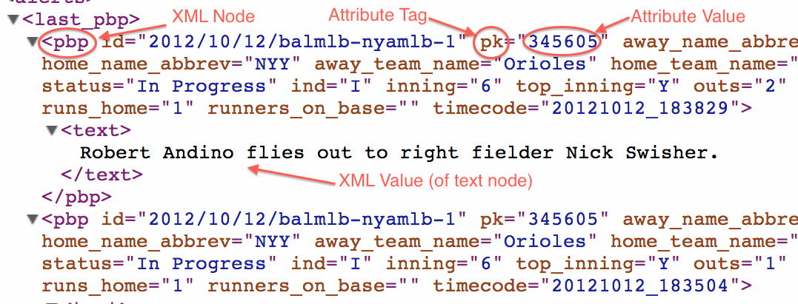
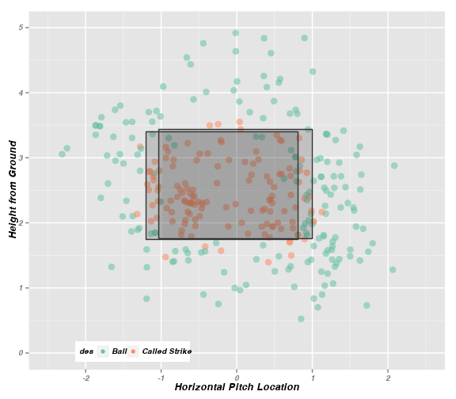
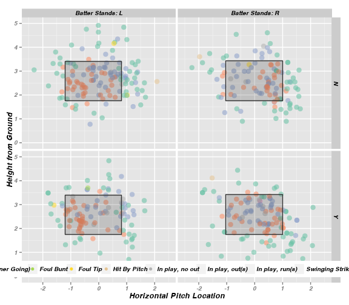
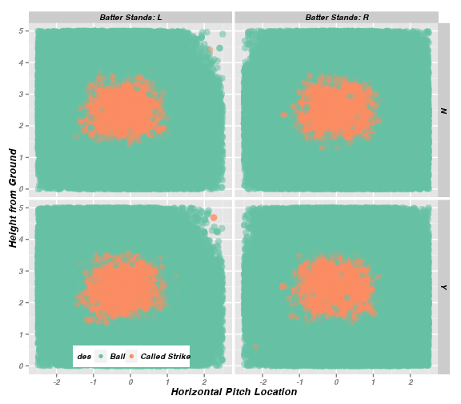
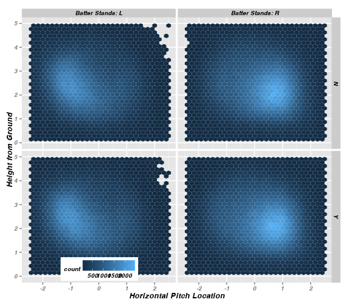
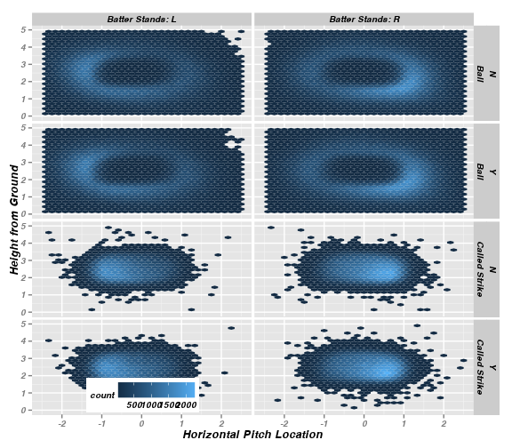

% Simple Methods for Collecting and Analyzing Major League Baseball's PITCHf/x Data
% Carson Sievert (Advisor: Dr. Hofmann)
% `10/17/2012`


## What the heck is PITCHf/x?


## So what? Who Cares?

- PITCHf/x offers baseball analysts incredibly intricate looks at player performance (especially for pitchers)

- More general observations about the game of baseball are now feasible. For example, do different umpires have different strikezones?

- Most importantly, keeps baseball and data nerds occupied

## PITCHf/x data structure

1. Among other things, MLBAM stores the parameters of a best fitting curve to almost *every* pitch thrown since 2008 in XML format.
2. That's a lot of data!!!
  * Over 14,000 games
  * Over 5,000 players (each player has a unique file for each game)
  * Over 1M atbats
  * Over 3.5M pitches

## Drawbacks to PITCHf/x data

1. Scraping (and storing) data from that many files is computationally intensive.
  * Can't do much to avoid this.
2. Relationships between data structures aren't intuitive.
  * Solution: save the file name for each record of a data frame.
3. Many records have inconsistent fields.
  * Solution: fill missing fields with NAs for each record.

## pitchRx makes scraping XML data easy


```r
library(devtools)
install_github('pitchRx', 'cpsievert')
library(pitchRx)
data <- scrapeFX(start = "2008-01-01", 
                 end = Sys.Date())
pitches <- data$pitch
atbats <- data$atbat
```


## For (potentially) serious users of pitchRx

- Scraping data can take several hours and exceed the limits of your RAM.
- If you want all available data, do it on a yearly basis!
- For example,


```r
#Repeat this code for 2009, 2010, etc.
data <- scrapeFX(start = "2008-01-01",
                end = "2008-12-31")
#Writing to a MySQL database is preferred to csv
write.csv(data$pitch, file = "pitches_08.csv")
write.csv(data$atbat, file = "atbats_08.csv")
```


## In the meantime...


## If data is your drug of choice...


## A bit on XML formats



## XML scraping made easy

- pitchRx::urlsToDataFrame makes scraping XML data from **any set of files** much easier.
- Main purpose is to collect data stored as XML attributes (but it can also scrape for XML values)
- Tables are defined by a single XML node
- Table fields are defined by the most complete set of XML attribute "tags". This can changed through the *tables* parameter.
- Missing (or incomplete) information is filled with NAs.


```r
urlsToDataFrame(urls, tables = list(),
    add.children = FALSE, use.values = FALSE)
```


## For our purposes...


```r
data <- scrapeFX(start = "2011-01-01", 
  end = "2012-01-01", type = "pitcher",
  player = c("Mariano Rivera", "Phil Hughes"), 
  tables = list(atbat = fields$atbat, 
  pitch = fields$pitch))

pitchFX <- join(data$pitch, data$atbat, 
  by = c("num", "url"), type = "inner")
pitches <- subset(pitchFX, pitch_type 
    %in% c("FF", "FC"))
```


## How can we gain insight from PITCHf/x?

- PITCHf/x data is unique from other baseball data because of it's inherit spatial properties.
- Spatial analysis of this data is most easily portrayed through visuals.
- For years, the most common use of PITCHf/x data has been to analyze strikezones plots (ie, horizontal and vertical locations of pitches as they cross home plate.)
- **pitchRx** produces strikezone plots *with a special twist*.
- *Note:* only include "called strikes" and "balls" when examining strikezones.

## Output of strikeFX(pitches)

 


## Faceting by batter stance

 


## Faceting by stance and "home"

 


% That's cool...but it doesn't tell me much

## Let's visualize all pitches!!


 


## HEX

 


## HEX2

 


## Gaining insight through animation


```r
animateFX(data = pitches)
```


- Produces a series of plots with each pitch's location as it travels from the pitcher's hand until they reach home plate.

- As the animation progresses, the pitches get closer to home plate. Note that different pitches travel at different speeds. Thus, some pitches are closer (to the viewer) than others within each plot.

- 

## Output of animateFX(pitches)

<div align = "center">
 <embed width="576" height="504" name="plugin" src="figure/animate1.swf" type="application/x-shockwave-flash"> 
</div>


## And flexible!

<div align = "center">
 <embed width="576" height="504" name="plugin" src="figure/animate3.swf" type="application/x-shockwave-flash"> 
</div>


## ????


```r
dim(pitches)
```

```
## [1] 602  53
```

```r
opts_chunk$get('output.format')
```

```
## NULL
```

