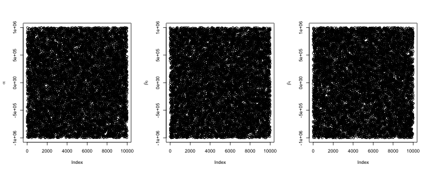

Homework 2 (due 17 Sep in class)
========================================================

### This homework covers data augmentation approaches for probit and logistic regression.

#### Show that the following models are equivalent:

* $y \sim Ber(p), p = \Phi(Xb)$

$$
\begin{align*}
P(Y = 1) &= \Phi(Xb)^1(1-\Phi(Xb))^0 = \Phi(Xb)
\\ P(Y = 0) &= \Phi(Xb)^0(1-\Phi(Xb))^1 = 1-\Phi(Xb)
\end{align*}
$$

* $y=I(Z>0), Z \sim N(Xb,1)$

$$
\begin{align*}
P(Y = 1) &= P(Z > 0) = P(Z-Xb > -Xb) = P(Z-Xb < Xb) = \Phi(Xb)
\\ P(Y = 0) &= P(Z < 0) = P(Z-Xb < -Xb) = 1 - P(Z-Xb < Xb) = 1-\Phi(Xb)
\end{align*}
$$

where $\Phi$ is the cdf of a standard normal

#### Run an MCMC for the model below (you can use BUGS/JAGS) and describe (using a plot?) how non-identifiability affects the posterior.

$$
y=I(Z >\alpha), Z \sim N(X\beta,1)
$$

where $X$ includes an intercept and a single explanatory variable and $\alpha$ and $\beta$ are unknown parameters


```r
library(rjags)
model <- "
model {
    for (i in 1:n) {
      is.censored[i] ~ dinterval(z[i], a)
      z[i] ~ dnorm(Xb[i], 1)
      Xb[i] <- b0 + X[i]*b1
    }
    b1 ~ dunif(-1e6, 1e6)
    b0 ~ dunif(-1e6, 1e6)
    a ~ dunif(-1e6, 1e6)
  }
"
X <- rnorm(100)
m <- jags.model(textConnection(model), list(X=X, n=length(X)), n.chain=1, quiet=TRUE)
res <- coda.samples(m, c("a", "b0", "b1"), 10000, nthin=1)
mat <- as.matrix(res)
par(mfrow=c(1, 3))
plot(mat[,1], ylab=expression(alpha))
plot(mat[,2], ylab=expression(beta[0]))
plot(mat[,3], ylab=expression(beta[1]))
```

 


The figures above are traceplots for values of $\alpha$, $\beta_0$, $\beta_1$. Clearly, the MCMC does not converge when there are identifiability issues.

#### Verify (or find the typo for) the likelihood for beta at the bottom of page 7 of Polson et al.

$$
\begin{align*}
L_i(\beta) &= (\frac{1}{1+e^{-x'_i\beta}})^{y_i}(\frac{e^{-x'_i\beta}}{1+e^{-x'_i\beta}})^{n_i - y_i}
\\ &= \frac{(e^{-x'_i\beta})^{n_i - y_i}}{(1+e^{-x'_i\beta})^{n_i}}
\end{align*}
$$

Then by applying Theorem 1 we get:

$$
\begin{align*}
L_i(\beta) \propto exp(\kappa_i x'_i\beta) \int^{\infty}_0 exp\{-\omega_i (x'_i \beta)^2 /2\} p(\omega_i | n_i, 0) d\omega_i
\end{align*}
$$

where $\kappa_i = y_i - n_i/2$ and $p(\omega_i|n_i, 0)$ is the denstiy of the Polya-Gamma random variable.


