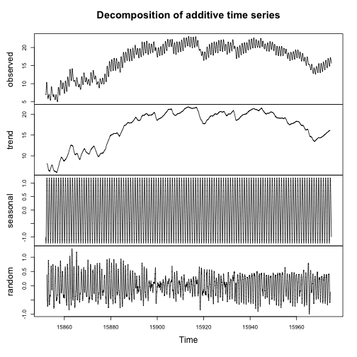
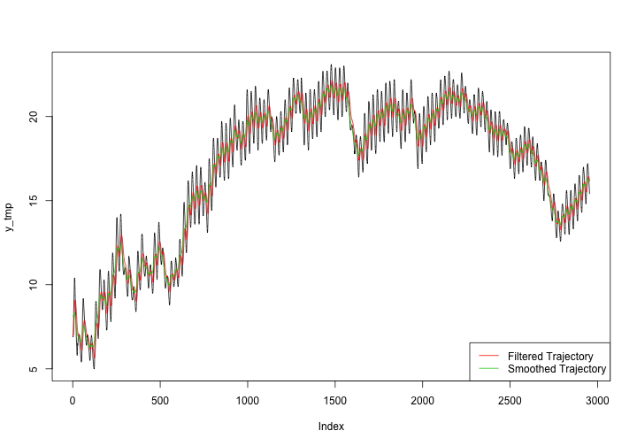
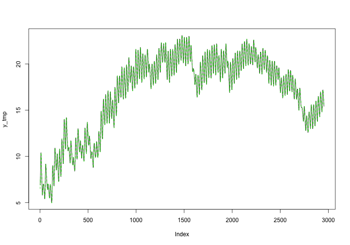

Homework 4 (due 8 Oct in class)
========================================================

### Find the stationary distribution for an autoregressive process of order 1. ###

An AR(1) process can be represented as: $y_t = \phi y_{t-1} + \epsilon_t$ where $\epsilon_t$ is white noise (ie, $\epsilon_t \sim N(0, \sigma^2)$). 

Note this can also be representing in the state-space model framework where the observation equation is: $y_t = 1*y_t + 0*y_{t-1} + 0$ or $y_t = F_t \theta_t + v_t$ where $F_t = 1$, $\theta_t = y_t$, and $v_t = 0$. The state equation would then be: $y_t = \phi y_{t-1} + \epsilon_t$ or $\theta_t = G_t \theta_{t-1} + w_t$ where $G_t = \phi$ and $w_t \sim N(0, \sigma^2)$

Treating this as a _dynamic linear model_, we could specify a normal prior distribution for the state at time $t=0$: $y_0 \sim N(m_0, C_0)$.

It then follows that $\theta_t|\theta_{t-1} \sim N(G_t\theta_{t-1}, W_t) \implies y_t|y_{t-1} \sim N(\phi y_{t-1}, \sigma^2)$ 

### Perform a Bayesian analysis of this [data set](http://jarad.me/stat615/data/dlm-data.csv), temperature measurements 25cm below the surface on an experimental plot in Wyoming. Here is some code to get you started: ###

Since the variation in the seasonal component is consistent over time (see figure below), should provide an adequate fit to this data.

 


To keep the model simple, consider the random walk plus noise model:

$$
y_t = \mu_t + v_t \hspace{2cm} v_t \sim N(0, V)
\\ \mu_t = \mu_{t-1} + w_t \hspace{2cm} w_t \sim N(0, W)
$$

Note that this model is constant and the only parameters are the observation and evolution variances ($V$ and $W$, respectively). These parameters are normally estimated via Maximum Likelihood or Bayesian estimation. Before we head in this direction, first consider the trajectory of the random walk plus model with a low signal-to-noise ratio $r = W/V = 1/100$


```r
dlmTemp <- dlmModPoly(order = 1, dV = 100, dW = 1)
tempFilt <- dlmFilter(y_tmp, dlmTemp)
tempSmooth <- dlmSmooth(y_tmp, dlmTemp)
plot(y_tmp, type = "l")
lines(tempFilt$m[-1], col = 2)
lines(tempSmooth$s[-1], col = 3)
legend("bottomright", c("Filtered Trajectory", "Smoothed Trajectory"), col = 2:3, 
    lty = 1)
```

 


In this case, the choice for these values of $V$ and $W$ were arbitrary. To obtain a better estimate at the true value of these paramters, we can use Maximum Likelihood:


```r
buildFun <- function(x) dlmModPoly(order = 1, dV = exp(x[1]), dW = exp(x[2]))
fit <- dlmMLE(y_tmp, parm = rep(0, 2), build = buildFun)
stopifnot(fit$convergence == 0)
dlmTemp2 <- buildFun(fit$par)
unlist(dlmTemp2[c("V", "W")])
```

```
##         V         W 
## 1.092e-08 6.756e-02
```

```r
tempFilt2 <- dlmFilter(y, dlmTemp2)
tempSmooth2 <- dlmSmooth(y, dlmTemp2)
plot(y_tmp, type = "l")
lines(tempFilt2$m[-1], col = 2)
lines(tempSmooth2$s[-1], col = 3)
legend("bottomright", c("Filtered Trajectory", "Smoothed Trajectory"), col = 2:3, 
    lty = 1)
```

 


Note that the high signal-to-noise ratio estimated via Maximum Likelihood produces a trajectory that essentially mimics the actual trajectory. If we were to treat these parameter estimates as known and perform a Bayesian analysis, one could obtain samples from the posterior via the Forward Filtering Backward Sampling (FFBS) algorithm. However, this is not a great way to proceed since (in addition to these values not really being known) backwards sampling from this filtered object would produce samples with very little variation. Instead, we proceed by treating $V$ and $W$ as unknown. 

Assuming that $W$ is a diagonal matrix and both unknown variances have independent inverse Gamma prior distributions, we can sample from the posterior using the function `dlm::dlmGibbsDIG`.


```r
mcmc <- 1000
burn <- 500
outGibbs <- dlmGibbsDIG(y_tmp, mod = dlmModPoly(1), shape.y = 0.001, rate.y = 0.001, 
    shape.theta = 0.001, rate.theta = 0.001, n.sample = mcmc + burn)
```


```r
m <- mcmcMean(with(outGibbs, cbind(V = dV[-(1:burn)], W = dW[-(1:burn), ])))
m[1, ]  #point estimates for unknown variances
```

```
##         V         W 
## 0.0001666 0.0679343
```

```r
m[2, ]  #Monte Carlo standard errors
```

```
##         V         W 
## 7.235e-06 5.344e-05
```


Again, we obtain a low (point) estimate for the observation variance $V$ (and a very high signal-to-noise ratio). In the figure below, the upper and lower bound to the 95% credible interval for the unknown states are drawn for the actual data.


```r
thetas <- outGibbs$theta[, , -(1:burn)]
mns <- rowMeans(thetas)
l <- apply(thetas, 1, quantile, 0.025)
u <- apply(thetas, 1, quantile, 0.975)
plot(y_tmp, type = "l")
lines(l, col = 3, lty = 2)
lines(u, col = 3, lty = 2)
```

 

