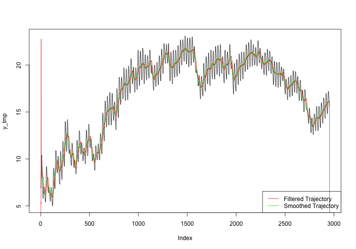

Homework 4 (due 8 Oct in class)
========================================================

### Find the stationary distribution for an autoregressive process of order 1. ###

An AR(1) process can be represented as: $y_t = \phi y_{t-1} + \epsilon_t$ where $\epsilon_t$ is white noise (ie, $\epsilon_t \sim N(0, \sigma^2)$). 

Note this can also be representing in the state-space model framework where the observation equation is: $y_t = 1*y_t + 0*y_{t-1} + 0$ or $y_t = F_t \theta_t + v_t$ where $F_t = 1$, $\theta_t = y_t$, and $v_t = 0$. The state equation would then be: $y_t = \phi y_{t-1} + \epsilon_t$ or $\theta_t = G_t \theta_{t-1} + w_t$ where $G_t = \phi$ and $w_t \sim N(0, \sigma^2)$

Treating this as a _dynamic linear model_, we could specify a normal prior distribution for the state at time $t=0$: $y_0 \sim N(m_0, C_0)$.

It then follows that $\theta_t|\theta_{t-1} \sim N(G_t\theta_{t-1}, W_t) \implies y_t|y_{t-1} \sim N(\phi y_{t-1}, \sigma^2)$ 

### Perform a Bayesian analysis of this [data set](http://jarad.me/stat615/data/dlm-data.csv), temperature measurements 25cm below the surface on an experimental plot in Wyoming.###

To keep things simple, consider the random walk plus noise model:

$$
y_t = \mu_t + v_t \hspace{2cm} v_t \sim N(0, V)
\\ \mu_t = \mu_{t-1} + w_t \hspace{2cm} w_t \sim N(0, W)
$$

Note that this model is constant and the only parameters are the observation and evolution variances ($V$ and $W$, respectively). These (unknown) parameters are usually estimated via Maximum Likelihood and/or Bayesian estimation. Before we head in this direction, first consider the trajectory of the random walk plus model with a low signal-to-noise ratio $r = W/V = 1/100$

<pre class="knitr r">dlmTemp &lt;- dlmModPoly(order = 1, dV = 100, dW = 1)
tempFilt &lt;- dlmFilter(y_tmp, dlmTemp)
tempSmooth &lt;- dlmSmooth(y_tmp, dlmTemp)
plot(y_tmp, type = &quot;l&quot;)
lines(tempFilt$m[-1], col = 2)
lines(tempSmooth$s[-1], col = 3)
legend(&quot;bottomright&quot;, c(&quot;Filtered Trajectory&quot;, &quot;Smoothed Trajectory&quot;), col = 2:3,
    lty = 1)
</pre>

In this case, the choice for these values of $V$ and $W$ were arbitrary. To obtain a better estimate at the true value of these parameters, we can use Maximum Likelihood:

<pre class="knitr r">buildFun &lt;- function(x) {
    dlmModPoly(order = 1, dV = exp(x[1]), dW = exp(x[2]))
}
fit &lt;- dlmMLE(y_tmp, parm = rep(0, 3), build = buildFun)
stopifnot(fit$convergence == 0)
dlmTemp2 &lt;- buildFun(fit$par)
unlist(dlmTemp2[c(&quot;V&quot;, &quot;W&quot;)])
</pre>

<pre class="knitr r">##         V         W 
## 1.092e-08 6.756e-02
</pre>

<pre class="knitr r">tempFilt2 &lt;- dlmFilter(y, dlmTemp2)
tempSmooth2 &lt;- dlmSmooth(y, dlmTemp2)
plot(y_tmp, type = &quot;l&quot;)
lines(tempFilt2$m[-1], col = 2)
lines(tempSmooth2$s[-1], col = 3)
legend(&quot;bottomright&quot;, c(&quot;Filtered Trajectory&quot;, &quot;Smoothed Trajectory&quot;), col = 2:3,
    lty = 1)
</pre>

Note that the high signal-to-noise ratio estimated via Maximum Likelihood produces a trajectory that essentially mimics the actual trajectory. Due to this overfitting, any prediction would be highly inaccurate since predictions would be heavily influenced by the noise in previous observations. If we were to treat these parameter estimates as known and perform a Bayesian analysis, one could obtain samples from the posterior via the Forward Filtering Backward Sampling (FFBS) algorithm. However, this is not a great way to proceed since (in addition to these values not really being known) backwards sampling from this filtered object would produce samples with very little variation. Instead, we proceed by treating $V$ and $W$ as unknown. 

Assuming that $W$ is a diagonal matrix and both unknown variances have independent inverse Gamma prior distributions, we can sample from the posterior using the function `dlm::dlmGibbsDIG`.

<pre class="knitr r">mcmc &lt;- 1000
burn &lt;- 500
outGibbs &lt;- dlmGibbsDIG(y_tmp, mod = dlmModPoly(1), shape.y = 0.001, rate.y = 0.001,
    shape.theta = 0.001, rate.theta = 0.001, n.sample = mcmc + burn)
</pre>

<pre class="knitr r">m &lt;- mcmcMean(with(outGibbs, cbind(V = dV[-(1:burn)], W = dW[-(1:burn), ])))
m[1, ]  #point estimates for unknown variances
</pre>

<pre class="knitr r">##         V         W 
## 0.0001737 0.0680178
</pre>

<pre class="knitr r">m[2, ]  #Monte Carlo standard errors
</pre>

<pre class="knitr r">##         V         W 
## 9.654e-06 5.393e-05
</pre>

Again, we obtain a low (point) estimate for the observation variance $V$ (and a very high signal-to-noise ratio). In the figure below, the upper and lower bound to the 95% credible interval for the unknown states are drawn for the actual data.

<pre class="knitr r">thetas &lt;- outGibbs$theta[, , -(1:burn)]
mns &lt;- rowMeans(thetas)
l &lt;- apply(thetas, 1, quantile, 0.025)
u &lt;- apply(thetas, 1, quantile, 0.975)
plot(y_tmp, type = &quot;l&quot;)
lines(l, col = 3, lty = 2)
lines(u, col = 3, lty = 2)
</pre>

Clearly, a simple random walk plus noise model is not going to work since the observation and evolution variance are so small. Next, we consider adding a fourier representation of the periodic component. This particular representation contains two harmonics.

<pre class="knitr r">buildFun &lt;- function(x) {
    dlmModPoly(order = 1, dV = exp(x[1]), dW = exp(x[2])) + dlmModTrig(s = 24,
        q = 2, dV = exp(x[1]), dW = exp(x[2]))
}
fit &lt;- dlmMLE(log(y_tmp), parm = rep(1, 2), build = buildFun, lower = 1e-08,
    upper = 10)
stopifnot(fit$convergence == 0)
t &lt;- buildFun(fit$par)
</pre>

Note that the estimates of $V$ and $W$ are still incredibly small, but this model systematically restricts the states from mimicing the actual trajectory (as seen below). It is interesting to see the large spike in the filtered trajectory at the start of the time series, but it makes total sense considering the filtered estimates are based on _previous_ data (rather than all available data) and there is a large spike from the 1st time point to the 2nd time point.

<pre class="knitr r">tempFilt2 &lt;- dlmFilter(y_tmp, t)
tempSmooth2 &lt;- dlmSmooth(y_tmp, t)
plot(y_tmp, type = &quot;l&quot;)
lines(tempFilt2$m[-1], col = 2)
lines(tempSmooth2$s[-1], col = 3)
legend(&quot;bottomright&quot;, c(&quot;Filtered Trajectory&quot;, &quot;Smoothed Trajectory&quot;), col = 2:3,
    lty = 1)
</pre>

