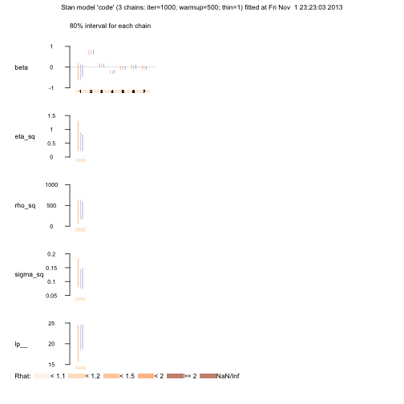
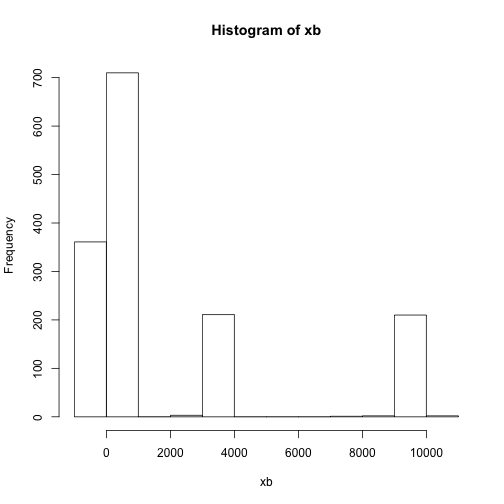
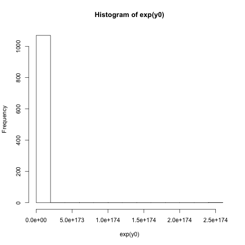

Homework 6 (due 5 Nov in class)
===============================

### The [real estate data set](http://www.biostat.umn.edu/~brad/data/BatonRouge.dat) consists of information regarding 70 sales of single-family homes in Baton Rouge, LA, during the month of June 1989 (modified from exercise 5.7 of Hierarchical Modeling and Analysis for Spatial Data). ###

#### Obtain the empirical variogram of the logarithm of selling prices. ####

<pre class="knitr r">library(geoR)
br &lt;- read.table(&quot;http://www.biostat.umn.edu/~brad/data/BatonRouge.dat&quot;, header = T)
br.geo &lt;- as.geodata(obj = br, coords.col = 8:9, data.col = 1)
vg &lt;- variog(br.geo)
vf &lt;- variofit(vg, cov.model = &quot;linear&quot;)
</pre>

<pre class="knitr r">plot(vg)
lines(vf)
</pre>

#### Fit a standard regression model to the logarithm of selling price using all explanatory variables other than location. ####

<pre class="knitr r">mod &lt;- br[!names(br) %in% c(&quot;Latitude&quot;, &quot;Longitude&quot;)]
m &lt;- lm(logSellingPr ~ ., data = mod)
summary(m)
</pre>

<pre class="knitr r">## 
## Call:
## lm(formula = logSellingPr ~ ., data = mod)
## 
## Residuals:
##     Min      1Q  Median      3Q     Max 
## -0.5901 -0.0886  0.0115  0.1221  0.5424 
## 
## Coefficients:
##              Estimate Std. Error t value Pr(>|t|)    
## (Intercept)  1.02e+01   1.79e-01   57.17  < 2e-16 ***
## LivingArea   5.99e-04   8.26e-05    7.26  7.1e-10 ***
## OtherArea    1.51e-04   1.25e-04    1.21   0.2300    
## Age         -9.75e-03   3.39e-03   -2.88   0.0055 ** 
## Bedrooms    -2.13e-02   5.86e-02   -0.36   0.7171    
## Bathrooms   -3.80e-02   1.15e-01   -0.33   0.7429    
## HalfBaths    3.37e-03   8.68e-02    0.04   0.9692    
## ---
## Signif. codes:  0 '***' 0.001 '**' 0.01 '*' 0.05 '.' 0.1 ' ' 1
## 
## Residual standard error: 0.203 on 63 degrees of freedom
## Multiple R-squared:  0.77,	Adjusted R-squared:  0.748 
## F-statistic: 35.2 on 6 and 63 DF,  p-value: <2e-16
</pre>

#### Obtain the empirical variogram of the residuals to the fit above. ####

<pre class="knitr r">br$residuals &lt;- m$residuals
br.geo2 &lt;- as.geodata(obj = br, coords.col = 8:9, data.col = 10)
vg2 &lt;- variog(br.geo2)
vf2 &lt;- variofit(vg2, cov.model = &quot;linear&quot;)
</pre>

<pre class="knitr r">plot(vg2)
lines(vf2)
</pre>

#### Perform a fully Bayesian analysis using an exponential spatial correlation function. Use a flat prior for the regression coefficients, inverse gamma priors for the variance components, and a Unif(0,10) prior on the range parameter. ####

<pre class="knitr r">library(rstan)
set_cppo(&quot;fast&quot;)  # for best running speed
#code borrows heavily from page 133 of the stan reference manual
code &lt;- '
  data {
    int&lt;lower=1&gt; N; // number of observations 
    int&lt;lower=1&gt; D; //number of spatial dimensions
    int&lt;lower=1&gt; K; // number of covariates
    vector[N] y; // log selling price
    vector[D] s[N]; //array of vectors (with lat/longs)
    matrix[N,K] x; //design matrix
  }
  parameters {
    vector[K] beta;
    real&lt;lower=0&gt; eta_sq;
    real&lt;lower=0&gt; rho_sq;
    real&lt;lower=0&gt; sigma_sq;
  }
  model {
    matrix[N,N] Sigma;
    // off-diagonal elements
    for (i in 1:(N-1)) {
      for (j in i:N) {
        Sigma[i,j] &lt;- eta_sq * exp(-rho_sq * dot_self(s[i] - s[j]));
        Sigma[j,i] &lt;- Sigma[i,j];
      }
    }
    // diagonal elements
    for (k in 1:N)
      Sigma[k,k] &lt;- eta_sq + sigma_sq; // + jitter

    eta_sq ~ inv_gamma(0.1, 0.1);
    rho_sq ~ inv_gamma(0.1, 0.1);
    sigma_sq ~ inv_gamma(0.1, 0.1);
    for (b in 1:K) 
      beta[b] ~ normal(0.0, sqrt(1e5));

    y ~ multi_normal(x * beta, Sigma);
}
'
X &lt;- cbind(1, rescaler(mod[,-1])) #design matrix with intercept and standardized covariates
dat &lt;- list(N = length(br.geo$data),
            D = 2,
            K = dim(X)[2],
            y = rescaler(br.geo$data), #standardized response
            s = br.geo[[1]],
            x = X)
fit &lt;- stan(model_code = code, data = dat,
            iter = 1000, chains = 3)
</pre>

<pre class="knitr r">plot(fit, display_parallel = TRUE)
</pre>

<pre class="knitr r">print(fit)
</pre>

<pre class="knitr r">## Inference for Stan model: code.
## 3 chains, each with iter=1000; warmup=500; thin=1; 
## post-warmup draws per chain=500, total post-warmup draws=1500.
## 
##           mean se_mean    sd 2.5%   25%   50%   75% 97.5% n_eff Rhat
## beta[1]   -0.2     0.1   0.8 -1.0  -0.3  -0.1   0.0   0.4   146    1
## beta[2]    0.7     0.0   0.1  0.6   0.7   0.7   0.8   0.9   767    1
## beta[3]    0.1     0.0   0.1  0.0   0.0   0.1   0.1   0.2   851    1
## beta[4]   -0.2     0.0   0.1 -0.3  -0.3  -0.2  -0.2  -0.1   847    1
## beta[5]    0.0     0.0   0.1 -0.2  -0.1   0.0   0.0   0.1   982    1
## beta[6]    0.0     0.0   0.1 -0.1   0.0   0.0   0.1   0.2   860    1
## beta[7]    0.0     0.0   0.1 -0.1  -0.1   0.0   0.0   0.1   892    1
## eta_sq     1.2     0.7   8.9  0.2   0.3   0.4   0.6   2.6   166    1
## rho_sq   371.7    11.9 247.4  9.7 224.3 343.4 475.5 848.0   429    1
## sigma_sq   0.1     0.0   0.0  0.1   0.1   0.1   0.1   0.2   121    1
## lp__      21.5     0.3   2.8 14.5  20.2  22.1  23.5  25.2   115    1
## 
## Samples were drawn using NUTS(diag_e) at Fri Nov  1 23:23:03 2013.
## For each parameter, n_eff is a crude measure of effective sample size,
## and Rhat is the potential scale reduction factor on split chains (at 
## convergence, Rhat=1).
</pre>

Similar to the results from the simple regression, the significant effects are living area and age. That is, the 80% credible intervals for the other regression coefficients contain 0.

#### Provide a predictive distribution for the actual selling price for a home at location (long=-91.1174, lat=30.506) that has 938 sqft of living area, 332 sqft of other area, 25 years old with 3 bedrooms and 1 bathroom (no half baths). ####

Let $y_0$ be the selling price for a home at location $s_0$ and $x_0$ be the covariate values at this new location. Then

$$
p(y_0|y, X, x_0) = \int p(y_0|\theta, x_0, y)p(\theta|y, X) d\theta \approx \frac{1}{M} \sum_{i=1}^M p(y_0|\theta^{(i)}, x_0, y)
$$

Thus, we can take draws using the simulations generated in the previous step (ie, $y_0^{(i)} \sim p(y_0|\theta^{(i)}, x_0, y)$)

<pre class="knitr r">x0 &lt;- c(1, 938, 332, 25, 3, 1, 0)
s0 &lt;- c(30.506, -91.1174)
la &lt;- extract(fit, permuted = TRUE)  # return a list of arrays (with draws after the warmup period)
# put parameters back on original scale
xbar &lt;- apply(mod[, -1], 2, mean)
s_x &lt;- apply(mod[, -1], 2, sd)
ybar &lt;- mean(br.geo$data)
s_y &lt;- sd(br.geo$data)
B0 &lt;- ybar + s_y * (la$beta[, 1] - colSums(t(la$beta[, -1]) * (xbar/s_x)))
B &lt;- t(t(la$beta[, -1]) * (s_y/s_x))
Beta &lt;- cbind(B0, B)
eta_sq &lt;- s_y * la$eta_sq
sigma_sq &lt;- s_y * la$sigma_sq
# now calculate mean and covariance of predictive distribution
xb &lt;- colSums(t(Beta * x0))
y0 &lt;- numeric(length(xb))
sigma &lt;- sqrt(la$sigma_sq * (la$eta_sq * exp(-la$rho_sq) + 1))
for (i in seq_along(y0)) {
    y0[i] &lt;- rnorm(1, mean = xb[i], sd = sigma[i])
}
hist(xb)
</pre>

<pre class="knitr r">hist(exp(y0))
</pre>

<pre class="knitr r">summary(y0[-(1:500)])
</pre>

<pre class="knitr r">##    Min. 1st Qu.  Median    Mean 3rd Qu.    Max. 
##    -187       1      54    1890    3360   10000
</pre>

<pre class="knitr r">summary(br.geo$data)
</pre>

<pre class="knitr r">##    Min. 1st Qu.  Median    Mean 3rd Qu.    Max. 
##    10.2    10.9    11.2    11.2    11.3    12.3
</pre>

