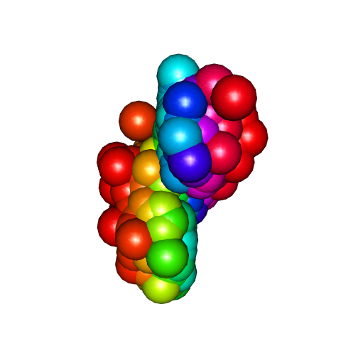

Multiple rgl plots on one html page (using knitr & Markdown)
========================================================


```r
knit_hooks$set(webgl = hook_webgl)
```


This works fine.


```r
x <- sort(rnorm(1000))
y <- rnorm(1000)
z <- rnorm(1000) + atan2(x, y)
plot3d(x, y, z, col = rainbow(1000))
```

<script src="CanvasMatrix.js" type="text/javascript"></script>
<canvas id="textureCanvas" style="display: none;" width="256" height="256">
<br>
	Your browser does not support the HTML5 canvas element.</canvas>
<!-- ****** points object 6 ****** -->
<script id="vshader6" type="x-shader/x-vertex">
	attribute vec3 aPos;
	attribute vec4 aCol;
	uniform mat4 mvMatrix;
	uniform mat4 prMatrix;
	varying vec4 vDiffuse;
	void main(void) {
	  gl_Position = prMatrix * mvMatrix * vec4(aPos, 1.);
	  gl_PointSize = 3.;
	  vDiffuse = aCol;
	}
</script>
<script id="fshader6" type="x-shader/x-fragment"> 
	#ifdef GL_ES
	precision highp float;
	#endif
	varying vec4 vDiffuse; // carries alpha
	void main(void) {
	  vec4 diffuse;
	  diffuse = vDiffuse;
	  gl_FragColor = diffuse;
	}
</script> 
<!-- ****** text object 8 ****** -->
<script id="vshader8" type="x-shader/x-vertex">
	attribute vec3 aPos;
	attribute vec4 aCol;
	uniform mat4 mvMatrix;
	uniform mat4 prMatrix;
	varying vec4 vDiffuse;
	attribute vec2 aTexcoord;
	varying vec2 vTexcoord;
	attribute vec2 aOfs;
	void main(void) {
	  vDiffuse = aCol;
	  vTexcoord = aTexcoord;
	  vec4 pos = prMatrix * mvMatrix * vec4(aPos, 1.);
	  pos = pos/pos.w;
	  gl_Position = pos + vec4(aOfs, 0.,0.);
	}
</script>
<script id="fshader8" type="x-shader/x-fragment"> 
	#ifdef GL_ES
	precision highp float;
	#endif
	varying vec4 vDiffuse; // carries alpha
	varying vec2 vTexcoord;
	uniform sampler2D uSampler;
	void main(void) {
	  vec4 diffuse;
	  diffuse = vDiffuse;
	  vec4 textureColor = diffuse*texture2D(uSampler, vTexcoord);
	  if (textureColor.a < 0.1)
	    discard;
	  else
	    gl_FragColor = textureColor;
	}
</script> 
<!-- ****** text object 9 ****** -->
<script id="vshader9" type="x-shader/x-vertex">
	attribute vec3 aPos;
	attribute vec4 aCol;
	uniform mat4 mvMatrix;
	uniform mat4 prMatrix;
	varying vec4 vDiffuse;
	attribute vec2 aTexcoord;
	varying vec2 vTexcoord;
	attribute vec2 aOfs;
	void main(void) {
	  vDiffuse = aCol;
	  vTexcoord = aTexcoord;
	  vec4 pos = prMatrix * mvMatrix * vec4(aPos, 1.);
	  pos = pos/pos.w;
	  gl_Position = pos + vec4(aOfs, 0.,0.);
	}
</script>
<script id="fshader9" type="x-shader/x-fragment"> 
	#ifdef GL_ES
	precision highp float;
	#endif
	varying vec4 vDiffuse; // carries alpha
	varying vec2 vTexcoord;
	uniform sampler2D uSampler;
	void main(void) {
	  vec4 diffuse;
	  diffuse = vDiffuse;
	  vec4 textureColor = diffuse*texture2D(uSampler, vTexcoord);
	  if (textureColor.a < 0.1)
	    discard;
	  else
	    gl_FragColor = textureColor;
	}
</script> 
<!-- ****** text object 10 ****** -->
<script id="vshader10" type="x-shader/x-vertex">
	attribute vec3 aPos;
	attribute vec4 aCol;
	uniform mat4 mvMatrix;
	uniform mat4 prMatrix;
	varying vec4 vDiffuse;
	attribute vec2 aTexcoord;
	varying vec2 vTexcoord;
	attribute vec2 aOfs;
	void main(void) {
	  vDiffuse = aCol;
	  vTexcoord = aTexcoord;
	  vec4 pos = prMatrix * mvMatrix * vec4(aPos, 1.);
	  pos = pos/pos.w;
	  gl_Position = pos + vec4(aOfs, 0.,0.);
	}
</script>
<script id="fshader10" type="x-shader/x-fragment"> 
	#ifdef GL_ES
	precision highp float;
	#endif
	varying vec4 vDiffuse; // carries alpha
	varying vec2 vTexcoord;
	uniform sampler2D uSampler;
	void main(void) {
	  vec4 diffuse;
	  diffuse = vDiffuse;
	  vec4 textureColor = diffuse*texture2D(uSampler, vTexcoord);
	  if (textureColor.a < 0.1)
	    discard;
	  else
	    gl_FragColor = textureColor;
	}
</script> 
<!-- ****** lines object 11 ****** -->
<script id="vshader11" type="x-shader/x-vertex">
	attribute vec3 aPos;
	attribute vec4 aCol;
	uniform mat4 mvMatrix;
	uniform mat4 prMatrix;
	varying vec4 vDiffuse;
	void main(void) {
	  gl_Position = prMatrix * mvMatrix * vec4(aPos, 1.);
	  vDiffuse = aCol;
	}
</script>
<script id="fshader11" type="x-shader/x-fragment"> 
	#ifdef GL_ES
	precision highp float;
	#endif
	varying vec4 vDiffuse; // carries alpha
	void main(void) {
	  vec4 diffuse;
	  diffuse = vDiffuse;
	  gl_FragColor = diffuse;
	}
</script> 
<!-- ****** text object 12 ****** -->
<script id="vshader12" type="x-shader/x-vertex">
	attribute vec3 aPos;
	attribute vec4 aCol;
	uniform mat4 mvMatrix;
	uniform mat4 prMatrix;
	varying vec4 vDiffuse;
	attribute vec2 aTexcoord;
	varying vec2 vTexcoord;
	attribute vec2 aOfs;
	void main(void) {
	  vDiffuse = aCol;
	  vTexcoord = aTexcoord;
	  vec4 pos = prMatrix * mvMatrix * vec4(aPos, 1.);
	  pos = pos/pos.w;
	  gl_Position = pos + vec4(aOfs, 0.,0.);
	}
</script>
<script id="fshader12" type="x-shader/x-fragment"> 
	#ifdef GL_ES
	precision highp float;
	#endif
	varying vec4 vDiffuse; // carries alpha
	varying vec2 vTexcoord;
	uniform sampler2D uSampler;
	void main(void) {
	  vec4 diffuse;
	  diffuse = vDiffuse;
	  vec4 textureColor = diffuse*texture2D(uSampler, vTexcoord);
	  if (textureColor.a < 0.1)
	    discard;
	  else
	    gl_FragColor = textureColor;
	}
</script> 
<!-- ****** lines object 13 ****** -->
<script id="vshader13" type="x-shader/x-vertex">
	attribute vec3 aPos;
	attribute vec4 aCol;
	uniform mat4 mvMatrix;
	uniform mat4 prMatrix;
	varying vec4 vDiffuse;
	void main(void) {
	  gl_Position = prMatrix * mvMatrix * vec4(aPos, 1.);
	  vDiffuse = aCol;
	}
</script>
<script id="fshader13" type="x-shader/x-fragment"> 
	#ifdef GL_ES
	precision highp float;
	#endif
	varying vec4 vDiffuse; // carries alpha
	void main(void) {
	  vec4 diffuse;
	  diffuse = vDiffuse;
	  gl_FragColor = diffuse;
	}
</script> 
<!-- ****** text object 14 ****** -->
<script id="vshader14" type="x-shader/x-vertex">
	attribute vec3 aPos;
	attribute vec4 aCol;
	uniform mat4 mvMatrix;
	uniform mat4 prMatrix;
	varying vec4 vDiffuse;
	attribute vec2 aTexcoord;
	varying vec2 vTexcoord;
	attribute vec2 aOfs;
	void main(void) {
	  vDiffuse = aCol;
	  vTexcoord = aTexcoord;
	  vec4 pos = prMatrix * mvMatrix * vec4(aPos, 1.);
	  pos = pos/pos.w;
	  gl_Position = pos + vec4(aOfs, 0.,0.);
	}
</script>
<script id="fshader14" type="x-shader/x-fragment"> 
	#ifdef GL_ES
	precision highp float;
	#endif
	varying vec4 vDiffuse; // carries alpha
	varying vec2 vTexcoord;
	uniform sampler2D uSampler;
	void main(void) {
	  vec4 diffuse;
	  diffuse = vDiffuse;
	  vec4 textureColor = diffuse*texture2D(uSampler, vTexcoord);
	  if (textureColor.a < 0.1)
	    discard;
	  else
	    gl_FragColor = textureColor;
	}
</script> 
<!-- ****** lines object 15 ****** -->
<script id="vshader15" type="x-shader/x-vertex">
	attribute vec3 aPos;
	attribute vec4 aCol;
	uniform mat4 mvMatrix;
	uniform mat4 prMatrix;
	varying vec4 vDiffuse;
	void main(void) {
	  gl_Position = prMatrix * mvMatrix * vec4(aPos, 1.);
	  vDiffuse = aCol;
	}
</script>
<script id="fshader15" type="x-shader/x-fragment"> 
	#ifdef GL_ES
	precision highp float;
	#endif
	varying vec4 vDiffuse; // carries alpha
	void main(void) {
	  vec4 diffuse;
	  diffuse = vDiffuse;
	  gl_FragColor = diffuse;
	}
</script> 
<!-- ****** text object 16 ****** -->
<script id="vshader16" type="x-shader/x-vertex">
	attribute vec3 aPos;
	attribute vec4 aCol;
	uniform mat4 mvMatrix;
	uniform mat4 prMatrix;
	varying vec4 vDiffuse;
	attribute vec2 aTexcoord;
	varying vec2 vTexcoord;
	attribute vec2 aOfs;
	void main(void) {
	  vDiffuse = aCol;
	  vTexcoord = aTexcoord;
	  vec4 pos = prMatrix * mvMatrix * vec4(aPos, 1.);
	  pos = pos/pos.w;
	  gl_Position = pos + vec4(aOfs, 0.,0.);
	}
</script>
<script id="fshader16" type="x-shader/x-fragment"> 
	#ifdef GL_ES
	precision highp float;
	#endif
	varying vec4 vDiffuse; // carries alpha
	varying vec2 vTexcoord;
	uniform sampler2D uSampler;
	void main(void) {
	  vec4 diffuse;
	  diffuse = vDiffuse;
	  vec4 textureColor = diffuse*texture2D(uSampler, vTexcoord);
	  if (textureColor.a < 0.1)
	    discard;
	  else
	    gl_FragColor = textureColor;
	}
</script> 
<!-- ****** lines object 17 ****** -->
<script id="vshader17" type="x-shader/x-vertex">
	attribute vec3 aPos;
	attribute vec4 aCol;
	uniform mat4 mvMatrix;
	uniform mat4 prMatrix;
	varying vec4 vDiffuse;
	void main(void) {
	  gl_Position = prMatrix * mvMatrix * vec4(aPos, 1.);
	  vDiffuse = aCol;
	}
</script>
<script id="fshader17" type="x-shader/x-fragment"> 
	#ifdef GL_ES
	precision highp float;
	#endif
	varying vec4 vDiffuse; // carries alpha
	void main(void) {
	  vec4 diffuse;
	  diffuse = vDiffuse;
	  gl_FragColor = diffuse;
	}
</script> 
<script type="text/javascript"> 
	function getShader ( gl, id ){
	   var shaderScript = document.getElementById ( id );
	   var str = "";
	   var k = shaderScript.firstChild;
	   while ( k ){
	     if ( k.nodeType == 3 ) str += k.textContent;
	     k = k.nextSibling;
	   }
	   var shader;
	   if ( shaderScript.type == "x-shader/x-fragment" )
             shader = gl.createShader ( gl.FRAGMENT_SHADER );
	   else if ( shaderScript.type == "x-shader/x-vertex" )
             shader = gl.createShader(gl.VERTEX_SHADER);
	   else return null;
	   gl.shaderSource(shader, str);
	   gl.compileShader(shader);
	   if (gl.getShaderParameter(shader, gl.COMPILE_STATUS) == 0)
	     alert(gl.getShaderInfoLog(shader));
	   return shader;
	}
	var min = Math.min;
	var max = Math.max;
	var sqrt = Math.sqrt;
	var sin = Math.sin;
	var acos = Math.acos;
	var tan = Math.tan;
	var SQRT2 = Math.SQRT2;
	var PI = Math.PI;
	var log = Math.log;
	var exp = Math.exp;
	function webGLStart() {
	   var debug = function(msg) {
	     document.getElementById("debug").innerHTML = msg;
	   }
	   debug("");
	   var canvas = document.getElementById("canvas");
	   if (!window.WebGLRenderingContext){
	     debug("<br> Your browser does not support WebGL. See <a href=\"http://get.webgl.org\">http://get.webgl.org</a>");
	     return;
	   }
	   var gl;
	   try {
	     // Try to grab the standard context. If it fails, fallback to experimental.
	     gl = canvas.getContext("webgl") 
	       || canvas.getContext("experimental-webgl");
	   }
	   catch(e) {}
	   if ( !gl ) {
	     debug("<br> Your browser appears to support WebGL, but did not create a WebGL context.  See <a href=\"http://get.webgl.org\">http://get.webgl.org</a>");
	     return;
	   }
	   var width = 505;  var height = 505;
	   canvas.width = width;   canvas.height = height;
	   gl.viewport(0, 0, width, height);
	   var prMatrix = new CanvasMatrix4();
	   var mvMatrix = new CanvasMatrix4();
	   var normMatrix = new CanvasMatrix4();
	   var saveMat = new CanvasMatrix4();
	   saveMat.makeIdentity();
	   var distance;
	   var zoom = 1;
	   var fov = 30;
	   var userMatrix = new CanvasMatrix4();
	   userMatrix.load([
	    1, 0, 0, 0,
	    0, 0.3420201, -0.9396926, 0,
	    0, 0.9396926, 0.3420201, 0,
	    0, 0, 0, 1
		]);
	   function getPowerOfTwo(value) {
	     var pow = 1;
	     while(pow<value) {
	       pow *= 2;
	     }
	     return pow;
	   }
	   function handleLoadedTexture(texture, textureCanvas) {
	     gl.pixelStorei(gl.UNPACK_FLIP_Y_WEBGL, true);
	     gl.bindTexture(gl.TEXTURE_2D, texture);
	     gl.texImage2D(gl.TEXTURE_2D, 0, gl.RGBA, gl.RGBA, gl.UNSIGNED_BYTE, textureCanvas);
	     gl.texParameteri(gl.TEXTURE_2D, gl.TEXTURE_MAG_FILTER, gl.LINEAR);
	     gl.texParameteri(gl.TEXTURE_2D, gl.TEXTURE_MIN_FILTER, gl.LINEAR_MIPMAP_NEAREST);
	     gl.generateMipmap(gl.TEXTURE_2D);
	     gl.bindTexture(gl.TEXTURE_2D, null);
	   }
	   function loadImageToTexture(filename, texture) {   
	     var canvas = document.getElementById("textureCanvas");
	     var ctx = canvas.getContext("2d");
	     var image = new Image();
	     image.onload = function() {
	       var w = image.width;
	       var h = image.height;
	       var canvasX = getPowerOfTwo(w);
	       var canvasY = getPowerOfTwo(h);
	       canvas.width = canvasX;
	       canvas.height = canvasY;
	       ctx.imageSmoothingEnabled = true;
	       ctx.drawImage(image, 0, 0, canvasX, canvasY);
	       handleLoadedTexture(texture, canvas);
   	       drawScene();
	     }
	     image.src = filename;
	   }  	   
	   function drawTextToCanvas(text, cex) {
	     var canvasX, canvasY;
	     var textX, textY;
	     var textHeight = 20 * cex;
	     var textColour = "white";
	     var fontFamily = "Arial";
	     var backgroundColour = "rgba(0,0,0,0)";
	     var canvas = document.getElementById("textureCanvas");
	     var ctx = canvas.getContext("2d");
	     ctx.font = textHeight+"px "+fontFamily;
             canvasX = 1;
             var widths = [];
	     for (var i = 0; i < text.length; i++)  {
	       widths[i] = ctx.measureText(text[i]).width;
	       canvasX = (widths[i] > canvasX) ? widths[i] : canvasX;
	     }	  
	     canvasX = getPowerOfTwo(canvasX);
	     var offset = 2*textHeight; // offset to first baseline
	     var skip = 2*textHeight;   // skip between baselines	  
	     canvasY = getPowerOfTwo(offset + text.length*skip);
	     canvas.width = canvasX;
	     canvas.height = canvasY;
	     ctx.fillStyle = backgroundColour;
	     ctx.fillRect(0, 0, ctx.canvas.width, ctx.canvas.height);
	     ctx.fillStyle = textColour;
	     ctx.textAlign = "left";
	     ctx.textBaseline = "alphabetic";
	     ctx.font = textHeight+"px "+fontFamily;
	     for(var i = 0; i < text.length; i++) {
	       textY = i*skip + offset;
	       ctx.fillText(text[i], 0,  textY);
	     }
	     return {canvasX:canvasX, canvasY:canvasY,
	             widths:widths, textHeight:textHeight,
	             offset:offset, skip:skip};
	   }
	   // ****** points object 6 ******
	   var prog6  = gl.createProgram();
	   gl.attachShader(prog6, getShader( gl, "vshader6" ));
	   gl.attachShader(prog6, getShader( gl, "fshader6" ));
	   gl.linkProgram(prog6);
	   var v=new Float32Array([
	    -3.056145, 1.886282, -0.007018561, 1, 0, 0, 1,
	    -3.031044, 1.119619, 0.3877218, 1, 0.007843138, 0, 1,
	    -2.886618, 0.3235759, -0.6455945, 1, 0.01176471, 0, 1,
	    -2.833032, -1.269038, -2.072585, 1, 0.01960784, 0, 1,
	    -2.775351, -0.3663515, 0.6144093, 1, 0.02352941, 0, 1,
	    -2.711076, 1.183358, -0.5703562, 1, 0.03137255, 0, 1,
	    -2.535644, 0.8383019, -2.274602, 1, 0.03529412, 0, 1,
	    -2.420531, 0.597207, 0.2605592, 1, 0.04313726, 0, 1,
	    -2.406681, 0.720432, -1.465788, 1, 0.04705882, 0, 1,
	    -2.379919, 0.05923881, 0.4899176, 1, 0.05490196, 0, 1,
	    -2.318884, 0.3339273, -0.5317976, 1, 0.05882353, 0, 1,
	    -2.282159, -0.3453, -0.5733533, 1, 0.06666667, 0, 1,
	    -2.225414, 0.154906, 0.5107223, 1, 0.07058824, 0, 1,
	    -2.203122, 1.951612, -0.7895277, 1, 0.07843138, 0, 1,
	    -2.182726, 2.042522, -0.9950013, 1, 0.08235294, 0, 1,
	    -2.175214, 1.188388, -1.137453, 1, 0.09019608, 0, 1,
	    -2.157397, 1.741134, -1.415157, 1, 0.09411765, 0, 1,
	    -2.147518, 0.861748, -1.633948, 1, 0.1019608, 0, 1,
	    -2.136631, -0.1906906, -0.4480415, 1, 0.1098039, 0, 1,
	    -2.104681, -0.3284069, -1.721876, 1, 0.1137255, 0, 1,
	    -2.065638, 2.427861, -0.3024858, 1, 0.1215686, 0, 1,
	    -2.027287, -1.368622, -4.017282, 1, 0.1254902, 0, 1,
	    -2.023514, -0.3273408, -3.694004, 1, 0.1333333, 0, 1,
	    -2.023216, 0.5596219, -1.142125, 1, 0.1372549, 0, 1,
	    -2.020813, 0.08032244, -2.003026, 1, 0.145098, 0, 1,
	    -2.005246, -0.8221834, -1.279933, 1, 0.1490196, 0, 1,
	    -1.995226, -1.829485, -2.013919, 1, 0.1568628, 0, 1,
	    -1.980175, 1.163885, -1.01221, 1, 0.1607843, 0, 1,
	    -1.946303, 0.8581457, -1.616911, 1, 0.1686275, 0, 1,
	    -1.943868, 0.4970201, -0.9375265, 1, 0.172549, 0, 1,
	    -1.94058, 2.24091, -1.151097, 1, 0.1803922, 0, 1,
	    -1.927513, -1.652916, -3.217656, 1, 0.1843137, 0, 1,
	    -1.874091, -2.516416, -2.142183, 1, 0.1921569, 0, 1,
	    -1.87288, -0.3013559, -1.838807, 1, 0.1960784, 0, 1,
	    -1.865124, -1.288684, -3.756742, 1, 0.2039216, 0, 1,
	    -1.857276, 0.8005157, -3.499939, 1, 0.2117647, 0, 1,
	    -1.855129, 0.935889, 2.512794, 1, 0.2156863, 0, 1,
	    -1.853399, 2.107074, -0.4403162, 1, 0.2235294, 0, 1,
	    -1.84772, -1.656705, -2.610461, 1, 0.227451, 0, 1,
	    -1.770413, -0.1573787, -3.03678, 1, 0.2352941, 0, 1,
	    -1.753344, -0.3839686, -1.149892, 1, 0.2392157, 0, 1,
	    -1.752008, 0.2708684, -2.211579, 1, 0.2470588, 0, 1,
	    -1.745925, -0.03309685, -2.005428, 1, 0.2509804, 0, 1,
	    -1.730229, -1.139422, -2.630241, 1, 0.2588235, 0, 1,
	    -1.717916, -1.334776, -1.549597, 1, 0.2627451, 0, 1,
	    -1.717047, -0.4521207, -2.267808, 1, 0.2705882, 0, 1,
	    -1.66324, -0.2648152, 0.254584, 1, 0.2745098, 0, 1,
	    -1.6502, -0.4550963, -1.53028, 1, 0.282353, 0, 1,
	    -1.646146, 0.08321075, -0.7128131, 1, 0.2862745, 0, 1,
	    -1.625245, 0.346316, -2.030718, 1, 0.2941177, 0, 1,
	    -1.622429, -0.2175489, -2.250892, 1, 0.3019608, 0, 1,
	    -1.622107, -1.025937, -2.037518, 1, 0.3058824, 0, 1,
	    -1.611211, 1.23325, -0.1093315, 1, 0.3137255, 0, 1,
	    -1.599206, -0.1267943, -1.53316, 1, 0.3176471, 0, 1,
	    -1.573717, 0.5648122, -0.884275, 1, 0.3254902, 0, 1,
	    -1.571275, 0.4965371, -1.788997, 1, 0.3294118, 0, 1,
	    -1.56892, 0.6185902, -1.021844, 1, 0.3372549, 0, 1,
	    -1.563976, 1.36609, 0.3320586, 1, 0.3411765, 0, 1,
	    -1.555226, 0.6609198, -0.8335678, 1, 0.3490196, 0, 1,
	    -1.546422, 0.1651426, -1.205858, 1, 0.3529412, 0, 1,
	    -1.535318, 0.9834285, 0.4873896, 1, 0.3607843, 0, 1,
	    -1.525227, -0.08523389, -1.534458, 1, 0.3647059, 0, 1,
	    -1.521365, 1.996132, -0.08183745, 1, 0.372549, 0, 1,
	    -1.518118, -0.6141945, -0.4243658, 1, 0.3764706, 0, 1,
	    -1.514287, 2.25772, -0.1122439, 1, 0.3843137, 0, 1,
	    -1.495963, 1.36434, -0.690415, 1, 0.3882353, 0, 1,
	    -1.477685, -0.7675964, -3.996864, 1, 0.3960784, 0, 1,
	    -1.476584, 0.6281176, -1.324133, 1, 0.4039216, 0, 1,
	    -1.465544, -0.21127, -0.923884, 1, 0.4078431, 0, 1,
	    -1.462376, 0.1847917, -0.6630469, 1, 0.4156863, 0, 1,
	    -1.459005, -0.2024971, -1.63771, 1, 0.4196078, 0, 1,
	    -1.454198, 2.667338, -0.1557474, 1, 0.427451, 0, 1,
	    -1.454171, -0.2836981, -1.592281, 1, 0.4313726, 0, 1,
	    -1.444613, -0.3630278, -2.482654, 1, 0.4392157, 0, 1,
	    -1.444589, -1.496706, -4.119879, 1, 0.4431373, 0, 1,
	    -1.443175, 0.3761219, -1.213246, 1, 0.4509804, 0, 1,
	    -1.4393, 1.630555, -1.791352, 1, 0.454902, 0, 1,
	    -1.435989, 0.5021535, -1.740705, 1, 0.4627451, 0, 1,
	    -1.432348, 0.4743181, -0.4419257, 1, 0.4666667, 0, 1,
	    -1.427813, 0.7026888, -0.6713369, 1, 0.4745098, 0, 1,
	    -1.424618, -0.8528081, -2.907942, 1, 0.4784314, 0, 1,
	    -1.411476, 1.142059, -0.915122, 1, 0.4862745, 0, 1,
	    -1.409002, -0.1354163, -2.022179, 1, 0.4901961, 0, 1,
	    -1.40303, -0.02025015, -1.973263, 1, 0.4980392, 0, 1,
	    -1.390986, -0.9172133, -3.137759, 1, 0.5058824, 0, 1,
	    -1.388361, -1.349775, -0.9355019, 1, 0.509804, 0, 1,
	    -1.383554, 0.5785713, -0.7767422, 1, 0.5176471, 0, 1,
	    -1.378077, -0.08934873, -3.121643, 1, 0.5215687, 0, 1,
	    -1.373834, -0.6605766, -1.445512, 1, 0.5294118, 0, 1,
	    -1.368701, 1.052106, -1.700792, 1, 0.5333334, 0, 1,
	    -1.366521, 0.7290304, -0.8355908, 1, 0.5411765, 0, 1,
	    -1.36643, 0.8349307, -1.667573, 1, 0.5450981, 0, 1,
	    -1.362536, 0.1987508, -0.6377719, 1, 0.5529412, 0, 1,
	    -1.331752, 1.603672, -1.12466, 1, 0.5568628, 0, 1,
	    -1.323494, 2.087792, 0.6195907, 1, 0.5647059, 0, 1,
	    -1.322275, -1.06639, -1.232931, 1, 0.5686275, 0, 1,
	    -1.313976, 0.3878777, -2.358652, 1, 0.5764706, 0, 1,
	    -1.313696, -1.301586, -2.58532, 1, 0.5803922, 0, 1,
	    -1.310726, -0.2692313, -1.65525, 1, 0.5882353, 0, 1,
	    -1.310614, 0.5288709, -2.164339, 1, 0.5921569, 0, 1,
	    -1.307505, -0.6845834, -1.949714, 1, 0.6, 0, 1,
	    -1.294499, 0.4040381, -2.171807, 1, 0.6078432, 0, 1,
	    -1.284447, -0.670176, -3.035674, 1, 0.6117647, 0, 1,
	    -1.264979, 1.037539, -2.819579, 1, 0.6196079, 0, 1,
	    -1.264612, -1.173448, -2.954057, 1, 0.6235294, 0, 1,
	    -1.254198, 1.111257, -1.135932, 1, 0.6313726, 0, 1,
	    -1.231334, -0.8801479, -1.911219, 1, 0.6352941, 0, 1,
	    -1.222308, -0.6972095, 0.5822262, 1, 0.6431373, 0, 1,
	    -1.221225, 0.2951089, -1.772578, 1, 0.6470588, 0, 1,
	    -1.218906, -0.9947531, -2.194144, 1, 0.654902, 0, 1,
	    -1.218545, 1.218734, -2.024748, 1, 0.6588235, 0, 1,
	    -1.217195, 1.714175, -1.326463, 1, 0.6666667, 0, 1,
	    -1.213691, -0.5691001, -5.011568, 1, 0.6705883, 0, 1,
	    -1.211168, -2.209424, -3.014916, 1, 0.6784314, 0, 1,
	    -1.192837, 2.011306, -1.592334, 1, 0.682353, 0, 1,
	    -1.188244, -1.238956, -2.399926, 1, 0.6901961, 0, 1,
	    -1.168997, -0.6125668, -1.630989, 1, 0.6941177, 0, 1,
	    -1.159746, 1.385775, -0.1487345, 1, 0.7019608, 0, 1,
	    -1.158581, -0.07823578, -1.192437, 1, 0.7098039, 0, 1,
	    -1.156535, 0.7330171, -2.569317, 1, 0.7137255, 0, 1,
	    -1.147036, -0.2769083, -2.120214, 1, 0.7215686, 0, 1,
	    -1.146319, 0.3927264, -1.116359, 1, 0.7254902, 0, 1,
	    -1.124368, -1.566993, -2.280612, 1, 0.7333333, 0, 1,
	    -1.121792, 1.39482, -0.1628805, 1, 0.7372549, 0, 1,
	    -1.111318, 1.263799, -1.861119, 1, 0.7450981, 0, 1,
	    -1.106104, 0.5566992, 0.7353928, 1, 0.7490196, 0, 1,
	    -1.098029, -0.1571875, 0.3506261, 1, 0.7568628, 0, 1,
	    -1.092887, 0.03075792, -0.8937465, 1, 0.7607843, 0, 1,
	    -1.091844, 0.03186675, -2.458346, 1, 0.7686275, 0, 1,
	    -1.082895, 1.038956, -1.338816, 1, 0.772549, 0, 1,
	    -1.079819, 2.924257, -1.841193, 1, 0.7803922, 0, 1,
	    -1.072286, 1.004277, -1.558019, 1, 0.7843137, 0, 1,
	    -1.065816, -1.042602, -3.020903, 1, 0.7921569, 0, 1,
	    -1.063907, 0.1571055, -2.372264, 1, 0.7960784, 0, 1,
	    -1.062473, -1.715006, -1.179564, 1, 0.8039216, 0, 1,
	    -1.057858, 0.7247865, 0.6046127, 1, 0.8117647, 0, 1,
	    -1.042261, -0.6707597, -2.388205, 1, 0.8156863, 0, 1,
	    -1.042002, 0.27674, 0.1780376, 1, 0.8235294, 0, 1,
	    -1.041655, -0.1873441, -2.490192, 1, 0.827451, 0, 1,
	    -1.041283, -0.1986744, -0.5726236, 1, 0.8352941, 0, 1,
	    -1.040025, 1.229966, -1.836576, 1, 0.8392157, 0, 1,
	    -1.039939, -0.03187095, -0.6143942, 1, 0.8470588, 0, 1,
	    -1.039205, 0.2035014, 0.108629, 1, 0.8509804, 0, 1,
	    -1.035232, -0.1361857, -2.414205, 1, 0.8588235, 0, 1,
	    -1.029536, 0.6571333, -0.4884085, 1, 0.8627451, 0, 1,
	    -1.022883, 0.1996828, -1.531292, 1, 0.8705882, 0, 1,
	    -1.017849, -0.7698771, -2.371571, 1, 0.8745098, 0, 1,
	    -1.009753, -1.063387, -2.241831, 1, 0.8823529, 0, 1,
	    -0.9975591, -1.72202, -1.629204, 1, 0.8862745, 0, 1,
	    -0.9965574, -0.1314455, -3.197107, 1, 0.8941177, 0, 1,
	    -0.9963557, -0.279666, -0.4375281, 1, 0.8980392, 0, 1,
	    -0.9951374, -0.2798726, -3.752493, 1, 0.9058824, 0, 1,
	    -0.9947518, -1.224858, -3.169739, 1, 0.9137255, 0, 1,
	    -0.9933274, -0.7662625, -1.977754, 1, 0.9176471, 0, 1,
	    -0.9930634, 0.555397, -1.37553, 1, 0.9254902, 0, 1,
	    -0.9828663, -1.020142, -3.682875, 1, 0.9294118, 0, 1,
	    -0.9810541, -0.3687579, -1.941992, 1, 0.9372549, 0, 1,
	    -0.9790049, -0.8012257, -4.060072, 1, 0.9411765, 0, 1,
	    -0.9715037, -0.8648344, -1.925804, 1, 0.9490196, 0, 1,
	    -0.9713919, 0.3044514, -1.533912, 1, 0.9529412, 0, 1,
	    -0.9605163, 0.7168805, -0.9174531, 1, 0.9607843, 0, 1,
	    -0.9601286, 1.596924, -1.655899, 1, 0.9647059, 0, 1,
	    -0.9532089, 1.572257, -1.397813, 1, 0.972549, 0, 1,
	    -0.9496769, 1.001575, -0.1964971, 1, 0.9764706, 0, 1,
	    -0.9460616, 0.5142125, -0.320976, 1, 0.9843137, 0, 1,
	    -0.937255, -0.328042, -1.041952, 1, 0.9882353, 0, 1,
	    -0.9325035, -1.398729, -2.813193, 1, 0.9960784, 0, 1,
	    -0.9298276, 0.2393049, -0.3981446, 0.9960784, 1, 0, 1,
	    -0.9240633, 0.216456, 0.985999, 0.9921569, 1, 0, 1,
	    -0.9233155, 0.2534979, -2.487265, 0.9843137, 1, 0, 1,
	    -0.9183525, -0.4664703, -1.40475, 0.9803922, 1, 0, 1,
	    -0.9171985, 1.757531, -2.36233, 0.972549, 1, 0, 1,
	    -0.913722, -0.2252268, -1.433995, 0.9686275, 1, 0, 1,
	    -0.9020174, -1.307885, -1.867857, 0.9607843, 1, 0, 1,
	    -0.8965573, -0.01520509, -2.164803, 0.9568627, 1, 0, 1,
	    -0.893145, 0.436998, -0.5925706, 0.9490196, 1, 0, 1,
	    -0.8839234, 0.8880627, -0.910977, 0.945098, 1, 0, 1,
	    -0.8829616, -1.00445, -2.142115, 0.9372549, 1, 0, 1,
	    -0.8814711, 1.705882, 0.7521141, 0.9333333, 1, 0, 1,
	    -0.8804659, 0.2124621, -3.256499, 0.9254902, 1, 0, 1,
	    -0.8759768, 1.034218, -1.361207, 0.9215686, 1, 0, 1,
	    -0.8752999, 1.544967, 2.003243, 0.9137255, 1, 0, 1,
	    -0.8738387, -0.5276292, -0.6706538, 0.9098039, 1, 0, 1,
	    -0.8693423, -0.6938829, -2.183673, 0.9019608, 1, 0, 1,
	    -0.8651646, -0.1492857, -1.666401, 0.8941177, 1, 0, 1,
	    -0.8550928, -1.257253, -4.743679, 0.8901961, 1, 0, 1,
	    -0.8515792, -1.573145, -3.561398, 0.8823529, 1, 0, 1,
	    -0.850986, 1.16229, -0.8597871, 0.8784314, 1, 0, 1,
	    -0.8507898, 1.258529, -1.625638, 0.8705882, 1, 0, 1,
	    -0.8501256, 1.659996, -0.2362391, 0.8666667, 1, 0, 1,
	    -0.848083, 0.7007035, -1.040365, 0.8588235, 1, 0, 1,
	    -0.8460424, 1.376403, 0.1992238, 0.854902, 1, 0, 1,
	    -0.8414279, -0.9182755, -1.840415, 0.8470588, 1, 0, 1,
	    -0.837885, 0.311887, -0.8879631, 0.8431373, 1, 0, 1,
	    -0.8345532, 0.7080593, -0.3666771, 0.8352941, 1, 0, 1,
	    -0.8337097, 1.173075, -0.5874318, 0.8313726, 1, 0, 1,
	    -0.8298297, 1.01241, -0.6705326, 0.8235294, 1, 0, 1,
	    -0.8264573, -0.1470674, -0.8433477, 0.8196079, 1, 0, 1,
	    -0.8251267, -0.1094849, -1.91005, 0.8117647, 1, 0, 1,
	    -0.8238296, 1.079412, -0.5751967, 0.8078431, 1, 0, 1,
	    -0.8166732, 0.373711, -0.983254, 0.8, 1, 0, 1,
	    -0.8107722, 0.1927475, -0.8510048, 0.7921569, 1, 0, 1,
	    -0.8057354, -1.176855, -2.539093, 0.7882353, 1, 0, 1,
	    -0.7998614, -1.263221, -1.918306, 0.7803922, 1, 0, 1,
	    -0.7967739, 1.757236, 0.1598173, 0.7764706, 1, 0, 1,
	    -0.7893546, 1.280187, 0.04567719, 0.7686275, 1, 0, 1,
	    -0.7826152, -0.8835933, -0.8050848, 0.7647059, 1, 0, 1,
	    -0.7754557, -0.5010868, -0.7602403, 0.7568628, 1, 0, 1,
	    -0.7748991, 1.594403, 0.2667933, 0.7529412, 1, 0, 1,
	    -0.7710679, 0.504848, -0.2367436, 0.7450981, 1, 0, 1,
	    -0.7701823, -1.897197, -4.787463, 0.7411765, 1, 0, 1,
	    -0.7662647, -0.3867979, -3.298702, 0.7333333, 1, 0, 1,
	    -0.7620689, -1.09549, -2.862471, 0.7294118, 1, 0, 1,
	    -0.7618962, 0.3441774, -0.7403987, 0.7215686, 1, 0, 1,
	    -0.7596582, 0.5863636, 0.003611895, 0.7176471, 1, 0, 1,
	    -0.751124, 0.826767, -1.851251, 0.7098039, 1, 0, 1,
	    -0.7496121, 0.3773533, -1.841481, 0.7058824, 1, 0, 1,
	    -0.744063, -0.02795182, -1.349973, 0.6980392, 1, 0, 1,
	    -0.7366481, 0.7661078, -2.044721, 0.6901961, 1, 0, 1,
	    -0.730081, 0.1631822, -1.711998, 0.6862745, 1, 0, 1,
	    -0.7269644, 0.6653593, -2.797982, 0.6784314, 1, 0, 1,
	    -0.7268004, -1.752786, -1.023909, 0.6745098, 1, 0, 1,
	    -0.7224774, 0.4177309, -3.263918, 0.6666667, 1, 0, 1,
	    -0.7224033, -1.214249, -2.531882, 0.6627451, 1, 0, 1,
	    -0.721633, 0.3827802, -0.8102925, 0.654902, 1, 0, 1,
	    -0.7189017, -0.4130082, -4.011341, 0.6509804, 1, 0, 1,
	    -0.7137349, -1.925886, -2.022979, 0.6431373, 1, 0, 1,
	    -0.7036564, 0.375959, -0.6315434, 0.6392157, 1, 0, 1,
	    -0.6848562, 0.9500732, -1.212289, 0.6313726, 1, 0, 1,
	    -0.6845595, -0.09298889, -0.806908, 0.627451, 1, 0, 1,
	    -0.6779132, -0.009223513, -3.107601, 0.6196079, 1, 0, 1,
	    -0.6731718, -0.633198, -1.060641, 0.6156863, 1, 0, 1,
	    -0.6725154, 1.28155, 1.883082, 0.6078432, 1, 0, 1,
	    -0.6662967, -0.366969, -2.91331, 0.6039216, 1, 0, 1,
	    -0.6616067, 0.7431838, 0.09238762, 0.5960785, 1, 0, 1,
	    -0.6609249, 1.496271, -1.039553, 0.5882353, 1, 0, 1,
	    -0.657932, -0.2500212, -2.661912, 0.5843138, 1, 0, 1,
	    -0.6539496, 1.54527, -0.2354135, 0.5764706, 1, 0, 1,
	    -0.6499231, -2.279321, -1.75268, 0.572549, 1, 0, 1,
	    -0.6498384, -0.5062022, -0.7977416, 0.5647059, 1, 0, 1,
	    -0.6407673, 0.4431554, -1.027424, 0.5607843, 1, 0, 1,
	    -0.6404325, 1.108195, -0.9692535, 0.5529412, 1, 0, 1,
	    -0.6339716, -0.06471663, -0.2603905, 0.5490196, 1, 0, 1,
	    -0.6328895, -0.8335634, -0.07154913, 0.5411765, 1, 0, 1,
	    -0.6319071, -0.7239422, -2.814748, 0.5372549, 1, 0, 1,
	    -0.6267781, 2.433088, -0.9688341, 0.5294118, 1, 0, 1,
	    -0.6207468, 1.14688, -0.03820431, 0.5254902, 1, 0, 1,
	    -0.6156, -1.020143, -3.577164, 0.5176471, 1, 0, 1,
	    -0.6123402, -0.3631765, -1.356705, 0.5137255, 1, 0, 1,
	    -0.5988742, 0.7445851, -1.900253, 0.5058824, 1, 0, 1,
	    -0.5984597, 0.02845597, -1.417348, 0.5019608, 1, 0, 1,
	    -0.5979184, -0.3544996, -1.165487, 0.4941176, 1, 0, 1,
	    -0.593614, 0.252217, -2.330559, 0.4862745, 1, 0, 1,
	    -0.5907431, 0.1285657, 0.6825235, 0.4823529, 1, 0, 1,
	    -0.5866226, 0.02859833, -0.3887658, 0.4745098, 1, 0, 1,
	    -0.5825593, 0.1913983, -0.1874123, 0.4705882, 1, 0, 1,
	    -0.5771752, 2.740266, 0.8243107, 0.4627451, 1, 0, 1,
	    -0.5737914, -0.09414537, -3.248325, 0.4588235, 1, 0, 1,
	    -0.5656753, 1.105382, 0.06494952, 0.4509804, 1, 0, 1,
	    -0.5626197, -0.7014709, -2.352981, 0.4470588, 1, 0, 1,
	    -0.5572929, -0.9418155, -3.691603, 0.4392157, 1, 0, 1,
	    -0.5553975, -1.506362, -3.215556, 0.4352941, 1, 0, 1,
	    -0.5528265, -1.682025, -3.400192, 0.427451, 1, 0, 1,
	    -0.5526916, -1.069466, -2.224324, 0.4235294, 1, 0, 1,
	    -0.5507765, 0.6709077, 0.9929946, 0.4156863, 1, 0, 1,
	    -0.5499529, -0.7826464, -2.05837, 0.4117647, 1, 0, 1,
	    -0.5471212, 0.5771558, -0.3470455, 0.4039216, 1, 0, 1,
	    -0.5464558, -0.5261759, -1.789738, 0.3960784, 1, 0, 1,
	    -0.545401, -0.1004357, -1.421827, 0.3921569, 1, 0, 1,
	    -0.5448858, 0.3278862, -0.1489743, 0.3843137, 1, 0, 1,
	    -0.5447471, -1.523636, -3.407014, 0.3803922, 1, 0, 1,
	    -0.539089, -0.6379939, -1.996911, 0.372549, 1, 0, 1,
	    -0.5268361, -0.2905039, -2.210253, 0.3686275, 1, 0, 1,
	    -0.5247591, 1.332827, -0.2849838, 0.3607843, 1, 0, 1,
	    -0.5124679, -0.4369582, -1.034738, 0.3568628, 1, 0, 1,
	    -0.5102921, 0.8983615, -0.83596, 0.3490196, 1, 0, 1,
	    -0.5074819, -2.3657, -3.161162, 0.345098, 1, 0, 1,
	    -0.5049654, -0.03159902, -3.573484, 0.3372549, 1, 0, 1,
	    -0.5003875, -0.4955511, -2.369262, 0.3333333, 1, 0, 1,
	    -0.4969045, -0.8742543, -3.808976, 0.3254902, 1, 0, 1,
	    -0.4959874, -1.200732, -4.963651, 0.3215686, 1, 0, 1,
	    -0.4925876, 0.1555287, 0.431577, 0.3137255, 1, 0, 1,
	    -0.4920394, 0.7435755, 1.016581, 0.3098039, 1, 0, 1,
	    -0.4914299, -1.738815, -4.058926, 0.3019608, 1, 0, 1,
	    -0.4910889, -1.231956, -2.330801, 0.2941177, 1, 0, 1,
	    -0.4881249, 1.04426, 1.405606, 0.2901961, 1, 0, 1,
	    -0.4860239, -0.1804364, 0.006759955, 0.282353, 1, 0, 1,
	    -0.4855846, -0.5696349, -2.426832, 0.2784314, 1, 0, 1,
	    -0.4803375, -0.17283, -3.156438, 0.2705882, 1, 0, 1,
	    -0.4763105, 0.2109009, -0.9179233, 0.2666667, 1, 0, 1,
	    -0.4756239, -0.01792513, -2.069305, 0.2588235, 1, 0, 1,
	    -0.4721491, 0.6307688, -1.083626, 0.254902, 1, 0, 1,
	    -0.470273, 0.7959441, -1.800612, 0.2470588, 1, 0, 1,
	    -0.4694753, 0.541247, -1.382273, 0.2431373, 1, 0, 1,
	    -0.4660354, -0.2842649, -0.1881352, 0.2352941, 1, 0, 1,
	    -0.4654766, -0.3777543, -2.763048, 0.2313726, 1, 0, 1,
	    -0.4648977, -2.985898, -2.763659, 0.2235294, 1, 0, 1,
	    -0.4427971, 1.120494, -0.4829973, 0.2196078, 1, 0, 1,
	    -0.4421565, 1.902275, -1.601044, 0.2117647, 1, 0, 1,
	    -0.4392757, -1.858776, -3.228547, 0.2078431, 1, 0, 1,
	    -0.437071, -2.019962, -1.495225, 0.2, 1, 0, 1,
	    -0.4336191, 0.8776557, -0.1745767, 0.1921569, 1, 0, 1,
	    -0.4322627, 0.1302578, 1.256501, 0.1882353, 1, 0, 1,
	    -0.431635, -0.3094863, -1.924304, 0.1803922, 1, 0, 1,
	    -0.430442, -0.6056874, -2.349839, 0.1764706, 1, 0, 1,
	    -0.4280849, -0.3074971, -3.993477, 0.1686275, 1, 0, 1,
	    -0.4279067, -1.154272, -3.110876, 0.1647059, 1, 0, 1,
	    -0.4270108, -1.166665, -3.510148, 0.1568628, 1, 0, 1,
	    -0.422808, -1.189886, -2.87309, 0.1529412, 1, 0, 1,
	    -0.4220029, 0.8742398, -2.990131, 0.145098, 1, 0, 1,
	    -0.4150289, -0.7027673, -3.009521, 0.1411765, 1, 0, 1,
	    -0.4136459, 0.5901134, -0.7853696, 0.1333333, 1, 0, 1,
	    -0.4096927, -0.07782217, -0.5466155, 0.1294118, 1, 0, 1,
	    -0.4096161, -0.232806, -1.381864, 0.1215686, 1, 0, 1,
	    -0.407685, -0.07802651, -0.06159728, 0.1176471, 1, 0, 1,
	    -0.3958794, -0.5178531, -3.833771, 0.1098039, 1, 0, 1,
	    -0.3900143, 0.4346103, -1.083818, 0.1058824, 1, 0, 1,
	    -0.3829968, 0.3838225, -1.032536, 0.09803922, 1, 0, 1,
	    -0.3829796, 0.662666, -1.568124, 0.09019608, 1, 0, 1,
	    -0.3801742, -0.4589829, -3.972354, 0.08627451, 1, 0, 1,
	    -0.3688249, 0.1270955, -2.290226, 0.07843138, 1, 0, 1,
	    -0.3667359, 1.404783, -1.365113, 0.07450981, 1, 0, 1,
	    -0.3663031, 1.584559, -0.3586924, 0.06666667, 1, 0, 1,
	    -0.3653294, -1.384406, -1.706742, 0.0627451, 1, 0, 1,
	    -0.3633716, 1.802555, -2.006584, 0.05490196, 1, 0, 1,
	    -0.3629062, 0.3757555, -0.6392199, 0.05098039, 1, 0, 1,
	    -0.3623986, -0.3940993, -1.401849, 0.04313726, 1, 0, 1,
	    -0.3619315, -0.4047104, -1.83363, 0.03921569, 1, 0, 1,
	    -0.3606931, 0.7410572, 1.026034, 0.03137255, 1, 0, 1,
	    -0.3573156, -0.1385165, -3.501663, 0.02745098, 1, 0, 1,
	    -0.3514287, 0.5364537, -0.03233092, 0.01960784, 1, 0, 1,
	    -0.3508489, 0.8989632, -0.8965191, 0.01568628, 1, 0, 1,
	    -0.3441886, -0.4636504, -3.837713, 0.007843138, 1, 0, 1,
	    -0.3438333, -0.7575037, -2.620607, 0.003921569, 1, 0, 1,
	    -0.3405539, 0.1581578, -1.805438, 0, 1, 0.003921569, 1,
	    -0.3351119, -0.2814494, -1.452298, 0, 1, 0.01176471, 1,
	    -0.3338935, 1.435238, 0.01938386, 0, 1, 0.01568628, 1,
	    -0.3275358, -0.5652805, -3.895482, 0, 1, 0.02352941, 1,
	    -0.3263248, -0.07327797, 0.8367593, 0, 1, 0.02745098, 1,
	    -0.3235533, 0.7088504, -1.536428, 0, 1, 0.03529412, 1,
	    -0.3235431, 0.5618389, -0.4092611, 0, 1, 0.03921569, 1,
	    -0.3219295, 1.70331, -1.019061, 0, 1, 0.04705882, 1,
	    -0.3212353, 0.2373369, -3.151361, 0, 1, 0.05098039, 1,
	    -0.3210746, 0.0004312395, -2.193453, 0, 1, 0.05882353, 1,
	    -0.3087356, -1.314803, -2.856484, 0, 1, 0.0627451, 1,
	    -0.304106, 1.836585, -0.4474416, 0, 1, 0.07058824, 1,
	    -0.3038535, -0.130897, -2.168182, 0, 1, 0.07450981, 1,
	    -0.2986665, 0.1318542, -1.285781, 0, 1, 0.08235294, 1,
	    -0.2965288, 0.9621477, 0.3862046, 0, 1, 0.08627451, 1,
	    -0.2929932, 0.5607284, -1.043612, 0, 1, 0.09411765, 1,
	    -0.2927563, 0.3773488, -0.3369639, 0, 1, 0.1019608, 1,
	    -0.2922875, -1.432592, -2.807975, 0, 1, 0.1058824, 1,
	    -0.2885581, -0.4652043, -3.631513, 0, 1, 0.1137255, 1,
	    -0.2881728, 0.4806991, 1.682796, 0, 1, 0.1176471, 1,
	    -0.2858528, -0.425639, -3.430965, 0, 1, 0.1254902, 1,
	    -0.2818363, 0.9015742, 0.755961, 0, 1, 0.1294118, 1,
	    -0.2815278, 1.31872, -1.067002, 0, 1, 0.1372549, 1,
	    -0.2803723, 1.485799, -1.142599, 0, 1, 0.1411765, 1,
	    -0.2783495, -0.767958, -5.258941, 0, 1, 0.1490196, 1,
	    -0.2782446, -1.5912, -4.186146, 0, 1, 0.1529412, 1,
	    -0.2779978, 1.349005, -0.2167856, 0, 1, 0.1607843, 1,
	    -0.2771773, 0.3787443, -1.254063, 0, 1, 0.1647059, 1,
	    -0.2746711, 0.8794924, 2.10462, 0, 1, 0.172549, 1,
	    -0.2682388, 0.9773192, -1.289961, 0, 1, 0.1764706, 1,
	    -0.2631183, -0.3986159, -0.5709649, 0, 1, 0.1843137, 1,
	    -0.2592117, -0.926541, -3.236429, 0, 1, 0.1882353, 1,
	    -0.2575214, 0.3916435, -1.557903, 0, 1, 0.1960784, 1,
	    -0.2573448, 0.003388232, -1.652005, 0, 1, 0.2039216, 1,
	    -0.2566426, -0.4921173, -1.274258, 0, 1, 0.2078431, 1,
	    -0.2555122, 1.013975, 0.3187012, 0, 1, 0.2156863, 1,
	    -0.2551747, 1.467225, 0.5300166, 0, 1, 0.2196078, 1,
	    -0.253851, -1.011763, -2.823025, 0, 1, 0.227451, 1,
	    -0.2463228, -0.1714796, -3.434378, 0, 1, 0.2313726, 1,
	    -0.2452897, -0.7959352, -3.857318, 0, 1, 0.2392157, 1,
	    -0.241682, 0.05068476, -0.3321498, 0, 1, 0.2431373, 1,
	    -0.2380781, -0.6772692, -3.979755, 0, 1, 0.2509804, 1,
	    -0.2372239, 0.6958404, 1.445327, 0, 1, 0.254902, 1,
	    -0.2360393, -0.443706, -1.418949, 0, 1, 0.2627451, 1,
	    -0.2355673, 1.285084, 0.580628, 0, 1, 0.2666667, 1,
	    -0.2351175, -0.272196, -2.912318, 0, 1, 0.2745098, 1,
	    -0.2324339, -0.450425, -2.526284, 0, 1, 0.2784314, 1,
	    -0.2269865, -1.172322, -3.098842, 0, 1, 0.2862745, 1,
	    -0.2240843, 1.650806, -1.132408, 0, 1, 0.2901961, 1,
	    -0.2236063, 1.852559, -0.3431264, 0, 1, 0.2980392, 1,
	    -0.2212962, 1.472597, 0.6756347, 0, 1, 0.3058824, 1,
	    -0.2181371, -0.3746046, -3.152282, 0, 1, 0.3098039, 1,
	    -0.2180563, -1.261177, -1.647008, 0, 1, 0.3176471, 1,
	    -0.2163619, 0.2279535, -1.061955, 0, 1, 0.3215686, 1,
	    -0.2120194, -0.9508079, -3.264375, 0, 1, 0.3294118, 1,
	    -0.2088522, -0.2591508, -1.868761, 0, 1, 0.3333333, 1,
	    -0.2055771, -0.9955668, -4.014397, 0, 1, 0.3411765, 1,
	    -0.2049918, -0.09257702, -1.420296, 0, 1, 0.345098, 1,
	    -0.1977905, 0.4930742, -0.0142929, 0, 1, 0.3529412, 1,
	    -0.1970828, 0.5298615, -0.890197, 0, 1, 0.3568628, 1,
	    -0.1957963, 0.2125207, 2.262035, 0, 1, 0.3647059, 1,
	    -0.1941419, -0.319762, -4.880183, 0, 1, 0.3686275, 1,
	    -0.1935593, 0.3815802, -0.9952829, 0, 1, 0.3764706, 1,
	    -0.1905941, 1.74721, 0.3908242, 0, 1, 0.3803922, 1,
	    -0.1829678, -0.6074442, -1.516969, 0, 1, 0.3882353, 1,
	    -0.1802735, 0.1857222, -0.2490283, 0, 1, 0.3921569, 1,
	    -0.1793053, -0.9152064, -2.327204, 0, 1, 0.4, 1,
	    -0.1785336, 1.017507, -0.1731531, 0, 1, 0.4078431, 1,
	    -0.1764927, -0.1261376, -1.35676, 0, 1, 0.4117647, 1,
	    -0.171576, 0.855933, 0.3064165, 0, 1, 0.4196078, 1,
	    -0.1708589, 0.1047119, -1.101993, 0, 1, 0.4235294, 1,
	    -0.1695287, -0.5893554, -2.512978, 0, 1, 0.4313726, 1,
	    -0.1668623, 0.3531058, -0.8985677, 0, 1, 0.4352941, 1,
	    -0.1596215, -1.030098, -4.09982, 0, 1, 0.4431373, 1,
	    -0.1521091, -1.019606, -3.246248, 0, 1, 0.4470588, 1,
	    -0.1476035, 1.194362, 1.365558, 0, 1, 0.454902, 1,
	    -0.1466824, -0.9587046, -2.85212, 0, 1, 0.4588235, 1,
	    -0.1406738, -1.881208, -3.641481, 0, 1, 0.4666667, 1,
	    -0.1403712, -0.1119527, -3.300714, 0, 1, 0.4705882, 1,
	    -0.1345588, 0.1483902, -0.2080948, 0, 1, 0.4784314, 1,
	    -0.1321175, -0.3469613, -2.915016, 0, 1, 0.4823529, 1,
	    -0.130826, 0.7518044, 0.3174081, 0, 1, 0.4901961, 1,
	    -0.1303814, -0.381197, -2.941799, 0, 1, 0.4941176, 1,
	    -0.1290388, -0.1372565, -0.7017452, 0, 1, 0.5019608, 1,
	    -0.1286953, -0.6720929, -3.506431, 0, 1, 0.509804, 1,
	    -0.1276766, -0.529192, -2.146262, 0, 1, 0.5137255, 1,
	    -0.1271063, 0.5894634, -0.3532641, 0, 1, 0.5215687, 1,
	    -0.120405, 1.173737, 0.3758578, 0, 1, 0.5254902, 1,
	    -0.1181834, 0.4012519, -0.3876119, 0, 1, 0.5333334, 1,
	    -0.1142344, -0.3488111, -4.384342, 0, 1, 0.5372549, 1,
	    -0.1131511, -0.1217293, -1.7233, 0, 1, 0.5450981, 1,
	    -0.1101333, 0.9609126, 0.1419605, 0, 1, 0.5490196, 1,
	    -0.1095588, -0.4282551, -4.994069, 0, 1, 0.5568628, 1,
	    -0.1060468, -0.5533409, -3.701743, 0, 1, 0.5607843, 1,
	    -0.09854214, -0.9095458, -2.390574, 0, 1, 0.5686275, 1,
	    -0.09528695, 0.02393777, -2.704782, 0, 1, 0.572549, 1,
	    -0.09440077, 0.4975177, 0.8924705, 0, 1, 0.5803922, 1,
	    -0.0885454, -1.443902, -1.648167, 0, 1, 0.5843138, 1,
	    -0.08688725, 0.934934, 0.06802814, 0, 1, 0.5921569, 1,
	    -0.08080772, -0.421189, -4.264873, 0, 1, 0.5960785, 1,
	    -0.08079349, 1.16708, 0.2439942, 0, 1, 0.6039216, 1,
	    -0.07803319, -0.5945511, -3.210407, 0, 1, 0.6117647, 1,
	    -0.07716127, 0.4975394, -2.622019, 0, 1, 0.6156863, 1,
	    -0.07617038, 0.5565405, -0.4723518, 0, 1, 0.6235294, 1,
	    -0.07536561, -0.2216798, -3.014199, 0, 1, 0.627451, 1,
	    -0.07211848, 0.2138167, -1.170398, 0, 1, 0.6352941, 1,
	    -0.07158145, 0.4189127, 0.2584845, 0, 1, 0.6392157, 1,
	    -0.07110077, 2.13791, 0.2069556, 0, 1, 0.6470588, 1,
	    -0.07069983, -0.9630349, -3.511718, 0, 1, 0.6509804, 1,
	    -0.06983329, 1.998679, -0.1124606, 0, 1, 0.6588235, 1,
	    -0.06954765, 0.6866388, 0.7008513, 0, 1, 0.6627451, 1,
	    -0.0693232, 0.4801812, 0.1673367, 0, 1, 0.6705883, 1,
	    -0.06904034, 0.3108914, -2.690351, 0, 1, 0.6745098, 1,
	    -0.06724764, -0.03448538, 0.1025573, 0, 1, 0.682353, 1,
	    -0.06561454, 0.05997267, -0.1443003, 0, 1, 0.6862745, 1,
	    -0.06497496, 0.4872323, 2.433763, 0, 1, 0.6941177, 1,
	    -0.06140699, -0.2420027, -2.796749, 0, 1, 0.7019608, 1,
	    -0.05947698, 1.39457, -0.09010854, 0, 1, 0.7058824, 1,
	    -0.05750176, -0.8083466, -3.070013, 0, 1, 0.7137255, 1,
	    -0.05562609, 0.2172319, -0.4058903, 0, 1, 0.7176471, 1,
	    -0.05139002, -0.05373322, -1.6553, 0, 1, 0.7254902, 1,
	    -0.04954821, -0.1013496, -1.464691, 0, 1, 0.7294118, 1,
	    -0.04932669, 0.4198176, -0.920104, 0, 1, 0.7372549, 1,
	    -0.04861972, 0.07804696, -1.618007, 0, 1, 0.7411765, 1,
	    -0.04635997, 0.03621116, -1.274181, 0, 1, 0.7490196, 1,
	    -0.04570096, -0.3093165, -1.514251, 0, 1, 0.7529412, 1,
	    -0.04416801, 0.07449827, 0.8803025, 0, 1, 0.7607843, 1,
	    -0.04357106, 0.5714725, 1.304412, 0, 1, 0.7647059, 1,
	    -0.04248314, 0.0206469, -1.659387, 0, 1, 0.772549, 1,
	    -0.04159477, 0.6595991, -1.000018, 0, 1, 0.7764706, 1,
	    -0.04062653, -1.370487, -4.470052, 0, 1, 0.7843137, 1,
	    -0.03923232, -1.674058, -3.123599, 0, 1, 0.7882353, 1,
	    -0.03917319, 0.4754663, 1.199578, 0, 1, 0.7960784, 1,
	    -0.03912226, -0.1790484, -1.506302, 0, 1, 0.8039216, 1,
	    -0.03763221, -0.7387084, -2.237859, 0, 1, 0.8078431, 1,
	    -0.03685111, 0.3503779, -0.2945175, 0, 1, 0.8156863, 1,
	    -0.03310044, -0.6584936, -2.062927, 0, 1, 0.8196079, 1,
	    -0.02387488, 1.210555, 0.3104522, 0, 1, 0.827451, 1,
	    -0.02033064, 0.2223269, -1.715989, 0, 1, 0.8313726, 1,
	    -0.01663048, -0.3108369, -2.561492, 0, 1, 0.8392157, 1,
	    -0.01607512, -1.265599, -2.56793, 0, 1, 0.8431373, 1,
	    -0.007486267, 0.5785293, -0.5590759, 0, 1, 0.8509804, 1,
	    -0.005713952, 0.08154729, 0.1860546, 0, 1, 0.854902, 1,
	    -0.004462656, -1.618349, -2.629544, 0, 1, 0.8627451, 1,
	    -0.003907661, 0.6957089, 0.2748154, 0, 1, 0.8666667, 1,
	    -0.0002448465, 0.2781548, 0.1961625, 0, 1, 0.8745098, 1,
	    0.0009330514, -1.431768, 2.90977, 0, 1, 0.8784314, 1,
	    0.001630858, 0.2966223, 0.6082914, 0, 1, 0.8862745, 1,
	    0.005950497, -0.8668419, 1.484401, 0, 1, 0.8901961, 1,
	    0.006801181, -1.475356, 3.184512, 0, 1, 0.8980392, 1,
	    0.01025849, -0.6103268, 3.464168, 0, 1, 0.9058824, 1,
	    0.01498599, -0.1854998, 3.118805, 0, 1, 0.9098039, 1,
	    0.02092547, 1.117477, -0.6330761, 0, 1, 0.9176471, 1,
	    0.03022257, -1.753586, 3.37786, 0, 1, 0.9215686, 1,
	    0.03095948, -0.6613445, 2.985441, 0, 1, 0.9294118, 1,
	    0.03178334, 2.035667, -0.3574172, 0, 1, 0.9333333, 1,
	    0.03263822, 0.8338347, -0.8409472, 0, 1, 0.9411765, 1,
	    0.03404618, 0.5137623, -0.6841098, 0, 1, 0.945098, 1,
	    0.03461239, 0.637587, 0.8507949, 0, 1, 0.9529412, 1,
	    0.03546493, 1.245544, 1.234262, 0, 1, 0.9568627, 1,
	    0.0408755, -0.5413765, 3.985317, 0, 1, 0.9647059, 1,
	    0.04142158, 1.265648, 1.376615, 0, 1, 0.9686275, 1,
	    0.04155464, 0.3738736, 0.8203671, 0, 1, 0.9764706, 1,
	    0.04829081, -1.182509, 3.418394, 0, 1, 0.9803922, 1,
	    0.05310525, 2.119262, -1.865608, 0, 1, 0.9882353, 1,
	    0.05364543, -0.3409316, 2.294453, 0, 1, 0.9921569, 1,
	    0.05385132, 0.05478174, 1.310934, 0, 1, 1, 1,
	    0.05414808, -0.2364384, 2.763522, 0, 0.9921569, 1, 1,
	    0.05570591, 0.259169, -1.830395, 0, 0.9882353, 1, 1,
	    0.0573581, 0.02599267, 0.2933888, 0, 0.9803922, 1, 1,
	    0.05756596, 0.6677135, 0.4410211, 0, 0.9764706, 1, 1,
	    0.05795389, 0.5558868, 0.3481863, 0, 0.9686275, 1, 1,
	    0.06077867, -0.6019217, 5.029104, 0, 0.9647059, 1, 1,
	    0.06322856, -0.7031604, 3.890731, 0, 0.9568627, 1, 1,
	    0.06620342, 0.3045565, -0.2405129, 0, 0.9529412, 1, 1,
	    0.06712859, -1.316161, 3.549595, 0, 0.945098, 1, 1,
	    0.0729052, -0.04842483, 2.242339, 0, 0.9411765, 1, 1,
	    0.07619057, 0.508101, 0.7584356, 0, 0.9333333, 1, 1,
	    0.08090468, 0.6610925, 0.862356, 0, 0.9294118, 1, 1,
	    0.08178119, 1.698454, 0.4890268, 0, 0.9215686, 1, 1,
	    0.08258947, -0.4487647, 2.559738, 0, 0.9176471, 1, 1,
	    0.08577553, 0.7357824, -1.617506, 0, 0.9098039, 1, 1,
	    0.08831745, 0.284797, 0.2432694, 0, 0.9058824, 1, 1,
	    0.08986116, 0.2984981, 0.4267061, 0, 0.8980392, 1, 1,
	    0.09029251, 0.9787827, -0.3427052, 0, 0.8901961, 1, 1,
	    0.09388918, 0.3551601, -0.5301175, 0, 0.8862745, 1, 1,
	    0.09417356, -0.1291275, 3.438012, 0, 0.8784314, 1, 1,
	    0.100132, 1.636271, -0.3242659, 0, 0.8745098, 1, 1,
	    0.104089, -0.5788577, 0.7835085, 0, 0.8666667, 1, 1,
	    0.10535, 0.45774, 0.6061624, 0, 0.8627451, 1, 1,
	    0.1055355, 0.5502927, -1.51662, 0, 0.854902, 1, 1,
	    0.1055565, 0.2022974, -0.0712114, 0, 0.8509804, 1, 1,
	    0.1078236, -0.5627689, 4.481186, 0, 0.8431373, 1, 1,
	    0.1103309, -0.08850659, 2.030525, 0, 0.8392157, 1, 1,
	    0.1113314, 1.15676, 0.001448362, 0, 0.8313726, 1, 1,
	    0.1134334, -0.07399556, 2.439495, 0, 0.827451, 1, 1,
	    0.1163652, 0.412161, -0.60946, 0, 0.8196079, 1, 1,
	    0.1165807, 1.607815, 2.824916, 0, 0.8156863, 1, 1,
	    0.118443, -0.9313657, 3.521715, 0, 0.8078431, 1, 1,
	    0.1268473, 0.1242325, 0.4503435, 0, 0.8039216, 1, 1,
	    0.1298674, 0.9161421, 1.570064, 0, 0.7960784, 1, 1,
	    0.1311494, 1.846236, 0.4715226, 0, 0.7882353, 1, 1,
	    0.1320628, 1.678563, -1.154274, 0, 0.7843137, 1, 1,
	    0.1326317, 0.6846983, 0.6486661, 0, 0.7764706, 1, 1,
	    0.1367131, 0.562064, 1.981867, 0, 0.772549, 1, 1,
	    0.1375182, -0.2933963, 3.962836, 0, 0.7647059, 1, 1,
	    0.139447, -0.4743693, 2.08991, 0, 0.7607843, 1, 1,
	    0.1415598, -0.6332451, 2.585434, 0, 0.7529412, 1, 1,
	    0.1427003, -0.1783124, 3.733812, 0, 0.7490196, 1, 1,
	    0.1428039, -2.70052, 2.78075, 0, 0.7411765, 1, 1,
	    0.1441457, -0.2417949, 2.248837, 0, 0.7372549, 1, 1,
	    0.1520334, -0.6435715, 4.796848, 0, 0.7294118, 1, 1,
	    0.1526125, -0.2225561, 2.643138, 0, 0.7254902, 1, 1,
	    0.1549657, -1.271722, 1.164317, 0, 0.7176471, 1, 1,
	    0.1609564, 0.03942148, 0.4741513, 0, 0.7137255, 1, 1,
	    0.1625318, -0.5658566, 0.8261546, 0, 0.7058824, 1, 1,
	    0.1691211, 0.7384267, 1.587985, 0, 0.6980392, 1, 1,
	    0.1724615, -0.8832301, 3.128506, 0, 0.6941177, 1, 1,
	    0.1742952, -1.568603, 0.7738711, 0, 0.6862745, 1, 1,
	    0.1773497, 0.1949353, 0.6693092, 0, 0.682353, 1, 1,
	    0.1783152, 0.3396717, 0.3488525, 0, 0.6745098, 1, 1,
	    0.1794339, 0.1705968, 0.84964, 0, 0.6705883, 1, 1,
	    0.1815425, 1.314426, 0.1912359, 0, 0.6627451, 1, 1,
	    0.1853804, 1.262496, 1.190542, 0, 0.6588235, 1, 1,
	    0.1859405, -0.8526103, 2.736127, 0, 0.6509804, 1, 1,
	    0.1929598, -0.3950701, 3.283334, 0, 0.6470588, 1, 1,
	    0.1965978, -0.4988476, 1.823593, 0, 0.6392157, 1, 1,
	    0.20043, -0.02917171, 2.315833, 0, 0.6352941, 1, 1,
	    0.2014539, -0.6616234, 2.804011, 0, 0.627451, 1, 1,
	    0.2046997, 1.017235, 0.2110187, 0, 0.6235294, 1, 1,
	    0.2057638, -0.4536515, 4.10369, 0, 0.6156863, 1, 1,
	    0.2138555, -0.1980008, 3.814317, 0, 0.6117647, 1, 1,
	    0.2147086, -0.5138168, 4.002169, 0, 0.6039216, 1, 1,
	    0.2152387, -0.01836067, -1.463227, 0, 0.5960785, 1, 1,
	    0.2168287, -0.2993445, 1.48585, 0, 0.5921569, 1, 1,
	    0.2179519, -0.03246915, 2.03928, 0, 0.5843138, 1, 1,
	    0.2188658, -0.04735081, 1.692325, 0, 0.5803922, 1, 1,
	    0.2195451, 1.127725, 1.438146, 0, 0.572549, 1, 1,
	    0.2205879, -1.04688, 1.805645, 0, 0.5686275, 1, 1,
	    0.22083, 0.440093, -1.250565, 0, 0.5607843, 1, 1,
	    0.2210112, -0.555254, 1.855015, 0, 0.5568628, 1, 1,
	    0.2213811, 0.232814, 1.041333, 0, 0.5490196, 1, 1,
	    0.2233435, -0.5679135, 3.404583, 0, 0.5450981, 1, 1,
	    0.225901, -1.117491, 0.970151, 0, 0.5372549, 1, 1,
	    0.2278513, -0.7972227, 0.6969504, 0, 0.5333334, 1, 1,
	    0.2329358, 0.452131, 1.342765, 0, 0.5254902, 1, 1,
	    0.2341758, -0.1818701, 2.295339, 0, 0.5215687, 1, 1,
	    0.2376261, 0.7524973, -0.8536022, 0, 0.5137255, 1, 1,
	    0.237851, -2.003411, 3.331564, 0, 0.509804, 1, 1,
	    0.2388162, -0.9972265, 3.64235, 0, 0.5019608, 1, 1,
	    0.2426405, 1.740353, 1.256726, 0, 0.4941176, 1, 1,
	    0.2438855, 1.649629, 0.6889212, 0, 0.4901961, 1, 1,
	    0.2444167, -0.9072595, 3.13712, 0, 0.4823529, 1, 1,
	    0.2452536, 0.6669616, 0.8199747, 0, 0.4784314, 1, 1,
	    0.2476639, -1.131308, 2.670566, 0, 0.4705882, 1, 1,
	    0.2495422, 0.2793965, 1.446131, 0, 0.4666667, 1, 1,
	    0.2497135, -0.8286732, 3.457411, 0, 0.4588235, 1, 1,
	    0.2507152, 1.48334, -0.3776483, 0, 0.454902, 1, 1,
	    0.2521908, -0.3528163, 2.532004, 0, 0.4470588, 1, 1,
	    0.2547921, 0.7684962, 1.380145, 0, 0.4431373, 1, 1,
	    0.2561039, 1.060883, -0.4751039, 0, 0.4352941, 1, 1,
	    0.2593582, -1.740834, 2.663105, 0, 0.4313726, 1, 1,
	    0.260031, -0.9255359, 3.164259, 0, 0.4235294, 1, 1,
	    0.2606213, 0.3563115, 1.48579, 0, 0.4196078, 1, 1,
	    0.2697054, -1.805663, 3.546991, 0, 0.4117647, 1, 1,
	    0.2734422, 0.5848192, -0.4193064, 0, 0.4078431, 1, 1,
	    0.2811236, 0.8222753, -0.3276522, 0, 0.4, 1, 1,
	    0.2822117, -1.444379, 1.973827, 0, 0.3921569, 1, 1,
	    0.285643, -0.1394652, 2.759819, 0, 0.3882353, 1, 1,
	    0.2893117, 0.4552429, 0.557541, 0, 0.3803922, 1, 1,
	    0.2914862, -0.7298735, 1.692288, 0, 0.3764706, 1, 1,
	    0.2919631, -0.7246834, 2.188729, 0, 0.3686275, 1, 1,
	    0.296322, 0.6021701, -1.002925, 0, 0.3647059, 1, 1,
	    0.2964167, -0.9491111, 2.421183, 0, 0.3568628, 1, 1,
	    0.3021162, 0.03743996, 0.09672508, 0, 0.3529412, 1, 1,
	    0.3023917, 0.7932048, 1.565639, 0, 0.345098, 1, 1,
	    0.3068034, 1.593054, 0.1304686, 0, 0.3411765, 1, 1,
	    0.3130047, 0.003485562, 1.178245, 0, 0.3333333, 1, 1,
	    0.3133392, 0.07181874, 1.866366, 0, 0.3294118, 1, 1,
	    0.314206, -0.03489465, 1.311978, 0, 0.3215686, 1, 1,
	    0.3152192, 1.383624, 0.2858048, 0, 0.3176471, 1, 1,
	    0.3175845, 0.4862812, -1.087828, 0, 0.3098039, 1, 1,
	    0.3176893, 0.4562765, 0.4140802, 0, 0.3058824, 1, 1,
	    0.3178823, -1.368087, 1.705691, 0, 0.2980392, 1, 1,
	    0.318302, -0.1235469, 2.62669, 0, 0.2901961, 1, 1,
	    0.3184114, 0.3904737, -0.6199726, 0, 0.2862745, 1, 1,
	    0.3184564, 0.07006616, 1.418519, 0, 0.2784314, 1, 1,
	    0.321412, -1.482188, 1.720856, 0, 0.2745098, 1, 1,
	    0.3231081, 1.597676, -1.288428, 0, 0.2666667, 1, 1,
	    0.323364, 0.4836647, 0.9479956, 0, 0.2627451, 1, 1,
	    0.3244106, -0.9100025, 3.309295, 0, 0.254902, 1, 1,
	    0.3257985, 0.2674881, 0.5122409, 0, 0.2509804, 1, 1,
	    0.3307464, 1.269912, 0.593039, 0, 0.2431373, 1, 1,
	    0.3320369, -0.05416209, -1.114312, 0, 0.2392157, 1, 1,
	    0.332968, -0.9164488, 4.145024, 0, 0.2313726, 1, 1,
	    0.3338516, -0.541022, 2.250206, 0, 0.227451, 1, 1,
	    0.3342459, -0.3822756, 1.136824, 0, 0.2196078, 1, 1,
	    0.3376679, -1.333976, 3.574739, 0, 0.2156863, 1, 1,
	    0.3393073, 1.84834, -1.126822, 0, 0.2078431, 1, 1,
	    0.3462386, -0.3605907, 0.8137378, 0, 0.2039216, 1, 1,
	    0.3482759, 0.1739414, 1.124251, 0, 0.1960784, 1, 1,
	    0.3483427, -1.593552, 2.00398, 0, 0.1882353, 1, 1,
	    0.3491262, -2.015954, 4.104863, 0, 0.1843137, 1, 1,
	    0.3498987, -0.5442888, 1.198274, 0, 0.1764706, 1, 1,
	    0.3501598, -1.183551, 1.978251, 0, 0.172549, 1, 1,
	    0.351191, -1.219572, 2.866782, 0, 0.1647059, 1, 1,
	    0.3550621, -0.970338, 2.382505, 0, 0.1607843, 1, 1,
	    0.3577644, 0.379112, 2.031075, 0, 0.1529412, 1, 1,
	    0.3585706, -0.2489905, 2.592602, 0, 0.1490196, 1, 1,
	    0.360618, 2.133684, -0.5631226, 0, 0.1411765, 1, 1,
	    0.3606459, -0.2327005, 3.202552, 0, 0.1372549, 1, 1,
	    0.3630149, -0.1414654, 1.535745, 0, 0.1294118, 1, 1,
	    0.3677467, -2.122441, 2.590075, 0, 0.1254902, 1, 1,
	    0.3687139, -0.9538911, 1.827523, 0, 0.1176471, 1, 1,
	    0.3693636, 0.4747787, 2.828062, 0, 0.1137255, 1, 1,
	    0.3709068, -0.8812472, 3.749787, 0, 0.1058824, 1, 1,
	    0.3746983, 0.1350637, 2.041593, 0, 0.09803922, 1, 1,
	    0.3748933, -0.8464907, 3.467587, 0, 0.09411765, 1, 1,
	    0.3799665, 0.4079829, 0.9232611, 0, 0.08627451, 1, 1,
	    0.3814147, -1.110321, 3.495072, 0, 0.08235294, 1, 1,
	    0.3845381, 2.436794, 0.5891443, 0, 0.07450981, 1, 1,
	    0.3888384, 0.8927526, 0.2896116, 0, 0.07058824, 1, 1,
	    0.3912785, 0.2175236, 0.2755602, 0, 0.0627451, 1, 1,
	    0.3967197, -1.070007, 3.252335, 0, 0.05882353, 1, 1,
	    0.3972259, 0.08308695, 2.675927, 0, 0.05098039, 1, 1,
	    0.4072705, -0.8819045, 1.878889, 0, 0.04705882, 1, 1,
	    0.4079025, -0.081587, 0.9211603, 0, 0.03921569, 1, 1,
	    0.4088818, 1.082353, -0.217303, 0, 0.03529412, 1, 1,
	    0.4093822, 0.3312906, 1.557301, 0, 0.02745098, 1, 1,
	    0.416289, 0.5800661, 1.279668, 0, 0.02352941, 1, 1,
	    0.4176955, -1.142921, 1.783056, 0, 0.01568628, 1, 1,
	    0.4183772, -0.5695717, 3.967859, 0, 0.01176471, 1, 1,
	    0.4227293, 0.2612366, 0.3892267, 0, 0.003921569, 1, 1,
	    0.4296043, -0.7773135, 1.920747, 0.003921569, 0, 1, 1,
	    0.4326367, 1.758204, -0.2283389, 0.007843138, 0, 1, 1,
	    0.436724, -0.7095051, 3.290107, 0.01568628, 0, 1, 1,
	    0.4511737, -0.08213038, 2.280559, 0.01960784, 0, 1, 1,
	    0.4547102, -0.7511503, 0.7685475, 0.02745098, 0, 1, 1,
	    0.4585595, -1.493648, 2.958584, 0.03137255, 0, 1, 1,
	    0.4608664, 2.108871, -1.738845, 0.03921569, 0, 1, 1,
	    0.4685562, -0.9082497, 1.986319, 0.04313726, 0, 1, 1,
	    0.4825554, 1.377868, -0.2042115, 0.05098039, 0, 1, 1,
	    0.4833715, 0.7938529, -0.7088641, 0.05490196, 0, 1, 1,
	    0.4844229, -0.1490641, 1.422255, 0.0627451, 0, 1, 1,
	    0.4930926, 1.583572, 0.7135524, 0.06666667, 0, 1, 1,
	    0.4956425, -0.9055394, 2.156545, 0.07450981, 0, 1, 1,
	    0.4966957, 0.2340783, 2.527294, 0.07843138, 0, 1, 1,
	    0.496769, 0.6138608, 0.1484184, 0.08627451, 0, 1, 1,
	    0.4975652, 2.536661, 0.5591163, 0.09019608, 0, 1, 1,
	    0.4990617, -1.231186, 1.479219, 0.09803922, 0, 1, 1,
	    0.4992127, 1.444909, -0.9100738, 0.1058824, 0, 1, 1,
	    0.500205, 0.6559269, 1.868805, 0.1098039, 0, 1, 1,
	    0.5005388, 1.53964, -0.3691364, 0.1176471, 0, 1, 1,
	    0.5036128, 0.2326944, 0.9045312, 0.1215686, 0, 1, 1,
	    0.504487, -0.5618707, 2.358089, 0.1294118, 0, 1, 1,
	    0.5077243, 0.9165742, 1.334496, 0.1333333, 0, 1, 1,
	    0.5095628, -0.1800884, 2.418949, 0.1411765, 0, 1, 1,
	    0.5099749, -0.7810307, 2.465774, 0.145098, 0, 1, 1,
	    0.5162328, 0.6132361, 1.082345, 0.1529412, 0, 1, 1,
	    0.5168421, 0.3512926, 1.189723, 0.1568628, 0, 1, 1,
	    0.5174091, 0.3328596, 0.9493113, 0.1647059, 0, 1, 1,
	    0.519451, -0.1573882, 1.992347, 0.1686275, 0, 1, 1,
	    0.5225676, -0.6131431, 2.020749, 0.1764706, 0, 1, 1,
	    0.5265298, -0.1184072, 0.8014221, 0.1803922, 0, 1, 1,
	    0.5306489, -0.909228, 2.935549, 0.1882353, 0, 1, 1,
	    0.5314072, 1.056711, -0.133798, 0.1921569, 0, 1, 1,
	    0.5314874, 0.5105894, 1.778165, 0.2, 0, 1, 1,
	    0.5363767, -0.9177369, 2.381218, 0.2078431, 0, 1, 1,
	    0.5365791, 0.4964888, 0.04113131, 0.2117647, 0, 1, 1,
	    0.5372081, -1.016335, 1.857091, 0.2196078, 0, 1, 1,
	    0.543736, 0.3897871, -1.739513, 0.2235294, 0, 1, 1,
	    0.5479352, -0.777387, 3.453127, 0.2313726, 0, 1, 1,
	    0.5571576, -0.3168292, 1.920839, 0.2352941, 0, 1, 1,
	    0.5617142, -2.973365, 1.81997, 0.2431373, 0, 1, 1,
	    0.5641752, -1.227381, 3.865911, 0.2470588, 0, 1, 1,
	    0.5786505, -0.6684386, 2.440822, 0.254902, 0, 1, 1,
	    0.579628, 1.297717, 0.6017817, 0.2588235, 0, 1, 1,
	    0.5831499, -0.01321977, 0.09609275, 0.2666667, 0, 1, 1,
	    0.584315, -0.5795823, 2.439313, 0.2705882, 0, 1, 1,
	    0.596166, -0.2992798, 3.190561, 0.2784314, 0, 1, 1,
	    0.5988792, 0.3561463, -0.6944173, 0.282353, 0, 1, 1,
	    0.6049324, -0.2592748, 2.256022, 0.2901961, 0, 1, 1,
	    0.607944, 0.5902542, 1.516492, 0.2941177, 0, 1, 1,
	    0.6177807, 0.327445, 1.732853, 0.3019608, 0, 1, 1,
	    0.6299374, -1.095718, 2.992019, 0.3098039, 0, 1, 1,
	    0.6363505, 2.360224, -1.283065, 0.3137255, 0, 1, 1,
	    0.6382657, 1.415074, -2.016793, 0.3215686, 0, 1, 1,
	    0.6426869, -0.6005752, 4.290922, 0.3254902, 0, 1, 1,
	    0.6443062, -0.6959285, 2.277867, 0.3333333, 0, 1, 1,
	    0.6472127, -1.111847, 2.145643, 0.3372549, 0, 1, 1,
	    0.6501166, -0.1354965, 2.144739, 0.345098, 0, 1, 1,
	    0.6502471, 0.08491732, 2.018183, 0.3490196, 0, 1, 1,
	    0.6511132, -0.001318701, 0.9614705, 0.3568628, 0, 1, 1,
	    0.6517739, -1.573599, 1.667135, 0.3607843, 0, 1, 1,
	    0.6547033, 0.7360855, 0.2968259, 0.3686275, 0, 1, 1,
	    0.6554785, -0.7942168, 1.813751, 0.372549, 0, 1, 1,
	    0.6562256, 1.005691, 1.260951, 0.3803922, 0, 1, 1,
	    0.6563089, -2.106122, 2.687718, 0.3843137, 0, 1, 1,
	    0.6564872, -1.104102, 3.086622, 0.3921569, 0, 1, 1,
	    0.6567457, 0.5852167, 1.652907, 0.3960784, 0, 1, 1,
	    0.6669915, 2.560223, 1.127716, 0.4039216, 0, 1, 1,
	    0.666998, -0.1157313, 3.215598, 0.4117647, 0, 1, 1,
	    0.6720517, -1.011051, 2.265228, 0.4156863, 0, 1, 1,
	    0.6779432, -0.1319836, 2.498311, 0.4235294, 0, 1, 1,
	    0.683336, -0.2806953, 1.70031, 0.427451, 0, 1, 1,
	    0.6837515, 1.154539, 1.272837, 0.4352941, 0, 1, 1,
	    0.6837863, -0.5987716, 1.266765, 0.4392157, 0, 1, 1,
	    0.6852278, 0.4765823, 0.4103443, 0.4470588, 0, 1, 1,
	    0.6862429, 1.140212, 2.340505, 0.4509804, 0, 1, 1,
	    0.6872592, 0.08007167, 1.249976, 0.4588235, 0, 1, 1,
	    0.6887655, -0.154797, 2.869527, 0.4627451, 0, 1, 1,
	    0.691025, 0.1387274, 1.616285, 0.4705882, 0, 1, 1,
	    0.6990121, 0.2818866, -0.4063753, 0.4745098, 0, 1, 1,
	    0.6994777, -0.0249793, 1.614706, 0.4823529, 0, 1, 1,
	    0.6997723, -0.377412, 0.276536, 0.4862745, 0, 1, 1,
	    0.7000971, 1.529082, -0.4097296, 0.4941176, 0, 1, 1,
	    0.7040603, -1.003648, 2.801328, 0.5019608, 0, 1, 1,
	    0.7049344, -0.7628289, 0.9117559, 0.5058824, 0, 1, 1,
	    0.70631, 0.8928683, -0.2011207, 0.5137255, 0, 1, 1,
	    0.7084152, -1.652002, 2.024284, 0.5176471, 0, 1, 1,
	    0.7116974, -1.693924, 1.877631, 0.5254902, 0, 1, 1,
	    0.7230445, 0.3614665, 0.5006228, 0.5294118, 0, 1, 1,
	    0.728322, 1.201976, 2.606358, 0.5372549, 0, 1, 1,
	    0.73426, -0.4995833, 1.854235, 0.5411765, 0, 1, 1,
	    0.7494656, -0.3257395, 0.4805111, 0.5490196, 0, 1, 1,
	    0.751077, -0.4876346, 1.520774, 0.5529412, 0, 1, 1,
	    0.7613797, -1.345248, 4.25015, 0.5607843, 0, 1, 1,
	    0.7694291, -0.7197713, 2.183388, 0.5647059, 0, 1, 1,
	    0.7707003, -1.214607, 0.7572367, 0.572549, 0, 1, 1,
	    0.7724335, 0.6243682, 0.158645, 0.5764706, 0, 1, 1,
	    0.779004, 0.5900539, -0.7322549, 0.5843138, 0, 1, 1,
	    0.7805223, -0.6678217, 2.593173, 0.5882353, 0, 1, 1,
	    0.781957, -0.3829155, 0.077405, 0.5960785, 0, 1, 1,
	    0.7823628, -2.154305, 1.283937, 0.6039216, 0, 1, 1,
	    0.7825419, 1.260342, -1.091238, 0.6078432, 0, 1, 1,
	    0.7860438, -0.4596446, 1.119437, 0.6156863, 0, 1, 1,
	    0.7881531, 0.133987, 1.086857, 0.6196079, 0, 1, 1,
	    0.7905757, 1.278326, 1.677895, 0.627451, 0, 1, 1,
	    0.797478, -0.0008215519, -0.06038922, 0.6313726, 0, 1, 1,
	    0.8118592, -0.1044871, 1.557205, 0.6392157, 0, 1, 1,
	    0.8157158, 0.6274127, -0.6643803, 0.6431373, 0, 1, 1,
	    0.8220466, 0.03078959, 2.770065, 0.6509804, 0, 1, 1,
	    0.822584, -0.2276267, 2.451007, 0.654902, 0, 1, 1,
	    0.8337719, 0.609363, -0.01061109, 0.6627451, 0, 1, 1,
	    0.8369342, 1.573262, -0.7869509, 0.6666667, 0, 1, 1,
	    0.8416965, -0.6683476, 1.11829, 0.6745098, 0, 1, 1,
	    0.8449234, -0.8819275, 1.856684, 0.6784314, 0, 1, 1,
	    0.8459945, 1.408988, 1.751384, 0.6862745, 0, 1, 1,
	    0.8479797, 0.5984789, 2.15905, 0.6901961, 0, 1, 1,
	    0.8486809, -0.206902, 0.5480308, 0.6980392, 0, 1, 1,
	    0.8510152, -0.1501345, 2.260493, 0.7058824, 0, 1, 1,
	    0.8530321, 0.3871867, 0.4339668, 0.7098039, 0, 1, 1,
	    0.8552636, 1.649323, 1.097664, 0.7176471, 0, 1, 1,
	    0.8557747, 0.181564, 2.209667, 0.7215686, 0, 1, 1,
	    0.8570884, -0.9236346, 3.325388, 0.7294118, 0, 1, 1,
	    0.8571101, 0.7859995, 0.574533, 0.7333333, 0, 1, 1,
	    0.8595906, 2.332951, 2.17144, 0.7411765, 0, 1, 1,
	    0.8637908, -0.7469371, 3.411762, 0.7450981, 0, 1, 1,
	    0.8644953, 0.2319849, 0.2538125, 0.7529412, 0, 1, 1,
	    0.8692149, 1.453858, -0.217484, 0.7568628, 0, 1, 1,
	    0.8699784, -0.7546553, 0.9518985, 0.7647059, 0, 1, 1,
	    0.8700328, -0.9561122, 1.547052, 0.7686275, 0, 1, 1,
	    0.871485, 0.8699664, 1.521122, 0.7764706, 0, 1, 1,
	    0.8811979, -1.615941, 2.59776, 0.7803922, 0, 1, 1,
	    0.8865499, -0.515458, 2.952832, 0.7882353, 0, 1, 1,
	    0.8935328, -0.7234876, 1.707215, 0.7921569, 0, 1, 1,
	    0.8999256, 0.05046755, 1.969928, 0.8, 0, 1, 1,
	    0.9009564, -0.8409781, 2.825507, 0.8078431, 0, 1, 1,
	    0.9028679, 0.159449, 2.786485, 0.8117647, 0, 1, 1,
	    0.9060507, -0.8372669, 1.648405, 0.8196079, 0, 1, 1,
	    0.9064951, -0.4672087, 1.09782, 0.8235294, 0, 1, 1,
	    0.9079126, -1.80141, 2.621409, 0.8313726, 0, 1, 1,
	    0.9086449, 0.2164608, 1.621984, 0.8352941, 0, 1, 1,
	    0.921802, 1.99463, 0.6430554, 0.8431373, 0, 1, 1,
	    0.9233338, -0.4694787, 2.88992, 0.8470588, 0, 1, 1,
	    0.9295828, -2.003022, 2.751826, 0.854902, 0, 1, 1,
	    0.9326168, -0.3254168, 2.018327, 0.8588235, 0, 1, 1,
	    0.9327024, -0.5485311, 2.227462, 0.8666667, 0, 1, 1,
	    0.9382327, -0.5533267, 1.619346, 0.8705882, 0, 1, 1,
	    0.9393076, -0.5744929, 1.199127, 0.8784314, 0, 1, 1,
	    0.9432638, -0.004134341, 1.196512, 0.8823529, 0, 1, 1,
	    0.9470116, -1.833062, 1.395277, 0.8901961, 0, 1, 1,
	    0.9478723, 0.05264049, 1.990471, 0.8941177, 0, 1, 1,
	    0.9560824, 1.320357, -0.07148784, 0.9019608, 0, 1, 1,
	    0.9573729, -0.06728951, 0.8630166, 0.9098039, 0, 1, 1,
	    0.9616155, -0.9866294, 3.273647, 0.9137255, 0, 1, 1,
	    0.9640364, -0.1442269, 1.858046, 0.9215686, 0, 1, 1,
	    0.9712849, -0.2494537, 1.295937, 0.9254902, 0, 1, 1,
	    0.9763071, -1.332468, 1.447018, 0.9333333, 0, 1, 1,
	    0.9794283, 0.7796924, -1.021501, 0.9372549, 0, 1, 1,
	    0.9806722, 0.4448668, 1.867277, 0.945098, 0, 1, 1,
	    0.9817457, -0.661833, 2.713317, 0.9490196, 0, 1, 1,
	    0.990159, -0.03472289, 1.274771, 0.9568627, 0, 1, 1,
	    0.9932309, 1.257264, 0.8039794, 0.9607843, 0, 1, 1,
	    0.9967755, -0.3545007, 2.011158, 0.9686275, 0, 1, 1,
	    0.999149, 0.03405254, 0.6809525, 0.972549, 0, 1, 1,
	    1.002549, 1.511795, -0.5610714, 0.9803922, 0, 1, 1,
	    1.003847, 0.1904832, 1.23687, 0.9843137, 0, 1, 1,
	    1.005256, 1.071327, 0.6121517, 0.9921569, 0, 1, 1,
	    1.01068, 0.8023504, 1.797804, 0.9960784, 0, 1, 1,
	    1.013415, -0.4218176, 3.022848, 1, 0, 0.9960784, 1,
	    1.013784, 0.463643, 2.423438, 1, 0, 0.9882353, 1,
	    1.030288, -0.5336108, 0.4674214, 1, 0, 0.9843137, 1,
	    1.033544, 1.971904, -0.2414366, 1, 0, 0.9764706, 1,
	    1.037826, -1.256154, 1.363945, 1, 0, 0.972549, 1,
	    1.045663, -0.9457788, 3.424685, 1, 0, 0.9647059, 1,
	    1.048752, 0.6575823, 0.8293462, 1, 0, 0.9607843, 1,
	    1.051104, 0.6211103, 2.517453, 1, 0, 0.9529412, 1,
	    1.053536, 0.5500306, 2.164754, 1, 0, 0.9490196, 1,
	    1.056347, -1.006404, 0.4713777, 1, 0, 0.9411765, 1,
	    1.062414, -1.550279, 0.4941346, 1, 0, 0.9372549, 1,
	    1.063011, -0.08757153, 1.279375, 1, 0, 0.9294118, 1,
	    1.073532, -0.9591014, 3.740454, 1, 0, 0.9254902, 1,
	    1.074143, -0.1464505, 1.572962, 1, 0, 0.9176471, 1,
	    1.074819, 1.744531, -1.408269, 1, 0, 0.9137255, 1,
	    1.075127, -1.459027, 1.078788, 1, 0, 0.9058824, 1,
	    1.07979, -0.9021408, 2.746969, 1, 0, 0.9019608, 1,
	    1.082565, -0.4369704, 2.622518, 1, 0, 0.8941177, 1,
	    1.085056, -1.515225, 1.724002, 1, 0, 0.8862745, 1,
	    1.094853, 1.130505, 1.924652, 1, 0, 0.8823529, 1,
	    1.102336, -0.5814293, 1.461241, 1, 0, 0.8745098, 1,
	    1.105447, 1.055223, 0.2792011, 1, 0, 0.8705882, 1,
	    1.108343, 0.149831, 0.9544274, 1, 0, 0.8627451, 1,
	    1.109115, 0.1107266, 1.19301, 1, 0, 0.8588235, 1,
	    1.110696, 0.598017, 2.517391, 1, 0, 0.8509804, 1,
	    1.111707, -0.3119397, 2.035343, 1, 0, 0.8470588, 1,
	    1.117219, 1.253092, 0.5558817, 1, 0, 0.8392157, 1,
	    1.120209, -0.9728634, 3.484284, 1, 0, 0.8352941, 1,
	    1.121142, -0.4801322, 3.315068, 1, 0, 0.827451, 1,
	    1.121982, -0.06634431, 1.267792, 1, 0, 0.8235294, 1,
	    1.127293, 1.859972, 2.396104, 1, 0, 0.8156863, 1,
	    1.133296, -1.11704, 1.442403, 1, 0, 0.8117647, 1,
	    1.143018, 0.7730421, 1.525474, 1, 0, 0.8039216, 1,
	    1.143172, -1.181673, 2.699182, 1, 0, 0.7960784, 1,
	    1.144452, 1.5705, 1.577366, 1, 0, 0.7921569, 1,
	    1.155639, -0.03751962, 2.650078, 1, 0, 0.7843137, 1,
	    1.161062, -0.6064288, 0.9122372, 1, 0, 0.7803922, 1,
	    1.163819, 0.393499, 1.841913, 1, 0, 0.772549, 1,
	    1.165234, -0.7762367, 2.821147, 1, 0, 0.7686275, 1,
	    1.167021, -1.260503, 2.345662, 1, 0, 0.7607843, 1,
	    1.167166, 1.145977, 0.08230504, 1, 0, 0.7568628, 1,
	    1.167705, 0.1614006, 2.697706, 1, 0, 0.7490196, 1,
	    1.176587, 0.2953221, 1.523153, 1, 0, 0.7450981, 1,
	    1.178863, 0.2650798, 0.6309369, 1, 0, 0.7372549, 1,
	    1.182927, 0.850446, -0.07800665, 1, 0, 0.7333333, 1,
	    1.184085, -0.1136745, 1.703206, 1, 0, 0.7254902, 1,
	    1.184994, -0.6564851, 2.72523, 1, 0, 0.7215686, 1,
	    1.18642, 1.160664, -1.249276, 1, 0, 0.7137255, 1,
	    1.188562, -0.2541301, 1.768872, 1, 0, 0.7098039, 1,
	    1.198766, -0.1069436, 0.3386894, 1, 0, 0.7019608, 1,
	    1.207061, -0.3204253, 1.983906, 1, 0, 0.6941177, 1,
	    1.217001, 0.7856484, 1.256228, 1, 0, 0.6901961, 1,
	    1.219321, 1.248676, 0.6785544, 1, 0, 0.682353, 1,
	    1.219869, 0.06436811, 0.8882855, 1, 0, 0.6784314, 1,
	    1.224249, -1.758205, 0.8145831, 1, 0, 0.6705883, 1,
	    1.243026, -1.326706, 1.356703, 1, 0, 0.6666667, 1,
	    1.244018, -1.044228, 2.50936, 1, 0, 0.6588235, 1,
	    1.251209, -1.231931, 1.507081, 1, 0, 0.654902, 1,
	    1.253142, 0.602568, 0.9982089, 1, 0, 0.6470588, 1,
	    1.255949, 1.556578, -0.5770286, 1, 0, 0.6431373, 1,
	    1.259123, -0.6840007, 4.053613, 1, 0, 0.6352941, 1,
	    1.269269, -0.3611595, 1.145116, 1, 0, 0.6313726, 1,
	    1.27268, 0.2322557, 2.750658, 1, 0, 0.6235294, 1,
	    1.273113, -0.3850259, 0.19081, 1, 0, 0.6196079, 1,
	    1.274353, 0.5400495, 1.465694, 1, 0, 0.6117647, 1,
	    1.308739, 0.2541389, 2.220489, 1, 0, 0.6078432, 1,
	    1.310497, 0.1974368, 2.008327, 1, 0, 0.6, 1,
	    1.311204, 1.418378, 0.5821911, 1, 0, 0.5921569, 1,
	    1.316052, 1.488971, 1.433173, 1, 0, 0.5882353, 1,
	    1.319697, -1.83965, 1.567354, 1, 0, 0.5803922, 1,
	    1.320284, -1.19591, 2.234144, 1, 0, 0.5764706, 1,
	    1.32083, -0.3797534, 0.7355905, 1, 0, 0.5686275, 1,
	    1.326306, 0.2862389, 1.957317, 1, 0, 0.5647059, 1,
	    1.328406, 0.1338505, 0.1729776, 1, 0, 0.5568628, 1,
	    1.335103, -0.4804979, 3.082019, 1, 0, 0.5529412, 1,
	    1.35644, 0.363536, 0.2858972, 1, 0, 0.5450981, 1,
	    1.356518, 0.6683764, 0.3231403, 1, 0, 0.5411765, 1,
	    1.363982, -1.282713, 0.6661205, 1, 0, 0.5333334, 1,
	    1.36632, 0.1473222, 0.09461421, 1, 0, 0.5294118, 1,
	    1.367118, -0.5882404, 2.733686, 1, 0, 0.5215687, 1,
	    1.385376, 0.4144026, 2.211941, 1, 0, 0.5176471, 1,
	    1.399969, 0.5944934, 1.014713, 1, 0, 0.509804, 1,
	    1.41502, -1.308329, 3.474881, 1, 0, 0.5058824, 1,
	    1.417509, -0.1929913, 0.7088387, 1, 0, 0.4980392, 1,
	    1.421763, 0.5235738, 0.02932204, 1, 0, 0.4901961, 1,
	    1.431913, 0.929649, 0.2841524, 1, 0, 0.4862745, 1,
	    1.440214, -0.4732757, 1.781172, 1, 0, 0.4784314, 1,
	    1.444003, 0.90486, 0.698274, 1, 0, 0.4745098, 1,
	    1.447819, -0.5799519, 2.179345, 1, 0, 0.4666667, 1,
	    1.454262, -0.2997137, 1.719508, 1, 0, 0.4627451, 1,
	    1.464135, 1.121241, 0.3790275, 1, 0, 0.454902, 1,
	    1.46464, 0.6068143, 1.612115, 1, 0, 0.4509804, 1,
	    1.474528, -0.4288346, 1.024314, 1, 0, 0.4431373, 1,
	    1.476155, -0.07173926, 2.073791, 1, 0, 0.4392157, 1,
	    1.478691, -0.1897243, 2.035366, 1, 0, 0.4313726, 1,
	    1.493091, -0.1729411, 0.711337, 1, 0, 0.427451, 1,
	    1.495398, 0.3178515, 2.042195, 1, 0, 0.4196078, 1,
	    1.500974, -0.357401, 0.4990529, 1, 0, 0.4156863, 1,
	    1.520005, -0.1533995, 1.171995, 1, 0, 0.4078431, 1,
	    1.52018, 0.6233298, 1.652894, 1, 0, 0.4039216, 1,
	    1.532905, -0.3796438, 3.026356, 1, 0, 0.3960784, 1,
	    1.542228, -1.721306, 1.870971, 1, 0, 0.3882353, 1,
	    1.552014, 0.9154422, 2.477909, 1, 0, 0.3843137, 1,
	    1.556227, -1.325544, 1.5244, 1, 0, 0.3764706, 1,
	    1.56187, 1.07353, 0.611503, 1, 0, 0.372549, 1,
	    1.567406, -1.098665, 2.799395, 1, 0, 0.3647059, 1,
	    1.569633, 0.9595929, 1.600121, 1, 0, 0.3607843, 1,
	    1.589267, 0.7055684, 0.7644531, 1, 0, 0.3529412, 1,
	    1.595453, -0.517836, 1.894241, 1, 0, 0.3490196, 1,
	    1.599446, 0.2134525, 2.13813, 1, 0, 0.3411765, 1,
	    1.604388, 1.094611, 1.108512, 1, 0, 0.3372549, 1,
	    1.614676, 0.2813552, 3.224373, 1, 0, 0.3294118, 1,
	    1.618249, 2.122965, 0.2745157, 1, 0, 0.3254902, 1,
	    1.623899, -1.438116, 4.735537, 1, 0, 0.3176471, 1,
	    1.650939, 1.005347, -0.4825654, 1, 0, 0.3137255, 1,
	    1.656207, -1.05856, 1.410785, 1, 0, 0.3058824, 1,
	    1.664635, 0.2893462, 0.1728698, 1, 0, 0.2980392, 1,
	    1.689082, -0.3678419, 2.971582, 1, 0, 0.2941177, 1,
	    1.691448, -0.9514641, 3.346448, 1, 0, 0.2862745, 1,
	    1.707896, -0.5826572, 2.766904, 1, 0, 0.282353, 1,
	    1.711931, -0.871029, 1.446822, 1, 0, 0.2745098, 1,
	    1.71937, -0.3801648, 3.005382, 1, 0, 0.2705882, 1,
	    1.7205, -1.277196, 1.3981, 1, 0, 0.2627451, 1,
	    1.731728, -0.03389156, 1.789334, 1, 0, 0.2588235, 1,
	    1.744748, 0.7969872, 2.120657, 1, 0, 0.2509804, 1,
	    1.768737, 0.3729163, 1.032237, 1, 0, 0.2470588, 1,
	    1.774066, 0.1207367, 2.548409, 1, 0, 0.2392157, 1,
	    1.777537, -0.4653879, 2.102929, 1, 0, 0.2352941, 1,
	    1.784011, -1.2939, 2.29914, 1, 0, 0.227451, 1,
	    1.800417, -0.3097926, 0.7095876, 1, 0, 0.2235294, 1,
	    1.858092, -2.376071, 1.983333, 1, 0, 0.2156863, 1,
	    1.887496, -0.1009491, 2.037626, 1, 0, 0.2117647, 1,
	    1.917002, -0.6584035, 2.887445, 1, 0, 0.2039216, 1,
	    1.926504, 0.6159962, 1.657625, 1, 0, 0.1960784, 1,
	    1.953393, 0.9946579, 1.918201, 1, 0, 0.1921569, 1,
	    1.959178, -0.5981883, 1.89234, 1, 0, 0.1843137, 1,
	    1.977359, -1.326854, 2.80346, 1, 0, 0.1803922, 1,
	    2.021132, 0.7700338, 0.104635, 1, 0, 0.172549, 1,
	    2.024525, -0.2719047, 2.709641, 1, 0, 0.1686275, 1,
	    2.027738, 1.678171, 0.1666325, 1, 0, 0.1607843, 1,
	    2.031286, 1.403239, 1.695369, 1, 0, 0.1568628, 1,
	    2.051694, 0.7362087, -0.4863963, 1, 0, 0.1490196, 1,
	    2.062567, 1.566424, 0.8944553, 1, 0, 0.145098, 1,
	    2.081557, 1.360332, 0.8463113, 1, 0, 0.1372549, 1,
	    2.094976, -0.3784473, 2.96718, 1, 0, 0.1333333, 1,
	    2.097298, 1.515151, 2.779772, 1, 0, 0.1254902, 1,
	    2.099419, 0.0655496, 3.696218, 1, 0, 0.1215686, 1,
	    2.114517, 0.3398233, 2.197945, 1, 0, 0.1137255, 1,
	    2.123692, 1.651984, 0.9527071, 1, 0, 0.1098039, 1,
	    2.132802, 1.592148, 2.87545, 1, 0, 0.1019608, 1,
	    2.158584, 1.353396, 2.172188, 1, 0, 0.09411765, 1,
	    2.198956, -0.5925071, 1.239075, 1, 0, 0.09019608, 1,
	    2.205283, -0.6386501, 1.900277, 1, 0, 0.08235294, 1,
	    2.212332, 1.014723, 2.036669, 1, 0, 0.07843138, 1,
	    2.220011, 1.127159, 0.2064194, 1, 0, 0.07058824, 1,
	    2.368176, 0.08235117, 1.214881, 1, 0, 0.06666667, 1,
	    2.414133, 0.2966116, 2.521154, 1, 0, 0.05882353, 1,
	    2.424146, -2.391774, 4.444111, 1, 0, 0.05490196, 1,
	    2.440774, 0.1725109, 0.946023, 1, 0, 0.04705882, 1,
	    2.587466, -1.084346, 1.123054, 1, 0, 0.04313726, 1,
	    2.61993, 0.9608595, 2.778332, 1, 0, 0.03529412, 1,
	    2.631706, -0.7886171, 1.964342, 1, 0, 0.03137255, 1,
	    2.761666, -0.5067225, 1.66872, 1, 0, 0.02352941, 1,
	    2.793761, -0.389912, 2.932106, 1, 0, 0.01960784, 1,
	    2.929858, 1.705068, 2.767778, 1, 0, 0.01176471, 1,
	    3.209371, -0.7147354, 2.204939, 1, 0, 0.007843138, 1
	   ]);
	   var posLoc6 = gl.getAttribLocation(prog6, "aPos");
	   var colLoc6 = gl.getAttribLocation(prog6, "aCol");
	   var buf6 = gl.createBuffer();
	   gl.bindBuffer(gl.ARRAY_BUFFER, buf6);
	   gl.bufferData(gl.ARRAY_BUFFER, v, gl.STATIC_DRAW);
	   var mvMatLoc6 = gl.getUniformLocation(prog6,"mvMatrix");
	   var prMatLoc6 = gl.getUniformLocation(prog6,"prMatrix");
	   // ****** text object 8 ******
	   var prog8  = gl.createProgram();
	   gl.attachShader(prog8, getShader( gl, "vshader8" ));
	   gl.attachShader(prog8, getShader( gl, "fshader8" ));
	   gl.linkProgram(prog8);
	   var texts = [
	    "x"
	   ];
	   var texinfo = drawTextToCanvas(texts, 1);	 
	   var canvasX8 = texinfo.canvasX;
	   var canvasY8 = texinfo.canvasY;
	   var ofsLoc8 = gl.getAttribLocation(prog8, "aOfs");
	   var texture8 = gl.createTexture();
	   var texLoc8 = gl.getAttribLocation(prog8, "aTexcoord");
	   var sampler8 = gl.getUniformLocation(prog8,"uSampler");
    	   handleLoadedTexture(texture8, document.getElementById("textureCanvas"));
	   var v=new Float32Array([
	    0.07661259, -3.987669, -7.002765, 0, -0.5, 0.5, 0.5,
	    0.07661259, -3.987669, -7.002765, 1, -0.5, 0.5, 0.5,
	    0.07661259, -3.987669, -7.002765, 1, 1.5, 0.5, 0.5,
	    0.07661259, -3.987669, -7.002765, 0, 1.5, 0.5, 0.5
	   ]);
	   for (var i=0; i<1; i++) 
	     for (var j=0; j<4; j++) {
	         ind = 7*(4*i + j) + 3;
	         v[ind+2] = 2*(v[ind]-v[ind+2])*texinfo.widths[i]/width;
	         v[ind+3] = 2*(v[ind+1]-v[ind+3])*texinfo.textHeight/height;
	         v[ind] *= texinfo.widths[i]/texinfo.canvasX;
	         v[ind+1] = 1.0-(texinfo.offset + i*texinfo.skip 
	           - v[ind+1]*texinfo.textHeight)/texinfo.canvasY;
	     }
	   var posLoc8 = gl.getAttribLocation(prog8, "aPos");
	   var colLoc8 = gl.getAttribLocation(prog8, "aCol");
	   var f=new Uint16Array([
	    0, 1, 2, 0, 2, 3
	   ]);
	   var buf8 = gl.createBuffer();
	   gl.bindBuffer(gl.ARRAY_BUFFER, buf8);
	   gl.bufferData(gl.ARRAY_BUFFER, v, gl.STATIC_DRAW);
	   var ibuf8 = gl.createBuffer();
	   gl.bindBuffer(gl.ELEMENT_ARRAY_BUFFER, ibuf8);
	   gl.bufferData(gl.ELEMENT_ARRAY_BUFFER, f, gl.STATIC_DRAW);
	   var mvMatLoc8 = gl.getUniformLocation(prog8,"mvMatrix");
	   var prMatLoc8 = gl.getUniformLocation(prog8,"prMatrix");
	   // ****** text object 9 ******
	   var prog9  = gl.createProgram();
	   gl.attachShader(prog9, getShader( gl, "vshader9" ));
	   gl.attachShader(prog9, getShader( gl, "fshader9" ));
	   gl.linkProgram(prog9);
	   var texts = [
	    "y"
	   ];
	   var texinfo = drawTextToCanvas(texts, 1);	 
	   var canvasX9 = texinfo.canvasX;
	   var canvasY9 = texinfo.canvasY;
	   var ofsLoc9 = gl.getAttribLocation(prog9, "aOfs");
	   var texture9 = gl.createTexture();
	   var texLoc9 = gl.getAttribLocation(prog9, "aTexcoord");
	   var sampler9 = gl.getUniformLocation(prog9,"uSampler");
    	   handleLoadedTexture(texture9, document.getElementById("textureCanvas"));
	   var v=new Float32Array([
	    -4.11815, -0.03082025, -7.002765, 0, -0.5, 0.5, 0.5,
	    -4.11815, -0.03082025, -7.002765, 1, -0.5, 0.5, 0.5,
	    -4.11815, -0.03082025, -7.002765, 1, 1.5, 0.5, 0.5,
	    -4.11815, -0.03082025, -7.002765, 0, 1.5, 0.5, 0.5
	   ]);
	   for (var i=0; i<1; i++) 
	     for (var j=0; j<4; j++) {
	         ind = 7*(4*i + j) + 3;
	         v[ind+2] = 2*(v[ind]-v[ind+2])*texinfo.widths[i]/width;
	         v[ind+3] = 2*(v[ind+1]-v[ind+3])*texinfo.textHeight/height;
	         v[ind] *= texinfo.widths[i]/texinfo.canvasX;
	         v[ind+1] = 1.0-(texinfo.offset + i*texinfo.skip 
	           - v[ind+1]*texinfo.textHeight)/texinfo.canvasY;
	     }
	   var posLoc9 = gl.getAttribLocation(prog9, "aPos");
	   var colLoc9 = gl.getAttribLocation(prog9, "aCol");
	   var f=new Uint16Array([
	    0, 1, 2, 0, 2, 3
	   ]);
	   var buf9 = gl.createBuffer();
	   gl.bindBuffer(gl.ARRAY_BUFFER, buf9);
	   gl.bufferData(gl.ARRAY_BUFFER, v, gl.STATIC_DRAW);
	   var ibuf9 = gl.createBuffer();
	   gl.bindBuffer(gl.ELEMENT_ARRAY_BUFFER, ibuf9);
	   gl.bufferData(gl.ELEMENT_ARRAY_BUFFER, f, gl.STATIC_DRAW);
	   var mvMatLoc9 = gl.getUniformLocation(prog9,"mvMatrix");
	   var prMatLoc9 = gl.getUniformLocation(prog9,"prMatrix");
	   // ****** text object 10 ******
	   var prog10  = gl.createProgram();
	   gl.attachShader(prog10, getShader( gl, "vshader10" ));
	   gl.attachShader(prog10, getShader( gl, "fshader10" ));
	   gl.linkProgram(prog10);
	   var texts = [
	    "z"
	   ];
	   var texinfo = drawTextToCanvas(texts, 1);	 
	   var canvasX10 = texinfo.canvasX;
	   var canvasY10 = texinfo.canvasY;
	   var ofsLoc10 = gl.getAttribLocation(prog10, "aOfs");
	   var texture10 = gl.createTexture();
	   var texLoc10 = gl.getAttribLocation(prog10, "aTexcoord");
	   var sampler10 = gl.getUniformLocation(prog10,"uSampler");
    	   handleLoadedTexture(texture10, document.getElementById("textureCanvas"));
	   var v=new Float32Array([
	    -4.11815, -3.987669, -0.1149185, 0, -0.5, 0.5, 0.5,
	    -4.11815, -3.987669, -0.1149185, 1, -0.5, 0.5, 0.5,
	    -4.11815, -3.987669, -0.1149185, 1, 1.5, 0.5, 0.5,
	    -4.11815, -3.987669, -0.1149185, 0, 1.5, 0.5, 0.5
	   ]);
	   for (var i=0; i<1; i++) 
	     for (var j=0; j<4; j++) {
	         ind = 7*(4*i + j) + 3;
	         v[ind+2] = 2*(v[ind]-v[ind+2])*texinfo.widths[i]/width;
	         v[ind+3] = 2*(v[ind+1]-v[ind+3])*texinfo.textHeight/height;
	         v[ind] *= texinfo.widths[i]/texinfo.canvasX;
	         v[ind+1] = 1.0-(texinfo.offset + i*texinfo.skip 
	           - v[ind+1]*texinfo.textHeight)/texinfo.canvasY;
	     }
	   var posLoc10 = gl.getAttribLocation(prog10, "aPos");
	   var colLoc10 = gl.getAttribLocation(prog10, "aCol");
	   var f=new Uint16Array([
	    0, 1, 2, 0, 2, 3
	   ]);
	   var buf10 = gl.createBuffer();
	   gl.bindBuffer(gl.ARRAY_BUFFER, buf10);
	   gl.bufferData(gl.ARRAY_BUFFER, v, gl.STATIC_DRAW);
	   var ibuf10 = gl.createBuffer();
	   gl.bindBuffer(gl.ELEMENT_ARRAY_BUFFER, ibuf10);
	   gl.bufferData(gl.ELEMENT_ARRAY_BUFFER, f, gl.STATIC_DRAW);
	   var mvMatLoc10 = gl.getUniformLocation(prog10,"mvMatrix");
	   var prMatLoc10 = gl.getUniformLocation(prog10,"prMatrix");
	   // ****** lines object 11 ******
	   var prog11  = gl.createProgram();
	   gl.attachShader(prog11, getShader( gl, "vshader11" ));
	   gl.attachShader(prog11, getShader( gl, "fshader11" ));
	   gl.linkProgram(prog11);
	   var v=new Float32Array([
	    -3, -3.07455, -5.413262,
	    3, -3.07455, -5.413262,
	    -3, -3.07455, -5.413262,
	    -3, -3.226737, -5.678179,
	    -2, -3.07455, -5.413262,
	    -2, -3.226737, -5.678179,
	    -1, -3.07455, -5.413262,
	    -1, -3.226737, -5.678179,
	    0, -3.07455, -5.413262,
	    0, -3.226737, -5.678179,
	    1, -3.07455, -5.413262,
	    1, -3.226737, -5.678179,
	    2, -3.07455, -5.413262,
	    2, -3.226737, -5.678179,
	    3, -3.07455, -5.413262,
	    3, -3.226737, -5.678179
	   ]);
	   var posLoc11 = gl.getAttribLocation(prog11, "aPos");
	   var colLoc11 = gl.getAttribLocation(prog11, "aCol");
	   var buf11 = gl.createBuffer();
	   gl.bindBuffer(gl.ARRAY_BUFFER, buf11);
	   gl.bufferData(gl.ARRAY_BUFFER, v, gl.STATIC_DRAW);
	   var mvMatLoc11 = gl.getUniformLocation(prog11,"mvMatrix");
	   var prMatLoc11 = gl.getUniformLocation(prog11,"prMatrix");
	   // ****** text object 12 ******
	   var prog12  = gl.createProgram();
	   gl.attachShader(prog12, getShader( gl, "vshader12" ));
	   gl.attachShader(prog12, getShader( gl, "fshader12" ));
	   gl.linkProgram(prog12);
	   var texts = [
	    "-3",
	    "-2",
	    "-1",
	    "0",
	    "1",
	    "2",
	    "3"
	   ];
	   var texinfo = drawTextToCanvas(texts, 1);	 
	   var canvasX12 = texinfo.canvasX;
	   var canvasY12 = texinfo.canvasY;
	   var ofsLoc12 = gl.getAttribLocation(prog12, "aOfs");
	   var texture12 = gl.createTexture();
	   var texLoc12 = gl.getAttribLocation(prog12, "aTexcoord");
	   var sampler12 = gl.getUniformLocation(prog12,"uSampler");
    	   handleLoadedTexture(texture12, document.getElementById("textureCanvas"));
	   var v=new Float32Array([
	    -3, -3.53111, -6.208014, 0, -0.5, 0.5, 0.5,
	    -3, -3.53111, -6.208014, 1, -0.5, 0.5, 0.5,
	    -3, -3.53111, -6.208014, 1, 1.5, 0.5, 0.5,
	    -3, -3.53111, -6.208014, 0, 1.5, 0.5, 0.5,
	    -2, -3.53111, -6.208014, 0, -0.5, 0.5, 0.5,
	    -2, -3.53111, -6.208014, 1, -0.5, 0.5, 0.5,
	    -2, -3.53111, -6.208014, 1, 1.5, 0.5, 0.5,
	    -2, -3.53111, -6.208014, 0, 1.5, 0.5, 0.5,
	    -1, -3.53111, -6.208014, 0, -0.5, 0.5, 0.5,
	    -1, -3.53111, -6.208014, 1, -0.5, 0.5, 0.5,
	    -1, -3.53111, -6.208014, 1, 1.5, 0.5, 0.5,
	    -1, -3.53111, -6.208014, 0, 1.5, 0.5, 0.5,
	    0, -3.53111, -6.208014, 0, -0.5, 0.5, 0.5,
	    0, -3.53111, -6.208014, 1, -0.5, 0.5, 0.5,
	    0, -3.53111, -6.208014, 1, 1.5, 0.5, 0.5,
	    0, -3.53111, -6.208014, 0, 1.5, 0.5, 0.5,
	    1, -3.53111, -6.208014, 0, -0.5, 0.5, 0.5,
	    1, -3.53111, -6.208014, 1, -0.5, 0.5, 0.5,
	    1, -3.53111, -6.208014, 1, 1.5, 0.5, 0.5,
	    1, -3.53111, -6.208014, 0, 1.5, 0.5, 0.5,
	    2, -3.53111, -6.208014, 0, -0.5, 0.5, 0.5,
	    2, -3.53111, -6.208014, 1, -0.5, 0.5, 0.5,
	    2, -3.53111, -6.208014, 1, 1.5, 0.5, 0.5,
	    2, -3.53111, -6.208014, 0, 1.5, 0.5, 0.5,
	    3, -3.53111, -6.208014, 0, -0.5, 0.5, 0.5,
	    3, -3.53111, -6.208014, 1, -0.5, 0.5, 0.5,
	    3, -3.53111, -6.208014, 1, 1.5, 0.5, 0.5,
	    3, -3.53111, -6.208014, 0, 1.5, 0.5, 0.5
	   ]);
	   for (var i=0; i<7; i++) 
	     for (var j=0; j<4; j++) {
	         ind = 7*(4*i + j) + 3;
	         v[ind+2] = 2*(v[ind]-v[ind+2])*texinfo.widths[i]/width;
	         v[ind+3] = 2*(v[ind+1]-v[ind+3])*texinfo.textHeight/height;
	         v[ind] *= texinfo.widths[i]/texinfo.canvasX;
	         v[ind+1] = 1.0-(texinfo.offset + i*texinfo.skip 
	           - v[ind+1]*texinfo.textHeight)/texinfo.canvasY;
	     }
	   var posLoc12 = gl.getAttribLocation(prog12, "aPos");
	   var colLoc12 = gl.getAttribLocation(prog12, "aCol");
	   var f=new Uint16Array([
	    0, 1, 2, 0, 2, 3,
	    4, 5, 6, 4, 6, 7,
	    8, 9, 10, 8, 10, 11,
	    12, 13, 14, 12, 14, 15,
	    16, 17, 18, 16, 18, 19,
	    20, 21, 22, 20, 22, 23,
	    24, 25, 26, 24, 26, 27
	   ]);
	   var buf12 = gl.createBuffer();
	   gl.bindBuffer(gl.ARRAY_BUFFER, buf12);
	   gl.bufferData(gl.ARRAY_BUFFER, v, gl.STATIC_DRAW);
	   var ibuf12 = gl.createBuffer();
	   gl.bindBuffer(gl.ELEMENT_ARRAY_BUFFER, ibuf12);
	   gl.bufferData(gl.ELEMENT_ARRAY_BUFFER, f, gl.STATIC_DRAW);
	   var mvMatLoc12 = gl.getUniformLocation(prog12,"mvMatrix");
	   var prMatLoc12 = gl.getUniformLocation(prog12,"prMatrix");
	   // ****** lines object 13 ******
	   var prog13  = gl.createProgram();
	   gl.attachShader(prog13, getShader( gl, "vshader13" ));
	   gl.attachShader(prog13, getShader( gl, "fshader13" ));
	   gl.linkProgram(prog13);
	   var v=new Float32Array([
	    -3.150128, -2, -5.413262,
	    -3.150128, 2, -5.413262,
	    -3.150128, -2, -5.413262,
	    -3.311465, -2, -5.678179,
	    -3.150128, -1, -5.413262,
	    -3.311465, -1, -5.678179,
	    -3.150128, 0, -5.413262,
	    -3.311465, 0, -5.678179,
	    -3.150128, 1, -5.413262,
	    -3.311465, 1, -5.678179,
	    -3.150128, 2, -5.413262,
	    -3.311465, 2, -5.678179
	   ]);
	   var posLoc13 = gl.getAttribLocation(prog13, "aPos");
	   var colLoc13 = gl.getAttribLocation(prog13, "aCol");
	   var buf13 = gl.createBuffer();
	   gl.bindBuffer(gl.ARRAY_BUFFER, buf13);
	   gl.bufferData(gl.ARRAY_BUFFER, v, gl.STATIC_DRAW);
	   var mvMatLoc13 = gl.getUniformLocation(prog13,"mvMatrix");
	   var prMatLoc13 = gl.getUniformLocation(prog13,"prMatrix");
	   // ****** text object 14 ******
	   var prog14  = gl.createProgram();
	   gl.attachShader(prog14, getShader( gl, "vshader14" ));
	   gl.attachShader(prog14, getShader( gl, "fshader14" ));
	   gl.linkProgram(prog14);
	   var texts = [
	    "-2",
	    "-1",
	    "0",
	    "1",
	    "2"
	   ];
	   var texinfo = drawTextToCanvas(texts, 1);	 
	   var canvasX14 = texinfo.canvasX;
	   var canvasY14 = texinfo.canvasY;
	   var ofsLoc14 = gl.getAttribLocation(prog14, "aOfs");
	   var texture14 = gl.createTexture();
	   var texLoc14 = gl.getAttribLocation(prog14, "aTexcoord");
	   var sampler14 = gl.getUniformLocation(prog14,"uSampler");
    	   handleLoadedTexture(texture14, document.getElementById("textureCanvas"));
	   var v=new Float32Array([
	    -3.634139, -2, -6.208014, 0, -0.5, 0.5, 0.5,
	    -3.634139, -2, -6.208014, 1, -0.5, 0.5, 0.5,
	    -3.634139, -2, -6.208014, 1, 1.5, 0.5, 0.5,
	    -3.634139, -2, -6.208014, 0, 1.5, 0.5, 0.5,
	    -3.634139, -1, -6.208014, 0, -0.5, 0.5, 0.5,
	    -3.634139, -1, -6.208014, 1, -0.5, 0.5, 0.5,
	    -3.634139, -1, -6.208014, 1, 1.5, 0.5, 0.5,
	    -3.634139, -1, -6.208014, 0, 1.5, 0.5, 0.5,
	    -3.634139, 0, -6.208014, 0, -0.5, 0.5, 0.5,
	    -3.634139, 0, -6.208014, 1, -0.5, 0.5, 0.5,
	    -3.634139, 0, -6.208014, 1, 1.5, 0.5, 0.5,
	    -3.634139, 0, -6.208014, 0, 1.5, 0.5, 0.5,
	    -3.634139, 1, -6.208014, 0, -0.5, 0.5, 0.5,
	    -3.634139, 1, -6.208014, 1, -0.5, 0.5, 0.5,
	    -3.634139, 1, -6.208014, 1, 1.5, 0.5, 0.5,
	    -3.634139, 1, -6.208014, 0, 1.5, 0.5, 0.5,
	    -3.634139, 2, -6.208014, 0, -0.5, 0.5, 0.5,
	    -3.634139, 2, -6.208014, 1, -0.5, 0.5, 0.5,
	    -3.634139, 2, -6.208014, 1, 1.5, 0.5, 0.5,
	    -3.634139, 2, -6.208014, 0, 1.5, 0.5, 0.5
	   ]);
	   for (var i=0; i<5; i++) 
	     for (var j=0; j<4; j++) {
	         ind = 7*(4*i + j) + 3;
	         v[ind+2] = 2*(v[ind]-v[ind+2])*texinfo.widths[i]/width;
	         v[ind+3] = 2*(v[ind+1]-v[ind+3])*texinfo.textHeight/height;
	         v[ind] *= texinfo.widths[i]/texinfo.canvasX;
	         v[ind+1] = 1.0-(texinfo.offset + i*texinfo.skip 
	           - v[ind+1]*texinfo.textHeight)/texinfo.canvasY;
	     }
	   var posLoc14 = gl.getAttribLocation(prog14, "aPos");
	   var colLoc14 = gl.getAttribLocation(prog14, "aCol");
	   var f=new Uint16Array([
	    0, 1, 2, 0, 2, 3,
	    4, 5, 6, 4, 6, 7,
	    8, 9, 10, 8, 10, 11,
	    12, 13, 14, 12, 14, 15,
	    16, 17, 18, 16, 18, 19
	   ]);
	   var buf14 = gl.createBuffer();
	   gl.bindBuffer(gl.ARRAY_BUFFER, buf14);
	   gl.bufferData(gl.ARRAY_BUFFER, v, gl.STATIC_DRAW);
	   var ibuf14 = gl.createBuffer();
	   gl.bindBuffer(gl.ELEMENT_ARRAY_BUFFER, ibuf14);
	   gl.bufferData(gl.ELEMENT_ARRAY_BUFFER, f, gl.STATIC_DRAW);
	   var mvMatLoc14 = gl.getUniformLocation(prog14,"mvMatrix");
	   var prMatLoc14 = gl.getUniformLocation(prog14,"prMatrix");
	   // ****** lines object 15 ******
	   var prog15  = gl.createProgram();
	   gl.attachShader(prog15, getShader( gl, "vshader15" ));
	   gl.attachShader(prog15, getShader( gl, "fshader15" ));
	   gl.linkProgram(prog15);
	   var v=new Float32Array([
	    -3.150128, -3.07455, -4,
	    -3.150128, -3.07455, 4,
	    -3.150128, -3.07455, -4,
	    -3.311465, -3.226737, -4,
	    -3.150128, -3.07455, -2,
	    -3.311465, -3.226737, -2,
	    -3.150128, -3.07455, 0,
	    -3.311465, -3.226737, 0,
	    -3.150128, -3.07455, 2,
	    -3.311465, -3.226737, 2,
	    -3.150128, -3.07455, 4,
	    -3.311465, -3.226737, 4
	   ]);
	   var posLoc15 = gl.getAttribLocation(prog15, "aPos");
	   var colLoc15 = gl.getAttribLocation(prog15, "aCol");
	   var buf15 = gl.createBuffer();
	   gl.bindBuffer(gl.ARRAY_BUFFER, buf15);
	   gl.bufferData(gl.ARRAY_BUFFER, v, gl.STATIC_DRAW);
	   var mvMatLoc15 = gl.getUniformLocation(prog15,"mvMatrix");
	   var prMatLoc15 = gl.getUniformLocation(prog15,"prMatrix");
	   // ****** text object 16 ******
	   var prog16  = gl.createProgram();
	   gl.attachShader(prog16, getShader( gl, "vshader16" ));
	   gl.attachShader(prog16, getShader( gl, "fshader16" ));
	   gl.linkProgram(prog16);
	   var texts = [
	    "-4",
	    "-2",
	    "0",
	    "2",
	    "4"
	   ];
	   var texinfo = drawTextToCanvas(texts, 1);	 
	   var canvasX16 = texinfo.canvasX;
	   var canvasY16 = texinfo.canvasY;
	   var ofsLoc16 = gl.getAttribLocation(prog16, "aOfs");
	   var texture16 = gl.createTexture();
	   var texLoc16 = gl.getAttribLocation(prog16, "aTexcoord");
	   var sampler16 = gl.getUniformLocation(prog16,"uSampler");
    	   handleLoadedTexture(texture16, document.getElementById("textureCanvas"));
	   var v=new Float32Array([
	    -3.634139, -3.53111, -4, 0, -0.5, 0.5, 0.5,
	    -3.634139, -3.53111, -4, 1, -0.5, 0.5, 0.5,
	    -3.634139, -3.53111, -4, 1, 1.5, 0.5, 0.5,
	    -3.634139, -3.53111, -4, 0, 1.5, 0.5, 0.5,
	    -3.634139, -3.53111, -2, 0, -0.5, 0.5, 0.5,
	    -3.634139, -3.53111, -2, 1, -0.5, 0.5, 0.5,
	    -3.634139, -3.53111, -2, 1, 1.5, 0.5, 0.5,
	    -3.634139, -3.53111, -2, 0, 1.5, 0.5, 0.5,
	    -3.634139, -3.53111, 0, 0, -0.5, 0.5, 0.5,
	    -3.634139, -3.53111, 0, 1, -0.5, 0.5, 0.5,
	    -3.634139, -3.53111, 0, 1, 1.5, 0.5, 0.5,
	    -3.634139, -3.53111, 0, 0, 1.5, 0.5, 0.5,
	    -3.634139, -3.53111, 2, 0, -0.5, 0.5, 0.5,
	    -3.634139, -3.53111, 2, 1, -0.5, 0.5, 0.5,
	    -3.634139, -3.53111, 2, 1, 1.5, 0.5, 0.5,
	    -3.634139, -3.53111, 2, 0, 1.5, 0.5, 0.5,
	    -3.634139, -3.53111, 4, 0, -0.5, 0.5, 0.5,
	    -3.634139, -3.53111, 4, 1, -0.5, 0.5, 0.5,
	    -3.634139, -3.53111, 4, 1, 1.5, 0.5, 0.5,
	    -3.634139, -3.53111, 4, 0, 1.5, 0.5, 0.5
	   ]);
	   for (var i=0; i<5; i++) 
	     for (var j=0; j<4; j++) {
	         ind = 7*(4*i + j) + 3;
	         v[ind+2] = 2*(v[ind]-v[ind+2])*texinfo.widths[i]/width;
	         v[ind+3] = 2*(v[ind+1]-v[ind+3])*texinfo.textHeight/height;
	         v[ind] *= texinfo.widths[i]/texinfo.canvasX;
	         v[ind+1] = 1.0-(texinfo.offset + i*texinfo.skip 
	           - v[ind+1]*texinfo.textHeight)/texinfo.canvasY;
	     }
	   var posLoc16 = gl.getAttribLocation(prog16, "aPos");
	   var colLoc16 = gl.getAttribLocation(prog16, "aCol");
	   var f=new Uint16Array([
	    0, 1, 2, 0, 2, 3,
	    4, 5, 6, 4, 6, 7,
	    8, 9, 10, 8, 10, 11,
	    12, 13, 14, 12, 14, 15,
	    16, 17, 18, 16, 18, 19
	   ]);
	   var buf16 = gl.createBuffer();
	   gl.bindBuffer(gl.ARRAY_BUFFER, buf16);
	   gl.bufferData(gl.ARRAY_BUFFER, v, gl.STATIC_DRAW);
	   var ibuf16 = gl.createBuffer();
	   gl.bindBuffer(gl.ELEMENT_ARRAY_BUFFER, ibuf16);
	   gl.bufferData(gl.ELEMENT_ARRAY_BUFFER, f, gl.STATIC_DRAW);
	   var mvMatLoc16 = gl.getUniformLocation(prog16,"mvMatrix");
	   var prMatLoc16 = gl.getUniformLocation(prog16,"prMatrix");
	   // ****** lines object 17 ******
	   var prog17  = gl.createProgram();
	   gl.attachShader(prog17, getShader( gl, "vshader17" ));
	   gl.attachShader(prog17, getShader( gl, "fshader17" ));
	   gl.linkProgram(prog17);
	   var v=new Float32Array([
	    -3.150128, -3.07455, -5.413262,
	    -3.150128, 3.01291, -5.413262,
	    -3.150128, -3.07455, 5.183425,
	    -3.150128, 3.01291, 5.183425,
	    -3.150128, -3.07455, -5.413262,
	    -3.150128, -3.07455, 5.183425,
	    -3.150128, 3.01291, -5.413262,
	    -3.150128, 3.01291, 5.183425,
	    -3.150128, -3.07455, -5.413262,
	    3.303353, -3.07455, -5.413262,
	    -3.150128, -3.07455, 5.183425,
	    3.303353, -3.07455, 5.183425,
	    -3.150128, 3.01291, -5.413262,
	    3.303353, 3.01291, -5.413262,
	    -3.150128, 3.01291, 5.183425,
	    3.303353, 3.01291, 5.183425,
	    3.303353, -3.07455, -5.413262,
	    3.303353, 3.01291, -5.413262,
	    3.303353, -3.07455, 5.183425,
	    3.303353, 3.01291, 5.183425,
	    3.303353, -3.07455, -5.413262,
	    3.303353, -3.07455, 5.183425,
	    3.303353, 3.01291, -5.413262,
	    3.303353, 3.01291, 5.183425
	   ]);
	   var posLoc17 = gl.getAttribLocation(prog17, "aPos");
	   var colLoc17 = gl.getAttribLocation(prog17, "aCol");
	   var buf17 = gl.createBuffer();
	   gl.bindBuffer(gl.ARRAY_BUFFER, buf17);
	   gl.bufferData(gl.ARRAY_BUFFER, v, gl.STATIC_DRAW);
	   var mvMatLoc17 = gl.getUniformLocation(prog17,"mvMatrix");
	   var prMatLoc17 = gl.getUniformLocation(prog17,"prMatrix");
	   gl.enable(gl.DEPTH_TEST);
	   gl.depthFunc(gl.LEQUAL);
	   gl.clearDepth(1.0);
	   gl.clearColor(1, 1, 1, 1);
	   var xOffs = yOffs = 0,  drag  = 0;
	   drawScene();
	   function drawScene(){
	     gl.depthMask(true);
	     gl.disable(gl.BLEND);
	     var radius = 7.37965;
	     var s = sin(fov*PI/360);
	     var t = tan(fov*PI/360);
	     var distance = radius/s;
	     var near = distance - radius;
	     var far = distance + radius;
	     var hlen = t*near;
	     var aspect = width/height;
	     prMatrix.makeIdentity();
	     if (aspect > 1)
	       prMatrix.frustum(-hlen*aspect*zoom, hlen*aspect*zoom, 
	                        -hlen*zoom, hlen*zoom, near, far);
	     else  
	       prMatrix.frustum(-hlen*zoom, hlen*zoom, 
	                        -hlen*zoom/aspect, hlen*zoom/aspect, 
	                        near, far);
	     mvMatrix.makeIdentity();
	     mvMatrix.translate( -0.07661259, 0.03082025, 0.1149185 );
	     mvMatrix.scale( 1.23639, 1.310731, 0.7529733 );   
	     mvMatrix.multRight( userMatrix );  
	     mvMatrix.translate(0, 0, -distance);
	     gl.clear(gl.COLOR_BUFFER_BIT | gl.DEPTH_BUFFER_BIT);
	     // ****** points object 6 *******
	     gl.useProgram(prog6);
	     gl.bindBuffer(gl.ARRAY_BUFFER, buf6);
	     gl.uniformMatrix4fv( prMatLoc6, false, new Float32Array(prMatrix.getAsArray()) );
	     gl.uniformMatrix4fv( mvMatLoc6, false, new Float32Array(mvMatrix.getAsArray()) );
	     gl.enableVertexAttribArray( posLoc6 );
	     gl.enableVertexAttribArray( colLoc6 );
	     gl.vertexAttribPointer(colLoc6, 4, gl.FLOAT, false, 28, 12);
	     gl.vertexAttribPointer(posLoc6,  3, gl.FLOAT, false, 28,  0);
	     gl.drawArrays(gl.POINTS, 0, 1000);
	     // ****** text object 8 *******
	     gl.useProgram(prog8);
	     gl.bindBuffer(gl.ARRAY_BUFFER, buf8);
	     gl.bindBuffer(gl.ELEMENT_ARRAY_BUFFER, ibuf8);
	     gl.uniformMatrix4fv( prMatLoc8, false, new Float32Array(prMatrix.getAsArray()) );
	     gl.uniformMatrix4fv( mvMatLoc8, false, new Float32Array(mvMatrix.getAsArray()) );
	     gl.enableVertexAttribArray( posLoc8 );
	     gl.disableVertexAttribArray( colLoc8 );
	     gl.vertexAttrib4f( colLoc8, 0, 0, 0, 1 );
	     gl.enableVertexAttribArray( texLoc8 );
	     gl.vertexAttribPointer(texLoc8, 2, gl.FLOAT, false, 28, 12);
	     gl.activeTexture(gl.TEXTURE0);
	     gl.bindTexture(gl.TEXTURE_2D, texture8);
	     gl.uniform1i( sampler8, 0);
	     gl.enableVertexAttribArray( ofsLoc8 );
	     gl.vertexAttribPointer(ofsLoc8, 2, gl.FLOAT, false, 28, 20);
	     gl.vertexAttribPointer(posLoc8,  3, gl.FLOAT, false, 28,  0);
	     gl.drawElements(gl.TRIANGLES, 6, gl.UNSIGNED_SHORT, 0);
	     // ****** text object 9 *******
	     gl.useProgram(prog9);
	     gl.bindBuffer(gl.ARRAY_BUFFER, buf9);
	     gl.bindBuffer(gl.ELEMENT_ARRAY_BUFFER, ibuf9);
	     gl.uniformMatrix4fv( prMatLoc9, false, new Float32Array(prMatrix.getAsArray()) );
	     gl.uniformMatrix4fv( mvMatLoc9, false, new Float32Array(mvMatrix.getAsArray()) );
	     gl.enableVertexAttribArray( posLoc9 );
	     gl.disableVertexAttribArray( colLoc9 );
	     gl.vertexAttrib4f( colLoc9, 0, 0, 0, 1 );
	     gl.enableVertexAttribArray( texLoc9 );
	     gl.vertexAttribPointer(texLoc9, 2, gl.FLOAT, false, 28, 12);
	     gl.activeTexture(gl.TEXTURE0);
	     gl.bindTexture(gl.TEXTURE_2D, texture9);
	     gl.uniform1i( sampler9, 0);
	     gl.enableVertexAttribArray( ofsLoc9 );
	     gl.vertexAttribPointer(ofsLoc9, 2, gl.FLOAT, false, 28, 20);
	     gl.vertexAttribPointer(posLoc9,  3, gl.FLOAT, false, 28,  0);
	     gl.drawElements(gl.TRIANGLES, 6, gl.UNSIGNED_SHORT, 0);
	     // ****** text object 10 *******
	     gl.useProgram(prog10);
	     gl.bindBuffer(gl.ARRAY_BUFFER, buf10);
	     gl.bindBuffer(gl.ELEMENT_ARRAY_BUFFER, ibuf10);
	     gl.uniformMatrix4fv( prMatLoc10, false, new Float32Array(prMatrix.getAsArray()) );
	     gl.uniformMatrix4fv( mvMatLoc10, false, new Float32Array(mvMatrix.getAsArray()) );
	     gl.enableVertexAttribArray( posLoc10 );
	     gl.disableVertexAttribArray( colLoc10 );
	     gl.vertexAttrib4f( colLoc10, 0, 0, 0, 1 );
	     gl.enableVertexAttribArray( texLoc10 );
	     gl.vertexAttribPointer(texLoc10, 2, gl.FLOAT, false, 28, 12);
	     gl.activeTexture(gl.TEXTURE0);
	     gl.bindTexture(gl.TEXTURE_2D, texture10);
	     gl.uniform1i( sampler10, 0);
	     gl.enableVertexAttribArray( ofsLoc10 );
	     gl.vertexAttribPointer(ofsLoc10, 2, gl.FLOAT, false, 28, 20);
	     gl.vertexAttribPointer(posLoc10,  3, gl.FLOAT, false, 28,  0);
	     gl.drawElements(gl.TRIANGLES, 6, gl.UNSIGNED_SHORT, 0);
	     // ****** lines object 11 *******
	     gl.useProgram(prog11);
	     gl.bindBuffer(gl.ARRAY_BUFFER, buf11);
	     gl.uniformMatrix4fv( prMatLoc11, false, new Float32Array(prMatrix.getAsArray()) );
	     gl.uniformMatrix4fv( mvMatLoc11, false, new Float32Array(mvMatrix.getAsArray()) );
	     gl.enableVertexAttribArray( posLoc11 );
	     gl.disableVertexAttribArray( colLoc11 );
	     gl.vertexAttrib4f( colLoc11, 0, 0, 0, 1 );
	     gl.lineWidth( 1 );
	     gl.vertexAttribPointer(posLoc11,  3, gl.FLOAT, false, 12,  0);
	     gl.drawArrays(gl.LINES, 0, 16);
	     // ****** text object 12 *******
	     gl.useProgram(prog12);
	     gl.bindBuffer(gl.ARRAY_BUFFER, buf12);
	     gl.bindBuffer(gl.ELEMENT_ARRAY_BUFFER, ibuf12);
	     gl.uniformMatrix4fv( prMatLoc12, false, new Float32Array(prMatrix.getAsArray()) );
	     gl.uniformMatrix4fv( mvMatLoc12, false, new Float32Array(mvMatrix.getAsArray()) );
	     gl.enableVertexAttribArray( posLoc12 );
	     gl.disableVertexAttribArray( colLoc12 );
	     gl.vertexAttrib4f( colLoc12, 0, 0, 0, 1 );
	     gl.enableVertexAttribArray( texLoc12 );
	     gl.vertexAttribPointer(texLoc12, 2, gl.FLOAT, false, 28, 12);
	     gl.activeTexture(gl.TEXTURE0);
	     gl.bindTexture(gl.TEXTURE_2D, texture12);
	     gl.uniform1i( sampler12, 0);
	     gl.enableVertexAttribArray( ofsLoc12 );
	     gl.vertexAttribPointer(ofsLoc12, 2, gl.FLOAT, false, 28, 20);
	     gl.vertexAttribPointer(posLoc12,  3, gl.FLOAT, false, 28,  0);
	     gl.drawElements(gl.TRIANGLES, 42, gl.UNSIGNED_SHORT, 0);
	     // ****** lines object 13 *******
	     gl.useProgram(prog13);
	     gl.bindBuffer(gl.ARRAY_BUFFER, buf13);
	     gl.uniformMatrix4fv( prMatLoc13, false, new Float32Array(prMatrix.getAsArray()) );
	     gl.uniformMatrix4fv( mvMatLoc13, false, new Float32Array(mvMatrix.getAsArray()) );
	     gl.enableVertexAttribArray( posLoc13 );
	     gl.disableVertexAttribArray( colLoc13 );
	     gl.vertexAttrib4f( colLoc13, 0, 0, 0, 1 );
	     gl.lineWidth( 1 );
	     gl.vertexAttribPointer(posLoc13,  3, gl.FLOAT, false, 12,  0);
	     gl.drawArrays(gl.LINES, 0, 12);
	     // ****** text object 14 *******
	     gl.useProgram(prog14);
	     gl.bindBuffer(gl.ARRAY_BUFFER, buf14);
	     gl.bindBuffer(gl.ELEMENT_ARRAY_BUFFER, ibuf14);
	     gl.uniformMatrix4fv( prMatLoc14, false, new Float32Array(prMatrix.getAsArray()) );
	     gl.uniformMatrix4fv( mvMatLoc14, false, new Float32Array(mvMatrix.getAsArray()) );
	     gl.enableVertexAttribArray( posLoc14 );
	     gl.disableVertexAttribArray( colLoc14 );
	     gl.vertexAttrib4f( colLoc14, 0, 0, 0, 1 );
	     gl.enableVertexAttribArray( texLoc14 );
	     gl.vertexAttribPointer(texLoc14, 2, gl.FLOAT, false, 28, 12);
	     gl.activeTexture(gl.TEXTURE0);
	     gl.bindTexture(gl.TEXTURE_2D, texture14);
	     gl.uniform1i( sampler14, 0);
	     gl.enableVertexAttribArray( ofsLoc14 );
	     gl.vertexAttribPointer(ofsLoc14, 2, gl.FLOAT, false, 28, 20);
	     gl.vertexAttribPointer(posLoc14,  3, gl.FLOAT, false, 28,  0);
	     gl.drawElements(gl.TRIANGLES, 30, gl.UNSIGNED_SHORT, 0);
	     // ****** lines object 15 *******
	     gl.useProgram(prog15);
	     gl.bindBuffer(gl.ARRAY_BUFFER, buf15);
	     gl.uniformMatrix4fv( prMatLoc15, false, new Float32Array(prMatrix.getAsArray()) );
	     gl.uniformMatrix4fv( mvMatLoc15, false, new Float32Array(mvMatrix.getAsArray()) );
	     gl.enableVertexAttribArray( posLoc15 );
	     gl.disableVertexAttribArray( colLoc15 );
	     gl.vertexAttrib4f( colLoc15, 0, 0, 0, 1 );
	     gl.lineWidth( 1 );
	     gl.vertexAttribPointer(posLoc15,  3, gl.FLOAT, false, 12,  0);
	     gl.drawArrays(gl.LINES, 0, 12);
	     // ****** text object 16 *******
	     gl.useProgram(prog16);
	     gl.bindBuffer(gl.ARRAY_BUFFER, buf16);
	     gl.bindBuffer(gl.ELEMENT_ARRAY_BUFFER, ibuf16);
	     gl.uniformMatrix4fv( prMatLoc16, false, new Float32Array(prMatrix.getAsArray()) );
	     gl.uniformMatrix4fv( mvMatLoc16, false, new Float32Array(mvMatrix.getAsArray()) );
	     gl.enableVertexAttribArray( posLoc16 );
	     gl.disableVertexAttribArray( colLoc16 );
	     gl.vertexAttrib4f( colLoc16, 0, 0, 0, 1 );
	     gl.enableVertexAttribArray( texLoc16 );
	     gl.vertexAttribPointer(texLoc16, 2, gl.FLOAT, false, 28, 12);
	     gl.activeTexture(gl.TEXTURE0);
	     gl.bindTexture(gl.TEXTURE_2D, texture16);
	     gl.uniform1i( sampler16, 0);
	     gl.enableVertexAttribArray( ofsLoc16 );
	     gl.vertexAttribPointer(ofsLoc16, 2, gl.FLOAT, false, 28, 20);
	     gl.vertexAttribPointer(posLoc16,  3, gl.FLOAT, false, 28,  0);
	     gl.drawElements(gl.TRIANGLES, 30, gl.UNSIGNED_SHORT, 0);
	     // ****** lines object 17 *******
	     gl.useProgram(prog17);
	     gl.bindBuffer(gl.ARRAY_BUFFER, buf17);
	     gl.uniformMatrix4fv( prMatLoc17, false, new Float32Array(prMatrix.getAsArray()) );
	     gl.uniformMatrix4fv( mvMatLoc17, false, new Float32Array(mvMatrix.getAsArray()) );
	     gl.enableVertexAttribArray( posLoc17 );
	     gl.disableVertexAttribArray( colLoc17 );
	     gl.vertexAttrib4f( colLoc17, 0, 0, 0, 1 );
	     gl.lineWidth( 1 );
	     gl.vertexAttribPointer(posLoc17,  3, gl.FLOAT, false, 12,  0);
	     gl.drawArrays(gl.LINES, 0, 24);
	     gl.flush ();
	   }
	   var vlen = function(v) {
	     return sqrt(v[0]*v[0] + v[1]*v[1] + v[2]*v[2])
	   }
	   var xprod = function(a, b) {
	     return [a[1]*b[2] - a[2]*b[1],
	             a[2]*b[0] - a[0]*b[2],
	             a[0]*b[1] - a[1]*b[0]];
	   }
	   var screenToVector = function(x, y) {
	     var radius = max(width, height)/2.0;
	     var cx = width/2.0;
	     var cy = height/2.0;
	     var px = (x-cx)/radius;
	     var py = (y-cy)/radius;
	     var plen = sqrt(px*px+py*py);
	     if (plen > 1.e-6) { 
	       px = px/plen;
	       py = py/plen;
	     }
	     var angle = (SQRT2 - plen)/SQRT2*PI/2;
	     var z = sin(angle);
	     var zlen = sqrt(1.0 - z*z);
	     px = px * zlen;
	     py = py * zlen;
	     return [px, py, z];
	   }
	   var rotBase;
	   var trackballdown = function(x,y) {
	     rotBase = screenToVector(x, y);
	     saveMat.load(userMatrix);
	   }
	   var trackballmove = function(x,y) {
	     var rotCurrent = screenToVector(x,y);
	     var dot = rotBase[0]*rotCurrent[0] + 
	   	       rotBase[1]*rotCurrent[1] + 
	   	       rotBase[2]*rotCurrent[2];
	     var angle = acos( dot/vlen(rotBase)/vlen(rotCurrent) )*180./PI;
	     var axis = xprod(rotBase, rotCurrent);
	     userMatrix.load(saveMat);
	     userMatrix.rotate(angle, axis[0], axis[1], axis[2]);
	     drawScene();
	   }
	   var y0zoom = 0;
	   var zoom0 = 1;
	   var zoomdown = function(x, y) {
	     y0zoom = y;
	     zoom0 = log(zoom);
	   }
	   var zoommove = function(x, y) {
	     zoom = exp(zoom0 + (y-y0zoom)/height);
	     drawScene();
	   }
	   var y0fov = 0;
	   var fov0 = 1;
	   var fovdown = function(x, y) {
	     y0fov = y;
	     fov0 = fov;
	   }
	   var fovmove = function(x, y) {
	     fov = max(1, min(179, fov0 + 180*(y-y0fov)/height));
	     drawScene();
	   }
	   var mousedown = [trackballdown, zoomdown, fovdown];
	   var mousemove = [trackballmove, zoommove, fovmove];
	   function relMouseCoords(event){
	     var totalOffsetX = 0;
	     var totalOffsetY = 0;
	     var currentElement = canvas;
	     do{
	       totalOffsetX += currentElement.offsetLeft;
	       totalOffsetY += currentElement.offsetTop;
	     }
	     while(currentElement = currentElement.offsetParent)
	     var canvasX = event.pageX - totalOffsetX;
	     var canvasY = event.pageY - totalOffsetY;
	     return {x:canvasX, y:canvasY}
	   }
	   canvas.onmousedown = function ( ev ){
	     if (!ev.which) // Use w3c defns in preference to MS
	       switch (ev.button) {
	       case 0: ev.which = 1; break;
	       case 1: 
	       case 4: ev.which = 2; break;
	       case 2: ev.which = 3;
	     }
	     drag = ev.which;
	     var f = mousedown[drag-1];
	     if (f) {
	       var coords = relMouseCoords(ev);
	       f(coords.x, height-coords.y); 
	       ev.preventDefault();
	     }
	   }    
	   canvas.onmouseup = function ( ev ){	
	     drag = 0;
	   }
	   canvas.onmouseout = canvas.onmouseup;
	   canvas.onmousemove = function ( ev ){
	     if ( drag == 0 ) return;
	     var f = mousemove[drag-1];
	     if (f) {
	       var coords = relMouseCoords(ev);
	       f(coords.x, height-coords.y);
	     }
	   }
	   var wheelHandler = function(ev) {
	     var del = 1.1;
	     if (ev.shiftKey) del = 1.01;
	     var ds = ((ev.detail || ev.wheelDelta) > 0) ? del : (1 / del);
	     zoom *= ds;
	     drawScene();
	     ev.preventDefault();
	   };
	   canvas.addEventListener("DOMMouseScroll", wheelHandler, false);
	   canvas.addEventListener("mousewheel", wheelHandler, false);
	}
</script>
<canvas id="canvas" width="1" height="1"></canvas> 
<p id="debug">
<br>
	You must enable Javascript to view this page properly.</p>
<script>webGLStart();</script>


This one doesn't.


```r
open3d()
```

```
## [1] 2
```

```r
spheres3d(x, y, z, col = rainbow(1000))
```

<script src="CanvasMatrix.js" type="text/javascript"></script>
<canvas id="textureCanvas" style="display: none;" width="256" height="256">
<br>
	Your browser does not support the HTML5 canvas element.</canvas>
<!-- ****** spheres object 22 ****** -->
<script id="vshader22" type="x-shader/x-vertex">
	attribute vec3 aPos;
	attribute vec4 aCol;
	uniform mat4 mvMatrix;
	uniform mat4 prMatrix;
	varying vec4 vDiffuse;
	attribute vec3 aNorm;
	uniform mat4 normMatrix;
	varying vec3 vNormal;
	const vec3 diffuse = vec3(1., 1., 1.); // light only
	void main(void) {
	  gl_Position = prMatrix * mvMatrix * vec4(aPos, 1.);
	  vDiffuse = vec4(aCol.rgb * diffuse, aCol.a);
	  vNormal = normalize((normMatrix * vec4(aNorm, 1.)).xyz);
	}
</script>
<script id="fshader22" type="x-shader/x-fragment"> 
	#ifdef GL_ES
	precision highp float;
	#endif
	varying vec4 vDiffuse; // carries alpha
	const vec3 ambient_plus_emission = vec3(0., 0., 0.);
	const vec3 specular = vec3(1., 1., 1.);// light*material
	const float shininess = 50.;
	const vec3 lightDir = vec3(0., 0., 1.);
	const vec3 halfVec = vec3(0., 0., 1.);
	const vec3 eye = vec3(0., 0., 1.);
	varying vec3 vNormal;
	void main(void) {
	  vec4 diffuse;
	  vec3 n = normalize(vNormal);
	  vec3 col = ambient_plus_emission;
	  n = -faceforward(n, n, eye);
	  float nDotL = dot(n, lightDir);
	  col = col + max(nDotL, 0.) * vDiffuse.rgb;
	  col = col + pow(max(dot(halfVec, n), 0.), shininess) * specular;
	  diffuse = vec4(col, vDiffuse.a);
	  gl_FragColor = diffuse;
	}
</script> 
<script type="text/javascript"> 
	function getShader ( gl, id ){
	   var shaderScript = document.getElementById ( id );
	   var str = "";
	   var k = shaderScript.firstChild;
	   while ( k ){
	     if ( k.nodeType == 3 ) str += k.textContent;
	     k = k.nextSibling;
	   }
	   var shader;
	   if ( shaderScript.type == "x-shader/x-fragment" )
             shader = gl.createShader ( gl.FRAGMENT_SHADER );
	   else if ( shaderScript.type == "x-shader/x-vertex" )
             shader = gl.createShader(gl.VERTEX_SHADER);
	   else return null;
	   gl.shaderSource(shader, str);
	   gl.compileShader(shader);
	   if (gl.getShaderParameter(shader, gl.COMPILE_STATUS) == 0)
	     alert(gl.getShaderInfoLog(shader));
	   return shader;
	}
	var min = Math.min;
	var max = Math.max;
	var sqrt = Math.sqrt;
	var sin = Math.sin;
	var acos = Math.acos;
	var tan = Math.tan;
	var SQRT2 = Math.SQRT2;
	var PI = Math.PI;
	var log = Math.log;
	var exp = Math.exp;
	function webGLStart() {
	   var debug = function(msg) {
	     document.getElementById("debug").innerHTML = msg;
	   }
	   debug("");
	   var canvas = document.getElementById("canvas");
	   if (!window.WebGLRenderingContext){
	     debug("<br> Your browser does not support WebGL. See <a href=\"http://get.webgl.org\">http://get.webgl.org</a>");
	     return;
	   }
	   var gl;
	   try {
	     // Try to grab the standard context. If it fails, fallback to experimental.
	     gl = canvas.getContext("webgl") 
	       || canvas.getContext("experimental-webgl");
	   }
	   catch(e) {}
	   if ( !gl ) {
	     debug("<br> Your browser appears to support WebGL, but did not create a WebGL context.  See <a href=\"http://get.webgl.org\">http://get.webgl.org</a>");
	     return;
	   }
	   var width = 505;  var height = 505;
	   canvas.width = width;   canvas.height = height;
	   gl.viewport(0, 0, width, height);
	   var prMatrix = new CanvasMatrix4();
	   var mvMatrix = new CanvasMatrix4();
	   var normMatrix = new CanvasMatrix4();
	   var saveMat = new CanvasMatrix4();
	   saveMat.makeIdentity();
	   var distance;
	   var zoom = 1;
	   var fov = 30;
	   var userMatrix = new CanvasMatrix4();
	   userMatrix.load([
	    1, 0, 0, 0,
	    0, 0.3420201, -0.9396926, 0,
	    0, 0.9396926, 0.3420201, 0,
	    0, 0, 0, 1
		]);
	   function getPowerOfTwo(value) {
	     var pow = 1;
	     while(pow<value) {
	       pow *= 2;
	     }
	     return pow;
	   }
	   function handleLoadedTexture(texture, textureCanvas) {
	     gl.pixelStorei(gl.UNPACK_FLIP_Y_WEBGL, true);
	     gl.bindTexture(gl.TEXTURE_2D, texture);
	     gl.texImage2D(gl.TEXTURE_2D, 0, gl.RGBA, gl.RGBA, gl.UNSIGNED_BYTE, textureCanvas);
	     gl.texParameteri(gl.TEXTURE_2D, gl.TEXTURE_MAG_FILTER, gl.LINEAR);
	     gl.texParameteri(gl.TEXTURE_2D, gl.TEXTURE_MIN_FILTER, gl.LINEAR_MIPMAP_NEAREST);
	     gl.generateMipmap(gl.TEXTURE_2D);
	     gl.bindTexture(gl.TEXTURE_2D, null);
	   }
	   function loadImageToTexture(filename, texture) {   
	     var canvas = document.getElementById("textureCanvas");
	     var ctx = canvas.getContext("2d");
	     var image = new Image();
	     image.onload = function() {
	       var w = image.width;
	       var h = image.height;
	       var canvasX = getPowerOfTwo(w);
	       var canvasY = getPowerOfTwo(h);
	       canvas.width = canvasX;
	       canvas.height = canvasY;
	       ctx.imageSmoothingEnabled = true;
	       ctx.drawImage(image, 0, 0, canvasX, canvasY);
	       handleLoadedTexture(texture, canvas);
   	       drawScene();
	     }
	     image.src = filename;
	   }  	   
	   // ****** sphere object ******
	   var v=new Float32Array([
	    -1, 0, 0,
	    1, 0, 0,
	    0, -1, 0,
	    0, 1, 0,
	    0, 0, -1,
	    0, 0, 1,
	    -0.7071068, 0, -0.7071068,
	    -0.7071068, -0.7071068, 0,
	    0, -0.7071068, -0.7071068,
	    -0.7071068, 0, 0.7071068,
	    0, -0.7071068, 0.7071068,
	    -0.7071068, 0.7071068, 0,
	    0, 0.7071068, -0.7071068,
	    0, 0.7071068, 0.7071068,
	    0.7071068, -0.7071068, 0,
	    0.7071068, 0, -0.7071068,
	    0.7071068, 0, 0.7071068,
	    0.7071068, 0.7071068, 0,
	    -0.9349975, 0, -0.3546542,
	    -0.9349975, -0.3546542, 0,
	    -0.77044, -0.4507894, -0.4507894,
	    0, -0.3546542, -0.9349975,
	    -0.3546542, 0, -0.9349975,
	    -0.4507894, -0.4507894, -0.77044,
	    -0.3546542, -0.9349975, 0,
	    0, -0.9349975, -0.3546542,
	    -0.4507894, -0.77044, -0.4507894,
	    -0.9349975, 0, 0.3546542,
	    -0.77044, -0.4507894, 0.4507894,
	    0, -0.9349975, 0.3546542,
	    -0.4507894, -0.77044, 0.4507894,
	    -0.3546542, 0, 0.9349975,
	    0, -0.3546542, 0.9349975,
	    -0.4507894, -0.4507894, 0.77044,
	    -0.9349975, 0.3546542, 0,
	    -0.77044, 0.4507894, -0.4507894,
	    0, 0.9349975, -0.3546542,
	    -0.3546542, 0.9349975, 0,
	    -0.4507894, 0.77044, -0.4507894,
	    0, 0.3546542, -0.9349975,
	    -0.4507894, 0.4507894, -0.77044,
	    -0.77044, 0.4507894, 0.4507894,
	    0, 0.3546542, 0.9349975,
	    -0.4507894, 0.4507894, 0.77044,
	    0, 0.9349975, 0.3546542,
	    -0.4507894, 0.77044, 0.4507894,
	    0.9349975, -0.3546542, 0,
	    0.9349975, 0, -0.3546542,
	    0.77044, -0.4507894, -0.4507894,
	    0.3546542, -0.9349975, 0,
	    0.4507894, -0.77044, -0.4507894,
	    0.3546542, 0, -0.9349975,
	    0.4507894, -0.4507894, -0.77044,
	    0.9349975, 0, 0.3546542,
	    0.77044, -0.4507894, 0.4507894,
	    0.3546542, 0, 0.9349975,
	    0.4507894, -0.4507894, 0.77044,
	    0.4507894, -0.77044, 0.4507894,
	    0.9349975, 0.3546542, 0,
	    0.77044, 0.4507894, -0.4507894,
	    0.4507894, 0.4507894, -0.77044,
	    0.3546542, 0.9349975, 0,
	    0.4507894, 0.77044, -0.4507894,
	    0.77044, 0.4507894, 0.4507894,
	    0.4507894, 0.77044, 0.4507894,
	    0.4507894, 0.4507894, 0.77044
	   ]);
	   var f=new Uint16Array([
	    0, 18, 19,
	    6, 20, 18,
	    7, 19, 20,
	    19, 18, 20,
	    4, 21, 22,
	    8, 23, 21,
	    6, 22, 23,
	    22, 21, 23,
	    2, 24, 25,
	    7, 26, 24,
	    8, 25, 26,
	    25, 24, 26,
	    7, 20, 26,
	    6, 23, 20,
	    8, 26, 23,
	    26, 20, 23,
	    0, 19, 27,
	    7, 28, 19,
	    9, 27, 28,
	    27, 19, 28,
	    2, 29, 24,
	    10, 30, 29,
	    7, 24, 30,
	    24, 29, 30,
	    5, 31, 32,
	    9, 33, 31,
	    10, 32, 33,
	    32, 31, 33,
	    9, 28, 33,
	    7, 30, 28,
	    10, 33, 30,
	    33, 28, 30,
	    0, 34, 18,
	    11, 35, 34,
	    6, 18, 35,
	    18, 34, 35,
	    3, 36, 37,
	    12, 38, 36,
	    11, 37, 38,
	    37, 36, 38,
	    4, 22, 39,
	    6, 40, 22,
	    12, 39, 40,
	    39, 22, 40,
	    6, 35, 40,
	    11, 38, 35,
	    12, 40, 38,
	    40, 35, 38,
	    0, 27, 34,
	    9, 41, 27,
	    11, 34, 41,
	    34, 27, 41,
	    5, 42, 31,
	    13, 43, 42,
	    9, 31, 43,
	    31, 42, 43,
	    3, 37, 44,
	    11, 45, 37,
	    13, 44, 45,
	    44, 37, 45,
	    11, 41, 45,
	    9, 43, 41,
	    13, 45, 43,
	    45, 41, 43,
	    1, 46, 47,
	    14, 48, 46,
	    15, 47, 48,
	    47, 46, 48,
	    2, 25, 49,
	    8, 50, 25,
	    14, 49, 50,
	    49, 25, 50,
	    4, 51, 21,
	    15, 52, 51,
	    8, 21, 52,
	    21, 51, 52,
	    15, 48, 52,
	    14, 50, 48,
	    8, 52, 50,
	    52, 48, 50,
	    1, 53, 46,
	    16, 54, 53,
	    14, 46, 54,
	    46, 53, 54,
	    5, 32, 55,
	    10, 56, 32,
	    16, 55, 56,
	    55, 32, 56,
	    2, 49, 29,
	    14, 57, 49,
	    10, 29, 57,
	    29, 49, 57,
	    14, 54, 57,
	    16, 56, 54,
	    10, 57, 56,
	    57, 54, 56,
	    1, 47, 58,
	    15, 59, 47,
	    17, 58, 59,
	    58, 47, 59,
	    4, 39, 51,
	    12, 60, 39,
	    15, 51, 60,
	    51, 39, 60,
	    3, 61, 36,
	    17, 62, 61,
	    12, 36, 62,
	    36, 61, 62,
	    17, 59, 62,
	    15, 60, 59,
	    12, 62, 60,
	    62, 59, 60,
	    1, 58, 53,
	    17, 63, 58,
	    16, 53, 63,
	    53, 58, 63,
	    3, 44, 61,
	    13, 64, 44,
	    17, 61, 64,
	    61, 44, 64,
	    5, 55, 42,
	    16, 65, 55,
	    13, 42, 65,
	    42, 55, 65,
	    16, 63, 65,
	    17, 64, 63,
	    13, 65, 64,
	    65, 63, 64
	   ]);
	   var sphereBuf = gl.createBuffer();
	   gl.bindBuffer(gl.ARRAY_BUFFER, sphereBuf);
	   gl.bufferData(gl.ARRAY_BUFFER, v, gl.STATIC_DRAW);
	   var sphereIbuf = gl.createBuffer();
	   gl.bindBuffer(gl.ELEMENT_ARRAY_BUFFER, sphereIbuf);
	   gl.bufferData(gl.ELEMENT_ARRAY_BUFFER, f, gl.STATIC_DRAW);
	   // ****** spheres object 22 ******
	   var prog22  = gl.createProgram();
	   gl.attachShader(prog22, getShader( gl, "vshader22" ));
	   gl.attachShader(prog22, getShader( gl, "fshader22" ));
	   gl.linkProgram(prog22);
	   var v=new Float32Array([
	    -3.056145, 1.886282, -0.007018561, 1, 0, 0, 1, 1,
	    -3.031044, 1.119619, 0.3877218, 1, 0.007843138, 0, 1, 1,
	    -2.886618, 0.3235759, -0.6455945, 1, 0.01176471, 0, 1, 1,
	    -2.833032, -1.269038, -2.072585, 1, 0.01960784, 0, 1, 1,
	    -2.775351, -0.3663515, 0.6144093, 1, 0.02352941, 0, 1, 1,
	    -2.711076, 1.183358, -0.5703562, 1, 0.03137255, 0, 1, 1,
	    -2.535644, 0.8383019, -2.274602, 1, 0.03529412, 0, 1, 1,
	    -2.420531, 0.597207, 0.2605592, 1, 0.04313726, 0, 1, 1,
	    -2.406681, 0.720432, -1.465788, 1, 0.04705882, 0, 1, 1,
	    -2.379919, 0.05923881, 0.4899176, 1, 0.05490196, 0, 1, 1,
	    -2.318884, 0.3339273, -0.5317976, 1, 0.05882353, 0, 1, 1,
	    -2.282159, -0.3453, -0.5733533, 1, 0.06666667, 0, 1, 1,
	    -2.225414, 0.154906, 0.5107223, 1, 0.07058824, 0, 1, 1,
	    -2.203122, 1.951612, -0.7895277, 1, 0.07843138, 0, 1, 1,
	    -2.182726, 2.042522, -0.9950013, 1, 0.08235294, 0, 1, 1,
	    -2.175214, 1.188388, -1.137453, 1, 0.09019608, 0, 1, 1,
	    -2.157397, 1.741134, -1.415157, 1, 0.09411765, 0, 1, 1,
	    -2.147518, 0.861748, -1.633948, 1, 0.1019608, 0, 1, 1,
	    -2.136631, -0.1906906, -0.4480415, 1, 0.1098039, 0, 1, 1,
	    -2.104681, -0.3284069, -1.721876, 1, 0.1137255, 0, 1, 1,
	    -2.065638, 2.427861, -0.3024858, 1, 0.1215686, 0, 1, 1,
	    -2.027287, -1.368622, -4.017282, 1, 0.1254902, 0, 1, 1,
	    -2.023514, -0.3273408, -3.694004, 1, 0.1333333, 0, 1, 1,
	    -2.023216, 0.5596219, -1.142125, 1, 0.1372549, 0, 1, 1,
	    -2.020813, 0.08032244, -2.003026, 1, 0.145098, 0, 1, 1,
	    -2.005246, -0.8221834, -1.279933, 1, 0.1490196, 0, 1, 1,
	    -1.995226, -1.829485, -2.013919, 1, 0.1568628, 0, 1, 1,
	    -1.980175, 1.163885, -1.01221, 1, 0.1607843, 0, 1, 1,
	    -1.946303, 0.8581457, -1.616911, 1, 0.1686275, 0, 1, 1,
	    -1.943868, 0.4970201, -0.9375265, 1, 0.172549, 0, 1, 1,
	    -1.94058, 2.24091, -1.151097, 1, 0.1803922, 0, 1, 1,
	    -1.927513, -1.652916, -3.217656, 1, 0.1843137, 0, 1, 1,
	    -1.874091, -2.516416, -2.142183, 1, 0.1921569, 0, 1, 1,
	    -1.87288, -0.3013559, -1.838807, 1, 0.1960784, 0, 1, 1,
	    -1.865124, -1.288684, -3.756742, 1, 0.2039216, 0, 1, 1,
	    -1.857276, 0.8005157, -3.499939, 1, 0.2117647, 0, 1, 1,
	    -1.855129, 0.935889, 2.512794, 1, 0.2156863, 0, 1, 1,
	    -1.853399, 2.107074, -0.4403162, 1, 0.2235294, 0, 1, 1,
	    -1.84772, -1.656705, -2.610461, 1, 0.227451, 0, 1, 1,
	    -1.770413, -0.1573787, -3.03678, 1, 0.2352941, 0, 1, 1,
	    -1.753344, -0.3839686, -1.149892, 1, 0.2392157, 0, 1, 1,
	    -1.752008, 0.2708684, -2.211579, 1, 0.2470588, 0, 1, 1,
	    -1.745925, -0.03309685, -2.005428, 1, 0.2509804, 0, 1, 1,
	    -1.730229, -1.139422, -2.630241, 1, 0.2588235, 0, 1, 1,
	    -1.717916, -1.334776, -1.549597, 1, 0.2627451, 0, 1, 1,
	    -1.717047, -0.4521207, -2.267808, 1, 0.2705882, 0, 1, 1,
	    -1.66324, -0.2648152, 0.254584, 1, 0.2745098, 0, 1, 1,
	    -1.6502, -0.4550963, -1.53028, 1, 0.282353, 0, 1, 1,
	    -1.646146, 0.08321075, -0.7128131, 1, 0.2862745, 0, 1, 1,
	    -1.625245, 0.346316, -2.030718, 1, 0.2941177, 0, 1, 1,
	    -1.622429, -0.2175489, -2.250892, 1, 0.3019608, 0, 1, 1,
	    -1.622107, -1.025937, -2.037518, 1, 0.3058824, 0, 1, 1,
	    -1.611211, 1.23325, -0.1093315, 1, 0.3137255, 0, 1, 1,
	    -1.599206, -0.1267943, -1.53316, 1, 0.3176471, 0, 1, 1,
	    -1.573717, 0.5648122, -0.884275, 1, 0.3254902, 0, 1, 1,
	    -1.571275, 0.4965371, -1.788997, 1, 0.3294118, 0, 1, 1,
	    -1.56892, 0.6185902, -1.021844, 1, 0.3372549, 0, 1, 1,
	    -1.563976, 1.36609, 0.3320586, 1, 0.3411765, 0, 1, 1,
	    -1.555226, 0.6609198, -0.8335678, 1, 0.3490196, 0, 1, 1,
	    -1.546422, 0.1651426, -1.205858, 1, 0.3529412, 0, 1, 1,
	    -1.535318, 0.9834285, 0.4873896, 1, 0.3607843, 0, 1, 1,
	    -1.525227, -0.08523389, -1.534458, 1, 0.3647059, 0, 1, 1,
	    -1.521365, 1.996132, -0.08183745, 1, 0.372549, 0, 1, 1,
	    -1.518118, -0.6141945, -0.4243658, 1, 0.3764706, 0, 1, 1,
	    -1.514287, 2.25772, -0.1122439, 1, 0.3843137, 0, 1, 1,
	    -1.495963, 1.36434, -0.690415, 1, 0.3882353, 0, 1, 1,
	    -1.477685, -0.7675964, -3.996864, 1, 0.3960784, 0, 1, 1,
	    -1.476584, 0.6281176, -1.324133, 1, 0.4039216, 0, 1, 1,
	    -1.465544, -0.21127, -0.923884, 1, 0.4078431, 0, 1, 1,
	    -1.462376, 0.1847917, -0.6630469, 1, 0.4156863, 0, 1, 1,
	    -1.459005, -0.2024971, -1.63771, 1, 0.4196078, 0, 1, 1,
	    -1.454198, 2.667338, -0.1557474, 1, 0.427451, 0, 1, 1,
	    -1.454171, -0.2836981, -1.592281, 1, 0.4313726, 0, 1, 1,
	    -1.444613, -0.3630278, -2.482654, 1, 0.4392157, 0, 1, 1,
	    -1.444589, -1.496706, -4.119879, 1, 0.4431373, 0, 1, 1,
	    -1.443175, 0.3761219, -1.213246, 1, 0.4509804, 0, 1, 1,
	    -1.4393, 1.630555, -1.791352, 1, 0.454902, 0, 1, 1,
	    -1.435989, 0.5021535, -1.740705, 1, 0.4627451, 0, 1, 1,
	    -1.432348, 0.4743181, -0.4419257, 1, 0.4666667, 0, 1, 1,
	    -1.427813, 0.7026888, -0.6713369, 1, 0.4745098, 0, 1, 1,
	    -1.424618, -0.8528081, -2.907942, 1, 0.4784314, 0, 1, 1,
	    -1.411476, 1.142059, -0.915122, 1, 0.4862745, 0, 1, 1,
	    -1.409002, -0.1354163, -2.022179, 1, 0.4901961, 0, 1, 1,
	    -1.40303, -0.02025015, -1.973263, 1, 0.4980392, 0, 1, 1,
	    -1.390986, -0.9172133, -3.137759, 1, 0.5058824, 0, 1, 1,
	    -1.388361, -1.349775, -0.9355019, 1, 0.509804, 0, 1, 1,
	    -1.383554, 0.5785713, -0.7767422, 1, 0.5176471, 0, 1, 1,
	    -1.378077, -0.08934873, -3.121643, 1, 0.5215687, 0, 1, 1,
	    -1.373834, -0.6605766, -1.445512, 1, 0.5294118, 0, 1, 1,
	    -1.368701, 1.052106, -1.700792, 1, 0.5333334, 0, 1, 1,
	    -1.366521, 0.7290304, -0.8355908, 1, 0.5411765, 0, 1, 1,
	    -1.36643, 0.8349307, -1.667573, 1, 0.5450981, 0, 1, 1,
	    -1.362536, 0.1987508, -0.6377719, 1, 0.5529412, 0, 1, 1,
	    -1.331752, 1.603672, -1.12466, 1, 0.5568628, 0, 1, 1,
	    -1.323494, 2.087792, 0.6195907, 1, 0.5647059, 0, 1, 1,
	    -1.322275, -1.06639, -1.232931, 1, 0.5686275, 0, 1, 1,
	    -1.313976, 0.3878777, -2.358652, 1, 0.5764706, 0, 1, 1,
	    -1.313696, -1.301586, -2.58532, 1, 0.5803922, 0, 1, 1,
	    -1.310726, -0.2692313, -1.65525, 1, 0.5882353, 0, 1, 1,
	    -1.310614, 0.5288709, -2.164339, 1, 0.5921569, 0, 1, 1,
	    -1.307505, -0.6845834, -1.949714, 1, 0.6, 0, 1, 1,
	    -1.294499, 0.4040381, -2.171807, 1, 0.6078432, 0, 1, 1,
	    -1.284447, -0.670176, -3.035674, 1, 0.6117647, 0, 1, 1,
	    -1.264979, 1.037539, -2.819579, 1, 0.6196079, 0, 1, 1,
	    -1.264612, -1.173448, -2.954057, 1, 0.6235294, 0, 1, 1,
	    -1.254198, 1.111257, -1.135932, 1, 0.6313726, 0, 1, 1,
	    -1.231334, -0.8801479, -1.911219, 1, 0.6352941, 0, 1, 1,
	    -1.222308, -0.6972095, 0.5822262, 1, 0.6431373, 0, 1, 1,
	    -1.221225, 0.2951089, -1.772578, 1, 0.6470588, 0, 1, 1,
	    -1.218906, -0.9947531, -2.194144, 1, 0.654902, 0, 1, 1,
	    -1.218545, 1.218734, -2.024748, 1, 0.6588235, 0, 1, 1,
	    -1.217195, 1.714175, -1.326463, 1, 0.6666667, 0, 1, 1,
	    -1.213691, -0.5691001, -5.011568, 1, 0.6705883, 0, 1, 1,
	    -1.211168, -2.209424, -3.014916, 1, 0.6784314, 0, 1, 1,
	    -1.192837, 2.011306, -1.592334, 1, 0.682353, 0, 1, 1,
	    -1.188244, -1.238956, -2.399926, 1, 0.6901961, 0, 1, 1,
	    -1.168997, -0.6125668, -1.630989, 1, 0.6941177, 0, 1, 1,
	    -1.159746, 1.385775, -0.1487345, 1, 0.7019608, 0, 1, 1,
	    -1.158581, -0.07823578, -1.192437, 1, 0.7098039, 0, 1, 1,
	    -1.156535, 0.7330171, -2.569317, 1, 0.7137255, 0, 1, 1,
	    -1.147036, -0.2769083, -2.120214, 1, 0.7215686, 0, 1, 1,
	    -1.146319, 0.3927264, -1.116359, 1, 0.7254902, 0, 1, 1,
	    -1.124368, -1.566993, -2.280612, 1, 0.7333333, 0, 1, 1,
	    -1.121792, 1.39482, -0.1628805, 1, 0.7372549, 0, 1, 1,
	    -1.111318, 1.263799, -1.861119, 1, 0.7450981, 0, 1, 1,
	    -1.106104, 0.5566992, 0.7353928, 1, 0.7490196, 0, 1, 1,
	    -1.098029, -0.1571875, 0.3506261, 1, 0.7568628, 0, 1, 1,
	    -1.092887, 0.03075792, -0.8937465, 1, 0.7607843, 0, 1, 1,
	    -1.091844, 0.03186675, -2.458346, 1, 0.7686275, 0, 1, 1,
	    -1.082895, 1.038956, -1.338816, 1, 0.772549, 0, 1, 1,
	    -1.079819, 2.924257, -1.841193, 1, 0.7803922, 0, 1, 1,
	    -1.072286, 1.004277, -1.558019, 1, 0.7843137, 0, 1, 1,
	    -1.065816, -1.042602, -3.020903, 1, 0.7921569, 0, 1, 1,
	    -1.063907, 0.1571055, -2.372264, 1, 0.7960784, 0, 1, 1,
	    -1.062473, -1.715006, -1.179564, 1, 0.8039216, 0, 1, 1,
	    -1.057858, 0.7247865, 0.6046127, 1, 0.8117647, 0, 1, 1,
	    -1.042261, -0.6707597, -2.388205, 1, 0.8156863, 0, 1, 1,
	    -1.042002, 0.27674, 0.1780376, 1, 0.8235294, 0, 1, 1,
	    -1.041655, -0.1873441, -2.490192, 1, 0.827451, 0, 1, 1,
	    -1.041283, -0.1986744, -0.5726236, 1, 0.8352941, 0, 1, 1,
	    -1.040025, 1.229966, -1.836576, 1, 0.8392157, 0, 1, 1,
	    -1.039939, -0.03187095, -0.6143942, 1, 0.8470588, 0, 1, 1,
	    -1.039205, 0.2035014, 0.108629, 1, 0.8509804, 0, 1, 1,
	    -1.035232, -0.1361857, -2.414205, 1, 0.8588235, 0, 1, 1,
	    -1.029536, 0.6571333, -0.4884085, 1, 0.8627451, 0, 1, 1,
	    -1.022883, 0.1996828, -1.531292, 1, 0.8705882, 0, 1, 1,
	    -1.017849, -0.7698771, -2.371571, 1, 0.8745098, 0, 1, 1,
	    -1.009753, -1.063387, -2.241831, 1, 0.8823529, 0, 1, 1,
	    -0.9975591, -1.72202, -1.629204, 1, 0.8862745, 0, 1, 1,
	    -0.9965574, -0.1314455, -3.197107, 1, 0.8941177, 0, 1, 1,
	    -0.9963557, -0.279666, -0.4375281, 1, 0.8980392, 0, 1, 1,
	    -0.9951374, -0.2798726, -3.752493, 1, 0.9058824, 0, 1, 1,
	    -0.9947518, -1.224858, -3.169739, 1, 0.9137255, 0, 1, 1,
	    -0.9933274, -0.7662625, -1.977754, 1, 0.9176471, 0, 1, 1,
	    -0.9930634, 0.555397, -1.37553, 1, 0.9254902, 0, 1, 1,
	    -0.9828663, -1.020142, -3.682875, 1, 0.9294118, 0, 1, 1,
	    -0.9810541, -0.3687579, -1.941992, 1, 0.9372549, 0, 1, 1,
	    -0.9790049, -0.8012257, -4.060072, 1, 0.9411765, 0, 1, 1,
	    -0.9715037, -0.8648344, -1.925804, 1, 0.9490196, 0, 1, 1,
	    -0.9713919, 0.3044514, -1.533912, 1, 0.9529412, 0, 1, 1,
	    -0.9605163, 0.7168805, -0.9174531, 1, 0.9607843, 0, 1, 1,
	    -0.9601286, 1.596924, -1.655899, 1, 0.9647059, 0, 1, 1,
	    -0.9532089, 1.572257, -1.397813, 1, 0.972549, 0, 1, 1,
	    -0.9496769, 1.001575, -0.1964971, 1, 0.9764706, 0, 1, 1,
	    -0.9460616, 0.5142125, -0.320976, 1, 0.9843137, 0, 1, 1,
	    -0.937255, -0.328042, -1.041952, 1, 0.9882353, 0, 1, 1,
	    -0.9325035, -1.398729, -2.813193, 1, 0.9960784, 0, 1, 1,
	    -0.9298276, 0.2393049, -0.3981446, 0.9960784, 1, 0, 1, 1,
	    -0.9240633, 0.216456, 0.985999, 0.9921569, 1, 0, 1, 1,
	    -0.9233155, 0.2534979, -2.487265, 0.9843137, 1, 0, 1, 1,
	    -0.9183525, -0.4664703, -1.40475, 0.9803922, 1, 0, 1, 1,
	    -0.9171985, 1.757531, -2.36233, 0.972549, 1, 0, 1, 1,
	    -0.913722, -0.2252268, -1.433995, 0.9686275, 1, 0, 1, 1,
	    -0.9020174, -1.307885, -1.867857, 0.9607843, 1, 0, 1, 1,
	    -0.8965573, -0.01520509, -2.164803, 0.9568627, 1, 0, 1, 1,
	    -0.893145, 0.436998, -0.5925706, 0.9490196, 1, 0, 1, 1,
	    -0.8839234, 0.8880627, -0.910977, 0.945098, 1, 0, 1, 1,
	    -0.8829616, -1.00445, -2.142115, 0.9372549, 1, 0, 1, 1,
	    -0.8814711, 1.705882, 0.7521141, 0.9333333, 1, 0, 1, 1,
	    -0.8804659, 0.2124621, -3.256499, 0.9254902, 1, 0, 1, 1,
	    -0.8759768, 1.034218, -1.361207, 0.9215686, 1, 0, 1, 1,
	    -0.8752999, 1.544967, 2.003243, 0.9137255, 1, 0, 1, 1,
	    -0.8738387, -0.5276292, -0.6706538, 0.9098039, 1, 0, 1, 1,
	    -0.8693423, -0.6938829, -2.183673, 0.9019608, 1, 0, 1, 1,
	    -0.8651646, -0.1492857, -1.666401, 0.8941177, 1, 0, 1, 1,
	    -0.8550928, -1.257253, -4.743679, 0.8901961, 1, 0, 1, 1,
	    -0.8515792, -1.573145, -3.561398, 0.8823529, 1, 0, 1, 1,
	    -0.850986, 1.16229, -0.8597871, 0.8784314, 1, 0, 1, 1,
	    -0.8507898, 1.258529, -1.625638, 0.8705882, 1, 0, 1, 1,
	    -0.8501256, 1.659996, -0.2362391, 0.8666667, 1, 0, 1, 1,
	    -0.848083, 0.7007035, -1.040365, 0.8588235, 1, 0, 1, 1,
	    -0.8460424, 1.376403, 0.1992238, 0.854902, 1, 0, 1, 1,
	    -0.8414279, -0.9182755, -1.840415, 0.8470588, 1, 0, 1, 1,
	    -0.837885, 0.311887, -0.8879631, 0.8431373, 1, 0, 1, 1,
	    -0.8345532, 0.7080593, -0.3666771, 0.8352941, 1, 0, 1, 1,
	    -0.8337097, 1.173075, -0.5874318, 0.8313726, 1, 0, 1, 1,
	    -0.8298297, 1.01241, -0.6705326, 0.8235294, 1, 0, 1, 1,
	    -0.8264573, -0.1470674, -0.8433477, 0.8196079, 1, 0, 1, 1,
	    -0.8251267, -0.1094849, -1.91005, 0.8117647, 1, 0, 1, 1,
	    -0.8238296, 1.079412, -0.5751967, 0.8078431, 1, 0, 1, 1,
	    -0.8166732, 0.373711, -0.983254, 0.8, 1, 0, 1, 1,
	    -0.8107722, 0.1927475, -0.8510048, 0.7921569, 1, 0, 1, 1,
	    -0.8057354, -1.176855, -2.539093, 0.7882353, 1, 0, 1, 1,
	    -0.7998614, -1.263221, -1.918306, 0.7803922, 1, 0, 1, 1,
	    -0.7967739, 1.757236, 0.1598173, 0.7764706, 1, 0, 1, 1,
	    -0.7893546, 1.280187, 0.04567719, 0.7686275, 1, 0, 1, 1,
	    -0.7826152, -0.8835933, -0.8050848, 0.7647059, 1, 0, 1, 1,
	    -0.7754557, -0.5010868, -0.7602403, 0.7568628, 1, 0, 1, 1,
	    -0.7748991, 1.594403, 0.2667933, 0.7529412, 1, 0, 1, 1,
	    -0.7710679, 0.504848, -0.2367436, 0.7450981, 1, 0, 1, 1,
	    -0.7701823, -1.897197, -4.787463, 0.7411765, 1, 0, 1, 1,
	    -0.7662647, -0.3867979, -3.298702, 0.7333333, 1, 0, 1, 1,
	    -0.7620689, -1.09549, -2.862471, 0.7294118, 1, 0, 1, 1,
	    -0.7618962, 0.3441774, -0.7403987, 0.7215686, 1, 0, 1, 1,
	    -0.7596582, 0.5863636, 0.003611895, 0.7176471, 1, 0, 1, 1,
	    -0.751124, 0.826767, -1.851251, 0.7098039, 1, 0, 1, 1,
	    -0.7496121, 0.3773533, -1.841481, 0.7058824, 1, 0, 1, 1,
	    -0.744063, -0.02795182, -1.349973, 0.6980392, 1, 0, 1, 1,
	    -0.7366481, 0.7661078, -2.044721, 0.6901961, 1, 0, 1, 1,
	    -0.730081, 0.1631822, -1.711998, 0.6862745, 1, 0, 1, 1,
	    -0.7269644, 0.6653593, -2.797982, 0.6784314, 1, 0, 1, 1,
	    -0.7268004, -1.752786, -1.023909, 0.6745098, 1, 0, 1, 1,
	    -0.7224774, 0.4177309, -3.263918, 0.6666667, 1, 0, 1, 1,
	    -0.7224033, -1.214249, -2.531882, 0.6627451, 1, 0, 1, 1,
	    -0.721633, 0.3827802, -0.8102925, 0.654902, 1, 0, 1, 1,
	    -0.7189017, -0.4130082, -4.011341, 0.6509804, 1, 0, 1, 1,
	    -0.7137349, -1.925886, -2.022979, 0.6431373, 1, 0, 1, 1,
	    -0.7036564, 0.375959, -0.6315434, 0.6392157, 1, 0, 1, 1,
	    -0.6848562, 0.9500732, -1.212289, 0.6313726, 1, 0, 1, 1,
	    -0.6845595, -0.09298889, -0.806908, 0.627451, 1, 0, 1, 1,
	    -0.6779132, -0.009223513, -3.107601, 0.6196079, 1, 0, 1, 1,
	    -0.6731718, -0.633198, -1.060641, 0.6156863, 1, 0, 1, 1,
	    -0.6725154, 1.28155, 1.883082, 0.6078432, 1, 0, 1, 1,
	    -0.6662967, -0.366969, -2.91331, 0.6039216, 1, 0, 1, 1,
	    -0.6616067, 0.7431838, 0.09238762, 0.5960785, 1, 0, 1, 1,
	    -0.6609249, 1.496271, -1.039553, 0.5882353, 1, 0, 1, 1,
	    -0.657932, -0.2500212, -2.661912, 0.5843138, 1, 0, 1, 1,
	    -0.6539496, 1.54527, -0.2354135, 0.5764706, 1, 0, 1, 1,
	    -0.6499231, -2.279321, -1.75268, 0.572549, 1, 0, 1, 1,
	    -0.6498384, -0.5062022, -0.7977416, 0.5647059, 1, 0, 1, 1,
	    -0.6407673, 0.4431554, -1.027424, 0.5607843, 1, 0, 1, 1,
	    -0.6404325, 1.108195, -0.9692535, 0.5529412, 1, 0, 1, 1,
	    -0.6339716, -0.06471663, -0.2603905, 0.5490196, 1, 0, 1, 1,
	    -0.6328895, -0.8335634, -0.07154913, 0.5411765, 1, 0, 1, 1,
	    -0.6319071, -0.7239422, -2.814748, 0.5372549, 1, 0, 1, 1,
	    -0.6267781, 2.433088, -0.9688341, 0.5294118, 1, 0, 1, 1,
	    -0.6207468, 1.14688, -0.03820431, 0.5254902, 1, 0, 1, 1,
	    -0.6156, -1.020143, -3.577164, 0.5176471, 1, 0, 1, 1,
	    -0.6123402, -0.3631765, -1.356705, 0.5137255, 1, 0, 1, 1,
	    -0.5988742, 0.7445851, -1.900253, 0.5058824, 1, 0, 1, 1,
	    -0.5984597, 0.02845597, -1.417348, 0.5019608, 1, 0, 1, 1,
	    -0.5979184, -0.3544996, -1.165487, 0.4941176, 1, 0, 1, 1,
	    -0.593614, 0.252217, -2.330559, 0.4862745, 1, 0, 1, 1,
	    -0.5907431, 0.1285657, 0.6825235, 0.4823529, 1, 0, 1, 1,
	    -0.5866226, 0.02859833, -0.3887658, 0.4745098, 1, 0, 1, 1,
	    -0.5825593, 0.1913983, -0.1874123, 0.4705882, 1, 0, 1, 1,
	    -0.5771752, 2.740266, 0.8243107, 0.4627451, 1, 0, 1, 1,
	    -0.5737914, -0.09414537, -3.248325, 0.4588235, 1, 0, 1, 1,
	    -0.5656753, 1.105382, 0.06494952, 0.4509804, 1, 0, 1, 1,
	    -0.5626197, -0.7014709, -2.352981, 0.4470588, 1, 0, 1, 1,
	    -0.5572929, -0.9418155, -3.691603, 0.4392157, 1, 0, 1, 1,
	    -0.5553975, -1.506362, -3.215556, 0.4352941, 1, 0, 1, 1,
	    -0.5528265, -1.682025, -3.400192, 0.427451, 1, 0, 1, 1,
	    -0.5526916, -1.069466, -2.224324, 0.4235294, 1, 0, 1, 1,
	    -0.5507765, 0.6709077, 0.9929946, 0.4156863, 1, 0, 1, 1,
	    -0.5499529, -0.7826464, -2.05837, 0.4117647, 1, 0, 1, 1,
	    -0.5471212, 0.5771558, -0.3470455, 0.4039216, 1, 0, 1, 1,
	    -0.5464558, -0.5261759, -1.789738, 0.3960784, 1, 0, 1, 1,
	    -0.545401, -0.1004357, -1.421827, 0.3921569, 1, 0, 1, 1,
	    -0.5448858, 0.3278862, -0.1489743, 0.3843137, 1, 0, 1, 1,
	    -0.5447471, -1.523636, -3.407014, 0.3803922, 1, 0, 1, 1,
	    -0.539089, -0.6379939, -1.996911, 0.372549, 1, 0, 1, 1,
	    -0.5268361, -0.2905039, -2.210253, 0.3686275, 1, 0, 1, 1,
	    -0.5247591, 1.332827, -0.2849838, 0.3607843, 1, 0, 1, 1,
	    -0.5124679, -0.4369582, -1.034738, 0.3568628, 1, 0, 1, 1,
	    -0.5102921, 0.8983615, -0.83596, 0.3490196, 1, 0, 1, 1,
	    -0.5074819, -2.3657, -3.161162, 0.345098, 1, 0, 1, 1,
	    -0.5049654, -0.03159902, -3.573484, 0.3372549, 1, 0, 1, 1,
	    -0.5003875, -0.4955511, -2.369262, 0.3333333, 1, 0, 1, 1,
	    -0.4969045, -0.8742543, -3.808976, 0.3254902, 1, 0, 1, 1,
	    -0.4959874, -1.200732, -4.963651, 0.3215686, 1, 0, 1, 1,
	    -0.4925876, 0.1555287, 0.431577, 0.3137255, 1, 0, 1, 1,
	    -0.4920394, 0.7435755, 1.016581, 0.3098039, 1, 0, 1, 1,
	    -0.4914299, -1.738815, -4.058926, 0.3019608, 1, 0, 1, 1,
	    -0.4910889, -1.231956, -2.330801, 0.2941177, 1, 0, 1, 1,
	    -0.4881249, 1.04426, 1.405606, 0.2901961, 1, 0, 1, 1,
	    -0.4860239, -0.1804364, 0.006759955, 0.282353, 1, 0, 1, 1,
	    -0.4855846, -0.5696349, -2.426832, 0.2784314, 1, 0, 1, 1,
	    -0.4803375, -0.17283, -3.156438, 0.2705882, 1, 0, 1, 1,
	    -0.4763105, 0.2109009, -0.9179233, 0.2666667, 1, 0, 1, 1,
	    -0.4756239, -0.01792513, -2.069305, 0.2588235, 1, 0, 1, 1,
	    -0.4721491, 0.6307688, -1.083626, 0.254902, 1, 0, 1, 1,
	    -0.470273, 0.7959441, -1.800612, 0.2470588, 1, 0, 1, 1,
	    -0.4694753, 0.541247, -1.382273, 0.2431373, 1, 0, 1, 1,
	    -0.4660354, -0.2842649, -0.1881352, 0.2352941, 1, 0, 1, 1,
	    -0.4654766, -0.3777543, -2.763048, 0.2313726, 1, 0, 1, 1,
	    -0.4648977, -2.985898, -2.763659, 0.2235294, 1, 0, 1, 1,
	    -0.4427971, 1.120494, -0.4829973, 0.2196078, 1, 0, 1, 1,
	    -0.4421565, 1.902275, -1.601044, 0.2117647, 1, 0, 1, 1,
	    -0.4392757, -1.858776, -3.228547, 0.2078431, 1, 0, 1, 1,
	    -0.437071, -2.019962, -1.495225, 0.2, 1, 0, 1, 1,
	    -0.4336191, 0.8776557, -0.1745767, 0.1921569, 1, 0, 1, 1,
	    -0.4322627, 0.1302578, 1.256501, 0.1882353, 1, 0, 1, 1,
	    -0.431635, -0.3094863, -1.924304, 0.1803922, 1, 0, 1, 1,
	    -0.430442, -0.6056874, -2.349839, 0.1764706, 1, 0, 1, 1,
	    -0.4280849, -0.3074971, -3.993477, 0.1686275, 1, 0, 1, 1,
	    -0.4279067, -1.154272, -3.110876, 0.1647059, 1, 0, 1, 1,
	    -0.4270108, -1.166665, -3.510148, 0.1568628, 1, 0, 1, 1,
	    -0.422808, -1.189886, -2.87309, 0.1529412, 1, 0, 1, 1,
	    -0.4220029, 0.8742398, -2.990131, 0.145098, 1, 0, 1, 1,
	    -0.4150289, -0.7027673, -3.009521, 0.1411765, 1, 0, 1, 1,
	    -0.4136459, 0.5901134, -0.7853696, 0.1333333, 1, 0, 1, 1,
	    -0.4096927, -0.07782217, -0.5466155, 0.1294118, 1, 0, 1, 1,
	    -0.4096161, -0.232806, -1.381864, 0.1215686, 1, 0, 1, 1,
	    -0.407685, -0.07802651, -0.06159728, 0.1176471, 1, 0, 1, 1,
	    -0.3958794, -0.5178531, -3.833771, 0.1098039, 1, 0, 1, 1,
	    -0.3900143, 0.4346103, -1.083818, 0.1058824, 1, 0, 1, 1,
	    -0.3829968, 0.3838225, -1.032536, 0.09803922, 1, 0, 1, 1,
	    -0.3829796, 0.662666, -1.568124, 0.09019608, 1, 0, 1, 1,
	    -0.3801742, -0.4589829, -3.972354, 0.08627451, 1, 0, 1, 1,
	    -0.3688249, 0.1270955, -2.290226, 0.07843138, 1, 0, 1, 1,
	    -0.3667359, 1.404783, -1.365113, 0.07450981, 1, 0, 1, 1,
	    -0.3663031, 1.584559, -0.3586924, 0.06666667, 1, 0, 1, 1,
	    -0.3653294, -1.384406, -1.706742, 0.0627451, 1, 0, 1, 1,
	    -0.3633716, 1.802555, -2.006584, 0.05490196, 1, 0, 1, 1,
	    -0.3629062, 0.3757555, -0.6392199, 0.05098039, 1, 0, 1, 1,
	    -0.3623986, -0.3940993, -1.401849, 0.04313726, 1, 0, 1, 1,
	    -0.3619315, -0.4047104, -1.83363, 0.03921569, 1, 0, 1, 1,
	    -0.3606931, 0.7410572, 1.026034, 0.03137255, 1, 0, 1, 1,
	    -0.3573156, -0.1385165, -3.501663, 0.02745098, 1, 0, 1, 1,
	    -0.3514287, 0.5364537, -0.03233092, 0.01960784, 1, 0, 1, 1,
	    -0.3508489, 0.8989632, -0.8965191, 0.01568628, 1, 0, 1, 1,
	    -0.3441886, -0.4636504, -3.837713, 0.007843138, 1, 0, 1, 1,
	    -0.3438333, -0.7575037, -2.620607, 0.003921569, 1, 0, 1, 1,
	    -0.3405539, 0.1581578, -1.805438, 0, 1, 0.003921569, 1, 1,
	    -0.3351119, -0.2814494, -1.452298, 0, 1, 0.01176471, 1, 1,
	    -0.3338935, 1.435238, 0.01938386, 0, 1, 0.01568628, 1, 1,
	    -0.3275358, -0.5652805, -3.895482, 0, 1, 0.02352941, 1, 1,
	    -0.3263248, -0.07327797, 0.8367593, 0, 1, 0.02745098, 1, 1,
	    -0.3235533, 0.7088504, -1.536428, 0, 1, 0.03529412, 1, 1,
	    -0.3235431, 0.5618389, -0.4092611, 0, 1, 0.03921569, 1, 1,
	    -0.3219295, 1.70331, -1.019061, 0, 1, 0.04705882, 1, 1,
	    -0.3212353, 0.2373369, -3.151361, 0, 1, 0.05098039, 1, 1,
	    -0.3210746, 0.0004312395, -2.193453, 0, 1, 0.05882353, 1, 1,
	    -0.3087356, -1.314803, -2.856484, 0, 1, 0.0627451, 1, 1,
	    -0.304106, 1.836585, -0.4474416, 0, 1, 0.07058824, 1, 1,
	    -0.3038535, -0.130897, -2.168182, 0, 1, 0.07450981, 1, 1,
	    -0.2986665, 0.1318542, -1.285781, 0, 1, 0.08235294, 1, 1,
	    -0.2965288, 0.9621477, 0.3862046, 0, 1, 0.08627451, 1, 1,
	    -0.2929932, 0.5607284, -1.043612, 0, 1, 0.09411765, 1, 1,
	    -0.2927563, 0.3773488, -0.3369639, 0, 1, 0.1019608, 1, 1,
	    -0.2922875, -1.432592, -2.807975, 0, 1, 0.1058824, 1, 1,
	    -0.2885581, -0.4652043, -3.631513, 0, 1, 0.1137255, 1, 1,
	    -0.2881728, 0.4806991, 1.682796, 0, 1, 0.1176471, 1, 1,
	    -0.2858528, -0.425639, -3.430965, 0, 1, 0.1254902, 1, 1,
	    -0.2818363, 0.9015742, 0.755961, 0, 1, 0.1294118, 1, 1,
	    -0.2815278, 1.31872, -1.067002, 0, 1, 0.1372549, 1, 1,
	    -0.2803723, 1.485799, -1.142599, 0, 1, 0.1411765, 1, 1,
	    -0.2783495, -0.767958, -5.258941, 0, 1, 0.1490196, 1, 1,
	    -0.2782446, -1.5912, -4.186146, 0, 1, 0.1529412, 1, 1,
	    -0.2779978, 1.349005, -0.2167856, 0, 1, 0.1607843, 1, 1,
	    -0.2771773, 0.3787443, -1.254063, 0, 1, 0.1647059, 1, 1,
	    -0.2746711, 0.8794924, 2.10462, 0, 1, 0.172549, 1, 1,
	    -0.2682388, 0.9773192, -1.289961, 0, 1, 0.1764706, 1, 1,
	    -0.2631183, -0.3986159, -0.5709649, 0, 1, 0.1843137, 1, 1,
	    -0.2592117, -0.926541, -3.236429, 0, 1, 0.1882353, 1, 1,
	    -0.2575214, 0.3916435, -1.557903, 0, 1, 0.1960784, 1, 1,
	    -0.2573448, 0.003388232, -1.652005, 0, 1, 0.2039216, 1, 1,
	    -0.2566426, -0.4921173, -1.274258, 0, 1, 0.2078431, 1, 1,
	    -0.2555122, 1.013975, 0.3187012, 0, 1, 0.2156863, 1, 1,
	    -0.2551747, 1.467225, 0.5300166, 0, 1, 0.2196078, 1, 1,
	    -0.253851, -1.011763, -2.823025, 0, 1, 0.227451, 1, 1,
	    -0.2463228, -0.1714796, -3.434378, 0, 1, 0.2313726, 1, 1,
	    -0.2452897, -0.7959352, -3.857318, 0, 1, 0.2392157, 1, 1,
	    -0.241682, 0.05068476, -0.3321498, 0, 1, 0.2431373, 1, 1,
	    -0.2380781, -0.6772692, -3.979755, 0, 1, 0.2509804, 1, 1,
	    -0.2372239, 0.6958404, 1.445327, 0, 1, 0.254902, 1, 1,
	    -0.2360393, -0.443706, -1.418949, 0, 1, 0.2627451, 1, 1,
	    -0.2355673, 1.285084, 0.580628, 0, 1, 0.2666667, 1, 1,
	    -0.2351175, -0.272196, -2.912318, 0, 1, 0.2745098, 1, 1,
	    -0.2324339, -0.450425, -2.526284, 0, 1, 0.2784314, 1, 1,
	    -0.2269865, -1.172322, -3.098842, 0, 1, 0.2862745, 1, 1,
	    -0.2240843, 1.650806, -1.132408, 0, 1, 0.2901961, 1, 1,
	    -0.2236063, 1.852559, -0.3431264, 0, 1, 0.2980392, 1, 1,
	    -0.2212962, 1.472597, 0.6756347, 0, 1, 0.3058824, 1, 1,
	    -0.2181371, -0.3746046, -3.152282, 0, 1, 0.3098039, 1, 1,
	    -0.2180563, -1.261177, -1.647008, 0, 1, 0.3176471, 1, 1,
	    -0.2163619, 0.2279535, -1.061955, 0, 1, 0.3215686, 1, 1,
	    -0.2120194, -0.9508079, -3.264375, 0, 1, 0.3294118, 1, 1,
	    -0.2088522, -0.2591508, -1.868761, 0, 1, 0.3333333, 1, 1,
	    -0.2055771, -0.9955668, -4.014397, 0, 1, 0.3411765, 1, 1,
	    -0.2049918, -0.09257702, -1.420296, 0, 1, 0.345098, 1, 1,
	    -0.1977905, 0.4930742, -0.0142929, 0, 1, 0.3529412, 1, 1,
	    -0.1970828, 0.5298615, -0.890197, 0, 1, 0.3568628, 1, 1,
	    -0.1957963, 0.2125207, 2.262035, 0, 1, 0.3647059, 1, 1,
	    -0.1941419, -0.319762, -4.880183, 0, 1, 0.3686275, 1, 1,
	    -0.1935593, 0.3815802, -0.9952829, 0, 1, 0.3764706, 1, 1,
	    -0.1905941, 1.74721, 0.3908242, 0, 1, 0.3803922, 1, 1,
	    -0.1829678, -0.6074442, -1.516969, 0, 1, 0.3882353, 1, 1,
	    -0.1802735, 0.1857222, -0.2490283, 0, 1, 0.3921569, 1, 1,
	    -0.1793053, -0.9152064, -2.327204, 0, 1, 0.4, 1, 1,
	    -0.1785336, 1.017507, -0.1731531, 0, 1, 0.4078431, 1, 1,
	    -0.1764927, -0.1261376, -1.35676, 0, 1, 0.4117647, 1, 1,
	    -0.171576, 0.855933, 0.3064165, 0, 1, 0.4196078, 1, 1,
	    -0.1708589, 0.1047119, -1.101993, 0, 1, 0.4235294, 1, 1,
	    -0.1695287, -0.5893554, -2.512978, 0, 1, 0.4313726, 1, 1,
	    -0.1668623, 0.3531058, -0.8985677, 0, 1, 0.4352941, 1, 1,
	    -0.1596215, -1.030098, -4.09982, 0, 1, 0.4431373, 1, 1,
	    -0.1521091, -1.019606, -3.246248, 0, 1, 0.4470588, 1, 1,
	    -0.1476035, 1.194362, 1.365558, 0, 1, 0.454902, 1, 1,
	    -0.1466824, -0.9587046, -2.85212, 0, 1, 0.4588235, 1, 1,
	    -0.1406738, -1.881208, -3.641481, 0, 1, 0.4666667, 1, 1,
	    -0.1403712, -0.1119527, -3.300714, 0, 1, 0.4705882, 1, 1,
	    -0.1345588, 0.1483902, -0.2080948, 0, 1, 0.4784314, 1, 1,
	    -0.1321175, -0.3469613, -2.915016, 0, 1, 0.4823529, 1, 1,
	    -0.130826, 0.7518044, 0.3174081, 0, 1, 0.4901961, 1, 1,
	    -0.1303814, -0.381197, -2.941799, 0, 1, 0.4941176, 1, 1,
	    -0.1290388, -0.1372565, -0.7017452, 0, 1, 0.5019608, 1, 1,
	    -0.1286953, -0.6720929, -3.506431, 0, 1, 0.509804, 1, 1,
	    -0.1276766, -0.529192, -2.146262, 0, 1, 0.5137255, 1, 1,
	    -0.1271063, 0.5894634, -0.3532641, 0, 1, 0.5215687, 1, 1,
	    -0.120405, 1.173737, 0.3758578, 0, 1, 0.5254902, 1, 1,
	    -0.1181834, 0.4012519, -0.3876119, 0, 1, 0.5333334, 1, 1,
	    -0.1142344, -0.3488111, -4.384342, 0, 1, 0.5372549, 1, 1,
	    -0.1131511, -0.1217293, -1.7233, 0, 1, 0.5450981, 1, 1,
	    -0.1101333, 0.9609126, 0.1419605, 0, 1, 0.5490196, 1, 1,
	    -0.1095588, -0.4282551, -4.994069, 0, 1, 0.5568628, 1, 1,
	    -0.1060468, -0.5533409, -3.701743, 0, 1, 0.5607843, 1, 1,
	    -0.09854214, -0.9095458, -2.390574, 0, 1, 0.5686275, 1, 1,
	    -0.09528695, 0.02393777, -2.704782, 0, 1, 0.572549, 1, 1,
	    -0.09440077, 0.4975177, 0.8924705, 0, 1, 0.5803922, 1, 1,
	    -0.0885454, -1.443902, -1.648167, 0, 1, 0.5843138, 1, 1,
	    -0.08688725, 0.934934, 0.06802814, 0, 1, 0.5921569, 1, 1,
	    -0.08080772, -0.421189, -4.264873, 0, 1, 0.5960785, 1, 1,
	    -0.08079349, 1.16708, 0.2439942, 0, 1, 0.6039216, 1, 1,
	    -0.07803319, -0.5945511, -3.210407, 0, 1, 0.6117647, 1, 1,
	    -0.07716127, 0.4975394, -2.622019, 0, 1, 0.6156863, 1, 1,
	    -0.07617038, 0.5565405, -0.4723518, 0, 1, 0.6235294, 1, 1,
	    -0.07536561, -0.2216798, -3.014199, 0, 1, 0.627451, 1, 1,
	    -0.07211848, 0.2138167, -1.170398, 0, 1, 0.6352941, 1, 1,
	    -0.07158145, 0.4189127, 0.2584845, 0, 1, 0.6392157, 1, 1,
	    -0.07110077, 2.13791, 0.2069556, 0, 1, 0.6470588, 1, 1,
	    -0.07069983, -0.9630349, -3.511718, 0, 1, 0.6509804, 1, 1,
	    -0.06983329, 1.998679, -0.1124606, 0, 1, 0.6588235, 1, 1,
	    -0.06954765, 0.6866388, 0.7008513, 0, 1, 0.6627451, 1, 1,
	    -0.0693232, 0.4801812, 0.1673367, 0, 1, 0.6705883, 1, 1,
	    -0.06904034, 0.3108914, -2.690351, 0, 1, 0.6745098, 1, 1,
	    -0.06724764, -0.03448538, 0.1025573, 0, 1, 0.682353, 1, 1,
	    -0.06561454, 0.05997267, -0.1443003, 0, 1, 0.6862745, 1, 1,
	    -0.06497496, 0.4872323, 2.433763, 0, 1, 0.6941177, 1, 1,
	    -0.06140699, -0.2420027, -2.796749, 0, 1, 0.7019608, 1, 1,
	    -0.05947698, 1.39457, -0.09010854, 0, 1, 0.7058824, 1, 1,
	    -0.05750176, -0.8083466, -3.070013, 0, 1, 0.7137255, 1, 1,
	    -0.05562609, 0.2172319, -0.4058903, 0, 1, 0.7176471, 1, 1,
	    -0.05139002, -0.05373322, -1.6553, 0, 1, 0.7254902, 1, 1,
	    -0.04954821, -0.1013496, -1.464691, 0, 1, 0.7294118, 1, 1,
	    -0.04932669, 0.4198176, -0.920104, 0, 1, 0.7372549, 1, 1,
	    -0.04861972, 0.07804696, -1.618007, 0, 1, 0.7411765, 1, 1,
	    -0.04635997, 0.03621116, -1.274181, 0, 1, 0.7490196, 1, 1,
	    -0.04570096, -0.3093165, -1.514251, 0, 1, 0.7529412, 1, 1,
	    -0.04416801, 0.07449827, 0.8803025, 0, 1, 0.7607843, 1, 1,
	    -0.04357106, 0.5714725, 1.304412, 0, 1, 0.7647059, 1, 1,
	    -0.04248314, 0.0206469, -1.659387, 0, 1, 0.772549, 1, 1,
	    -0.04159477, 0.6595991, -1.000018, 0, 1, 0.7764706, 1, 1,
	    -0.04062653, -1.370487, -4.470052, 0, 1, 0.7843137, 1, 1,
	    -0.03923232, -1.674058, -3.123599, 0, 1, 0.7882353, 1, 1,
	    -0.03917319, 0.4754663, 1.199578, 0, 1, 0.7960784, 1, 1,
	    -0.03912226, -0.1790484, -1.506302, 0, 1, 0.8039216, 1, 1,
	    -0.03763221, -0.7387084, -2.237859, 0, 1, 0.8078431, 1, 1,
	    -0.03685111, 0.3503779, -0.2945175, 0, 1, 0.8156863, 1, 1,
	    -0.03310044, -0.6584936, -2.062927, 0, 1, 0.8196079, 1, 1,
	    -0.02387488, 1.210555, 0.3104522, 0, 1, 0.827451, 1, 1,
	    -0.02033064, 0.2223269, -1.715989, 0, 1, 0.8313726, 1, 1,
	    -0.01663048, -0.3108369, -2.561492, 0, 1, 0.8392157, 1, 1,
	    -0.01607512, -1.265599, -2.56793, 0, 1, 0.8431373, 1, 1,
	    -0.007486267, 0.5785293, -0.5590759, 0, 1, 0.8509804, 1, 1,
	    -0.005713952, 0.08154729, 0.1860546, 0, 1, 0.854902, 1, 1,
	    -0.004462656, -1.618349, -2.629544, 0, 1, 0.8627451, 1, 1,
	    -0.003907661, 0.6957089, 0.2748154, 0, 1, 0.8666667, 1, 1,
	    -0.0002448465, 0.2781548, 0.1961625, 0, 1, 0.8745098, 1, 1,
	    0.0009330514, -1.431768, 2.90977, 0, 1, 0.8784314, 1, 1,
	    0.001630858, 0.2966223, 0.6082914, 0, 1, 0.8862745, 1, 1,
	    0.005950497, -0.8668419, 1.484401, 0, 1, 0.8901961, 1, 1,
	    0.006801181, -1.475356, 3.184512, 0, 1, 0.8980392, 1, 1,
	    0.01025849, -0.6103268, 3.464168, 0, 1, 0.9058824, 1, 1,
	    0.01498599, -0.1854998, 3.118805, 0, 1, 0.9098039, 1, 1,
	    0.02092547, 1.117477, -0.6330761, 0, 1, 0.9176471, 1, 1,
	    0.03022257, -1.753586, 3.37786, 0, 1, 0.9215686, 1, 1,
	    0.03095948, -0.6613445, 2.985441, 0, 1, 0.9294118, 1, 1,
	    0.03178334, 2.035667, -0.3574172, 0, 1, 0.9333333, 1, 1,
	    0.03263822, 0.8338347, -0.8409472, 0, 1, 0.9411765, 1, 1,
	    0.03404618, 0.5137623, -0.6841098, 0, 1, 0.945098, 1, 1,
	    0.03461239, 0.637587, 0.8507949, 0, 1, 0.9529412, 1, 1,
	    0.03546493, 1.245544, 1.234262, 0, 1, 0.9568627, 1, 1,
	    0.0408755, -0.5413765, 3.985317, 0, 1, 0.9647059, 1, 1,
	    0.04142158, 1.265648, 1.376615, 0, 1, 0.9686275, 1, 1,
	    0.04155464, 0.3738736, 0.8203671, 0, 1, 0.9764706, 1, 1,
	    0.04829081, -1.182509, 3.418394, 0, 1, 0.9803922, 1, 1,
	    0.05310525, 2.119262, -1.865608, 0, 1, 0.9882353, 1, 1,
	    0.05364543, -0.3409316, 2.294453, 0, 1, 0.9921569, 1, 1,
	    0.05385132, 0.05478174, 1.310934, 0, 1, 1, 1, 1,
	    0.05414808, -0.2364384, 2.763522, 0, 0.9921569, 1, 1, 1,
	    0.05570591, 0.259169, -1.830395, 0, 0.9882353, 1, 1, 1,
	    0.0573581, 0.02599267, 0.2933888, 0, 0.9803922, 1, 1, 1,
	    0.05756596, 0.6677135, 0.4410211, 0, 0.9764706, 1, 1, 1,
	    0.05795389, 0.5558868, 0.3481863, 0, 0.9686275, 1, 1, 1,
	    0.06077867, -0.6019217, 5.029104, 0, 0.9647059, 1, 1, 1,
	    0.06322856, -0.7031604, 3.890731, 0, 0.9568627, 1, 1, 1,
	    0.06620342, 0.3045565, -0.2405129, 0, 0.9529412, 1, 1, 1,
	    0.06712859, -1.316161, 3.549595, 0, 0.945098, 1, 1, 1,
	    0.0729052, -0.04842483, 2.242339, 0, 0.9411765, 1, 1, 1,
	    0.07619057, 0.508101, 0.7584356, 0, 0.9333333, 1, 1, 1,
	    0.08090468, 0.6610925, 0.862356, 0, 0.9294118, 1, 1, 1,
	    0.08178119, 1.698454, 0.4890268, 0, 0.9215686, 1, 1, 1,
	    0.08258947, -0.4487647, 2.559738, 0, 0.9176471, 1, 1, 1,
	    0.08577553, 0.7357824, -1.617506, 0, 0.9098039, 1, 1, 1,
	    0.08831745, 0.284797, 0.2432694, 0, 0.9058824, 1, 1, 1,
	    0.08986116, 0.2984981, 0.4267061, 0, 0.8980392, 1, 1, 1,
	    0.09029251, 0.9787827, -0.3427052, 0, 0.8901961, 1, 1, 1,
	    0.09388918, 0.3551601, -0.5301175, 0, 0.8862745, 1, 1, 1,
	    0.09417356, -0.1291275, 3.438012, 0, 0.8784314, 1, 1, 1,
	    0.100132, 1.636271, -0.3242659, 0, 0.8745098, 1, 1, 1,
	    0.104089, -0.5788577, 0.7835085, 0, 0.8666667, 1, 1, 1,
	    0.10535, 0.45774, 0.6061624, 0, 0.8627451, 1, 1, 1,
	    0.1055355, 0.5502927, -1.51662, 0, 0.854902, 1, 1, 1,
	    0.1055565, 0.2022974, -0.0712114, 0, 0.8509804, 1, 1, 1,
	    0.1078236, -0.5627689, 4.481186, 0, 0.8431373, 1, 1, 1,
	    0.1103309, -0.08850659, 2.030525, 0, 0.8392157, 1, 1, 1,
	    0.1113314, 1.15676, 0.001448362, 0, 0.8313726, 1, 1, 1,
	    0.1134334, -0.07399556, 2.439495, 0, 0.827451, 1, 1, 1,
	    0.1163652, 0.412161, -0.60946, 0, 0.8196079, 1, 1, 1,
	    0.1165807, 1.607815, 2.824916, 0, 0.8156863, 1, 1, 1,
	    0.118443, -0.9313657, 3.521715, 0, 0.8078431, 1, 1, 1,
	    0.1268473, 0.1242325, 0.4503435, 0, 0.8039216, 1, 1, 1,
	    0.1298674, 0.9161421, 1.570064, 0, 0.7960784, 1, 1, 1,
	    0.1311494, 1.846236, 0.4715226, 0, 0.7882353, 1, 1, 1,
	    0.1320628, 1.678563, -1.154274, 0, 0.7843137, 1, 1, 1,
	    0.1326317, 0.6846983, 0.6486661, 0, 0.7764706, 1, 1, 1,
	    0.1367131, 0.562064, 1.981867, 0, 0.772549, 1, 1, 1,
	    0.1375182, -0.2933963, 3.962836, 0, 0.7647059, 1, 1, 1,
	    0.139447, -0.4743693, 2.08991, 0, 0.7607843, 1, 1, 1,
	    0.1415598, -0.6332451, 2.585434, 0, 0.7529412, 1, 1, 1,
	    0.1427003, -0.1783124, 3.733812, 0, 0.7490196, 1, 1, 1,
	    0.1428039, -2.70052, 2.78075, 0, 0.7411765, 1, 1, 1,
	    0.1441457, -0.2417949, 2.248837, 0, 0.7372549, 1, 1, 1,
	    0.1520334, -0.6435715, 4.796848, 0, 0.7294118, 1, 1, 1,
	    0.1526125, -0.2225561, 2.643138, 0, 0.7254902, 1, 1, 1,
	    0.1549657, -1.271722, 1.164317, 0, 0.7176471, 1, 1, 1,
	    0.1609564, 0.03942148, 0.4741513, 0, 0.7137255, 1, 1, 1,
	    0.1625318, -0.5658566, 0.8261546, 0, 0.7058824, 1, 1, 1,
	    0.1691211, 0.7384267, 1.587985, 0, 0.6980392, 1, 1, 1,
	    0.1724615, -0.8832301, 3.128506, 0, 0.6941177, 1, 1, 1,
	    0.1742952, -1.568603, 0.7738711, 0, 0.6862745, 1, 1, 1,
	    0.1773497, 0.1949353, 0.6693092, 0, 0.682353, 1, 1, 1,
	    0.1783152, 0.3396717, 0.3488525, 0, 0.6745098, 1, 1, 1,
	    0.1794339, 0.1705968, 0.84964, 0, 0.6705883, 1, 1, 1,
	    0.1815425, 1.314426, 0.1912359, 0, 0.6627451, 1, 1, 1,
	    0.1853804, 1.262496, 1.190542, 0, 0.6588235, 1, 1, 1,
	    0.1859405, -0.8526103, 2.736127, 0, 0.6509804, 1, 1, 1,
	    0.1929598, -0.3950701, 3.283334, 0, 0.6470588, 1, 1, 1,
	    0.1965978, -0.4988476, 1.823593, 0, 0.6392157, 1, 1, 1,
	    0.20043, -0.02917171, 2.315833, 0, 0.6352941, 1, 1, 1,
	    0.2014539, -0.6616234, 2.804011, 0, 0.627451, 1, 1, 1,
	    0.2046997, 1.017235, 0.2110187, 0, 0.6235294, 1, 1, 1,
	    0.2057638, -0.4536515, 4.10369, 0, 0.6156863, 1, 1, 1,
	    0.2138555, -0.1980008, 3.814317, 0, 0.6117647, 1, 1, 1,
	    0.2147086, -0.5138168, 4.002169, 0, 0.6039216, 1, 1, 1,
	    0.2152387, -0.01836067, -1.463227, 0, 0.5960785, 1, 1, 1,
	    0.2168287, -0.2993445, 1.48585, 0, 0.5921569, 1, 1, 1,
	    0.2179519, -0.03246915, 2.03928, 0, 0.5843138, 1, 1, 1,
	    0.2188658, -0.04735081, 1.692325, 0, 0.5803922, 1, 1, 1,
	    0.2195451, 1.127725, 1.438146, 0, 0.572549, 1, 1, 1,
	    0.2205879, -1.04688, 1.805645, 0, 0.5686275, 1, 1, 1,
	    0.22083, 0.440093, -1.250565, 0, 0.5607843, 1, 1, 1,
	    0.2210112, -0.555254, 1.855015, 0, 0.5568628, 1, 1, 1,
	    0.2213811, 0.232814, 1.041333, 0, 0.5490196, 1, 1, 1,
	    0.2233435, -0.5679135, 3.404583, 0, 0.5450981, 1, 1, 1,
	    0.225901, -1.117491, 0.970151, 0, 0.5372549, 1, 1, 1,
	    0.2278513, -0.7972227, 0.6969504, 0, 0.5333334, 1, 1, 1,
	    0.2329358, 0.452131, 1.342765, 0, 0.5254902, 1, 1, 1,
	    0.2341758, -0.1818701, 2.295339, 0, 0.5215687, 1, 1, 1,
	    0.2376261, 0.7524973, -0.8536022, 0, 0.5137255, 1, 1, 1,
	    0.237851, -2.003411, 3.331564, 0, 0.509804, 1, 1, 1,
	    0.2388162, -0.9972265, 3.64235, 0, 0.5019608, 1, 1, 1,
	    0.2426405, 1.740353, 1.256726, 0, 0.4941176, 1, 1, 1,
	    0.2438855, 1.649629, 0.6889212, 0, 0.4901961, 1, 1, 1,
	    0.2444167, -0.9072595, 3.13712, 0, 0.4823529, 1, 1, 1,
	    0.2452536, 0.6669616, 0.8199747, 0, 0.4784314, 1, 1, 1,
	    0.2476639, -1.131308, 2.670566, 0, 0.4705882, 1, 1, 1,
	    0.2495422, 0.2793965, 1.446131, 0, 0.4666667, 1, 1, 1,
	    0.2497135, -0.8286732, 3.457411, 0, 0.4588235, 1, 1, 1,
	    0.2507152, 1.48334, -0.3776483, 0, 0.454902, 1, 1, 1,
	    0.2521908, -0.3528163, 2.532004, 0, 0.4470588, 1, 1, 1,
	    0.2547921, 0.7684962, 1.380145, 0, 0.4431373, 1, 1, 1,
	    0.2561039, 1.060883, -0.4751039, 0, 0.4352941, 1, 1, 1,
	    0.2593582, -1.740834, 2.663105, 0, 0.4313726, 1, 1, 1,
	    0.260031, -0.9255359, 3.164259, 0, 0.4235294, 1, 1, 1,
	    0.2606213, 0.3563115, 1.48579, 0, 0.4196078, 1, 1, 1,
	    0.2697054, -1.805663, 3.546991, 0, 0.4117647, 1, 1, 1,
	    0.2734422, 0.5848192, -0.4193064, 0, 0.4078431, 1, 1, 1,
	    0.2811236, 0.8222753, -0.3276522, 0, 0.4, 1, 1, 1,
	    0.2822117, -1.444379, 1.973827, 0, 0.3921569, 1, 1, 1,
	    0.285643, -0.1394652, 2.759819, 0, 0.3882353, 1, 1, 1,
	    0.2893117, 0.4552429, 0.557541, 0, 0.3803922, 1, 1, 1,
	    0.2914862, -0.7298735, 1.692288, 0, 0.3764706, 1, 1, 1,
	    0.2919631, -0.7246834, 2.188729, 0, 0.3686275, 1, 1, 1,
	    0.296322, 0.6021701, -1.002925, 0, 0.3647059, 1, 1, 1,
	    0.2964167, -0.9491111, 2.421183, 0, 0.3568628, 1, 1, 1,
	    0.3021162, 0.03743996, 0.09672508, 0, 0.3529412, 1, 1, 1,
	    0.3023917, 0.7932048, 1.565639, 0, 0.345098, 1, 1, 1,
	    0.3068034, 1.593054, 0.1304686, 0, 0.3411765, 1, 1, 1,
	    0.3130047, 0.003485562, 1.178245, 0, 0.3333333, 1, 1, 1,
	    0.3133392, 0.07181874, 1.866366, 0, 0.3294118, 1, 1, 1,
	    0.314206, -0.03489465, 1.311978, 0, 0.3215686, 1, 1, 1,
	    0.3152192, 1.383624, 0.2858048, 0, 0.3176471, 1, 1, 1,
	    0.3175845, 0.4862812, -1.087828, 0, 0.3098039, 1, 1, 1,
	    0.3176893, 0.4562765, 0.4140802, 0, 0.3058824, 1, 1, 1,
	    0.3178823, -1.368087, 1.705691, 0, 0.2980392, 1, 1, 1,
	    0.318302, -0.1235469, 2.62669, 0, 0.2901961, 1, 1, 1,
	    0.3184114, 0.3904737, -0.6199726, 0, 0.2862745, 1, 1, 1,
	    0.3184564, 0.07006616, 1.418519, 0, 0.2784314, 1, 1, 1,
	    0.321412, -1.482188, 1.720856, 0, 0.2745098, 1, 1, 1,
	    0.3231081, 1.597676, -1.288428, 0, 0.2666667, 1, 1, 1,
	    0.323364, 0.4836647, 0.9479956, 0, 0.2627451, 1, 1, 1,
	    0.3244106, -0.9100025, 3.309295, 0, 0.254902, 1, 1, 1,
	    0.3257985, 0.2674881, 0.5122409, 0, 0.2509804, 1, 1, 1,
	    0.3307464, 1.269912, 0.593039, 0, 0.2431373, 1, 1, 1,
	    0.3320369, -0.05416209, -1.114312, 0, 0.2392157, 1, 1, 1,
	    0.332968, -0.9164488, 4.145024, 0, 0.2313726, 1, 1, 1,
	    0.3338516, -0.541022, 2.250206, 0, 0.227451, 1, 1, 1,
	    0.3342459, -0.3822756, 1.136824, 0, 0.2196078, 1, 1, 1,
	    0.3376679, -1.333976, 3.574739, 0, 0.2156863, 1, 1, 1,
	    0.3393073, 1.84834, -1.126822, 0, 0.2078431, 1, 1, 1,
	    0.3462386, -0.3605907, 0.8137378, 0, 0.2039216, 1, 1, 1,
	    0.3482759, 0.1739414, 1.124251, 0, 0.1960784, 1, 1, 1,
	    0.3483427, -1.593552, 2.00398, 0, 0.1882353, 1, 1, 1,
	    0.3491262, -2.015954, 4.104863, 0, 0.1843137, 1, 1, 1,
	    0.3498987, -0.5442888, 1.198274, 0, 0.1764706, 1, 1, 1,
	    0.3501598, -1.183551, 1.978251, 0, 0.172549, 1, 1, 1,
	    0.351191, -1.219572, 2.866782, 0, 0.1647059, 1, 1, 1,
	    0.3550621, -0.970338, 2.382505, 0, 0.1607843, 1, 1, 1,
	    0.3577644, 0.379112, 2.031075, 0, 0.1529412, 1, 1, 1,
	    0.3585706, -0.2489905, 2.592602, 0, 0.1490196, 1, 1, 1,
	    0.360618, 2.133684, -0.5631226, 0, 0.1411765, 1, 1, 1,
	    0.3606459, -0.2327005, 3.202552, 0, 0.1372549, 1, 1, 1,
	    0.3630149, -0.1414654, 1.535745, 0, 0.1294118, 1, 1, 1,
	    0.3677467, -2.122441, 2.590075, 0, 0.1254902, 1, 1, 1,
	    0.3687139, -0.9538911, 1.827523, 0, 0.1176471, 1, 1, 1,
	    0.3693636, 0.4747787, 2.828062, 0, 0.1137255, 1, 1, 1,
	    0.3709068, -0.8812472, 3.749787, 0, 0.1058824, 1, 1, 1,
	    0.3746983, 0.1350637, 2.041593, 0, 0.09803922, 1, 1, 1,
	    0.3748933, -0.8464907, 3.467587, 0, 0.09411765, 1, 1, 1,
	    0.3799665, 0.4079829, 0.9232611, 0, 0.08627451, 1, 1, 1,
	    0.3814147, -1.110321, 3.495072, 0, 0.08235294, 1, 1, 1,
	    0.3845381, 2.436794, 0.5891443, 0, 0.07450981, 1, 1, 1,
	    0.3888384, 0.8927526, 0.2896116, 0, 0.07058824, 1, 1, 1,
	    0.3912785, 0.2175236, 0.2755602, 0, 0.0627451, 1, 1, 1,
	    0.3967197, -1.070007, 3.252335, 0, 0.05882353, 1, 1, 1,
	    0.3972259, 0.08308695, 2.675927, 0, 0.05098039, 1, 1, 1,
	    0.4072705, -0.8819045, 1.878889, 0, 0.04705882, 1, 1, 1,
	    0.4079025, -0.081587, 0.9211603, 0, 0.03921569, 1, 1, 1,
	    0.4088818, 1.082353, -0.217303, 0, 0.03529412, 1, 1, 1,
	    0.4093822, 0.3312906, 1.557301, 0, 0.02745098, 1, 1, 1,
	    0.416289, 0.5800661, 1.279668, 0, 0.02352941, 1, 1, 1,
	    0.4176955, -1.142921, 1.783056, 0, 0.01568628, 1, 1, 1,
	    0.4183772, -0.5695717, 3.967859, 0, 0.01176471, 1, 1, 1,
	    0.4227293, 0.2612366, 0.3892267, 0, 0.003921569, 1, 1, 1,
	    0.4296043, -0.7773135, 1.920747, 0.003921569, 0, 1, 1, 1,
	    0.4326367, 1.758204, -0.2283389, 0.007843138, 0, 1, 1, 1,
	    0.436724, -0.7095051, 3.290107, 0.01568628, 0, 1, 1, 1,
	    0.4511737, -0.08213038, 2.280559, 0.01960784, 0, 1, 1, 1,
	    0.4547102, -0.7511503, 0.7685475, 0.02745098, 0, 1, 1, 1,
	    0.4585595, -1.493648, 2.958584, 0.03137255, 0, 1, 1, 1,
	    0.4608664, 2.108871, -1.738845, 0.03921569, 0, 1, 1, 1,
	    0.4685562, -0.9082497, 1.986319, 0.04313726, 0, 1, 1, 1,
	    0.4825554, 1.377868, -0.2042115, 0.05098039, 0, 1, 1, 1,
	    0.4833715, 0.7938529, -0.7088641, 0.05490196, 0, 1, 1, 1,
	    0.4844229, -0.1490641, 1.422255, 0.0627451, 0, 1, 1, 1,
	    0.4930926, 1.583572, 0.7135524, 0.06666667, 0, 1, 1, 1,
	    0.4956425, -0.9055394, 2.156545, 0.07450981, 0, 1, 1, 1,
	    0.4966957, 0.2340783, 2.527294, 0.07843138, 0, 1, 1, 1,
	    0.496769, 0.6138608, 0.1484184, 0.08627451, 0, 1, 1, 1,
	    0.4975652, 2.536661, 0.5591163, 0.09019608, 0, 1, 1, 1,
	    0.4990617, -1.231186, 1.479219, 0.09803922, 0, 1, 1, 1,
	    0.4992127, 1.444909, -0.9100738, 0.1058824, 0, 1, 1, 1,
	    0.500205, 0.6559269, 1.868805, 0.1098039, 0, 1, 1, 1,
	    0.5005388, 1.53964, -0.3691364, 0.1176471, 0, 1, 1, 1,
	    0.5036128, 0.2326944, 0.9045312, 0.1215686, 0, 1, 1, 1,
	    0.504487, -0.5618707, 2.358089, 0.1294118, 0, 1, 1, 1,
	    0.5077243, 0.9165742, 1.334496, 0.1333333, 0, 1, 1, 1,
	    0.5095628, -0.1800884, 2.418949, 0.1411765, 0, 1, 1, 1,
	    0.5099749, -0.7810307, 2.465774, 0.145098, 0, 1, 1, 1,
	    0.5162328, 0.6132361, 1.082345, 0.1529412, 0, 1, 1, 1,
	    0.5168421, 0.3512926, 1.189723, 0.1568628, 0, 1, 1, 1,
	    0.5174091, 0.3328596, 0.9493113, 0.1647059, 0, 1, 1, 1,
	    0.519451, -0.1573882, 1.992347, 0.1686275, 0, 1, 1, 1,
	    0.5225676, -0.6131431, 2.020749, 0.1764706, 0, 1, 1, 1,
	    0.5265298, -0.1184072, 0.8014221, 0.1803922, 0, 1, 1, 1,
	    0.5306489, -0.909228, 2.935549, 0.1882353, 0, 1, 1, 1,
	    0.5314072, 1.056711, -0.133798, 0.1921569, 0, 1, 1, 1,
	    0.5314874, 0.5105894, 1.778165, 0.2, 0, 1, 1, 1,
	    0.5363767, -0.9177369, 2.381218, 0.2078431, 0, 1, 1, 1,
	    0.5365791, 0.4964888, 0.04113131, 0.2117647, 0, 1, 1, 1,
	    0.5372081, -1.016335, 1.857091, 0.2196078, 0, 1, 1, 1,
	    0.543736, 0.3897871, -1.739513, 0.2235294, 0, 1, 1, 1,
	    0.5479352, -0.777387, 3.453127, 0.2313726, 0, 1, 1, 1,
	    0.5571576, -0.3168292, 1.920839, 0.2352941, 0, 1, 1, 1,
	    0.5617142, -2.973365, 1.81997, 0.2431373, 0, 1, 1, 1,
	    0.5641752, -1.227381, 3.865911, 0.2470588, 0, 1, 1, 1,
	    0.5786505, -0.6684386, 2.440822, 0.254902, 0, 1, 1, 1,
	    0.579628, 1.297717, 0.6017817, 0.2588235, 0, 1, 1, 1,
	    0.5831499, -0.01321977, 0.09609275, 0.2666667, 0, 1, 1, 1,
	    0.584315, -0.5795823, 2.439313, 0.2705882, 0, 1, 1, 1,
	    0.596166, -0.2992798, 3.190561, 0.2784314, 0, 1, 1, 1,
	    0.5988792, 0.3561463, -0.6944173, 0.282353, 0, 1, 1, 1,
	    0.6049324, -0.2592748, 2.256022, 0.2901961, 0, 1, 1, 1,
	    0.607944, 0.5902542, 1.516492, 0.2941177, 0, 1, 1, 1,
	    0.6177807, 0.327445, 1.732853, 0.3019608, 0, 1, 1, 1,
	    0.6299374, -1.095718, 2.992019, 0.3098039, 0, 1, 1, 1,
	    0.6363505, 2.360224, -1.283065, 0.3137255, 0, 1, 1, 1,
	    0.6382657, 1.415074, -2.016793, 0.3215686, 0, 1, 1, 1,
	    0.6426869, -0.6005752, 4.290922, 0.3254902, 0, 1, 1, 1,
	    0.6443062, -0.6959285, 2.277867, 0.3333333, 0, 1, 1, 1,
	    0.6472127, -1.111847, 2.145643, 0.3372549, 0, 1, 1, 1,
	    0.6501166, -0.1354965, 2.144739, 0.345098, 0, 1, 1, 1,
	    0.6502471, 0.08491732, 2.018183, 0.3490196, 0, 1, 1, 1,
	    0.6511132, -0.001318701, 0.9614705, 0.3568628, 0, 1, 1, 1,
	    0.6517739, -1.573599, 1.667135, 0.3607843, 0, 1, 1, 1,
	    0.6547033, 0.7360855, 0.2968259, 0.3686275, 0, 1, 1, 1,
	    0.6554785, -0.7942168, 1.813751, 0.372549, 0, 1, 1, 1,
	    0.6562256, 1.005691, 1.260951, 0.3803922, 0, 1, 1, 1,
	    0.6563089, -2.106122, 2.687718, 0.3843137, 0, 1, 1, 1,
	    0.6564872, -1.104102, 3.086622, 0.3921569, 0, 1, 1, 1,
	    0.6567457, 0.5852167, 1.652907, 0.3960784, 0, 1, 1, 1,
	    0.6669915, 2.560223, 1.127716, 0.4039216, 0, 1, 1, 1,
	    0.666998, -0.1157313, 3.215598, 0.4117647, 0, 1, 1, 1,
	    0.6720517, -1.011051, 2.265228, 0.4156863, 0, 1, 1, 1,
	    0.6779432, -0.1319836, 2.498311, 0.4235294, 0, 1, 1, 1,
	    0.683336, -0.2806953, 1.70031, 0.427451, 0, 1, 1, 1,
	    0.6837515, 1.154539, 1.272837, 0.4352941, 0, 1, 1, 1,
	    0.6837863, -0.5987716, 1.266765, 0.4392157, 0, 1, 1, 1,
	    0.6852278, 0.4765823, 0.4103443, 0.4470588, 0, 1, 1, 1,
	    0.6862429, 1.140212, 2.340505, 0.4509804, 0, 1, 1, 1,
	    0.6872592, 0.08007167, 1.249976, 0.4588235, 0, 1, 1, 1,
	    0.6887655, -0.154797, 2.869527, 0.4627451, 0, 1, 1, 1,
	    0.691025, 0.1387274, 1.616285, 0.4705882, 0, 1, 1, 1,
	    0.6990121, 0.2818866, -0.4063753, 0.4745098, 0, 1, 1, 1,
	    0.6994777, -0.0249793, 1.614706, 0.4823529, 0, 1, 1, 1,
	    0.6997723, -0.377412, 0.276536, 0.4862745, 0, 1, 1, 1,
	    0.7000971, 1.529082, -0.4097296, 0.4941176, 0, 1, 1, 1,
	    0.7040603, -1.003648, 2.801328, 0.5019608, 0, 1, 1, 1,
	    0.7049344, -0.7628289, 0.9117559, 0.5058824, 0, 1, 1, 1,
	    0.70631, 0.8928683, -0.2011207, 0.5137255, 0, 1, 1, 1,
	    0.7084152, -1.652002, 2.024284, 0.5176471, 0, 1, 1, 1,
	    0.7116974, -1.693924, 1.877631, 0.5254902, 0, 1, 1, 1,
	    0.7230445, 0.3614665, 0.5006228, 0.5294118, 0, 1, 1, 1,
	    0.728322, 1.201976, 2.606358, 0.5372549, 0, 1, 1, 1,
	    0.73426, -0.4995833, 1.854235, 0.5411765, 0, 1, 1, 1,
	    0.7494656, -0.3257395, 0.4805111, 0.5490196, 0, 1, 1, 1,
	    0.751077, -0.4876346, 1.520774, 0.5529412, 0, 1, 1, 1,
	    0.7613797, -1.345248, 4.25015, 0.5607843, 0, 1, 1, 1,
	    0.7694291, -0.7197713, 2.183388, 0.5647059, 0, 1, 1, 1,
	    0.7707003, -1.214607, 0.7572367, 0.572549, 0, 1, 1, 1,
	    0.7724335, 0.6243682, 0.158645, 0.5764706, 0, 1, 1, 1,
	    0.779004, 0.5900539, -0.7322549, 0.5843138, 0, 1, 1, 1,
	    0.7805223, -0.6678217, 2.593173, 0.5882353, 0, 1, 1, 1,
	    0.781957, -0.3829155, 0.077405, 0.5960785, 0, 1, 1, 1,
	    0.7823628, -2.154305, 1.283937, 0.6039216, 0, 1, 1, 1,
	    0.7825419, 1.260342, -1.091238, 0.6078432, 0, 1, 1, 1,
	    0.7860438, -0.4596446, 1.119437, 0.6156863, 0, 1, 1, 1,
	    0.7881531, 0.133987, 1.086857, 0.6196079, 0, 1, 1, 1,
	    0.7905757, 1.278326, 1.677895, 0.627451, 0, 1, 1, 1,
	    0.797478, -0.0008215519, -0.06038922, 0.6313726, 0, 1, 1, 1,
	    0.8118592, -0.1044871, 1.557205, 0.6392157, 0, 1, 1, 1,
	    0.8157158, 0.6274127, -0.6643803, 0.6431373, 0, 1, 1, 1,
	    0.8220466, 0.03078959, 2.770065, 0.6509804, 0, 1, 1, 1,
	    0.822584, -0.2276267, 2.451007, 0.654902, 0, 1, 1, 1,
	    0.8337719, 0.609363, -0.01061109, 0.6627451, 0, 1, 1, 1,
	    0.8369342, 1.573262, -0.7869509, 0.6666667, 0, 1, 1, 1,
	    0.8416965, -0.6683476, 1.11829, 0.6745098, 0, 1, 1, 1,
	    0.8449234, -0.8819275, 1.856684, 0.6784314, 0, 1, 1, 1,
	    0.8459945, 1.408988, 1.751384, 0.6862745, 0, 1, 1, 1,
	    0.8479797, 0.5984789, 2.15905, 0.6901961, 0, 1, 1, 1,
	    0.8486809, -0.206902, 0.5480308, 0.6980392, 0, 1, 1, 1,
	    0.8510152, -0.1501345, 2.260493, 0.7058824, 0, 1, 1, 1,
	    0.8530321, 0.3871867, 0.4339668, 0.7098039, 0, 1, 1, 1,
	    0.8552636, 1.649323, 1.097664, 0.7176471, 0, 1, 1, 1,
	    0.8557747, 0.181564, 2.209667, 0.7215686, 0, 1, 1, 1,
	    0.8570884, -0.9236346, 3.325388, 0.7294118, 0, 1, 1, 1,
	    0.8571101, 0.7859995, 0.574533, 0.7333333, 0, 1, 1, 1,
	    0.8595906, 2.332951, 2.17144, 0.7411765, 0, 1, 1, 1,
	    0.8637908, -0.7469371, 3.411762, 0.7450981, 0, 1, 1, 1,
	    0.8644953, 0.2319849, 0.2538125, 0.7529412, 0, 1, 1, 1,
	    0.8692149, 1.453858, -0.217484, 0.7568628, 0, 1, 1, 1,
	    0.8699784, -0.7546553, 0.9518985, 0.7647059, 0, 1, 1, 1,
	    0.8700328, -0.9561122, 1.547052, 0.7686275, 0, 1, 1, 1,
	    0.871485, 0.8699664, 1.521122, 0.7764706, 0, 1, 1, 1,
	    0.8811979, -1.615941, 2.59776, 0.7803922, 0, 1, 1, 1,
	    0.8865499, -0.515458, 2.952832, 0.7882353, 0, 1, 1, 1,
	    0.8935328, -0.7234876, 1.707215, 0.7921569, 0, 1, 1, 1,
	    0.8999256, 0.05046755, 1.969928, 0.8, 0, 1, 1, 1,
	    0.9009564, -0.8409781, 2.825507, 0.8078431, 0, 1, 1, 1,
	    0.9028679, 0.159449, 2.786485, 0.8117647, 0, 1, 1, 1,
	    0.9060507, -0.8372669, 1.648405, 0.8196079, 0, 1, 1, 1,
	    0.9064951, -0.4672087, 1.09782, 0.8235294, 0, 1, 1, 1,
	    0.9079126, -1.80141, 2.621409, 0.8313726, 0, 1, 1, 1,
	    0.9086449, 0.2164608, 1.621984, 0.8352941, 0, 1, 1, 1,
	    0.921802, 1.99463, 0.6430554, 0.8431373, 0, 1, 1, 1,
	    0.9233338, -0.4694787, 2.88992, 0.8470588, 0, 1, 1, 1,
	    0.9295828, -2.003022, 2.751826, 0.854902, 0, 1, 1, 1,
	    0.9326168, -0.3254168, 2.018327, 0.8588235, 0, 1, 1, 1,
	    0.9327024, -0.5485311, 2.227462, 0.8666667, 0, 1, 1, 1,
	    0.9382327, -0.5533267, 1.619346, 0.8705882, 0, 1, 1, 1,
	    0.9393076, -0.5744929, 1.199127, 0.8784314, 0, 1, 1, 1,
	    0.9432638, -0.004134341, 1.196512, 0.8823529, 0, 1, 1, 1,
	    0.9470116, -1.833062, 1.395277, 0.8901961, 0, 1, 1, 1,
	    0.9478723, 0.05264049, 1.990471, 0.8941177, 0, 1, 1, 1,
	    0.9560824, 1.320357, -0.07148784, 0.9019608, 0, 1, 1, 1,
	    0.9573729, -0.06728951, 0.8630166, 0.9098039, 0, 1, 1, 1,
	    0.9616155, -0.9866294, 3.273647, 0.9137255, 0, 1, 1, 1,
	    0.9640364, -0.1442269, 1.858046, 0.9215686, 0, 1, 1, 1,
	    0.9712849, -0.2494537, 1.295937, 0.9254902, 0, 1, 1, 1,
	    0.9763071, -1.332468, 1.447018, 0.9333333, 0, 1, 1, 1,
	    0.9794283, 0.7796924, -1.021501, 0.9372549, 0, 1, 1, 1,
	    0.9806722, 0.4448668, 1.867277, 0.945098, 0, 1, 1, 1,
	    0.9817457, -0.661833, 2.713317, 0.9490196, 0, 1, 1, 1,
	    0.990159, -0.03472289, 1.274771, 0.9568627, 0, 1, 1, 1,
	    0.9932309, 1.257264, 0.8039794, 0.9607843, 0, 1, 1, 1,
	    0.9967755, -0.3545007, 2.011158, 0.9686275, 0, 1, 1, 1,
	    0.999149, 0.03405254, 0.6809525, 0.972549, 0, 1, 1, 1,
	    1.002549, 1.511795, -0.5610714, 0.9803922, 0, 1, 1, 1,
	    1.003847, 0.1904832, 1.23687, 0.9843137, 0, 1, 1, 1,
	    1.005256, 1.071327, 0.6121517, 0.9921569, 0, 1, 1, 1,
	    1.01068, 0.8023504, 1.797804, 0.9960784, 0, 1, 1, 1,
	    1.013415, -0.4218176, 3.022848, 1, 0, 0.9960784, 1, 1,
	    1.013784, 0.463643, 2.423438, 1, 0, 0.9882353, 1, 1,
	    1.030288, -0.5336108, 0.4674214, 1, 0, 0.9843137, 1, 1,
	    1.033544, 1.971904, -0.2414366, 1, 0, 0.9764706, 1, 1,
	    1.037826, -1.256154, 1.363945, 1, 0, 0.972549, 1, 1,
	    1.045663, -0.9457788, 3.424685, 1, 0, 0.9647059, 1, 1,
	    1.048752, 0.6575823, 0.8293462, 1, 0, 0.9607843, 1, 1,
	    1.051104, 0.6211103, 2.517453, 1, 0, 0.9529412, 1, 1,
	    1.053536, 0.5500306, 2.164754, 1, 0, 0.9490196, 1, 1,
	    1.056347, -1.006404, 0.4713777, 1, 0, 0.9411765, 1, 1,
	    1.062414, -1.550279, 0.4941346, 1, 0, 0.9372549, 1, 1,
	    1.063011, -0.08757153, 1.279375, 1, 0, 0.9294118, 1, 1,
	    1.073532, -0.9591014, 3.740454, 1, 0, 0.9254902, 1, 1,
	    1.074143, -0.1464505, 1.572962, 1, 0, 0.9176471, 1, 1,
	    1.074819, 1.744531, -1.408269, 1, 0, 0.9137255, 1, 1,
	    1.075127, -1.459027, 1.078788, 1, 0, 0.9058824, 1, 1,
	    1.07979, -0.9021408, 2.746969, 1, 0, 0.9019608, 1, 1,
	    1.082565, -0.4369704, 2.622518, 1, 0, 0.8941177, 1, 1,
	    1.085056, -1.515225, 1.724002, 1, 0, 0.8862745, 1, 1,
	    1.094853, 1.130505, 1.924652, 1, 0, 0.8823529, 1, 1,
	    1.102336, -0.5814293, 1.461241, 1, 0, 0.8745098, 1, 1,
	    1.105447, 1.055223, 0.2792011, 1, 0, 0.8705882, 1, 1,
	    1.108343, 0.149831, 0.9544274, 1, 0, 0.8627451, 1, 1,
	    1.109115, 0.1107266, 1.19301, 1, 0, 0.8588235, 1, 1,
	    1.110696, 0.598017, 2.517391, 1, 0, 0.8509804, 1, 1,
	    1.111707, -0.3119397, 2.035343, 1, 0, 0.8470588, 1, 1,
	    1.117219, 1.253092, 0.5558817, 1, 0, 0.8392157, 1, 1,
	    1.120209, -0.9728634, 3.484284, 1, 0, 0.8352941, 1, 1,
	    1.121142, -0.4801322, 3.315068, 1, 0, 0.827451, 1, 1,
	    1.121982, -0.06634431, 1.267792, 1, 0, 0.8235294, 1, 1,
	    1.127293, 1.859972, 2.396104, 1, 0, 0.8156863, 1, 1,
	    1.133296, -1.11704, 1.442403, 1, 0, 0.8117647, 1, 1,
	    1.143018, 0.7730421, 1.525474, 1, 0, 0.8039216, 1, 1,
	    1.143172, -1.181673, 2.699182, 1, 0, 0.7960784, 1, 1,
	    1.144452, 1.5705, 1.577366, 1, 0, 0.7921569, 1, 1,
	    1.155639, -0.03751962, 2.650078, 1, 0, 0.7843137, 1, 1,
	    1.161062, -0.6064288, 0.9122372, 1, 0, 0.7803922, 1, 1,
	    1.163819, 0.393499, 1.841913, 1, 0, 0.772549, 1, 1,
	    1.165234, -0.7762367, 2.821147, 1, 0, 0.7686275, 1, 1,
	    1.167021, -1.260503, 2.345662, 1, 0, 0.7607843, 1, 1,
	    1.167166, 1.145977, 0.08230504, 1, 0, 0.7568628, 1, 1,
	    1.167705, 0.1614006, 2.697706, 1, 0, 0.7490196, 1, 1,
	    1.176587, 0.2953221, 1.523153, 1, 0, 0.7450981, 1, 1,
	    1.178863, 0.2650798, 0.6309369, 1, 0, 0.7372549, 1, 1,
	    1.182927, 0.850446, -0.07800665, 1, 0, 0.7333333, 1, 1,
	    1.184085, -0.1136745, 1.703206, 1, 0, 0.7254902, 1, 1,
	    1.184994, -0.6564851, 2.72523, 1, 0, 0.7215686, 1, 1,
	    1.18642, 1.160664, -1.249276, 1, 0, 0.7137255, 1, 1,
	    1.188562, -0.2541301, 1.768872, 1, 0, 0.7098039, 1, 1,
	    1.198766, -0.1069436, 0.3386894, 1, 0, 0.7019608, 1, 1,
	    1.207061, -0.3204253, 1.983906, 1, 0, 0.6941177, 1, 1,
	    1.217001, 0.7856484, 1.256228, 1, 0, 0.6901961, 1, 1,
	    1.219321, 1.248676, 0.6785544, 1, 0, 0.682353, 1, 1,
	    1.219869, 0.06436811, 0.8882855, 1, 0, 0.6784314, 1, 1,
	    1.224249, -1.758205, 0.8145831, 1, 0, 0.6705883, 1, 1,
	    1.243026, -1.326706, 1.356703, 1, 0, 0.6666667, 1, 1,
	    1.244018, -1.044228, 2.50936, 1, 0, 0.6588235, 1, 1,
	    1.251209, -1.231931, 1.507081, 1, 0, 0.654902, 1, 1,
	    1.253142, 0.602568, 0.9982089, 1, 0, 0.6470588, 1, 1,
	    1.255949, 1.556578, -0.5770286, 1, 0, 0.6431373, 1, 1,
	    1.259123, -0.6840007, 4.053613, 1, 0, 0.6352941, 1, 1,
	    1.269269, -0.3611595, 1.145116, 1, 0, 0.6313726, 1, 1,
	    1.27268, 0.2322557, 2.750658, 1, 0, 0.6235294, 1, 1,
	    1.273113, -0.3850259, 0.19081, 1, 0, 0.6196079, 1, 1,
	    1.274353, 0.5400495, 1.465694, 1, 0, 0.6117647, 1, 1,
	    1.308739, 0.2541389, 2.220489, 1, 0, 0.6078432, 1, 1,
	    1.310497, 0.1974368, 2.008327, 1, 0, 0.6, 1, 1,
	    1.311204, 1.418378, 0.5821911, 1, 0, 0.5921569, 1, 1,
	    1.316052, 1.488971, 1.433173, 1, 0, 0.5882353, 1, 1,
	    1.319697, -1.83965, 1.567354, 1, 0, 0.5803922, 1, 1,
	    1.320284, -1.19591, 2.234144, 1, 0, 0.5764706, 1, 1,
	    1.32083, -0.3797534, 0.7355905, 1, 0, 0.5686275, 1, 1,
	    1.326306, 0.2862389, 1.957317, 1, 0, 0.5647059, 1, 1,
	    1.328406, 0.1338505, 0.1729776, 1, 0, 0.5568628, 1, 1,
	    1.335103, -0.4804979, 3.082019, 1, 0, 0.5529412, 1, 1,
	    1.35644, 0.363536, 0.2858972, 1, 0, 0.5450981, 1, 1,
	    1.356518, 0.6683764, 0.3231403, 1, 0, 0.5411765, 1, 1,
	    1.363982, -1.282713, 0.6661205, 1, 0, 0.5333334, 1, 1,
	    1.36632, 0.1473222, 0.09461421, 1, 0, 0.5294118, 1, 1,
	    1.367118, -0.5882404, 2.733686, 1, 0, 0.5215687, 1, 1,
	    1.385376, 0.4144026, 2.211941, 1, 0, 0.5176471, 1, 1,
	    1.399969, 0.5944934, 1.014713, 1, 0, 0.509804, 1, 1,
	    1.41502, -1.308329, 3.474881, 1, 0, 0.5058824, 1, 1,
	    1.417509, -0.1929913, 0.7088387, 1, 0, 0.4980392, 1, 1,
	    1.421763, 0.5235738, 0.02932204, 1, 0, 0.4901961, 1, 1,
	    1.431913, 0.929649, 0.2841524, 1, 0, 0.4862745, 1, 1,
	    1.440214, -0.4732757, 1.781172, 1, 0, 0.4784314, 1, 1,
	    1.444003, 0.90486, 0.698274, 1, 0, 0.4745098, 1, 1,
	    1.447819, -0.5799519, 2.179345, 1, 0, 0.4666667, 1, 1,
	    1.454262, -0.2997137, 1.719508, 1, 0, 0.4627451, 1, 1,
	    1.464135, 1.121241, 0.3790275, 1, 0, 0.454902, 1, 1,
	    1.46464, 0.6068143, 1.612115, 1, 0, 0.4509804, 1, 1,
	    1.474528, -0.4288346, 1.024314, 1, 0, 0.4431373, 1, 1,
	    1.476155, -0.07173926, 2.073791, 1, 0, 0.4392157, 1, 1,
	    1.478691, -0.1897243, 2.035366, 1, 0, 0.4313726, 1, 1,
	    1.493091, -0.1729411, 0.711337, 1, 0, 0.427451, 1, 1,
	    1.495398, 0.3178515, 2.042195, 1, 0, 0.4196078, 1, 1,
	    1.500974, -0.357401, 0.4990529, 1, 0, 0.4156863, 1, 1,
	    1.520005, -0.1533995, 1.171995, 1, 0, 0.4078431, 1, 1,
	    1.52018, 0.6233298, 1.652894, 1, 0, 0.4039216, 1, 1,
	    1.532905, -0.3796438, 3.026356, 1, 0, 0.3960784, 1, 1,
	    1.542228, -1.721306, 1.870971, 1, 0, 0.3882353, 1, 1,
	    1.552014, 0.9154422, 2.477909, 1, 0, 0.3843137, 1, 1,
	    1.556227, -1.325544, 1.5244, 1, 0, 0.3764706, 1, 1,
	    1.56187, 1.07353, 0.611503, 1, 0, 0.372549, 1, 1,
	    1.567406, -1.098665, 2.799395, 1, 0, 0.3647059, 1, 1,
	    1.569633, 0.9595929, 1.600121, 1, 0, 0.3607843, 1, 1,
	    1.589267, 0.7055684, 0.7644531, 1, 0, 0.3529412, 1, 1,
	    1.595453, -0.517836, 1.894241, 1, 0, 0.3490196, 1, 1,
	    1.599446, 0.2134525, 2.13813, 1, 0, 0.3411765, 1, 1,
	    1.604388, 1.094611, 1.108512, 1, 0, 0.3372549, 1, 1,
	    1.614676, 0.2813552, 3.224373, 1, 0, 0.3294118, 1, 1,
	    1.618249, 2.122965, 0.2745157, 1, 0, 0.3254902, 1, 1,
	    1.623899, -1.438116, 4.735537, 1, 0, 0.3176471, 1, 1,
	    1.650939, 1.005347, -0.4825654, 1, 0, 0.3137255, 1, 1,
	    1.656207, -1.05856, 1.410785, 1, 0, 0.3058824, 1, 1,
	    1.664635, 0.2893462, 0.1728698, 1, 0, 0.2980392, 1, 1,
	    1.689082, -0.3678419, 2.971582, 1, 0, 0.2941177, 1, 1,
	    1.691448, -0.9514641, 3.346448, 1, 0, 0.2862745, 1, 1,
	    1.707896, -0.5826572, 2.766904, 1, 0, 0.282353, 1, 1,
	    1.711931, -0.871029, 1.446822, 1, 0, 0.2745098, 1, 1,
	    1.71937, -0.3801648, 3.005382, 1, 0, 0.2705882, 1, 1,
	    1.7205, -1.277196, 1.3981, 1, 0, 0.2627451, 1, 1,
	    1.731728, -0.03389156, 1.789334, 1, 0, 0.2588235, 1, 1,
	    1.744748, 0.7969872, 2.120657, 1, 0, 0.2509804, 1, 1,
	    1.768737, 0.3729163, 1.032237, 1, 0, 0.2470588, 1, 1,
	    1.774066, 0.1207367, 2.548409, 1, 0, 0.2392157, 1, 1,
	    1.777537, -0.4653879, 2.102929, 1, 0, 0.2352941, 1, 1,
	    1.784011, -1.2939, 2.29914, 1, 0, 0.227451, 1, 1,
	    1.800417, -0.3097926, 0.7095876, 1, 0, 0.2235294, 1, 1,
	    1.858092, -2.376071, 1.983333, 1, 0, 0.2156863, 1, 1,
	    1.887496, -0.1009491, 2.037626, 1, 0, 0.2117647, 1, 1,
	    1.917002, -0.6584035, 2.887445, 1, 0, 0.2039216, 1, 1,
	    1.926504, 0.6159962, 1.657625, 1, 0, 0.1960784, 1, 1,
	    1.953393, 0.9946579, 1.918201, 1, 0, 0.1921569, 1, 1,
	    1.959178, -0.5981883, 1.89234, 1, 0, 0.1843137, 1, 1,
	    1.977359, -1.326854, 2.80346, 1, 0, 0.1803922, 1, 1,
	    2.021132, 0.7700338, 0.104635, 1, 0, 0.172549, 1, 1,
	    2.024525, -0.2719047, 2.709641, 1, 0, 0.1686275, 1, 1,
	    2.027738, 1.678171, 0.1666325, 1, 0, 0.1607843, 1, 1,
	    2.031286, 1.403239, 1.695369, 1, 0, 0.1568628, 1, 1,
	    2.051694, 0.7362087, -0.4863963, 1, 0, 0.1490196, 1, 1,
	    2.062567, 1.566424, 0.8944553, 1, 0, 0.145098, 1, 1,
	    2.081557, 1.360332, 0.8463113, 1, 0, 0.1372549, 1, 1,
	    2.094976, -0.3784473, 2.96718, 1, 0, 0.1333333, 1, 1,
	    2.097298, 1.515151, 2.779772, 1, 0, 0.1254902, 1, 1,
	    2.099419, 0.0655496, 3.696218, 1, 0, 0.1215686, 1, 1,
	    2.114517, 0.3398233, 2.197945, 1, 0, 0.1137255, 1, 1,
	    2.123692, 1.651984, 0.9527071, 1, 0, 0.1098039, 1, 1,
	    2.132802, 1.592148, 2.87545, 1, 0, 0.1019608, 1, 1,
	    2.158584, 1.353396, 2.172188, 1, 0, 0.09411765, 1, 1,
	    2.198956, -0.5925071, 1.239075, 1, 0, 0.09019608, 1, 1,
	    2.205283, -0.6386501, 1.900277, 1, 0, 0.08235294, 1, 1,
	    2.212332, 1.014723, 2.036669, 1, 0, 0.07843138, 1, 1,
	    2.220011, 1.127159, 0.2064194, 1, 0, 0.07058824, 1, 1,
	    2.368176, 0.08235117, 1.214881, 1, 0, 0.06666667, 1, 1,
	    2.414133, 0.2966116, 2.521154, 1, 0, 0.05882353, 1, 1,
	    2.424146, -2.391774, 4.444111, 1, 0, 0.05490196, 1, 1,
	    2.440774, 0.1725109, 0.946023, 1, 0, 0.04705882, 1, 1,
	    2.587466, -1.084346, 1.123054, 1, 0, 0.04313726, 1, 1,
	    2.61993, 0.9608595, 2.778332, 1, 0, 0.03529412, 1, 1,
	    2.631706, -0.7886171, 1.964342, 1, 0, 0.03137255, 1, 1,
	    2.761666, -0.5067225, 1.66872, 1, 0, 0.02352941, 1, 1,
	    2.793761, -0.389912, 2.932106, 1, 0, 0.01960784, 1, 1,
	    2.929858, 1.705068, 2.767778, 1, 0, 0.01176471, 1, 1,
	    3.209371, -0.7147354, 2.204939, 1, 0, 0.007843138, 1, 1
	   ]);
	   var values22 = v;
	   var posLoc22 = gl.getAttribLocation(prog22, "aPos");
	   var colLoc22 = gl.getAttribLocation(prog22, "aCol");
	   var normLoc22 = gl.getAttribLocation(prog22, "aNorm");
	   var mvMatLoc22 = gl.getUniformLocation(prog22,"mvMatrix");
	   var prMatLoc22 = gl.getUniformLocation(prog22,"prMatrix");
	   var normMatLoc22 = gl.getUniformLocation(prog22,"normMatrix");
	   gl.enable(gl.DEPTH_TEST);
	   gl.depthFunc(gl.LEQUAL);
	   gl.clearDepth(1.0);
	   gl.clearColor(1, 1, 1, 1);
	   var xOffs = yOffs = 0,  drag  = 0;
	   drawScene();
	   function drawScene(){
	     gl.depthMask(true);
	     gl.disable(gl.BLEND);
	     var radius = 9.234193;
	     var s = sin(fov*PI/360);
	     var t = tan(fov*PI/360);
	     var distance = radius/s;
	     var near = distance - radius;
	     var far = distance + radius;
	     var hlen = t*near;
	     var aspect = width/height;
	     prMatrix.makeIdentity();
	     if (aspect > 1)
	       prMatrix.frustum(-hlen*aspect*zoom, hlen*aspect*zoom, 
	                        -hlen*zoom, hlen*zoom, near, far);
	     else  
	       prMatrix.frustum(-hlen*zoom, hlen*zoom, 
	                        -hlen*zoom/aspect, hlen*zoom/aspect, 
	                        near, far);
	     mvMatrix.makeIdentity();
	     mvMatrix.translate( -0.07661247, 0.03082025, 0.1149185 );
	     mvMatrix.scale( 1, 1, 1 );   
	     mvMatrix.multRight( userMatrix );  
	     mvMatrix.translate(0, 0, -distance);
	     normMatrix.makeIdentity();
	     normMatrix.scale( 1, 1, 1 );   
	     normMatrix.multRight( userMatrix );
	     gl.clear(gl.COLOR_BUFFER_BIT | gl.DEPTH_BUFFER_BIT);
	     // ****** spheres object 22 *******
	     gl.useProgram(prog22);
	     gl.bindBuffer(gl.ARRAY_BUFFER, sphereBuf);
	     gl.bindBuffer(gl.ELEMENT_ARRAY_BUFFER, sphereIbuf);
	     gl.uniformMatrix4fv( prMatLoc22, false, new Float32Array(prMatrix.getAsArray()) );
	     gl.uniformMatrix4fv( mvMatLoc22, false, new Float32Array(mvMatrix.getAsArray()) );
	     gl.uniformMatrix4fv( normMatLoc22, false, new Float32Array(normMatrix.getAsArray()) );
	     gl.enableVertexAttribArray( posLoc22 );
	     gl.vertexAttribPointer(posLoc22,  3, gl.FLOAT, false, 12,  0);
	     gl.enableVertexAttribArray(normLoc22 );
	     gl.vertexAttribPointer(normLoc22,  3, gl.FLOAT, false, 12,  0);
	     gl.disableVertexAttribArray( colLoc22 );
	     var sphereNorm = new CanvasMatrix4();
	     sphereNorm.scale(1, 1, 1);
	     sphereNorm.multRight(normMatrix);
	     gl.uniformMatrix4fv( normMatLoc22, false, new Float32Array(sphereNorm.getAsArray()) );
	     for (var i = 0; i < 1000; i++) {
	       var sphereMV = new CanvasMatrix4();
	       var baseofs = i*8
	       var ofs = baseofs + 7;	       
	       var scale = values22[ofs];
	       sphereMV.scale(1*scale, 1*scale, 1*scale);
	       sphereMV.translate(values22[baseofs], 
	       			  values22[baseofs+1], 
	       			  values22[baseofs+2]);
	       sphereMV.multRight(mvMatrix);
	       gl.uniformMatrix4fv( mvMatLoc22, false, new Float32Array(sphereMV.getAsArray()) );
	       ofs = baseofs + 3;       
	       gl.vertexAttrib4f( colLoc22, values22[ofs], 
	       				    values22[ofs+1], 
	       				    values22[ofs+2],
	       				    values22[ofs+3] );
	       gl.drawElements(gl.TRIANGLES, 384, gl.UNSIGNED_SHORT, 0);
	     }
	     gl.flush ();
	   }
	   var vlen = function(v) {
	     return sqrt(v[0]*v[0] + v[1]*v[1] + v[2]*v[2])
	   }
	   var xprod = function(a, b) {
	     return [a[1]*b[2] - a[2]*b[1],
	             a[2]*b[0] - a[0]*b[2],
	             a[0]*b[1] - a[1]*b[0]];
	   }
	   var screenToVector = function(x, y) {
	     var radius = max(width, height)/2.0;
	     var cx = width/2.0;
	     var cy = height/2.0;
	     var px = (x-cx)/radius;
	     var py = (y-cy)/radius;
	     var plen = sqrt(px*px+py*py);
	     if (plen > 1.e-6) { 
	       px = px/plen;
	       py = py/plen;
	     }
	     var angle = (SQRT2 - plen)/SQRT2*PI/2;
	     var z = sin(angle);
	     var zlen = sqrt(1.0 - z*z);
	     px = px * zlen;
	     py = py * zlen;
	     return [px, py, z];
	   }
	   var rotBase;
	   var trackballdown = function(x,y) {
	     rotBase = screenToVector(x, y);
	     saveMat.load(userMatrix);
	   }
	   var trackballmove = function(x,y) {
	     var rotCurrent = screenToVector(x,y);
	     var dot = rotBase[0]*rotCurrent[0] + 
	   	       rotBase[1]*rotCurrent[1] + 
	   	       rotBase[2]*rotCurrent[2];
	     var angle = acos( dot/vlen(rotBase)/vlen(rotCurrent) )*180./PI;
	     var axis = xprod(rotBase, rotCurrent);
	     userMatrix.load(saveMat);
	     userMatrix.rotate(angle, axis[0], axis[1], axis[2]);
	     drawScene();
	   }
	   var y0zoom = 0;
	   var zoom0 = 1;
	   var zoomdown = function(x, y) {
	     y0zoom = y;
	     zoom0 = log(zoom);
	   }
	   var zoommove = function(x, y) {
	     zoom = exp(zoom0 + (y-y0zoom)/height);
	     drawScene();
	   }
	   var y0fov = 0;
	   var fov0 = 1;
	   var fovdown = function(x, y) {
	     y0fov = y;
	     fov0 = fov;
	   }
	   var fovmove = function(x, y) {
	     fov = max(1, min(179, fov0 + 180*(y-y0fov)/height));
	     drawScene();
	   }
	   var mousedown = [trackballdown, zoomdown, fovdown];
	   var mousemove = [trackballmove, zoommove, fovmove];
	   function relMouseCoords(event){
	     var totalOffsetX = 0;
	     var totalOffsetY = 0;
	     var currentElement = canvas;
	     do{
	       totalOffsetX += currentElement.offsetLeft;
	       totalOffsetY += currentElement.offsetTop;
	     }
	     while(currentElement = currentElement.offsetParent)
	     var canvasX = event.pageX - totalOffsetX;
	     var canvasY = event.pageY - totalOffsetY;
	     return {x:canvasX, y:canvasY}
	   }
	   canvas.onmousedown = function ( ev ){
	     if (!ev.which) // Use w3c defns in preference to MS
	       switch (ev.button) {
	       case 0: ev.which = 1; break;
	       case 1: 
	       case 4: ev.which = 2; break;
	       case 2: ev.which = 3;
	     }
	     drag = ev.which;
	     var f = mousedown[drag-1];
	     if (f) {
	       var coords = relMouseCoords(ev);
	       f(coords.x, height-coords.y); 
	       ev.preventDefault();
	     }
	   }    
	   canvas.onmouseup = function ( ev ){	
	     drag = 0;
	   }
	   canvas.onmouseout = canvas.onmouseup;
	   canvas.onmousemove = function ( ev ){
	     if ( drag == 0 ) return;
	     var f = mousemove[drag-1];
	     if (f) {
	       var coords = relMouseCoords(ev);
	       f(coords.x, height-coords.y);
	     }
	   }
	   var wheelHandler = function(ev) {
	     var del = 1.1;
	     if (ev.shiftKey) del = 1.01;
	     var ds = ((ev.detail || ev.wheelDelta) > 0) ? del : (1 / del);
	     zoom *= ds;
	     drawScene();
	     ev.preventDefault();
	   };
	   canvas.addEventListener("DOMMouseScroll", wheelHandler, false);
	   canvas.addEventListener("mousewheel", wheelHandler, false);
	}
</script>
<canvas id="canvas" width="1" height="1"></canvas> 
<p id="debug">
<br>
	You must enable Javascript to view this page properly.</p>
<script>webGLStart();</script>

