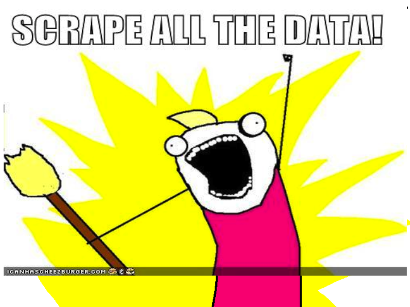
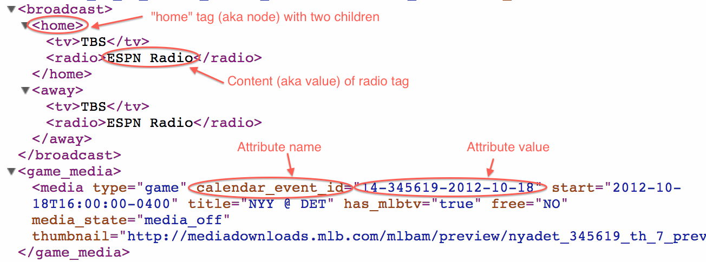

% Simple Methods for Collecting and Analyzing Major League Baseball's PITCHf/x Data
% Carson Sievert (Advisor: Dr. Hofmann)
% `r library(lubridate); paste(month(Sys.Date()), day(Sys.Date()), year(Sys.Date()), sep = "/")`


```{r setup, include=FALSE, message=FALSE, cache=FALSE}
require(devtools)
#if (!require(pitchRx)) install_github('pitchRx', 'cpsievert')
install_github('pitchRx', 'cpsievert')
library(pitchRx)
require(RMySQL)
drv <- dbDriver("MySQL") 
MLB <- dbConnect(drv, user="root", password="Stats4Life", port=3306, dbname="MLB", host="127.0.0.1")
require(tikzDevice)
if (!require(knitr)) install_github('knitr', 'yihui')
opts_chunk$set(fig.path="figure/", cache.path="cache/", dev='CairoPNG', fig.align='center', fig.width=8, fig.height=7, fig.cap='', warning=FALSE, message=FALSE, tidy=FALSE)
```

```{r setup-experiment, include=FALSE, message=FALSE, cache=FALSE}
require(R2SWF)
opts_knit$set(animation.fun = hook_r2swf)
```

## What the heck is PITCHf/x?


## So what? Who Cares?

- PITCHf/x offers baseball analysts incredibly intricate looks at player performance (especially for pitchers)

- More general observations about the game of baseball are now feasible. For example, do different umpires have different strikezones?

- Most importantly, keeps baseball and data nerds occupied

## PITCHf/x data structure

1. Among other things, MLBAM stores the parameters of a best fitting curve to almost *every* pitch thrown since 2008 in XML format.
2. That's a lot of data!!!
  * Over 14,000 games
  * Over 5,000 players (each player has a unique file for each game)
  * Over 1M atbats
  * Over 3.5M pitches

## Drawbacks to PITCHf/x data

1. Scraping (and storing) data from that many files is computationally intensive.
  * Can't do much to avoid this.
2. Relationships between data structures aren't intuitive.
  * Solution: save the file name for each record of a data frame.
3. Many records have inconsistent fields.
  * Solution: fill missing fields with NAs for each record.

## pitchRx makes scraping XML data easy

```{r easy_ex, eval=FALSE}
library(devtools)
install_github('pitchRx', 'cpsievert')
library(pitchRx)
data <- scrapeFX(start = "2008-01-01", 
                 end = Sys.Date())
pitches <- data$pitch
atbats <- data$atbat
```

## For (potentially) serious users of pitchRx

- Scraping data can take several hours and exceed the limits of your RAM.
- If you want all available data, do it on a yearly basis!
- For example,

```{r RMySQL, eval=FALSE}
#Repeat this code for 2009, 2010, etc.
data <- scrapeFX(start = "2008-01-01",
                end = "2008-12-31")
#Writing to a MySQL database is preferred to csv
write.csv(data$pitch, file = "pitches_08.csv")
write.csv(data$atbat, file = "atbats_08.csv")
```

## In the meantime...


## If data is your drug of choice...



## A bit on XML formats



## PITCHf/x XML formatting


## XML scraping made easy

```{r urlsToDataFrame, eval=FALSE}
urlsToDataFrame(urls, tables = list(),
    add.children = FALSE, use.values = FALSE)
```

- scrapeFX is essentially a wrapper around a more general function called urlsToDataFrame.
- urlsToDataFrame simplifies the parsing process for **any set of XML files** and casts data into a list of data frames.
- Main purpose is to collect data stored as XML attributes (but it can also scrape for XML content/values)
- Tables are defined by a tag (or node). For example, each "atbat" tag translates to one record
- Table fields are defined by the most complete set of XML attribute names for a tag. This can altered through the values of the **tables** parameter.
- Missing (or incomplete) attributes are filled with NAs.

## Visualizing PITCHf/x

- PITCHf/x data is unique from other baseball data because of it's inherit spatial properties.
- Spatial analysis of this data is most easily acheieved through visuals.
- The most common use of PITCHf/x data has been strikezones plots (ie, horizontal and vertical locations of pitches as they cross home plate.)
- **pitchRx** produces strikezone plots *with a special twist*.
- *Note:* only include "called strikes" and "balls" when examining strikezones.

## Home field bias?

```{r getData2, echo=FALSE, cache=TRUE}
data2 <- dbGetQuery(MLB, "SELECT pitches.px, pitches.pz, pitches.des, atbats.top_inning, atbats.stand FROM pitches INNER JOIN atbats ON (atbats.num = pitches.num AND atbats.url = pitches.url) WHERE pitches.des = 'Called Strike' OR pitches.des = 'Ball'")
```

```{r dim, echo=FALSE, cache=TRUE}
strikeFX(data2, layer=list(aes(color=des), facet_grid(top_inning~stand)))
```

## Home field bias2

```{r dim2, echo=FALSE, cache=TRUE}
strikeFX(data2, point.alpha = aes(alpha = 0.01), layer=list(aes(color=des), facet_grid(top_inning~stand)))
```

## Called Strikes

```{r hex, echo=FALSE, cache=TRUE}
strikes <- subset(data2, des == "Called Strike")
strikeFX(strikes, geom="hex", layer=facet_grid(top_inning~stand))
```

## Balls

```{r hex2, echo=FALSE, cache=TRUE}
balls <- subset(data2, des == "Ball")
strikeFX(balls, geom="hex", layer=facet_grid(top_inning~stand))
```

## Gaining insight with ```animateFX()```

- Produces a series of plots with each pitch's location as it travels from the pitcher's hand until they reach home plate.

- Plots take the viewpoint of umpire/catcher (pitcher is throwing towards us).

- As the animation progresses, the pitches get closer to home plate. Note that different pitches travel at different speeds. Thus, some pitches are closer (to the viewer) than others within each plot.

- Clearly, it would be infeasible (and uninteresting) to animate these many pitches.  

## For our purposes...

```{r getData, results='hide',warning=FALSE,cache=TRUE}
data <- scrapeFX(start="2011-01-01",
  end="2012-01-01", type="pitcher",
  player=c("Mariano Rivera", "Phil Hughes"),
  tables = list(atbat = fields$atbat, 
                pitch = fields$pitch))
FX <- join(data$pitch, data$atbat, 
  by = c("num", "url"), type = "inner")
pitches <- subset(FX, pitch_type %in% 
  c("FF", "FC"))
```

## Output of animateFX(pitches)

```{r animate1, echo=FALSE, fig.show='animate', cache=TRUE}
animateFX(pitches)
```

## And flexible!

```{r animate3, echo=FALSE, fig.show='animate', cache=TRUE}
animateFX(pitches, facet_grid(pitcher_name~stand))
```

## Comments/Suggestions/Questions???
