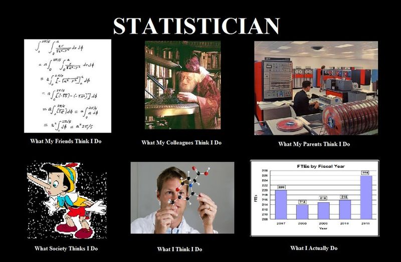
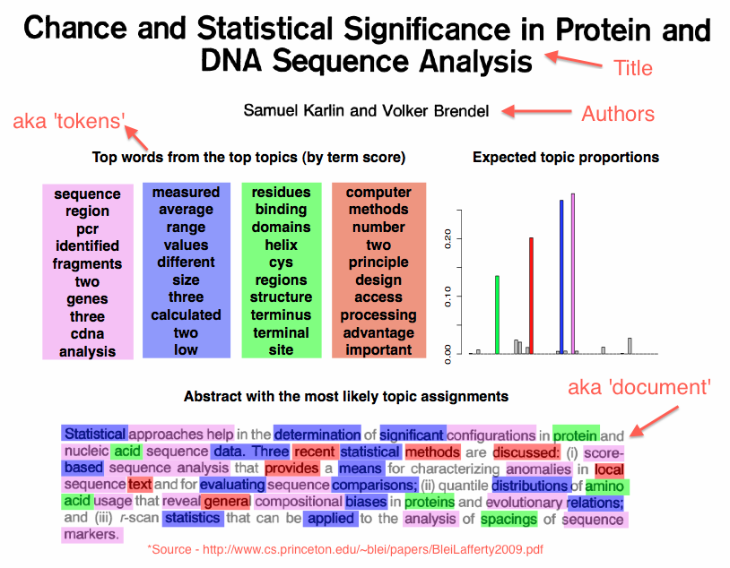
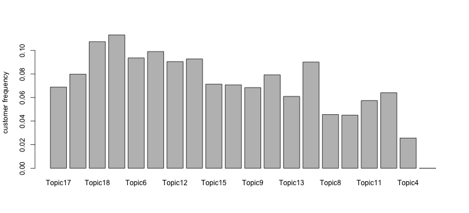
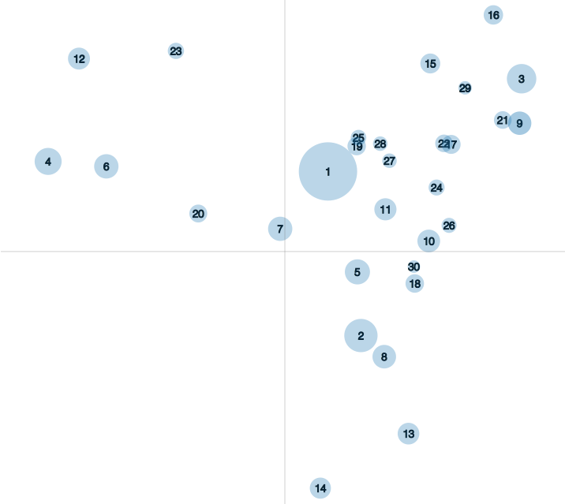

An Interactive Visualization Platform for Interpreting Topic Models
========================================================
author: Carson Sievert (joint work with Kenny Shirley)
date: 9-26-2013
transition: rotate
incremental: true

Follow along here: http://cpsievert.github.com/slides/LDA/0926

The ugly truth
========================================================

<div align="center"></div>

Overview
========================================================
type: prompt

1. What is a topic model?
2. Fitting topic models via Latent Dirichlet Allocation (LDA).
3. Fitting an LDA model with the `R` package `LDAviz`.
4. Interpreting model output.
  - Topic specific keywords.
  - 'Global' keywords.
5. Measuring similarity between topics.
6. Visualizing model output.

Example Doc
========================================================
type: prompt
title: false

<div align="center"></div>

Latent Dirichlet Allocation (LDA)
========================================================

Given $T$ topics, the probability of the $i^{th}$ word $i \in \{1, \dots, V\}$ in a given document:

$p(w_i) = \sum_{j=1}^T p(w_i, z_j) = \sum_{j=1}^T p(w_i|z_j)p(z_j)$

* Let $\phi_{i, j} = p(w_i|z_j)$ be the distribution of words for a given topic. Let the resulting $V$ by $T$ matrix be $\Phi$.
* Let $\theta_{d, j} = p(z_j)$ be the distribution of topics (for a given document $d \in \{1, \dots, D\}$).
* Let the resulting $T$ by $D$ matrix be $\Theta$.
* Assign (you guessed it) Dirichlet priors to both $\Phi$ and $\Theta$.
* Sample a topic for each word (at every iteration) of a collapsed Gibbs sampler.

AP Case Study
========================================================

* A popular dataset in the LDA literature is a set of Associated Press articles. Here is an example of one article (or document).


```
[1] " Michael Dukakis, the clear Democratic front-runner after beating Jesse Jackson and Albert Gore Jr. in New York, said today the party's runner-up after the primaries won't necessarily be the vice presidential choice. Gore, conceding ``things didn't turn out exactly as I planned,'' suspended his campaign but said he would hang on to the delegates he's won so far. ``I want no part of a stop-Jackson or stop-Dukakis movement. The only man I want to stop is George Bush and we're going to stop George Bush, Gore said, bringing applause from supporters at a news conference in a Senate office building. ``Technically, I shall remain a candidate for the nomination but only to enable my delegates to go to the convention so they can represent our point of view in our party's deliberations,'' he said. Gore, the youngest candidate in the race, joked that in the campaign, ``I was doing great until I turned 40.'' Jackson, in Pennsylvania, brushed aside surveys suggesting he faces an uphill fight in next week's primary in that state. ``I do not follow opinion polls, I mold opinion,'' Jackson told cheering supporters in Philadelphia. Gore's decision to merely suspend his campaign followed a similar action by Sen. Paul Simon earlier. Both Dukakis and Jackson were campaigning today in Pennsylvania, where 178 Democratic delegates are at stake on Tuesday. Dukakis was going on to Ohio, which holds its primary a week later. Dukakis, asked about a potential running mate during an interview with The Associated Press, said, ``I have spent literally zero time thinking about it. And I will not, unless and until I have either won the nomination or it looks as if it's pretty well in hand.'' Some Jackson backers were beginning to float the idea of Jackson as a possible running mate if Dukakis were the nominee. ``There would be lots of enthusiasm for that ticket,'' campaign chairman Willie Brown told The New York Times. But Democratic National Committee Chairman Paul Kirk said such a ticket was unlikely. Kirk, in comments published in today's Seattle Post-Intelligencer, said, ``Only once in 19 elections since the turn of the century has the nominee turned to the person who placed second and asked him to run. It was 1960.'' Dukakis himself said, ``If I were to finish second, it wouldn't entitle me to anything more than consideration, period.'' He refused to discuss any individuals and tried to steer questions about the vice presidency away from Jackson. ``The nominee makes that decision _ as he (Jackson) himself said. And rightly so,'' Dukakis said. On the Republican side, Vice President George Bush continued his march to the nomination, with 1,052 of the 1,139 delegates needed to nominate. Bush was endorsed Wednesday by California Gov. George Deukmejian, who had initially pledged neutrality through the June 7 California primary. But Bush's only remaining competitor is Pat Robertson, who has all but halted his campaign. Simon's suspension of his Democratic presidential campaign earlier this month drew fire from Jackson, who complained bitterly about the Illinois' senator's decision to keep a lock on delegates that would otherwise have gone to him. Jackson campaign spokesman Bob Brosage brushed aside talk of Jackson as vice president. ``We're still running for president,'' he said. ``There are significant primaries to come.'' And Jackson himself gave no indication he's giving up his drive for the nomination. ``We have come a long way, and we will not turn back,'' he told an enthusiastic crowd of 3,500 at a Philadelphia rally. Jackson was also picking up the endorsement today of the Philadelphia Daily News. A survey commissioned by the newspaper, in concert with the Pittsburgh Post-Gazette, suggested this week that Dukakis had a 3-1 lead in the state. Even so, ``Jesse Jackson can win,'' the Daily News said in an editorial. Financial reports filed with the Federal Election Commission indicated Jackson had his best fund-raising month ever in March, raising $2.8 million. But Dukakis, whose campaign has been well bankrolled all along, raised $3.4 million during the same period. Jackson's stops in Pennsylvania today ranged from a high school to a labor rally to a homeless shelter. Dukakis was heading for Pittsburgh tonight, after spending a day in Boston following the New York primary. New York Gov. Mario Cuomo, at a Democratic dinner in Washington Wednesday night, was eager to move beyond the raucous contest in his home state. ``I expect the campaign will be converted to an intelligent, civilized exchange of opinions,'' he said. Dukakis is comfortably ahead of Jackson in the delegate count, getting a boost Wednesday from the selection of congressional ``super delegates.'' The latest Associated Press delegate count gives Dukakis 1,063.15; Jackson 841.1; Gore 421.55; and uncommitted 613.75, out of 2,081 needed to nominate. But Dukakis was doing his best to dampen any talk of inevitability. When he was introduced at a Statehouse reception in Massachusetts as ``the next president of the United States,'' he grinned but quickly cautioned: ``Steady as she goes.'' In one respect, however, Dukakis was behaving as if he were the nominee, focusing attacks on Bush, who is all but certain to carry the GOP banner in the fall. ``I'm a doer,'' Dukakis said Wednesday, saying that characteristic stands in ``sharp contrast to the Republican nominee.''"
```


Input structure
========================================================
left: 55%
incremental: false


```
      words doc_id
1    adding      1
2     adult      1
3     adult      1
4       ago      1
5   alcohol      1
6 allegedly      1
```

...


```
         words doc_id
435835     uss   2246
435836     uss   2246
435837 warfare   2246
435838 william   2246
```

***

* After "preprocessing" the text, we can obtain two _long_ vectors. One with all the words and the other with the relevant document.

Output structure
========================================================
left: 65%
incremental: false


```
      words doc_id topic
1    adding      1    18
2     adult      1    18
3     adult      1    18
4       ago      1     9
5   alcohol      1    18
6 allegedly      1    18
```


...


```
         words doc_id topic
435835     uss   2246    27
435836     uss   2246    27
435837 warfare   2246    19
435838 william   2246     9
```

***

* After every iteration of gibbs sampling we will have a topic ID for each word. 
* Since memory can be an issue, we usually just save the topics from the last iteration (after convergence, of course).

What now?
========================================================

* From here, we construct point estimates of $\Phi$ and $\Theta$.
* In our "simple" example, $\Phi$ is 10473 by 30 and $\Theta$ is 30 by 2246
* __Problem__: Each topic has a unique pmf over 10473 points!!! How do we interpret topics given such a large space?
* __Solution__: Rank words based on their "relevance" to each topic

What's relevance?
========================================================

- For a given topic $t$, rank words by:
  1. $p(w_i|t)$: common approach, but over-ranks common words
  2. $lift = p(w_i|t)/p(w_i)$: noisy and over-ranks less common words
  3. $relevance = \lambda*log(p(w_i|t)) + (1-\lambda)*log(lift)$ where $0<\lambda<1$
  4. A value of $\lambda = 1/3$ seems to work well

Global keywords
========================================================

1. $distinctiveness(w_i) = \sum_t p(t|w_i) log[\frac{p(t|w_i)}{p(t)}]$


2. $saliency(w_i) = p(w_i) * distinctiveness(w_i)$

Termite: Chuang, Heer & Manning '12
========================================================
incremental: false
type: prompt

<div align="center"></div>

Topic Similarities
========================================================

* Remember each topic has a unique distribution over words.
* We can calculate a dissimilarity between two topics by measuring the dissimilarity of their distributions (via a measure such as symmetric KL divergence)
* Computing dissimilarity for each unique pair of topics results in a high dimensional distance matrix.
* Thus, we use MDS to scale the points down to two dimensions (in order to visualize).
<li class="fragment" data-fragment-index="5">
<div align="center"></div>
<li>

Live Demo
========================================================
type: prompt

* These ideas (and some others) are integrated into a [fully interactive web application](http://glimmer.rstudio.com/cpsievert/LDAviz).
* This instance makes use of: 
  * The R package shiny
  * The JavaScript library D3
* By integrating these tools we can harness the best of both worlds!
  * R for statistical algorithms
  * JavaScript for interacting with graphics


```r
library(shiny) #run application from R
runGitHub("LDAviz", "kshirley", subdir="inst/shiny/hover")
```


Acknowledgements
========================================================

- Thanks to Kenny Shirley for being a great mentor.
- Thanks to Carlos Scheidegger for sharing his love & hatred for JavaScript.
- Thanks to all the members of Statistics Research for helpful feedback and discussions.


Questions/Comments/Compliments?
========================================================

<div align="center"></div>
