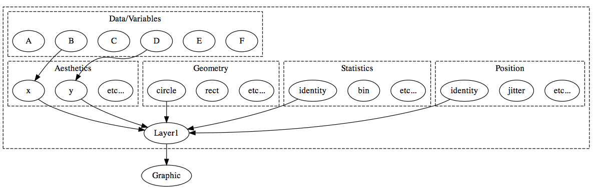

## Inspired by

* Leland Wilkinson (1999). _The Grammar of Graphics._ Springer-Verlag New York, Inc.
* Hadley Wickham (2009). _`ggplot2`: Elegant Graphics for Data Analysis._ Springer New York.

<div align = "center">
  
</div>


## `ggplot2`'s grammar of graphics {.build}

<div align = "center">
  
</div>

> - There are 5 components to a layer: Data, Aesthetics, Statistics, Geometry, and Positional Adjustment.
> - Elegantly specify static visualizations that may not fit a "plot type" (this one happens to be a scatterplot).
> - In `ggplot2`, a graphic consists of one _or more_ layers

## `animint`'s extension

<div align = "center">
  
  
</div>

## What does this buy us?

> - In general, `clickSelects`/`showSelected` specifies a link between m and n observations.
> - Statistically speaking, this yields sets of visualizations of *conditional* distributions -- where the conditioning variable is *categorical*.
> - If you want to condition on a *quantitative* variable, you can discretize beforehand. 
> - This kind of linked selection can be extended to other techniques (for example, `hoverSelects`).
> - A number of other interative features have fit nicely into this framework:
    * `tooltip` aesthetic for labelling.
    * `time` "aesthetic" for automatic iteration and interpolation between views (in other words, animation).

```{r setup, echo=FALSE, message = FALSE}
library("knitr")
opts_chunk$set(message = FALSE)
```

## Tips data

```{r tips}
data(tips, package = "reshape2")
tips$sex_smoker <- with(tips, interaction(sex, smoker))
head(tips, 10)
```

## Simple example

```{r sex-smoker, echo = FALSE}
library(animint)
p1 <- ggplot() + theme(legend.position = "none") +
  geom_point(data = tips, 
             aes(x = sex, y = smoker, 
                 clickSelects = sex_smoker, colour = sex_smoker),
             position = "jitter")
p2 <- ggplot() +
  geom_point(data = tips, 
             aes(x = total_bill, y = tip, 
                 showSelected = sex_smoker, colour = sex_smoker))
plots <- list(plot1 = p1, plot2 = p2)
structure(plots, class = "animint")
```

<p></p>
> - Bill amount and tip have lower correlation amongst smokers (especially male smokers).

## Simple example {.build}

```{r eval = FALSE}
library(animint)
p1 <- ggplot() +
  geom_point(data = tips, position = "jitter",
    aes(x = sex, y = smoker, colour = sex_smoker, 
        clickSelects = sex_smoker))
p2 <- ggplot() +
  geom_point(data = tips, 
    aes(x = total_bill, y = tip, colour = sex_smoker,
        showSelected = sex_smoker))
plots <- list(plot1 = p1, plot2 = p2)
animint2dir(plots)
```

> - `animint2dir()` translates a list of ggplots to a JSON object.
> - Add specially named elements to the plot list to customize rendering.

```{r eval = FALSE}
# multiple selection
plots$selector.types <- list(sex_smoker = "multiple")
```

## Multiple selection

```{r sex-smoker-multiple, echo=FALSE}
plots$selector.types <- list(sex_smoker = "multiple")
structure(plots, class = "animint")
```

## Climate data

```{r}
data(climate, package = "animint")
library("dplyr")
climate %>% select(id, lat, long, date, temperature)
```

---

<iframe src = "climate/" height = "800px" width = "800px"></iframe>

---

```{r eval = FALSE}
library("lubridate")
library("maps")

# restrict to central/south america
countries <- map_data("world") %>%
  filter(lat < 38, lat > -24) %>%
  filter(long < -54, long > -118)

# compute temperature deviation from monthly norm
climate <- climate %>%
  group_by(id, month) %>%
  summarise(avgtemp = mean(temperature)) %>%
  left_join(climate) %>%
  mutate(tempdev = temperature - avgtemp) %>%
  mutate(time_num = decimal_date(ymd(date))) %>%
  arrange(desc(time_num)) %>% as.data.frame()

dates <- climate %>%
  select(date, year, time_num) %>% unique() %>%
  mutate(textdate = paste(month(date, label = TRUE), year))
```

---

```{r eval = FALSE}
ts <- ggplot() +
  geom_line(data = climate, 
            aes(x = time_num, y = temperature, group = id, showSelected = id)) +
  geom_text(data = dates, 
            aes(x = 1998, y = -5, label = textdate, showSelected = time_num)) +
  make_tallrect(data = climate, "time_num")

tile_map <- ggplot() +
  geom_tile(data = climate, 
            aes(x = long, y = lat, fill = tempdev, clickSelects = id, showSelected = time_num)) +
  geom_path(data = countries, aes(x = long, y = lat, group = group)) +
  geom_text(data = dates,
            aes(x = -86, y = 39, label = textdate, showSelected = time_num)) +
  scale_fill_gradient2("deg. C") +
  ggtitle("Temperature Deviation from Monthly Norm") +
  theme(axis.line = element_blank(), axis.text = element_blank(),
      axis.ticks = element_blank(), axis.title = element_blank())

p_list <- list(ts = ts, map = tile_map, selector.types = list(id = "multiple"), 
               time = list(variable = "time_num", ms = 3000))
animint2dir(p_list)
```

## shiny/rmarkdown integration

* <https://cpsievert.shinyapps.io/animintShiny>
* <https://cpsievert.shinyapps.io/animintRmarkdown>

## Learn more about animint

* __animint__ on Github -- <https://github.com/tdhock/animint>
* Tutorial -- <http://tdhock.github.io/animint/>
* Paper -- <https://github.com/tdhock/animint-paper/blob/master/HOCKING-animint.pdf?raw=true>
* Some examples 
    * <http://cpsievert.github.io/baseballR/20140818/>
    * <http://sugiyama-www.cs.titech.ac.jp/~toby/animint/index.html>

## Thank you!

* Some personal links:
    * <https://twitter.com/cpsievert>
    * <https://github.com/cpsievert>
    * <https://cpsievert.github.com>

