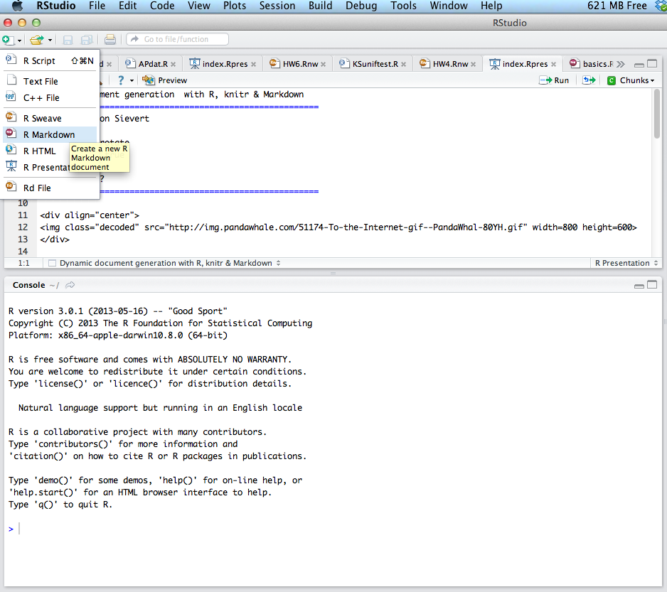
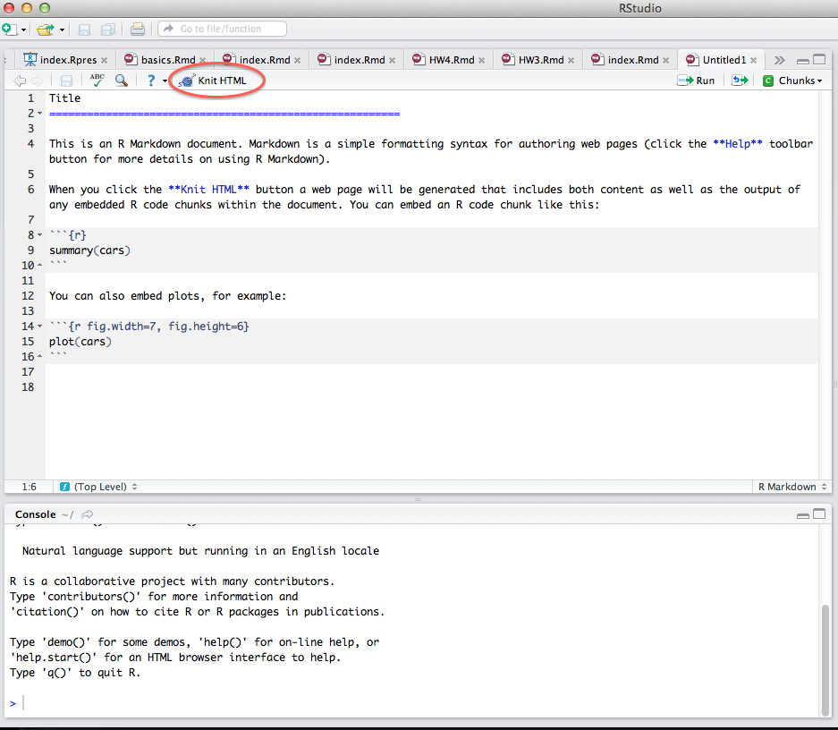
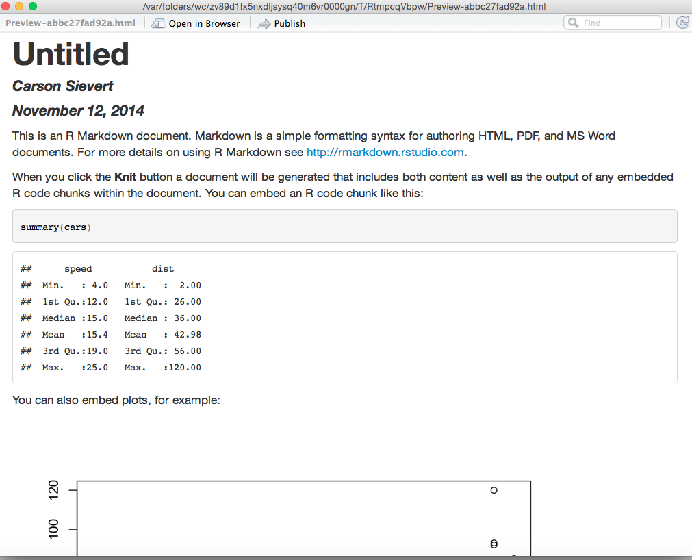

Reproducible web documents with R, knitr & Markdown
========================================================
author: Carson Sievert
transition: rotate
incremental: true

Follow along at - http://cpsievert.github.io/slides/markdown

Why Markdown?
========================================================

<div align="center">

</div>

What is Markdown?
========================================================

* Markdown is a lightweight markup language for creating HTML (or XHTML) documents.
* Markup languages are designed produce documents from human readable text (and annotations).
* Some of you may be familiar with _LaTeX_. This is another (less human friendly) markup language for creating pdf documents.
* Markdown is nice because it allows us to focus on content, rather than coding.

Markdown is becoming a standard
========================================================

* GitHub, StackOverflow, Reddit and many other websites use Markdown syntax.
* Many popular blogging frameworks use Markdown.
* Thanks to the R package __knitr__, it's easy to create __reproducible__ and __dynamic__ web documents!
  * Later I show how to integrate `R` code with Markdown, but you aren't limited to `R` code!
* Thanks to __slidify__ and RStudio presentations, one can also easily create HTML5 presentations (like this one)!
* Thanks to tools like __pandoc__, your Markdown files can easily be converted to many different formats!

Yes, even word documents...
========================================================

<div align="center">

</div>

Some Examples
========================================================

* [R learning resources at UCLA by Joshua Wiley et al](http://www.ats.ucla.edu/stat/r/)
* [My R package vignette for pitchRx](http://cpsievert.github.io/pitchRx/demo/)
* [Interactive charts and slides with R, googleVis and knitr](http://decastillo.github.io/googleVis_Tutorial/#1)
* Now that we have some motivation, let's take a look at the Markdown syntax. 

Markdown Basics
========================================================
incremental:false
title:false
right: 55%

Markdown syntax

    Header 1
    ================
    Header 2
    ----------------
    ### Header 3
    
    This is regular text.
    
    > This is a blockquote.
    > 
    > This is the second paragraph in the blockquote.
    >
    > ## This is an H2 in a blockquote

***
Resulting HTML
```
<h1>Header 1</h1>
<h2>Header 2</h2>
<h3>Header 3</h3>

<p>This is regular text.</p>

<blockquote>
<p>This is a blockquote.</p>

<p>This is the second paragraph in the blockquote.</p>

<h2>This is an H2 in a blockquote</h2>
</blockquote>
```
  
Header 1
================
incremental:false

Header 2
----------------
### Header 3

This is regular text.
    
> This is a blockquote.
> 
> This is the second paragraph in the blockquote.
>
> ## This is an H2 in a blockquote


Markdown Basics 2
========================================================
incremental:false
title:false
right: 55%

Markdown syntax

    Here we have an unordered list.
    
    * Item 1
    * Item 2
      * Item 2a
      * Item 2b
      
    Here we have an ordered list
    
    1. Item 1
    2. Item 2
      * Item 2a
      * Item 2b

***
Resulting HTML
```
<p>Here we have an unordered list.</p>
<ul>
<li>Item 1</li>
<li>Item 2
<ul>
<li>Item 2a</li>
<li>Item 2b</li>
</ul></li>
</ul>
<p>Here we have an ordered list</p>
<ol>
<li>Item 1</li>
<li>Item 2
<ul>
<li>Item 2a</li>
<li>Item 2b</li>
</ul></li>
</ol>
```

Result 2
======================
title:false
incremental:false

Here we have an unordered list.
    
* Item 1
* Item 2
  * Item 2a
  * Item 2b
      
Here we have an ordered list
    
1. Item 1
2. Item 2
  * Item 2a
  * Item 2b

Markdown Basics 3
========================================================
incremental:false
title:false
right: 55%

Markdown syntax

    What if we want to *italicize* or **bold**?
    
    * In a list, I may want to _italicize_ or __bold__ this way.
   
    I can also include inline `code` or 
    
    ```
    blocks of code
    ```
    Or even a [link](http://google.com)
    

***
Resulting HTML
```
<p>What if we want to <em>italicize</em> or <strong>bold</strong>?</p>
<ul>
<li>In a list, I may want to <em>italicize</em> or <strong>bold</strong> this way.</li>
</ul>
<p>I can also include inline <code>code</code> or </p>
<pre><code>blocks of code</code></pre>
<p>Or even a <a href="http://google.com">link</a> </p>
```

Result 3
======================
title:false
incremental:false

What if we want to *italicize* or **bold**?

* In a list, I may want to _italicize_ or __bold__ this way.

I can also include inline `code` or 

```
blocks of code
```

Or even a [link](http://google.com)


Markdown Basics 4
========================================================
incremental:false
title:false
right: 50%

Markdown syntax
    
    When in doubt, you can always put HTML into markdown:
    
    
    
    I can also do fancy latex equations $\alpha = \beta$
    
***
Resulting HTML
```
<p>When in doubt, you can always put HTML into markdown:</p>

<p></p>

<p>I can also do fancy latex equations \( \alpha = \beta \)</p>

```

Result 4
======================
title:false
incremental:false

When in doubt, you can always put HTML into markdown:
    

    
I can also do fancy latex equations $\alpha = \beta$


RStudio+knitr+markdown = awesome
========================================================

<div align="center">

</div>

RStudio+knitr+markdown = awesome
========================================================
title:false

<div align="center">

</div>

RStudio+knitr+markdown = awesome
========================================================
title:false

<div align="center">

</div>


For non-RStudio users...
========================================================
incremental:false
right:53%

    Title
    ================
    This is an R Markdown document.
    
    ```{{r}}
    summary(cars)
    ```
    
    You can also embed plots, for example:
    
    ```{{r fig.width=7, fig.height=6}}
    plot(cars)
    ```
***

Try saving the content to the left as "index.Rmd". Then run the code below to replicate "knit HTML".


```r
library(knitr)
setwd(<working directory>)
knit2html("index.Rmd")
browseURL("index.html")
```


Custom styling...
========================================================
incremental:false

* It's also easy to customize styling using the `markdownToHTML` function from the `markdown` package.


```r
library(knitr)
library(markdown)
setwd(<working directory>)
knit("index.Rmd") #generates 'index.md' file
markdownToHTML("index.md", "index.html", stylesheet='custom.css')
```


The power of code chunks
========================================================
incremental:false
right:40%

    Title
    ====================

    This is an R Markdown document.

    ```{{r results='asis'}}
    library(xtable)
    print(xtable(summary(cars)), type="html")
    ```
    
    You can also embed plots, for example:

    ```{{r fig.width=7, fig.height=6, echo=FALSE}}
    plot(cars)
    ```


Title
========================================================
incremental:false
title:false
left:57%


This is an R Markdown document.


```r
library(xtable)
print(xtable(summary(cars)), type="html")
```

<!-- html table generated in R 3.0.1 by xtable 1.7-1 package -->
<!-- Wed Oct  9 15:18:58 2013 -->
<TABLE border=1>
<TR> <TH>  </TH> <TH>     speed </TH> <TH>      dist </TH>  </TR>
  <TR> <TD align="right"> 1 </TD> <TD> Min.   : 4.0   </TD> <TD> Min.   :  2   </TD> </TR>
  <TR> <TD align="right"> 2 </TD> <TD> 1st Qu.:12.0   </TD> <TD> 1st Qu.: 26   </TD> </TR>
  <TR> <TD align="right"> 3 </TD> <TD> Median :15.0   </TD> <TD> Median : 36   </TD> </TR>
  <TR> <TD align="right"> 4 </TD> <TD> Mean   :15.4   </TD> <TD> Mean   : 43   </TD> </TR>
  <TR> <TD align="right"> 5 </TD> <TD> 3rd Qu.:19.0   </TD> <TD> 3rd Qu.: 56   </TD> </TR>
  <TR> <TD align="right"> 6 </TD> <TD> Max.   :25.0   </TD> <TD> Max.   :120   </TD> </TR>
   </TABLE>


***
You can also embed plots, for example:

 


References & resources
========================================================
incremental:false

* [Markdown Quick Reference](http://web.mit.edu/r/current/RStudio/resources/markdown_help.html)
* [Daring Fireball Markdown Basics](http://daringfireball.net/projects/markdown/basics)
* [Markdown Cheat Sheet](https://github.com/adam-p/markdown-here/wiki/Markdown-Cheatsheet#wiki-code)
* [Using R Markdown with RStudio](http://www.rstudio.com/ide/docs/authoring/using_markdown)
* [knitr website](http://yihui.name/knitr/)

Thanks for coming!
========================================================
