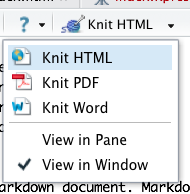
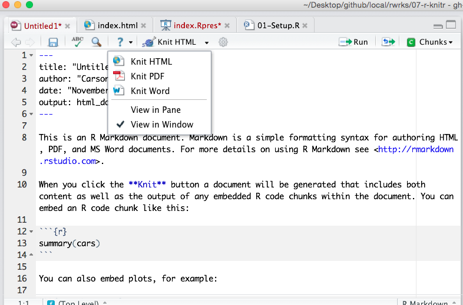

Reproducible web documents with R, knitr & Markdown
========================================================
author: Carson Sievert
transition: rotate
incremental: true

Follow along at - http://cpsievert.github.io/slides/markdown

Why use Markdown?
========================================================

* Easy to learn and use.
* Focus on __content__, rather than __coding__ and debugging __errors__.
* It's flexible. Markdown was created to simplify HTML, but with the right tools, your Markdown files can easily be converted to many different formats!
* Fastest way to internet! <p></p> <div align="center"></div>

What is Markdown?
========================================================

* Markdown is a particular type of markup language.
* Markup languages are designed produce documents from plain text.
* Some of you may be familiar with _LaTeX_. This is another (less human friendly) markup language for creating pdf documents.
* _LaTeX_ gives you much greater control, but it is restricted to pdf and has a __much__ greater learning curve.
* As I mentioned, there are tools (mainly [pandoc](http://johnmacfarlane.net/pandoc/)) that allow you to render markdown in different formats (for example, HTML/pdf/word)

Yes, even word documents...
========================================================

<div align="center">

</div>

knitr + markdown + pandoc = rmarkdown
========================================================

* `rmarkdown` is a new package from RStudio that merges a lot of technologies in an exciting way.
* In fact, in RStudio now, you integrate R code into your Markdown document and render as HTML/pdf/Word in the click of a button! <p></p> <div align="center"></div>
* You can even embed your shiny apps in HTML documents generated with `rmarkdown`!

Some Examples
========================================================

* [R learning resources at UCLA by Joshua Wiley et al](http://www.ats.ucla.edu/stat/r/)
* [Advanced R programming by Hadley](http://adv-r.had.co.nz/memory.html)
* [The rmarkdown website](http://rmarkdown.rstudio.com/)
* [Tufte](https://github.com/jimhester/knitrBootstrap?source=c) style [HTML](http://cran.r-project.org/web/packages/tufterhandout/vignettes/example.html) and [pdf](http://rmarkdown.rstudio.com/examples/tufte-handout.pdf) documents.
* [shiny](https://cpsievert.shinyapps.io/animintRmarkdown/) apps!
* Inject custom JavaScript for [interactive visualizations](http://timelyportfolio.github.io/rCharts_nyt_home_price/).

Markdown Basics
========================================================
incremental:false
title:false
right: 55%

Markdown syntax

    Header 1
    ================
    Header 2
    ----------------
    ### Header 3
    
    This is regular text.
    
    > This is a blockquote.
    > 
    > This is the second paragraph in the blockquote.
    >
    > ## This is an H2 in a blockquote

***
Resulting HTML
```
<h1>Header 1</h1>
<h2>Header 2</h2>
<h3>Header 3</h3>

<p>This is regular text.</p>

<blockquote>
<p>This is a blockquote.</p>

<p>This is the second paragraph in the blockquote.</p>

<h2>This is an H2 in a blockquote</h2>
</blockquote>
```
  
Header 1
================
incremental:false

Header 2
----------------
### Header 3

This is regular text.
    
> This is a blockquote.
> 
> This is the second paragraph in the blockquote.
>
> ## This is an H2 in a blockquote


Markdown Basics 2
========================================================
incremental:false
title:false
right: 55%

Markdown syntax

    Here we have an unordered list.
    
    * Item 1
    * Item 2
      * Item 2a
      * Item 2b
      
    Here we have an ordered list
    
    1. Item 1
    2. Item 2
      * Item 2a
      * Item 2b

***
Resulting HTML
```
<p>Here we have an unordered list.</p>
<ul>
<li>Item 1</li>
<li>Item 2
<ul>
<li>Item 2a</li>
<li>Item 2b</li>
</ul></li>
</ul>
<p>Here we have an ordered list</p>
<ol>
<li>Item 1</li>
<li>Item 2
<ul>
<li>Item 2a</li>
<li>Item 2b</li>
</ul></li>
</ol>
```

Result 2
======================
title:false
incremental:false

Here we have an unordered list.
    
* Item 1
* Item 2
  * Item 2a
  * Item 2b
      
Here we have an ordered list
    
1. Item 1
2. Item 2
  * Item 2a
  * Item 2b

Markdown Basics 3
========================================================
incremental:false
title:false
right: 55%

Markdown syntax

    What if we want to *italicize* or **bold**?
    
    * In a list, I may want to _italicize_ or __bold__ this way.
   
    I can also include inline `code` or 
    
    ```
    blocks of code
    ```
    Or even a [link](http://google.com)
    

***
Resulting HTML
```
<p>What if we want to <em>italicize</em> or <strong>bold</strong>?</p>
<ul>
<li>In a list, I may want to <em>italicize</em> or <strong>bold</strong> this way.</li>
</ul>
<p>I can also include inline <code>code</code> or </p>
<pre><code>blocks of code</code></pre>
<p>Or even a <a href="http://google.com">link</a> </p>
```

Result 3
======================
title:false
incremental:false

What if we want to *italicize* or **bold**?

* In a list, I may want to _italicize_ or __bold__ this way.

I can also include inline `code` or 

```
blocks of code
```

Or even a [link](http://google.com)


Markdown Basics 4
========================================================
incremental:false
title:false
right: 50%

Markdown syntax
    
    When in doubt, you can always put HTML into markdown:
    
    
    
    I can also do fancy latex equations $\alpha = \beta$ with help from [MathJax](http://www.mathjax.org/)
    
***
Resulting HTML
```
<p>When in doubt, you can always put HTML into markdown:</p>

<p></p>

<p>I can also do fancy latex equations \( \alpha = \beta \) with help from <a href="http://www.
mathjax.org/">MathJax</a></p>

```

Result 4
======================
title:false
incremental:false

When in doubt, you can always put HTML into markdown:
    

    
I can also do fancy latex equations $\alpha = \beta$ with help from [MathJax](http://www.mathjax.org/)


RStudio + rmarkdown = awesome
========================================================

<div align="center">

</div>

RStudio + rmarkdown = awesome
========================================================
title:false

<div align="center">

</div>

RStudio + rmarkdown = awesome
========================================================
title:false

<div align="center">

</div>


For non-RStudio users...
========================================================
incremental:false
right:53%
    
    This is an R Markdown document.
    
    ```{{r}}
    summary(cars)
    ```
    
    You can also embed plots, for example:
    
    ```{{r fig.width=7}}
    plot(cars)
    ```
***

Save the content to the left in your working directory as "index.Rmd". Then run the code below to replicate "knit HTML".


```r
library(knitr)
knit2html("index.Rmd")
browseURL("index.html")
```

This is actually equivalent to:


```r
library(rmarkdown)
render("index.Rmd")
browseURL("index.html")
```

Custom styling...
========================================================
incremental:false

* It's easy to customize styling using the `markdownToHTML` function from the `markdown` package.


```r
knit("index.Rmd") #generates 'index.md' file
library(markdown)
markdownToHTML("index.md", "index.html", stylesheet='custom.css')
```

* If you have `rmarkdown`, there are some nice templates you can use (File -> New File -> R Markdown -> From Template)

Your Turn
========================================================

* Go to: File -> New File -> R Markdown
* Try out different output formats and pick one that you like!

The power of code chunks
========================================================
incremental:false
right:40%

    Title
    ====================

    This is an R Markdown document.

    ```{{r results='asis'}}
    library(knitr)
    kable(head(cars), 'html')
    ```
    
    You can also embed plots, for example:

    ```{{r fig.width=7, fig.height=6, echo=FALSE}}
    plot(cars)
    ```


Title
========================================================
incremental:false
title:false
left:57%


This is an R Markdown document.


```r
library(knitr)
kable(head(cars), 'html')
```

<table>
 <thead>
  <tr>
   <th style="text-align:right;"> speed </th>
   <th style="text-align:right;"> dist </th>
  </tr>
 </thead>
<tbody>
  <tr>
   <td style="text-align:right;"> 4 </td>
   <td style="text-align:right;"> 2 </td>
  </tr>
  <tr>
   <td style="text-align:right;"> 4 </td>
   <td style="text-align:right;"> 10 </td>
  </tr>
  <tr>
   <td style="text-align:right;"> 7 </td>
   <td style="text-align:right;"> 4 </td>
  </tr>
  <tr>
   <td style="text-align:right;"> 7 </td>
   <td style="text-align:right;"> 22 </td>
  </tr>
  <tr>
   <td style="text-align:right;"> 8 </td>
   <td style="text-align:right;"> 16 </td>
  </tr>
  <tr>
   <td style="text-align:right;"> 9 </td>
   <td style="text-align:right;"> 10 </td>
  </tr>
</tbody>
</table>

***
You can also embed plots, for example:

 


Interactive Plots
========================================================
incremental:false

<link rel='stylesheet' href=http://nvd3.org/assets/css/nv.d3.css>
<link rel='stylesheet' href=http://rawgithub.com/ramnathv/rCharts/master/inst/libraries/nvd3/css/rNVD3.css>
<script type='text/javascript' src=http://ajax.googleapis.com/ajax/libs/jquery/1.8.2/jquery.min.js></script>
<script type='text/javascript' src=http://d3js.org/d3.v3.min.js></script>
<script type='text/javascript' src=http://timelyportfolio.github.io/rCharts_nvd3_tests/libraries/widgets/nvd3/js/nv.d3.min-new.js></script>
<script type='text/javascript' src=http://nvd3.org/assets/lib/fisheye.js></script>


```r
library(rCharts)
dat <- subset(as.data.frame(HairEyeColor), Sex == "Male")
n1 <- nPlot(Freq ~ Hair, group = "Eye", data = dat, type = "multiBarChart")
n1$print("nvd3mbar")
```


<div id = 'nvd3mbar' class = 'rChart nvd3'></div>
<script type='text/javascript'>
 $(document).ready(function(){
      drawnvd3mbar()
    });
    function drawnvd3mbar(){  
      var opts = {
 "dom": "nvd3mbar",
"width":    800,
"height":    400,
"x": "Hair",
"y": "Freq",
"group": "Eye",
"type": "multiBarChart",
"id": "nvd3mbar" 
},
        data = [
 {
 "Hair": "Black",
"Eye": "Brown",
"Sex": "Male",
"Freq":             32 
},
{
 "Hair": "Brown",
"Eye": "Brown",
"Sex": "Male",
"Freq":             53 
},
{
 "Hair": "Red",
"Eye": "Brown",
"Sex": "Male",
"Freq":             10 
},
{
 "Hair": "Blond",
"Eye": "Brown",
"Sex": "Male",
"Freq":              3 
},
{
 "Hair": "Black",
"Eye": "Blue",
"Sex": "Male",
"Freq":             11 
},
{
 "Hair": "Brown",
"Eye": "Blue",
"Sex": "Male",
"Freq":             50 
},
{
 "Hair": "Red",
"Eye": "Blue",
"Sex": "Male",
"Freq":             10 
},
{
 "Hair": "Blond",
"Eye": "Blue",
"Sex": "Male",
"Freq":             30 
},
{
 "Hair": "Black",
"Eye": "Hazel",
"Sex": "Male",
"Freq":             10 
},
{
 "Hair": "Brown",
"Eye": "Hazel",
"Sex": "Male",
"Freq":             25 
},
{
 "Hair": "Red",
"Eye": "Hazel",
"Sex": "Male",
"Freq":              7 
},
{
 "Hair": "Blond",
"Eye": "Hazel",
"Sex": "Male",
"Freq":              5 
},
{
 "Hair": "Black",
"Eye": "Green",
"Sex": "Male",
"Freq":              3 
},
{
 "Hair": "Brown",
"Eye": "Green",
"Sex": "Male",
"Freq":             15 
},
{
 "Hair": "Red",
"Eye": "Green",
"Sex": "Male",
"Freq":              7 
},
{
 "Hair": "Blond",
"Eye": "Green",
"Sex": "Male",
"Freq":              8 
} 
]
  
      if(!(opts.type==="pieChart" || opts.type==="sparklinePlus" || opts.type==="bulletChart")) {
        var data = d3.nest()
          .key(function(d){
            //return opts.group === undefined ? 'main' : d[opts.group]
            //instead of main would think a better default is opts.x
            return opts.group === undefined ? opts.y : d[opts.group];
          })
          .entries(data);
      }
      
      if (opts.disabled != undefined){
        data.map(function(d, i){
          d.disabled = opts.disabled[i]
        })
      }
      
      nv.addGraph(function() {
        var chart = nv.models[opts.type]()
          .width(opts.width)
          .height(opts.height)
          
        if (opts.type != "bulletChart"){
          chart
            .x(function(d) { return d[opts.x] })
            .y(function(d) { return d[opts.y] })
        }
          
         
        
          
        

        
        
        
      
       d3.select("#" + opts.id)
        .append('svg')
        .datum(data)
        .transition().duration(500)
        .call(chart);

       nv.utils.windowResize(chart.update);
       return chart;
      });
    };
</script>

Interactive Tables
========================================================

Leveraging JavaScript, it's "easy" to make interactive stuff. Thanks to Yihui for [source](https://github.com/yihui/knitr/blob/master/vignettes/datatables.Rmd).

<script src="http://ajax.aspnetcdn.com/ajax/jquery/jquery-1.9.0.min.js"></script>
<script src="http://ajax.aspnetcdn.com/ajax/jquery.dataTables/1.9.4/jquery.dataTables.min.js"></script>
<link rel="stylesheet" type="text/css" href="http://ajax.aspnetcdn.com/ajax/jquery.dataTables/1.9.4/css/jquery.dataTables.css">
<style type="text/css">
p{clear:both;}
</style>

<table id="cars_table">
 <thead>
  <tr>
   <th style="text-align:left;">   </th>
   <th style="text-align:right;"> mpg </th>
   <th style="text-align:right;"> cyl </th>
   <th style="text-align:right;"> disp </th>
   <th style="text-align:right;"> hp </th>
   <th style="text-align:right;"> drat </th>
   <th style="text-align:right;"> wt </th>
   <th style="text-align:right;"> qsec </th>
   <th style="text-align:right;"> vs </th>
   <th style="text-align:right;"> am </th>
   <th style="text-align:right;"> gear </th>
   <th style="text-align:right;"> carb </th>
  </tr>
 </thead>
<tbody>
  <tr>
   <td style="text-align:left;"> Mazda RX4 </td>
   <td style="text-align:right;"> 21.0 </td>
   <td style="text-align:right;"> 6 </td>
   <td style="text-align:right;"> 160.0 </td>
   <td style="text-align:right;"> 110 </td>
   <td style="text-align:right;"> 3.90 </td>
   <td style="text-align:right;"> 2.620 </td>
   <td style="text-align:right;"> 16.46 </td>
   <td style="text-align:right;"> 0 </td>
   <td style="text-align:right;"> 1 </td>
   <td style="text-align:right;"> 4 </td>
   <td style="text-align:right;"> 4 </td>
  </tr>
  <tr>
   <td style="text-align:left;"> Mazda RX4 Wag </td>
   <td style="text-align:right;"> 21.0 </td>
   <td style="text-align:right;"> 6 </td>
   <td style="text-align:right;"> 160.0 </td>
   <td style="text-align:right;"> 110 </td>
   <td style="text-align:right;"> 3.90 </td>
   <td style="text-align:right;"> 2.875 </td>
   <td style="text-align:right;"> 17.02 </td>
   <td style="text-align:right;"> 0 </td>
   <td style="text-align:right;"> 1 </td>
   <td style="text-align:right;"> 4 </td>
   <td style="text-align:right;"> 4 </td>
  </tr>
  <tr>
   <td style="text-align:left;"> Datsun 710 </td>
   <td style="text-align:right;"> 22.8 </td>
   <td style="text-align:right;"> 4 </td>
   <td style="text-align:right;"> 108.0 </td>
   <td style="text-align:right;"> 93 </td>
   <td style="text-align:right;"> 3.85 </td>
   <td style="text-align:right;"> 2.320 </td>
   <td style="text-align:right;"> 18.61 </td>
   <td style="text-align:right;"> 1 </td>
   <td style="text-align:right;"> 1 </td>
   <td style="text-align:right;"> 4 </td>
   <td style="text-align:right;"> 1 </td>
  </tr>
  <tr>
   <td style="text-align:left;"> Hornet 4 Drive </td>
   <td style="text-align:right;"> 21.4 </td>
   <td style="text-align:right;"> 6 </td>
   <td style="text-align:right;"> 258.0 </td>
   <td style="text-align:right;"> 110 </td>
   <td style="text-align:right;"> 3.08 </td>
   <td style="text-align:right;"> 3.215 </td>
   <td style="text-align:right;"> 19.44 </td>
   <td style="text-align:right;"> 1 </td>
   <td style="text-align:right;"> 0 </td>
   <td style="text-align:right;"> 3 </td>
   <td style="text-align:right;"> 1 </td>
  </tr>
  <tr>
   <td style="text-align:left;"> Hornet Sportabout </td>
   <td style="text-align:right;"> 18.7 </td>
   <td style="text-align:right;"> 8 </td>
   <td style="text-align:right;"> 360.0 </td>
   <td style="text-align:right;"> 175 </td>
   <td style="text-align:right;"> 3.15 </td>
   <td style="text-align:right;"> 3.440 </td>
   <td style="text-align:right;"> 17.02 </td>
   <td style="text-align:right;"> 0 </td>
   <td style="text-align:right;"> 0 </td>
   <td style="text-align:right;"> 3 </td>
   <td style="text-align:right;"> 2 </td>
  </tr>
  <tr>
   <td style="text-align:left;"> Valiant </td>
   <td style="text-align:right;"> 18.1 </td>
   <td style="text-align:right;"> 6 </td>
   <td style="text-align:right;"> 225.0 </td>
   <td style="text-align:right;"> 105 </td>
   <td style="text-align:right;"> 2.76 </td>
   <td style="text-align:right;"> 3.460 </td>
   <td style="text-align:right;"> 20.22 </td>
   <td style="text-align:right;"> 1 </td>
   <td style="text-align:right;"> 0 </td>
   <td style="text-align:right;"> 3 </td>
   <td style="text-align:right;"> 1 </td>
  </tr>
  <tr>
   <td style="text-align:left;"> Duster 360 </td>
   <td style="text-align:right;"> 14.3 </td>
   <td style="text-align:right;"> 8 </td>
   <td style="text-align:right;"> 360.0 </td>
   <td style="text-align:right;"> 245 </td>
   <td style="text-align:right;"> 3.21 </td>
   <td style="text-align:right;"> 3.570 </td>
   <td style="text-align:right;"> 15.84 </td>
   <td style="text-align:right;"> 0 </td>
   <td style="text-align:right;"> 0 </td>
   <td style="text-align:right;"> 3 </td>
   <td style="text-align:right;"> 4 </td>
  </tr>
  <tr>
   <td style="text-align:left;"> Merc 240D </td>
   <td style="text-align:right;"> 24.4 </td>
   <td style="text-align:right;"> 4 </td>
   <td style="text-align:right;"> 146.7 </td>
   <td style="text-align:right;"> 62 </td>
   <td style="text-align:right;"> 3.69 </td>
   <td style="text-align:right;"> 3.190 </td>
   <td style="text-align:right;"> 20.00 </td>
   <td style="text-align:right;"> 1 </td>
   <td style="text-align:right;"> 0 </td>
   <td style="text-align:right;"> 4 </td>
   <td style="text-align:right;"> 2 </td>
  </tr>
  <tr>
   <td style="text-align:left;"> Merc 230 </td>
   <td style="text-align:right;"> 22.8 </td>
   <td style="text-align:right;"> 4 </td>
   <td style="text-align:right;"> 140.8 </td>
   <td style="text-align:right;"> 95 </td>
   <td style="text-align:right;"> 3.92 </td>
   <td style="text-align:right;"> 3.150 </td>
   <td style="text-align:right;"> 22.90 </td>
   <td style="text-align:right;"> 1 </td>
   <td style="text-align:right;"> 0 </td>
   <td style="text-align:right;"> 4 </td>
   <td style="text-align:right;"> 2 </td>
  </tr>
  <tr>
   <td style="text-align:left;"> Merc 280 </td>
   <td style="text-align:right;"> 19.2 </td>
   <td style="text-align:right;"> 6 </td>
   <td style="text-align:right;"> 167.6 </td>
   <td style="text-align:right;"> 123 </td>
   <td style="text-align:right;"> 3.92 </td>
   <td style="text-align:right;"> 3.440 </td>
   <td style="text-align:right;"> 18.30 </td>
   <td style="text-align:right;"> 1 </td>
   <td style="text-align:right;"> 0 </td>
   <td style="text-align:right;"> 4 </td>
   <td style="text-align:right;"> 4 </td>
  </tr>
  <tr>
   <td style="text-align:left;"> Merc 280C </td>
   <td style="text-align:right;"> 17.8 </td>
   <td style="text-align:right;"> 6 </td>
   <td style="text-align:right;"> 167.6 </td>
   <td style="text-align:right;"> 123 </td>
   <td style="text-align:right;"> 3.92 </td>
   <td style="text-align:right;"> 3.440 </td>
   <td style="text-align:right;"> 18.90 </td>
   <td style="text-align:right;"> 1 </td>
   <td style="text-align:right;"> 0 </td>
   <td style="text-align:right;"> 4 </td>
   <td style="text-align:right;"> 4 </td>
  </tr>
  <tr>
   <td style="text-align:left;"> Merc 450SE </td>
   <td style="text-align:right;"> 16.4 </td>
   <td style="text-align:right;"> 8 </td>
   <td style="text-align:right;"> 275.8 </td>
   <td style="text-align:right;"> 180 </td>
   <td style="text-align:right;"> 3.07 </td>
   <td style="text-align:right;"> 4.070 </td>
   <td style="text-align:right;"> 17.40 </td>
   <td style="text-align:right;"> 0 </td>
   <td style="text-align:right;"> 0 </td>
   <td style="text-align:right;"> 3 </td>
   <td style="text-align:right;"> 3 </td>
  </tr>
  <tr>
   <td style="text-align:left;"> Merc 450SL </td>
   <td style="text-align:right;"> 17.3 </td>
   <td style="text-align:right;"> 8 </td>
   <td style="text-align:right;"> 275.8 </td>
   <td style="text-align:right;"> 180 </td>
   <td style="text-align:right;"> 3.07 </td>
   <td style="text-align:right;"> 3.730 </td>
   <td style="text-align:right;"> 17.60 </td>
   <td style="text-align:right;"> 0 </td>
   <td style="text-align:right;"> 0 </td>
   <td style="text-align:right;"> 3 </td>
   <td style="text-align:right;"> 3 </td>
  </tr>
  <tr>
   <td style="text-align:left;"> Merc 450SLC </td>
   <td style="text-align:right;"> 15.2 </td>
   <td style="text-align:right;"> 8 </td>
   <td style="text-align:right;"> 275.8 </td>
   <td style="text-align:right;"> 180 </td>
   <td style="text-align:right;"> 3.07 </td>
   <td style="text-align:right;"> 3.780 </td>
   <td style="text-align:right;"> 18.00 </td>
   <td style="text-align:right;"> 0 </td>
   <td style="text-align:right;"> 0 </td>
   <td style="text-align:right;"> 3 </td>
   <td style="text-align:right;"> 3 </td>
  </tr>
  <tr>
   <td style="text-align:left;"> Cadillac Fleetwood </td>
   <td style="text-align:right;"> 10.4 </td>
   <td style="text-align:right;"> 8 </td>
   <td style="text-align:right;"> 472.0 </td>
   <td style="text-align:right;"> 205 </td>
   <td style="text-align:right;"> 2.93 </td>
   <td style="text-align:right;"> 5.250 </td>
   <td style="text-align:right;"> 17.98 </td>
   <td style="text-align:right;"> 0 </td>
   <td style="text-align:right;"> 0 </td>
   <td style="text-align:right;"> 3 </td>
   <td style="text-align:right;"> 4 </td>
  </tr>
  <tr>
   <td style="text-align:left;"> Lincoln Continental </td>
   <td style="text-align:right;"> 10.4 </td>
   <td style="text-align:right;"> 8 </td>
   <td style="text-align:right;"> 460.0 </td>
   <td style="text-align:right;"> 215 </td>
   <td style="text-align:right;"> 3.00 </td>
   <td style="text-align:right;"> 5.424 </td>
   <td style="text-align:right;"> 17.82 </td>
   <td style="text-align:right;"> 0 </td>
   <td style="text-align:right;"> 0 </td>
   <td style="text-align:right;"> 3 </td>
   <td style="text-align:right;"> 4 </td>
  </tr>
  <tr>
   <td style="text-align:left;"> Chrysler Imperial </td>
   <td style="text-align:right;"> 14.7 </td>
   <td style="text-align:right;"> 8 </td>
   <td style="text-align:right;"> 440.0 </td>
   <td style="text-align:right;"> 230 </td>
   <td style="text-align:right;"> 3.23 </td>
   <td style="text-align:right;"> 5.345 </td>
   <td style="text-align:right;"> 17.42 </td>
   <td style="text-align:right;"> 0 </td>
   <td style="text-align:right;"> 0 </td>
   <td style="text-align:right;"> 3 </td>
   <td style="text-align:right;"> 4 </td>
  </tr>
  <tr>
   <td style="text-align:left;"> Fiat 128 </td>
   <td style="text-align:right;"> 32.4 </td>
   <td style="text-align:right;"> 4 </td>
   <td style="text-align:right;"> 78.7 </td>
   <td style="text-align:right;"> 66 </td>
   <td style="text-align:right;"> 4.08 </td>
   <td style="text-align:right;"> 2.200 </td>
   <td style="text-align:right;"> 19.47 </td>
   <td style="text-align:right;"> 1 </td>
   <td style="text-align:right;"> 1 </td>
   <td style="text-align:right;"> 4 </td>
   <td style="text-align:right;"> 1 </td>
  </tr>
  <tr>
   <td style="text-align:left;"> Honda Civic </td>
   <td style="text-align:right;"> 30.4 </td>
   <td style="text-align:right;"> 4 </td>
   <td style="text-align:right;"> 75.7 </td>
   <td style="text-align:right;"> 52 </td>
   <td style="text-align:right;"> 4.93 </td>
   <td style="text-align:right;"> 1.615 </td>
   <td style="text-align:right;"> 18.52 </td>
   <td style="text-align:right;"> 1 </td>
   <td style="text-align:right;"> 1 </td>
   <td style="text-align:right;"> 4 </td>
   <td style="text-align:right;"> 2 </td>
  </tr>
  <tr>
   <td style="text-align:left;"> Toyota Corolla </td>
   <td style="text-align:right;"> 33.9 </td>
   <td style="text-align:right;"> 4 </td>
   <td style="text-align:right;"> 71.1 </td>
   <td style="text-align:right;"> 65 </td>
   <td style="text-align:right;"> 4.22 </td>
   <td style="text-align:right;"> 1.835 </td>
   <td style="text-align:right;"> 19.90 </td>
   <td style="text-align:right;"> 1 </td>
   <td style="text-align:right;"> 1 </td>
   <td style="text-align:right;"> 4 </td>
   <td style="text-align:right;"> 1 </td>
  </tr>
  <tr>
   <td style="text-align:left;"> Toyota Corona </td>
   <td style="text-align:right;"> 21.5 </td>
   <td style="text-align:right;"> 4 </td>
   <td style="text-align:right;"> 120.1 </td>
   <td style="text-align:right;"> 97 </td>
   <td style="text-align:right;"> 3.70 </td>
   <td style="text-align:right;"> 2.465 </td>
   <td style="text-align:right;"> 20.01 </td>
   <td style="text-align:right;"> 1 </td>
   <td style="text-align:right;"> 0 </td>
   <td style="text-align:right;"> 3 </td>
   <td style="text-align:right;"> 1 </td>
  </tr>
  <tr>
   <td style="text-align:left;"> Dodge Challenger </td>
   <td style="text-align:right;"> 15.5 </td>
   <td style="text-align:right;"> 8 </td>
   <td style="text-align:right;"> 318.0 </td>
   <td style="text-align:right;"> 150 </td>
   <td style="text-align:right;"> 2.76 </td>
   <td style="text-align:right;"> 3.520 </td>
   <td style="text-align:right;"> 16.87 </td>
   <td style="text-align:right;"> 0 </td>
   <td style="text-align:right;"> 0 </td>
   <td style="text-align:right;"> 3 </td>
   <td style="text-align:right;"> 2 </td>
  </tr>
  <tr>
   <td style="text-align:left;"> AMC Javelin </td>
   <td style="text-align:right;"> 15.2 </td>
   <td style="text-align:right;"> 8 </td>
   <td style="text-align:right;"> 304.0 </td>
   <td style="text-align:right;"> 150 </td>
   <td style="text-align:right;"> 3.15 </td>
   <td style="text-align:right;"> 3.435 </td>
   <td style="text-align:right;"> 17.30 </td>
   <td style="text-align:right;"> 0 </td>
   <td style="text-align:right;"> 0 </td>
   <td style="text-align:right;"> 3 </td>
   <td style="text-align:right;"> 2 </td>
  </tr>
  <tr>
   <td style="text-align:left;"> Camaro Z28 </td>
   <td style="text-align:right;"> 13.3 </td>
   <td style="text-align:right;"> 8 </td>
   <td style="text-align:right;"> 350.0 </td>
   <td style="text-align:right;"> 245 </td>
   <td style="text-align:right;"> 3.73 </td>
   <td style="text-align:right;"> 3.840 </td>
   <td style="text-align:right;"> 15.41 </td>
   <td style="text-align:right;"> 0 </td>
   <td style="text-align:right;"> 0 </td>
   <td style="text-align:right;"> 3 </td>
   <td style="text-align:right;"> 4 </td>
  </tr>
  <tr>
   <td style="text-align:left;"> Pontiac Firebird </td>
   <td style="text-align:right;"> 19.2 </td>
   <td style="text-align:right;"> 8 </td>
   <td style="text-align:right;"> 400.0 </td>
   <td style="text-align:right;"> 175 </td>
   <td style="text-align:right;"> 3.08 </td>
   <td style="text-align:right;"> 3.845 </td>
   <td style="text-align:right;"> 17.05 </td>
   <td style="text-align:right;"> 0 </td>
   <td style="text-align:right;"> 0 </td>
   <td style="text-align:right;"> 3 </td>
   <td style="text-align:right;"> 2 </td>
  </tr>
  <tr>
   <td style="text-align:left;"> Fiat X1-9 </td>
   <td style="text-align:right;"> 27.3 </td>
   <td style="text-align:right;"> 4 </td>
   <td style="text-align:right;"> 79.0 </td>
   <td style="text-align:right;"> 66 </td>
   <td style="text-align:right;"> 4.08 </td>
   <td style="text-align:right;"> 1.935 </td>
   <td style="text-align:right;"> 18.90 </td>
   <td style="text-align:right;"> 1 </td>
   <td style="text-align:right;"> 1 </td>
   <td style="text-align:right;"> 4 </td>
   <td style="text-align:right;"> 1 </td>
  </tr>
  <tr>
   <td style="text-align:left;"> Porsche 914-2 </td>
   <td style="text-align:right;"> 26.0 </td>
   <td style="text-align:right;"> 4 </td>
   <td style="text-align:right;"> 120.3 </td>
   <td style="text-align:right;"> 91 </td>
   <td style="text-align:right;"> 4.43 </td>
   <td style="text-align:right;"> 2.140 </td>
   <td style="text-align:right;"> 16.70 </td>
   <td style="text-align:right;"> 0 </td>
   <td style="text-align:right;"> 1 </td>
   <td style="text-align:right;"> 5 </td>
   <td style="text-align:right;"> 2 </td>
  </tr>
  <tr>
   <td style="text-align:left;"> Lotus Europa </td>
   <td style="text-align:right;"> 30.4 </td>
   <td style="text-align:right;"> 4 </td>
   <td style="text-align:right;"> 95.1 </td>
   <td style="text-align:right;"> 113 </td>
   <td style="text-align:right;"> 3.77 </td>
   <td style="text-align:right;"> 1.513 </td>
   <td style="text-align:right;"> 16.90 </td>
   <td style="text-align:right;"> 1 </td>
   <td style="text-align:right;"> 1 </td>
   <td style="text-align:right;"> 5 </td>
   <td style="text-align:right;"> 2 </td>
  </tr>
  <tr>
   <td style="text-align:left;"> Ford Pantera L </td>
   <td style="text-align:right;"> 15.8 </td>
   <td style="text-align:right;"> 8 </td>
   <td style="text-align:right;"> 351.0 </td>
   <td style="text-align:right;"> 264 </td>
   <td style="text-align:right;"> 4.22 </td>
   <td style="text-align:right;"> 3.170 </td>
   <td style="text-align:right;"> 14.50 </td>
   <td style="text-align:right;"> 0 </td>
   <td style="text-align:right;"> 1 </td>
   <td style="text-align:right;"> 5 </td>
   <td style="text-align:right;"> 4 </td>
  </tr>
  <tr>
   <td style="text-align:left;"> Ferrari Dino </td>
   <td style="text-align:right;"> 19.7 </td>
   <td style="text-align:right;"> 6 </td>
   <td style="text-align:right;"> 145.0 </td>
   <td style="text-align:right;"> 175 </td>
   <td style="text-align:right;"> 3.62 </td>
   <td style="text-align:right;"> 2.770 </td>
   <td style="text-align:right;"> 15.50 </td>
   <td style="text-align:right;"> 0 </td>
   <td style="text-align:right;"> 1 </td>
   <td style="text-align:right;"> 5 </td>
   <td style="text-align:right;"> 6 </td>
  </tr>
  <tr>
   <td style="text-align:left;"> Maserati Bora </td>
   <td style="text-align:right;"> 15.0 </td>
   <td style="text-align:right;"> 8 </td>
   <td style="text-align:right;"> 301.0 </td>
   <td style="text-align:right;"> 335 </td>
   <td style="text-align:right;"> 3.54 </td>
   <td style="text-align:right;"> 3.570 </td>
   <td style="text-align:right;"> 14.60 </td>
   <td style="text-align:right;"> 0 </td>
   <td style="text-align:right;"> 1 </td>
   <td style="text-align:right;"> 5 </td>
   <td style="text-align:right;"> 8 </td>
  </tr>
  <tr>
   <td style="text-align:left;"> Volvo 142E </td>
   <td style="text-align:right;"> 21.4 </td>
   <td style="text-align:right;"> 4 </td>
   <td style="text-align:right;"> 121.0 </td>
   <td style="text-align:right;"> 109 </td>
   <td style="text-align:right;"> 4.11 </td>
   <td style="text-align:right;"> 2.780 </td>
   <td style="text-align:right;"> 18.60 </td>
   <td style="text-align:right;"> 1 </td>
   <td style="text-align:right;"> 1 </td>
   <td style="text-align:right;"> 4 </td>
   <td style="text-align:right;"> 2 </td>
  </tr>
</tbody>
</table>

<script type="text/javascript" charset="utf-8">
$(document).ready(function() {
  $('#cars_table').dataTable();
} );
</script>

References & resources
========================================================
incremental:false

* [Markdown Quick Reference](http://web.mit.edu/r/current/RStudio/resources/markdown_help.html)
* [Daring Fireball Markdown Basics](http://daringfireball.net/projects/markdown/basics)
* [Markdown Cheat Sheet](https://github.com/adam-p/markdown-here/wiki/Markdown-Cheatsheet#wiki-code)
* [Using R Markdown with RStudio](http://www.rstudio.com/ide/docs/authoring/using_markdown)
* [knitr website](http://yihui.name/knitr/)
* [Markdown example with knitr and rCharts](http://rpubs.com/rchavelas90/9331) by Ricardo Chavelas

Thanks for coming!
========================================================

<div align="center">

</div>
