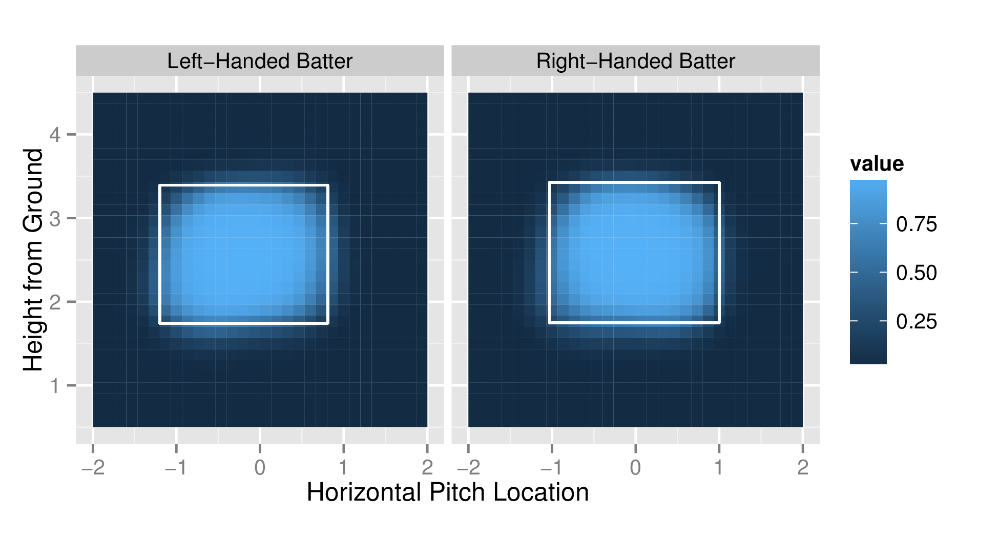
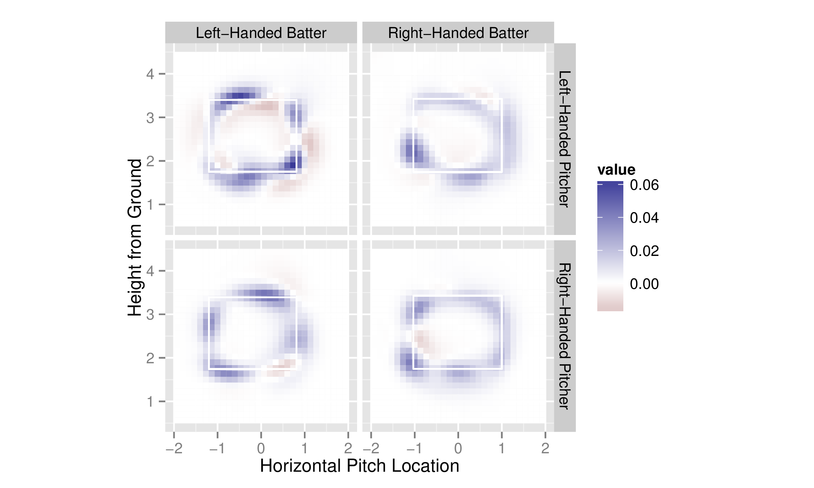

Taming MLB PITCHf/x Data with pitchRx
========================================================
author: Carson Sievert
date: 3/7/14
transition: rotate
incremental: true

What is PITCHf/x?
========================================================

<div align="center">
  
</div>

* A system that tracks baseball trajectories from pitcher to batter

Plotting trajectories
========================================================


<div align = "center">
 <embed width="504" height="504" name="plugin" src="index-figure/ani.swf" type="application/x-shockwave-flash"> 
</div>


Cool, but how was that created?
========================================================
title:false

* First, get the data:


```r
library(pitchRx)
game <- "gid_2013_04_24_texmlb_anamlb_1"
dat <- scrape(game.ids = game)
```


* The file which contain PITCHf/x contains observations on several levels (ie, pitch-by-pitch vs. atbat-by-atbat)
* Player information is recorded on the atbat level.


```r
atbats <- subset(dat$atbat, pitcher_name=="Yu Darvish" & batter_name=="Albert Pujols")
```


* Finally, animate pitches thrown by Darvish to Pujols:


```r
pitchfx <- plyr::join(atbats, dat$pitch, by = c("num", "url"), type = "inner")
animateFX(pitchfx)
```


What if I want all the data?!?
========================================================
title:false

<div align="center">
  
</div>

Collecting (and Storing) PITCHf/x
========================================================


```r
library(dplyr)
# Initiate a database
my_db <- src_sqlite("pitchfx.sqlite3")
```


* `scrape` can export data to a database connection in a "streaming fashion".


```r
scrape(start = "2008-01-01", end = Sys.Date(), 
  connect = my_db$con)
```


* Using `connect` can lead to a drastically improved run-time on machines with limited RAM.
* If you know how to run BATCH jobs, you can set it and forget it!

The internals of pitchRx have come along way
========================================================

<div align="center">
  
</div>

* [XML2R](http://cran.r-project.org/web/packages/XML2R/index.html) is another package that was born out of this project. If you scrape XML, it __might__ make your life __a lot__ easier.


__dplyr__ is great for working with a large data.
========================================================
title:false
incremental:false

* __dplyr__ is great for working with a large data.


```r
pitch <- select(tbl(my_db, "pitch"), 
  px, pz, des, num, gameday_link)
pitch
```

```
Source: sqlite 3.7.17 [pitchfx.sqlite3]
From: pitch [805,323 x 5]

   px pz             des num
1  NA NA In play, no out   1
2  NA NA In play, out(s)   2
3  NA NA In play, no out   3
4  NA NA In play, no out   4
5  NA NA   Called Strike   5
6  NA NA   Called Strike   5
7  NA NA   Called Strike   5
8  NA NA In play, out(s)   6
9  NA NA In play, out(s)   7
10 NA NA In play, out(s)   8
.. .. ..             ... ...
Variables not shown: gameday_link (chr)
```


What are px and pz?
========================================================

<div align="center">
  
</div>

* __px__ and __pz__ are __horizontal__ and __vertical__ (respectively) locations of the baseball -- as it crosses home plate.


What are the most common pitch outcomes?
========================================================
title:false

* What are the most common pitch outcomes?


```r
pitch %.%
  group_by(des) %.%
  summarise(count = n()) %.%
  arrange(desc(count))
```

```
Source: sqlite 3.7.17 [pitchfx.sqlite3]
From: <derived table> [?? x 2]
Arrange: desc(count) 

                         des  count
1                       Ball 264551
2              Called Strike 136303
3                       Foul 123598
4            In play, out(s) 106353
5            Swinging Strike  78548
6            In play, no out  37823
7            In play, run(s)  19834
8               Ball In Dirt  15345
9                   Foul Tip   5783
10 Swinging Strike (Blocked)   5401
..                       ...    ...
```


Decisions
========================================================
title:false

* If we condition on __Called Strikes__ and __Balls__, the batter doesn't swing and the __umpire has to make a binary decision__ between strike/ball.


```r
dat <- filter(pitch,
  des == "Called Strike" | des == "Ball")
```


* Now, let's add information recorded on the atbat level.


```r
atbats <- select(tbl(my_db, "atbat"), 
  inning_side, stand, p_throws, b_height, num, url)
decisions <- collect(inner_join(dat, atbats))
```


Probabilistic strike-zones
========================================================

* Using umpire `decisions`, we can model the probability of a called strike at a given location under multiple scenarios.
* One obvious way of doing so is fitting a loess smoother over a 2D space.
* A similar (more general) approach is to use what are called _generalized additive models_.
* The implementation is the __mgcv__ is nice as it automatically finds optimal smoothing parameter(s) via cross-validation.
* It also has built in support for parallel computing

An example
========================================================

* Parallel computing is easy with `R`'s built-in __parallel__ package.


```r
library(parallel)
cl <- makeCluster(detectCores()-1)
```


* We can pass the `cl` object to the `bam` function (which works sort of like `lm`).


```r
library(mgcv)
m <- bam(strike ~ interaction(stand, 
  p_throws, inning_side) + 
  s(px, pz, by = interaction(stand, 
  p_throws, inning_side)), 
  data = decisions, 
  family = binomial(link = 'logit'),
  cluster = cl)
```


Visualizing surfaces
========================================================

* `interaction(stand, p_throws, inning_side)` is a factor with 8 levels, so we have 8 smooth surfaces.
* The `m$var.summary` tracks the "most common" value of these covariates.
* Note that the common value for `p_throws` is `'R'` and for `inning_side` is `'top'`, but I can change them!


```r
away <- factor("bottom", 
  levels=c("top", "bottom"))
m$var.summary<-modifyList(m$var.summary, 
  list(inning_side = away))
```


* `strikeFX` uses `m$var.summary` for conditioning values


```r
strikeFX(decisions, model = m) + 
  facet_grid(. ~ stand)
```


Right-handed away pitchers
========================================================

<div align="center">
  
</div>

Differenced probability plots
========================================================

* I can use the `density1` and `density2` arguments to look at how probability of a called strike __differs__ in two different cases.


```r
strikeFX(decisions, model = m, 
 density1 = list(inning_side = "top"), 
 density2 = list(inning_side="bottom") + 
  facet_grid(p_throws ~ stand)
```


* This will take our 8 surfaces and reduce them down to 4 since we are differencing based on one of the factors. 


Difference in probability of strike
========================================================

<div align="center">
  
</div>


The future
========================================================

* I wrote [a paper](http://cpsievert.github.io/pitchRx/RJwrapper.pdf) on `pitchRx` and `XML2R` that will appear in the next issue of the [R Journal](http://journal.r-project.org/)
* I will be contributing to [baseballwithr.wordpress.com](http://baseballwithr.wordpress.com/) alongside [Jim Albert](http://bayes.bgsu.edu/) and [Ben Baumer](http://www.math.smith.edu/~bbaumer/).
* Possibly start digging into [HITf/x and FIELDf/x](http://m.mlb.com/video/v31405521/heywards-catch-through-bams-new-tracking-technology)?

Thanks for coming! Any questions?
========================================================

