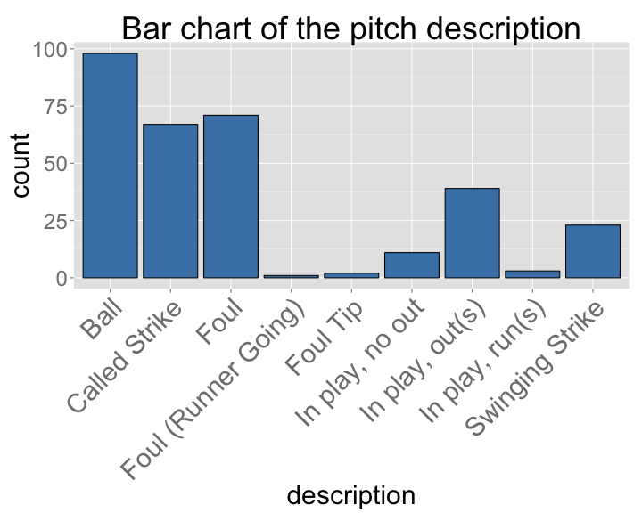
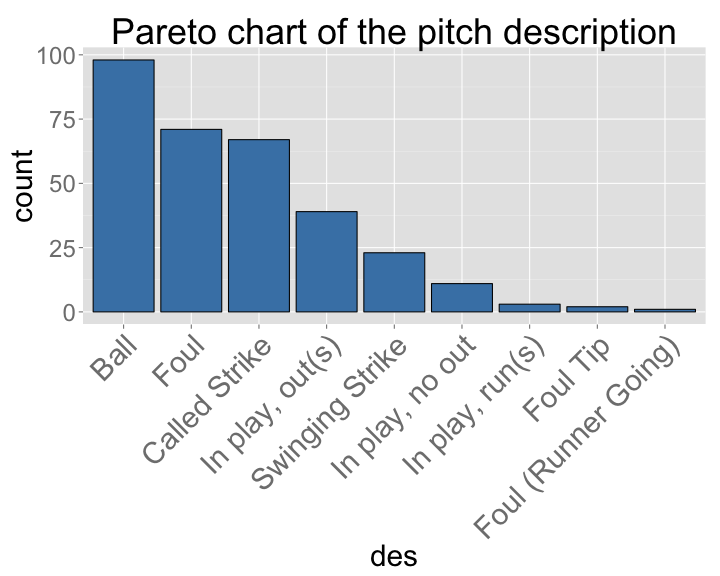
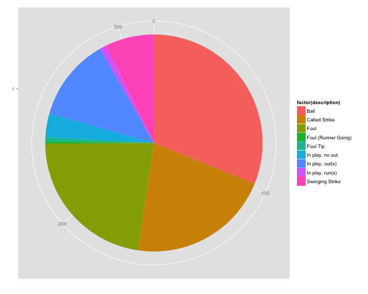
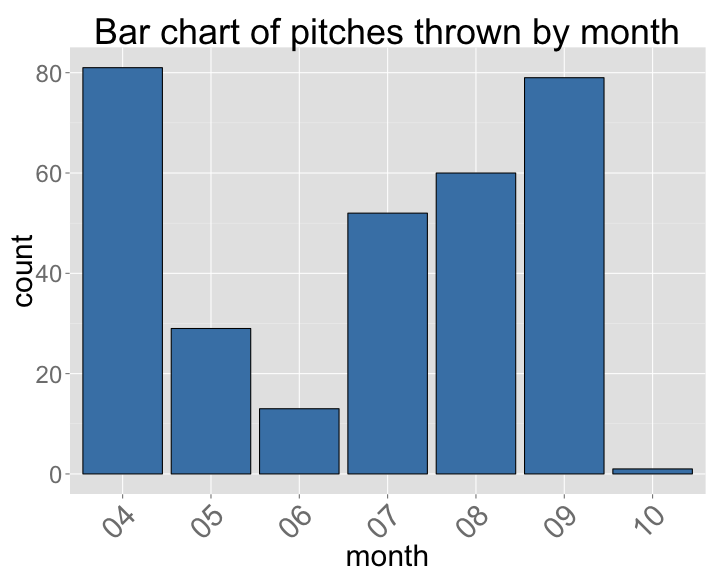
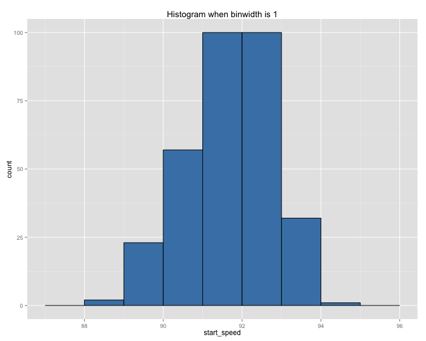
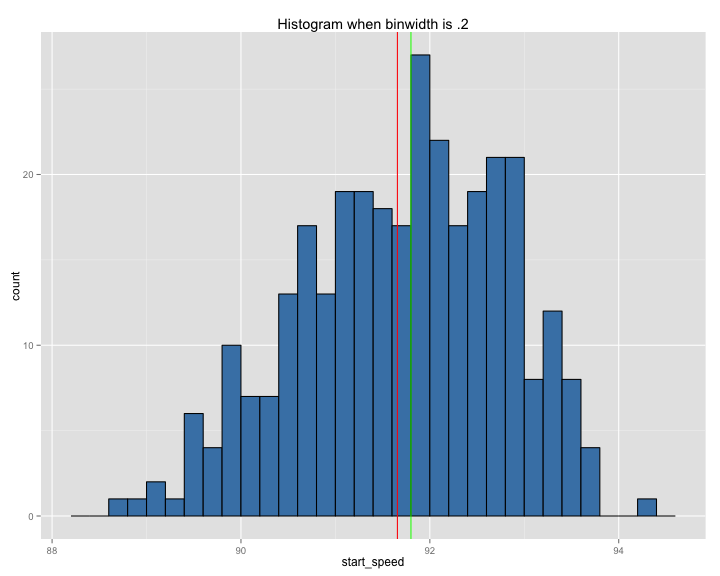
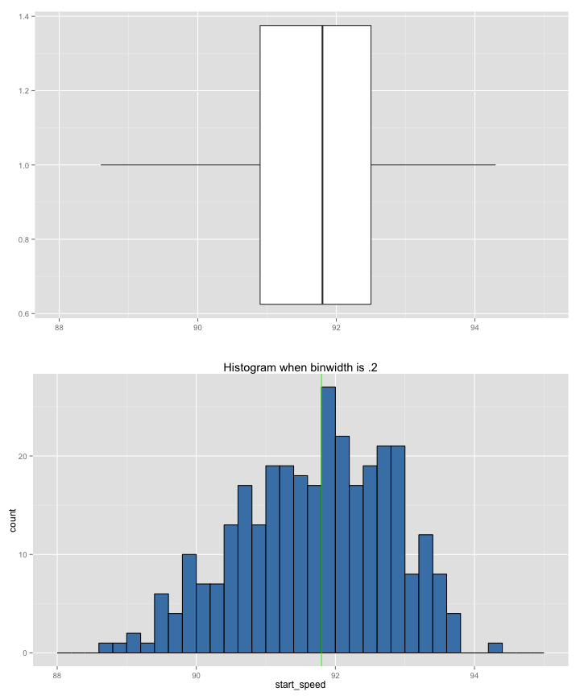

Stat 226 - Lecture 3
========================================================
date: 01/21/13
transition: rotate
incremental: true

Announcements
========================================================

* Homework 1 is due by 5pm today. Homework 2 is now available (it requires __JMP__)!
* Your student/class number helps us alphabetize assignments (its not a grade). Use it! 
* The reading quiz is now available. __It is due Sunday!__
* Find a group of 4 for the course project (and in-class help). 
* Any questions???

Misleading graphs
========================================================
title: false

<div align="center"></div>

* Take away: Don't mislead your audience!

Less is (often) more!
========================================================

<div align="center">

</div>

What's a 226 student to do?
========================================================

1. Identify the __variable__ of interest.
2. Identify whether the variable is __categorical__ or __quantitative__.
3. If variable is __categorical__ (chapter 3), you're options are:
  * __Bar chart__ (recommended)
  * __Pareto chart__ (recommended)
  * __Pie chart__ (not recommended)
4. If variable is __quantitative__ (chapter 4), you're options are:
  * <div title="distribution of a variable is the collection of possible values the
variable can take and how often each value occurs." style="float:left;clear:both;">__Histogram__ (good for examining a single __distribution__)</div>
  * __Boxplot__ (good for comparing multiple __distributions__)
  
  
Every pitch by Mariano Rivera in '11
========================================================
incremental: false


```
        description type start_speed month
1     Called Strike   FC        91.3    04
2   In play, out(s)   FF        91.5    04
3     Called Strike   FC        91.8    04
4     Called Strike   FC        91.8    04
5              Foul   FC        92.0    04
6              Foul   FC        92.0    04
7              Ball   FC        89.5    04
8              Ball   FC        89.5    04
9              Foul   FC        91.0    04
10             Foul   FC        91.0    04
11             Ball   FC        90.5    04
12             Ball   FC        90.5    04
13  In play, out(s)   FC        90.8    04
14  In play, out(s)   FC        90.8    04
15             Ball   FC        90.5    04
16  Swinging Strike   FC        90.6    04
17             Foul   FC        90.4    04
18             Foul   FC        91.5    04
19             Ball   FC        90.6    04
20             Foul   FC        91.6    04
21             Ball   FC        91.0    04
22    Called Strike   FC        90.3    04
23  In play, out(s)   FC        89.8    04
24    Called Strike   FF        90.3    04
25             Foul   FC        89.4    04
26             Foul   FC        90.8    04
27             Ball   FC        90.7    04
28             Foul   FC        90.3    04
29  In play, no out   FC        90.9    04
30             Foul   FF        91.0    04
31             Foul   FF        91.9    04
32             Foul   FC        91.6    04
33             Foul   FC        91.2    04
34             Foul   FF        91.5    04
35  In play, no out   FC        89.9    04
36             Foul   FC        91.3    04
37             Ball   FF        91.3    04
38  Swinging Strike   FF        91.1    04
39             Foul   FF        92.1    04
40             Ball   FC        92.5    04
41             Ball   FC        91.9    04
42             Foul   FC        92.4    04
43             Foul   FC        91.4    04
44             Foul   FC        93.2    04
45             Ball   FC        90.0    04
46  Swinging Strike   FC        89.9    04
47             Ball   FC        88.6    04
48  Swinging Strike   FC        89.3    04
49             Ball   FC        90.7    04
50             Foul   FC        90.6    04
51             Foul   FC        89.9    04
52  Swinging Strike   FC        89.6    04
53             Ball   FC        90.1    04
54             Ball   FC        89.9    04
55             Ball   FC        89.4    04
56    Called Strike   FC        90.6    04
57  In play, out(s)   FC        91.2    04
58    Called Strike   FC        91.0    04
59  Swinging Strike   FC        90.3    04
60             Foul   FC        90.8    04
61             Ball   FC        89.9    04
62             Ball   FC        90.1    04
63    Called Strike   FC        90.7    04
64             Ball   FC        91.3    04
65             Ball   FC        91.1    04
66    Called Strike   FC        89.9    04
67    Called Strike   FC        90.9    04
68             Foul   FC        91.7    04
69             Ball   FC        91.2    04
70             Foul   FC        90.1    04
71             Foul   FC        90.1    04
72             Foul   FC        90.5    04
73  In play, out(s)   FC        90.3    04
74             Ball   FC        90.5    04
75    Called Strike   FC        90.8    04
76  In play, out(s)   FC        90.5    04
77             Ball   FC        91.1    04
78             Ball   FC        91.2    04
79  Swinging Strike   FC        90.6    04
80    Called Strike   FC        91.8    04
81  In play, out(s)   FC        91.8    04
82             Foul   FC        90.4    05
83  In play, out(s)   FC        90.6    05
84    Called Strike   FC        92.4    05
85  In play, out(s)   FF        90.9    05
86    Called Strike   FC        90.6    05
87  In play, out(s)   FC        91.3    05
88             Ball   FC        92.0    05
89             Foul   FC        90.8    05
90             Foul   FC        91.1    05
91  Swinging Strike   FC        92.4    05
92    Called Strike   FC        89.1    05
93    Called Strike   FC        90.4    05
94             Ball   FC        89.7    05
95  Swinging Strike   FC        89.8    05
96             Ball   FC        91.0    05
97             Foul   FC        90.2    05
98             Ball   FC        89.5    05
99             Ball   FC        89.1    05
100 In play, out(s)   FC        88.9    05
```


Pitch Description
========================================================

* What type of variable is the pitch __description__?
* __description__ is a __nominal__ variable. Here is it's distribution (shown as a __frequency table__):
  

```
          description
 Ball           :98  
 Foul           :71  
 Called Strike  :67  
 In play, out(s):39  
 Swinging Strike:23  
 In play, no out:11  
 (Other)        : 6  
```


Relative Frequencies
========================================================

* Now, here is the __relative frequency__:


```
                     
                      [,1] 
  Ball                0.311
  Called Strike       0.213
  Foul                0.225
  Foul (Runner Going) 0.003
  Foul Tip            0.006
  In play, no out     0.035
  In play, out(s)     0.124
  In play, run(s)     0.010
  Swinging Strike     0.073
```


* There were 315 pitches, so divide every number in the frequency table by this number to get the relative frequencies.

Bar Chart
========================================================




Pareto Chart
========================================================




* Pareto charts always place the __mode__ as the left-most category.
* If the variable is __nominal__, pareto charts are preferred! __Why__?

Pie Chart
========================================================
title:false




* Resist the temptation to pie charts and use bar charts instead. 
* __Why__ are they bar charts so much better than pie charts?

Month
========================================================
title:false

* __month__ is a __ordinal__ variable. Here is it's distribution (shown as a __frequency table__):


```
 month  
 04:81  
 05:29  
 06:13  
 07:52  
 08:60  
 09:79  
 10: 1  
```


Bar Chart
========================================================
title:false




* You probably shouldn't change the ordering of an ordinal variable. 
* In other words, a pareto chart of an ordinal variable might be misleading!

Pitch speed
========================================================

* __start_speed:__ The speed of the pitch as it left the hand. This is __quantitative__.
* To visualize the distribution a __single__ quantitative variable, use a histogram.
* Since quantitative variables don't have "categories", we have to create them!
* Although histograms look similar to bar charts, histograms deceivingly hard.

Choosing binwidths
========================================================


***

* Notice that all the 'binwidths' (within each plot) are equal!
* Which do you think looks best?
* When doing this in practice, trial and error is essential!


Frequencies when binwidth is 1
========================================================
incremental:false
right: 62%


```
         
          [,1]
  [88,89)    2
  [89,90)   23
  [90,91)   57
  [91,92)  100
  [92,93)  100
  [93,94)   32
  [94,95)    1
```

***



Numerical summaries
========================================================

* Often times you'd like to report numerical summaries in addition to graphics.
* Numerical summaries could be grouped into __measures of center__ and __measures of spread__.
* The __mean__, __median__, and __mode__ are all measures of center.
* The mean (91.6565 MPH) is obtained by adding all the values of __start_speed__ and dividing by the number of pitches.
* The median (91.8 MPH) is obtained by: 
  1. Rank all of the values from highest to lowest: 88.6, 88.9, 89.1, 89.1, ..., 93.6, 93.7, 94.3
  2. Find the middle value. See pg 56 the lecture notes for more details on how to find this...
  
Mean vs. median
========================================================

* The mean is influenced by outliers, but the median is robust to outliers. 
* In other words, the mean is dragged towards the more unusual values.
* Thus, we sometimes compare these values to assess the direction of skew in a distribution.
  * If mean < median, then the mean is dragged to the left (skewed left)
  * If mean > median, then the mean is dragged to the right (skewed right)
  * If mean = median, the distribution is symmetric (in a perfect world)
  
Visual representation
========================================================



***
* The mean corresponds to the red line below. The median corrresponds to the green line.
* What is the __overall shape__ of the distribution?

Boxplot vs Histogram
========================================================
left:40%



***
* A __boxplot__ is another visual representation of a distribution, but instead of a __frequency table__, it uses the __5 number summary__.
* All of these numbers can be thought of as __percentiles__.
* The __median__ is also known as the 50th percentile.
* What percentile is the minimum? Maximum?
* __Q1__ is the median of the first half of the distribution.
