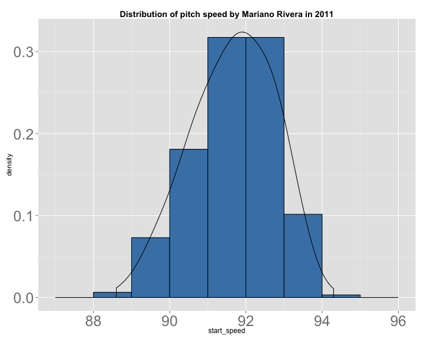
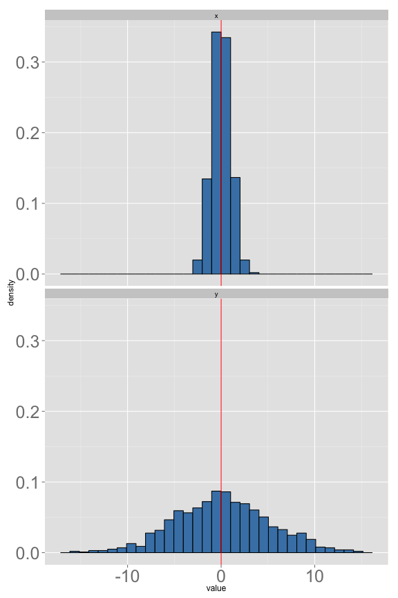

Stat 226 - Lecture 5
========================================================
date: 01/28/14
transition: rotate
incremental: true

Announcements
========================================================

* The project is now available on Blackboard. There will be 4 steps. The first step is due Feburary 10th.
* Keep in mind you will need to collect data associated with the variables in the first step. Come up with a realistic example!
* Reading quiz on Chapter 12 due this Sunday.
* Go to office hours if you have problems with JMP!
* Any questions?

Histograms Revisited
========================================================
title: false


```
         
          [,1]
  [88,89)    2
  [89,90)   23
  [90,91)   57
  [91,92)  100
  [92,93)  100
  [93,94)   32
  [94,95)    1
```


***
* __Histograms__ are essential to this class and statistics in general. 
* A __histogram__ displays the __distribution__ of a __quantitative__ variable.
* In simpler terms, it tells us where values of a variable are likely to occur.
* These are __absolute__ frequencies (counts).
* In order to make __inferential__ statements about a __population__, we use __relative__ frequencies!

Relative frequencies
========================================================
title: false


```
         
          [,1] 
  [88,89) 0.006
  [89,90) 0.073
  [90,91) 0.181
  [91,92) 0.317
  [92,93) 0.317
  [93,94) 0.102
  [94,95) 0.003
```

***
* To find __relative__ frequencies, divide each count by the total number of observations.
* Notice how the shape of histogram is preserved. Only the y-axis is changes!
* Before, we plotted the number of pitches in each bin. Now we have the percent of pitches within each bin.
* For example, only 0.6% of all these pitches are between 88 and 89 MPH!

Percentiles
========================================================


```
         
          [,1] 
  [88,89) 0.006
  [89,90) 0.073
  [90,91) 0.181
  [91,92) 0.317
  [92,93) 0.317
  [93,94) 0.102
  [94,95) 0.003
```

***

* What percentage of pitches thrown by Rivera are less than 90 MPH?
* Add up the relative frequencies...0.006 + 0.073 = 0.079 (about 8%)
* We say that 90 MPH is the 8th __percentile__.

Percentiles continued
========================================================


```
         
          [,1] 
  [88,89) 0.006
  [89,90) 0.073
  [90,91) 0.181
  [91,92) 0.317
  [92,93) 0.317
  [93,94) 0.102
  [94,95) 0.003
```

***

* What percentage of pitches thrown by Rivera are less than 91 MPH?
* Add up the relative frequencies...0.006 + 0.073 + .181 = 0.26
* We say that 91 MPH is the 26th __percentile__.

Foreshadowing
========================================================




***

* In practice, we find a "smooth curve" based on __sample__ data in order to make __inferential__ statements about __parameters__.
* For instance, based on this data, I am about 99% confident the __true average pitch speed__ is between 89 and 94 MPH.

A Mental Exercise
========================================================



***

* What's the difference between these two histograms?

<li class="fragment"> <div align="center">

</div></li>

* There is "more __variation__" or "more __spread__" in the bottom histogram!

Measures of spread (or variability)
========================================================

* __Range__: Maximum - Minimum
* __IQR__: Q3 - Q1
* __Variance and Standard Deviation__: see pages 75-79 in the lecture notes.

Summarizing Measurements
========================================================

<!-- html table generated in R 3.0.2 by xtable 1.7-1 package -->
<!-- Tue Jan 28 12:38:58 2014 -->
<TABLE border=1>
<TR> <TH>  </TH> <TH> nominal </TH> <TH> ordinal </TH> <TH> quantitative </TH>  </TR>
  <TR> <TD align="right"> mode </TD> <TD> Yes </TD> <TD> Yes </TD> <TD> Yes </TD> </TR>
  <TR> <TD align="right"> mean </TD> <TD> No </TD> <TD> No </TD> <TD> Yes </TD> </TR>
  <TR> <TD align="right"> variance </TD> <TD> No </TD> <TD> No </TD> <TD> Yes </TD> </TR>
  <TR> <TD align="right"> percentiles </TD> <TD> No </TD> <TD> Yes </TD> <TD> Yes </TD> </TR>
   </TABLE>


* If you can calculate a __percentile__, you can calculate the __5 number summary__.
* If you can calculate __variance__, you can calculate __standard deviation__.

Quantitative Measurements
========================================================

<!-- html table generated in R 3.0.2 by xtable 1.7-1 package -->
<!-- Tue Jan 28 12:38:58 2014 -->
<TABLE border=1>
<TR> <TH>  </TH> <TH> center </TH> <TH> spread </TH>  </TR>
  <TR> <TD align="right"> skewed </TD> <TD> median </TD> <TD> IQR, Range </TD> </TR>
  <TR> <TD align="right"> symmetric </TD> <TD> mean </TD> <TD> Standard Deviation </TD> </TR>
   </TABLE>


* Both the mean and standard deviation are influenced by outliers. That is why we don't use them for skewed distributions.
* Still have to determine whether the distribution is skewed or not. How should we do this?

Your Turn
========================================================
incremental:false

* Finish the heights worksheet, then consider the following:
1. For each of the following data scenarios, determine the appropriate measure of center and measure of spread. To answer the question, think about what values are plausible and whether a histogram would yield a more symmetric or a more skewed distribution.
  * Household income in the US.
  * In-state tuition at US public colleges.
  * Runs per game scored by the Chicago Cubs (or any baseball team)
  * Points per game scored by the Chicago Bulls (or any basketball team)
  


