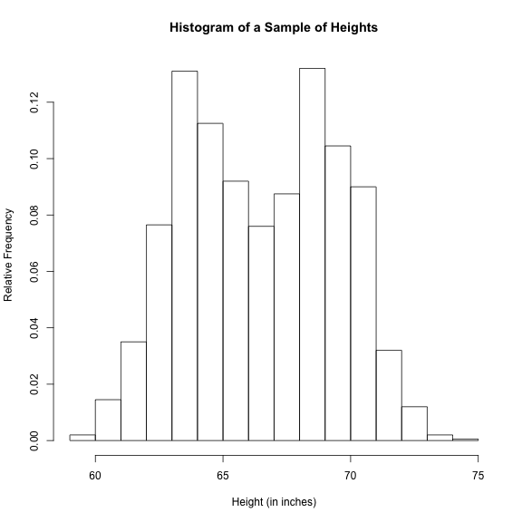
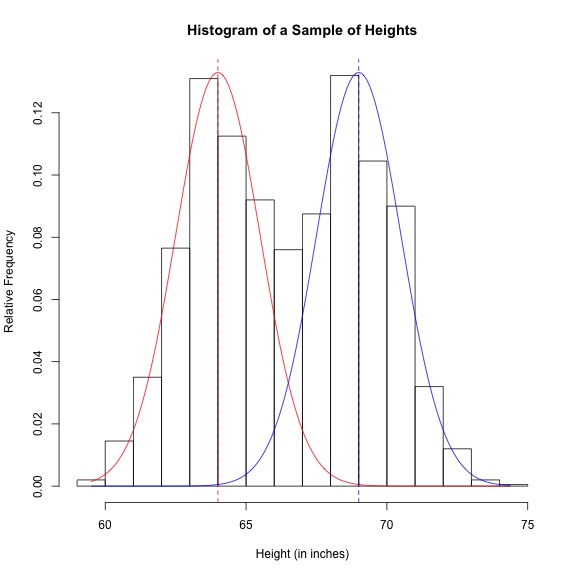
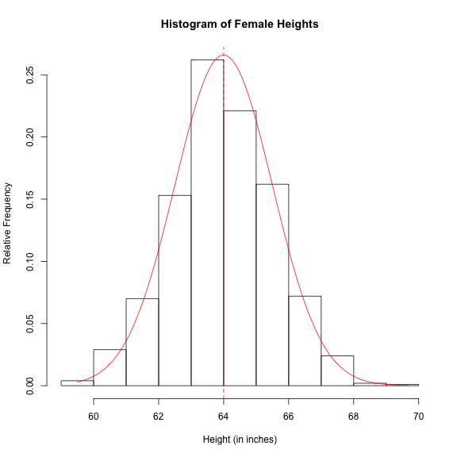
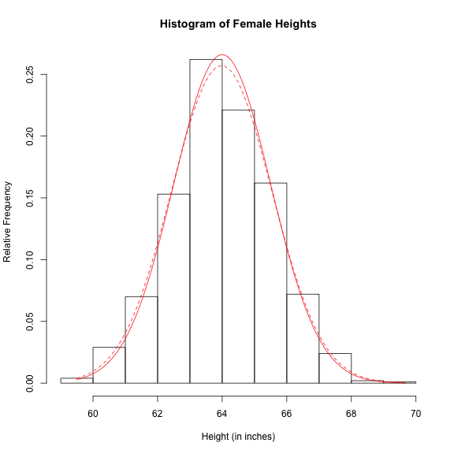
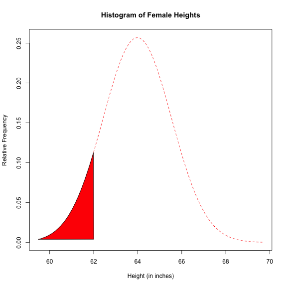
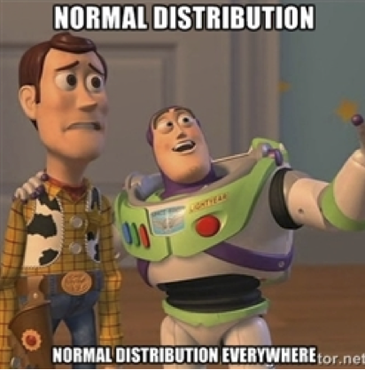

Stat 226 - Lecture 6
========================================================
date: 01/30/13
transition: rotate
incremental: true

Announcements
========================================================

* Reading quiz due Sunday. Project step 1 due Feb 10th.
* Any questions?

Your Turn
========================================================
incremental:false

* Finish the heights worksheet, then consider the following:
1. For each of the following data scenarios, determine the appropriate measure of center and measure of spread. To answer the question, think about what values are plausible and whether a histogram would yield a more symmetric or a more skewed distribution.
  * Household income in the US.
  * In-state tuition at US public colleges.
  * Heights of people.

Heights
========================================================
title:false

 

***
* What is the shape of this distribution?
* Why is it that the distribution of heights is bimodal?

Heights2
========================================================
title:false

 

***

* Males tend to be taller than females!
* The solid red line is the population distribution for females.
* In practice, we don't know the population distribution!!! So we have to estimate it using the sample...
* In chapter 12, for simplicity sake, we pretend to know everything about the population distribution.

Female Heights
========================================================
title:false

* Since I'm god, I know the population distribution of heights (solid line).
 

***

<li class="fragment"> 

</li>
* Since the distribution is normal, it can be fully described by it's mean and standard deviation:
* The population mean $\mu$ is 64 inches and standard deviation $\sigma$ is 1.5 inches.

Female Heights
========================================================
title:false

 

***

* The sample mean was 63.98 and the sample standard deviation was 1.55.
* By treating these __sample statistics__ as __population parameters__, we obtain an __estimate__ of the true __probability distribution function (pdf)__.
* Our __estimated__ pdf is written as: 
* $X \sim N(\mu = 63.98, \sigma = 1.55)$ where $X$ is a r.v. associated with the height of a female.

Female Heights
========================================================
title:false

 

***

* Think about drawing one female at random from the population. 
* What is the probability that she is 62 inches __or shorter__?
* The area under the curve shaded in red!
* We denote this quantity as $P(X < 62)$
* We study questions like this in Chapter 12.

Who Cares?
========================================================
title:false

* The normal distribution is the most important type of probability distribution function!
* What exactly is a probability distribution function?
