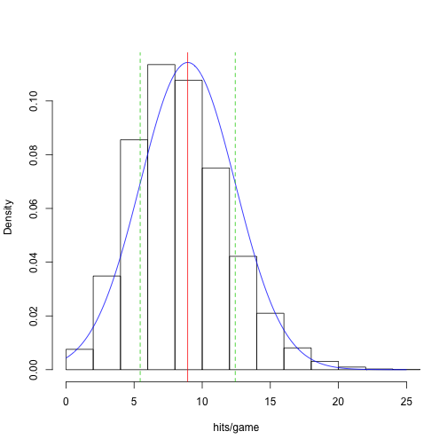

Stat 226 - Lecture 9
========================================================
date: 02/11/14
transition: rotate
incremental: true

Your Turn
========================================================
incremental:false

* Find the following probabilities using Table A:
* Given $X \sim N(150, 100)$, find:
  * $P(X < 137)$
  * $P(X > 137)$
  * $P(140 < X < 165)$
* Given $Y \sim N(-10, 3^2)$, find:
  * $P(Y > -9)$
  * $P(-9 < Y < -7)$
  
Percentiles
========================================================
incremental:false

* __Definition__: The $p^{th}$ percentile is a value, say $v$, where $p$ percent of observations are lower than $v$.

<iframe src="http://glimmer.rstudio.com/cpsievert/cdf/" width="650" height="600"></iframe>

  
Finding Percentiles of Z
========================================================

* Remember that for the normal distribution, mean = median = mode!
* Thus, the median of the __standard__ normal is...
 0! 

* Therefore the __50th percentile__ of the standard normal is ...
 0! 

* If we denote $Z \sim N(0, 1)$, we just said that $P(Z < 0) = 1/2$.
* Suppose I want to find the $99^{th}$ percentile of $Z$...
* We have to find a value $z^*$ that yields $P(Z < z^*) = 0.99$

Your Turn
========================================================
incremental:false

1. Find the value of $z^*$ for each of the following scenarios:
  * $P(Z < z^*) = 0.025$ (__Note__: $z^*$ is called the 2.5th percentile)
  * $P(Z < z^*) = 0.975$ (__Note__: $z^*$ is called the 97.5th percentile)
  * $P(Z < z^*) = 0.25$ (__Note__: $z^*$ is called the 25th percentile)
2. Find the two values that bound the middle 90% of the standard normal distribution.

Finding percentiles for any X
========================================================

* As before, $X \sim N(\mu, \sigma)$ translates to $Z \sim N(0,1)$ via a __z-score__:

$$z = \frac{x-\mu}{\sigma}$$

* Rearranging this equation a bit gives us:

$$z \times \sigma + \mu = x$$

* Thus, if $z^*$ is the $p^{th}$ percentile of the __standard__ normal, then $\mu + \sigma \times z^*$ is the $p^{th}$ percentile of $X \sim N(\mu, \sigma)$!

Average Debt
========================================================

* __Example:__ Let $X$ be the debt of an ISU undergraduate upon graduation (in thousands of dollars). Suppose $X$ is known to have a mean of 20 and standard deviation of 5.
  * How much debt does it take to have __more__ debt than 95% of other undergraduates?
  * In other words, what value of $z^*$ gives us $P(Z < z^*) = 0.95$?
  * From Table A, $z^* =$ 1.64 or 1.65 (either one is fine).
  * Using our 'backwards z-score calculation': $x = \mu + \sigma \times z^* = 20 + 5 \times 1.65 =$ 28.25
  * So, if you have $28,500 in debt upon graduating, you have more debt than 95% of graduates!
  
Your Turn
========================================================
incremental:false

1. Suppose $X \sim N(12, 2^2)$. Find the value of $x^*$ for each of the following scenarios:
  * $P(X < x^*) = 0.33$ ($x^*$ is called the 33rd percentile)
  * $P(X < x^*) = 0.66$ ($x^*$ is called the 66th percentile)
  * $P(X < x^*) = 0.01$ ($x^*$ is called the 1st percentile)
2. Suppose monthly revenue in your business market is known to vary according to a normal distribution with mean of $500 thousand and variance of $200 thousand.
  * How much revenue do you need next month in order to sell more than 98% of the entire market?
  * What monthly revenue figure would imply that 40% of the market receieved a higher revenue?

Histogram of hits per game in baseball
========================================================

 

***

* In a baseball game, both teams have several attempts to hit the baseball in play.
* I collected data on total # of hits by home __and__ away teams in 2011.
* This histogram shows the distribution of hits per game.
* Pretty close to a symmetric, bell-shaped distribution. Let's fit a normal distribution to it!

Fitting a normal distribution to data
========================================================

 

***

* We can fit a normal distribution to this data by:
  * setting the mean parameter $\mu$ equal to the sample mean $\bar{x}$ = 8.9
  * setting the variance parameter $\sigma^2$ equal to the sample variance $s^2$  = 12.2
  
  
Inference with empirical rule
========================================================

 

***

* Think about selecting __one__ game at random. Before selecting, we can make __inference__ using a __statistical model__ for the population of games: $X \sim N(\mu = 8.9, \sigma^2 = 12.2)$
* Note that $\sigma = \sqrt{12.2} = 3.5$
* If we were to pick __one__ game at random, there is a 68% chance of observing between  (8.9 - 3.5, 8.9 + 3.5) 
 => (5.4, 12.4)
 
 hits in that game.
  

Is runs per game really normally distributed??
========================================================
left:45%

 

***

* If runs/game was _perfectly_ normal, the points would fall _exactly_ on the red line.
* Since nothing is _perfectly_ normal, we expect _some_ deviation from this line.
* The real question is whether this deviation is _statistically significant_.
* Suppose the deviation here is significant. What does that imply?
* See last 3 slides in lecture notes for more examples.

