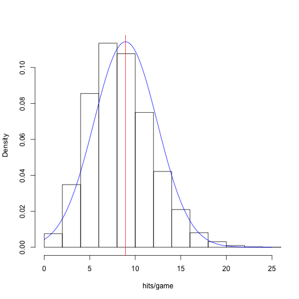
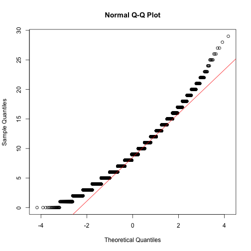

Stat 226 - Lecture 10
========================================================
date: 02/13/14
transition: rotate
incremental: true

Your Turn
========================================================
incremental:false

1. Suppose $X \sim N(12, 2^2)$. Find the value of $x^*$ for each of the following scenarios:
  * $P(X < x^*) = 0.33$ ($x^*$ is called the 33rd percentile)
  * $P(X < x^*) = 0.66$ ($x^*$ is called the 66th percentile)
  * $P(X < x^*) = 0.01$ ($x^*$ is called the 1st percentile)
2. Suppose monthly revenue in your business market is known to vary according to a normal distribution with mean of $500 thousand and variance of $200 thousand.
  * How much revenue do you need next month in order to sell more than 98% of the entire market?
  * What monthly revenue figure would imply that 40% of the market receieved a higher revenue?
  
Translating Random Variables
========================================================

* By now, we are familiar with translating $X \sim N(\mu, \sigma^2)$ to $Z \sim N(0,1)$.
* We do this by __shifting__ $X$ by $\mu$ and __scaling__ by $1/\sigma$ (ie, $Z = \frac{X-\mu}{\sigma}$)
* As it turns out, __shifting__ a normal random variable will always give us another normal random variable!
* For instance, suppose $Y = X - \mu$. Then $Y \sim$ 
 $N(0, \sigma^2)$ 

* This is a useful idea if we know the distribution of $X$, but are asked a question about $Y$.

An example
========================================================

* It is a well known that $Revenue - Cost$ = 
 $Profit!$ 

* Suppose you are a used-car dealership owner. You have the opportunity to buy a car for $1000.
* You don't know how much it will sell for, but revenue generated from similar cars can be described by $X \sim N(1200, 175^2)$.
* What is the probability that you will profit off the car?
* That is, what is the probability that revenue exceeds cost?
* Let $Y$ be profit. Then $Y =$ 
 $X - 1000$. 

* Therefore, $Y \sim N($ 
 $200, 175^2)$ 

* So, the probability of profit is $P(Y > 0)$!

Disclaimer
========================================================

* Everything we've done in Chapter 12 requires that __we know__ a population is normally distributed.
* Of course, we never __actually__ know this, but we can use a __sample__ to assess whether the normal assumption is reasonable or not.
* The demonstrate how we make this assessment, we will study some baseball data :)

Histogram of hits per game in baseball
========================================================

 

***

* In a baseball game, both teams have several attempts to hit the baseball in play.
* I collected data on total # of hits by home __and__ away teams in 2011.
* This histogram shows the distribution of hits per game.
* Pretty close to a symmetric, bell-shaped distribution. Let's fit a normal distribution to it!

Fitting a normal distribution to data
========================================================

 

***

* We can fit a normal distribution to this data by:
  * setting the mean parameter $\mu$ equal to the sample mean $\bar{x}$ = 8.9
  * setting the variance parameter $\sigma^2$ equal to the sample variance $s^2$  = 12.2
  
  
Inference with empirical rule
========================================================

 

***

* Think about selecting __one__ game at random. Before selecting, we can make __inference__ using a __statistical model__ for the population of games: $X \sim N(\mu = 8.9, \sigma^2 = 12.2)$
* Note that $\sigma = \sqrt{12.2} = 3.5$
* If we were to pick __one__ game at random, there is a 68% chance of observing between  (8.9 - 3.5, 8.9 + 3.5) 
 => (5.4, 12.4)
 
 hits in that game.
  

Is runs per game really normally distributed??
========================================================
left:45%

 

***

* If runs/game was _perfectly_ normal, the points would fall _exactly_ on the red line.
* Since nothing is _perfectly_ normal, we expect _some_ deviation from this line.
* The real question is whether this deviation is _statistically significant_.
* Suppose the deviation here is significant. What does that imply?
* See last 3 slides in lecture notes for more examples.

