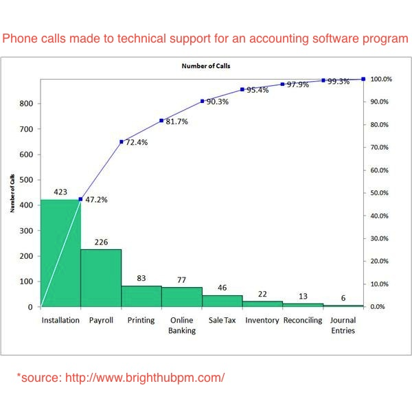
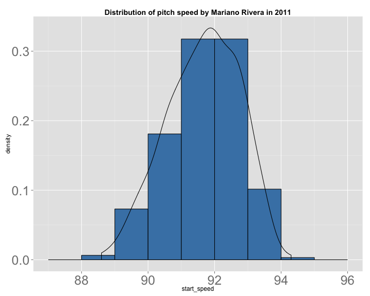
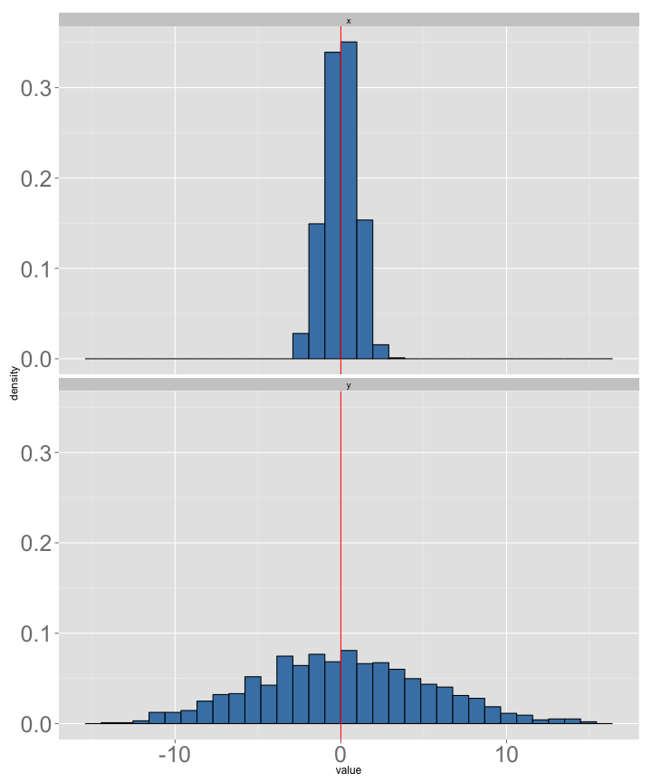

Stat 226 - Lecture 4
========================================================
date: 09/05/13
transition: rotate
incremental: true

Announcements
========================================================

* Homework 1 is due by 5pm today. Homework 2 is now available (it requires __JMP__)!
* Your student/class number helps us alphabetize assignments. It is not a grade!
* The reading quiz is now available. You have until next Friday at 5pm.
* The project will be available on Monday. I need your groups by the end of the class!
* Any questions???

Pareto Chart
========================================================

<div align="center"></div>

This is your warning...
========================================================

<div align="center"></div>

* But seriously, label axes and put a title on any graphics you create!

Histograms Revisited
========================================================
title: false


 

```
         
          [,1]
  [88,89)    2
  [89,90)   23
  [90,91)   57
  [91,92)  100
  [92,93)  100
  [93,94)   32
  [94,95)    1
```


***
* __Histograms__ are essential to this class and statistics in general. 
* A __histogram__ displays the __distribution__ of the numerical variable.
* In simpler terms, it tells us where values of a variable are likely to occur.
* This is essential information for modeling behavior in the __population__.
* The figures to the left portray __absolute frequencies__.

Relative frequencies
========================================================
title: false

 

```
         
          [,1] 
  [88,89) 0.006
  [89,90) 0.073
  [90,91) 0.181
  [91,92) 0.317
  [92,93) 0.317
  [93,94) 0.102
  [94,95) 0.003
```

***
* To find the __relative__ (as opposed to absolute) frequencies, divide each count by the total number of observations.
* Notice how the shape of histogram is preserved. Only the y-axis is changes!
* Before we plotted the number of pitches in each bin. Now we have the percent of pitches within each bin.
* For example, only 0.6% of all these pitches are between 88 and 89 MPH!

Percentiles
========================================================

 

```
         
          [,1] 
  [88,89) 0.006
  [89,90) 0.073
  [90,91) 0.181
  [91,92) 0.317
  [92,93) 0.317
  [93,94) 0.102
  [94,95) 0.003
```

***

* What percentage of pitches thrown by Rivera are less than 90 MPH?
* Add up the relative frequencies...0.06 + 0.073 = 0.079 (about 8%)
* We say that 90 MPH is the 8th __percentile__.

Percentiles continued
========================================================

 

```
         
          [,1] 
  [88,89) 0.006
  [89,90) 0.073
  [90,91) 0.181
  [91,92) 0.317
  [92,93) 0.317
  [93,94) 0.102
  [94,95) 0.003
```

***

* What percentage of pitches thrown by Rivera are less than 91 MPH?
* Add up the relative frequencies...0.06 + 0.073 + .181 = 0.314 (about 31%)
* We say that 90 MPH is the 31st __percentile__.

Foreshadowing
========================================================

 


***

* In practice, we find a "smooth curve" based on __sample__ data in order to make statements about quantities that we can't (or haven't) observed.
* For example, suppose I'm interested in the speed of Rivera's next pitch (a __random variable__).
* What is the probability that the next pitch less than 90 MPH?

Break time
========================================================
title:false

<div align="center"></div>


A Mental Exercise
========================================================

 


***
* What's the difference between these two histograms?
* There is more __variability__ in the values of the bottom histogram!

Measures of spread (or variability)
========================================================

* __Range__: Maximum - Minimum
* __IQR__: Q3 - Q1
* __Variance and Standard Deviation__: see pages 75-79 in the lecture notes.


