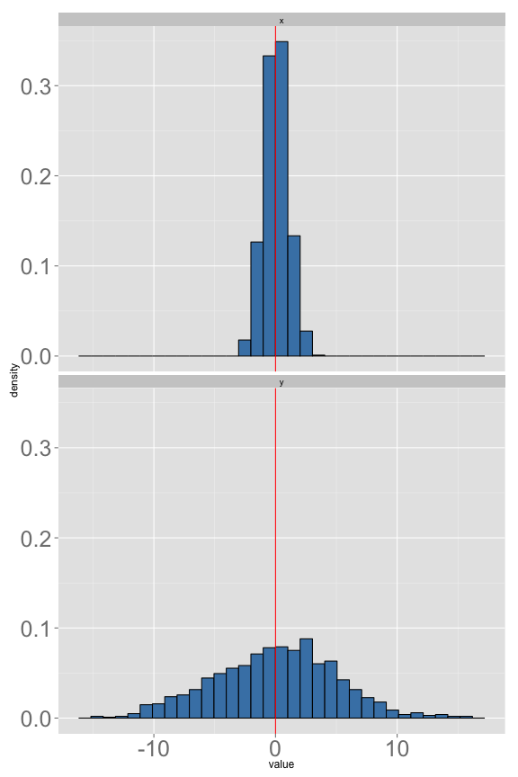

Stat 226 - Lecture 5
========================================================
date: 09/10/13
transition: rotate
incremental: true

Announcements
========================================================

* The project is now available on Blackboard. There will be about 4 parts. The first part is due September 22nd.
* Keep in mind you will need to collect data associated with the variables in the first step. Come up with a realistic example!
* Go to office hours if you have problems with JMP!
* Any questions?

A Mental Exercise
========================================================

 

***
* What's the difference between these two histograms?
* There is "more __variation__" or "more __spread__" in the bottom histogram!

Measures of spread (or variability)
========================================================

* __Range__: Maximum - Minimum
* __IQR__: Q3 - Q1
* __Variance and Standard Deviation__: see pages 75-79 in the lecture notes.

Summarizing Measurements
========================================================

<!-- html table generated in R 3.0.1 by xtable 1.7-1 package -->
<!-- Tue Sep 10 13:41:15 2013 -->
<TABLE border=1>
<TR> <TH>  </TH> <TH> nominal </TH> <TH> ordinal </TH> <TH> quantitative </TH>  </TR>
  <TR> <TD align="right"> mode </TD> <TD> Yes </TD> <TD> Yes </TD> <TD> Yes </TD> </TR>
  <TR> <TD align="right"> mean </TD> <TD> No </TD> <TD> No </TD> <TD> Yes </TD> </TR>
  <TR> <TD align="right"> variance </TD> <TD> No </TD> <TD> No </TD> <TD> Yes </TD> </TR>
  <TR> <TD align="right"> percentiles </TD> <TD> No </TD> <TD> Yes </TD> <TD> Yes </TD> </TR>
   </TABLE>

* If you can calculate a __percentile__, you can calculate the __5 number summary__.

* If you can calculate __variance__, you can calculate __standard deviation__.

Quantitative Measurements
========================================================

<!-- html table generated in R 3.0.1 by xtable 1.7-1 package -->
<!-- Tue Sep 10 13:41:15 2013 -->
<TABLE border=1>
<TR> <TH>  </TH> <TH> center </TH> <TH> spread </TH>  </TR>
  <TR> <TD align="right"> skewed </TD> <TD> median </TD> <TD> IQR, Range </TD> </TR>
  <TR> <TD align="right"> symmetric </TD> <TD> mean </TD> <TD> Standard Deviation </TD> </TR>
   </TABLE>

* Both the mean and standard deviation are influenced by outliers. That is why we don't use them for skewed distributions.

* Still have to determine whether the distribution is skewed or not. How should we do this?

Your Turn
========================================================
incremental:false

* Finish the heights worksheet, then consider the following:
1. For each of the following data scenarios, determine the appropriate measure of center and measure of spread. To answer the question, think about what values are plausible and whether a histogram would yield a more symmetric or a more skewed distribution.
  * amount of income tax paid by household in the US
  * amount of tuition charged by public colleges in the midwest states of the US
  * runs per game scored by the Chicago Cubs (or any baseball team)
  * points per game scored by the Chicago Bulls (or any basketball team)
  

