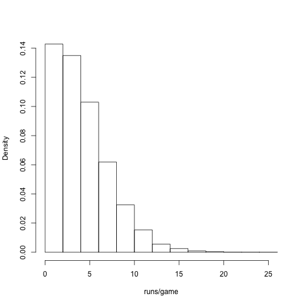
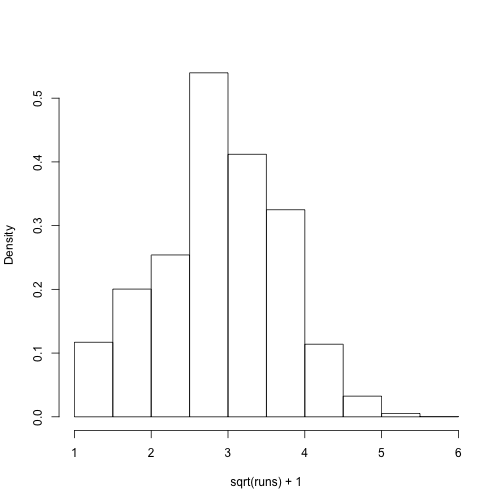
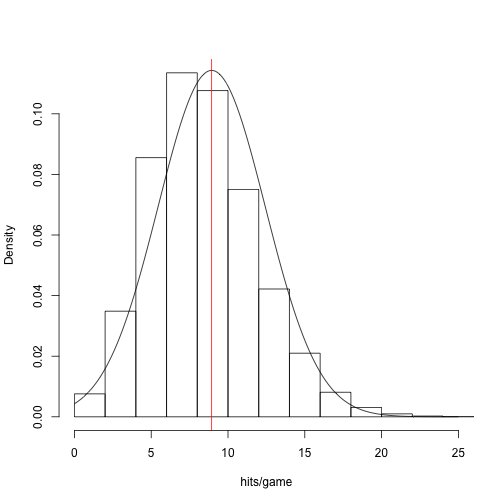
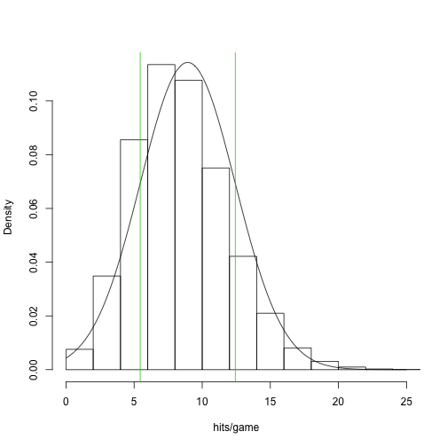

Stat 226 - Lecture 6
========================================================
date: 09/12/13
transition: rotate
incremental: true

Announcements
========================================================

* Homework is due today. From now on, the homework is due at 4:30pm.
* Reading quiz due tomorrow.
* Any questions?

Runs per game in baseball
========================================================

 

***

* Pretty close to what we said on Tuesday, huh?
* This doesn't look like a normal distribution...

Square root of runs per game in baseball
========================================================

 

*** 

* Statisticians have a lot of tricks they can use to transform skewed distributions into symmetric/normal distributions.
* This type of trick will make it harder to interpret some statistical models.

Histogram of hits per game in baseball
========================================================

 

***

* Pretty close to a symmetric, bell-shaped distribution. Let's fit a normal distribution to it!

Fitting a normal distribution to data
========================================================

 

***

* We can fit a normal distribution to this data by:
  * setting the mean parameter $\mu$ equal to the sample mean $\bar{x}$ = 8.9368
  * setting the variance parameter $\sigma^2$ equal to the sample variance $s^2$  = 3.4897
  
Making approximate inference with empirical rule
========================================================

 

***

* The empirical rule tells us about 68% of the normal curve falls within one standard deviation of the mean.
* Note that the mean is 8.94 and the standard deviation is 3.49.
* If we were to pick __one__ random game, there is roughly a 68% chance of there being between  (8.94 - 3.49, 8.94 + 3.49) => (5.45, 12.43) hits in that game.
