## Why make a web page? 

* Because, internet! <p></p> <div class="centered"></div>

## Ain't nobody got time for that!

* I know your busy, but web technologies are becoming more & more important for statistical computing:
    * Data "scraping", web APIs, etc.
    * Interactive graphics
    * Interactive reports/documents
    * Cloud computing
* Even if none of this interests you, having a web presence is incredibly helpful in landing internships/jobs/etc.

## University resources

* University Resources for Making Web Pages: <http://www.stat.iastate.edu/resources-creating-course-webpage/>
* For example: <http://www.public.iastate.edu/~sievert>
* The source code for this page is below. It redirects to <http://cpsievert.github.com/>
 
```html
<html>
  <head>
    <title>Carson Sievert, ISU Redirect</title>
    <meta http-equiv="REFRESH" content="0;url=http://cpsievert.github.com/">
  </head>
  <body>
    Please wait while you are redirected to my homepage
  </body>
</html>
```

## GitHub

* With a <http://github.com> account, anyone can create a nice looking website in minutes.
* If you don't have a github account, __please sign up now!__ All you need is a valid username/email/password. <div class="centered"> 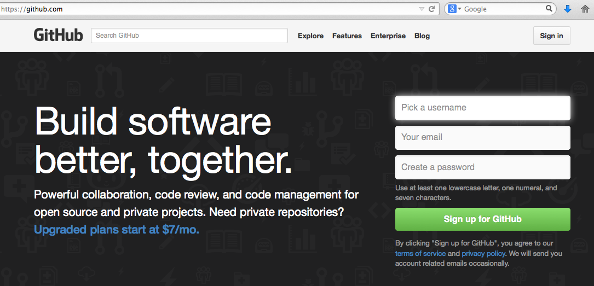</div>

## What is GitHub?

* A web-based hosting service for _Git repositories_ (aka. Git repos).
* _Git_ is a popular version control system. A _Git repo_ is a folder of files where changes can be easily logged and reversed.
* _Git_ is an essential tool for software developers and researchers concerned with reproducibility (it could also prove useful in tracking changes to your website).
* You won't need to know _Git_ to get a "Hello World!" version of your website, but trust me, learn it, it pays off.

## GitHub Pages

* GitHub also provides a service called [GitHub Pages](https://pages.github.com/) which essentially gives you a free domain name and hosting service.
* There's (at least) two ways to serve files via GitHub Pages:

    (1) Create the "special" _username.github.io_ repository (where _username_ is your GitHub username). I recommend using this repo for your personal website.
    (2) Push to the "gh-pages" branch instead of the default "master" branch. Note this works for any repo.

# Create a website on http://username.github.io

--------

* Go to <http://github.com/new> <div class="centered">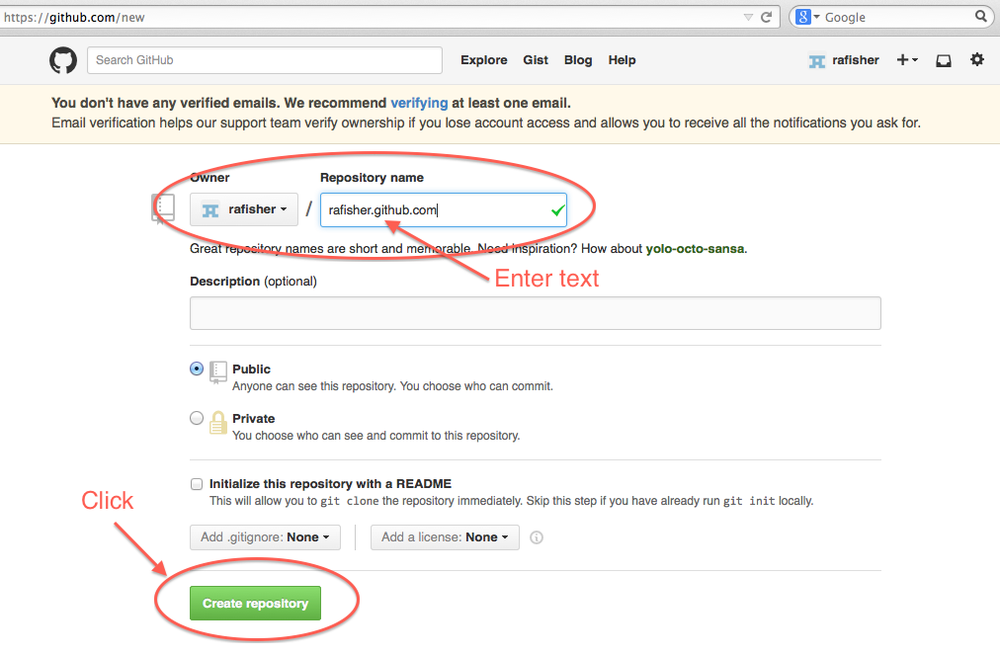</div>

--------

* Click on Settings <div class="centered">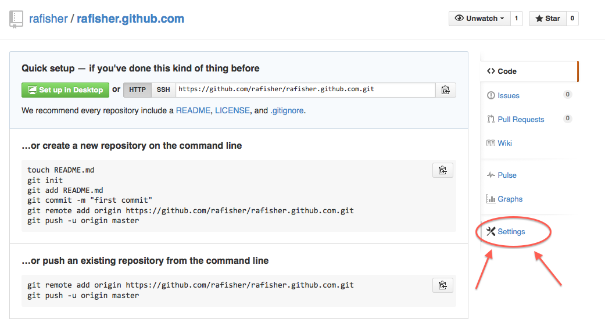</div>
* Scroll down and click "Automatic Page Generator": <div class="centered">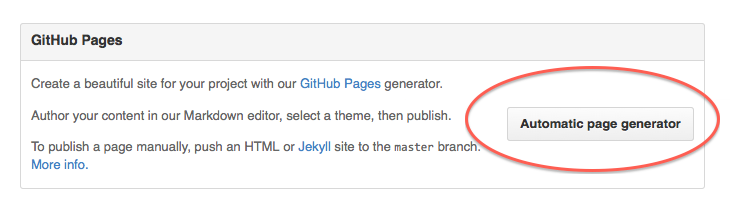</div>

-------

* <div class="centered">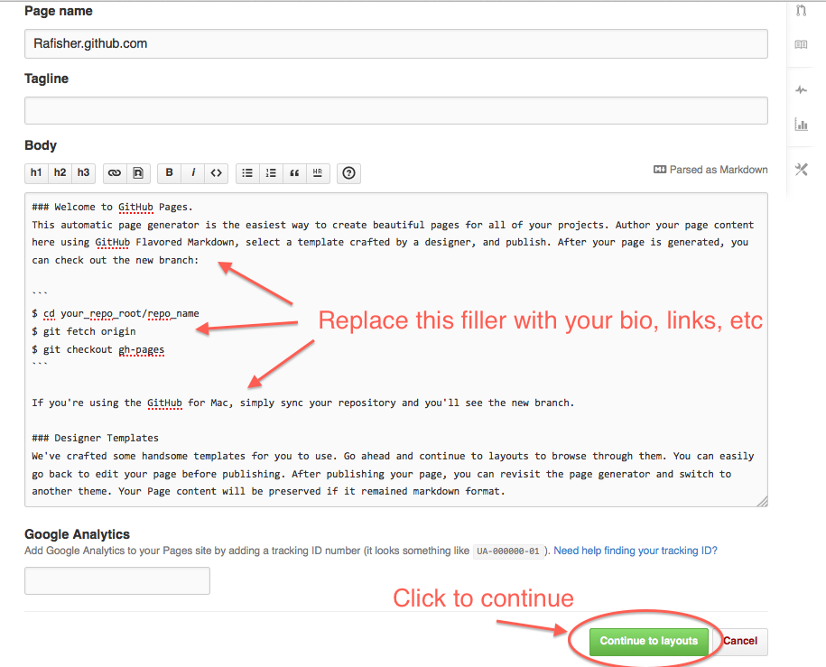</div>

-------

* Choose a layout and "Publish Page" <div class="centered">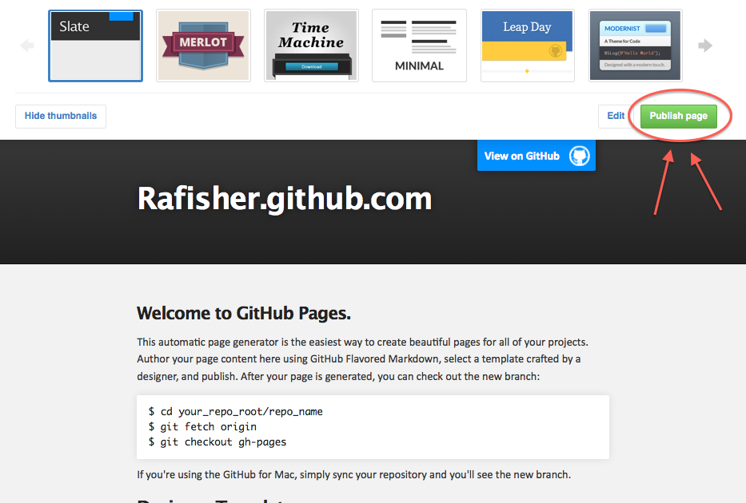</div>
* Fist pump -- you just made a website!! <div class="centered"></div>

# 'Clone' the repo to your machine

-------

* Go to <http://github.com/username/username.github.com> and copy the remote <div class="centered">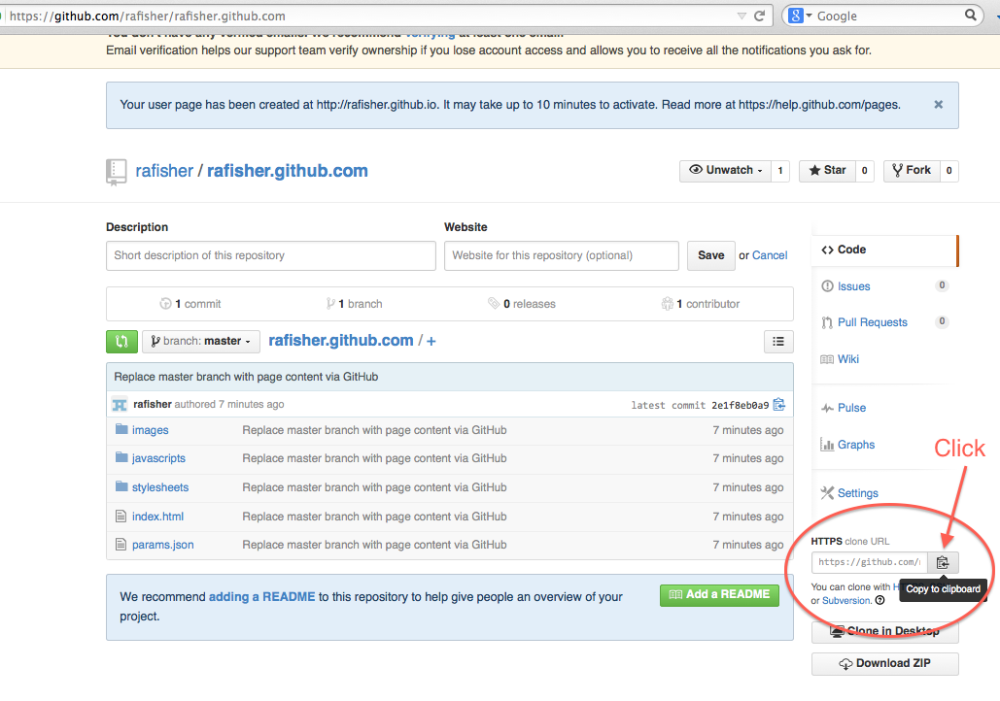</div>

-------

* Open RStudio -> File -> New Project -> Version Control: <div class="centered">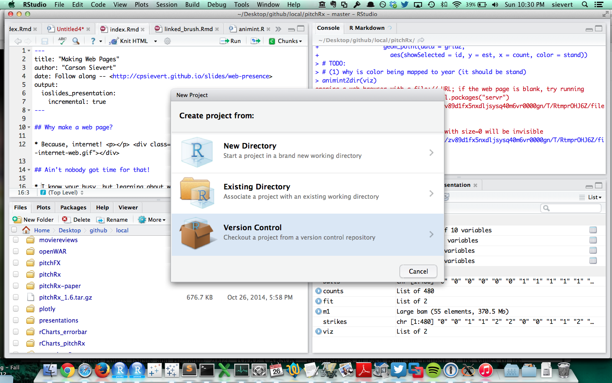</div>

-------

* Choose git project <div class="centered">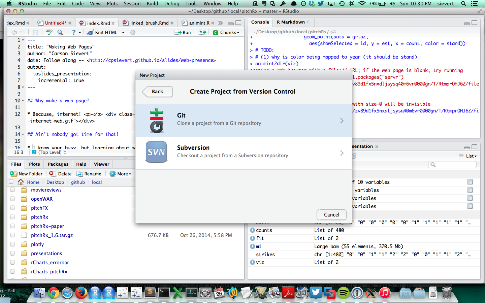</div>
* Paste the remote into the "Repository URL" field: <div class="centered">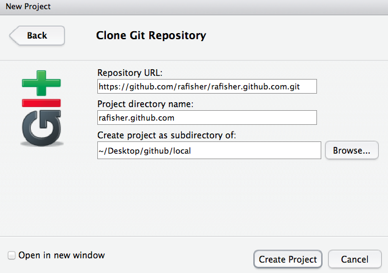</div>

-------

* To make changes, you _could_ hand edit the "index.html" file and push those changes back to GitHub and/or just start over. <div class="centered">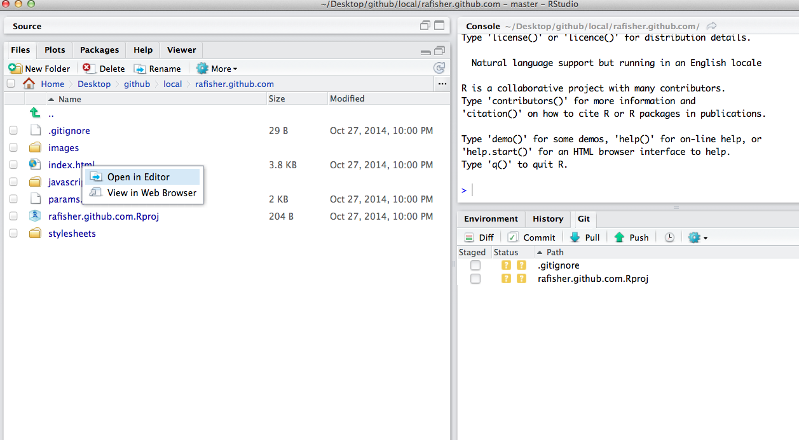</div>

## A disclaimer

* This "Automatic Page Generation" option is easy, but it might be _too_ easy for some (hard to extend/customize).
* Writing html is __painful__, which is why [Markdown](http://cpsievert.github.io/slides/markdown) (a set of rules for producing HTML from plain text) was created.
* If you want to keep a blog, you may want to consider learning about:
    (1) [Jekyll](http://jekyllrb.com/) -- a framework for creating websites/blogs from Markdown.
    (2) [knitr-jekyll](https://github.com/yihui/knitr-jekyll) -- weave your R code/output into blog posts using R Markdown! (beware, Yihui has said this isn't quite ready)
* This next approach to creating webpages is a bit more flexible in the sense that you have control over how html files are generated.
    
# Using the gh-pages branch (demo)

-------

* Go to <http://github.com/new> and create a repo <div class="centered">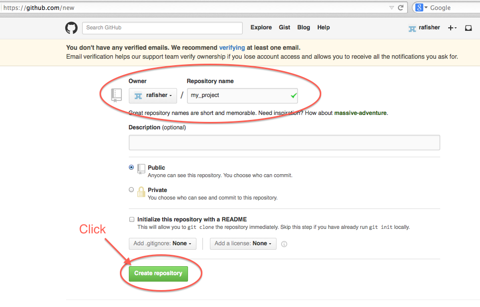</div>

-------

* Copy the remote <div class="centered">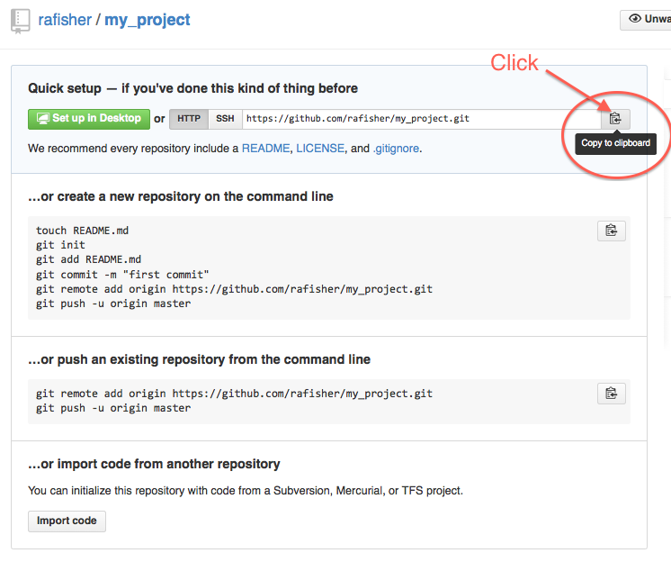</div>

------ 

* Open RStudio -> File -> New Project -> Version Control: <div class="centered"></div>

-------

* Choose git project: <div class="centered"></div>
* Paste the remote into the "Repository URL" field: <div class="centered">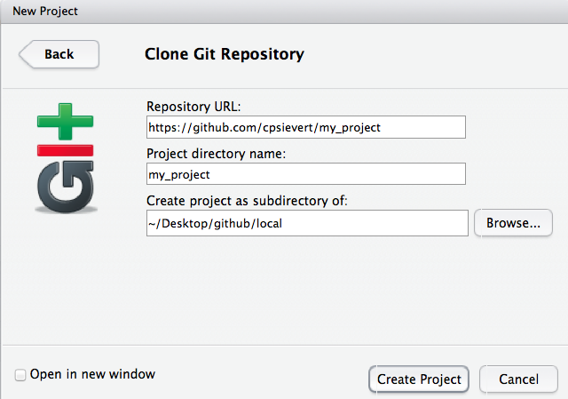</div>

-------

* File -> New File -> R Markdown: <div class="centered">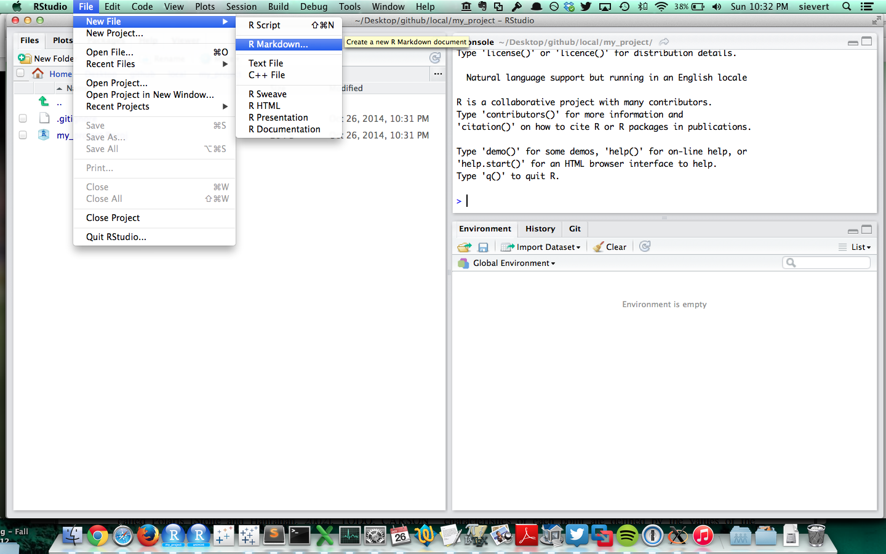</div>
* File -> Save As. Name it "index.Rmd" <div class="centered">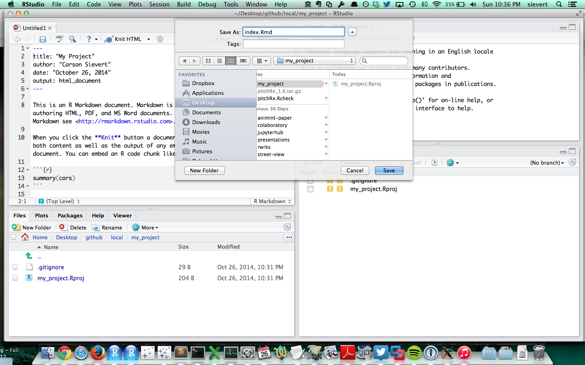</div>

-------

* Click "Knit HTML" button: <div class="centered">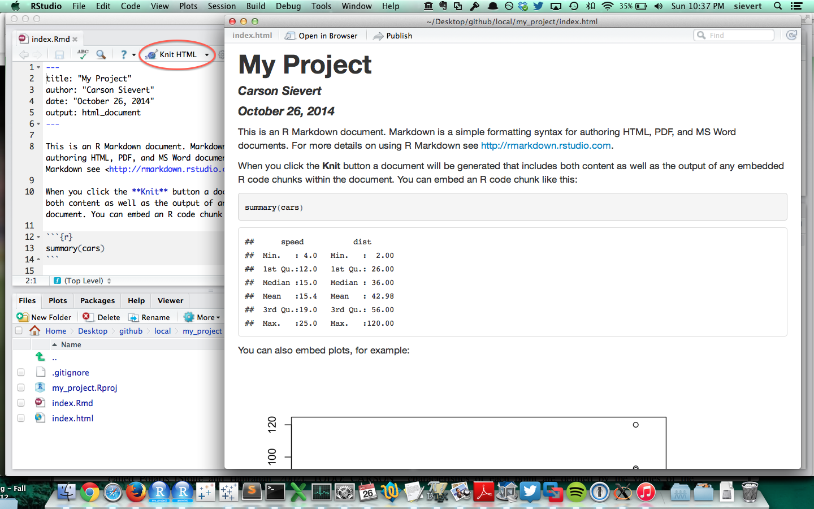</div>

-------

* Go to Start -> All Programs -> Git -> Git Bash.
* Navigate to the my_project directory.

-------

Push files to the special gh-pages branch
```html
$ git branch
* master

$ git checkout -b gh-pages
Switched to a new branch 'gh-pages'

$ git branch
* gh-pages
  master
  
$ ls
index.Rmd         index.html        my_project.Rproj

$ git add *
$ git commit -m "Initial Commit"
$ git push origin gh-pages
Total 0 (delta 0), reused 0 (delta 0)
To https://github.com/cpsievert/my_project
 * [new branch]      gh-pages -> gh-pages
```

--------

* Go to <http://username.github.com/my_project> and celebrate! <p></p><div class="centered"></div>

-------

Some other publishing options

* <http://rpubs.com/> <div class="centered">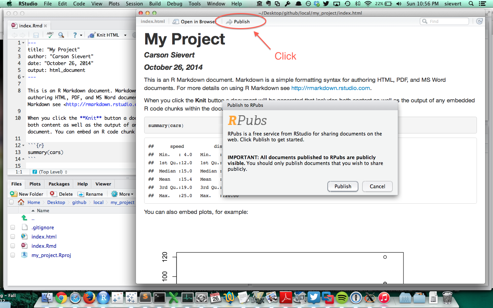</div>
* <https://www.shinyapps.io/> (useful for shiny apps)  <div class="centered"></div>

## That's it, thanks for listening!

I'm glad to stick around and answer any questions...
