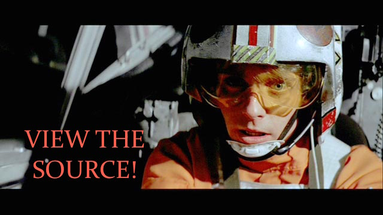
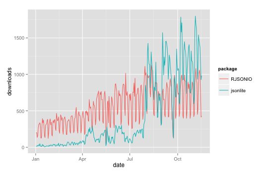

```{r setup, echo=FALSE, message=FALSE}
library(knitr)
opts_chunk$set(message = FALSE, cache = TRUE, warning = FALSE)
```

## Data is messy (especially on the web)!

* As statisticians, we typically think of data in a [tidy](http://vita.had.co.nz/papers/tidy-data.pdf) (i.e., tabular) format. That is
    * rows == observations (often sharing an observational unit)
    * columns == various observational attributes
* This is a convenient statistical modeling framework, but data hardly ever begins in this tidy format (especially on the web).
* This talk will provide a quick overview of popular methods for acquiring info/data from the web using R.
* If you get nothing else from this talk, just remember to...

---

<div align = "center">
  
</div>

## Motivating Example

<iframe src = "http://en.wikipedia.org/wiki/Table_%28information%29" width = "800px" height = "600px"></iframe>

---

[rvest](https://github.com/hadley/rvest) is a nice R package for web-scraping by (you guessed it) Hadley Wickham.

```{r, eval=FALSE, echo=FALSE}
library(XML)
doc <- htmlParse("http://en.wikipedia.org/wiki/Table_(information)")
node <- getNodeSet(doc, "//table[@class='wikitable']")
readHTMLTable(node[[1]])
```

```{r}
library(rvest)
# First, grab the page source
html("http://en.wikipedia.org/wiki/Table_(information)") %>%
  # then extract the first node with class of wikitable
  html_node(".wikitable") %>% 
  # then convert the HTML table into a data frame
  html_table()
```

* __Note__: `html_table` only works on 'nicely' formatted HTML tables.

---

This is a nice format? Really? Yes, really. It's the format used to render tables on webpages.

```html
<table class="wikitable">
  <tr>
    <th>First name</th>
    <th>Last name</th>
    <th>Age</th>
  </tr>
  <tr>
    <td>Bielat</td>
    <td>Adamczak</td>
    <td>24</td>
  </tr>
  <tr>
    <td>Blaszczyk</td>
    <td>Kostrzewski</td>
    <td>25</td>
  </tr>
  <tr>
    <td>Olatunkboh</td>
    <td>Chijiaku</td>
    <td>22</td>
  </tr>
</table> 
```

# What if we want info that isn't packaged neatly in `<table>`?

## (selectorgadget + rvest) to the rescue!

* [Selectorgadget](http://selectorgadget.com/) is a [Chrome browser extension](https://chrome.google.com/webstore/detail/selectorgadget/mhjhnkcfbdhnjickkkdbjoemdmbfginb?hl=en) for quickly identifying/selecting parts of an HTML page.
* With some user feedback, the gadget will tell you what [CSS selector](http://www.w3.org/TR/2011/REC-css3-selectors-20110929/) will return the highlighted page elements.
* Let's try it out on [this page](http://www.sec.gov/litigation/suspensions.shtml)

## Extracting links to reports

```{r}
html("http://www.sec.gov/litigation/suspensions.shtml") %>%
    html_nodes("p+ table a") %>% head
```

```{r}
html("http://www.sec.gov/litigation/suspensions.shtml") %>%
    html_nodes("p+ table a") %>% html_attr(name="href") %>% head
```

## Your turn

* Extract links to the personal websites of all ISU Statistics Faculty -- <http://www.stat.iastate.edu/people/faculty/>
* __Hint__: selectorgadget will be useful here!

## Your turn solution

```{r}
html("http://www.stat.iastate.edu/people/faculty/") %>%
  html_nodes("#content a") %>% html_attr(name="href") -> hrefs
head(hrefs)
```

## Access the DOM with RSelenium

Useful if you need access to the [DOM](http://en.wikipedia.org/wiki/Document_Object_Model), not just the page source.

Just to demo, let's browse through faculty pages.

```{r, eval = FALSE}
library(RSelenium)
startServer()
remDr <- remoteDriver(browserName="firefox")
remDr$open()
for (i in hrefs) {
  Sys.sleep(2)
  remDr$navigate(i) # at this point, you could remDr$getPageSource()
}
```

* We use RSelenium to test whether [animint](https://github.com/tdhock/animint) interactive plots behave correctly.
* I've also used it to scrape websites that have to be rendered in a browser in order to access certain info.

## Common data exchange formats

* So far we've briefly covered how to extract information from HTML pages.
* HTML is great for _sharing content_ between _people_, but it isn't great for _exchanging data_ between _machines_.
* There are _a ton_ of different ways to exchange data over the web, but by far the most popular ones are XML and JSON.

## What is XML?

XML is a markup language that looks very similar to HTML.

```xml
<mariokart>
  <driver name="Bowser" occupation="Koopa">
    <vehicle speed="55" weight="25"> Wario Bike </vehicle>
    <vehicle speed="40" weight="67"> Piranha Prowler </vehicle>
  </driver>
  <driver name="Peach" occupation="Princess">
    <vehicle speed="54" weight="29"> Royal Racer </vehicle>
    <vehicle speed="50" weight="34"> Wild Wing </vehicle>
  </driver>
</mariokart>
```

* This example shows that XML can (and is) used to store inherently tabular data ([thanks Jeroen Ooms for the fun example](http://arxiv.org/pdf/1403.2805v1.pdf))
* What is are the observational units here? How many observations in total?
* Two units and 6 total observations (4 vehicles and 2 drivers).

---

[XML2R](https://github.com/cpsievert/XML2R) is a framework to simplify acquistion of tabular/relational XML.

```{r, eval = FALSE}
# devtools::install_github("cpsievert/XML2R")
library(XML2R)
obs <- XML2Obs("http://bit.ly/mario-xml")
table(names(obs))
```

```{r, echo = FALSE}
# hopefully no one is watching
library(XML2R)
obs <- XML2Obs("http://bit.ly/mario-xml", quiet = TRUE)
table(names(obs))
```

---

```{r}
obs # named list of matrices. Each matrix is *guaranteed* to have 1 row.
```

---

```{r}
collapse_obs(obs) # groups observations by their name/unit
```

* What information have I lost by combining observations of the same unit into the same table?
* I can't map vehicles to the drivers!

---

```{r}
obs <- add_key(obs, parent = "mariokart//driver", recycle = "name")
collapse_obs(obs)
```

---

Now (if I want) I can merge the tables into a single table...

```{r}
tabs <- collapse_obs(obs)
merge(tabs[[1]], tabs[[2]], by = "name")
```

## Your turn

Turn this XML file into a set of tables (using XML2R) -- <http://gd2.mlb.com/components/game/mlb/year_2011/month_04/day_04/gid_2011_04_04_minmlb_nyamlb_1/players.xml>

## Your turn 'solution'

Using `add_key` is optional here, but it removes the need to hang on to the "game" table.

```{r, results='hide'}
library(magrittr)
XML2Obs("http://gd2.mlb.com/components/game/mlb/year_2011/month_04/day_04/gid_2011_04_04_minmlb_nyamlb_1/players.xml") %>% 
  add_key(parent = "game", recycle = "venue") %>% 
  add_key(parent = "game", recycle = "date") %>%
  collapse_obs -> tabs
```

```{r}
tabs[["game//team//player"]][1:5, c("first", "last", "venue", "date")]
```

## What about JSON?

* JavaScript Object Notation (JSON) is comprised of two components:
    1. arrays => [value1, value2]
    2. objects => {"key1": value1, "key2": [value2, value3]} 
* NOTE: you can also have arrays of objects!
* The referred R package for R <=> JSON conversion has long been [RJSONIO](http://cran.r-project.org/web/packages/RJSONIO/index.html)
* However, [jsonlite](http://cran.r-project.org/web/packages/jsonlite/index.html) is gaining a lot of momentum/attention.
* In fact, [shiny will soon be moving from RJSONIO to jsonlite](https://github.com/rstudio/shiny/issues/572)


## Package downloads from RStudio's CRAN mirror

<div align="center">
  
</div>


## Back to Mariokart {.smaller}

```json
[
    {
        "driver": "Bowser",
        "occupation": "Koopa",
        "vehicles": [
            {
                "model": "Wario Bike",
                "speed": 55,
                "weight": 25
            },
            {
                "model": "Piranha Prowler",
                "speed": 40,
                "weight": 67
            }
        ]
    },
    {
        "driver": "Peach",
        "occupation": "Princess",
        "vehicles": [
            {
                "model": "Royal Racer",
                "speed": 54,
                "weight": 29
            },
            {
                "model": "Wild Wing",
                "speed": 50,
                "weight": 34
            }
        ]
    }
]
```


---

```{r}
library(jsonlite)
mario <- fromJSON("http://bit.ly/mario-json")
str(mario) # nested data.frames?!? 
```

---

```{r}
mario$driver
mario$vehicles
```

How do we get two tables (with a common id) like the XML example?

---

```{r}
# this mapply statement is essentially equivalent to add_key
vehicles <- mapply(function(x, y) cbind(x, driver = y), 
                   mario$vehicles, mario$driver, SIMPLIFY = FALSE)
rbind.pages(vehicles)
mario[!grepl("vehicle", names(mario))]
```

## Thanks! Any questions?

<div align = "center">
  
</div>


