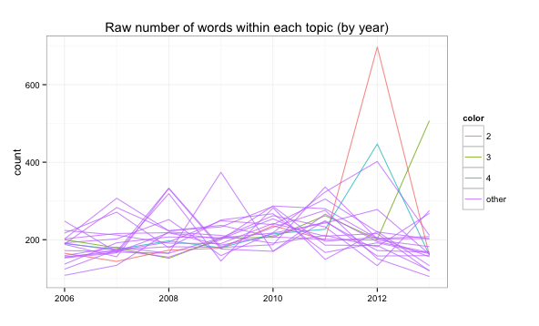
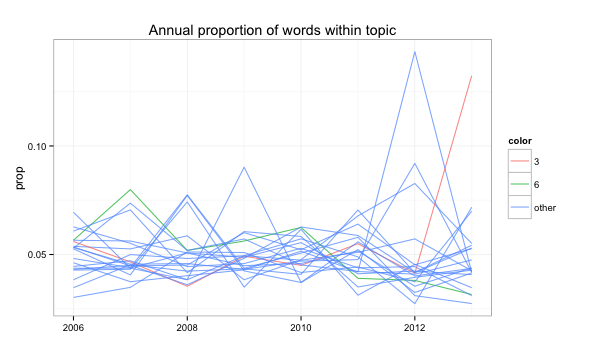

Finding structure in xkcd comics with Latent Dirichlet Allocation
========================================================

```{r setup, echo=FALSE, message=FALSE, warning=FALSE}
library(knitr)
render_html()
```

[xkcd](http://xkcd.com) is self-proclaimed as "a webcomic of romance, sarcasm, math, and language". There was a [recent effort](http://www.hotdamndata.com/2013/10/xkcd-webcomic-of-internet-small-talk.html) to quantify whether or not these "topics" agree with topics derived from the xkcd text corpus using [Latent Dirichlet Allocation](http://en.wikipedia.org/wiki/Latent_Dirichlet_allocation) (LDA). That analysis makes the all too common folly of choosing an arbitrary number of topics. Maybe xkcd's tagline does provide a strong prior belief of a small number of topics, but here we take a more objective approach and let the data choose the number of topics. An "optimal" number of topics is found using the Bayesian model selection approach (with uniform prior belief on the number of topics) suggested by Griffiths and Steyvers ([2004](http://psiexp.ss.uci.edu/research/papers/sciencetopics.pdf)). After an optimal number is decided, topic interpretations and trends over time are explored.

What exactly is LDA?
---------------------

Unlike many other text classification models, LDA is a special case of a [statistical mixture model](http://en.wikipedia.org/wiki/Mixture_model). As a result, each document (in our case, comic) is assumed to be _mixture_ of latent topics. That is, each observed word originates from a topic that we do not directly observe. For demonstration purposes, consider the following xkcd comic given a hypothetical model with four topics: "romance" (in red), "sarcasm" (in blue), "math" (in black), and "language" (in green). 

<div align="center">
  
</div>

Notice that "a", "to", and "of" are not assigned a topic. These are common [stopwords](http://en.wikipedia.org/wiki/Stop_words) that are filtered out before model fitting because they are seen as uninformative. Tabulating the words that were classified, this document could be summarized as having 5/17 "romance", 5/17 "sarcasm", 4/17 "math", and 3/17 "language".

As we will see in a moment, each topic owns a unique probability distribution over the entire vocabulary of words. In our toy example, the "math" topic might have a 0.03 probability of spitting out "number" where as the "romance" topic might have 0.0001 probability of spitting out that same word.

Now that we have a bit of intuition, let's describe the model mathematically. Let the random variable $w_i$
denote the $i^{th}$ [token](http://en.wikipedia.org/wiki/Tokenizing) where $i \in \{1, \dots, N\}$. For a fixed vocabulary size $v \in \{1, \dots, V\}$, the probability of observing word $i$ in a document $d_i \in \{1, \dots, D\}$ can be expressed as:

$$
P(w_i = v) = \sum_{j=1}^T P(w_i = v | z_i = j)P(z_i = j)
$$

where $z_i \in \{1, \dots, T\}$ for a given number of topics $T$. The two main probabilities of interest here are $\phi_i^{(j)} = P(w_i = v | z_i = j)$ and $\theta_j^{(d_i)} = P(z_i = j)$. It can help to think of these quantities as matrices. The term-topic matrix $\Phi$ is $V$ by $T$ - where the $j^{th}$ column contains the probability distribution over words for topic $j$. The topic-document matrix $\Theta$ is $T$ by $D$ - where the $d^{th}$ column contains the topic probabilities for document $d$.

It's common to think about this model in a hierarchical Bayes setting where Dirichlet priors are assigned to the parameters $\phi$ and $\theta$. The Dirichlet prior is used mainly for convenience as it is conjugate for the Multinomial distribution. In the notation of Griffiths and Steyvers, the data generating model can be written as:

$$
\begin{align*}
w_i | z_i, \phi^{(z_i)} &\sim Multinomial(\phi^{(z_i)}, 1)
\\ \phi &\sim Dirichlet(\beta)
\\ z_i | \theta^{(d_i)} &\sim Multinomial(\theta^{(d_i)}, 1)
\\ \theta &\sim Dirichlet(\alpha)
\end{align*}
$$

It's also common to use symmetric hyperparameters $\alpha$ and $\beta$, so these are usually thought of as scalar values. The benefit here is that we can integrate out $\phi$ and $\theta$ and use a collapsed Gibbs algorithm to obtain samples from the target distribution $p(\textbf{z}|\textbf{w}, T)$. Posterior samples of $\textbf{z}$ can then be used to construct estimates of $\phi$ and $\theta$. This algorithm has many implementations, but I chose to use the [R](http://cran.r-project.org/) package [LDAviz](https://github.com/kshirley/LDAviz) for model fitting and post-processing.

Finding an optimal number of topics
---------------------------------------

Given values for the hyperparameters $\alpha$ and $\beta$, one can find an "optimal" number of topics via Bayesian model selection:

$$
\max_T\{ p(T| \textbf{w}) \} = \max_T\{ p(\textbf{w}|T)p(T) \}
$$

Using a uniform prior for $p(T)$, we have $\max_T p(\textbf{w}|T)$. Unfortunately, computing $p(\textbf{w}|T)$ requires summing over all possible assignments of words to topics which is often unfeasible. Griffiths & Steyvers suggest approximating $p(\textbf{w}|T)$ via a harmonic mean estimator:

$$
p(w|T) \approx (\frac{1}{M} \sum^M_{m=1} p(\textbf{w} | \textbf{z}_m, T)^{-1})^{-1}
$$

where $\textbf{z}_m$ is the $m^{th}$ sample from the posterior $p(\textbf{z} | \textbf{w}, T)$. 


Scraping and pre-processing xkcd corpus
---------------------------------------

Thankfully xkcd keeps an [archive](http://xkcd.com/archive/) of all their comics with url paths and corresponding dates. Also, most comics are transcribed complete with scene descriptions, speaker ids, and "meta" alternative text. In this analysis, both scene descriptions and speaker ids were removed from the text corpus. It's also worth noting that, [especially](http://xkcd.com/1299/) [recently](http://xkcd.com/1300/), transcribers have been [lazy](http://xkcd.com/444/) because transcripts are missing. Luckily, in most of those cases, there is "meta" alternative text in the HTML `` tag that was used instead. [This script](https://github.com/cpsievert/cpsievert.github.com/blob/master/projects/615/xkcd/scrape.R) shows how to scrape the data. [This script](https://github.com/cpsievert/cpsievert.github.com/blob/master/projects/615/xkcd/preprocess.R) shows the other pre-processing such as removing stop-words and stemming.

Fitting the model
-------------------------------

The collapsed Gibbs sampler implemented in [LDAviz](https://github.com/kshirley/LDAviz) was used to fit models with 5, 10, ..., 50 topics. In each case, three chains (with randomized starting values) were each run for 1000 iterations. Convergence was monitored by tracking the log-likelihood and computing the potential scale reduction factor using the [coda](http://cran.r-project.org/web/packages/coda/index.html) package. As seen below, all of the upper confidence intervals for the reduction factor are well within the reasonable range.

```{r Rhats, echo=FALSE, results='asis'}
load("Rhats.rda")
kable(Rhats, format="html")
```

After convergence was reached, 1000 samples from each posterior was obtained. From these samples, $\log p(w|T)$ was approximated using the approach discussed earlier. A confidence interval accounting for the approximation of the Monte Carlo estimates were also computed, but the bounds were no bigger than the points on the figure below. 

<div align="center">
  
</div>

The value of $\log p(w|T)$ reaches it's maximum at 20 topics. In some sense, $T$ can be thought of as a model complexity parameter. In that regard, this figure is in line with our intuition that a small number of topics fails to explain structure in the data while too many topics will tend to pick up on noise in the data. 

Exploring topics through time
-------------------------------

xkcd has released one comic per day every day since January 1st, 2006. Using these dates, the number of words within each topic for each year was computed and presented in the figure below.

<div align="center">
  
</div>

Clearly, the number of words appearing topic 2 during 2012 was much larger than any other topic in any other year. Note that in 2006 there are noticeably fewer total words. This is not surprising after looking at [the](http://xkcd.com/1/) [early](http://xkcd.com/2/) [xkcd](http://xkcd.com/3/) [comics](http://xkcd.com/4/). For this reason, the number of words within a topic for a particular year were divided by the total number of words in that year. This yields the proportion of words within each topic for each year in the figure below.

<div align="center">
  
</div>

Perhaps a more interesting observation than the large spike in 2012 is exploring upward and downward trends in topics. In particular, the slope of a simple linear regression with proportion of words as the response and time as our explanatory variable will give a sense of which topics are gaining or losing popularity. In this respect, topic 3 is increasing at the largest rate (due to the big spike in 2013) and topic 6 is decreasing at the largest rate.

<div align="center">
  
</div>

Another metric used to assess topic "volume" involves classifying each comic into the topic which describes the highest proportion of that comic. Using a similar regression approach, this time on the proportion of _comics_ classified within each topic, it turns out that topic 12 is increasing at the largest rate and topic 6 (once again) is decreasing at the largest rate.

<div align="center">
  
</div>

Topic Interpretation
-------------------------------

One of the hardest components to any topic model analysis is topic interpretation. The problem essentially boils down to finding a small set of keywords that are most "relevant" or "informative" to a given topic's meaning. There are many ways we could define "relevance", but many times people tend to focus just on the words with the highest probability within a topic. As I will explain shortly, we can take a more flexible approach.

The window below contains a tool for visualizing the model output in an interactive way ([click here](http://glimmer.rstudio.com/cpsievert/xkcd/) if nothing shows up). If you hover your mouse over the circle labeled "6", the bar chart changes to reflect the most "relevant" words for topic 6. In this case, the most relevant words are "hey", "girl", "real", "sorri", "littl", "parti". This topic must be related to the trials and tribulations of romance. Note that by clicking on any of the topics, the web links to comics with the highest proportion of words from that topic are provided at the bottom of the window. For example, [http://xkcd.com/276/](http://xkcd.com/276/) has the highest proportion of words (among all comics) belonging to topic 6. Since this topic is on the decline, maybe xkcd is getting a bit more mature with age (at least in this respect)?

<iframe src="http://glimmer.rstudio.com/cpsievert/xkcd/" width="1000" height="1000"></iframe>

Note that some of the most "relevant" words for topic 6 are rather obscure and occur only a few times in the entire text corpus. In this case, it makes sense use the slider at the top of window to increase the value of lambda. To understand why, consider the definition of relevance:

$$
relevance = \lambda * log(P(w_i = v | z_i = j)) + (1 - \lambda) * log(P(w_i = v | z_i = j)/P(w_i = v))
$$

In some sense, we can think of _relevance_ as a compromise between a measure that tends to over-rank words that have a _high_ overall probability of occurring and a measure that tends to over-rank words that have a _low_ overall probability of occurring. Since this is a relatively small data set, we probably want to use a value of $\lambda$ closer to 1 (than the default of 1/3). 

To demonstrate this idea, change the value of $\lambda$ to 1 and select topic 6. The word "guy" has now been introduced as a keyword. Notice the difference between the probability of "guy" within topic 6 (in red) and overall (in gray). One may now be interested in what other topics "guy" appears. By hovering over the label "guy", the distribution over topics is revealed in the sizing of the circles and it becomes obvious that "guy" is heavily concentrated under topic 17.

Another option, which is useful for gaining a higher level understanding of the "landscape of topics", is the slider labelled "Number of Clusters". Try changing the value from 1 to 4. By doing so, we are grouping topics together into clusters of "similar" topics - based on their distribution over words (more details are on the "What's this?" tab). You should now see the three topics in the bottom left-hand portion of the scatterplot grouped together. By hovering over this cluster region, we can again see a list of relevant words, but now defined on this whole grouping of topics. It seems as though this cluster is related to the self-proclaimed "romance" theme.

Conclusion
-------------------------------

Hopefully you (the reader) will take time to explore different topics and find interesting things that I have not. To be honest, I found that some of the topics are hard to decipher. If you're a fan of xkcd, you're probably aware that their comics are sometimes hard to understand and often have hidden messages or implicit meaning (Heck, there's even a [website](http://www.explainxkcd.com/wiki/index.php/Main_Page) devoted to explaining xkcd comics). Since this is a bag-of-words model, it isn't that surprising that the model may be sub-optimal. Perhaps introducing bi-grams or even n-grams into the model would help in this respect.

Acknowledgements
-------------------------------

Special thanks to my collaborator [Kenny Shirley](http://www2.research.att.com/~kshirley/) for helpful comments and his work on [LDAviz](https://github.com/kshirley/LDAviz).